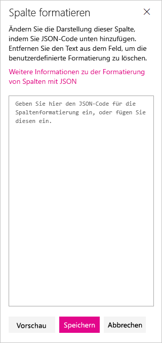

# <a name="use-column-formatting-to-customize-sharepoint"></a><span data-ttu-id="40817-101">Anpassen von SharePoint mithilfe von Spaltenformatierungen</span><span class="sxs-lookup"><span data-stu-id="40817-101">Use column formatting to customize SharePoint</span></span>

> [!IMPORTANT]
> <span data-ttu-id="40817-102">Spaltenformatierungen sind derzeit noch kein produktiv nutzbares Feature.</span><span class="sxs-lookup"><span data-stu-id="40817-102">Column formatting is not yet in production.</span></span> <span data-ttu-id="40817-103">Dieser Dokumentationsartikel ist vorläufig und kann noch verändert werden.</span><span class="sxs-lookup"><span data-stu-id="40817-103">This documentation is in preview and is subject to change.</span></span>

<span data-ttu-id="40817-104">Mithilfe von Spaltenformatierungen können Sie anpassen, wie Felder in SharePoint-Listen und SharePoint-Bibliotheken angezeigt werden.</span><span class="sxs-lookup"><span data-stu-id="40817-104">You can use column formatting to customize how fields in SharePoint lists and libraries are displayed.</span></span> <span data-ttu-id="40817-105">Dazu erstellen Sie ein JSON-Objekt. Es beschreibt die Elemente, die bei der Aufnahme eines Felds in eine Listenansicht angezeigt werden, sowie die Formatvorlagen, die auf diese Elemente angewendet werden sollen.</span><span class="sxs-lookup"><span data-stu-id="40817-105">To do this, you construct a JSON object that describes the elements that are displayed when a field is included in a list view, and the styles to be applied to those elements.</span></span> <span data-ttu-id="40817-106">Spaltenformatierungen haben keine Auswirkungen auf die Daten in einem Listenelement oder einer Datei. Sie ändern nur, wie das Element oder die Datei visuell dargestellt werden, wenn der Benutzer durch die Liste navigiert.</span><span class="sxs-lookup"><span data-stu-id="40817-106">The column formatting does not change the data in the list item or file; it only changes how it’s displayed to users who browse the list.</span></span> <span data-ttu-id="40817-107">Jeder Benutzer mit Berechtigungen zur Erstellung und Verwaltung von Listenansichten kann Spaltenformatierungen definieren, um die Darstellung von Ansichtsfeldern zu konfigurieren.</span><span class="sxs-lookup"><span data-stu-id="40817-107">Anyone who can create and manage views in a list can use column formatting to configure how view fields are displayed.</span></span> 

<span data-ttu-id="40817-108">Eine Liste mit den Feldern „Title“, „Effort“, „Assigned To“ und „Status“ ohne jegliche Anpassungen könnte beispielsweise so aussehen:</span><span class="sxs-lookup"><span data-stu-id="40817-108">For example, a list with the fields Title, Effort, Assigned To, and Status with no customizations applied might look like this:</span></span> 


<span data-ttu-id="40817-110">Eine Liste, in der die Felder „Effort“, „Assigned To“ und „Status“ mithilfe von Spaltenformatierungen angepasst wurden, könnte so aussehen:</span><span class="sxs-lookup"><span data-stu-id="40817-110">A list with the appearance of the Effort, Assigned To, and Status fields customized via column formatting might look like this:</span></span>


## <a name="how-is-column-formatting-different-than-the-field-customizer"></a><span data-ttu-id="40817-112">Was unterscheidet Spaltenformatierungen und den Field Customizer?</span><span class="sxs-lookup"><span data-stu-id="40817-112">How is column formatting different than the Field Customizer?</span></span>
<span data-ttu-id="40817-113">Sowohl mithilfe von Spaltenformatierungen als auch mithilfe der Erweiterung [SharePoint Framework Field Customizer](https://docs.microsoft.com/de-DE/sharepoint/dev/spfx/extensions/get-started/building-simple-field-customizer) können Sie anpassen, wie Felder in SharePoint-Listen visuell dargestellt werden.</span><span class="sxs-lookup"><span data-stu-id="40817-113">Both column formatting and the [SharePoint Framework Field Customizer](https://docs.microsoft.com/de-DE/sharepoint/dev/spfx/extensions/get-started/building-simple-field-customizer) extension enable you to customize how fields in SharePoint lists are displayed.</span></span> <span data-ttu-id="40817-114">Der Field Customizer ist leistungsfähiger, da Sie mit seiner Hilfe beliebigen Code zur Steuerung der Felddarstellung programmieren können.</span><span class="sxs-lookup"><span data-stu-id="40817-114">The Field Customizer is more powerful, because you can use it to write any code you want to control how a field is displayed.</span></span> <span data-ttu-id="40817-115">Spaltenformatierungen lassen sich einfacher und großflächiger anwenden.</span><span class="sxs-lookup"><span data-stu-id="40817-115">Column formatting is more easily and broadly applied.</span></span> <span data-ttu-id="40817-116">Sie sind jedoch weniger flexibel, da sie statt benutzerdefiniertem Code nur einige vordefinierte Elemente und Attribute unterstützen.</span><span class="sxs-lookup"><span data-stu-id="40817-116">However, it is less flexible, because it does not allow for custom code; it only allows for certain predefined elements and attributes.</span></span> 

<span data-ttu-id="40817-117">In der folgenden Tabelle haben wir Spaltenformatierungen und den Field Customizer verglichen.</span><span class="sxs-lookup"><span data-stu-id="40817-117">The following table compares column formatting and the Field Customizer.</span></span>

| <span data-ttu-id="40817-118">Feldtyp</span><span class="sxs-lookup"><span data-stu-id="40817-118">Field Type</span></span>        | <span data-ttu-id="40817-119">Spaltenformatierungen</span><span class="sxs-lookup"><span data-stu-id="40817-119">Column formatting</span></span>          | <span data-ttu-id="40817-120">Field Customizer</span><span class="sxs-lookup"><span data-stu-id="40817-120">Field Customizer changes</span></span>  |
| ------------- |:-------------| :-----|
| <span data-ttu-id="40817-121">Bedingte Formatierungen auf Basis von Elementwerten und Wertebereichen</span><span class="sxs-lookup"><span data-stu-id="40817-121">Conditional formatting based on item values and value ranges</span></span>      | <span data-ttu-id="40817-122">Unterstützt</span><span class="sxs-lookup"><span data-stu-id="40817-122">Supported</span></span> | <span data-ttu-id="40817-123">Unterstützt</span><span class="sxs-lookup"><span data-stu-id="40817-123">Supported</span></span> |
| <span data-ttu-id="40817-124">Aktionslinks</span><span class="sxs-lookup"><span data-stu-id="40817-124">Action links</span></span>       | <span data-ttu-id="40817-125">Unterstützung für statische Links, die keine Skripts starten</span><span class="sxs-lookup"><span data-stu-id="40817-125">Support for static hyperlinks that do not launch script</span></span>      |  <span data-ttu-id="40817-126">Unterstützung für alle Links, einschließlich Links, die benutzerdefinierte Skripts aufrufen</span><span class="sxs-lookup"><span data-stu-id="40817-126">Support for any hyperlink, including those that invoke custom script</span></span>   |
| <span data-ttu-id="40817-127">Datenvisualisierungen</span><span class="sxs-lookup"><span data-stu-id="40817-127">Data visualizations</span></span> | <span data-ttu-id="40817-128">Unterstützung für einfache Visualisierungen, die in HTML und CSS ausgedrückt werden können</span><span class="sxs-lookup"><span data-stu-id="40817-128">Support for simple visualizations that can be expressed using HTML and CSS</span></span>      |   <span data-ttu-id="40817-129">Unterstützung für zufällige Datenvisualisierungen</span><span class="sxs-lookup"><span data-stu-id="40817-129">Support for arbitrary data visualizations</span></span>  |

<span data-ttu-id="40817-130">Falls Sie Ihr Szenario mithilfe von Spaltenformatierungen umsetzen können, sind sie die Option der Wahl, da ihr Einsatz schneller und unkomplizierter ist als die Arbeit mit dem Field Customizer.</span><span class="sxs-lookup"><span data-stu-id="40817-130">If you can accomplish your scenario by using column formatting, it’s typically quicker and easier to do that than to use Field Customizer.</span></span> <span data-ttu-id="40817-131">Jeder Benutzer mit Berechtigungen zur Erstellung und Verwaltung von Listenansichten kann Spaltenformatierungen nutzen, um Anpassungen zu erstellen und zu veröffentlichen.</span><span class="sxs-lookup"><span data-stu-id="40817-131">Anyone who can create and manage views in a list can use column formatting to create and publish customizations.</span></span> <span data-ttu-id="40817-132">Der Field Customizer ist für komplexere Szenarien gedacht, für die keine Spaltenformatierungen unterstützt werden.</span><span class="sxs-lookup"><span data-stu-id="40817-132">Use Field Customizer for more advanced scenarios that column formatting does not support.</span></span>

## <a name="get-started-with-column-formatting"></a><span data-ttu-id="40817-133">Erste Schritte mit Spaltenformatierungen</span><span class="sxs-lookup"><span data-stu-id="40817-133">Get started with column formatting</span></span>
<span data-ttu-id="40817-134">Öffnen Sie das Dropdownmenü unter einer Spalte, um den Bereich für die Spaltenformatierung zu öffnen.</span><span class="sxs-lookup"><span data-stu-id="40817-134">To open the column formatting pane, open the dropdown menu under a column.</span></span> <span data-ttu-id="40817-135">Klicken Sie unter **Spalteneinstellungen** auf **Format this column**.</span><span class="sxs-lookup"><span data-stu-id="40817-135">Under **Column Settings**, choose **Format this column**.</span></span>

<span data-ttu-id="40817-136">Sofern noch kein anderer Benutzer Spaltenformatierungen auf die ausgewählte Spalte angewendet hat, sieht der Bereich wie der Screenshot unten aus.</span><span class="sxs-lookup"><span data-stu-id="40817-136">If no one has used column formatting on the column you selected, the pane will look like the following.</span></span>



<span data-ttu-id="40817-138">Auf Felder ohne Formatierung werden die Standardeinstellungen für das Rendering angewendet.</span><span class="sxs-lookup"><span data-stu-id="40817-138">A field with no formatting specified will use the default rendering.</span></span> <span data-ttu-id="40817-139">Geben Sie den JSON-Code für die Spaltenformatierung in das Feld ein, um die Spalte zu formatieren.</span><span class="sxs-lookup"><span data-stu-id="40817-139">To format a column, enter the column formatting JSON in the box.</span></span>

<span data-ttu-id="40817-140">Eine Vorschau der Formatierung können Sie über **Vorschau** aufrufen.</span><span class="sxs-lookup"><span data-stu-id="40817-140">To preview the formatting, select **Preview**.</span></span> <span data-ttu-id="40817-141">Zum Übernehmen der Änderungen klicken Sie auf **Speichern**.</span><span class="sxs-lookup"><span data-stu-id="40817-141">To commit your changes, select **Save**.</span></span> <span data-ttu-id="40817-142">Sobald Sie gespeichert haben, ist die angewendete Anpassung für jeden Benutzer sichtbar, der die Liste aufruft.</span><span class="sxs-lookup"><span data-stu-id="40817-142">When you save, anyone who views the list will see the customization that you applied.</span></span>

<span data-ttu-id="40817-143">Am einfachsten können Sie Spalten formatieren, wenn Sie ein Beispiel als Grundlage übernehmen und an Ihr spezifisches Feld anpassen.</span><span class="sxs-lookup"><span data-stu-id="40817-143">The easiest way to use column formatting is to start from an example and edit it to apply to your specific field.</span></span> <span data-ttu-id="40817-144">In den folgenden Abschnitten finden Sie Beispiele, die Sie kopieren, einfügen und gemäß Ihren Szenarien bearbeiten können.</span><span class="sxs-lookup"><span data-stu-id="40817-144">The following sections contain examples that you can copy, paste, and edit for your scenarios.</span></span>

## <a name="display-field-values-basic"></a><span data-ttu-id="40817-145">Anzeigen von Feldwerten (einfach)</span><span class="sxs-lookup"><span data-stu-id="40817-145">Display field values (basic)</span></span>

<span data-ttu-id="40817-146">Die einfachste Spaltenformatierung ist eine Formatierung, die den Wert des Felds in einem Element des Typs `<div />` platziert.</span><span class="sxs-lookup"><span data-stu-id="40817-146">The simplest column formatting is one that places the value of the field inside a `<div />` element.</span></span> <span data-ttu-id="40817-147">Dieses Beispiel lässt sich auf Zahlenfelder, Textfelder, Auswahlfelder und Datumsfelder anwenden.</span><span class="sxs-lookup"><span data-stu-id="40817-147">This example works for number, text, choice, and date fields.</span></span>

```JSON
{
   "elmType": "div",
   "txtContent": "@currentField"
}
```
<span data-ttu-id="40817-148">Bei einigen Feldtypen ist zum Abrufen der Werte etwas mehr Code erforderlich.</span><span class="sxs-lookup"><span data-stu-id="40817-148">Some field types require a bit of extra work to retrieve their values.</span></span> <span data-ttu-id="40817-149">Personenfelder werden im System als Objekte dargestellt. Dabei ist der Anzeigename der Person in der Eigenschaft **Title** des Objekts enthalten.</span><span class="sxs-lookup"><span data-stu-id="40817-149">Person fields are represented in the system as objects, and a person’s display name is contained within that object’s **Title** property.</span></span> <span data-ttu-id="40817-150">Hier sehen Sie dasselbe Beispiel wie oben, angepasst für Personenfelder:</span><span class="sxs-lookup"><span data-stu-id="40817-150">This is the same example, modified to work with the person field.</span></span>

```JSON
{
   "elmType": "div",
   "txtContent": "@currentField.Title"
}
```
<span data-ttu-id="40817-151">Nachschlagefelder werden ebenfalls als Objekte dargestellt. Der Anzeigetext wird in der Eigenschaft **lookupValue** gespeichert.</span><span class="sxs-lookup"><span data-stu-id="40817-151">Lookup fields are also represented as objects; the display text is stored in the **lookupValue** property.</span></span> <span data-ttu-id="40817-152">Dieses Beispiel kann auf Nachschlagefelder angewendet werden:</span><span class="sxs-lookup"><span data-stu-id="40817-152">This example works with a lookup field.</span></span>

```JSON
{
   "elmType": "div",
   "txtContent": "@currentField.lookupValue"
}
```

## <a name="apply-conditional-formatting"></a><span data-ttu-id="40817-153">Anwenden bedingter Formatierung</span><span class="sxs-lookup"><span data-stu-id="40817-153">Apply conditional formatting</span></span>
<span data-ttu-id="40817-154">Mithilfe von Spaltenformatierungen können Sie Formatvorlagen, Klassen und Symbole auf Felder anwenden, basierend auf dem in den betreffenden Feldern jeweils enthaltenen Wert.</span><span class="sxs-lookup"><span data-stu-id="40817-154">You can use column formatting to apply styles, classes, and icons to fields, depending on the value inside those fields.</span></span>

### <a name="conditional-formatting-based-on-a-number-range-basic"></a><span data-ttu-id="40817-155">Bedingte Formatierung auf Basis eines Zahlenbereichs (einfach)</span><span class="sxs-lookup"><span data-stu-id="40817-155">Conditional formatting based on a number range (basic)</span></span>
<span data-ttu-id="40817-156">Die Abbildung unten ist ein Beispiel für eine auf einen Zahlenbereich angewendete bedingte Formatierung.</span><span class="sxs-lookup"><span data-stu-id="40817-156">The following image shows an example of conditional formatting applied to a number range.</span></span>


<span data-ttu-id="40817-158">In diesem Beispiel wird mithilfe des bedingten Operators `?` eine Klasse (`sp-field-severity--warning`) auf das übergeordnete Element des Typs `<div />` angewendet, sobald der Wert im aktuellen Feld kleiner oder gleich 70 ist.</span><span class="sxs-lookup"><span data-stu-id="40817-158">This example uses the conditional operator `?` to apply a class (`sp-field-severity--warning`) to the parent `<div />` element when the  value in the current field is less than or equal to 70.</span></span>  <span data-ttu-id="40817-159">Das Feld wird also farblich hervorgehoben, sobald sein Wert kleiner oder gleich 70 ist, und normal dargestellt bei einem Wert größer als 70.</span><span class="sxs-lookup"><span data-stu-id="40817-159">This causes the field to be highlighted when the value is less than or equal to 70, and appear normally if it's greater than 70.</span></span>

```JSON
{
   "elmType": "div",
   "txtContent": "@currentField",
   "attributes": {
      "class": {
         "operator": "?",
         "operands": [
            {
               "operator": "<=",
               "operands": [
                  "@currentField",
                  70
               ]
            },
            "sp-field-severity--warning",
            ""
         ]
      }
   }
}
```

### <a name="conditional-formatting-based-on-the-value-in-a-text-or-choice-field-advanced"></a><span data-ttu-id="40817-160">Bedingte Formatierung auf Basis eines Werts in einem Text- oder Auswahlfeld (komplex)</span><span class="sxs-lookup"><span data-stu-id="40817-160">Conditional formatting based on the value in a text or choice field (advanced)</span></span>

<span data-ttu-id="40817-161">Die Abbildung unten ist ein Beispiel für eine auf ein Text- oder Auswahlfeld angewendete bedingte Formatierung.</span><span class="sxs-lookup"><span data-stu-id="40817-161">The following image shows an example of conditional formatting applied to a text or choice field.</span></span>


<span data-ttu-id="40817-163">Eine bedingte Formatierung lässt sich auf Text- oder Auswahlfelder mit einem festgelegten Satz von Werten anwenden.</span><span class="sxs-lookup"><span data-stu-id="40817-163">You can apply conditional formatting to text or choice fields that might contain a fixed set of values.</span></span> <span data-ttu-id="40817-164">Im folgenden Beispiel werden unterschiedliche Klassen angewendet, je nachdem, ob das Feld den Wert „Done“, den Wert „In review“, den Wert „Blocked“ oder einen anderen Wert hat.</span><span class="sxs-lookup"><span data-stu-id="40817-164">The following example applies different classes depending on whether the value of the field is Done, In Review, Blocked, or another value.</span></span> <span data-ttu-id="40817-165">Konkret wird hier basierend auf dem Feldwert eine CSS-Klasse (`sp-field-severity--low, sp-field-severity--good, sp-field-severity--warning, sp-field-severity--blocked`) auf das Element des Typs `<div />` angewendet.</span><span class="sxs-lookup"><span data-stu-id="40817-165">This example applies a CSS class (`sp-field-severity--low, sp-field-severity--good, sp-field-severity--warning, sp-field-severity--blocked`) to the  `<div />` based on the field's value.</span></span> <span data-ttu-id="40817-166">Anschließend wird ein Element des Typs `<span />` mit einem Attribut `IconName` ausgegeben.</span><span class="sxs-lookup"><span data-stu-id="40817-166">Then, it outputs a `<span />` element with an `IconName` attribute.</span></span> <span data-ttu-id="40817-167">Dieses Attribut wendet eine weitere CSS-Klasse auf das Element des Typs `<span />` an, die innerhalb des Elements ein [Office UI Fabric](https://dev.office.com/fabric#/)-Symbol anzeigt.</span><span class="sxs-lookup"><span data-stu-id="40817-167">This attribute applies another CSS class to that `<span />` that shows an [Office UI Fabric](https://dev.office.com/fabric#/) icon inside that element.</span></span> <span data-ttu-id="40817-168">Abschließend wird ein weiteres Element des Typs `<span />` ausgegeben, das den Wert des Felds enthält.</span><span class="sxs-lookup"><span data-stu-id="40817-168">Finally, another `<span />` element is outputted that contains the value inside the field.</span></span>

<span data-ttu-id="40817-169">Dieses Muster ist nützlich, wenn Sie unterschiedlichen Werten jeweils eine andere Dringlichkeitsstufe oder einen anderen Schweregrad zuordnen möchten.</span><span class="sxs-lookup"><span data-stu-id="40817-169">This pattern is useful when you want different values to map to different levels of urgency or severity.</span></span> <span data-ttu-id="40817-170">Sie können das Beispiel unten bearbeiten, indem Sie eigene Feldwerte angeben und die Formatvorlagen und Symbole definieren, die diesen Werten zugeordnet werden sollen.</span><span class="sxs-lookup"><span data-stu-id="40817-170">You can start from this example and edit it to specify your own field values and the styles and icons that should map to those values.</span></span>
<!-- The schema URL will need to be updated when it is changed from customformatter to columnformatting -->
```JSON
{
    "$schema": "http://columnformatting.sharepointpnp.com/columnFormattingSchema.json",
    "debugMode": true,
    "elmType": "div",
    "attributes": {
        "class": {
            "operator": "?",
            "operands": [
                {
                    "operator": "==",
                    "operands": [
                        {
                            "operator": "toString()",
                            "operands": [
                                "@currentField"
                            ]
                        },
                        "Done"
                    ]
                },
                "sp-field-severity--good",
                {
                    "operator": "?",
                    "operands": [
                        {
                            "operator": "==",
                            "operands": [
                                {
                                    "operator": "toString()",
                                    "operands": [
                                        "@currentField"
                                    ]
                                },
                                "In progress"
                            ]
                        },
                        "sp-field-severity--low",
                        {
                            "operator": "?",
                            "operands": [
                                {
                                    "operator": "==",
                                    "operands": [
                                        {
                                            "operator": "toString()",
                                            "operands": [
                                                "@currentField"
                                            ]
                                        },
                                        "In review"
                                    ]
                                },
                                "sp-field-severity--warning",
                                {
                                    "operator": "?",
                                    "operands": [
                                        {
                                            "operator": "==",
                                            "operands": [
                                                {
                                                    "operator": "toString()",
                                                    "operands": [
                                                        "@currentField"
                                                    ]
                                                },
                                                "Blocked"
                                            ]
                                        },
                                        "sp-field-severity--severeWarning",
                                        "sp-field-severity--blocked"
                                    ]
                                }
                            ]
                        }
                    ]
                }
            ]
        }
    },
    "children": [
        {
            "elmType": "span",
            "style": {
                "display": "inline-block",
                "padding": "0 4px"
            },
            "attributes": {
                "iconName": {
                    "operator": "?",
                    "operands": [
                        {
                            "operator": "==",
                            "operands": [
                                {
                                    "operator": "toString()",
                                    "operands": [
                                        "@currentField"
                                    ]
                                },
                                "Done"
                            ]
                        },
                        "CheckMark",
                        {
                            "operator": "?",
                            "operands": [
                                {
                                    "operator": "==",
                                    "operands": [
                                        {
                                            "operator": "toString()",
                                            "operands": [
                                                "@currentField"
                                            ]
                                        },
                                        "In progress"
                                    ]
                                },
                                "Forward",
                                {
                                    "operator": "?",
                                    "operands": [
                                        {
                                            "operator": "==",
                                            "operands": [
                                                {
                                                    "operator": "toString()",
                                                    "operands": [
                                                        "@currentField"
                                                    ]
                                                },
                                                "In review"
                                            ]
                                        },
                                        "Error",
                                        {
                                            "operator": "?",
                                            "operands": [
                                                {
                                                    "operator": "==",
                                                    "operands": [
                                                        {
                                                            "operator": "toString()",
                                                            "operands": [
                                                                "@currentField"
                                                            ]
                                                        },
                                                        "Has issues"
                                                    ]
                                                },
                                                "Warning",
                                                "ErrorBadge"
                                            ]
                                        }
                                    ]
                                }
                            ]
                        }
                    ]
                }
            }
        },
        {
            "elmType": "span",
            "txtContent": "@currentField"
        }
    ]
}

```

## <a name="apply-formatting-based-on-date-ranges"></a><span data-ttu-id="40817-171">Anwenden von Formatierungen auf Basis von Datumsbereichen</span><span class="sxs-lookup"><span data-stu-id="40817-171">Apply formatting based on date ranges</span></span>
<span data-ttu-id="40817-172">Termine und wichtige Projektzeitachsen werden häufig anhand von Datumsangaben nachverfolgt. Ein gängiges Szenario ist dabei die Anwendung von Formatierungen auf Basis des Werts in einem Datum/Uhrzeit-Feld.</span><span class="sxs-lookup"><span data-stu-id="40817-172">Because dates are often used to track deadlines and key project timelines, a common scenario is to apply formatting based on the value in a date/time field.</span></span> <span data-ttu-id="40817-173">Nutzen Sie die unten beschriebenen Muster, um Formatierungen basierend auf dem Wert eines Datum/Uhrzeit-Felds anzuwenden.</span><span class="sxs-lookup"><span data-stu-id="40817-173">To apply formatting based on the value in a date/time field, apply the following patterns.</span></span>

### <a name="formatting-an-item-when-a-date-column-is-before-or-after-todays-date-advanced"></a><span data-ttu-id="40817-174">Formatieren eines Elements, sobald der Wert einer Datumsspalte ein Datum vor oder nach dem aktuellen Datum ist (komplex)</span><span class="sxs-lookup"><span data-stu-id="40817-174">Formatting an item when a date column is before or after today's date (advanced)</span></span>

<span data-ttu-id="40817-175">Die folgende Abbildung zeigt ein Feld, auf das eine bedingte Datumsformatierung angewendet wurde.</span><span class="sxs-lookup"><span data-stu-id="40817-175">The following image shows a field with conditional date formatting applied.</span></span>


<span data-ttu-id="40817-177">Bei diesem Beispiel wird das aktuelle Feld rot gefärbt, wenn der Wert des Felds „DueDate“ vor dem aktuellen Datum/der aktuellen Uhrzeit liegt.</span><span class="sxs-lookup"><span data-stu-id="40817-177">This example colors the current field red when the value inside an item's DueDate is before the current date/time.</span></span> <span data-ttu-id="40817-178">Im Gegensatz zu einigen der vorherigen Beispiele ist die Formatierung des Felds also abhängig vom Wert eines anderen Felds.</span><span class="sxs-lookup"><span data-stu-id="40817-178">Unlike some of the previous examples, this example applies formatting to one field by looking at the value inside another field.</span></span> <span data-ttu-id="40817-179">Wie Sie sehen, wird zur Referenzierung des Felds „DueDate“ die Syntax [$FieldName] verwendet.</span><span class="sxs-lookup"><span data-stu-id="40817-179">Note that DueDate is referenced using the [$FieldName] syntax.</span></span> <span data-ttu-id="40817-180">Dabei ist „FieldName“ der interne Name des Feldes.</span><span class="sxs-lookup"><span data-stu-id="40817-180">FieldName is assumed to be the internal name of the field.</span></span> <span data-ttu-id="40817-181">Außerdem wird in diesem Beispiel ein besonderer Wert gesetzt, der speziell in Datum/Uhrzeit-Feldern verwendet werden kann: `@now`, der auf das aktuelle Datum/die aktuelle Uhrzeit auflöst und ausgewertet wird, sobald der Benutzer die Listenansicht lädt.</span><span class="sxs-lookup"><span data-stu-id="40817-181">This example also takes advantage of a special value that can be used in date/time fields - `@now`, which resolves to the current date/time, evaluated when the user loads the list view.</span></span>

```JSON
{

   "elmType": "div",
   "txtContent": "@currentField",
   "style": {
      "color": {
         "operator": "?",
         "operands": [
            {
               "operator": "<=",
               "operands": [
                  "[$DueDate]",
                  "@now"
               ]
            },
            "#ff0000",
            ""
         ]
      }
   }
}
```

### <a name="formatting-items-based-on-arbitrary-dates-advanced"></a><span data-ttu-id="40817-182">Formatieren von Elementen auf Basis zufälliger Datumsangaben (komplex)</span><span class="sxs-lookup"><span data-stu-id="40817-182">Formatting items based on arbitrary dates (advanced)</span></span>
<span data-ttu-id="40817-183">Mithilfe des Musters im folgenden Beispiel können Sie den Wert eines Datum/Uhrzeit-Felds mit einem anderen Datum als dem im Wert `@now` definierten Datum vergleichen.</span><span class="sxs-lookup"><span data-stu-id="40817-183">To compare the value of a date/time field against a date that's not `@now`, follow the pattern in the following example.</span></span> <span data-ttu-id="40817-184">Das Beispiel unten färbt das aktuelle Feld rot, wenn der Wert für „DueDate“ kleiner oder gleich dem jeweils morgigen Datum ist.</span><span class="sxs-lookup"><span data-stu-id="40817-184">The following example colors the current field red if the due date was <= tomorrow.</span></span> <span data-ttu-id="40817-185">Dazu wird mit Datumsmathematik gearbeitet.</span><span class="sxs-lookup"><span data-stu-id="40817-185">This is accomplished using date math.</span></span> <span data-ttu-id="40817-186">Wenn zu einem Datum Millisekunden addiert werden, erhalten Sie als Ergebnis ein neues Datum.</span><span class="sxs-lookup"><span data-stu-id="40817-186">You can add milliseconds to any date, and the result will be a new date.</span></span> <span data-ttu-id="40817-187">Soll zu einem Datum beispielsweise 1 Tag hinzuaddiert werden, würden Sie (246060 × 1000 = 86.400.000) hinzuaddieren.</span><span class="sxs-lookup"><span data-stu-id="40817-187">For example, to add a day to a date, you'd add (246060*1000 = 86,400,000).</span></span> 
```JSON
{
   "elmType": "div",
   "txtContent": "@currentField",
   "style": {
      "color": {
         "operator": "?",
         "operands": [
            {
               "operator": "<=",
               "operands": [
                  "[$DueDate]",
                  {
                     "operator": "+",
                     "operands": [
                        "@now",
                        86400000
                     ]
                  }
               ]
            },
            "#ff0000",
            ""
         ]
      }
   }
}
```
<span data-ttu-id="40817-188">Wenn Sie den Wert eines Datum/Uhrzeit-Felds mit einer anderen Datumskonstante abgleichen möchten, konvertieren Sie mithilfe der Methode **Date()** eine Zeichenfolge in ein Datum.</span><span class="sxs-lookup"><span data-stu-id="40817-188">To compare a date/time field value against another date constant, use the **Date()** method to convert a string to a date.</span></span> <span data-ttu-id="40817-189">Das Beispiel unten färbt das aktuelle Feld rot, wenn der Wert im Feld „DueDate“ ein früheres Datum ist als der 22.03.2017.</span><span class="sxs-lookup"><span data-stu-id="40817-189">The following example colors the current field red if the value in the DueDate field is before 3/22/2017.</span></span>
```JSON
{
   "elmType": "div",
   "txtContent": "@currentField",
   "style": {
      "color": {
         "operator": "?",
         "operands": [
            {
               "operator": "<=",
               "operands": [
                  "[$DueDate]",
                  {
                     "operator": "Date()",
                     "operands": [
                        "3/22/2017"
                     ]
                  }
               ]
            },
            "#ff0000",
            ""
         ]
      }
   }
}
```

## <a name="create-clickable-actions"></a><span data-ttu-id="40817-190">Erstellen klickbarer Aktionen</span><span class="sxs-lookup"><span data-stu-id="40817-190">Create clickable actions</span></span>
<span data-ttu-id="40817-191">Mithilfe von Spaltenformatierungen können Sie Links implementieren, die auf andere Webseiten führen oder benutzerdefinierte Funktionen starten.</span><span class="sxs-lookup"><span data-stu-id="40817-191">You can use column formatting to provide hyperlinks that go to other web pages, or start custom functionality.</span></span> <span data-ttu-id="40817-192">Diese Funktionen sind auf statische Links des Typs `http://` beschränkt, die sich mit Werten aus Feldern in der Liste parametrisieren lassen.</span><span class="sxs-lookup"><span data-stu-id="40817-192">This functionality is limited to static `http://` links that can be paramaterized with values from fields in the list.</span></span> <span data-ttu-id="40817-193">Eine Ausgabe von Links zu anderen Protokollen als `http://` ist mithilfe von Spaltenformatierungen nicht möglich.</span><span class="sxs-lookup"><span data-stu-id="40817-193">You can't use column formatting to output links to protocols other than `http://`.</span></span>

### <a name="turn-field-values-into-hyperlinks-basic"></a><span data-ttu-id="40817-194">Umwandeln von Feldwerten in Links (einfach)</span><span class="sxs-lookup"><span data-stu-id="40817-194">Turn field values into hyperlinks (basic)</span></span>
<span data-ttu-id="40817-195">In diesem Beispiel demonstrieren wir Ihnen, wie Sie ein Textfeld mit Börsenticker-Symbolen in einen Link umwandeln, der auf die Yahoo! Finanzen-Seite mit den Echtzeit-Kursen für den betreffenden Börsenticker verweist.</span><span class="sxs-lookup"><span data-stu-id="40817-195">This example shows how to turn a text field that contains stock ticker symbols into a hyperlink that targets the Yahoo Finance real-time quotes page for that stock ticker.</span></span> <span data-ttu-id="40817-196">Das Beispiel verwendet einen Operator des Typs `+` der den Wert des aktuellen Felds an den statischen Link <a>http://finance.yahoo.com/quote/</a> anfügt.</span><span class="sxs-lookup"><span data-stu-id="40817-196">The example uses a `+` operator that appends the current field value to the static hyperlink <a>http://finance.yahoo.com/quote/</a>.</span></span> <span data-ttu-id="40817-197">Sie können dieses Muster an jedes Szenario anpassen, in dem Benutzer Kontextinformationen zu einem Element abrufen können sollen oder in dem ein Geschäftsprozess auf das jeweils aktuelle Element angewendet werden soll. Voraussetzung ist lediglich, dass die Informationen oder der Prozess über einen Link abgerufen werden können, der mit Werten aus dem Listenelement parametrisiert wurde.</span><span class="sxs-lookup"><span data-stu-id="40817-197">You can extend this pattern to any scenario in which you want users to view contextual information related to an item, or you want to start a business process on the current item, as long as the information or process can be accessed via a hyperlink parameterized with values from the list item.</span></span>


```JSON
{
   "elmType": "a",
   "txtContent": "@currentField",
   "attributes": {
      "target": "_blank",
      "href": {
         "operator": "+",
         "operands": [
            "http://finance.yahoo.com/quote/",
            "@currentField"
         ]
      }
   }
}
```
### <a name="add-an-action-button-to-a-field-advanced"></a><span data-ttu-id="40817-199">Hinzufügen einer interaktiven Schaltfläche zu einem Feld (komplex)</span><span class="sxs-lookup"><span data-stu-id="40817-199">Add an action button to a field (advanced)</span></span>
<span data-ttu-id="40817-200">Die folgende Abbildung zeigt Felder, denen jeweils eine interaktive Schaltfläche hinzugefügt wurde.</span><span class="sxs-lookup"><span data-stu-id="40817-200">The following image shows action buttons added to a field.</span></span>


<span data-ttu-id="40817-202">Mithilfe von Spaltenformatierungen können Sie Direktlinks zu Aktionen neben Feldern rendern.</span><span class="sxs-lookup"><span data-stu-id="40817-202">You can use column formatting to render quick action links next to fields.</span></span> <span data-ttu-id="40817-203">Das folgende Beispiel ist für Personenfelder gedacht und rendert zwei Elemente innerhalb des übergeordneten Elements des Typs `<div />`:</span><span class="sxs-lookup"><span data-stu-id="40817-203">The following example, intended for a person field, renders two elements inside the parent `<div />` element:</span></span>

- <span data-ttu-id="40817-204">Ein Element des Typs `<span />`, das den Anzeigenamen der Person enthält</span><span class="sxs-lookup"><span data-stu-id="40817-204">A `<span />` element that contains the person’s display name.</span></span>
- <span data-ttu-id="40817-205">Ein Element des Typs `<a />`, das einen Mailto-Link öffnet. Der Link erstellt eine E-Mail, deren Betreff und Text dynamisch auf Basis von Elementmetadaten aufgefüllt werden.</span><span class="sxs-lookup"><span data-stu-id="40817-205">An `<a />` element that opens a mailto: link that creates an email with a subject and body populated dynamically via item metadata.</span></span> <span data-ttu-id="40817-206">Das Element des Typs `<a />` wird mithilfe der [Fabric](https://developer.microsoft.com/de-DE/fabric)-Klassen `ms-Icon`, `ms-Icon—Mail` und `ms-QuickAction` so formatiert, dass es wie ein klickbares Briefsymbol aussieht.</span><span class="sxs-lookup"><span data-stu-id="40817-206">The `<a />` element is styled using the `ms-Icon`, `ms-Icon—Mail`, and `ms-QuickAction` [Fabric](https://developer.microsoft.com/de-DE/fabric) classes to make it look like a clickable email icon.</span></span> 

```JSON
{
    "elmType": "div",
    "children": [
        {
            "elmType": "span",
            "style": {
                "padding-right": "8px"
            },
            "txtContent": "@currentField.title"
        },
        {
            "elmType": "a",
            "attributes": {
                "iconName": "Mail",
                "class": "sp-field-quickActions",
                "href": {
                    "operator": "+",
                    "operands": [
                        "mailto:",
                        "@currentField.email",
                        "?subject=Task status&body=Hey, how is your task coming along?.\r\n---\r\n",
                        "@currentField.title",
                        "\r\nClick this link for more info. http://contoso.sharepoint.com/sites/ConferencePrep/Tasks/Prep/DispForm.aspx?ID=",
                        "[$ID]"
                    ]
                }
            }
        }
    ]
}
```
## <a name="create-simple-data-visualizations"></a><span data-ttu-id="40817-207">Erstellen von einfachen Datenvisualisierungen</span><span class="sxs-lookup"><span data-stu-id="40817-207">Create simple data visualizations</span></span>
<span data-ttu-id="40817-208">Mithilfe von Spaltenformatierungen können Sie bedingte und arithmetische Operationen kombinieren und so grundlegende Datenvisualisierungen erstellen.</span><span class="sxs-lookup"><span data-stu-id="40817-208">Use column formatting to combine conditional and arithmetical operations to achieve basic data visualizations.</span></span>

### <a name="format-a-number-column-as-a-data-bar-advanced"></a><span data-ttu-id="40817-209">Formatieren von Zahlenspalten als Datenbalken (komplex)</span><span class="sxs-lookup"><span data-stu-id="40817-209">Format a number column as a data bar (advanced)</span></span>
<span data-ttu-id="40817-210">Die folgende Abbildung zeigt eine als Datenbalken formatierte Zahlenspalte.</span><span class="sxs-lookup"><span data-stu-id="40817-210">The following image shows a number column formatted as a data bar.</span></span>


<span data-ttu-id="40817-212">In diesem Beispiel werden die Formatvorlagen `background-color` und `border-top` angewendet, um das Feld `@currentField` (ein Zahlenfeld) als Datenbalken zu visualisieren.</span><span class="sxs-lookup"><span data-stu-id="40817-212">This example applies `background-color` and `border-top` styles to create a data bar visualization of `@currentField`, which is a number field.</span></span> <span data-ttu-id="40817-213">Die Balken für die verschiedenen Werte haben jeweils eine andere Größe, basierend auf dem Attribut `width`. Es wird auf `100%` gesetzt, sobald der Wert größer als 20 ist, und auf `(@currentField * 5)%`, sobald der Wert kleiner ist als 10.</span><span class="sxs-lookup"><span data-stu-id="40817-213">The bars are sized differently for different values based on the way the `width` attribute is set - it's set to `100%` when the value is greater than 20, and `(@currentField * 5)%` when there value is less than 10.</span></span> <span data-ttu-id="40817-214">Die Breite des Datenbalkens beträgt also 5 % bei einem Wert von 1, 10 % bei einem Wert von 2 usw.</span><span class="sxs-lookup"><span data-stu-id="40817-214">This achieves a width of 5% for the data bar for values of 1, 10% for values of 2, and so on.</span></span> <span data-ttu-id="40817-215">Um das Beispiel an eine spezifische Zahlenspalte anzupassen, können Sie die Randbedingung (`20`) auf den erwarteten Maximalwert des Felds setzen und über den Multiplikator (`5`) festlegen, um wie viel der Balken breiter werden soll, sobald sich der Wert des Felds ändert.</span><span class="sxs-lookup"><span data-stu-id="40817-215">To fit this example to your number column, you can adjust the boundary condition (`20`) to match the maximum anticipated value inside the field, and the multiplier (`5`) to specify how much the bar should grow depending on the value inside the field.</span></span>
```JSON
{
  "debugMode": true,
  "elmType": "div",
  "txtContent": "@currentField",
  "attributes": {
   "class": "sp-field-dataBars"
  },
  "style": {
    "width": {
      "operator": "?",
      "operands": [
        {
          "operator": ">",
          "operands": [
            "@currentField",
            "20"
          ]
        },
        "100%",
        {
          "operator": "+",
          "operands": [
            {
              "operator": "toString()",
              "operands": [
                {
                  "operator": "*",
                  "operands": [
                    "@currentField",
                    5
                  ]
                }
              ]
            },
            "%"
          ]
        }
      ]
    }
  }
}
```

### <a name="show-trending-uptrending-down-icons-advanced"></a><span data-ttu-id="40817-216">Rendern von Aufwärtstrend- und Abwärtstrend-Symbolen (komplex)</span><span class="sxs-lookup"><span data-stu-id="40817-216">Show trending up/trending down icons (advanced)</span></span>
<span data-ttu-id="40817-217">Die folgende Abbildung zeigt eine Liste mit Aufwärtstrend- und Abwärtstrend-Symbolen.</span><span class="sxs-lookup"><span data-stu-id="40817-217">The following image shows a list with trending up/trending down icons added.</span></span>


<span data-ttu-id="40817-219">Dieses Beispiel basiert auf zwei Zahlenfeldern (`Before` und `After`), deren Werte miteinander verglichen werden können.</span><span class="sxs-lookup"><span data-stu-id="40817-219">This example relies on two number fields, `Before` and `After`, for which the values can be compared.</span></span> <span data-ttu-id="40817-220">Neben dem Feld `After` wird jeweils das passende Trendsymbol angezeigt, basierend auf einem Vergleich zwischen dem Wert des Felds mit dem Wert des Felds `Before`.</span><span class="sxs-lookup"><span data-stu-id="40817-220">It shows the appropriate trending icon next to the `After` field, depending on that field's value compared to the value in `Before`.</span></span>  <span data-ttu-id="40817-221">`sp-field-trending--up` wird verwendet, wenn der Wert von `After` höher ist, `sp-field-trending--down` wird verwendet, wenn der Wert von `After` niedriger ist.</span><span class="sxs-lookup"><span data-stu-id="40817-221">`sp-field-trending--up` is used when `After`'s value is higher; `sp-field-trending--down` is used when `After`'s value is lower.</span></span>

```JSON
{
    "debugMode": true,
    "elmType": "div",
    "children": [
        {
            "elmType": "span",
            "attributes": {
                "class": {
                    "operator": "?",
                    "operands": [
                        {
                            "operator": ">",
                            "operands": [
                                "[$After]",
                                "[$Before]"
                            ]
                        },
                        "sp-field-trending--up",
                        "sp-field-trending--down"
                    ]
                },
                "iconName": {
                    "operator": "?",
                    "operands": [
                        {
                            "operator": ">",
                            "operands": [
                                "[$After]",
                                "[$Before]"
                            ]
                        },
                        "SortUp",
                        {
                            "operator": "?",
                            "operands": [
                                {
                                    "operator": "<",
                                    "operands": [
                                        "[$After]",
                                        "[$Before]"
                                    ]
                                },
                                "SortDown",
                                ""
                            ]
                        }
                    ]
                }
            }
        },
        {
            "elmType": "span",
            "txtContent": "[$After]"
        }
    ]
}
```

## <a name="supported-column-types"></a><span data-ttu-id="40817-222">Unterstützte Spaltentypen</span><span class="sxs-lookup"><span data-stu-id="40817-222">Supported Column Types</span></span>
<span data-ttu-id="40817-223">Spaltenformatierungen können auf folgende Spaltentypen angewendet werden:</span><span class="sxs-lookup"><span data-stu-id="40817-223">The following column types support column formatting:</span></span>
* <span data-ttu-id="40817-224">Eine Textzeile</span><span class="sxs-lookup"><span data-stu-id="40817-224">Single line of text</span></span> 
* <span data-ttu-id="40817-225">Zahl</span><span class="sxs-lookup"><span data-stu-id="40817-225">Number</span></span>
* <span data-ttu-id="40817-226">Auswahl</span><span class="sxs-lookup"><span data-stu-id="40817-226">Choice</span></span>
* <span data-ttu-id="40817-227">Person oder Gruppe</span><span class="sxs-lookup"><span data-stu-id="40817-227">Person or Group</span></span>
* <span data-ttu-id="40817-228">Ja/Nein</span><span class="sxs-lookup"><span data-stu-id="40817-228">Yes/No</span></span>
* <span data-ttu-id="40817-229">Link</span><span class="sxs-lookup"><span data-stu-id="40817-229">Hyperlink</span></span> 
* <span data-ttu-id="40817-230">Bild</span><span class="sxs-lookup"><span data-stu-id="40817-230">Picture</span></span>
* <span data-ttu-id="40817-231">Datum/Uhrzeit</span><span class="sxs-lookup"><span data-stu-id="40817-231">Date/Time</span></span>
* <span data-ttu-id="40817-232">Nachschlagen</span><span class="sxs-lookup"><span data-stu-id="40817-232">Lookup</span></span>
* <span data-ttu-id="40817-233">Titel (in Listen)</span><span class="sxs-lookup"><span data-stu-id="40817-233">Title (in Lists)</span></span>

<span data-ttu-id="40817-234">Folgende Spaltentypen werden derzeit nicht unterstützt:</span><span class="sxs-lookup"><span data-stu-id="40817-234">The following command capabilities are currently supported.</span></span>
* <span data-ttu-id="40817-235">Verwaltete Metadaten</span><span class="sxs-lookup"><span data-stu-id="40817-235">Managed metadata</span></span>
* <span data-ttu-id="40817-236">Dateiname (in Dokumentbibliotheken)</span><span class="sxs-lookup"><span data-stu-id="40817-236">Filename (in Document Libraries)</span></span>
* <span data-ttu-id="40817-237">Berechnet</span><span class="sxs-lookup"><span data-stu-id="40817-237">Calculated</span></span>
* <span data-ttu-id="40817-238">Aufbewahrungsbezeichnung</span><span class="sxs-lookup"><span data-stu-id="40817-238">Retention Label</span></span>

## <a name="style-guidelines"></a><span data-ttu-id="40817-239">Richtlinien für Formatvorlagen</span><span class="sxs-lookup"><span data-stu-id="40817-239">Style guidelines</span></span>

### <a name="predefined-classes"></a><span data-ttu-id="40817-240">Vordefinierte Klassen</span><span class="sxs-lookup"><span data-stu-id="40817-240">Predefined classes</span></span>
<span data-ttu-id="40817-241">Mit den nachfolgend aufgeführten vordefinierten Klassen lässt sich eine ganze Reihe gängiger Szenarien umsetzen.</span><span class="sxs-lookup"><span data-stu-id="40817-241">You can use the following predefined classes for several common scenarios.</span></span>

| <span data-ttu-id="40817-242">Name der Klasse</span><span class="sxs-lookup"><span data-stu-id="40817-242">Class name</span></span> | <span data-ttu-id="40817-243">Screenshot</span><span class="sxs-lookup"><span data-stu-id="40817-243">Screenshot</span></span> |
| ------------- |:-------------|
| <span data-ttu-id="40817-244">sp-field-customFormatBackground</span><span class="sxs-lookup"><span data-stu-id="40817-244">sp-field-customFormatBackground</span></span> |<span data-ttu-id="40817-245">Legt die Innen- und Außenabstände aller Klassen fest, die einen Hintergrund verwenden.</span><span class="sxs-lookup"><span data-stu-id="40817-245">Specifies the padding and margins for all classes that use backgrounds.</span></span> |
| <span data-ttu-id="40817-246">sp-field-severity--good</span><span class="sxs-lookup"><span data-stu-id="40817-246">sp-field-severity--good</span></span> | |
| <span data-ttu-id="40817-248">sp-field-severity--low</span><span class="sxs-lookup"><span data-stu-id="40817-248">sp-field-severity--low</span></span> | |
| <span data-ttu-id="40817-250">sp-field-severity--warning</span><span class="sxs-lookup"><span data-stu-id="40817-250">sp-field-severity--warning</span></span> |  |
| <span data-ttu-id="40817-252">sp-field-severity--severeWarning</span><span class="sxs-lookup"><span data-stu-id="40817-252">sp-field-severity--severeWarning</span></span> |  |
| <span data-ttu-id="40817-254">sp-field-severity--blocked</span><span class="sxs-lookup"><span data-stu-id="40817-254">sp-field-severity--blocked</span></span> |  |
| <span data-ttu-id="40817-256">sp-field-dataBars</span><span class="sxs-lookup"><span data-stu-id="40817-256">sp-field-dataBars</span></span> | |
| <span data-ttu-id="40817-258">sp-field-trending--up</span><span class="sxs-lookup"><span data-stu-id="40817-258">sp-field-trending--up</span></span> | |
| <span data-ttu-id="40817-260">sp-field-trending--down</span><span class="sxs-lookup"><span data-stu-id="40817-260">sp-field-trending--down</span></span> | |
| <span data-ttu-id="40817-262">sp-field-quickAction</span><span class="sxs-lookup"><span data-stu-id="40817-262">sp-field-quickAction</span></span> | |

## <a name="predefined-icons"></a><span data-ttu-id="40817-264">Vordefinierte Symbole</span><span class="sxs-lookup"><span data-stu-id="40817-264">Predefined icons</span></span>

<span data-ttu-id="40817-265">Sie können vordefinierte Symbole aus Office UI Fabric verwenden.</span><span class="sxs-lookup"><span data-stu-id="40817-265">You can use predefined icons from Office UI Fabric.</span></span> <span data-ttu-id="40817-266">Einzelheiten hierzu finden Sie auf der [Fabric-Website](https://dev.office.com/fabric#/styles/icons).</span><span class="sxs-lookup"><span data-stu-id="40817-266">For details, see the [Fabric website](https://dev.office.com/fabric#/styles/icons).</span></span> 

## <a name="creating-custom-json"></a><span data-ttu-id="40817-267">Erstellen von benutzerdefiniertem JSON-Code</span><span class="sxs-lookup"><span data-stu-id="40817-267">Creating custom JSON</span></span>
<span data-ttu-id="40817-268">Sobald Sie das Schema einmal verstanden haben, ist die Erstellung von benutzerdefiniertem JSON-Code zur Formatierung von Spalten ganz unkompliziert.</span><span class="sxs-lookup"><span data-stu-id="40817-268">Creating custom column formatting JSON from scratch is simple if you understand the schema.</span></span> <span data-ttu-id="40817-269">Gehen Sie wie folgt vor, um eine benutzerdefinierte Spaltenformatierung zu erstellen:</span><span class="sxs-lookup"><span data-stu-id="40817-269">To create your own custom column formatting:</span></span>

1. <span data-ttu-id="40817-270">[Laden Sie Visual Studio Code](https://code.visualstudio.com/Download) herunter.</span><span class="sxs-lookup"><span data-stu-id="40817-270">[Visual Studio Code](https://code.visualstudio.com/Download)</span></span> <span data-ttu-id="40817-271">Der Download ist kostenlos und dauert nicht lange.</span><span class="sxs-lookup"><span data-stu-id="40817-271">It's free and fast to download.</span></span> 

2. <span data-ttu-id="40817-272">Erstellen Sie in Visual Studio Code eine neue Datei, und speichern Sie sie ohne Inhalt mit der Dateiendung „.json“.</span><span class="sxs-lookup"><span data-stu-id="40817-272">In Visual Studio Code, create a new file, and save the empty with a .json file extension.</span></span>

3. <span data-ttu-id="40817-273">Fügen Sie die folgenden Codezeilen in die leere Datei ein:</span><span class="sxs-lookup"><span data-stu-id="40817-273">Paste the following lines of code into your empty file.</span></span>

    ```JSON
    {
    "$schema": "http://columnformatting.sharepointpnp.com/columnFormattingSchema.json"
    }
    ```
    <span data-ttu-id="40817-274">Nun können Sie Ihren selbst erstellten JSON-Code prüfen und AutoVervollständigen nutzen.</span><span class="sxs-lookup"><span data-stu-id="40817-274">You now have validation and autocomplete to create your JSON.</span></span> <span data-ttu-id="40817-275">Fügen Sie Ihren eigenen JSON-Code nach der ersten Zeile ein. In ihr ist der Speicherort des Schemas festgelegt.</span><span class="sxs-lookup"><span data-stu-id="40817-275">You can start adding your JSON after the first line that defines the schema location.</span></span> 

>[!Tip]
><span data-ttu-id="40817-276">Über die Tastenkombination **STRG** + **Leertaste** können Sie in Visual Studio Code jederzeit Vorschläge für Eigenschaften und Werte aufrufen.</span><span class="sxs-lookup"><span data-stu-id="40817-276">At any point, select **Ctrl** + **Space** to have Visual Studio Code offer suggestions for properties and values.</span></span> <span data-ttu-id="40817-277">Weitere Informationen zur Bearbeitung von JSON-Code in Visual Studio Code finden Sie unter <a>https://code.visualstudio.com/Docs/languages/json</a>.</span><span class="sxs-lookup"><span data-stu-id="40817-277">For more information about editing JSON in Visual Studio Code, see <a>https://code.visualstudio.com/Docs/languages/json</a></span></span>


## <a name="detailed-syntax-reference"></a><span data-ttu-id="40817-278">Detaillierte Syntaxreferenz</span><span class="sxs-lookup"><span data-stu-id="40817-278">Detailed syntax reference</span></span>

### <a name="elmtype"></a><span data-ttu-id="40817-279">elmType</span><span class="sxs-lookup"><span data-stu-id="40817-279">elmType</span></span>

<span data-ttu-id="40817-280">Gibt an, welcher Typ von Element erstellt werden soll.</span><span class="sxs-lookup"><span data-stu-id="40817-280">Specifies the type of AutoShape to create.</span></span> <span data-ttu-id="40817-281">Folgende Elemente sind gültige Elemente:</span><span class="sxs-lookup"><span data-stu-id="40817-281">Valid elements include:</span></span>

- <span data-ttu-id="40817-282">div</span><span class="sxs-lookup"><span data-stu-id="40817-282">div</span></span>
- <span data-ttu-id="40817-283">span</span><span class="sxs-lookup"><span data-stu-id="40817-283">span</span></span>
- <span data-ttu-id="40817-284">a</span><span class="sxs-lookup"><span data-stu-id="40817-284">a</span></span>
- <span data-ttu-id="40817-285">img</span><span class="sxs-lookup"><span data-stu-id="40817-285">img</span></span>
- <span data-ttu-id="40817-286">svg</span><span class="sxs-lookup"><span data-stu-id="40817-286">Svg</span></span>
- <span data-ttu-id="40817-287">path</span><span class="sxs-lookup"><span data-stu-id="40817-287">path</span></span>

<span data-ttu-id="40817-288">Bei allen anderen Werten wird ein Fehler zurückgegeben.</span><span class="sxs-lookup"><span data-stu-id="40817-288">Any other value will result in an error.</span></span>

### <a name="txtcontent"></a><span data-ttu-id="40817-289">txtContent</span><span class="sxs-lookup"><span data-stu-id="40817-289">txtContent</span></span>

<span data-ttu-id="40817-290">Eine optionale Eigenschaft, die den Textinhalt des in `elmType` definierten Elements festlegt.</span><span class="sxs-lookup"><span data-stu-id="40817-290">An optional property that specifies the text content of the element specified by `elmType`.</span></span> <span data-ttu-id="40817-291">Der Wert dieser Eigenschaft kann entweder eine Zeichenfolge sein (auch eine Spezialzeichenfolge) oder ein Objekt des Typs „Expression“.</span><span class="sxs-lookup"><span data-stu-id="40817-291">The value of this property can either be a string (including special strings) or an Expression object.</span></span> 

### <a name="style"></a><span data-ttu-id="40817-292">style</span><span class="sxs-lookup"><span data-stu-id="40817-292">style</span></span>

<span data-ttu-id="40817-293">Eine optionale Eigenschaft, die die Formatattribute des in `elmType` definierten Elements festlegt.</span><span class="sxs-lookup"><span data-stu-id="40817-293">An optional property that specifies style attributes to apply to the element specified by `elmType`.</span></span> <span data-ttu-id="40817-294">Konkret handelt es sich um ein Objekt mit Name/Wert-Paaren, die CSS-Namen und -Werten entsprechen.</span><span class="sxs-lookup"><span data-stu-id="40817-294">This is an object with name-value pairs that correspond to CSS names and values.</span></span> <span data-ttu-id="40817-295">Die Werte der einzelnen Eigenschaften in einem Objekt des Typs „style“ können entweder eine Zeichenfolge sein (auch eine Spezialzeichenfolge) oder ein Objekt des Typs „Expression“.</span><span class="sxs-lookup"><span data-stu-id="40817-295">The values of each property in the style object can either be a string (including special strings) or an Expression object.</span></span> <span data-ttu-id="40817-296">Folgende Attribute sind für „style“ zulässig:</span><span class="sxs-lookup"><span data-stu-id="40817-296">The following style attributes are allowed.</span></span>

    'background-color'
    'fill'
    'background-image'
    'border'
    'border-bottom'
    'border-bottom-color'
    'border-bottom-style'
    'border-bottom-width'
    'border-color'
    'border-left'
    'border-left-color'
    'border-left-style'
    'border-left-width'
    'border-right'
    'border-right-color'
    'border-right-style'
    'border-right-width'
    'border-style'
    'border-top'
    'border-top-color'
    'border-top-style'
    'border-top-width'
    'border-width'
    'outline'
    'outline-color'
    'outline-style'
    'outline-width'
    'border-bottom-left-radius'
    'border-bottom-right-radius'
    'border-radius'
    'border-top-left-radius'
    'border-top-right-radius'
    'box-decoration-break'
    'box-shadow'
    'box-sizing'

    'overflow-x'
    'overflow-y'
    'overflow-style'
    'rotation'
    'rotation-point'

    'opacity'

    'height'
    'max-height'
    'max-width'
    'min-height'
    'min-width'
    'width'

    'align-items'
    'box-align'
    'box-direction'
    'box-flex'
    'box-flex-group'
    'box-lines'
    'box-ordinal-group'
    'box-orient'
    'box-pack'

    'font'
    'font-family'
    'font-size'
    'font-style'
    'font-variant'
    'font-weight'
    'font-size-adjust'
    'font-stretch'

    'grid-columns'
    'grid-rows'

    'margin'
    'margin-bottom'
    'margin-left'
    'margin-right'
    'margin-top'

    'column-count'
    'column-fill'
    'column-gap'
    'column-rule'
    'column-rule-color'
    'column-rule-style'
    'column-rule-width'
    'column-span'
    'column-width'
    'columns'

    'padding'
    'padding-bottom'
    'padding-left'
    'padding-right'
    'padding-top'

    'bottom'
    'clear'
    'clip'
    'display'
    'float'
    'left'
    'overflow'
    'position' 
    'right'
    'top'
    'visibility'
    'z-index'

    'border-collapse'
    'border-spacing'
    'caption-side'
    'empty-cells'
    'table-layout'

    'color'
    'direction'
    'letter-spacing'
    'line-height'
    'text-align'
    'text-decoration'
    'text-indent'
    'text-transform'
    'unicode-bidi'
    'vertical-align'
    'white-space'
    'word-spacing'
    'hanging-punctuation'
    'punctuation-trim'
    'text-align-last'
    'text-justify'
    'text-outline'
    'text-shadow'
    'text-wrap'
    'word-break'
    'word-wrap'

<span data-ttu-id="40817-297">Das Beispiel unten zeigt den Wert eines Objekts des Typs „style“.</span><span class="sxs-lookup"><span data-stu-id="40817-297">The following example shows the value of a style object.</span></span> <span data-ttu-id="40817-298">Wie Sie sehen, werden zwei Formateigenschaften angewendet (`padding` und `background-color`).</span><span class="sxs-lookup"><span data-stu-id="40817-298">In this example, two style properties (`padding` and `background-color`) will be applied.</span></span> <span data-ttu-id="40817-299">Der Wert für `padding` ist ein hartcodierter Zeichenfolgenwert.</span><span class="sxs-lookup"><span data-stu-id="40817-299">The `padding` value is a hard-coded string value.</span></span> <span data-ttu-id="40817-300">Der Wert für `background-color` ist ein Objekt des Typs „Expression“, das entweder in Rot (#ff0000) oder in Grün (#00ff00) ausgewertet wird, je nachdem, ob der Wert des aktuellen Felds (@currentField) kleiner als 40 ist.</span><span class="sxs-lookup"><span data-stu-id="40817-300">The `background-color` value is an Expression that is evaluated to either red (#ff0000) or green (#00ff00) depending on whether the value of the current field (specified by @currentField) is less than 40.</span></span> <span data-ttu-id="40817-301">Weitere Informationen finden Sie im Abschnitt zu Objekten des Typs „Expression“.</span><span class="sxs-lookup"><span data-stu-id="40817-301">For more information, see the Expression object section.</span></span> 


```JSON
{
   "padding": "4px",
   "background-color": {
      "operator": "?",
      "operands": [
         {
            "operator": "<",
            "operands": [
               "@currentField",
               40
            ]
         },
         "#ff0000",
         "#00ff00"
      ]
   }
}
```

### <a name="attributes"></a><span data-ttu-id="40817-302">attributes</span><span class="sxs-lookup"><span data-stu-id="40817-302">Attributes</span></span>

<span data-ttu-id="40817-303">Eine optionale Eigenschaft, die zusätzliche Attribute für das in `elmType` definierte Element festlegt.</span><span class="sxs-lookup"><span data-stu-id="40817-303">An optional property that specifies additional attributes to add to the element specified by `elmType`.</span></span> <span data-ttu-id="40817-304">Konkret handelt es sich um ein Objekt mit Name/Wert-Paaren.</span><span class="sxs-lookup"><span data-stu-id="40817-304">This is an object with name-value pairs.</span></span> <span data-ttu-id="40817-305">Gültig sind die folgenden Attributnamen:</span><span class="sxs-lookup"><span data-stu-id="40817-305">The value must be one of the following:</span></span>

- <span data-ttu-id="40817-306">href</span><span class="sxs-lookup"><span data-stu-id="40817-306">href</span></span>
- <span data-ttu-id="40817-307">rel</span><span class="sxs-lookup"><span data-stu-id="40817-307">rel</span></span>
- <span data-ttu-id="40817-308">src</span><span class="sxs-lookup"><span data-stu-id="40817-308">src</span></span>
- <span data-ttu-id="40817-309">class</span><span class="sxs-lookup"><span data-stu-id="40817-309">class</span></span>
- <span data-ttu-id="40817-310">target</span><span class="sxs-lookup"><span data-stu-id="40817-310">target</span></span>
- <span data-ttu-id="40817-311">title</span><span class="sxs-lookup"><span data-stu-id="40817-311">title</span></span>
- <span data-ttu-id="40817-312">role</span><span class="sxs-lookup"><span data-stu-id="40817-312">role</span></span>
- <span data-ttu-id="40817-313">iconName</span><span class="sxs-lookup"><span data-stu-id="40817-313">iconName</span></span>
- <span data-ttu-id="40817-314">d</span><span class="sxs-lookup"><span data-stu-id="40817-314">d</span></span>
- <span data-ttu-id="40817-315">aria</span><span class="sxs-lookup"><span data-stu-id="40817-315">aria</span></span>

<span data-ttu-id="40817-316">Bei allen anderen Attributnamen wird ein Fehler zurückgegeben.</span><span class="sxs-lookup"><span data-stu-id="40817-316">Any other attribute name will result in an error.</span></span> <span data-ttu-id="40817-317">Attributwerte können entweder Objekte des Typs „Expression“ oder Zeichenfolgen sein.</span><span class="sxs-lookup"><span data-stu-id="40817-317">Attribute values can either be Expression objects or strings.</span></span> <span data-ttu-id="40817-318">Das folgende Beispiel fügt dem in `elmType` definierten Element zwei Attribute hinzu (`target` und `href`).</span><span class="sxs-lookup"><span data-stu-id="40817-318">The following example adds two attributes (`target` and `href`) to the element specified by `elmType`.</span></span> <span data-ttu-id="40817-319">Das Attribut `target` ist eine hartcodierte Zeichenfolge.</span><span class="sxs-lookup"><span data-stu-id="40817-319">The `target` attribute is hard-coded to a string.</span></span> <span data-ttu-id="40817-320">Das Attribut `href` ist ein Ausdruck, der zur Laufzeit ausgewertet wird in „http://finance.yahoo.com/quote/“, ergänzt um den Wert des aktuellen Felds (@currentField).</span><span class="sxs-lookup"><span data-stu-id="40817-320">The `href` attribute is an expression that will be evaluated at runtime to (http://finance.yahoo.com/quote/ + the value of the current field(@currentField)).</span></span> 
```JSON
{
   "target": "_blank",
   "href": {
      "operator": "+",
      "operands": [
         "http://finance.yahoo.com/quote/",
         "@currentField"
      ]
   }
}
```

### <a name="children"></a><span data-ttu-id="40817-321">children</span><span class="sxs-lookup"><span data-stu-id="40817-321">children</span></span>

<span data-ttu-id="40817-322">Eine optionale Eigenschaft, die die untergeordneten Elemente des in `elmType` definierten Elements festlegt.</span><span class="sxs-lookup"><span data-stu-id="40817-322">An optional property that specifies child elements of the element specified by `elmType`.</span></span> <span data-ttu-id="40817-323">Der Wert wird als Array von Objekten des Typs `CustomFormatter` angegeben.</span><span class="sxs-lookup"><span data-stu-id="40817-323">The value is specified as an array of `CustomFormatter` objects.</span></span> <span data-ttu-id="40817-324">Er kann beliebig geschachtelt werden.</span><span class="sxs-lookup"><span data-stu-id="40817-324">There can be an arbitrary level of nesting.</span></span> <span data-ttu-id="40817-325">Ist für ein Element die Eigenschaft `txtContent` festgelegt, werden die Eigenschaften der untergeordneten Elemente ignoriert.</span><span class="sxs-lookup"><span data-stu-id="40817-325">If an element has the `txtContent` property, the child properties are ignored.</span></span> 

<!-- Verify that CustomFormatter is the correct object name? -->

### <a name="debugmode"></a><span data-ttu-id="40817-326">debugMode</span><span class="sxs-lookup"><span data-stu-id="40817-326">debugMode</span></span>

<span data-ttu-id="40817-327">Eine optionale Eigenschaft, die zum Debuggen gedacht ist.</span><span class="sxs-lookup"><span data-stu-id="40817-327">An optional property that is meant for debugging.</span></span> <span data-ttu-id="40817-328">Sie gibt Fehlermeldungen aus und protokolliert Warnungen in der Konsole.</span><span class="sxs-lookup"><span data-stu-id="40817-328">It outputs error messages and logs warnings to the console.</span></span> 

### <a name="expression-object"></a><span data-ttu-id="40817-329">Objekt „Expression“</span><span class="sxs-lookup"><span data-stu-id="40817-329">Expression object</span></span>

<span data-ttu-id="40817-330">Die Werte für `txtContent` sowie für Formateigenschaften und Attributeigenschaften können auch als Ausdrücke definiert werden, die zur Laufzeit auf Basis des Kontexts des aktuellen Objekts (oder der aktuellen Zeile) ausgewertet werden.</span><span class="sxs-lookup"><span data-stu-id="40817-330">Values for `txtContent`, style properties, and attribute properties can be expressed as expressions, so that they are evaluated at runtime based on the context of the current object (or row).</span></span> <span data-ttu-id="40817-331">Objekte des Typs „Expression“ können geschachtelt werden. Das heißt, sie dürfen andere Objekte des Typs „Expression“ enthalten.</span><span class="sxs-lookup"><span data-stu-id="40817-331">Expression objects can be nested to contain other Expression objects.</span></span> 

<span data-ttu-id="40817-332">Das folgende Beispiel zeigt ein Objekt des Typs „Expression“, das den folgenden Ausdruck ausführt:</span><span class="sxs-lookup"><span data-stu-id="40817-332">The following example shows an Expression object that performs the following expression:</span></span>

`(@currentField > 40) ? '100%' : (((@currentField * 2.5).toString() + '%')`

```JSON
{
   "operator": "?",
   "operands": [
      {
         "operator": ">",
         "operands": [
            "@currentField",
            "40"
         ]
      },
      "100%",
      {
         "operator": "+",
         "operands": [
            {
               "operator": "toString()",
               "operands": [
                  {
                     "operator": "*",
                     "operands": [
                        "@currentField",
                        2.5
                     ]
                  }
               ]
            },
            "%"
         ]
      }
   ]
}
```

### <a name="operators"></a><span data-ttu-id="40817-333">Operatoren</span><span class="sxs-lookup"><span data-stu-id="40817-333">Operators</span></span>

<span data-ttu-id="40817-334">Operatoren legen fest, welcher Typ von Operation ausgeführt werden soll.</span><span class="sxs-lookup"><span data-stu-id="40817-334">Operators specify the type of operation to perform.</span></span> <span data-ttu-id="40817-335">Die folgenden Operatoren sind gültige Werte:</span><span class="sxs-lookup"><span data-stu-id="40817-335">The following are valid values:</span></span>

- \+
- \-
- /
- \*
- <
- \>
- ==
- <span data-ttu-id="40817-336">!=</span><span class="sxs-lookup"><span data-stu-id="40817-336">!=</span></span>
- <=
- \>=
- ||
- &&
- <span data-ttu-id="40817-337">toString()</span><span class="sxs-lookup"><span data-stu-id="40817-337">toString()</span></span>
- <span data-ttu-id="40817-338">Number()</span><span class="sxs-lookup"><span data-stu-id="40817-338">number</span></span>
- <span data-ttu-id="40817-339">Date()</span><span class="sxs-lookup"><span data-stu-id="40817-339">Date</span></span>
- <span data-ttu-id="40817-340">cos</span><span class="sxs-lookup"><span data-stu-id="40817-340">COS</span></span>
- <span data-ttu-id="40817-341">sin</span><span class="sxs-lookup"><span data-stu-id="40817-341">SIN</span></span>
- <span data-ttu-id="40817-342">?</span><span class="sxs-lookup"><span data-stu-id="40817-342"></span></span> 

<span data-ttu-id="40817-343">**Binäre Operatoren:** Unten sehen Sie die standardmäßigen arithmetischen binären Operatoren. Diese erwarten zwei Operanden.</span><span class="sxs-lookup"><span data-stu-id="40817-343">**Binary operators** - The following are the standard arithmetic binary operators that expect two operands:</span></span> 

- \+
- \-
- /
- \*
- <
- \>
- <=
- \>= 

<span data-ttu-id="40817-344">**Unäre Operatoren:** Unten sehen Sie die standardmäßigen unären Operatoren. Diese erwarten nur einen einzigen Operanden.</span><span class="sxs-lookup"><span data-stu-id="40817-344">**Unary operators** - The following are standard unary operators that expect only one operand:</span></span> 

- <span data-ttu-id="40817-345">toString()</span><span class="sxs-lookup"><span data-stu-id="40817-345">toString()</span></span>
- <span data-ttu-id="40817-346">Number()</span><span class="sxs-lookup"><span data-stu-id="40817-346">number</span></span>
- <span data-ttu-id="40817-347">Date()</span><span class="sxs-lookup"><span data-stu-id="40817-347">Date</span></span>
- <span data-ttu-id="40817-348">cos</span><span class="sxs-lookup"><span data-stu-id="40817-348">COS</span></span>
- <span data-ttu-id="40817-349">sin</span><span class="sxs-lookup"><span data-stu-id="40817-349">SIN</span></span>  

<span data-ttu-id="40817-350">**Bedingter Operator:** Unten sehen Sie den bedingten Operator.</span><span class="sxs-lookup"><span data-stu-id="40817-350">**Conditional operator** - The conditional operator is:</span></span>

- <span data-ttu-id="40817-351">?</span><span class="sxs-lookup"><span data-stu-id="40817-351"></span></span>

<span data-ttu-id="40817-352">Er wird zur Formulierung von Ausdrücken des Typs „a ?</span><span class="sxs-lookup"><span data-stu-id="40817-352">This is to achieve an expression equivalent to a ?</span></span> <span data-ttu-id="40817-353">b : c“ verwendet. Ist der Ausdruck „a“ wahr, so lautet das Ergebnis „b“; ansonsten lautet das Ergebnis „c“.</span><span class="sxs-lookup"><span data-stu-id="40817-353">b : c, where if the expression a evaluates to true, then the result is b, else the result is c.</span></span>

### <a name="operands"></a><span data-ttu-id="40817-354">operands</span><span class="sxs-lookup"><span data-stu-id="40817-354">operands</span></span>
<span data-ttu-id="40817-355">Gibt die Parameter (Operanden) eines Ausdrucks an.</span><span class="sxs-lookup"><span data-stu-id="40817-355">Specifies the parameters, or operands for an expression.</span></span> <span data-ttu-id="40817-356">Konkret handelt es sich um ein Array von Objekten des Typs „Expression“ oder von Basiswerten.</span><span class="sxs-lookup"><span data-stu-id="40817-356">This is an array of Expression objects or base values.</span></span>

### <a name="special-string-values"></a><span data-ttu-id="40817-357">Spezialzeichenfolgenwerte</span><span class="sxs-lookup"><span data-stu-id="40817-357">Special string values</span></span>
<span data-ttu-id="40817-358">Die Werte für `txtContent`, Formatvorlagen und Attribute können entweder Zeichenfolgen oder Objekte des Typs „Expression“ sein.</span><span class="sxs-lookup"><span data-stu-id="40817-358">The values for `txtContent`, styles, and attributes can be either strings or Expression objects.</span></span> <span data-ttu-id="40817-359">Daneben werden zum Abrufen von Werten aus Listenfeldern und dem Benutzerkontext einige spezielle Zeichenfolgenmuster unterstützt.</span><span class="sxs-lookup"><span data-stu-id="40817-359">A few special string patterns for retrieving values from the fields in the list and the user's context are supported.</span></span>

#### <a name="currentfield"></a><span data-ttu-id="40817-360">„@currentField“</span><span class="sxs-lookup"><span data-stu-id="40817-360">"@currentField"</span></span>
<span data-ttu-id="40817-361">Wird ausgewertet in den Wert des aktuellen Felds.</span><span class="sxs-lookup"><span data-stu-id="40817-361">Will evaluate to the value of the current field.</span></span> 

<span data-ttu-id="40817-362">Einige Feldtypen werden als Objekte dargestellt.</span><span class="sxs-lookup"><span data-stu-id="40817-362">Some field types are represented as objects.</span></span> <span data-ttu-id="40817-363">Zum Abrufen eines Werts aus einem Objekt verweisen Sie auf eine Eigenschaft innerhalb des Objekts.</span><span class="sxs-lookup"><span data-stu-id="40817-363">To output a value from an object, refer to a particular property inside that object.</span></span> <span data-ttu-id="40817-364">Beispiel: Ist das aktuelle Feld ein Personen- oder Gruppenfeld, würden Sie „@currentField.title“ angeben, um den Namen der Person abzurufen, wie er in der Regel in Listenansichten angezeigt wird.</span><span class="sxs-lookup"><span data-stu-id="40817-364">For example, if the current field is a person/group field, specify @currentField.title to retrieve the person's name, which is normally displayed in list views.</span></span> <span data-ttu-id="40817-365">Nachfolgend sind die Feldtypen aufgeführt, die als Objekte dargestellt werden, inklusive einer Liste ihrer jeweiligen Eigenschaften.</span><span class="sxs-lookup"><span data-stu-id="40817-365">The following are the field types that are represented as objects with a list their properties.</span></span>

<span data-ttu-id="40817-366">**Personenfelder**</span><span class="sxs-lookup"><span data-stu-id="40817-366">**People fields**</span></span>

<span data-ttu-id="40817-367">Objekte des Typs Personenfeld verfügen über die folgenden Eigenschaften:</span><span class="sxs-lookup"><span data-stu-id="40817-367">The response object has the following properties:</span></span>

```JSON
{
   "id": "122",
   "title": "Kalya Tucker",
   "email": "kaylat@contoso.com",
   "sip": "kaylat@contoso.com",
   "picture": "https://contoso.sharepoint.com/kaylat_contoso_com_MThumb.jpg?t=63576928822",
   "jobTitle": "",
   "department": ""
}
```

<span data-ttu-id="40817-368">**Datum/Uhrzeit-Felder**</span><span class="sxs-lookup"><span data-stu-id="40817-368">**Date/Time fields**</span></span>

<span data-ttu-id="40817-369">Es gibt mehrere Möglichkeiten, den Wert eines Datum/Uhrzeit-Felds abzurufen, je nachdem, welches Datumsformat angezeigt werden soll.</span><span class="sxs-lookup"><span data-stu-id="40817-369">The value of Date/Time fields can be retrieved a few different ways, depending on the date format you'd like to display.</span></span> <span data-ttu-id="40817-370">Unterstützt werden die folgenden Methoden zur Konvertierung von Datumswerten in bestimmte Formate:</span><span class="sxs-lookup"><span data-stu-id="40817-370">The following methods for converting date values to specific formats are supported:</span></span> 

* <span data-ttu-id="40817-371">```toLocaleString()```: Gibt einen komplett erweiterten Datentyp mit Datum und Uhrzeit aus.</span><span class="sxs-lookup"><span data-stu-id="40817-371">```toLocaleString()``` - Displays a date type fully expanded with date and time.</span></span>
* <span data-ttu-id="40817-372">```toLocaleDateString()```: Gibt einen Datentyp aus, der nur das Datum anzeigt.</span><span class="sxs-lookup"><span data-stu-id="40817-372">```toLocaleDateString()``` - Displays a date type with just the date.</span></span>
* <span data-ttu-id="40817-373">```toLocaleTimeString()```: Gibt einen Datentyp aus, der nur die Uhrzeit anzeigt.</span><span class="sxs-lookup"><span data-stu-id="40817-373">```toLocaleTimeString()``` - Displays a date type with just the time.</span></span>

<span data-ttu-id="40817-374">Der folgende JSON-Code beispielsweise würde das aktuelle Feld als Datum/Uhrzeit-Zeichenfolge anzeigen (sofern es sich um ein Datumsfeld handelt).</span><span class="sxs-lookup"><span data-stu-id="40817-374">For example, the following JSON will display the current field (assuming it's a date field) as a date and time string.</span></span>

```JSON
{
   "elmType": "div",
   "txtContent": {
        "operator": "toLocaleString()",
        "operands" : ["@currentField"]
    }
}
```

<span data-ttu-id="40817-375">**Nachschlagefelder**</span><span class="sxs-lookup"><span data-stu-id="40817-375">**Lookup Fields**</span></span>

<span data-ttu-id="40817-376">Objekte des Typs Nachschlagefeld verfügen über die folgenden Eigenschaften:</span><span class="sxs-lookup"><span data-stu-id="40817-376">The notification object has the following properties:</span></span>

```JSON
{
   "lookupId": "100",
   "lookupValue": "North America",
}
```
<span data-ttu-id="40817-377">Das folgende Beispiel demonstriert die Anwendung eines Nachschlagefelds auf ein aktuelles Feld.</span><span class="sxs-lookup"><span data-stu-id="40817-377">The following example shows how a lookup field might be used on a current field.</span></span>
```JSON
{
   "elmType": "a",
   "txtContent": "@currentField.lookupValue",
   "attributes": {
      "href": {
         "operator": "+",
         "operands": [
            "https://contoso.sharepoint.com/teams/Discovery/Lists/Regions/DispForm.aspx?ID=",
            "@currentField.lookupId"
         ]
      },
      "target": "_blank"
   }
}
``` 

#### <a name="fieldname"></a><span data-ttu-id="40817-378">„[$FieldName]“</span><span class="sxs-lookup"><span data-stu-id="40817-378">&[Field_Name]</span></span> 
<span data-ttu-id="40817-379">Als Kontext wird die gesamte Zeile übergeben.</span><span class="sxs-lookup"><span data-stu-id="40817-379">The context that's passed in is the entire row.</span></span> <span data-ttu-id="40817-380">Mithilfe dieses Kontexts können Sie auf andere Felder verweisen.</span><span class="sxs-lookup"><span data-stu-id="40817-380">Use this context to reference the values of other fields.</span></span> <span data-ttu-id="40817-381">Beispiel: Zum Abrufen des Werts eines Felds namens „MarchSales“ würden Sie „[$MarchSales]“ verwenden.</span><span class="sxs-lookup"><span data-stu-id="40817-381">For example, to get the value of a field named "MarchSales", use "[$MarchSales]".</span></span>

<span data-ttu-id="40817-382">Ist der Wert eines Felds ein Objekt, können Sie auf die Eigenschaften dieses Objekts zugreifen.</span><span class="sxs-lookup"><span data-stu-id="40817-382">If the value of a field is an object, the object's properties can be accessed.</span></span> <span data-ttu-id="40817-383">Die Eigenschaft „Title“ eines Felds „MarchSales“ würden Sie beispielsweise mit „[$MarchSales].Title“ abrufen.</span><span class="sxs-lookup"><span data-stu-id="40817-383">For example, to access the "Title" property of a filed named "MarchSales", use "[$MarchSales].Title".</span></span>  

#### <a name="me"></a><span data-ttu-id="40817-384">„@me“</span><span class="sxs-lookup"><span data-stu-id="40817-384">Me</span></span>
<span data-ttu-id="40817-385">Wird ausgewertet in die E-Mail-Adresse des aktuell angemeldeten Benutzers.</span><span class="sxs-lookup"><span data-stu-id="40817-385">This will evaluate to the email address of the current logged in user.</span></span> 

#### <a name="now"></a><span data-ttu-id="40817-386">„@now“</span><span class="sxs-lookup"><span data-stu-id="40817-386">Now</span></span>
<span data-ttu-id="40817-387">Wird ausgewertet in das aktuelle Datum und die aktuelle Uhrzeit.</span><span class="sxs-lookup"><span data-stu-id="40817-387">This will evaluate to the current date and time.</span></span> 

## <a name="see-also"></a><span data-ttu-id="40817-388">Weitere Artikel</span><span class="sxs-lookup"><span data-stu-id="40817-388">See also</span></span>

- [<span data-ttu-id="40817-389">Formatieren einer Spalte</span><span class="sxs-lookup"><span data-stu-id="40817-389">Column formatting</span></span>](https://support.office.com/en-us/article/Column-formatting-1f927342-2bed-4745-b727-ff8b7ff96b22?ui=en-US&rs=en-US&ad=US)
