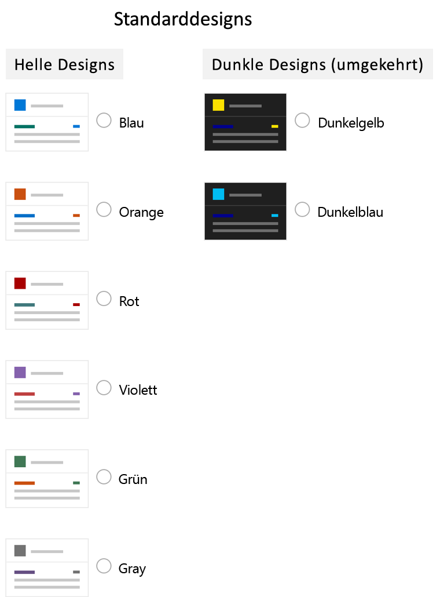

# SharePoint-WebsitedesignSharePoint site theming

Besitzer von SharePoint-Websites stehen jetzt neue Optionen zum Anwenden benutzerdefinierter Formatvorlagen und Farben auf Websites zur Verfügung. Sie machen es einfacher, Designs in Websitesammlungen zu definieren und zu verwalten.SharePoint site owners have new options for applying custom styles and colors to sites that make it easier to define and manage themes across site collections. Die neuen Features umfassen Folgendes:These new features include:

* Die Möglichkeit, benutzerdefinierte Designs zu definieren und für Websitebesitzer verfügbar zu machen.The ability to define custom themes and make them available to site owners. Designs werden in einem [JSON-Schema](sharepoint-site-theming-json-schema.md) definiert, in dem die Farbeinstellungen und Metadaten des Designs gespeichert sind.Themes are defined in a [JSON schema](sharepoint-site-theming-json-schema.md) that stores color settings and related metadata for each theme.
* Ein Online-[Design-Generator-Tool](https://developer.microsoft.com/de-DE/fabric#/styles/themegenerator), mit dem Sie neue benutzerdefinierte Designs definieren können.An online [Theme Generator tool](https://developer.microsoft.com/de-DE/fabric#/styles/themegenerator) that you can use to define new custom themes.
* Ein vereinfachter Satz von Standarddesigns mit sechs hellen Designs und zwei dunklen DesignsA simplified set of default themes, with six light themes and two dark themes presently available.
* Eine aktualisierte Farbpalette mit 12 hellen Farben und 6 dunklen Farben sowie 16 ergänzenden Designs.An updated color palette, with 12 light colors and 6 dark colors, as well as 16 supplementary themes.
* Die Möglichkeit, zu steuern, welche Designs auf den Seiten Ihrer Website verfügbar sind.Control over which themes are available for use on pages within your sites. Sie können z. B. benutzerdefinierte Designs basierend auf dem Branding oder der Identität Ihrer Organisation definieren und festlegen, dass nur diese Designs auf Ihren Websites verfügbar sind.For example, you can define custom themes based on your organization's branding or identity, and make those the only available themes within your sites.

Administratoren können diese Features über [PowerShell-Cmdlets](sharepoint-site-theming-powershell.md) nutzen, Entwickler über das [clientseitige Objektmodell (CSOM)](sharepoint-site-theming-csom.md) von SharePoint oder die [REST-API](sharepoint-site-theming-rest-api.md) von SharePoint.These capabilities are available to administrators via [PowerShell cmdlets](sharepoint-site-theming-powershell.md), and to developers via the SharePoint [Client Side Object Model (CSOM)](sharepoint-site-theming-csom.md) or the SharePoint [REST API](sharepoint-site-theming-rest-api.md).

Allgemeine Informationen zur Anpassung von Websites mithilfe von Designs finden Sie unter [Ändern des Aussehens Ihrer SharePoint-Website](https://support.office.com/de-DE/article/Change-the-look-of-your-SharePoint-site-06bbadc3-6b04-4a60-9d14-894f6a170818).For general information about working with themes to customize the look of your sites, see [Change the look of your SharePoint site](https://support.office.com/de-DE/article/Change-the-look-of-your-SharePoint-site-06bbadc3-6b04-4a60-9d14-894f6a170818).

## StandarddesignsDefault themes

Die folgenden vordefinierten Designs sind standardmäßig verfügbar:The following predefined themes are available by default:

* __Blau____Blue__
* __Orange____Orange__
* __Rot____Red__
* __Lila____Purple__
* __Grün____Green__
* __Grau____Gray__
* __Dunkelgelb__ (invertiertes Design)__Dark Yellow__ (inverted theme)
* __Dunkelblau__ (invertiertes Design)__Dark Blue__ (inverted theme)

Diese Designs wurden für optimale Lesbarkeit entwickelt und sind eine gute Grundlage für die Erstellung benutzerdefinierter Designs.These themes have been designed for readability, so you might find them to be useful starting points for creating custom themes. Weitere Informationen zu den Standarddesigns finden Sie unter [SharePoint-Websitedesign: JSON-Schema](sharepoint-site-theming-json-schema.md).For more information about default themes, see [SharePoint site theming: JSON schema](sharepoint-site-theming-json-schema.md).

Zusätzlich zu den Standarddesigns stehen ergänzende Designs zur Auswahl.In addition to the default themes, you can select from supplementary themes. Die folgenden Anpassungen stehen zur Verfügung:The following special folders are available:

* Helle Designs: Gold, Teal, Dark Blue, Indigo, Plum, Warm GrayLight themes: Gold, Teal, Dark Blue, Indigo, Plum, Warm Gray
* Dunkle Designs: Red, Green, Purple, GrayDark themes: Red, Green, Purple, Gray

## Auswählen eines modernen DesignsSelecting a modern theme

<!-- Verify that it's okay to use the concept of "modern" themes/pages here? -->

Zur Auswahl eines der für eine SharePoint-Website verfügbaren Designs klicken Sie rechts oben auf dem Bildschirm auf das __Zahnradsymbol (⚙️)__ und anschließend auf __Change the look__.To select from the available themes for a SharePoint site, choose the __gear icon (⚙️)__ in the top right corner of the screen and then select __Change the look__. Ihnen wird dann eine Liste von Designs zur Auswahl präsentiert, die Standarddesigns und/oder benutzerdefinierte Designs enthalten kann, je nachdem, wie Ihre Website konfiguriert wurde.You'll be presented with a list of themes to choose from, which might include default themes and/or custom themes depending on how your site has been configured.

Auf der Abbildung unten sehen Sie, wie die Standarddesigns im Designauswahl-Dialogfeld dargestellt werden.The following image shows how the default themes are presented in the theme picker dialog box.

Sobald Sie in der Liste ein Design auswählen, werden diese Farbeinstellungen sofort auf die Seite angewendet, damit Sie sich ein Bild von dem ausgewählten Design machen können.When you choose a theme in the list, those color settings are instantly applied to the page so that you can see what the selected theme will look like.

Sobald Sie ein Design gefunden haben, das Sie verwenden möchten, speichern Sie Ihre Auswahl mit einem Klick auf **Speichern**. Mit einem Klick auf **Abbrechen** können Sie die Seite auf das aktuelle Design zurücksetzen.After you've found a theme that you want to use, choose **Save** to save your selection, or choose **Cancel** to revert to your current theme.

## Arbeiten mit klassischen DesignsWorking with classic themes

Sie können weiterhin die klassischen Designs verwenden. Klicken Sie dazu auf den Link _Classic change the look options_ unter den im Dialogfeld _Change the look_ aufgeführten modernen Designs.You can still use the classic themes, by choosing the link to _Classic change the look options_ beneath the modern themes listed under _Change the look_. Da sich die moderne SharePoint-Benutzeroberfläche von der klassischen Benutzeroberfläche unterscheidet, gelten jedoch einige Einschränkungen, wenn Sie klassische Designs auf modernen Seiten verwenden.Because the modern SharePoint UI differs from the classic UI, however, some limitations apply when you use classic themes with modern pages.

Wenn Sie ein klassisches Design auswählen, wird ein modernes Design aus den Einstellungen im klassischen Design generiert, einschließlich des Flag „isInverted“, des Hintergrundbilds und der Farbeinstellungen für „COntentAccent1“, „PageBackground“ und „BackgroundOverlay“.When you select a classic theme, a modern theme will be generated from the settings in the classic theme, including the isInverted flag, the background image, and the color settings for COntentAccent1, PageBackground, and BackgroundOverlay. Wenn „isInverted“ auf „True“ gesetzt ist, werden neutrale Farben wie „NeutralDark“ und „NeutralLight“ umgekehrt.If isInverted is set to True, neutral colors such as NeutralDark and NeutralLight will be reversed.

Für optimale Benutzerfreundlichkeit empfehlen wir Ihnen, auf modernen Seiten auch moderne Designs zu verwenden.For the simplest experience, we recommend that you use modern themes with modern pages. Wenn Sie klassische Designs auf modernen Seiten verwenden müssen, sollten Sie Ihre Website sorgfältig testen, um sicherzustellen, dass Ihre Inhalte lesbar und barrierefrei sind.If you need to use classic themes with modern pages, test your site carefully to verify that your content is readable and accessible.

## Siehe auchSee also

* [Ändern des Erscheinungsbilds Ihrer SharePoint-WebsiteChange the look of your SharePoint site](https://support.office.com/de-DE/article/Change-the-look-of-your-SharePoint-site-06bbadc3-6b04-4a60-9d14-894f6a170818?ui=en-US&rs=en-US&ad=US#ID0EAACAAA=Online)
* [Design-Generator-ToolTheme Generator tool](https://developer.microsoft.com/de-DE/fabric#/styles/themegenerator)
* [SharePoint-Websitedesign: JSON-SchemaSharePoint site theming: JSON schema](sharepoint-site-theming-json-schema.md)
* [SharePoint-Websitedesign: PowerShell-CmdletsSharePoint site theming: PowerShell cmdlets](sharepoint-site-theming-powershell.md)
* [SharePoint-Websitedesign: CSOMSharePoint site theming: CSOM](sharepoint-site-theming-csom.md)
* [SharePoint-Websitedesign: REST-APISharePoint site theming: REST API](sharepoint-site-theming-rest-api.md)
