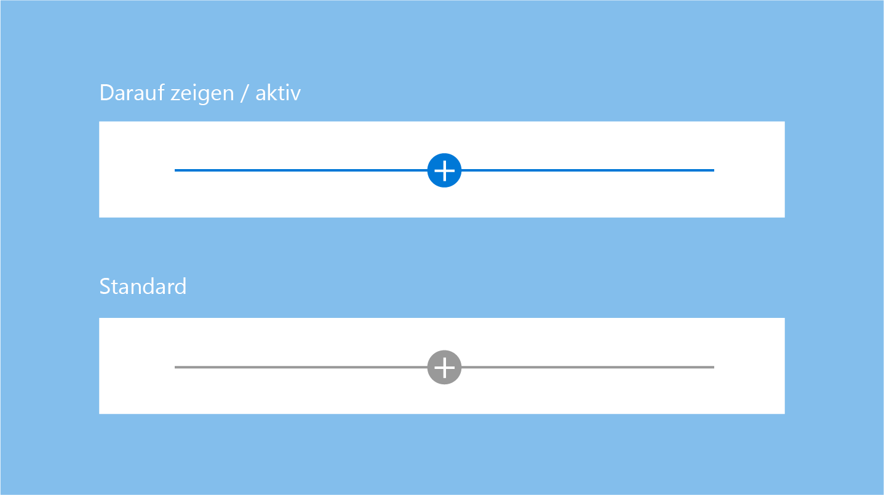
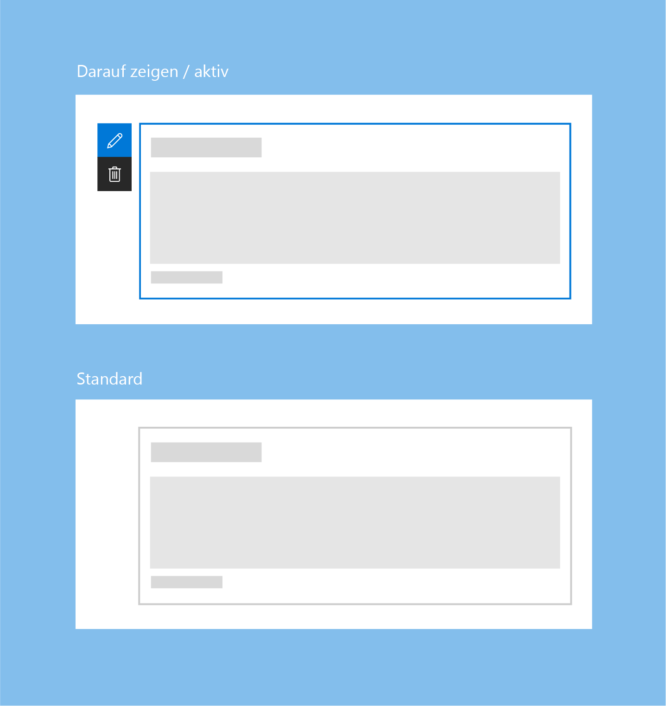
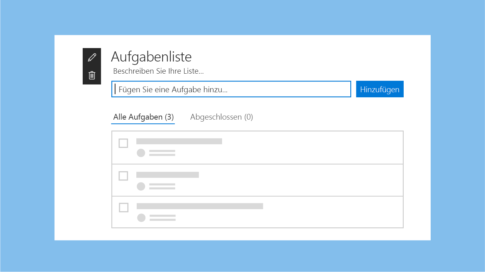
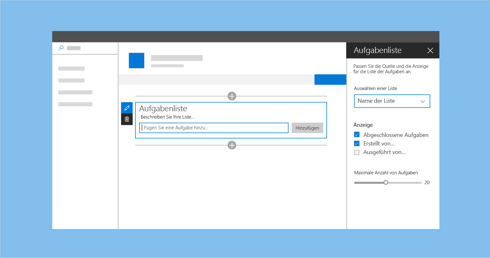
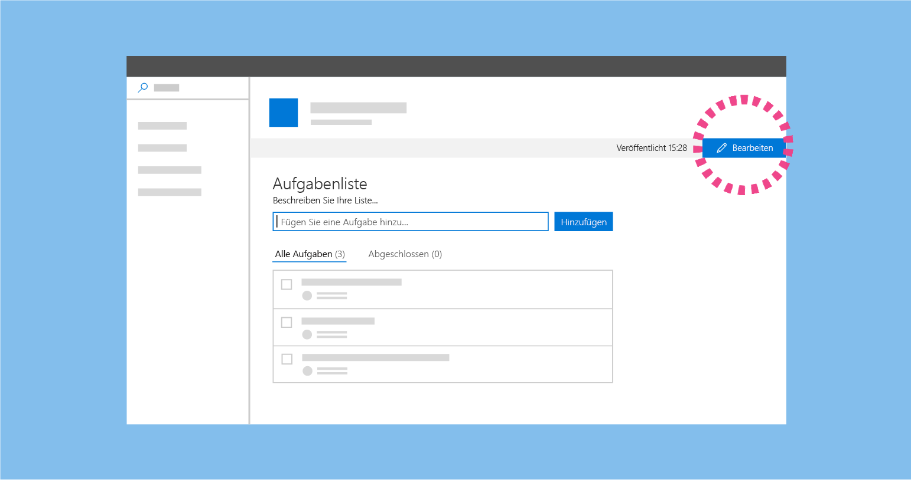
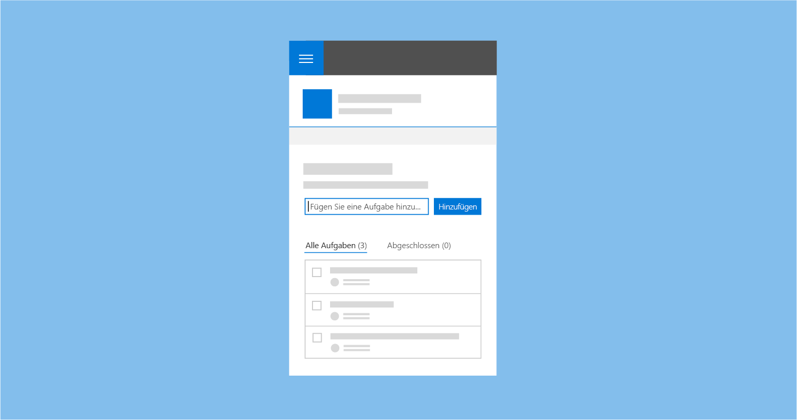

# Erstellen von Seiten auf einer SharePoint-WebsiteAuthoring pages in a SharePoint site

Das Erstellen von Seiten in SharePoint ist ein einfacher Vorgang, aber es erfordert einige Kenntnisse der SharePoint-Umgebung sowie ein grundlegendes Verständnis davon, was und für wen Sie die Seite entwerfen.Authoring pages in SharePoint is a simple process, but it does require some familiarity with the SharePoint environment, as well as an understanding of what and who you are designing the page for. Ein paar Grundprinzipien – wie „Einfach beginnen“ und „Auf dem aufsetzen, was funktioniert“ – sind zu Beginn der Erstellung hilfreich.A few basic principles – like remembering to "Start simple" and "Build on what's working" - are valuable things to consider as you start authoring. Es ist auch sinnvoll, ständig Ihre Zielgruppe und die Ziele im Hinterkopf zu behalten, bei denen Sie sie unterstützen möchten.It's also a good idea to consistently remind yourself of your audience, and the goals that you are trying to help them achieve.

<!-- Do we have content about the design principles that we can link to here? -->

Die Erstellungsumgebung für SharePoint- Seiten weist zwei Modi auf:The new SharePoint page authoring experience has two modes: 

- Bearbeitungsmodus: In diesem Modus können Seitenautoren Webparts hinzufügen und konfigurieren, um einer Seite Inhalte hinzuzufügen.Edit mode which allows page author(s) to add and configure web parts to add content to a page.
- Modus „Veröffentlicht“: In diesem Modus kann Ihr Team oder Ihre Zielgruppe den Inhalt anzeigen und mit Webparts interagieren.Published mode which allows your team or audience to view content and interact with web parts. 

## BearbeitungsmodusEdit mode

Beim Erstellen einer neuen Seite haben Benutzer Zugriff auf die Erstellungsbenutzeroberfläche, um Inhalte hinzuzufügen und den Seiteninhalt anzupassen.When creating a new page, users have access to the authoring UI to add content to and customize the page content. 

### Hinweis zum Hinzufügen und ToolboxAdd hint and Toolbox

Der Hinweis zum Hinzufügen besteht aus einer horizontalen Linie mit einem Pluszeichen, die angezeigt wird, wenn ein Webpart ausgewählt wird, und wenn darauf gezeigt wird, um anzugeben, wo Seitenautoren neue Webparts zu ihrer Seite hinzufügen können.The add hint is a horizontal line with a plus icon that is visible when a web part is selected and on hover to indicate where page authors can add new web parts to their page. The toolbox opens when a user clicks/taps the plus icon. The toolbox contains all the web parts that can be added to a page. Die Toolbox wird geöffnet, wenn ein Benutzer das Pluszeichen wählt.The Toolbox opens when a user chooses the plus icon. Die Toolbox enthält alle Webparts, die einer Seite hinzugefügt werden können.The Toolbox contains all the web parts that can be added to a page.

### SymbolleisteToolbar

Eine vertikale Symbolleiste und das umgebende Feld sind Teil des Frameworks für jedes Webpart und werden von der Seite bereitgestellt.A vertical toolbar and bounding box is part of the framework for every web part and provided by the page. Each web part has an edit and delete action in the toolbar. Jedes Webpart weist in der Symbolleiste eine Bearbeitungs- und Löschaktion auf.Each web part has an edit and delete action in the toolbar. 

### Aktiver Zustand (Mauszeiger)Active and hover states

Im aktiven Zustand (Mauszeiger) sind die Hinweisleisten primär Blau oder die primäre Designfarbe für die Website.On hover/active, the hint bars are primary blue or the primary theme color for the site.

Das umgebende Feld für ein Webpart ist standardmäßig Grau, wird aber primär Blau oder die primäre Designfarbe für die Website beim Zeigen mit der Maus oder wenn das Webpart ausgewählt wird.The bounding box for a web part is gray by default, but picks up the primary blue or primary theme color for the site on hover or when the web part is selected.

### Kontextbezogene BearbeitungenContextual edits

Entwerfen Sie eine WYSIWYG-Umgebung für Webparts, sodass Benutzer Informationen eingeben oder Inhalte hinzufügen können, die beim Veröffentlichen angezeigt werden.Design a WYSIWYG experience for web parts so that users can fill in information or add content that will be displayed when published. Diese Inhalte sollten auf der Seite eingegeben werden, sodass der Benutzer versteht, wie sie im Viewer wiedergegeben werden.This content should be entered on the page so the user understands how the it will render in the viewer. Titel und Beschreibungen sollten beispielsweise dort eingegeben werden, wo der Text angezeigt wird, oder neue Aufgaben sollten im Kontext der Seite hinzugefügt und geändert werden.For example, titles and descriptions should be filled out where the text displays; new tasks should be added and modified in the context of the page.

### Bearbeitungen auf ElementebeneItem-level edits

Die Benutzeroberfläche kann sich innerhalb des Webpart ändern. Text wird zum Beispiel in ein Textfeld umgewandelt, oder Sie können die Benutzeroberfläche zur Neuanordnung von Elementen oder zum Überprüfen von Aufgaben in einem Webpart anzeigen.UI can change within the web part; for example, turning text into a text field to fill out links or when displaying UI to reorder items or to check of tasks in a web part Sie können interaktive Funktionalität für Webparts im Bearbeitungsmodus, im schreibgeschützten Modus oder in beiden Modi aktivieren, je nach Designabsicht.You can enable interactive functionality for web parts in edit mode, in read mode, or in both, depending on your design intent.

### EigenschaftenbereicheProperty panes

Eigenschaftenbereiche werden über das Symbol  **Bearbeiten** auf der Symbolleiste aufgerufen.Property panes are invoked via the **Edit** icon on the toolbar. Eigenschaftenbereiche sollten in erster Linie Konfigurationseinstellungen enthalten, die Features aktivieren oder deaktivieren, die entweder auf der Seite angezeigt werden oder die einen Aufruf eines Diensts vornehmen, um Inhalte anzuzeigen.Property panes are invoked via the edit action icon on the toolbar. Panes should primarily contain configuration settings that enable/disable features that either show on page or that make a call to a service to display content. 

## Modus „Veröffentlicht“Published mode

Nachdem die Seite veröffentlicht wurde, wird die gesamte Bearbeitungsoberfläche für den Viewer oder Leser der Seite deaktiviert.After the page is published, all edit UI is disabled and for the viewer or reader of the page. Um mit der Bearbeitung der Seite fortzufahren, wählt der Benutzer oben rechts in der Befehlsleiste die Schaltfläche **Bearbeiten** aus.To continue editing the page, the user selects the **Edit** button on the top right corner of the command bar.

## Mobile AnsichtMobile view

Alle SharePoint-Seiten sind [reaktionsschnell](grid-and-responsive-design.md), damit der Inhalt der Seite auf mobilen Geräten angezeigt werden kann.All SharePoint pages are [responsive](grid-and-responsive-design.md) to allow the content of the page to be viewed on mobile devices. Beim Entwerfen eines Webpart ist es wichtig, zu verstehen, wie die neuen SharePoint-Websiteseiten auf unterschiedlichen Geräten dargestellt werden.While designing a web part, it is important to understand how the new SharePoint site pages render across different devices.

