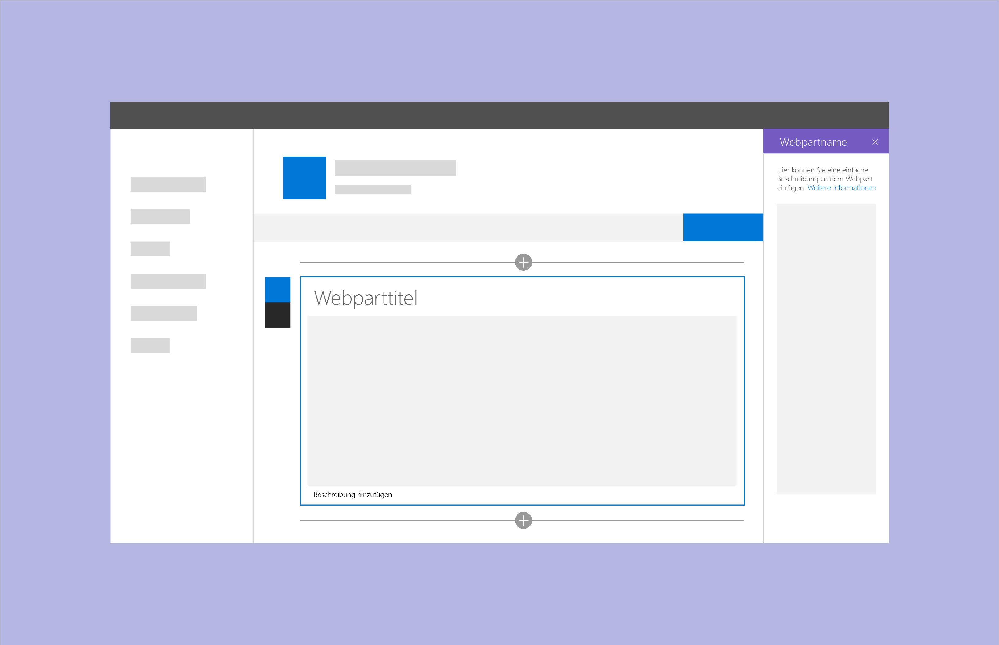

# Entwerfen eines SharePoint-WebpartsDesigning a SharePoint web part

Bevor Sie ein SharePoint-Webpart entwerfen, sollten Sie verstehen, wie [Seiten in einer SharePoint-Website erstellt werden](authoring-pages.md).Before you design a SharePoint web part, you should understand how to [author pages in a SharePoint site](authoring-pages.md). Wenn Sie noch nicht über diese Kenntnisse verfügen, nehmen Sie sich etwas Zeit,um eine Seite zu erstellen und mehrere Typen von Webparts hinzuzufügen.If you haven't already, take some time to create a page and add multiple types of web parts. Es ist wichtig, dass Sie Office Fabric-Komponenten und -Formatvorlagen nutzen können, damit neue Webparts schneller und einfacher betriebsbereit sind.It is important know how to leverage Office Fabric components and styles to make it easier and quicker to get your new web part up and running.

Beim Entwerfen von Webparts ist es wichtig, dass Sie mit folgenden Konzepten vertraut sind:When you design web parts, it's important to be familiar with the following concepts:

- [Eigenschaftenbereichstypen und deren VerwendungProperty pane types and when to use each type](#property-pane-types)
- [Dynamische und nicht dynamische WebpartsReactive and nonreactive web parts](reactive-and-nonreactive-web-parts.md)
- [Titel und BeschreibungenTitles and descriptions](web-part-titles-and-descriptions.md)
- [Fallbacks und PlatzhalterFallbacks and placeholders](placeholders-and-fallbacks.md)

## EigenschaftenbereichstypenProperty pane types

Sie können drei Arten von Eigenschaftenbereichen zum Entwerfen und Entwickeln von Webparts verwenden, die den Anforderungen Ihres Unternehmens oder Ihrer Kunden entsprechen.There are three types of property panes to enable you to design and develop web parts that fit your business or customer needs.

Um einen Bereich zum Konfigurieren der Einstellungen für ein Webpart zu öffnen, wählen Sie **Bearbeiten**.To open a pane to configure settings for a web part, choose **Edit**. Verwenden Sie den Bereich zum Aktivieren und Deaktivieren von Features, Auswählen einer Quelle, Auswählen eines Layouts und zum Festlegen von Optionen.Use the pane to enable and disable features, select a source, choose a layout, and set options. Bearbeiten Sie Webpartinhalte innerhalb des Webparts, und nicht im Eigenschaftenbereich.Edit web part content within the web part rather than in the property pane.

Der Eigenschaftenbereich ist 320 Pixel groß, und die Seite wird beim Öffnen dynamisch umgebrochen.The property pane is 320px and when opened, the page will responsively reflow.

### Einzelner BereichSingle pane
Verwenden Sie einen einzelnen Bereich für einfache Webparts, bei denen nur eine kleine Anzahl von Eigenschaften konfiguriert werden kann.A single pane is used for simple web parts that only have a small number of properties to configure.

### Accordion-BereichAccordion pane
Verwenden Sie einen Accordion-Bereich für eine Gruppe bzw. Gruppen von Eigenschaften mit vielen Optionen und dann, wenn die Gruppen zu einer langen Liste mit Optionen zum Scrollen führen würden.Use an accordion pane to contain a group or groups of properties with many options, and where the groups result in a long scrolling list of options. Angenommen, Sie haben drei Gruppen mit dem Namen „Eigenschaften“, „Darstellung“ und „Layout“, von denen jede über zehn Komponenten verfügt.For example, you might have three groups named Properties, Appearance, and Layout, each with ten components.

Verwenden Sie Accordion-Bereiche, wenn Sie eine Kategorisierung für ein komplexes Webpart anwenden müssen.Use accordion panes when you need to apply categorization for a complex web part.

**Beispiel für Accordion-Gruppen mit zuletzt verwendetem Bereich****Accordian groups example with last pane open**

**Beispiel für Accordion-Gruppen mit zwei Gruppen****Accordion groups example with two groups open**

### Bereich „Schritte“Steps pane

Verwenden Sie den Bereich „Schritte“ zum Gruppieren von Eigenschaften in mehreren Schritten oder Seiten, wenn das Webpart in einer linearen Reihenfolge konfiguriert werden muss oder wenn die beim ersten Schritt getroffene Auswahl Auswirkungen auf Optionen hat, die im zweiten oder dritten Schritt angezeigt werden.A steps pane is used for grouping properties in multiple steps or pages when you need the web part to be configured in a linear order or when choices made on the first step affect options that display on the second step. 

**Schritt 1 im Bereich „Schritte“****Step 1 of the steps pane**

In Schritt 1 ist die Schaltfläche „Zurück“ deaktiviert und die Schaltfläche „Weiter“ aktiviert.In step 1, the back button is disabled and the next button is enabled.

**Schritt 2 im Bereich „Schritte“****Step 2 of the steps pane** 

In Schritt 2 sind die Schaltflächen „Zurück“ und „Weiter“ aktiviert.In step 2, the back and next buttons are enabled.

**Schritt 3 im Bereich „Schritte“****Step 3 of the steps pane** 

In Schritt 3 ist die Schaltfläche „Weiter“ deaktiviert und die Schaltfläche „Zurück“ aktiviert.In step 3, the next button is disabled and the back button is enabled.

