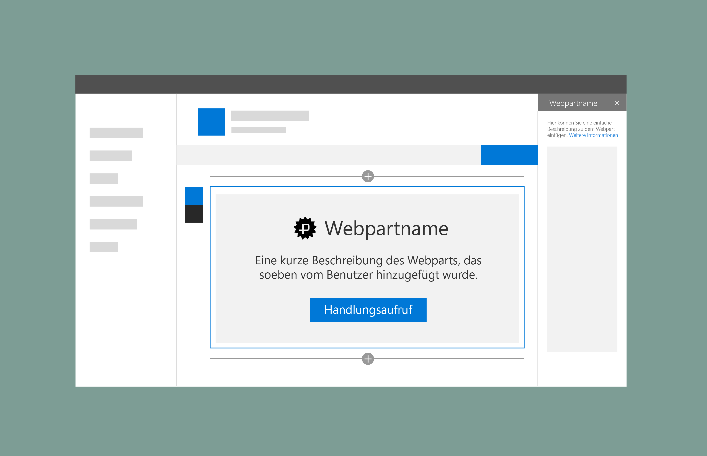

# Platzhalter und Fallbacks in SharePoint-WebpartsPlaceholders and fallbacks in SharePoint web parts

Sie können SharePoint-Webparts Platzhalter hinzufügen, die als Fallback verwendet werden können, wenn ein Problem beim Laden von Inhalten oder Daten für ein Webpart auftritt.You can add placeholders to SharePoint web parts that can also be used as a fallback if an issue occurs loading content or data for a web part. Webpartname und -beschreibung werden automatisch anhand der mit dem Webpart übermittelten Metadaten hinzugefügt.The web part name and description are automatically added from the metadata submitted with the web part. Sie können eine Schaltfläche hinzufügen, mit der Benutzer zu einem Zustand zurückzukehren können, in dem sie das Webpart konfigurieren können.You an add a button that  users can select to return to a state where they can configure the web part.

