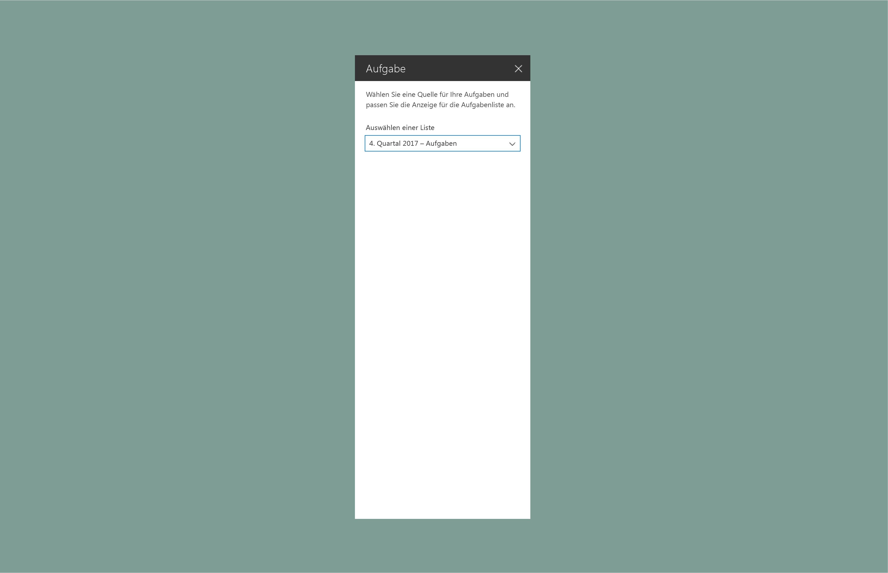
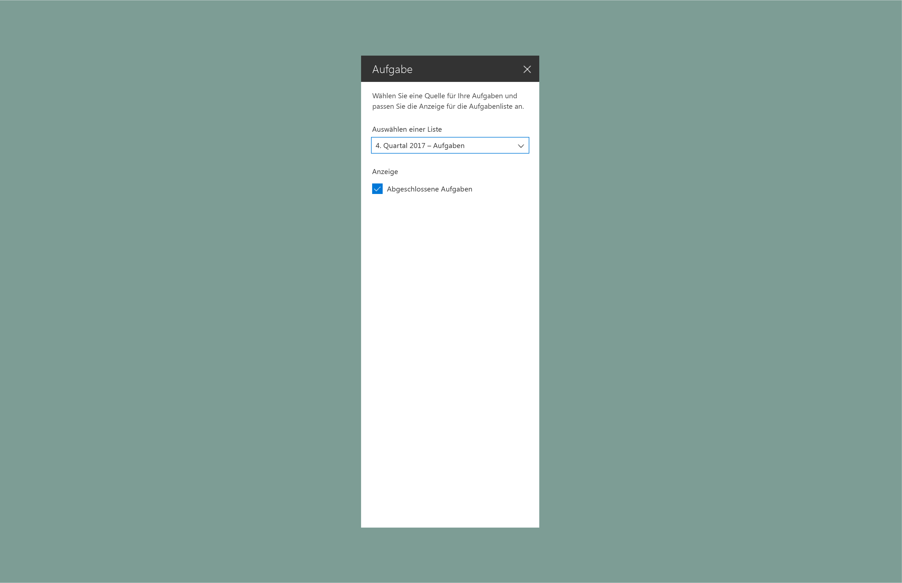
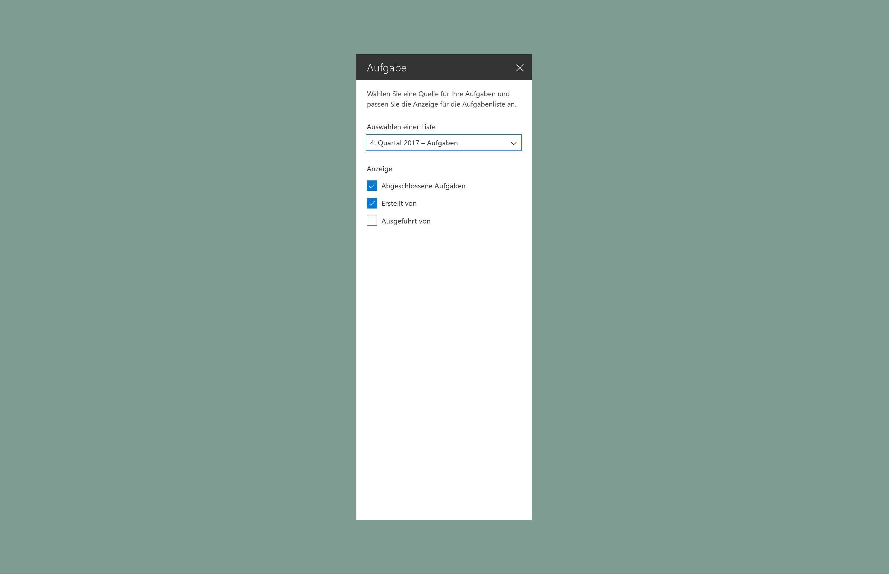
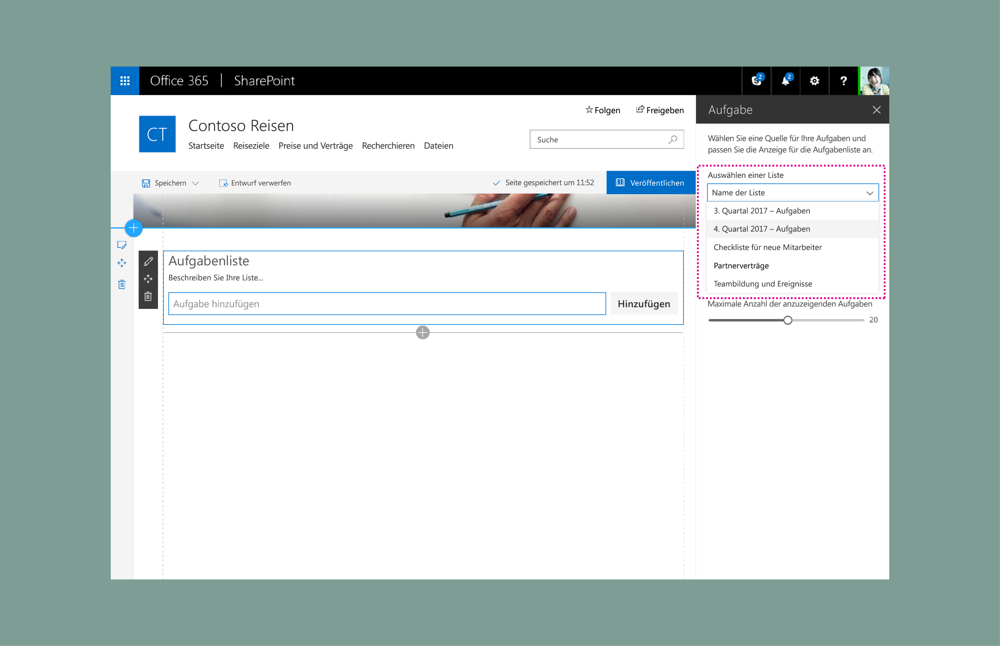
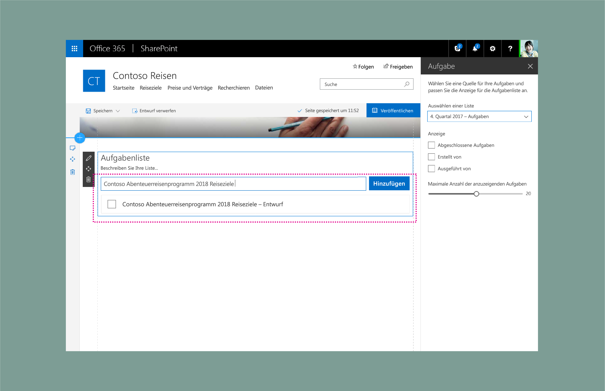
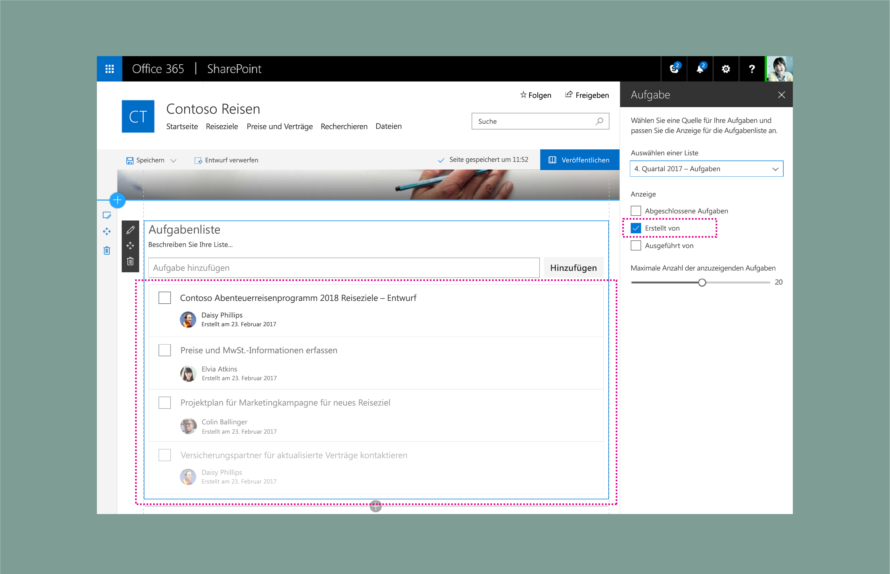
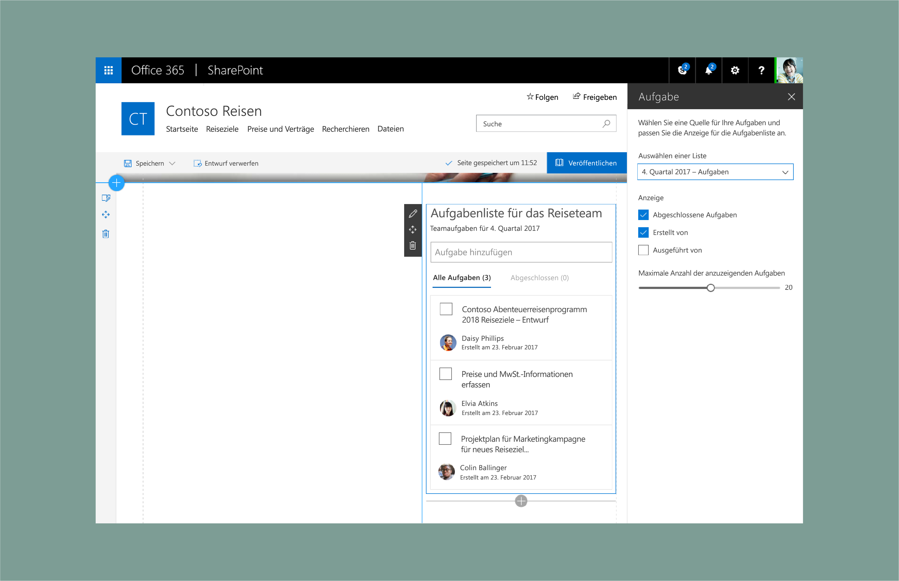
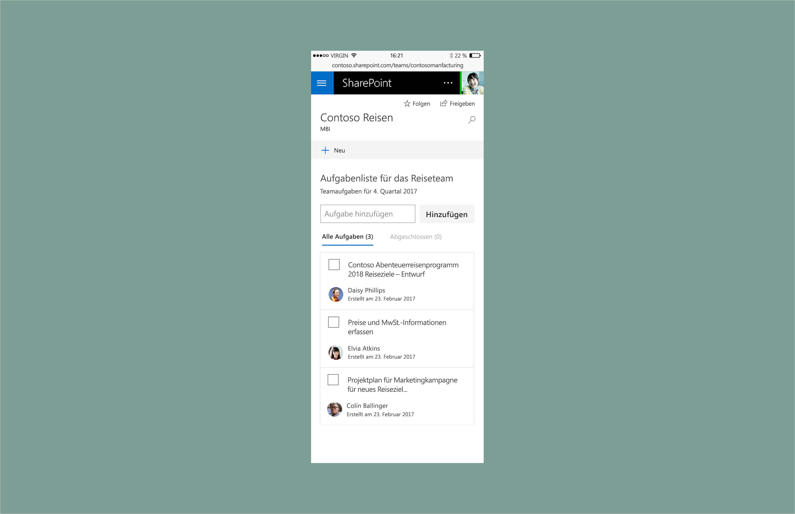

# Showcase für SharePoint-Webpartentwurf: Erstellen eines Eigenschaftenbereichs für AufgabenlistenSharePoint web part design showcase: Create a To-Do list property pane

In diesem Artikel wird beschrieben, wie Sie ein Aufgabenlisten-Webpart erstellen.This article describes how to create a To-Do list web part. Dieses Beispiel verwendet den [Eigenschaftenbereichstyp](design-a-web-part.md) mit einem Bereich, ist [reaktiv](reactive-and-nonreactive-web-parts.md) und basiert auf dem dynamischen Raster von [Office UI Fabric](https://dev.office.com/fabric#/).This example uses the single pane [property pane type](design-a-web-part.md) and is [reactive](reactive-and-nonreactive-web-parts.md) and based on the [Office UI Fabric](https://dev.office.com/fabric#/) responsive grid.

1. Fügen Sie eine Beschreibung hinzu, damit Benutzer mehr über das Webpart und seine Eigenschaften erfahren.Add a description to help users understand more about the web part and its properties.

    In diesem Beispiel lautet die Beschreibung „Select a source for your to-dos and customize the display for the list of tasks“.In this example, the description is "Select a source for your to-dos and customize the display for the list of tasks."
    
    

2. Fügen Sie eine Fabric-[Dropdown-Komponente](http://dev.office.com/fabric#/components/dropdown) hinzu, die mit einer Liste verbunden ist.Add a Fabric [drop-down component](http://dev.office.com/fabric#/components/dropdown) connected to a list.

    

3. Fügen Sie eine Fabric-[Checkbox-Komponente](http://dev.office.com/fabric#/components/checkbox) (Kontrollkästchen) zur Anzeige abgeschlossener Aufgaben hinzu.Add a Fabric [checkbox component](http://dev.office.com/fabric#/components/checkbox) to display completed tasks.

    

4. Fügen Sie zwei weitere Kontrollkästchen zum Steuern von Anzeigeoptionen hinzu.Add two more checkboxes to control display options.

    

5. Fügen Sie eine Fabric-[Slider-Komponente](http://dev.office.com/fabric#/components/slider) (Schieberegler) für die maximale Anzahl von anzuzeigenden Elementen hinzu.Add a Fabric [slider](http://dev.office.com/fabric#/components/slider) for the maximum number of items to display.

    

6. Als Nächstes wählt der Autor der Seite eine Liste aus oder fügt manuell Aufgaben hinzu, um das Aufgabenlisten-Webpart vorab auszufüllen.Next, the author of the page selects a list or manually adds tasks to prepopulate the To-Do list web part.

        

7. Das Webpart zeigt einen Indikator für Elemente, die auf die Seite geladen werden.The web part shows an indicator of items loading onto the page.

    

8. Elemente aus der Liste werden geladen.Items from the list load.

    

    Wenn die neuen Aufgaben geladen werden, werden sie mithilfe von Animationskomponenten aus Office UI Fabric eingeblendet.When the new tasks are loaded the fade into view using animation styles from Office UI Fabric Web part with fabric animations

    

9. Der Eigenschaftenbereich steuert die Benutzeroberfläche.The property pane controls the UI. Aufgaben mit aktivierten Pivots werden über die Kontrollkästchen „Anzeigen“ im Eigenschaftenbereich angezeigt.Tasks with pivots enabled are displayed via the Display checkboxes in the property pane. 

    

## Dynamische AnsichtenResponsive views

Das folgende Beispiel zeigt die 2/3-Spaltenansicht des Webparts.The following example shows the 2/3 column view of the web part.

Das folgende Beispiel zeigt die 1/3 Spaltenansicht des Webparts.The following example shows the 1/3 column view of the web part.

Das folgende Beispiel zeigt die mobile (schreibgeschützte) Ansicht des Webparts.The following example shows the mobile (read-only) view of the web part.

