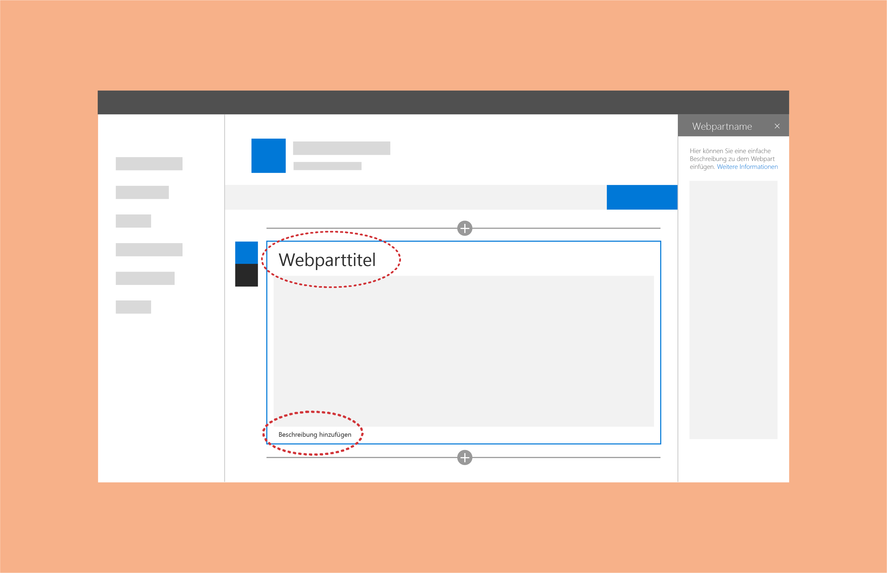
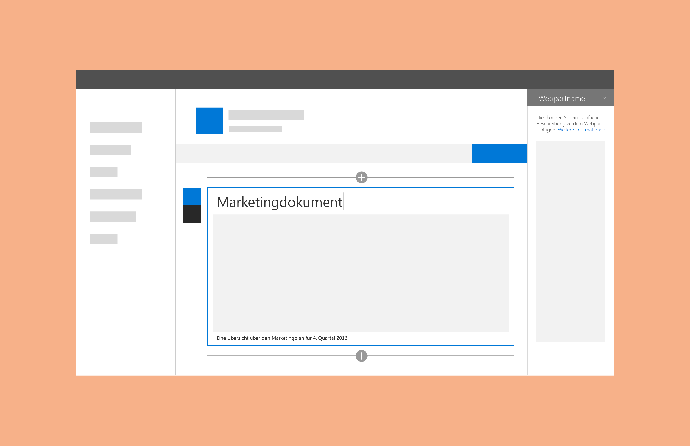

# Titel und Beschreibungen für SharePoint-WebpartsTitles and descriptions for SharePoint web parts

Sie können Webparts Titel und Beschreibungen hinzufügen, damit Benutzer ihren Zweck besser verstehen.You can add titles and descriptions to web parts to help users understand their purpose. Dies ist hilfreich, wenn eine Seite viele verschiedene Webparts enthält.This is helpful when a page contains a range of web parts. Einige Webparts (z. B. Bild-Webparts) benötigen möglicherweise keinen Titel, aber eventuell eine Beschreibung vor oder nach dem Inhaltsbereich.Some web parts (like image web parts) might not need a title, but might need a description before or after the content area. Gehen Sie nicht davon aus, dass Benutzer den Kontext des Webparts ohne einen Titel oder eine Beschreibung verstehen, und rechnen Sie nicht damit, dass Benutzer Titel oder Beschreibungen selbst einschließen.Don't assume that users will understand the context of the web part without either a title or a description, and don't assume that users will include titles or descriptions themselves. 
 
Eine Option besteht darin, den Titel und die Beschreibung mit den Konfigurationseigenschaften des Webparts zu verbinden.One option is to connect the title and description to the configuration properties of your web part. Hierdurch wird sichergestellt, dass Ihre Webparts vorab mit Inhalt gefüllt werden, der auf Grundlage der Konfiguration am sinnvollsten ist.This ensures that your web parts are prepopulated with content that makes the most sense based on the configuration. 
 
Wenn Sie z. B. über ein Webpart verfügen, das eine Dokumentbibliothek auf Grundlage der kürzlich hinzugefügten Elemente abfragt, könnten Sie „Zuletzt verwendete Dokumente“ als Standardtitel verwenden.For example, if you have a web part that queries a document library based on recently added items, you might want to use "Recent documents" for the default title.

Für den Titel und die Beschreibung kann der Autor der Seite den Standard-Platzhaltertext überschreiben und so anpassen, wie dies für die erstellte Seite am sinnvollsten ist.For both the title and description, the author of the page can override the default placeholder text and customize them based on what makes the most sense for the page they're creating. 

