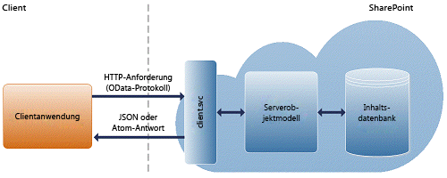

# <a name="build-mobile-apps-for-other-platforms-using-sharepoint"></a><span data-ttu-id="8af2b-102">Erstellen von mobilen Apps für andere Plattformen mit SharePoint</span><span class="sxs-lookup"><span data-stu-id="8af2b-102">Build mobile apps for other platforms using SharePoint</span></span>
<span data-ttu-id="8af2b-p101">Erfahren Sie, wie Sie REST (Representational State Transfer) zum Erstellen einer mobilen SharePoint-App für eine beliebige Plattform verwenden. Mobile Geräte sind heutzutage leistungsfähiger und benutzerfreundlicher geworden. Laptops, Netbooks und Tablet-PCs und Mobiltelefone bieten Mitarbeitern Zugriff auf die Informationen und Anwendungen, die sie für ihre Arbeit benötigen. Und die Entwicklung von Anwendungen für mobile Geräte war noch nie einfacher. Dementsprechend erfordern immer mehr Geschäftsszenarien die Integration von Clientanwendungen in ihre Geschäftsprozessen. In diesem Artikel wird beschrieben, wie mobile Client-Apps in SharePoint integriert werden. Sie können eine mobile App erstellen, um SharePoint-Inhalte von beliebigen Speicherorten zu durchsuchen und eine Verbindung mit SharePoint-Listen und -Bibliotheken zum Zugriff auf Daten herzustellen.</span><span class="sxs-lookup"><span data-stu-id="8af2b-p101">Learn how to use Representational State Transfer (REST) to create a SharePoint mobile app for any platform. Mobile devices have become more powerful and easy to use nowadays. Laptops, netbooks, tablet PCs, and mobile phones provide workers access to the information and applications that they need to do their jobs. And developing applications for mobile devices is now easier than ever. As a result, more and more business scenarios demand integrating client applications together with their business processes. This article describes how to integrate mobile client apps together with SharePoint. You can create a mobile app to browse SharePoint content from any location and connect with SharePoint lists and libraries to access data.</span></span>
  
    
    

<span data-ttu-id="8af2b-p102">Um eine mobile App zu entwickeln, die mit SharePoint interagiert, können Sie allgemeine Dienste verwenden, auf die über offene Protokolle zugegriffen werden kann. In SharePoint Foundation 2010 wurden die Clientobjektmodelle eingeführt, sodass Entwickler eine Remotekommunikation mit SharePoint über eine Webprogrammiertechnologie ihrer Wahl ausführen konnten: .NET Framework, Microsoft Silverlight oder JavaScript. In SharePoint wird ein REST-Dienst (Representational State Transfer) eingeführt, der mit den Clientobjektmodellen vollständig vergleichbar ist. In SharePoint wird praktisch jede API in den Clientobjektmodellen über einen entsprechenden REST-Endpunkt verfügen. Entwickler können nun über eine beliebige Technologie, die REST-Webanforderungen unterstützt, remote mit dem SharePoint-Objektmodell interagieren. REST kann von jeder beliebigen Programmiersprache genutzt werden, die Sie für Ihre mobile Anwendungsentwicklung verwenden möchten. Sie können grundlegende Erstellungs-, Lese-, Aktualisierungs- und Löschoperationen (Create, Read, Update, Delete: CRUD) durchführen, indem Sie die von SharePoint bereitgestellte REST (Representational State Transfer)-Schnittstelle verwenden. Die REST-Schnittstelle macht alle SharePoint-Entitäten und -Operationen verfügbar, die in den anderen SharePoint-Client-APIs verfügbar sind. Ein Vorteil bei der Verwendung von REST besteht darin, dass Sie keine Verweise auf SharePoint-Bibliotheken oder Clientassemblys hinzufügen müssen. Stattdessen führen Sie HTTP-Anforderungen an die entsprechenden Endpunkte durch, um SharePoint-Entitäten wie Websites, Listen und Listenelemente abzurufen oder zu aktualisieren. Unter  [Programmieren mit dem SharePoint REST-Dienst](http://msdn.microsoft.com/library/d4b5c277-ed50-420c-8a9b-860342284b72%28Office.15%29.aspx) finden Sie eine ausführliche Einführung zur SharePoint-REST-Schnittstelle und ihrer Architektur.</span><span class="sxs-lookup"><span data-stu-id="8af2b-p102">To develop a mobile app that interacts with SharePoint, you can use common services that can be accessed using open protocols. SharePoint Foundation 2010 introduced the client object models, which enabled developers to perform remote communication with SharePoint by using the web programming technology of their choice: .NET Framework, Microsoft Silverlight, or JavaScript. SharePoint introduces a Representational State Transfer (REST) service that is fully comparable to the client object models. In SharePoint, nearly every API in the client object models will have a corresponding REST endpoint. Now, developers can interact remotely with the SharePoint object model by using any technology that supports REST web requests. REST can be consumed by any programming language that you want to use for your mobile application development. You can perform basic create, read, update, and delete (CRUD) operations by using the REST interface provided by SharePoint. REST exposes all of the SharePoint entities and operations that are available in the other SharePoint client APIs. One advantage of using REST is that you don't have to add references to any SharePoint libraries or client assemblies. Instead, you make HTTP requests to the appropriate endpoints to retrieve or update SharePoint entities, such as webs, lists, and list items. For a thorough introduction to the SharePoint REST interface and its architecture, see  [Use OData query operations in SharePoint REST requests](http://msdn.microsoft.com/library/d4b5c277-ed50-420c-8a9b-860342284b72%28Office.15%29.aspx).</span></span>
  
    
    


## <a name="rest-endpoints-in-sharepoint"></a><span data-ttu-id="8af2b-121">REST-Endpunkte in SharePoint</span><span class="sxs-lookup"><span data-stu-id="8af2b-121">REST endpoints in SharePoint</span></span>
<span data-ttu-id="8af2b-122"><a name="BuildMobileAppsInSharePoint2013ForNonWindowsPhone_REST_EndpointsInSharePoint2013"> </a></span><span class="sxs-lookup"><span data-stu-id="8af2b-122"></span></span>

<span data-ttu-id="8af2b-p103">Um die REST-Funktionen zu nutzen, die in SharePoint integriert sind, erstellen Sie mithilfe des OData-Standards (Open Data Protocol), welcher der Clientobjektmodell-API entspricht, die Sie verwenden möchten, eine RESTful-HTTP-Anforderung. Der client.svc-Webdienst verarbeitet die HTTP-Anforderung und liefert die entsprechende Antwort im Atom- oder JavaScript Object Notation (JSON)-Format . Die Clientanwendung muss diese Antwort dann analysieren. in Abbildung 1 ist eine allgemeine Ansicht der SharePoint-REST-Architektur dargestellt.</span><span class="sxs-lookup"><span data-stu-id="8af2b-p103">To use the REST capabilities that are built into SharePoint, you can construct a RESTful HTTP request using the Open Data Protocol (OData) standard that corresponds to the desired client object model API. The client.svc web service handles the HTTP request and serves the appropriate response, in either Atom or JavaScript Object Notation (JSON) format. The client application must then parse that response. Figure 1 shows a high-level view of the SharePoint REST architecture.</span></span>
  
    
    

<span data-ttu-id="8af2b-127">**Abbildung 1. SharePoint-REST-Architektur**</span><span class="sxs-lookup"><span data-stu-id="8af2b-127">**Figure 1. SharePoint REST architecture**</span></span>

  
    
    

  
    
    

  
    
    
<span data-ttu-id="8af2b-p104">Die Endpunkte im SharePoint-REST-Dienst entsprechen den Typen und Mitgliedern in den SharePoint-Clientobjektmodellen. Mithilfe von HTTP-Anforderungen können Sie diese REST-Endpunkte verwenden, um typische CRUD-Vorgänge für SharePoint-Artefakte wie Listen und Websites durchzuführen.</span><span class="sxs-lookup"><span data-stu-id="8af2b-p104">The endpoints in the SharePoint REST service correspond to the types and members in the SharePoint client object models. By using HTTP requests, you can use these REST endpoints to perform typical CRUD operations against SharePoint artifacts, such as lists and sites.</span></span>
  
    
    
<span data-ttu-id="8af2b-131">Allgemein gilt:</span><span class="sxs-lookup"><span data-stu-id="8af2b-131">In general:</span></span>
  
    
    

- <span data-ttu-id="8af2b-132">Endpunkte, die Leseoperationen darstellen, werden HTTP- **GET**-Befehlen zugeordnet.</span><span class="sxs-lookup"><span data-stu-id="8af2b-132">Endpoints that represent read operations map to HTTP **GET** commands.</span></span>
    
  
- <span data-ttu-id="8af2b-133">Endpunkte, die Aktualisierungsoperationen darstellen, werden HTTP- **POST**-Befehlen zugeordnet.</span><span class="sxs-lookup"><span data-stu-id="8af2b-133">Endpoints that represent update operations map to HTTP **POST** commands.</span></span>
    
  
- <span data-ttu-id="8af2b-134">Endpunkte, die Aktualisierungs- oder Einfügeoperationen darstellen, werden HTTP- **PUT**-Befehlen zugeordnet.</span><span class="sxs-lookup"><span data-stu-id="8af2b-134">Endpoints that represent update or insert operations map to HTTP **PUT** commands.</span></span>
    
  
<span data-ttu-id="8af2b-135">Bei der Auswahl einer zu verwendenden HTTP-Anforderung sollten Sie Folgendes bedenken:</span><span class="sxs-lookup"><span data-stu-id="8af2b-135">In choosing an HTTP request to use, you should also consider the following:</span></span>
  
    
    

- <span data-ttu-id="8af2b-p105">Verwenden Sie **POST**, um Artefakte wie Listen und Websites zu erstellen. Der SharePoint-REST-Dienst unterstützt das Senden von **POST**-Befehlen, die Objektdefinitionen enthalten, an Endpunkte, die Sammlungen darstellen.</span><span class="sxs-lookup"><span data-stu-id="8af2b-p105">Use **POST** to create artifacts such as lists and sites. The SharePoint REST service supports sending **POST** commands that include object definitions to endpoints that represent collections.</span></span>
    
  
- <span data-ttu-id="8af2b-p106">Alle nicht erforderlichen Eigenschaften in **POST**-Operationen werden auf ihre Standardwerte festgelegt. Wenn Sie eine schreibgeschützte Eigenschaft im Rahmen einer **POST**-Operation festzulegen versuchen, gibt der Dienst eine Ausnahme zurück.</span><span class="sxs-lookup"><span data-stu-id="8af2b-p106">For **POST** operations, any properties that are not required are set to their default values. If you try to set a read-only property as part of a **POST** operation, the service returns an exception.</span></span>
    
  
- <span data-ttu-id="8af2b-p107">Verwenden Sie die Operationen **PUT**, **PATCH** und **MERGE**, um vorhandene SharePoint-Objekte zu aktualisieren. Jeder Dienstendpunkt, der eine **set**-Operation für eine Objekteigenschaft darstellt, unterstützt **PUT**-Anforderungen und **MERGE**-Anforderungen. Bei **MERGE**-Anforderungen ist das Festlegen von Eigenschaften optional. Alle Eigenschaften, die Sie nicht explizit festlegen, behalten ihre aktuelle Eigenschaft. Bei **PUT**-Befehlen werden jedoch alle Eigenschaften, die Sie nicht explizit festlegen, auf ihre Standardeigenschaften festgelegt. Darüber hinaus gibt der REST-Dienst eine Ausnahme zurück, wenn Sie bei Verwendung von HTTP- **PUT**-Befehlen nicht alle erforderlichen Eigenschaften in Objektaktualisierungen angeben.</span><span class="sxs-lookup"><span data-stu-id="8af2b-p107">Use **PUT**, **PATCH**, and **MERGE** operations to update existing SharePoint objects. Any service endpoint that represents an object property **set** operation supports both **PUT** requests and **MERGE** requests. For **MERGE** requests, setting properties is optional; any properties that you do not explicitly set retain their current property. But for **PUT** commands, any properties you do not explicitly set are set to their default properties. In addition, if you do not specify all settable properties in object updates when you use HTTP **PUT** commands, the REST service returns an exception.</span></span>
    
  
- <span data-ttu-id="8af2b-p108">Verwenden Sie den HTTP- **DELETE**-Befehl für die spezifische Endpunkt-URL, um das durch den Endpunkt dargestellte SharePoint-Objekt zu löschen. Bei wiederverwendbaren Objekten, wie Listen, Dateien und Listenelementen, führt dies zu einer **Recycle**-Operation. Weitere Informationen finden Sie unter  [Erste Schritte mit den SharePoint REST-Dienst](http://msdn.microsoft.com/library/2de035a0-ac75-43bd-9665-5c5a59c4c590%28Office.15%29.aspx).</span><span class="sxs-lookup"><span data-stu-id="8af2b-p108">Use the HTTP **DELETE** command against the specific endpoint URL to delete the SharePoint object represented by that endpoint. For recyclable objects, such as lists, files, and list items, this results in a **Recycle** operation. For more information, see [Get to know the SharePoint REST service](http://msdn.microsoft.com/library/2de035a0-ac75-43bd-9665-5c5a59c4c590%28Office.15%29.aspx).</span></span>
    
  

## <a name="authenticate-users-to-sharepoint"></a><span data-ttu-id="8af2b-148">Authentifizieren von Benutzern in SharePoint</span><span class="sxs-lookup"><span data-stu-id="8af2b-148">Authenticate users to SharePoint</span></span>
<span data-ttu-id="8af2b-149"><a name="BuildMobileAppsInSharePoint2013ForNonWindowsPhone_AuthenticatingNonWindowsAppForSharePoint"> </a></span><span class="sxs-lookup"><span data-stu-id="8af2b-149"></span></span>

<span data-ttu-id="8af2b-p109">Um Ihre mobile App mit SharePoint zu authentifizieren, können Sie das Protokoll MS-OFBA verwenden. Weitere Informationen finden Sie unter  [[MS-OFBA]: Formularbasierte Authentifizierungprotokollspezifikation für Office](http://msdn.microsoft.com/library/30c7bbe9-b284-421f-b866-4e7ed4866027%28Office.15%29.aspx). Der Protokollclient ist zum Speichern und Übertragen von Cookies konfiguriert. Der Protokollclient ist von dem Remoteprotokollserver abhängig, um die Identität des Benutzers als ein oder mehrere HTTP-Cookies festzulegen. Nachdem die Identität des Benutzers eingerichtet wurde, sendet der Client dann jedes Cookie bei jeder nachfolgenden HTTP-Anforderung.</span><span class="sxs-lookup"><span data-stu-id="8af2b-p109">To authenticate your mobile app with SharePoint, you can use the MS-OFBA protocol. For more information, see  [[MS-OFBA]: Office Forms Based Authentication Protocol Specification](http://msdn.microsoft.com/library/30c7bbe9-b284-421f-b866-4e7ed4866027%28Office.15%29.aspx). The protocol client is configured to store and transmit cookies. The protocol client relies on the remote protocol server to set the user's identity as one or more HTTP cookies. After the user's identity is established, the client then sends each cookie with each subsequent HHT request.</span></span>
  
    
    
<span data-ttu-id="8af2b-155">Wenn sich ein Benutzer bei SharePoint anmeldet, wird das Token des Benutzers überprüft und dann zum Anmelden bei SharePoint verwendet.</span><span class="sxs-lookup"><span data-stu-id="8af2b-155">When a user signs in to SharePoint Server, the user's token is validated and then used to sign in to SharePoint. The user's token is a security token issued by a claims provider.</span></span> <span data-ttu-id="8af2b-156">Das Token des Benutzers ist ein Sicherheitstoken, das von einem Identitätsanbieter ausgegeben wird.</span><span class="sxs-lookup"><span data-stu-id="8af2b-156">The user's token is a security token that is issued by an identity provider.</span></span> <span data-ttu-id="8af2b-157">SharePoint unterstützt verschiedene Arten von Authentifizierung.</span><span class="sxs-lookup"><span data-stu-id="8af2b-157">SharePoint supports several kinds of authentication.</span></span> <span data-ttu-id="8af2b-158">Weitere Informationen finden Sie unter [Authentifizierung, Autorisierung und Sicherheit in SharePoint](authentication-authorization-and-security-in-sharepoint.md).</span><span class="sxs-lookup"><span data-stu-id="8af2b-158">For more information, see  [Authentication, authorization, and security in SharePoint](authentication-authorization-and-security-in-sharepoint.md).</span></span> <span data-ttu-id="8af2b-159">Zum Authentifizieren eines Benutzer können Sie die REST-Schnittstelle verwenden.</span><span class="sxs-lookup"><span data-stu-id="8af2b-159">To authenticate a user, you can use the REST interface.</span></span> <span data-ttu-id="8af2b-160">Beim Autorisierungsprozess wird überprüft, ob ein authentifiziertes Subjekt (eine App oder ein Benutzer, in dessen Namen die App fungiert) über die Berechtigung zum Ausführen bestimmter Vorgänge oder für den Zugriff auf bestimmte Ressourcen (z. B. eine Liste oder einen SharePoint-Dokumentordner) verfügt.</span><span class="sxs-lookup"><span data-stu-id="8af2b-160">The authorization process verifies that an authenticated subject (an app or a user or both) has permission to perform certain operations or to access specific resources (for example, a list or a spnv document folder).</span></span>
  
    
    
<span data-ttu-id="8af2b-p111">Mit OData können Sie auf eine Datenquelle zugreifen, z. B. eine Datenbank, indem Sie zu einer speziell gestalteten URL navigieren. Dadurch wird ein vereinfachter Ansatz zum Herstellen einer Verbindung und zum Arbeiten mit Datenquellen ermöglicht, die innerhalb einer Organisation gehostet werden. OData ist ein Protokoll, das HTTP, Atom und JavaScript Object Notation (JSON) verwendet, damit Entwickler Anwendungen schreiben können, die mit einer ständig wachsenden Anzahl von Datenquellen kommunizieren können. Microsoft unterstützt die Erstellung dieses Standards als eine Möglichkeit, um den Datenaustausch zwischen Anwendungen und Datenspeichern zu ermöglichen, auf die aus dem Internet zugegriffen werden können. Der neue OData-Connector ermöglicht SharePoint die Kommunikation mit OData-Anbietern. Weitere Informationen finden Sie unter  [OData (Open Data Protocol)](http://www.odata.org).</span><span class="sxs-lookup"><span data-stu-id="8af2b-p111">OData lets you access a data source, such as a database, by browsing to a specially constructed URL. This allows for a simplified approach for connecting to, and working with, data sources that are hosted within an organization. OData is a protocol that uses HTTP, Atom, and JavaScript Object Notation (JSON) to enable developers to write applications that communicate with an ever-growing number of data sources. Microsoft supports the creation of this standard as a way to enable the exchange of data between applications and data stores that can be accessed from the web. The new OData connector enables SharePoint to communicate with OData providers. For more information, see  [Open Data Protocol](http://www.odata.org).</span></span>
  
    
    
<span data-ttu-id="8af2b-p112">Der folgende Code veranschaulicht, wie Sie Ihre App für SharePoint mithilfe von REST-Endpunkten für grundlegende oder formularbasierte Authentifizierung authentifizieren. Das folgende Codebeispiel wurde in C# geschrieben, es kann jedoch entsprechend der Anforderung der Plattform eine beliebige andere Programmiersprache zum Erstellen der HTTP-Anforderung verwendet werden.</span><span class="sxs-lookup"><span data-stu-id="8af2b-p112">The following code demonstrates how to authenticate your app to SharePoint using REST endpoints for basic or forms-based authentication. The following code example is written in C#, but any other programming language can be used to create the Http request, as per the requirement of the platform.</span></span>
  
    
    


```cs

string SharePointUrl = "https://Target SharePoint site";

private void AuthenticateToSharePoint(object sender, RoutedEventArgs e)
{
    ODataAuthenticator odataAt = new ODataAuthenticator("<Username>", "<password>");
    odataAt.CookieCachingEnabled = true;
    odataAt.AuthenticationCompleted += new EventHandler<AuthenticationCompletedEventArgs>(odataAt_AuthenticationCompleted);
    odataAt.Authenticate(new Uri(SharePointUrl, UriKind.Absolute));
}

void odataAt_AuthenticationCompleted(object sender, AuthenticationCompletedEventArgs e)
{
    HttpWebRequest endpointRequest = (HttpWebRequest)HttpWebRequest.Create(SharePointUrl.ToString() + "/_api/web/lists");
    endpointRequest.Method = "GET";
    endpointRequest.Accept = "application/json;odata=verbose";
          endpointRequest.CookieContainer = (sender as ODataAuthenticator).CookieContainer;
    
    endpointRequest.BeginGetResponse(new AsyncCallback((IAsyncResult res) =>
    {
        HttpWebRequest webReq = res.AsyncState as HttpWebRequest;
        WebResponse response = webReq.EndGetResponse(res);

        HttpWebResponse httpResponse = response as HttpWebResponse;
        HttpStatusCode code = httpResponse.StatusCode;
        this.Dispatcher.BeginInvoke(() =>
        {
            MessageBox.Show(code.ToString());
        });
    }), endpointRequest);
}

```

<span data-ttu-id="8af2b-p113">Zum Authentifizieren eines **HttpWebrequest** für den Endpunkt sollten Sie zuerst eine Authentifizierung für SharePoint mit der **ODataAuthenticator**-Klasse durchführen. Vor dem Aufrufen von **Authenticate**-Methode registrieren Sie das **ODataAuthenticator**-Objekt für das **AuthenticationCompleted**-Ereignis.</span><span class="sxs-lookup"><span data-stu-id="8af2b-p113">To authenticate an **HttpWebrequest** to the endpoint, you should first authenticate to SharePoint with the **ODataAuthenticator** class. Before calling the **Authenticate** method, register the **ODataAuthenticator** object to the **AuthenticationCompleted** event.</span></span>
  
    
    
<span data-ttu-id="8af2b-171">Nachdem die Authentifizierung innerhalb des **OnAuthenticationCompleted**-Ereignisses erfolgt ist, können Sie die **CookieContainer**-Eigenschaft im **ODataAuthenticator**-Objekt verwenden, das an das **HttpWebRequest**-Objekt angefügt werden kann, um die REST-Aufrufe für SharePoint zu authentifizieren.</span><span class="sxs-lookup"><span data-stu-id="8af2b-171">After authentication is done inside the **OnAuthenticationCompleted** event, you can use the **CookieContainer** property on the **ODataAuthenticator** object, which can be attached to the **HttpWebRequest** object to authenticate the REST calls to SharePoint.</span></span>
  
    
    

## <a name="work-with-sharepoint-list-items-using-rest"></a><span data-ttu-id="8af2b-172">Arbeiten mit SharePoint-Listenelementen mithilfe von REST</span><span class="sxs-lookup"><span data-stu-id="8af2b-172">Work with SharePoint list items using REST</span></span>
<span data-ttu-id="8af2b-173"><a name="BuildMobileAppsInSharePoint2013ForNonWindowsPhone_WorkingWithTheSharePointListItemUsingREST"> </a></span><span class="sxs-lookup"><span data-stu-id="8af2b-173"></span></span>

<span data-ttu-id="8af2b-174">Das folgende Beispiel zeigt, wie Sie alle Elemente einer Liste **abrufen**.</span><span class="sxs-lookup"><span data-stu-id="8af2b-174">The following example shows how to **retrieve** all of a list's items.</span></span>
  
    
    

```

url: http://site url/_api/web/lists/GetByTitle('Test')/items
method: GET
headers:
// MS-OFBA protocol returns a cookie.
  Cookie: cookie


    accept: "application/json;odata=verbose" or "application/atom+xml"

```

<span data-ttu-id="8af2b-175">Das folgende Beispiel zeigt, wie sie ein bestimmtes Listenelement **abrufen**.</span><span class="sxs-lookup"><span data-stu-id="8af2b-175">The following example shows how to **retrieve** a specific list item.</span></span>
  
    
    


```

url: http://site url/_api/web/lists/GetByTitle('Test')/items(item id)
method: GET
headers:
    
// MS-OFBA protocol return a cookie.
  Cookie: cookie
    accept: "application/json;odata=verbose" or "application/atom+xml"

```

<span data-ttu-id="8af2b-176">Der folgende XML-Code zeigt ein Beispiel für die Listenelementeigenschaften, die beim Anfordern des XML-Inhaltstyps zurückgegeben werden.</span><span class="sxs-lookup"><span data-stu-id="8af2b-176">The following XML shows an example of the list item properties that are returned when you request the XML content type.</span></span>
  
    
    


```XML

<content type="application/xml">
        <m:properties>
        <d:FileSystemObjectType m:type="Edm.Int32">0</d:FileSystemObjectType>
        <d:Id m:type="Edm.Int32">1</d:Id>
        <d:ID m:type="Edm.Int32">1</d:ID>
        <d:ContentTypeId>0x010049564F321A0F0543BA8C6303316C8C0F</d:ContentTypeId>
        <d:Title>an item</d:Title>
        <d:Modified m:type="Edm.DateTime">2012-07-24T22:47:26Z</d:Modified>
        <d:Created m:type="Edm.DateTime">2012-07-24T22:47:26Z</d:Created>
        <d:AuthorId m:type="Edm.Int32">11</d:AuthorId>
        <d:EditorId m:type="Edm.Int32">11</d:EditorId>
        <d:OData__UIVersionString>1.0</d:OData__UIVersionString>
        <d:Attachments m:type="Edm.Boolean">false</d:Attachments>
        <d:GUID m:type="Edm.Guid">eb6850c5-9a30-4636-b282-234eda8b1057</d:GUID>
    </m:properties>
</content>
```

<span data-ttu-id="8af2b-177">Das folgende Beispiel zeigt, wie Sie ein Listenelement **erstellen**.</span><span class="sxs-lookup"><span data-stu-id="8af2b-177">The following example shows how to **create** a list item.</span></span>
  
    
    

> <span data-ttu-id="8af2b-178">**Hinweis:** Zum Ausführen dieses Vorgangs müssen Sie die Eigenschaft **ListItemEntityTypeFullName** der Liste kennen und sie als Wert von **type** im HTTP-Anforderungstext weitergeben.</span><span class="sxs-lookup"><span data-stu-id="8af2b-178">**Note** To do this operation, you must know the **ListItemEntityTypeFullName** property of the list and pass that as the value of **type** in the HTTP request body.</span></span>
  
    
    


```

url: http://site url/_api/web/lists/GetByTitle('Test')/items
method: POST
body: { '__metadata': { 'type': 'SP.Data.TestListItem' }, 'Title': 'Test'}
headers:
    
// MS-OFBA protocol returns a cookie.
  Cookie: cookie
     X-RequestDigest = form digest value
    accept: "application/json;odata=verbose"
    content-type: "application/json;odata=verbose"
    content-length:length of post body
```

<span data-ttu-id="8af2b-179">Das folgende Beispiel zeigt, wie Sie ein Listenelement **aktualisieren**.</span><span class="sxs-lookup"><span data-stu-id="8af2b-179">The following example shows how to **update** a list item.</span></span>
  
    
    

> <span data-ttu-id="8af2b-180">**Hinweis:** Zum Ausführen dieses Vorgangs müssen Sie die Eigenschaft **ListItemEntityTypeFullName** der Liste kennen und sie als Wert von **type** im HTTP-Anforderungstext weitergeben.</span><span class="sxs-lookup"><span data-stu-id="8af2b-180">**Note** To do this operation, you must know the **ListItemEntityTypeFullName** property of the list and pass that as the value of **type** in the HTTP request body.</span></span>
  
    
    


```

url: http://site url/_api/web/lists/GetByTitle('Test')/items(item id)
method: POST
body: { '__metadata': { 'type': 'SP.Data.TestListItem' }, 'Title': 'TestUpdated'}
headers:
// MS-OFBA protocol returns a cookie.
  Cookie: cookie
     X-RequestDigest = form digest value
    "IF-MATCH": etag or "*"
    "X-HTTP-Method":"MERGE",
    accept: "application/json;odata=verbose"
    content-type: "application/json;odata=verbose"
    content-length:length of post body
```

<span data-ttu-id="8af2b-181">Das folgende Beispiel zeigt, wie Sie ein Listenelement **löschen**.</span><span class="sxs-lookup"><span data-stu-id="8af2b-181">The following example shows how to **delete** a list item.</span></span>
  
    
    


```

url: http://site url/_api/web/lists/GetByTitle('Test')/items(item id)
method: POST
headers:
// MS-OFBA protocol returns a cookie.
  Cookie: cookie
     X-RequestDigest = form digest value
    "IF-MATCH": etag or "*"
    "X-HTTP-Method":"DELETE"

```

<span data-ttu-id="8af2b-182">Weitere Informationen finden Sie unter  [Ausführen grundlegender Vorgänge unter Verwendung von SharePoint-REST-Endpunkten](http://msdn.microsoft.com/library/e3000415-50a0-426e-b304-b7de18f2f7d9%28Office.15%29.aspx).</span><span class="sxs-lookup"><span data-stu-id="8af2b-182">For more information, see  [Complete basic operations using SharePoint REST endpoints](http://msdn.microsoft.com/library/e3000415-50a0-426e-b304-b7de18f2f7d9%28Office.15%29.aspx).</span></span>
  
    
    

## <a name="additional-resources"></a><span data-ttu-id="8af2b-183">Zusätzliche Ressourcen</span><span class="sxs-lookup"><span data-stu-id="8af2b-183">Additional resources</span></span>
<span data-ttu-id="8af2b-184"><a name="bk_addresources"> </a></span><span class="sxs-lookup"><span data-stu-id="8af2b-184"></span></span>


-  [<span data-ttu-id="8af2b-185">Erstellen von Windows Phone-Apps, die auf SharePoint zugreifen</span><span class="sxs-lookup"><span data-stu-id="8af2b-185">Build Windows Phone apps that access SharePoint</span></span>](build-windows-phone-apps-that-access-sharepoint.md)
    
  
-  [<span data-ttu-id="8af2b-186">Verwenden des SharePoint REST-Diensts</span><span class="sxs-lookup"><span data-stu-id="8af2b-186">Using the SharePoint REST service</span></span>](http://msdn.microsoft.com/library/e1ff2979-1c16-4cb0-a57e-9168dfe20a7c.aspx)
    
  
-  [<span data-ttu-id="8af2b-187">Erstellen von Windows Phone-Apps, die auf SharePoint zugreifen</span><span class="sxs-lookup"><span data-stu-id="8af2b-187">Build Windows Phone apps that access SharePoint</span></span>](build-windows-phone-apps-that-access-sharepoint.md)
    
  
-  [<span data-ttu-id="8af2b-188">Auswählen des richtigen API-Satzes in SharePoint</span><span class="sxs-lookup"><span data-stu-id="8af2b-188">Choose the right API set in SharePoint</span></span>](choose-the-right-api-set-in-sharepoint.md)
    
  
-  [<span data-ttu-id="8af2b-189">Programmieren mit dem SharePoint REST-Dienst</span><span class="sxs-lookup"><span data-stu-id="8af2b-189">Use OData query operations in SharePoint REST requests</span></span>](http://msdn.microsoft.com/library/d4b5c277-ed50-420c-8a9b-860342284b72%28Office.15%29.aspx)
    
  
-  [<span data-ttu-id="8af2b-190">Erste Schritte mit den SharePoint REST-Dienst</span><span class="sxs-lookup"><span data-stu-id="8af2b-190">Get to know the SharePoint REST service</span></span>](http://msdn.microsoft.com/library/2de035a0-ac75-43bd-9665-5c5a59c4c590%28Office.15%29.aspx)
    
  
-  [<span data-ttu-id="8af2b-191">Durchführen von REST-Aufrufen mit C# und JavaScript für SharePoint</span><span class="sxs-lookup"><span data-stu-id="8af2b-191">Making REST calls with C# and JavaScript for SharePoint</span></span>](http://www.microsoft.com/resources/msdn/en-us/office/media/video/videol?cid=sdc&amp;from=mscomsdc&amp;VideoID=4e4cc094-ff69-405b-852f-2ac7c41293c5)
    
  
-  [<span data-ttu-id="8af2b-192">Durchführen von REST-Aufrufen mit C# und JavaScript für SharePoint - Demo</span><span class="sxs-lookup"><span data-stu-id="8af2b-192">Making REST calls with C# and JavaScript for SharePoint demo</span></span>](http://www.microsoft.com/resources/msdn/en-us/office/media/video/videol?cid=sdc&amp;from=mscomsdc&amp;VideoID=b1e7c9c5-0f62-4a78-bb7b-8e283c86145c)
    
  
-  [<span data-ttu-id="8af2b-193">Open Data Protocol</span><span class="sxs-lookup"><span data-stu-id="8af2b-193">Open Data Protocol</span></span>](http://www.odata.org/)
    
  
-  [<span data-ttu-id="8af2b-194">Autorisierung und Authentifizierung für Add-Ins in SharePoint</span><span class="sxs-lookup"><span data-stu-id="8af2b-194">Authorization and authentication of SharePoint Add-ins</span></span>](http://msdn.microsoft.com/library/bde5647a-fff1-4b51-b67b-2139de79ce4a%28Office.15%29.aspx)
    
  
-  [<span data-ttu-id="8af2b-195">Windows Phone SDK 8.0</span><span class="sxs-lookup"><span data-stu-id="8af2b-195">Windows Phone SDK 8.0</span></span>](http://www.microsoft.com/en-us/download/details.aspx?id=35471)
    
  
-  [<span data-ttu-id="8af2b-196">Microsoft SharePoint SDK für Windows Phone 8</span><span class="sxs-lookup"><span data-stu-id="8af2b-196">Microsoft SharePoint SDK for Windows Phone 8</span></span>](http://www.microsoft.com/en-us/download/details.aspx?id=36818)
    
  

