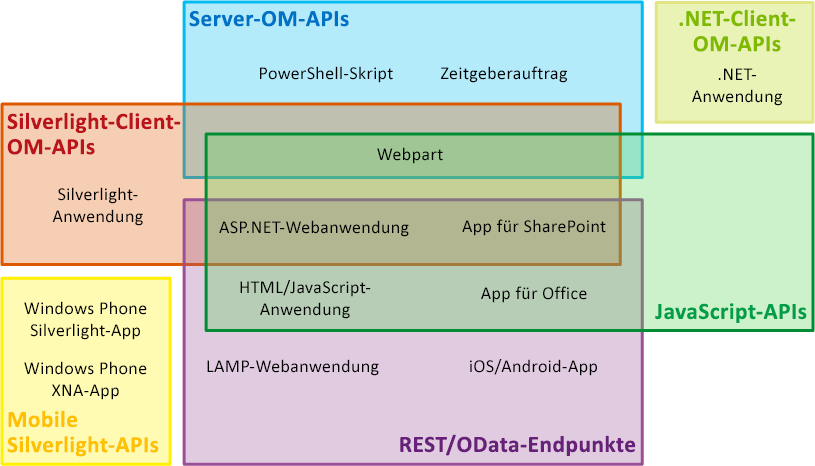
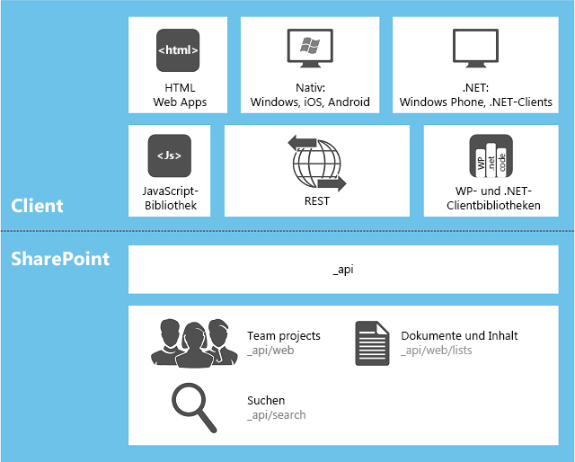

# Auswählen des richtigen API-Satzes in SharePointChoose the right API set in SharePoint
Erfahren Sie mehr über die verschiedenen API-Gruppen, die in SharePoint bereitgestellt werden, einschließlich des Serverobjektmodells und der verschiedenen Clientobjektmodellen und des REST/OData-Webdiensts.Learn about the several sets of APIs that are provided in SharePoint, including the server object model and the various client object models, and the REST/OData web service.
    
    

## Faktoren, die bestimmen, welche API-Gruppe verwendet werden sollFactors that determine which API set to use

Sie können aus verschiedenen API-Gruppen wählen, um auf die SharePoint-Plattform zuzugreifen. Welche Sie verwenden sollten, hängt von folgenden Faktoren ab:You can choose from several sets of APIs to access the SharePoint platform. Which one you use depends on the following factors:
  
    
    

- **Der Anwendungstyp.** Zu den Möglichkeiten gehören u. a. folgende, sich nicht gegenseitig ausschließende Kategorien: eine SharePoint-Add-In, ein Webpart auf einer SharePoint-Seite, eine Silverlight-Anwendung, die auf einem Client-Computer oder einem Client-Mobilgerät ausgeführt wird, eine ASP.NET-Anwendung, die in SharePoint über ein IFrame-Element verfügbar ist, JavaScript, das auf einer SharePoint-Websiteseite ausgeführt wird, eine SharePoint-Anwendungsseite, eine Microsoft .NET Framework-Anwendung, die auf einem Client-Computer ausgeführt wird, ein Windows PowerShell-Skript und ein Zeitgeberauftrag, der auf einem SharePoint-Server ausgeführt wird.**The type of application.** The possibilities include, but are not limited to, the following, which are not mutually exclusive categories: an SharePoint Add-in, a Web Part on a SharePoint page, a Silverlight application running on either a client computer or a client mobile device, an ASP.NET application exposed in SharePoint by an IFrame, JavaScript running in a SharePoint site page, a SharePoint application page, a Microsoft .NET Framework application running on a client computer, a Windows PowerShell script, and a timer job running on a SharePoint server.
    
  
- **Ihre vorhandenen Fachkenntnisse.** Überraschenderweise können Sie Anwendungen in SharePoint erstellen, ohne sich mit dem Programmieren in SharePoint beschäftigen zu müssen. Sie können direkt mit der SharePoint-Entwicklung beginnen, wenn Sie bereits versiert im Umgang mit folgenden Programmierungsmodellen sind:**Your existing skills.** To a surprising degree, you can create applications in SharePoint without needing to learn a lot about SharePoint programming. You can jump right into SharePoint development if you already have experience in any of the following programming models:
    
  - JavaScriptJavaScript
    
  
  - ASP.NETASP.NET
    
  
  - REST/ODataREST/OData
    
  
  - .NET Framework.NET Framework
    
  
  - Windows PhoneWindows Phone
    
  
  - SilverlightSilverlight
    
  
  - Windows PowerShellWindows PowerShell
    
  
- **Das Gerät, auf dem der Code ausgeführt wird.** Zu den Möglichkeiten gehört ein Server in der SharePoint-Farm, ein externer Server, wie z. B. ein Server in der Cloud, ein Client-Computer und ein Mobilgerät.**The device on which the code runs.** The possibilities include a server in the SharePoint farm, an external server such as a server in the cloud, a client computer, and a mobile device.
    
  
In diesem Thema erhalten Sie einen Überblick zu den verschiedenen API-Gruppen, die von SharePoint bereitgestellt werden. In Abbildung 1 ist dargestellt, welche API-Gruppen verwendet werden können, um eine der 13 allgemeinen SharePoint-bezogenen Anwendungen zu entwickeln. Bei vielen Anwendungen können Sie verschiedene APIs auswählen.This topic provides an overview of the various API sets that are provided by SharePoint. Figure 1 shows which sets of APIs can be used to develop each of 13 common SharePoint-related applications. For many applications, you can choose from more than one API.
  
    
    

**Abbildung 1. Ausgewählte SharePoint-Erweiterungstypen und API-Gruppen in SharePoint****Figure 1. Selected SharePoint extension types and SharePoint sets of APIs**

  
    
    

  
    
    

  
    
    

  
    
    
In der folgenden Tabelle finden Sie Anleitungen dazu, welche API-Gruppen Sie für eine ausgewählte Liste allgemeiner SharePoint-Erweiterungsprojekte verwenden sollten. In den restlichen Abschnitten dieses Themas werden die verschiedenen API-Gruppen erläutert.The following table provides guidance on which set of APIs to use for a selected list of common SharePoint extensibility projects. The remaining sections of this topic describe the various sets of APIs.
  
    
    

|**Wenn Sie diese Funktionen verwenden möchten...****If you want to do this ...**|**... sollten Sie diese APIs einsetzen****... use these APIs**|
|:-----|:-----|
|Erstellen Sie eine ASP.NET-Webanwendung, die Erstell-/Lese-/Aktualisier-/Lösch-Vorgänge über eine Firewall zu SharePoint-Daten oder externen Daten durchführt, die in SharePoint durch einen Microsoft Business Connectivity Services (BCS) externen Inhaltstyp dargestellt werdenCreate an ASP.NET web application that performs create/read/update/deleted (CRUD) operations across a firewall on SharePoint data or external data that is surfaced in SharePoint by a Microsoft Business Connectivity Services (BCS) external content type    |JavaScript-ClientobjektmodellJavaScript client object model    |
|Erstellen Sie eine ASP.NET-Webanwendung, die CRUD-Vorgänge zu SharePoint-Daten oder externen Daten durchführt, die in SharePoint durch einen externen BCS-Inhaltstyp dargestellt werden, SharePoint jedoch nicht über eine Firewall aufrufen müssenCreate an ASP.NET web application that performs CRUD operations on SharePoint data or external data that is surfaced in SharePoint by a BCS external content type, but does not have to call SharePoint across a firewall    |.NET Framework-Clientobjektmodell, Silverlight-Clientobjektmodell oder REST/OData-Endpunkte.NET Framework client object model, Silverlight client object model, or REST/OData endpoints    |
|Erstellen Sie eine LAMP-Webanwendung, die CRUD-Vorgänge zu SharePoint-Daten oder externen Daten durchführt, die in SharePoint durch einen externen BCS-Inhaltstyp dargestellt werdenCreate a LAMP web application that performs CRUD operations on SharePoint data or external data that is surfaced in SharePoint by a BCS external content type    |REST/OData-EndpunkteREST/OData endpoints    |
|Erstellen Sie eine Windows Phone-App, die CRUD-Vorgänge zu SharePoint-Daten durchführtCreate a Windows Phone app that performs CRUD operations on SharePoint data    |Mobiles ClientobjektmodellMobile client object model    |
|Erstellen Sie eine Windows Phone-App, die den Microsoft-Pushbenachrichtigungsdienst verwendet, um das Mobilgerät über Ereignisse in SharePoint zu benachrichtigenCreate a Windows Phone app that uses the Microsoft Push Notification Service to alert the mobile device of events in SharePoint    |Mobiles Clientobjektmodell und das ServerobjektmodellMobile client object model and the server object model    |
|Erstellen Sie eine iOS- oder Android-App, die CRUD-Vorgänge zu SharePoint-Daten durchführtCreate an iOS or Android app that performs CRUD operations on SharePoint data    |REST-/OData-EndpunkteREST/OData endpoints    |
|Erstellen Sie eine .NET Framework-Anwendung, die CRUD-Vorgänge zu SharePoint-Daten durchführtCreate a .NET Framework application that performs CRUD operations on SharePoint data    |.NET Framework-Clientobjektmodell.NET Framework client object model    |
|Erstellen Sie eine Silverlight-Anwendung, die CRUD-Vorgänge zu SharePoint-Daten durchführtCreate a Silverlight application that performs CRUD operations on SharePoint data    |Silverlight-ClientobjektmodellSilverlight client object model    |
|Erstellen Sie eine HTML/JavaScript-Anwendung, die CRUD-Vorgänge zu SharePoint-Daten durchführtCreate an HTML/JavaScript application that performs CRUD operations on SharePoint data    |JavaScript-ClientobjektmodellJavaScript client object model    |
|Erstellen Sie eine Office-Add-In, die mit SharePoint funktioniertCreate an Office Add-in that works with SharePoint    |JavaScript-ClientobjektmodellJavaScript client object model    |
|Erstellen Sie einen benutzerdefinierten Windows PowerShell-BefehlCreate a custom Windows PowerShell command    |ServerobjektmodellServer object model    |
|Erstellen eines ZeitgeberauftragsCreate a timer job    |ServerobjektmodellServer object model    |
|Erstellen einer Erweiterung der ZentraladministrationCreate an extension of Central Administration    |ServerobjektmodellServer object model    |
|Erstellen eines konsistenten Branding in einer ganzen SharePoint-FarmCreate consistent branding across an entire SharePoint farm    |ServerobjektmodellServer object model    |
|Erstellen eines benutzerdefinierten Webparts, einer Anwendungsseite oder eines ASP.NET-BenutzersteuerelementsCreate a custom Web Part, application page, or ASP.NET user control    |ServerobjektmodellServer object model    **Wichtig:** Wenn sich die Funktion, die Sie Kunden anbieten möchten, nicht an der SharePoint-Verwaltung in einem breiteren Bereich als eine Websitesammlung orientiert, wird empfohlen, anstatt das Serverobjektmodell zu verwenden, ein SharePoint-Add-In zu erstellen, das eine ASP.NET-Remote-Webanwendung mit benutzerdefinierten Webparts und ggf. Benutzersteuerelementen umfasst.**Important:** If the functionality you want to offer customers is not oriented to SharePoint administration at a scope broader than site collection, we recommend that, instead of using the server object model, you create an SharePoint Add-in that includes a remote ASP.NET web application with custom Web Parts and user controls as needed. Weitere Informationen dazu finden Sie in den oberen beiden Zeilen dieser Tabelle.See the top two rows of this table.           |
   

## ServerobjektmodellServer object model

Die größte API-Gruppe befindet sich im Serverobjektmodell der verwalteten Klassen. Auf der SharePoint Foundation 2013-Ebene umfasst dieses Objektmodell Klassen und Elemente, mit denen die Programmsteuerung der Basiswebsite und der Listenstruktur von SharePoint Foundation erfolgen kann. Der Großteil dieser Klassen befindet sich im  [Microsoft.SharePoint](https://msdn.microsoft.com/library/Microsoft.SharePoint.aspx) -Namespace. Außerdem können Sie fast jede SharePoint Foundation-Komponente erweitern, indem Sie das Serverobjektmodell verwenden, dazu gehören auch Workflows, Warnungen, Webparts, Standardsuchen und Microsoft Business Connectivity Services (BCS). Das Serverobjektmodell umfasst außerdem umfangreiche API-Gruppen-Aktivierungserweiterungen der Verwaltung und des Sicherheitssystems von SharePoint Foundation, einschließlich Sicherung, Farmintegrität und Diagnose, Protokollierung, Farm- und Webanwendungsverwaltung, Upgrade, Bereitstellung, Zwischenspeicherung und Windows PowerShell-Anpassung.The largest set of APIs is in the server object model of managed classes. At the level of SharePoint Foundation 2013, this object model includes classes and members that enable programmatic control of the basic site and list structure of SharePoint Foundation. Most of these classes are in the  [Microsoft.SharePoint](https://msdn.microsoft.com/library/Microsoft.SharePoint.aspx) namespace. In addition, you can extend almost every SharePoint Foundation component by using the server object model, including workflows, alerts, Web Parts, basic search, and Microsoft Business Connectivity Services (BCS). The server object model also includes an extensive set of APIs enable extensions of the administration and security system of SharePoint Foundation, including backup, farm health and diagnostics, logging, farm and web application management, upgrade, deployment, caching, and Windows PowerShell customization.
  
    
    
Auf der SharePoint-Ebene werden noch viele weitere Klassen hinzugefügt, um die Programmierung von Enterprise Content Management (ECM), Benutzerprofilen, Taxonomien, der erweiterten Suche und weiterer Features von SharePoint zu ermöglichen.At the level of SharePoint, many more classes are added to enable programming of Enterprise Content Management (ECM), user profiles, taxonomy, advanced search, and other features of SharePoint.
  
    
    
Sie können  [LINQ to Objects](http://msdn.microsoft.com/de-DE/library/bb397919.aspx) verwenden, um jede **IEnumerable**-Sammlung im Speicher abzufragen, mit  [LINQ to SharePoint-Anbieter](http://msdn.microsoft.com/library/3fa2dc5f-d308-4337-aefd-191a5df8dbbe%28Office.15%29.aspx) haben Sie jedoch die Möglichkeit, die Listen direkt in den SharePoint-Inhaltsdatenbanken abzufragen. Genau genommen ist dieser Anbieter nicht für die anderen in diesem Thema erläuterten API-Gruppen verfügbar; es gibt jedoch Möglichkeiten, LINQ-Syntax für den Großteil der anderen Gruppen zu verwenden.You can use  [LINQ to Objects](http://msdn.microsoft.com/de-DE/library/bb397919.aspx) to query any **IEnumerable** collection in memory, but a [LINQ to SharePoint provider](http://msdn.microsoft.com/library/3fa2dc5f-d308-4337-aefd-191a5df8dbbe%28Office.15%29.aspx) enables direct querying of the lists in the SharePoint content databases. Strictly speaking, this provider is not available with any other set of APIs discussed in this topic; however, there are ways to use LINQ syntax in most of the others.
  
    
    
Die Assemblys, die die integrierten serverseitigen Klassen definieren, sind im globalen Assemblycache jedes Servers installiert, wenn SharePoint installiert ist. Wenn Sie etwas für das Serverobjektmodell programmieren, werden Ihre Assemblys als Farmlösungen im globalen Assemblycache installiert.The assemblies that define the built-in server-side classes are installed to the global assembly cache of each server when SharePoint is installed. When you program against the server object model, your assemblies are installed as farm solutions to the global assembly cache.
  
> [!NOTE]
> Das Entwickeln von neuen Sandkastenlösungen für SharePoint ist eine veraltete Methode, die dem Entwickeln von SharePoint-Add-Ins gewichen ist. Sandkastenlösungen können jedoch weiterhin in Websitesammlungen in SharePoint installiert werden.Note: Developing new sandboxed solutions against SharePoint is deprecated in favor of developing SharePoint Add-ins, but sandboxed solutions can still be installed to site collections on SharePoint. Die Assemblys dieser Lösungen verbleiben im Paket, sofern sie nicht verwendet werden, ansonsten werden sie temporär in einem Ordner auf dem Server installiert.The assemblies of these solutions remain in the package except when they are actually in use, at which time they are temporarily installed to a folder on the server. Weitere Informationen finden Sie unter [Wo werden Assemblys in Sandkastenlösungen bereitgestellt?](http://msdn.microsoft.com/library/dadbb20b-1bf7-442c-9eeb-bd9f01dbda45%28Office.15%29.aspx).For more information, see  [Where are Assemblies in Sandboxed Solutions Deployed?](http://msdn.microsoft.com/library/dadbb20b-1bf7-442c-9eeb-bd9f01dbda45%28Office.15%29.aspx). 
  
    
    

### Beschränkungen zum Verwenden des ServerobjektmodellsLimitations on when you can use the server object model

Die benutzerdefinierte Logik in SharePoint-Add-Ins wird immer "hinunter" bis zum Client oder "hinauf" zur Cloud verteilt (oder "hinüber" zu einem Server außerhalb der SharePoint-Farm). In all diesen Verteilungsmodellen muss eines der Clientobjektmodelle oder die die REST/OData-Endpunkte verwendet werden. (Sie können das Serverobjektmodell nicht in einer SharePoint-Add-In verwenden). Wenn die App beispielsweise von SharePoint gehostete Seiten enthält, können diese Seiten auf SharePoint-Daten zugreifen, indem Sie das JavaScript-Clientobjektmodell verwenden. Diese Seiten können auch Silverlight-Anwendungen verfügbar machen, die das SharePoint Silverlight-Clientobjektmodell verwenden. Weitere Informationen über SharePoint-Add-Ins finden Sie unter  [Wichtige Aspekte der Architektur und Entwicklungslandschaft von Add-Ins für SharePoint](http://msdn.microsoft.com/library/ae96572b-8f06-4fd3-854f-fc312f7f2d88%28Office.15%29.aspx).Custom logic in SharePoint Add-ins is always distributed "down" to the client or "up" to the cloud (or "over" to some server outside the SharePoint farm). In all of these distribution models, one of the client object models or the REST/OData endpoints must be used. (You cannot use the server object model in an SharePoint Add-in.) For example, if the app contains SharePoint-hosted pages, those pages can access SharePoint data by using the JavaScript client object model. Such pages could also expose Silverlight applications that use the SharePoint Silverlight client object model. For more information about SharePoint Add-ins, see  [Important aspects of the SharePoint Add-in architecture and development landscape](http://msdn.microsoft.com/library/ae96572b-8f06-4fd3-854f-fc312f7f2d88%28Office.15%29.aspx).
  
    
    

## Clientobjektmodelle für verwalteten CodeClient object models for managed code

SharePoint verfügt über drei Clientobjektmodelle für verwalteten Code: .NET, Silverlight und Mobil.SharePoint has three client object models for managed code: .NET, Silverlight, and mobile.
  
    
    

### .NET-Clientobjektmodell.NET client object model

Das SharePoint-Objektmodell für .NET Framework wird in .NET Framework-Anwendungen verwendet, die auf einem Windows-Client (kein Telefon) ausgeführt werden. Folgende Clients gehören zu dieser Gruppe:The SharePoint object model for .NET Framework is used in .NET Framework applications that run on a non-phone Windows client. Any of the following counts as such a client:
  
    
    

- Ein Benutzer-ComputerA user's computer
    
  
- Ein Server außerhalb der SharePoint-FarmA server that is external to the SharePoint farm
    
  
- Eine Webrolle oder Workerrolle in Microsoft AzureA web role or worker role on Microsoft Azure
    
  
Nahezu jede Klasse im zentralen serverseitigen Objektmodell für Websites und Listen verfügt über eine entsprechende Klasse im .NET Framework-Clientobjektmodell.Almost every class in the core site and list server object model has a corresponding class in the .NET Framework client object model. Außerdem macht das .NET Framework-Clientobjektmodell eine vollständige API-Gruppe zum Erweitern weiterer Features verfügbar. Dazu gehören einige SharePoint-Features, wie z. B. ECM, Taxonomie, Benutzerprofile, erweiterte Suche, Analyse, BCS und andere.In addition, the .NET Framework client object model exposes a full set of APIs for extending other features, including some SharePoint features such as ECM, taxonomy, user profiles, advanced search, analytics, BCS, and others.
  
    
    
Um die Leistung zu verbessern, werden im .NET Framework-Clientobjektmodell geschriebene Codezeilen in Batches an den SharePoint-Server gesendet. Dort werden sie in serverseitigen Code konvertiert und ausgeführt. Die abgefragten Ergebnisse und der neue Status aller Variablen werden anschließend an den Client zurückgegeben. Als Entwickler können Sie bestimmen, ob ein Batch synchron oder asynchron ausgeführt wird. (Bei einem synchronen Batch wartet die .NET Framework-Anwendung auf die vom Server zurückgegebenen Ergebnisse, bevor sie fortfährt; bei einem asynchronen Batch wird die clientseitige Verarbeitung sofort fortgesetzt und Client-Benutzeroberfläche bleibt reaktionsfähig.To improve performance, lines of code written against in the .NET Framework client object model are sent to the SharePoint server in batches where they are converted to server-side code and executed. The queried results, and the new state of all variables, are then returned to the client. You as the developer determine whether a batch runs synchronously or asynchronously. (In a synchronous batch, the .NET Framework application waits for the returned results from the server before continuing; in an asynchronous batch, client-side processing continues immediately and the client user interface (UI) remains responsive.)
  
    
    
Sie können LINQ-Abfragesyntax in Ihrem Clientcode verwenden, um beliebige **IEnumerable**-Objekte abzufragen, dazu gehören auch SharePoint-Objekte, in denen **IEnumerable** implementiert ist. Wenn Sie so vorgehen, verwenden Sie jedoch [LINQ to Objects](http://msdn.microsoft.com/de-DE/library/bb397919.aspx) und nicht [LINQ to SharePoint-Anbieter](http://msdn.microsoft.com/library/3fa2dc5f-d308-4337-aefd-191a5df8dbbe%28Office.15%29.aspx), die dazugehörige Dokumentation ist also für clientseitigen Code nicht relevant.You can use LINQ query syntax in your client code to query any **IEnumerable** object, including SharePoint objects that implement **IEnumerable**. However, when you do this, you are using  [LINQ to Objects](http://msdn.microsoft.com/de-DE/library/bb397919.aspx), not the  [LINQ to SharePoint provider](http://msdn.microsoft.com/library/3fa2dc5f-d308-4337-aefd-191a5df8dbbe%28Office.15%29.aspx), so documentation of the latter is not relevant to client-side code.
  
    
    
Die Assemblys für das .NET Framework-Clientobjektmodel muss auf dem Client installiert sein. Sie sind in einem verteilbaren Paket enthalten, das Sie unter  [SharePoint-Clientkomponenten](http://www.microsoft.com/en-us/download/details.aspx?id=35585) abrufen können.The assemblies for the .NET Framework client object model must be installed on the client. They are included in a redistributable package that you can obtain on the  [SharePoint Client Components](http://www.microsoft.com/en-us/download/details.aspx?id=35585).
  
    
    
Beispiele zur Verwendung des .NET Framework-Objektmodells finden Sie unter [Ausführen grundlegender Vorgänge unter Verwendung von SharePoint-Clientbibliothekscode](http://msdn.microsoft.com/library/5a69c9e3-73bf-4ed5-bc19-182056bdb394%28Office.15%29.aspx).For examples of using the .NET Framework object model, see  [Complete basic operations using SharePoint client library code](http://msdn.microsoft.com/library/5a69c9e3-73bf-4ed5-bc19-182056bdb394%28Office.15%29.aspx).
  
> [!NOTE]
> Sie können auch die SharePoint REST/OData-Endpunkte in einer .NET Framework-Anwendung verwenden.Note: You can also use the SharePoint REST/OData endpoints in a .NET Framework application. Einen Vergleich des .NET Framework-Clientobjektmodells mit den SharePoint REST-/OData-Endpunkten finden Sie im Abschnitt [REST-/OData-Endpunkte](#RESTOData) weiter unten in diesem Artikel.For a comparison of the .NET Framework client object model with the SharePoint REST/OData endpoints, see the section  [REST/OData endpoints](#RESTOData) later in this article.
  
    
    

### Silverlight-ClientobjektmodellSilverlight client object model

Das SharePoint-Objektmodell für Silverlight wird in Silverlight-Anwendungen unabhängig davon verwendet, wo die kompilierte XAP-Datei gespeichert ist. Das kann eine Objektbibliothek auf einer SharePoint-Website, ein Client-Computer, ein Cloud-Speicher oder ein externer Server sein. In der Regel wird eine Silverlight-Anwendung SharePoint in einem  [SilverlightWebPart](https://msdn.microsoft.com/library/Microsoft.SharePoint.WebPartPages.SilverlightWebPart.aspx) -Objekt dargestellt. Das Silverlight-Clientobjektmodell in SharePoint ist fast identisch mit dem .NET Framework-Clientobjektmodell und umfasst Unterstützung für die gleichen Erweiterbarkeitsbereiche. Der Hauptunterschied liegt darin, dass in der Silverlight-Version alle Batches der Befehle asynchron an den Server gesendet werden, damit die Benutzeroberfläche aktiv bleibt.The SharePoint object model for Silverlight is used in Silverlight applications, regardless of where the compiled .xap file is persisted. It may be in an assets library on a SharePoint website, on a client computer, in cloud storage, or on an external server. Typically, a Silverlight application is surfaced in SharePoint in a  [SilverlightWebPart](https://msdn.microsoft.com/library/Microsoft.SharePoint.WebPartPages.SilverlightWebPart.aspx) object. The Silverlight client object model in SharePoint is nearly identical to the .NET Framework client object model, and it includes support for the same extensibility areas. The principal difference is that in the Silverlight version, all batches of commands are sent to the server asynchronously so that the UI of the application remains active.
  
    
    
Die Assemblys für das Silverlight-Clientobjektmodel werden auf jedem SharePoint-Server unter %ProgramFiles%\\Common Files\\Microsoft Shared\\web server extensions\\15\\TEMPLATE\\LAYOUTS\\ClientBin gespeichert. Sie müssen nicht auf dem Computer installiert werden, auf dem die Silverlight-Anwendung läuft, haben jedoch die Möglichkeit dazu. Sie können sie auch in der XAP-Datei der Anwendung zu einem Paket zusammenfassen.The assemblies for the Silverlight client object model are persisted on every SharePoint server at %ProgramFiles%\\Common Files\\Microsoft Shared\\web server extensions\\15\\TEMPLATE\\LAYOUTS\\ClientBin. They do not have to be installed on the computer that is running the Silverlight application, although you have the option of doing so. Also, you can package them into the .xap file of the application.
  
    
    
Silverlight XAP-Dateien können einer SharePoint-Add-Ins hinzugefügt werden, darunter auch von SharePoint gehostete Apps. Dabei wird die XAP-Datei in einer Bibliothek im App-Web bereitgestellt. (Weitere Informationen zu App-Webs finden Sie unter [Hostwebsites, Add-In-Websites und SharePoint-Komponenten in SharePoint](http://msdn.microsoft.com/library/b791cdf5-8aa2-47fa-bc4c-aee437354759%28Office.15%29.aspx).) So erhält man mit der Silverlight-App eine nützliche Methode zum Hinzufügen von benutzerdefiniertem SharePoint-Code in einer App, da benutzerdefinierter serverseitiger Code in SharePoint-Add-Ins nicht zulässig ist. Zudem können Silverlight-Entwickler für die Erstellung von SharePoint-Anwendungen mit einer minimalen Lernkurve nutzen.Silverlight .xap files can be included in SharePoint Add-ins, including SharePoint-hosted apps. In the latter case, the .xap file is deployed to a library on the app web. (For more information about app webs, see  [Host webs, add-in webs, and SharePoint components in SharePoint](http://msdn.microsoft.com/library/b791cdf5-8aa2-47fa-bc4c-aee437354759%28Office.15%29.aspx).) This makes a Silverlight application a useful way of including custom SharePoint code in an app, because custom server-side code is not allowed in SharePoint Add-ins. It also enables Silverlight developers to use their existing skills to create SharePoint applications with a minimal learning curve.
  
> [!NOTE]
> Sie können auch die SharePoint REST-/OData-Endpunkte in einer Silverlight-Anwendung verwenden.Note: You can also use the SharePoint REST/OData endpoints in a Silverlight application. Einen Vergleich des Silverlight-Clientobjektmodells mit den SharePoint REST-/OData-Endpunkten finden Sie im Abschnitt [REST-/OData-Endpunkte](#RESTOData) weiter unten in diesem Artikel.For a comparison of the Silverlight client object model with the SharePoint REST/OData endpoints, see the section  [REST/OData endpoints](#RESTOData) later in this article.
  
    
    

### Mobiles ObjektmodellMobile object model

Für Windows Phone-Geräte ist eine spezielle Version des Silverlight-Clientobjektmodells verfügbar. Es umfasst zusätzliche APIs, die nur für Telefone relevant sind, wie z. B. APIs, mit der sich eine Smartphone-App für Benachrichtigungen vom Microsoft-Pushbenachrichtigungsdienst registrieren kann. Sie unterstützt alle wichtigen SharePoint-Funktionen; es bietet jedoch keine Unterstützung für Nebenerweiterungsbereiche, die von den anderen beiden Clientobjektmodellen für verwalteten Code unterstützt werden. Verwenden Sie zum Zugreifen auf diese zusätzlichen Bereiche die SharePoint REST/OData-Endpunkte in Ihrer mobilen App. Weitere Informationen dazu finden Sie im Abschnitt  [REST/OData-Endpunkte](#RESTOData) weiter unten in diesem Artikel.A special version of the Silverlight client object model is available for Windows Phone devices. It includes some additional APIs that are relevant only to telephones, such as APIs that enable a phone app to register for notifications from the Microsoft Push Notification Service. It supports all core SharePoint functionality; however, it does not provide support for any of the non-core extensibility areas that are supported by the other two client object models for managed code. To access those additional areas, use the SharePoint REST/OData endpoints in your mobile app. See the section  [REST/OData endpoints](#RESTOData) later in this article.
  
    
    
Die Assemblys für das mobile Objektmodell werden auf jedem SharePoint-Server unter %ProgramFiles%\\Common Files\\Microsoft Shared\\web server extensions\\15\\TEMPLATE\\LAYOUTS\\ClientBin gespeichert. Sie können Sie in der XAP-Datei in Ihrer Windows Phone-Anwendung zu einem Paket zusammenfassen.The assemblies for the mobile object model are persisted on every SharePoint server at %ProgramFiles%\\Common Files\\Microsoft Shared\\web server extensions\\15\\TEMPLATE\\LAYOUTS\\ClientBin. You package them into the .xap file of your Windows Phone application.
  
    
    

## JavaScript-ObjektmodellJavaScript object model

SharePoint stellt ein JavaScript-Objektmodell für die Nutzung in einem Inline-Skript oder separaten JS-Dateien bereit. Es umfasst die gleichen Funktionen wie die Clientobjektmodelle .NET Framework und Silverlight. Genau wie das Silverlight-Clientobjektmodell bietet das JavaScript-Objektmodell eine nützliche Methode zum Hinzufügen von benutzerdefiniertem SharePoint-Code in einer App, da benutzerdefinierter serverseitiger Code in SharePoint-Add-Ins nicht zulässig ist. Zudem können Webentwickler ihre vorhandenen JavaScript-Kenntnisse für die Erstellung von SharePoint-Anwendungen mit einer minimalen Lernkurve nutzen.SharePoint provides a JavaScript object model for use in either inline script or separate .js files. It includes all the same functionality as the .NET Framework and Silverlight client object models. Like the Silverlight client object model, the JavaScript object model is a useful way of including custom SharePoint code in an app, because custom server-side code is not allowed in SharePoint Add-ins. It also enables web developers to use their existing JavaScript skills to create SharePoint applications with a minimal learning curve.
  
    
    
Genau wie Objektmodelle mit verwaltetem Code interagiert die JavaScript-Infrastruktur für SharePoint mit den Farm-Servern in Batches. Diese Batches werden immer asynchron ausgeführt. Außerdem ist es nun möglich, in JavaScript domänenübergreifend auf SharePoint-Daten zuzugreifen (jedoch nur Daten, die sich in der gleichen übergeordneten Websitesammlung befinden), was in vorherigen SharePoint-Versionen nicht möglich war. Weitere Informationen finden Sie unter  [Zugreifen auf SharePoint-Daten über Add-Ins mithilfe der domänenübergreifenden Bibliothek](http://msdn.microsoft.com/library/bc37ff5c-1285-40af-98ae-01286696242d%28Office.15%29.aspx). Daten werden in JavaScript Object Notation (JSON) vom Server zurückgegeben.Just like the managed-code client object models, the JavaScript infrastructure for SharePoint interacts with the farm servers in batches. These batches always run asynchronously. In addition, it is now possible to access SharePoint data across domains in JavaScript (but only data that is within the same parent site collection), which was not allowed in previous versions of SharePoint. For more information, see  [Access SharePoint data from add-ins using the cross-domain library](http://msdn.microsoft.com/library/bc37ff5c-1285-40af-98ae-01286696242d%28Office.15%29.aspx). Data is returned from the server in JavaScript Object Notation (JSON).
  
    
    
Das JavaScript-Objektmodell ist in einer JS-Dateigruppe definiert, die sich auf jedem Server unter %ProgramFiles%\\Common Files\\Microsoft Shared\\web server extensions\\15\\TEMPLATE\\LAYOUTS befinden.The JavaScript object model is defined in a set of \*.js files located at %ProgramFiles%\\Common Files\\Microsoft Shared\\web server extensions\\15\\TEMPLATE\\LAYOUTS on each server.
  
    
    
Beispiele zur Verwendung des .NET Framework-Objektmodells finden Sie unter [Ausführen grundlegender Vorgänge unter Verwendung von JavaScript-Bibliothekscode in SharePoint](http://msdn.microsoft.com/library/29089af8-dbc0-49b7-a1a0-9e311f49c826%28Office.15%29.aspx).For examples of using the .NET Framework object model, see  [Complete basic operations using JavaScript library code in SharePoint](http://msdn.microsoft.com/library/29089af8-dbc0-49b7-a1a0-9e311f49c826%28Office.15%29.aspx).
  
> [!NOTE]
> Sie können auch die SharePoint REST-/OData-Endpunkte in einer JavaScript-Anwendung verwenden.Note: You can also use the SharePoint REST/OData endpoints in a JavaScript application. Einen Vergleich des JavaScript-Clientobjektmodells mit den SharePoint REST-/OData-Endpunkten finden Sie im Abschnitt [REST-/OData-Endpunkte](#RESTOData).For a comparison of the JavaScript client object model with SharePoint's REST/OData endpoints, see the following section,  [REST/OData endpoints](#RESTOData). 
  
    
    

## REST-/OData-EndpunkteREST/OData endpoints

Für den Zugriff auf SharePoint-Entitäten über Clienttechnologien, die nicht JavaScript verwenden und nicht auf den Plattformen .NET Framework oder Silverlight basieren, bietet SharePoint eine Implementierung eines REST-Webdiensts, der CRUDQ-Vorgänge bei SharePoint-Listendaten über das  [OData-Protokoll](http://www.odata.org/) ausführt. Zudem verfügt nahezu jede API in den Clientobjektmodellen über einen entsprechenden REST-Endpunkt. Dadurch kann im Code mithilfe jeder Technologie, die REST-Standardfunktionen unterstützt, direkt mit SharePoint interagiert werden. Der Webdienst "svc.web" behandelt die HTTP-Anforderung und liefert eine Antwort im Atom- oder JSON-Format.For scenarios in which you need to access SharePoint entities from client technologies that do not use JavaScript and are not built on the .NET Framework or Silverlight platforms, SharePoint provides an implementation of a Representational State Transfer (REST) web service that uses the  [OData protocol](http://www.odata.org/) to perform CRUD operations on SharePoint list data. In addition, almost every API in the client object models has a corresponding REST endpoint. This enables your code to interact directly with SharePoint artifacts by using any technology that supports standard HTTP requests and responses. To use the REST capabilities that are built into SharePoint, your code constructs a RESTful HTTP request to an endpoint that corresponds to the desired client object model API. The client.svc web service handles the HTTP request and serves a response in either Atom or JSON format.
  
    
    
Weitere Informationen über den REST/OData-Webdienst finden Sie unter dem Knoten  [Programmieren mit dem SharePoint REST-Dienst](http://msdn.microsoft.com/library/d4b5c277-ed50-420c-8a9b-860342284b72%28Office.15%29.aspx); Beispiele dazu finden Sie im Thema  [Ausführen grundlegender Vorgänge unter Verwendung von SharePoint-REST-Endpunkten](http://msdn.microsoft.com/library/e3000415-50a0-426e-b304-b7de18f2f7d9%28Office.15%29.aspx).For more information about using the REST/OData web service, see the node  [Use OData query operations in SharePoint REST requests](http://msdn.microsoft.com/library/d4b5c277-ed50-420c-8a9b-860342284b72%28Office.15%29.aspx); for examples, see the topic  [Complete basic operations using SharePoint REST endpoints](http://msdn.microsoft.com/library/e3000415-50a0-426e-b304-b7de18f2f7d9%28Office.15%29.aspx).
  
    
    

### Vergleich zur REST/OData-Programmierung mit der Clientobjektmodell-ProgrammierungComparing REST/OData programming with client object model programming

In einigen Situationen ist die Verwendung von REST-Endpunkten möglicherweise vorzuziehen, selbst in Anwendungen, in denen ein SharePoint-Objektmodell verfügbar ist. Insbesondere für Entwickler, die über keine Erfahrung Im Entwickeln von Windows-basiertem Code haben. In der folgenden Tabelle finden Sie einen Vergleich zwischen den wichtigsten Funktionen dieser Programmierungsoptionen für einen Entwickler, der eine Anwendung auf einer Windows-Plattform oder mit einer Plattform erstellt, die JavaScript unterstützt.In some situations, it might be preferable to use the REST endpoints even in applications for which a SharePoint object model is available, especially for developers who do not have Windows development experience. The following table provides a comparison of the major features of these programming choices for a developer creating an application on a Windows platform or with a platform that supports JavaScript.
  
    
    

|**Funktion****Feature**|**.NET Framework oder Silverlight-Objektmodelle****.NET Framework or Silverlight object models**|**JavaScript-Objektmodell****JavaScript object model**|**Von einer Windows-Plattform oder von JavaScript abgerufene REST/OData-Endpunkte****REST/OData endpoints called from a Windows platform or JavaScript**|
|:-----|:-----|:-----|:-----|
|Objektorientiertes ProgrammierenObject-oriented programming    |JaYes    |JaYes    |NeinNo    |
|Batch-VerarbeitungBatch processing    |JaYes    |JaYes    |JaYes    |
|APIs für die bedingte Verarbeitung und AusnahmebehandlungenAPIs for conditional processing and exception handling    |JaYes    |NeinNo    |NeinNo    |
|Verfügbarkeit der LINQ-SyntaxAvailability of LINQ syntax    |JaYes    |NeinNo    |NeinNo    |
|Kombinieren von Listendaten aus verschiedenen SharePoint-WebanwendungenCombining list data from different SharePoint web applications    |JaYes    |NeinNo    |JaYes    |
|Vertrautheit für erfahrene REST/OData-EntwicklerFamiliarity to experienced REST/OData developers    |NeinNo    |NeinNo    |JaYes    |
|Ähnlichkeiten zur nicht-Windows-Programmierung oder JavaScript-ProgrammierungSimilarity to non-Windows programming or JavaScript programming    |NeinNo    |JaYes    |JaYes    |
|Starke Typisierung für ListenelementfelderStrong typing for list item fields    |Nein (außer mit LINQ)No (except with LINQ)    |NeinNo    |Ja, von einer Windows-Plattform          Nein, von JavaScriptYes, from Windows platform          No, from JavaScript    |
|Nutzen von jQuery, Knockout und anderen JavaScript-BibliothekenLeveraging jQuery, Knockout, and other JavaScript libraries    |NeinNo    |JaYes    |Nein, von einer Windows-Plattform          Ja, von JavaScriptNo, from Windows platform          Yes, from JavaScript    |
   

## Framework für die WCF Data ServicesWCF Data Services Framework

Wenn Sie LINQ-Syntax in .NET Framework- oder Silverlight-Clientanwendungen bevorzugen, unterstützt SharePoint die  [WCF Data Services](http://msdn.microsoft.com/de-DE/library/cc668792.aspx) als LINQ-Anbieter. Sie können wie in vorherigen Versionen von SharePoint Foundation die "listdata.svc" (nur für Listendaten) vorgeben, oder die gleiche "client.svc" vorgeben, die die OData-Schnittstelle für den Zugriff auf alle SharePoint-Entitäten und Listendaten unterstützt. Weitere Informationen dazu finden Sie unter [Abfragen von SharePoint Foundation mit ADO.NET Data Services](http://msdn.microsoft.com/library/3e3e16f7-620a-4710-a3f3-19d0236f4b4a%28Office.15%29.aspx).If you prefer to use LINQ syntax in .NET Framework or Silverlight client applications, SharePoint supports  [WCF Data Services](http://msdn.microsoft.com/de-DE/library/cc668792.aspx) as a LINQ provider. You can target either the listdata.svc (for list data only) as in earlier versions of SharePoint Foundation, or you can target the same client.svc that supports the OData interface for access to all SharePoint entities in addition to list data. For more information, see [Query SharePoint Foundation with ADO.NET Data Services](http://msdn.microsoft.com/library/3e3e16f7-620a-4710-a3f3-19d0236f4b4a%28Office.15%29.aspx).
  
    
    
In Abbildung 2 ist die Beziehung zwischen den verschiedenen Client-APIs, verschiedenen Client-Anwendungstypen und SharePoint dargestellt. Die unterschiedlichen _api\*-URLs sind die farmrelativen URLs für die REST-Endpunkte. Weitere Informationen dazu finden Sie unter dem Thema  [Weitere Informationen zum SharePoint 15 REST-Dienste](http://msdn.microsoft.com/library/2de035a0-ac75-43bd-9665-5c5a59c4c590%28Office.15%29.aspx#bk_learnmore).Figure 2 illustrates the relationship of the various client APIs, various types of client applications, and SharePoint. The various _api\* URLs are the farm-relative URLs for the REST endpoints. For more information, see the topic  [Learning more about the SharePoint 15 REST service](http://msdn.microsoft.com/library/2de035a0-ac75-43bd-9665-5c5a59c4c590%28Office.15%29.aspx#bk_learnmore).
  
    
    

**Abbildung 2. Client-Anwendungen und APIs in SharePoint****Figure 2. Client applications and APIs in SharePoint**

  
    
    

  
    
    

  
    
    

  
    
    

  
    
    

## Veraltete API-GruppenDeprecated API sets

Zwei API-Gruppen werden weiterhin im SharePoint-Framework für die Abwärtskompatibilität unterstützt, es wird jedoch empfohlen, sie nicht für neue Projekte zu verwenden: die  [ASP.NET-Webdienste (asmx)](http://msdn.microsoft.com/library/c587ee90-1f88-43f3-b1a7-5f3072d038f8%28Office.15%29.aspx) und [direkte Remoteprozeduraufrufe rufen die Datei owssvr.dll](http://msdn.microsoft.com/library/4aa5c82b-90fb-4be5-b30c-d35ecae42a81%28Office.15%29.aspx) auf.Two API sets are still supported in the SharePoint framework for backward compatibility, but we recommend that you not use them for new projects: the  [ASP.NET (asmx) web services](http://msdn.microsoft.com/library/c587ee90-1f88-43f3-b1a7-5f3072d038f8%28Office.15%29.aspx), and  [direct Remote Procedure Calls (RPC) calls to the owssvr.dll](http://msdn.microsoft.com/library/4aa5c82b-90fb-4be5-b30c-d35ecae42a81%28Office.15%29.aspx) file.
  
    
    

## Siehe auchSee also

-  [Übersicht über die SharePoint-EntwicklungSharePoint development overview](sharepoint-development-overview.md)
    
  
-  [Programmiermodelle in SharePointProgramming models in SharePoint](programming-models-in-sharepoint.md)
    
  
-  [SharePoint-Add-Ins im Vergleich zu SharePoint-LösungenSharePoint Add-ins compared with SharePoint solutions](sharepoint-add-ins-compared-with-sharepoint-solutions.md)
    
  
-  [Programmieren mit dem SharePoint REST-DienstUse OData query operations in SharePoint REST requests](http://msdn.microsoft.com/library/d4b5c277-ed50-420c-8a9b-860342284b72%28Office.15%29.aspx)
    
  
-  [Ausführen grundlegender Vorgänge unter Verwendung von SharePoint-REST-EndpunktenComplete basic operations using SharePoint REST endpoints](http://msdn.microsoft.com/library/e3000415-50a0-426e-b304-b7de18f2f7d9%28Office.15%29.aspx)
    
  
-  [Ausführen grundlegender Vorgänge unter Verwendung von SharePoint-ClientbibliothekscodeComplete basic operations using SharePoint client library code](http://msdn.microsoft.com/library/5a69c9e3-73bf-4ed5-bc19-182056bdb394%28Office.15%29.aspx)
    
  
-  [Ausführen grundlegender Vorgänge unter Verwendung von JavaScript-Bibliothekscode in SharePointComplete basic operations using JavaScript library code in SharePoint](http://msdn.microsoft.com/library/29089af8-dbc0-49b7-a1a0-9e311f49c826%28Office.15%29.aspx)
    
  
-  [Abfragen von SharePoint Foundation mit ADO.NET Data ServicesQuery SharePoint Foundation with ADO.NET Data Services](http://msdn.microsoft.com/library/3e3e16f7-620a-4710-a3f3-19d0236f4b4a%28Office.15%29.aspx)
    
  

  
    
    
