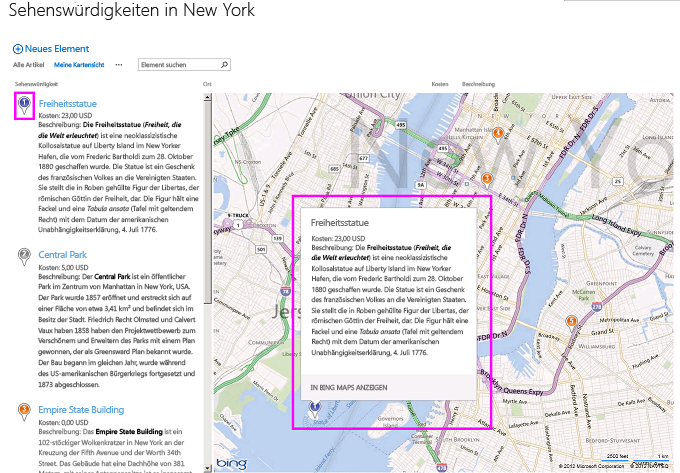

# <a name="create-a-map-view-for-the-geolocation-field-in-sharepoint"></a><span data-ttu-id="e6fee-102">Erstellen einer Kartenansicht für das Geolocation-Feld in SharePoint</span><span class="sxs-lookup"><span data-stu-id="e6fee-102">Create a map view for the Geolocation field in SharePoint</span></span>
<span data-ttu-id="e6fee-p101">Erfahren Sie, wie Standortinformationen mithilfe einer Kartenansicht in SharePoint Listen anzeigen. Sie können eine Kartenansicht über die SharePoint-Benutzeroberfläche (UI) manuell oder programmgesteuert mit den neuen Feldtyp für **Geolocation** erstellen. SharePoint führt einen neuen Feldtyp mit dem Namen **Geolocation**, die Ihnen das Hinzufügen von SharePoint-Listen mit Standortinformationen Anmerkungen ermöglicht. Beispielsweise können jetzt stellen "Standortbasierte" enthält und Breiten- und Längengrad Koordinaten über Bing Maps anzuzeigen. Ein Eintrag wird in der Regel als eine PIN auf einer Kartenansicht betrachtet.</span><span class="sxs-lookup"><span data-stu-id="e6fee-p101">Learn how to display location information by using a map view in SharePoint lists. You can create a map view manually via the SharePoint user interface (UI) or programmatically by using the new **Geolocation** field type. SharePoint introduces a new field type named **Geolocation** that enables you to annotate SharePoint lists with location information. For example, you can now make lists "location-aware" and display latitude and longitude coordinates through Bing Maps. An entry is typically seen as a pushpin on a map view.</span></span>
  
    
    

<span data-ttu-id="e6fee-p102">Um einer Kartenansicht in einer SharePoint-Liste anzuzeigen, müssen Sie die Bing Maps-Dienste verwenden. Das **Geolocation** -Feld ist nicht verfügbar, wenn Sie eine Liste erstellen, über die Benutzeroberfläche. Dieses Feld muss stattdessen programmgesteuert eingefügt werden. Informationen zum Rendern und Programmgesteuertes Arbeiten mit diesen Datentyp finden Sie unter [Integrieren von Standort- und Kartenfunktionen in SharePoint](integrating-location-and-map-functionality-in-sharepoint.md). Das Feld **Geolocation** und Kartenansicht können Sie räumliche Kontext für alle Informationen bereitgestellt, durch die Integration von Daten aus SharePoint in einer Zuordnung in Web- und mobilen apps. In diesem Artikel wird nicht erläutert, wie das Feld **Geolocation** rendern oder enthalten Anleitungen für Entwickler zum Erstellen einer mobilen speicherortbasierte Anwendung; Es stellt Anweisung mithilfe von Bing Maps für Kartenansichten programmgesteuert zu erstellen und von der SharePoint-UI bereit.</span><span class="sxs-lookup"><span data-stu-id="e6fee-p102">To display a map view in a SharePoint list, you must use the Bing Maps services. The **Geolocation** field is not available when you create a list by using the UI. Instead, this field must be inserted programmatically. For information about how to render and work with this data type programmatically, see [Integrating location and map functionality in SharePoint](integrating-location-and-map-functionality-in-sharepoint.md). The **Geolocation** field and the map view enable you to give spatial context to any information by integrating data from SharePoint into a mapping experience in web and mobile apps. This article does not explain how to render the **Geolocation** field or provide developer guidance for creating a location-based mobile application; it does provide instruction for creating map views programmatically and from the SharePoint UI by using Bing Maps.</span></span>
  
    
    

<span data-ttu-id="e6fee-114">Sie müssen ein MSI-Paket mit dem Namen "SQLSysClrTypes.msi" auf jedem SharePoint-Front-End-Webserver installieren, um **Geolocation**-Feldwerte oder -Daten in einer Liste anzuzeigen.</span><span class="sxs-lookup"><span data-stu-id="e6fee-114">An MSI package named SQLSysClrTypes.msi must be installed on every SharePoint front-end web server to view the **Geolocation** field value or data in a list.</span></span> <span data-ttu-id="e6fee-115">Dieses Paket installiert Komponenten, welche die neuen Geometrie-, Geografie- und Hierarchie-ID-Typen in SQL Server 2008 implementieren.</span><span class="sxs-lookup"><span data-stu-id="e6fee-115">This package installs components that implement the new geometry, geography, and hierarchy ID types in SQL Server 2008.</span></span> <span data-ttu-id="e6fee-116">Diese Datei wird standardmäßig für SharePoint Online installiert.</span><span class="sxs-lookup"><span data-stu-id="e6fee-116">By default, this file is installed for SharePoint Online.</span></span> <span data-ttu-id="e6fee-117">Für eine lokale Bereitstellung von SharePoint wird sie jedoch nicht installiert.</span><span class="sxs-lookup"><span data-stu-id="e6fee-117">However, it is not installed for an on-premises deployment of SharePoint.</span></span> <span data-ttu-id="e6fee-118">Sie müssen Mitglied der Gruppe der Farmadministratoren sein, um diesen Vorgang ausführen zu können.</span><span class="sxs-lookup"><span data-stu-id="e6fee-118">You must be a member of the Farm Administrators group in order to complete this and the remaining steps.</span></span> <span data-ttu-id="e6fee-119">Informationen zum Herunterladen von SQLSysClrTypes.msi finden Sie unter [Microsoft SQL Server 2008 R2 SP1 Feature Pack](http://www.microsoft.com/en-us/download/details.aspx?id=26728) für SQL Server 2008 oder unter [Microsoft SQL Server 2012 Feature Pack](http://www.microsoft.com/en-us/download/details.aspx?id=29065) für SQL Server 2012 im Microsoft Download Center.</span><span class="sxs-lookup"><span data-stu-id="e6fee-119">To download SQLSysClrTypes.msi, see [Microsoft SQL Server 2008 R2 SP1 Feature Pack](http://www.microsoft.com/en-us/download/details.aspx?id=26728) for SQL Server 2008, or [Microsoft SQL Server 2012 Feature Pack](http://www.microsoft.com/en-us/download/details.aspx?id=29065) for SQL Server 2012 in the Microsoft Download Center.</span></span>
## <a name="prerequisites-for-creating-a-map-view"></a><span data-ttu-id="e6fee-120">Voraussetzungen für das Erstellen einer Kartenansicht</span><span class="sxs-lookup"><span data-stu-id="e6fee-120">Prerequisites for creating a map view</span></span>
<span data-ttu-id="e6fee-121"><a name="SP15CreatingMapViews_Preqs"> </a></span><span class="sxs-lookup"><span data-stu-id="e6fee-121"></span></span>


- <span data-ttu-id="e6fee-122">Zugriff auf eine Liste mit SharePoint, mit der ausreichenden Berechtigungen, um eine Ansicht zu erstellen.</span><span class="sxs-lookup"><span data-stu-id="e6fee-122">Access to a SharePoint list, with sufficient privileges to create a view.</span></span>
    
  
- <span data-ttu-id="e6fee-123">Eine Liste von SharePoint, die mit der **Geolocation** -Spalte enthält</span><span class="sxs-lookup"><span data-stu-id="e6fee-123">A SharePoint list that contains a **Geolocation** column</span></span>
    
  
- <span data-ttu-id="e6fee-124">Ein gültiger Bing Karten-Schlüssel, festgelegt auf Farm- oder Webebene, der aus dem  [Bing Karten-Kontocenter](http://www.bingmapsportal.com/) abgerufen werden kann</span><span class="sxs-lookup"><span data-stu-id="e6fee-124">A valid Bing Maps key set at the farm or web level, which can be obtained from the  [Bing Maps Account Center](http://www.bingmapsportal.com/)</span></span>
    
    > <span data-ttu-id="e6fee-125">**Wichtig:** Sie sind verantwortlich für die Einhaltung der für Ihre Nutzung des Bing Karten-Schlüssels anwendbaren Geschäftsbedingungen und alle erforderlichen Veröffentlichungen gegenüber Benutzern Ihrer Anwendung bezüglich an den Bing Daten-Dienst übermittelter Daten.</span><span class="sxs-lookup"><span data-stu-id="e6fee-125">**Important** You are responsible for compliance with terms and conditions applicable to your use of the Bing Maps key, and any necessary disclosures to users of your application regarding data passed to the Bing Maps service.</span></span> 
- <span data-ttu-id="e6fee-126">Visual Studio 2012 oder Visual Studio 2010</span><span class="sxs-lookup"><span data-stu-id="e6fee-126">Visual Studio 2012 or Visual Studio 2010</span></span>
    
  

## <a name="what-is-a-map-view"></a><span data-ttu-id="e6fee-127">Was ist eine Kartenansicht?</span><span class="sxs-lookup"><span data-stu-id="e6fee-127">What is a map view?</span></span>
<span data-ttu-id="e6fee-128"><a name="SP15CreatingMapViews_AMapView"> </a></span><span class="sxs-lookup"><span data-stu-id="e6fee-128"></span></span>

<span data-ttu-id="e6fee-p104">Eine Kartenansicht ist eine SharePoint-Ansicht, die eine Zuordnung anzeigt (mit Daten aus der Bing Maps-Dienst), Länge und Breite Einträge aus der **Geolocation** -Feldtyp verwenden. Wenn der Feldtyp **Geolocation** auf der SharePoint-Liste verfügbar ist, kann eine Kartenansicht entweder programmgesteuert oder über die SharePoint-UI erstellt werden. Klicken Sie in der Liste zeigt SharePoint den Speicherort auf einer Karte unterstützt von Bing Maps. Darüber hinaus werden ein neuen Ansicht vom Typ mit dem Namen **Kartenansicht** die Listenelemente als Pins für eine Bing Maps-Ajax-Steuerelement, Version 7 mit den Listenelementen als Karten im linken Bereich angezeigt.</span><span class="sxs-lookup"><span data-stu-id="e6fee-p104">A map view is a SharePoint view that displays a map (with data obtained from the Bing Maps service), using longitude and latitude entries from the **Geolocation** field type. When the **Geolocation** field type is available on the SharePoint list, a map view can be created either programmatically or from the SharePoint UI. In the list, SharePoint displays the location on a map powered by Bing Maps. In addition, a new view type named **Map View** displays the list items as pushpins on a Bing Maps Ajax control V7 with the list items as cards on the left pane.</span></span>
  
    
    

> <span data-ttu-id="e6fee-133">**Hinweis:** Jede SharePoint-Liste kann bis zu zwei **Geolocation**-Spalten enthalten. Sie können keine dritte **Geolocation**-Spalte in derselben Liste hinzufügen.</span><span class="sxs-lookup"><span data-stu-id="e6fee-133">**Note** Any SharePoint list can have maximum of two **Geolocation** columns in it; you won't be able to add a third **Geolocation** column in the same list. A map view can have only one Geolocation column. You can create multiple map views with different Geolocation columns.</span></span> <span data-ttu-id="e6fee-134">Eine Kartenansicht kann nur eine **Geolocation**-Spalte enthalten.</span><span class="sxs-lookup"><span data-stu-id="e6fee-134">A map view can have only one **Geolocation** column.</span></span> <span data-ttu-id="e6fee-135">Sie können mehrere Kartenansichten mit unterschiedlichen **Geolocation**-Spalten erstellen.</span><span class="sxs-lookup"><span data-stu-id="e6fee-135">You can create multiple map views with different **Geolocation** columns.</span></span>
  
    
    


## <a name="create-a-map-view-from-the-sharepoint-ui"></a><span data-ttu-id="e6fee-136">Erstellen einer Kartenansicht auf der SharePoint-Benutzeroberfläche</span><span class="sxs-lookup"><span data-stu-id="e6fee-136">Create a map view from the SharePoint UI</span></span>
<span data-ttu-id="e6fee-137"><a name="SP15CreatingMapViews_FromSharePointUI"> </a></span><span class="sxs-lookup"><span data-stu-id="e6fee-137"></span></span>

<span data-ttu-id="e6fee-138">Die folgenden Schritte führen Sie zum Erstellen einer Kartenansicht aus der SharePoint Benutzeroberfläche vor.</span><span class="sxs-lookup"><span data-stu-id="e6fee-138">The following steps demonstrate how to create a map view from the SharePoint UI.</span></span>
  
    
    

1. <span data-ttu-id="e6fee-139">Öffnen Sie die Liste SharePoint mit **Geolocation** -Spalte.</span><span class="sxs-lookup"><span data-stu-id="e6fee-139">Open the SharePoint list with **Geolocation** column.</span></span>
    
  
2. <span data-ttu-id="e6fee-140">Wählen Sie im Menü (Edit Control Block) ECB **Ansicht erstellen**, wie in Abbildung 1 dargestellt.</span><span class="sxs-lookup"><span data-stu-id="e6fee-140">Choose **Create view** from the ECB (Edit Control Block) menu, as shown in Figure 1.</span></span>
    
   <span data-ttu-id="e6fee-141">**Abbildung 1. Erstellen einer Ansicht aus dem ECB-Menü**</span><span class="sxs-lookup"><span data-stu-id="e6fee-141">**Figure 1.Creating a view from the ECB menu**</span></span>

  

  
  

  

  
3. <span data-ttu-id="e6fee-143">Wählen Sie auf der Seite **Auswählen einer Ansicht vom Typ** **Kartenansicht**, wie in Abbildung 2 dargestellt.</span><span class="sxs-lookup"><span data-stu-id="e6fee-143">On the **Choose a view type** page, choose **Map View**, as shown in Figure 2.</span></span>
    
   <span data-ttu-id="e6fee-144">**Abbildung 2. Auswählen eines Ansicht vom Typs**</span><span class="sxs-lookup"><span data-stu-id="e6fee-144">**Figure 2. Choosing a view type**</span></span>

  

  
  

  

  
4. <span data-ttu-id="e6fee-146">Nach dem Auswählen eines Ansicht vom Typs können Sie verschiedene Felder zum Anzeigen in der Kartenansicht auswählen, wie in Abbildung 3 dargestellt.</span><span class="sxs-lookup"><span data-stu-id="e6fee-146">After you choose a view type, you can select various fields to display in the map view, as shown in Figure 3.</span></span>
    
   <span data-ttu-id="e6fee-147">**Abbildung 3. Auswählen von Feldern für eine Kartenansicht**</span><span class="sxs-lookup"><span data-stu-id="e6fee-147">**Figure 3. Choosing fields for a map view**</span></span>

  

  
  

    
    > <span data-ttu-id="e6fee-149">**Hinweis:** Mindestens ein **Geolocation**-Feld ist erforderlich, um eine Kartenansicht zu erstellen.</span><span class="sxs-lookup"><span data-stu-id="e6fee-149">**Note:** At least one **Geolocation** field is required to create a map view.</span></span> <span data-ttu-id="e6fee-150">Sie können nicht mehrere **Geolocation**-Felder für eine Kartenansicht auswählen, aber Sie können zwei unterschiedliche Kartenansichten erstellen, die zwei unterschiedliche **Geolocation**-Felder verwenden.</span><span class="sxs-lookup"><span data-stu-id="e6fee-150">Note At least one Geolocation field is required to create a map view. You cannot select multiple **Geolocation** fields for a map view, although you can create two different map views that use two different **Geolocation** fields.</span></span>
5. <span data-ttu-id="e6fee-p107">Nach dem Hinzufügen der erforderlichen **Geolocation** dar und den anderen Feldern, die, den Sie benötigen, wählen Sie **OK**. Eine Kartenansicht wird erstellt, wie in Abbildung 4 dargestellt.</span><span class="sxs-lookup"><span data-stu-id="e6fee-p107">After you add the required **Geolocation** field and any other field you need, choose **OK**. A map view is created, as shown in Figure 4.</span></span>
    
   <span data-ttu-id="e6fee-153">**Abbildung 4. Vollständige Kartenansicht**</span><span class="sxs-lookup"><span data-stu-id="e6fee-153">**Figure 4. Completed map view**</span></span>

  

  
  

  

  

## <a name="create-a-map-view-programmatically"></a><span data-ttu-id="e6fee-155">Programmgesteuertes Erstellen einer Kartenansicht</span><span class="sxs-lookup"><span data-stu-id="e6fee-155">Create a map view programmatically</span></span>
<span data-ttu-id="e6fee-156"><a name="SP15CreatingMapViews_ByProgramatically"> </a></span><span class="sxs-lookup"><span data-stu-id="e6fee-156"></span></span>

<span data-ttu-id="e6fee-157">Befolgen Sie diese Schritte, um einer Kartenansicht für eine SharePoint-Liste programmgesteuert zu erstellen.</span><span class="sxs-lookup"><span data-stu-id="e6fee-157">Follow these steps to create a map view for a SharePoint list programmatically.</span></span>
  
    
    

1. <span data-ttu-id="e6fee-158">Starten Sie Visual Studio.</span><span class="sxs-lookup"><span data-stu-id="e6fee-158">Start Visual Studio.</span></span>
    
  
2. <span data-ttu-id="e6fee-p108">Wählen Sie auf der Menüleiste die Optionen Sie **Datei, neues Projekt** aus. Das Dialogfeld **Neues Projekt** wird geöffnet.</span><span class="sxs-lookup"><span data-stu-id="e6fee-p108">On the menu bar, choose **File, New Project**. The **New Project** dialog box opens.</span></span>
    
  
3. <span data-ttu-id="e6fee-161">Klicken Sie im Dialogfeld **Neues Projekt** wählen Sie **c#** im Feld **Installierte Vorlagen**, und wählen Sie dann die Vorlage **Konsolenanwendung**.</span><span class="sxs-lookup"><span data-stu-id="e6fee-161">In the **New Project** dialog box, choose **C#** in the **Installed Templates** box, and then choose the **Console Application** template.</span></span>
    
  
4. <span data-ttu-id="e6fee-162">Benennen Sie dem Projekt, und wählen Sie dann auf die Schaltfläche **OK**.</span><span class="sxs-lookup"><span data-stu-id="e6fee-162">Give the project a name, and then choose the **OK** button.</span></span>
    
  
5. <span data-ttu-id="e6fee-p109">Visual Studio erstellt das Projekt. Fügen Sie einen Verweis auf die folgenden Assemblys hinzu, und wählen Sie **OK**.</span><span class="sxs-lookup"><span data-stu-id="e6fee-p109">Visual Studio creates the project. Add a reference to the following assemblies, and choose **OK**.</span></span>
    
  - <span data-ttu-id="e6fee-165">Microsoft.SharePoint.Client.dll</span><span class="sxs-lookup"><span data-stu-id="e6fee-165">Microsoft.SharePoint.Client.dll</span></span>
    
  
  - <span data-ttu-id="e6fee-166">Microsoft.SharePoint.Client.Runtime.dll</span><span class="sxs-lookup"><span data-stu-id="e6fee-166">Microsoft.SharePoint.Client.Runtime.dll</span></span>
    
  
6. <span data-ttu-id="e6fee-167">Fügen Sie eine Richtlinie **using** in der Standard-cs-Datei wie folgt.</span><span class="sxs-lookup"><span data-stu-id="e6fee-167">In the default .cs file, add a **using** directive as follows.</span></span>
    
     `using Microsoft.SharePoint.Client;`
    
  
7. <span data-ttu-id="e6fee-168">Fügen Sie den folgenden Code zur **Main**-Methode in der CS-Datei hinzu.</span><span class="sxs-lookup"><span data-stu-id="e6fee-168">Add the following code to the **Main** method in the .cs file.</span></span>
    
    > <span data-ttu-id="e6fee-169">**Hinweis:** Die JSLink-Eigenschaft wird für Umfrage- oder Ereignislisten nicht unterstützt.</span><span class="sxs-lookup"><span data-stu-id="e6fee-169">**Note** The JSLink property is not supported on Survey or Events lists. A SharePoint calendar is an Events list.</span></span> <span data-ttu-id="e6fee-170">Ein SharePoint-Kalender ist eine Ereignisliste.</span><span class="sxs-lookup"><span data-stu-id="e6fee-170">A SharePoint calendar is an Events list.</span></span> 

```cs
  
class Program
    {
        static void Main(string[] args)
        {
            CreateMapView ();
            Console.WriteLine("A map view is created successfully");
        }
        private static void CreateMapView()
        { 
         // Replace <Site URL> and <List Title> with valid values.
            ClientContext context = new ClientContext("<Site Url>"); 
            List oList = context.Web.Lists.GetByTitle("<List Title>");
            ViewCreationInformation viewCreationinfo = new ViewCreationInformation();
         // Replace <View Name> with the name you want for your map view.
             viewCreationinfo.Title = "<View Name>";
             viewCreationinfo.ViewTypeKind = ViewType.Html;
             View oView = oList.Views.Add(viewCreationinfo);
             oView.JSLink = "mapviewtemplate.js";
            oView.Update();
            context.ExecuteQuery();
        } 
    }
```

8. <span data-ttu-id="e6fee-171">Ersetzen Sie  _<Site Url>_ und _<List Title>_ durch gültige Werte.</span><span class="sxs-lookup"><span data-stu-id="e6fee-171">Replace  _<Site Url>_ and _<List Title>_ with valid values.</span></span>
    
  
9. <span data-ttu-id="e6fee-p111">Navigieren Sie zu der Liste. Sie sollten eine neu erstellte Ansicht sehen mit dem Namen, den Sie im vorherigen Code angegeben sein.</span><span class="sxs-lookup"><span data-stu-id="e6fee-p111">Navigate to the list. You should be able to see a newly created view that has the name you specified in the preceding code.</span></span>
    
  

## <a name="understand-color-coded-pushpins-in-a-map-view"></a><span data-ttu-id="e6fee-174">Grundlegendes zu farbcodierten Reißzwecken in einer Kartenansicht</span><span class="sxs-lookup"><span data-stu-id="e6fee-174">Understand color-coded pushpins in a map view</span></span>
<span data-ttu-id="e6fee-175"><a name="SP15CreatingMapViews_ColorCode"> </a></span><span class="sxs-lookup"><span data-stu-id="e6fee-175"></span></span>

<span data-ttu-id="e6fee-p112">Zeigen Sie eine Karte Providesthree Farben von Reißzwecken (wie in Abbildung 5 dargestellt), von die jedes eine Unterschied Benutzeroberfläche zur Verfügung stellt. Ein PIN auf der Karte hat die gleiche Farbe wie die PIN des übereinstimmenden Elements im linken Bereich.</span><span class="sxs-lookup"><span data-stu-id="e6fee-p112">A map view providesthree colors of pushpins (as shown in Figure 5), each of which provides a difference user experience. A pushpin on the map has the same color as the pushpin of the matching item in the left pane.</span></span>
  
    
    

- <span data-ttu-id="e6fee-178">**Orange** Gibt an, dass das Feld **Geolocation** für das Element mit den Bing Maps-Diensten zugeordnet ist.</span><span class="sxs-lookup"><span data-stu-id="e6fee-178">**Orange** Indicates that the **Geolocation** field for the item is mapped with the Bing Maps services.</span></span>
    
  
- <span data-ttu-id="e6fee-p113">**Grau** Gibt an, dass das Feld **Geolocation** für das Element leer ist. Das Element kann nicht mit Bing Maps-Services zugeordnet werden, sodass keine PIN für dieses Element auf der Karte angezeigt wird.</span><span class="sxs-lookup"><span data-stu-id="e6fee-p113">**Grey** Indicates that the **Geolocation** field for the item is empty. The item cannot be mapped with Bing Maps services, so no pushpin for this item appears on the map.</span></span>
    
  
- <span data-ttu-id="e6fee-p114">**Blau** Wenn ein Benutzer hovert eines Listenelements ändert sich die PIN Farbe von Orange auf Blau festgelegt. Ändern die PIN im linken Bereich und den entsprechenden PIN auf der Karte Farbe</span><span class="sxs-lookup"><span data-stu-id="e6fee-p114">**Blue** When a user hovers over a list item, the pushpin color changes from orange to blue. Both the pushpin in the left pane and the matching pushpin on the map change color</span></span>
    
  

<span data-ttu-id="e6fee-183">**Abbildung 5. Einer Kartenansicht mit verschiedenen PIN Farben**</span><span class="sxs-lookup"><span data-stu-id="e6fee-183">**Figure 5. A map view with different pushpin colors**</span></span>

  
    
    

  
    
    

  
    
    
<span data-ttu-id="e6fee-p115">Nachdem Sie eine Kartenansicht erstellt haben, werden alle Elemente als Pins angezeigt. Der Benutzer kann weitere Informationen zu einem Element abrufen, indem eine Reißzwecke hovert wie in Abbildung 6 dargestellt.</span><span class="sxs-lookup"><span data-stu-id="e6fee-p115">After you create a map view, all items appear as pushpins. The user can get more information about an item by hovering over a pushpin, as shown in Figure 6.</span></span>
  
    
    

<span data-ttu-id="e6fee-187">**Abbildung 6. Benutzerumgebung mit Reißzwecken in einer Kartenansicht**</span><span class="sxs-lookup"><span data-stu-id="e6fee-187">**Figure 6. User experience of pushpins in a map view**</span></span>

  
    
    

  
    
    

  
    
    

  
    
    

  
    
    

## <a name="additional-resources"></a><span data-ttu-id="e6fee-189">Zusätzliche Ressourcen</span><span class="sxs-lookup"><span data-stu-id="e6fee-189">Additional resources</span></span>
<span data-ttu-id="e6fee-190"><a name="SP15CreatingMapViews_AdditionalResources"> </a></span><span class="sxs-lookup"><span data-stu-id="e6fee-190"></span></span>


-  [<span data-ttu-id="e6fee-191">Integrieren von Standort- und Kartenfunktionen in SharePoint</span><span class="sxs-lookup"><span data-stu-id="e6fee-191">Integrating location and map functionality in SharePoint</span></span>](integrating-location-and-map-functionality-in-sharepoint.md)
    
  
-  [<span data-ttu-id="e6fee-192">Vorgehensweise: Hinzufügen einer Geolocation-Spalte einer Liste in SharePoint programmgesteuert</span><span class="sxs-lookup"><span data-stu-id="e6fee-192">How to: Add a Geolocation column to a list programmatically in SharePoint</span></span>](how-to-add-a-geolocation-column-to-a-list-programmatically-in-sharepoint.md)
    
  
-  [<span data-ttu-id="e6fee-193">Vorgehensweise: Legen Sie die Bing Maps-Taste auf Ordnerebene Web und Farm in SharePoint</span><span class="sxs-lookup"><span data-stu-id="e6fee-193">How to: Set the Bing Maps key at the web and farm level in SharePoint</span></span>](how-to-set-the-bing-maps-key-at-the-web-and-farm-level-in-sharepoint.md)
    
  
-  [<span data-ttu-id="e6fee-194">Vorgehensweise: Integrieren von Zuordnungen in Windows Phone-Anwendungen und SharePoint aufgelistet</span><span class="sxs-lookup"><span data-stu-id="e6fee-194">How to: Integrate maps with Windows Phone apps and SharePoint lists</span></span>](how-to-integrate-maps-with-windows-phone-apps-and-sharepoint-lists.md)
    
  
-  <span data-ttu-id="e6fee-195">
  [Verwenden des Standortfeldtyps in mobilen Anwendungen für SharePoint](http://technet.microsoft.com/en-us/library/fp161355%28v=office.15%29.aspx)</span><span class="sxs-lookup"><span data-stu-id="e6fee-195">[Use the SharePoint location field type in mobile applications](http://technet.microsoft.com/en-us/library/fp161355%28v=office.15%29.aspx)</span></span>
    
  

