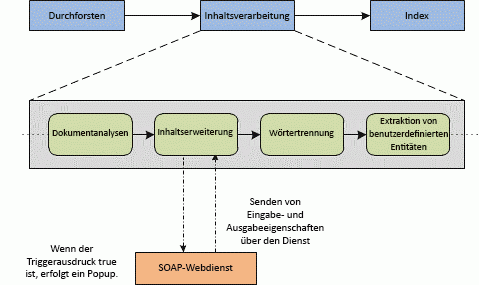

# <a name="custom-content-processing-with-the-content-enrichment-web-service-callout"></a><span data-ttu-id="ffcbd-102">Benutzerdefinierte Inhaltsverarbeitung mit der Content Enrichment-Webdienstlegende</span><span class="sxs-lookup"><span data-stu-id="ffcbd-102">Custom content processing with the Content Enrichment web service callout</span></span>
<span data-ttu-id="ffcbd-p101">Informationen Sie zu den Content inhaltsanreicherung in SharePoint, die Entwickler zum Erstellen eines externen Webdiensts um verwaltete Eigenschaften für durchforsteten Elemente während der inhaltsverarbeitung ändern können. Suche in SharePoint ermöglicht Benutzern, die verwalteten Eigenschaften der durchforsteten Elemente zu ändern, bevor sie durch Aufrufen von an einen Webdienst externe inhaltserweiterung indiziert sind. Die Möglichkeit zum Ändern von verwalteter Eigenschaften für Elemente während der inhaltsverarbeitung ist hilfreich, beim Ausführen von Aufgaben wie DatenBereinigung, entitätsextraktion, Klassifizierung und Kategorien.</span><span class="sxs-lookup"><span data-stu-id="ffcbd-p101">Learn about the content enrichment web service callout in SharePoint that enables developers to create an external web service to modify managed properties for crawled items during content processing. Search in SharePoint enables users to modify the managed properties of crawled items before they are indexed by calling out to an external content enrichment web service. The ability to modify managed properties for items during content processing is helpful when performing tasks such as data cleansing, entity extraction, classification, and tagging.</span></span>
  
    
    


<span data-ttu-id="ffcbd-106">**Abbildung 1. Inhaltserweiterung innerhalb der inhaltsverarbeitung**</span><span class="sxs-lookup"><span data-stu-id="ffcbd-106">**Figure 1. Content enrichment within content processing**</span></span>

  
    
    

  
    
    

  
    
    
<span data-ttu-id="ffcbd-p102">Abbildung 1 zeigt einen Teil des Prozesses, der in der inhaltsverarbeitungskomponente stattfindet. Der inhaltserweiterung-Webdienst ist eine SOAP-basierten Dienst, den Sie erstellen können, um eine Legende aus dem Web-Service-Client innerhalb der inhaltsverarbeitungskomponente empfangen. Basierend auf Abbildung 1, verweist der WebClient-Dienst auf den Operator Anreicherung Inhalte innerhalb der inhaltsverarbeitungskomponente; derWebdienst bezieht sich auf die SOAP-Webdienst, den Sie implementieren.Der Webdienst erhält eine konfigurierbare Nutzlast von der inhaltsverarbeitungskomponente. Klicken Sie dann, wird die resultierende Antwort vom Webdienst mit durchforsteten Elements zusammengeführt, bevor es dem Suchindex hinzugefügt wird.Der Dienst WebClient arbeitet mit verwalteten Eigenschaften, die Sie als Eingabeeigenschaften oder als Ausgabeeigenschaften konfigurieren können. Eingabeeigenschaften werden an den Webdienst gesendet. Ausgabeeigenschaften werden durch den Webdienst zurückgegeben. Bestimmte verwalteten Eigenschaften werden ausgeblendet oder sind schreibgeschützt und können nicht an den Webdienst gesendet oder empfangen aus dem Webdienst werden. Informationen zum überprüfen die verwalteten Eigenschaften schreibgeschützt sind finden Sie unter  [Gewusst wie: Auflisten aller schreibgeschützte verwaltete Eigenschaften für den Webdienst Inhaltserweiterung](#SP15contentprocess_read-only_managed_properties) .</span><span class="sxs-lookup"><span data-stu-id="ffcbd-p102">Figure 1 shows a part of the process that takes place in the content processing component. The content enrichment web service is a SOAP-based service that you can create to receive a callout from the web service client inside the content processing component. Based on Figure 1, the web service client refers to the Content Enrichment operator inside the content processing component; theweb service refers to the SOAP web service that you implement.The web service receives a configurable payload from the content processing component. Then, the resulting response from the web service is merged into the crawled item before it is added to the search index. The web service client works with managed properties that you can configure as input properties or as output properties. Input properties are sent to the web service; output properties are returned by the web service. Certain managed properties are hidden or are read-only and can't be sent to the web service or received from the web service. See  [How to list all read-only managed properties for the Content Enrichment web service](#SP15contentprocess_read-only_managed_properties) for information about how to verify which managed properties are read-only.</span></span>
    
> <span data-ttu-id="ffcbd-116">**Wichtig:** Der Schritt der Inhaltserweiterungslegende kann nur mit einem einzigen Webdienstendpunkt konfiguriert werden.</span><span class="sxs-lookup"><span data-stu-id="ffcbd-116">**Important:** The content enrichment callout step can only be configured with a single web service endpoint.</span></span> <span data-ttu-id="ffcbd-117">Jegliche Art von Fehlertoleranz oder Routingfunktionen zur Unterstützung mehrerer Implementierungen müssen vom Entwickler bei der Implementierung des Webdiensts behandelt werden.</span><span class="sxs-lookup"><span data-stu-id="ffcbd-117">Any kind of fault tolerance, or routing capabilities to support multiple implementations must be handled by the developer implementing the web service.</span></span> <span data-ttu-id="ffcbd-118">Darüber hinaus kann der Entwickler über verschiedene Webdienstimplementierungen verfügen, die auf unterschiedlichen Endpunkten gehostet werden. Es kann jedoch immer nur einer dieser Endpunkte in der Konfiguration verwendet werden.</span><span class="sxs-lookup"><span data-stu-id="ffcbd-118">Important The content enrichment callout step can only be configured with a single web service endpoint. Any kind of fault tolerance, or routing capabilities to support multiple implementations must be handled by the developer implementing the web service. In addition, the developer may have various web service implementations hosted at different endpoints; however, at any given time, only one of these endpoints can be used in the configuration.</span></span> 
  
    
    


## <a name="content-enrichment-web-service-contract"></a><span data-ttu-id="ffcbd-119">Vertrag für den Inhaltserweiterungs-Webdienst</span><span class="sxs-lookup"><span data-stu-id="ffcbd-119">Content enrichment web service contract</span></span>
<span data-ttu-id="ffcbd-120"><a name="SP15webservcallout_enrich"> </a></span><span class="sxs-lookup"><span data-stu-id="ffcbd-120"></span></span>

<span data-ttu-id="ffcbd-p104">Web-Service-Client ist ein SOAP (Version 1.1) RPC-Client mit einer vordefinierten Verhalten. Servicevertrag Web weist folgende Merkmale auf:</span><span class="sxs-lookup"><span data-stu-id="ffcbd-p104">The web service client is a SOAP (version 1.1) RPC client with a predefined behavior. The web service contract has the following characteristics:</span></span>
  
    
    

- <span data-ttu-id="ffcbd-123">Die inhaltsverarbeitungskomponente sendet einen SOAP-RPC-Aufruf an einen konfigurierbaren Endpunkt über HTTP.</span><span class="sxs-lookup"><span data-stu-id="ffcbd-123">The content processing component sends a SOAP RPC call to a configurable endpoint over HTTP.</span></span>
    
  
- <span data-ttu-id="ffcbd-124">Nutzlast enthält ein Array von Property-Objekten.</span><span class="sxs-lookup"><span data-stu-id="ffcbd-124">The payload contains an array of property objects.</span></span>
    
  
- <span data-ttu-id="ffcbd-125">Der Webdienst führt eine benutzerdefinierte Logik für das Array von Property-Objekte und gibt ein Array von geänderten oder neuen Property-Objekten.</span><span class="sxs-lookup"><span data-stu-id="ffcbd-125">The web service performs some custom logic on the array of property objects, and returns an array of modified or new property objects.</span></span>
    
  
- <span data-ttu-id="ffcbd-126">Der Webdienst muss eine Antwort an den Dienst WebClient einer angegebenen Timeout senden.</span><span class="sxs-lookup"><span data-stu-id="ffcbd-126">The web service must send a response to the web service client within a given timeout.</span></span>
    
  
- <span data-ttu-id="ffcbd-p105">Keine bestimmten Authentifizierung oder Verschlüsselung Mechanismen werden im Rahmen des Vertrags unterstützt. Sie können jedoch eigene Sicherheit des Transport-Mechanismus anwenden.</span><span class="sxs-lookup"><span data-stu-id="ffcbd-p105">No specific authentication or encryption mechanisms are supported as part of the contract. You can, however, apply your own security on the transport mechanism.</span></span>
    
  

## <a name="configuring-the-content-enrichment-web-service-client"></a><span data-ttu-id="ffcbd-129">Konfigurieren des Inhaltserweiterung Web Service-Clients</span><span class="sxs-lookup"><span data-stu-id="ffcbd-129">Configuring the Content Enrichment web service client</span></span>
<span data-ttu-id="ffcbd-130"><a name="content_enrichment_configuration"> </a></span><span class="sxs-lookup"><span data-stu-id="ffcbd-130"></span></span>

<span data-ttu-id="ffcbd-131">Um die Webdienstclients zu konfigurieren, verwenden Sie die folgenden Windows PowerShell-Cmdlets:</span><span class="sxs-lookup"><span data-stu-id="ffcbd-131">To configure the web service client, you use the following Windows PowerShell cmdlets:</span></span>
  
    
    

-  <span data-ttu-id="ffcbd-132">
  [Get-SPEnterpriseSearchContentEnrichmentConfiguration](http://technet.microsoft.com/en-us/library/jj219783%28office.15%29.aspx)</span><span class="sxs-lookup"><span data-stu-id="ffcbd-132">[Get-SPEnterpriseSearchContentEnrichmentConfiguration](http://technet.microsoft.com/en-us/library/jj219783%28office.15%29.aspx)</span></span>
    
  
-  <span data-ttu-id="ffcbd-133">
  [Set-SPEnterpriseSearchContentEnrichmentConfiguration](http://technet.microsoft.com/en-us/library/jj219659%28office.15%29.aspx)</span><span class="sxs-lookup"><span data-stu-id="ffcbd-133">[Set-SPEnterpriseSearchContentEnrichmentConfiguration](http://technet.microsoft.com/en-us/library/jj219659%28office.15%29.aspx)</span></span>
    
  
-  <span data-ttu-id="ffcbd-134">
  [Remove-SPEnterpriseSearchContentEnrichmentConfiguration](http://technet.microsoft.com/en-us/library/jj219742%28office.15%29.aspx)</span><span class="sxs-lookup"><span data-stu-id="ffcbd-134">[Remove-SPEnterpriseSearchContentEnrichmentConfiguration](http://technet.microsoft.com/en-us/library/jj219742%28office.15%29.aspx)</span></span>
    
  
-  <span data-ttu-id="ffcbd-135">
  [New-SPEnterpriseSearchContentEnrichmentConfiguration](http://technet.microsoft.com/en-us/library/jj219502%28office.15%29.aspx)</span><span class="sxs-lookup"><span data-stu-id="ffcbd-135">[New-SPEnterpriseSearchContentEnrichmentConfiguration](http://technet.microsoft.com/en-us/library/jj219502%28office.15%29.aspx)</span></span>
    
  
<span data-ttu-id="ffcbd-136">Tabelle 1 enthält die Eigenschaften, die Sie über die weiter oben erwähnten Windows PowerShell-Cmdlets konfigurieren können.</span><span class="sxs-lookup"><span data-stu-id="ffcbd-136">Table 1 lists the properties you can configure through the Windows PowerShell cmdlets mentioned previously.</span></span>
  
    
    

<span data-ttu-id="ffcbd-137">**In Tabelle 1. Eigenschaften, die für den Client konfiguriert werden mithilfe von Windows PowerShell-cmdlets**</span><span class="sxs-lookup"><span data-stu-id="ffcbd-137">**Table 1. Properties that are configurable for the client by using Windows PowerShell cmdlets**</span></span>


|<span data-ttu-id="ffcbd-138">**Configuration-Eigenschaft**</span><span class="sxs-lookup"><span data-stu-id="ffcbd-138">**Configuration property**</span></span>|<span data-ttu-id="ffcbd-139">**Beschreibung**</span><span class="sxs-lookup"><span data-stu-id="ffcbd-139">**Description**</span></span>|<span data-ttu-id="ffcbd-140">**Standardwert**</span><span class="sxs-lookup"><span data-stu-id="ffcbd-140">**Default value**</span></span>|
|:-----|:-----|:-----|
|<span data-ttu-id="ffcbd-141">**Endpunkt**</span><span class="sxs-lookup"><span data-stu-id="ffcbd-141">**Endpoint**</span></span> <br/> |<span data-ttu-id="ffcbd-142">Gibt die URL des externen Webdiensts.</span><span class="sxs-lookup"><span data-stu-id="ffcbd-142">Specifies the URL of the external web service.</span></span>  <br/> |<span data-ttu-id="ffcbd-143">Leer</span><span class="sxs-lookup"><span data-stu-id="ffcbd-143">Empty.</span></span>  <br/> |
|<span data-ttu-id="ffcbd-144">**InputProperties**</span><span class="sxs-lookup"><span data-stu-id="ffcbd-144">**InputProperties**</span></span> <br/> |<span data-ttu-id="ffcbd-145">Die verwalteten Eigenschaften, die der externen Webdienst empfängt.</span><span class="sxs-lookup"><span data-stu-id="ffcbd-145">The managed properties that the external web service receives.</span></span>  <br/> |<span data-ttu-id="ffcbd-146">Leer</span><span class="sxs-lookup"><span data-stu-id="ffcbd-146">Empty.</span></span>  <br/> |
|<span data-ttu-id="ffcbd-147">**OutputProperties**</span><span class="sxs-lookup"><span data-stu-id="ffcbd-147">**OutputProperties**</span></span> <br/> |<span data-ttu-id="ffcbd-148">Die verwalteten Eigenschaften, die vom externen Webdienst zurückgegeben.</span><span class="sxs-lookup"><span data-stu-id="ffcbd-148">The managed properties that the external web service returns.</span></span>  <br/> |<span data-ttu-id="ffcbd-149">Leer</span><span class="sxs-lookup"><span data-stu-id="ffcbd-149">Empty.</span></span>  <br/> |
|<span data-ttu-id="ffcbd-150">**Timeout**</span><span class="sxs-lookup"><span data-stu-id="ffcbd-150">**Timeout**</span></span> <br/> |<span data-ttu-id="ffcbd-151">Die Zeitdauer, bis die Web Servicezeiten in Millisekunden.</span><span class="sxs-lookup"><span data-stu-id="ffcbd-151">The amount of time until the web service times out in milliseconds.</span></span>  <br/> <span data-ttu-id="ffcbd-152">Je nach **FailureMode** das Element kann nicht verarbeitet werden, oder eine Warnung ausgegeben wird in den ULS-Protokolldateien geschrieben.</span><span class="sxs-lookup"><span data-stu-id="ffcbd-152">Depending on **FailureMode**, the item fails to be processed or a warning is written to the ULS log.</span></span> <br/> |<span data-ttu-id="ffcbd-153">5000 Millisekunden; Gültige Bereich [100, 30000].</span><span class="sxs-lookup"><span data-stu-id="ffcbd-153">5000 milliseconds; Valid range [100, 30000].</span></span>  <br/> |
|<span data-ttu-id="ffcbd-154">**SendRawData**</span><span class="sxs-lookup"><span data-stu-id="ffcbd-154">**SendRawData**</span></span> <br/> |<span data-ttu-id="ffcbd-155">Aktiviert oder deaktiviert unformatierte Daten an den Webdienst senden.</span><span class="sxs-lookup"><span data-stu-id="ffcbd-155">Enables or disables sending raw data to the web service.</span></span>  <br/> |<span data-ttu-id="ffcbd-156">Falsch.</span><span class="sxs-lookup"><span data-stu-id="ffcbd-156">False.</span></span>  <br/> |
|<span data-ttu-id="ffcbd-157">**MaxRawDataSize**</span><span class="sxs-lookup"><span data-stu-id="ffcbd-157">**MaxRawDataSize**</span></span> <br/> |<span data-ttu-id="ffcbd-p106">Die maximale Größe des unformatierte Daten an den Webdienst in Kilobyte (KB) gesendet. Wenn die binären Daten eines Elements diesen Grenzwert überschreitet, wird das Element nicht gesendet. Dies verhindert nicht die **InputProperties** gesendet werden, und die **OutputProperties** empfangen wird. </span><span class="sxs-lookup"><span data-stu-id="ffcbd-p106">The maximum size of raw data sent to the web service in kilobytes (KB). If the binary data of an item exceeds this limit, the item is not sent. This does not prevent the **InputProperties** from being sent, and the **OutputProperties** from being received. </span></span><br/> |<span data-ttu-id="ffcbd-161">5120 KB.</span><span class="sxs-lookup"><span data-stu-id="ffcbd-161">5120 kilobytes.</span></span>  <br/> |
|<span data-ttu-id="ffcbd-162">**FailureMode**</span><span class="sxs-lookup"><span data-stu-id="ffcbd-162">**FailureMode**</span></span> <br/> |<span data-ttu-id="ffcbd-p107">Steuert das Verhalten des Web Service-Clients treten Fehler auf. Wenn **FailureMode** auf **ERROR**festgelegt ist, Senden von Problemen, die während der Verarbeitung inhaltserweiterung auftreten einen fehlerhaften Rückruf für den betreffenden Artikel. </span><span class="sxs-lookup"><span data-stu-id="ffcbd-p107">Controls the behavior of the web service client when errors occur. When **FailureMode** is set to **ERROR**, any problems that occur during content enrichment processing send a failed callback for that particular item.  </span></span><br/> <span data-ttu-id="ffcbd-165">Wenn **FailureMode** auf **WARNING**festgelegt ist, das Element wird ohne Modifikationen vom Webdienst indiziert und eine Warnung ausgegeben wird in den ULS-Protokolldateien geschrieben.</span><span class="sxs-lookup"><span data-stu-id="ffcbd-165">When **FailureMode** is set to **WARNING**, the item is indexed, without any modifications by the web service and a warning is written to the ULS log.</span></span>  <br/> |<span data-ttu-id="ffcbd-166">Fehler</span><span class="sxs-lookup"><span data-stu-id="ffcbd-166">Error.</span></span>  <br/> |
|<span data-ttu-id="ffcbd-167">**DebugMode**</span><span class="sxs-lookup"><span data-stu-id="ffcbd-167">**DebugMode**</span></span> <br/> |<span data-ttu-id="ffcbd-p108">Ein Modus, die bei Festlegung auf **true** ermöglicht den Client die inhaltserweiterung alle verwaltete Eigenschaften an den Client gesendet, ohne alle Eigenschaften in den Rückgabetypen erwartet. Alle konfigurierten **Trigger** -Eigenschaft, die **InputProperties** -Eigenschaft und die **OutputProperties** -Eigenschaft werden ignoriert. </span><span class="sxs-lookup"><span data-stu-id="ffcbd-p108">A mode that when set to **true** enables the content enrichment client to send all managed properties to the client without expecting any properties in return. Any configured **Trigger** property, **InputProperties** property, and **OutputProperties** property are ignored. </span></span><br/> |<span data-ttu-id="ffcbd-170">Falsch.</span><span class="sxs-lookup"><span data-stu-id="ffcbd-170">False.</span></span>  <br/> |
|<span data-ttu-id="ffcbd-171">**Trigger**</span><span class="sxs-lookup"><span data-stu-id="ffcbd-171">**Trigger**</span></span> <br/> |<span data-ttu-id="ffcbd-p109">Ein **Boolean** -Prädikat, das für alle durchforsteten Elemente ausgeführt wird. Wenn das Prädikat **true** ergibt, wird der Datensatz an den Webdienst gesendet. Andernfalls wird das Element über dem Suchindex übergeben. </span><span class="sxs-lookup"><span data-stu-id="ffcbd-p109">A **Boolean** predicate that is executed on every crawled item. If the predicate evaluates to **true**, the record is sent to the web service. Otherwise, the item is passed through to the search index. </span></span><br/> |<span data-ttu-id="ffcbd-175">Leer</span><span class="sxs-lookup"><span data-stu-id="ffcbd-175">Empty.</span></span>  <br/> |
   

### <a name="how-to-list-all-read-only-managed-properties-for-the-content-enrichment-web-service"></a><span data-ttu-id="ffcbd-176">Gewusst wie: Auflisten aller schreibgeschützte verwaltete Eigenschaften für den Webdienst Inhaltserweiterung</span><span class="sxs-lookup"><span data-stu-id="ffcbd-176">How to list all read-only managed properties for the Content Enrichment web service</span></span>
<span data-ttu-id="ffcbd-177"><a name="SP15contentprocess_read-only_managed_properties"> </a></span><span class="sxs-lookup"><span data-stu-id="ffcbd-177"></span></span>

<span data-ttu-id="ffcbd-p110">Bestimmte verwalteten Eigenschaften sind schreibgeschützt und können nicht aus dem Webdienst ausgegeben werden. Diese Eigenschaften können aufgelistet werden, mithilfe von  [Get-SPEnterpriseSearchServiceApplication](http://technet.microsoft.com/en-us/library/ff608050%28office.15%29.aspx) und [Get-SPEnterpriseSearchMetadataManagedProperty](http://technet.microsoft.com/en-us/library/ff607560%28office.15%29.aspx)Windows PowerShell-Cmdlets, im folgenden Beispiel dargestellt:</span><span class="sxs-lookup"><span data-stu-id="ffcbd-p110">Certain managed properties are read-only and cannot be output from the web service. These properties can be listed by using the  [Get-SPEnterpriseSearchServiceApplication](http://technet.microsoft.com/en-us/library/ff608050%28office.15%29.aspx) and [Get-SPEnterpriseSearchMetadataManagedProperty](http://technet.microsoft.com/en-us/library/ff607560%28office.15%29.aspx)Windows PowerShell cmdlets, shown in the following example:</span></span>
  
    
    

```

$ssa = Get-SPEnterpriseSearchServiceApplication
Get-SPEnterpriseSearchMetadataManagedProperty -SearchApplication $ssa  | ?{$_.IsReadOnly -or $_.MappingDisallowed -or $_.DeleteDisallowed}

```


## <a name="about-trigger-conditions-for-configuring-the-web-service-callout"></a><span data-ttu-id="ffcbd-180">Informationen zu Trigger Bedingungen für die Konfiguration des Webdienst-callout</span><span class="sxs-lookup"><span data-stu-id="ffcbd-180">About trigger conditions for configuring the web service callout</span></span>
<span data-ttu-id="ffcbd-181"><a name="SP15contentprocess_trigger"> </a></span><span class="sxs-lookup"><span data-stu-id="ffcbd-181"></span></span>

<span data-ttu-id="ffcbd-p111">Eine Trigger-Bedingung ist ein Ausdruck, mit denen das Webdienst-Callout konfiguriert ist. Ergibt eine Bedingung für den Auslöser **true**, führt der Web Service-Client eine Legende für diesen Datensatz. Ergibt eine Bedingung für den Auslöser **false**, der Web-Service-Client führt keine Legende und übergibt das durchforstete Element an den Suchindex. Sie können auch, wenn die Bedingung keine Trigger konfiguriert ist. alle Elemente werden an den Webdienst gesendet.</span><span class="sxs-lookup"><span data-stu-id="ffcbd-p111">A trigger condition is an expression that is used to configure the web service callout. If a trigger condition evaluates to **true**, the web service client performs a callout for that record. If a trigger condition evaluates to **false**, the web service client does not perform a callout and passes the crawled item to the search index. Alternatively, if no trigger condition is configured; all items are sent to the web service.</span></span>
  
    
    
<span data-ttu-id="ffcbd-p112">Trigger verwendet eine Ausdruckssprache verweisen auf die Werte der verwalteten Eigenschaften. Sie können Operatoren und Funktionen in der Ausdruckssprache verwenden, einfache oder komplexe Trigger Conditions erstellen, damit Sie ermitteln können, wenn ein Webdienst-Callout ausführen.</span><span class="sxs-lookup"><span data-stu-id="ffcbd-p112">Trigger conditions use an expression language to refer to the values of managed properties. You can use the operators and functions in the expression language to build simple or complex trigger conditions so you can determine when to perform a web service callout.</span></span> 
  
    
    
<span data-ttu-id="ffcbd-188">Tabelle 2 enthält Beispiele für Trigger Bedingungen.</span><span class="sxs-lookup"><span data-stu-id="ffcbd-188">Table 2 lists examples of trigger conditions.</span></span>
  
    
    

<span data-ttu-id="ffcbd-189">**In Tabelle 2. Trigger-Bedingung-Beispiele für die Konfiguration von inhaltsanreicherung**</span><span class="sxs-lookup"><span data-stu-id="ffcbd-189">**Table 2. Trigger condition examples for configuring the Content Enrichment web service callout**</span></span>


|<span data-ttu-id="ffcbd-190">**Ausdruck**</span><span class="sxs-lookup"><span data-stu-id="ffcbd-190">**Expression**</span></span>|<span data-ttu-id="ffcbd-191">**Beschreibung**</span><span class="sxs-lookup"><span data-stu-id="ffcbd-191">**Description**</span></span>|<span data-ttu-id="ffcbd-192">**Anforderungen**</span><span class="sxs-lookup"><span data-stu-id="ffcbd-192">**Requirements**</span></span>|
|:-----|:-----|:-----|
|<span data-ttu-id="ffcbd-193">MP1 > 2</span><span class="sxs-lookup"><span data-stu-id="ffcbd-193">MP1 > 2</span></span>  <br/> |<span data-ttu-id="ffcbd-194">Gibt **true** zurück, wenn der Wert der verwalteten Eigenschaft namens MP1 größer als 2 ist.</span><span class="sxs-lookup"><span data-stu-id="ffcbd-194">Returns **true** if the value of the managed property named MP1 is greater than 2.</span></span> <br/> |<span data-ttu-id="ffcbd-195">MP1 muss es sich um einen numerischen Typ verfügen.</span><span class="sxs-lookup"><span data-stu-id="ffcbd-195">MP1 must have a numeric type.</span></span>  <br/> |
|<span data-ttu-id="ffcbd-196">IsNull(MP2)</span><span class="sxs-lookup"><span data-stu-id="ffcbd-196">IsNull(MP2)</span></span>  <br/> |<span data-ttu-id="ffcbd-197">Gibt die **true** zurück, wenn die verwaltete Eigenschaft namens MP2 nicht für die durchforsteten Element vorhanden ist, oder leere/Null ist.</span><span class="sxs-lookup"><span data-stu-id="ffcbd-197">Returns **true** if the managed property named MP2 is not present for the crawled item or is empty/null.</span></span> <br/> |<span data-ttu-id="ffcbd-198">MP2 kann eines beliebigen Typs sein.</span><span class="sxs-lookup"><span data-stu-id="ffcbd-198">MP2 can be of any type.</span></span>  <br/> |
|<span data-ttu-id="ffcbd-199">StartsWith(MP1, "sample") und MP2! = 18</span><span class="sxs-lookup"><span data-stu-id="ffcbd-199">StartsWith(MP1, "sample") AND MP2 != 18</span></span>  <br/> |<span data-ttu-id="ffcbd-200">Gibt **true** zurück, wenn der Wert in der verwalteten Eigenschaft MP1 mit "Sample beginnt" und des Werts der verwalteten Eigenschaft MP2 nicht 18.</span><span class="sxs-lookup"><span data-stu-id="ffcbd-200">Returns **true** if the value in the managed property MP1 starts with "sample" and the value of managed property MP2 is not 18.</span></span> <br/> |<span data-ttu-id="ffcbd-201">MP1 muss vom Typ **string** und MP2 muss einen numerischen Typ.</span><span class="sxs-lookup"><span data-stu-id="ffcbd-201">MP1 must be of type **string** and MP2 must be a numeric type.</span></span> <br/> |
|<span data-ttu-id="ffcbd-202">IsDay (MP1, 2009, 12, 24)</span><span class="sxs-lookup"><span data-stu-id="ffcbd-202">IsDay(MP1, 2009, 12, 24)</span></span>  <br/> |<span data-ttu-id="ffcbd-203">Überprüft, ob die verwaltete Eigenschaft MP1 eine **DateTime** enthält, die auf 24 Dezember 2009 fällt.</span><span class="sxs-lookup"><span data-stu-id="ffcbd-203">Checks whether the managed property MP1 contains a **DateTime** that falls on December 24, 2009.</span></span> <br/> |<span data-ttu-id="ffcbd-204">MP1 muss vom Typ **DateTime**sein.</span><span class="sxs-lookup"><span data-stu-id="ffcbd-204">MP1 must be of type **DateTime**.</span></span>  <br/> |
   
<span data-ttu-id="ffcbd-205">Finden Sie unter  [Syntax für Trigger Ausdrücken in SharePoint](trigger-expressions-syntax-in-sharepoint.md) für Elemente, die in einem Ausdruck Trigger und eine Liste der unterstützten Funktionen verwendet werden können.</span><span class="sxs-lookup"><span data-stu-id="ffcbd-205">See  [Trigger expressions syntax in SharePoint](trigger-expressions-syntax-in-sharepoint.md) for the elements that can be used in a trigger expression and a list of supported functions.</span></span>
  
    
    

## <a name="implementing-the-content-enrichment-external-web-service"></a><span data-ttu-id="ffcbd-206">Implementieren den externen Webdienst Inhaltserweiterung</span><span class="sxs-lookup"><span data-stu-id="ffcbd-206">Implementing the Content Enrichment external web service</span></span>
<span data-ttu-id="ffcbd-207"><a name="SP15contentprocess_implement"> </a></span><span class="sxs-lookup"><span data-stu-id="ffcbd-207"></span></span>

<span data-ttu-id="ffcbd-208">Führen Sie für eine einfache Implementierung folgende Schritte aus:</span><span class="sxs-lookup"><span data-stu-id="ffcbd-208">For a basic implementation, do the following:</span></span> 
  
    
    

1. <span data-ttu-id="ffcbd-209">Enthalten Sie die **Microsoft.Office.Server.Search.ContentProcessingEnrichment.dll** befindet sich im `C:\\Program Files\\Microsoft Office Servers\\15.0\\Search\\Applications\\External` in Ihrem Projekt als Referenz.</span><span class="sxs-lookup"><span data-stu-id="ffcbd-209">Include the **Microsoft.Office.Server.Search.ContentProcessingEnrichment.dll** located in `C:\\Program Files\\Microsoft Office Servers\\15.0\\Search\\Applications\\External` in your project as a reference.</span></span>
    
  
2. <span data-ttu-id="ffcbd-210">Implementieren Sie **IContentProcessingEnrichmentService** als Webdienst.</span><span class="sxs-lookup"><span data-stu-id="ffcbd-210">Implement **IContentProcessingEnrichmentService** as a web service.</span></span>
    
  

## <a name="additional-resources"></a><span data-ttu-id="ffcbd-211">Zusätzliche Ressourcen</span><span class="sxs-lookup"><span data-stu-id="ffcbd-211">Additional resources</span></span>
<span data-ttu-id="ffcbd-212"><a name="bk_addresources"> </a></span><span class="sxs-lookup"><span data-stu-id="ffcbd-212"></span></span>


-  [<span data-ttu-id="ffcbd-213">Konfigurieren der Suche in SharePoint</span><span class="sxs-lookup"><span data-stu-id="ffcbd-213">Configure search in SharePoint</span></span>](configure-search-in-sharepoint.md)
    
  
-  [<span data-ttu-id="ffcbd-214">Benutzerdefinierte Inhaltsverarbeitung mit dem Webdienstpopup zur Inhaltsanreicherung</span><span class="sxs-lookup"><span data-stu-id="ffcbd-214">Custom content processing with the Content Enrichment web service callout</span></span>](custom-content-processing-with-the-content-enrichment-web-service-callout.md)
    
  

