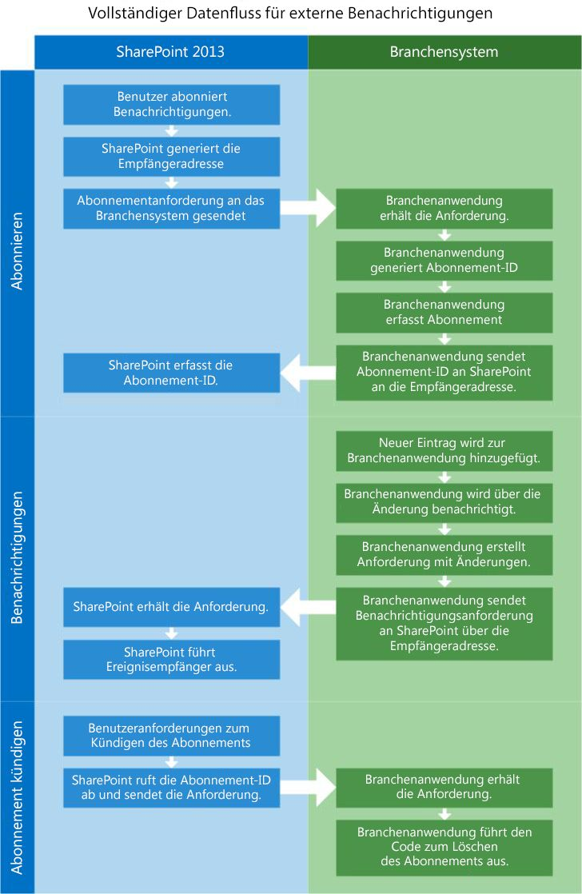
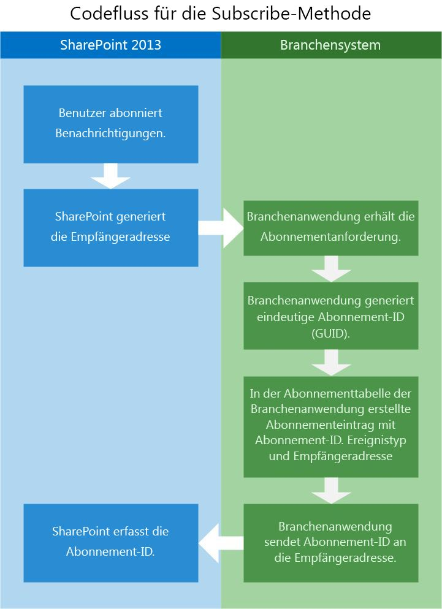
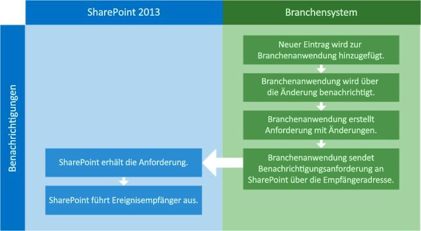
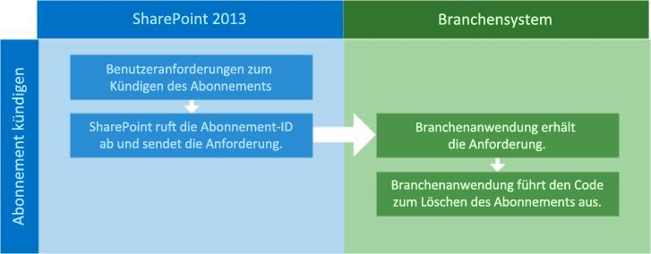

# <a name="external-events-and-alerts-in-sharepoint"></a><span data-ttu-id="a382b-102">Externe Ereignisse und Warnungen in SharePoint</span><span class="sxs-lookup"><span data-stu-id="a382b-102">External events and alerts in SharePoint</span></span>
<span data-ttu-id="a382b-103">Hier erfahren Sie, die Konzepte hinter der Erstellung von remote-Ereignisempfänger in SharePoint, die an externen Listen angefügt werden kann, und führen Sie bei der Aktualisierung der externen Daten, die die Liste darstellt.</span><span class="sxs-lookup"><span data-stu-id="a382b-103">Learn the concepts behind creating remote event receivers in SharePoint that can be attached to external lists and execute when the external data that the list represents is updated.</span></span>
## <a name="what-are-event-receivers"></a><span data-ttu-id="a382b-104">Was sind Ereignisempfänger?</span><span class="sxs-lookup"><span data-stu-id="a382b-104">What are event receivers?</span></span>
<span data-ttu-id="a382b-105"><a name="Externalevents_overview"> </a></span><span class="sxs-lookup"><span data-stu-id="a382b-105"></span></span>

<span data-ttu-id="a382b-p101">Ein Ereignisempfänger ist ein Teil von verwaltetem Code, der auf SharePoint Auslösen von Ereignissen wie hinzufügen, verschieben, löschen, Einchecken und Auschecken reagiert. Beim Auftreten dieser Ereignisse und den Ereignisempfänger Kriterien erfüllt sind, wird der Code, den Sie schreiben, um zusätzliche Funktionen bereitzustellen ausgeführt. Wenn SharePoint-Objekten wie Listen, Workflows und Features, um auf diese Ereignisse zu warten konfiguriert sind, werden sie Ereignishostsbezeichnet.</span><span class="sxs-lookup"><span data-stu-id="a382b-p101">An event receiver is a piece of managed code that responds to SharePoint triggering events such as adding, moving, deleting, checking in, and checking out. When these events occur, and the event receiver's criteria are met, the code that you write to provide additional functionality is executed. When SharePoint objects, such as lists, workflows and features, are configured to wait on these events to occur, they are called event hosts.</span></span> 
  
    
    
<span data-ttu-id="a382b-p102">Ereignisempfänger können Sie die Geschäftslogik auszuführen, wenn ein bestimmtes Ereignis eintritt. Dies sind im Wesentlichen die Haken, in dem Sie Code zum Behandeln von bestimmten Bedingungen, Benachrichtigungen erstellen, Aktualisieren von anderen Systemen und usw. erstellen können. Wenn Sie Ereignisempfänger erstellen, wird eine DLL generiert. Sie können diese DLL in den globalen Assemblycache platzieren, damit der Ereignisempfänger als Reaktion auf Änderungen in einem externen System aufgerufen werden.</span><span class="sxs-lookup"><span data-stu-id="a382b-p102">Event receivers let you perform business logic when a specific event occurs. Essentially, these are the hooks where you can create code to handle certain conditions, make notifications, update other systems, and so on. When you create event receivers, a DLL is generated. You can place that DLL into the global assembly cache, so that the event receivers are invoked in response to any changes in an external system.</span></span>
  
    
    
<span data-ttu-id="a382b-112">Das folgende Beispiel enthält einen einfachen externen-Ereignisempfänger in C#-, der ausgeführt wird, wenn der Liste ein neues Element hinzugefügt wird.</span><span class="sxs-lookup"><span data-stu-id="a382b-112">The following example contains a simple external event receiver in C# that executes when a new item is added to the list.</span></span>
  
    
    


```cs

public class EntryContentEventReceiver : SPItemEventReceiver
{
   public override void ItemAdded(SPItemEventProperties properties)
   {
      base.ItemAdded(properties);

      // properties.ExternalNotificationMessage holds the message sent by the external 
      // system.
   }
```

<span data-ttu-id="a382b-113">Externe Ereignisempfänger können auch erweitert werden, um anhand eines Ereignisempfängers Entität und als remote-Ereignisempfänger als einen Dienst am Standort oder in Microsoft Azure bereitgestellt wurden, funktionieren.</span><span class="sxs-lookup"><span data-stu-id="a382b-113">External event receivers can also be extended to work against an entity event receiver and as remote event receivers deployed as a service on-premise or in Microsoft Azure.</span></span> 
  
    
    

## <a name="what-are-remote-event-receivers"></a><span data-ttu-id="a382b-114">Was sind remote-Ereignisempfänger?</span><span class="sxs-lookup"><span data-stu-id="a382b-114">What are remote event receivers?</span></span>
<span data-ttu-id="a382b-115"><a name="WhatIsARemoteEventReceiver"> </a></span><span class="sxs-lookup"><span data-stu-id="a382b-115"></span></span>

<span data-ttu-id="a382b-p103">Remote-Ereignisempfänger sind für SharePoint neu. In einer herkömmlichen SharePoint-Lösung verwenden Sie einen Ereignisempfänger zum Verarbeiten von Ereignissen, wie Benutzer erstellen oder Löschen von Listen oder Elemente in Listen. In einer SharePoint-Add-In verwenden Sie einen remote-Ereignisempfänger, ähnliche Ereignisse behandeln. Remote-Ereignisempfänger funktionieren ähnlich wie reguläre Ereignisempfänger, außer dass remote-Ereignisempfänger Ereignisse, die eintreten behandeln, wenn ein SharePoint-Add-In auf einem anderen System aus der Host-Web-Anwendung ist.</span><span class="sxs-lookup"><span data-stu-id="a382b-p103">Remote event receivers are new for SharePoint. In a traditional SharePoint solution, you use an event receiver to handle events such as users creating or deleting lists or items in lists. In an SharePoint Add-in, you use a remote event receiver to handle similar events. Remote event receivers work similarly to regular event receivers, except that remote event receivers handle events that occur when an SharePoint Add-in is on a different system from its host web application.</span></span>
  
    
    
<span data-ttu-id="a382b-120">Business Connectivity Services (BCS) verwendet remote-Ereignisempfänger, externe Listen und Entitäten zugeordnet ist, können Sie Code schreiben, der reagieren kann auf Änderungen an Daten im externen System gehostet werden.</span><span class="sxs-lookup"><span data-stu-id="a382b-120">Business Connectivity Services (BCS) uses remote event receivers attached to external lists and entities to allow you to write code that can react to changes in data hosted in the external system.</span></span>
  
    
    
<span data-ttu-id="a382b-121">Um dies zu unterstützen, wurden zwei Stereotype zum BDC-Modell hinzugefügt: **EventSubscriber** und **EventUnsubscriber**.</span><span class="sxs-lookup"><span data-stu-id="a382b-121">To accommodate this, two stereotypes have been added to the schema of the BDC model: **EventSubscriber** and **EventUnsubscriber**.</span></span>
  
    
    

> <span data-ttu-id="a382b-122">**Hinweis:** Ereignisempfänger werden in Sandkastenlösungen nicht unterstützt.</span><span class="sxs-lookup"><span data-stu-id="a382b-122">**Note** Event receivers are not supported in sandboxed solutions.</span></span> 
  
    
    


## <a name="what-features-and-capabilities-does-the-new-external-event-receiver-infrastructure-provide"></a><span data-ttu-id="a382b-123">Welche Features und Funktionen stellt die neue externe Ereignisempfängerinfrastruktur bereit?</span><span class="sxs-lookup"><span data-stu-id="a382b-123">What features and capabilities does the new external event receiver infrastructure provide?</span></span>
<span data-ttu-id="a382b-124"><a name="FeaturesAddedWithRER"> </a></span><span class="sxs-lookup"><span data-stu-id="a382b-124"></span></span>

<span data-ttu-id="a382b-125">BCS kann durch verwenden und die SharePoint Ereignisempfänger Features erweitern können Warnungen, externe Liste Ereignisempfänger und Entität Ereignisempfänger eine erweiterte Funktionalität hinzufügen.</span><span class="sxs-lookup"><span data-stu-id="a382b-125">By using and extending the SharePoint event receiver features, BCS is able to add alerts, external list event receivers, and entity receivers to provide extended functionality.</span></span>
  
    
    

- <span data-ttu-id="a382b-p104">**Warnungen:** Warnungen bereits ein integraler Bestandteil von SharePoint für mehrere Versionen bis SharePoint, würden sie nicht mit externen Listen funktionieren. Ein Benutzer kann jetzt Benachrichtigungen erstellen, für eine externe Liste, die dasselbe Verhalten wie Warnungen für eine standardmäßige SharePoint-Liste verfügen.</span><span class="sxs-lookup"><span data-stu-id="a382b-p104">**Alerts:** Alerts have been an integral part of SharePoint for several versions, but until SharePoint, they would not work with external lists. Now a user can create alerts on an external list that have the same behavior as alerts on a standard SharePoint list.</span></span>
    
  
- <span data-ttu-id="a382b-p105">**Ereignisempfänger für externe Liste:** Ereignisempfänger können jetzt an externen Listen, wie sie für standard-Listen können angefügt werden soll. Dadurch wird die ein Erweiterungsmechanismus, mit dem Sie Code schreiben, die zu bestimmten Zeiten ausgeführt wird.</span><span class="sxs-lookup"><span data-stu-id="a382b-p105">**External list event receivers:** Event receivers can now be attached to external lists just like they can for standard lists. This provides an extensibility mechanism that lets you write code that is executed at specific times.</span></span>
    
  
- <span data-ttu-id="a382b-p106">**Ereignisempfänger Entität:** Entity-Ereignisempfänger bieten die Flexibilität heraus robusteren Code schreiben, der andere Vorgänge wie die Bereitstellung von Benutzerkontext zum Filtern von Daten ermöglicht. Dadurch kann eine bessere Personalisierung und benutzerdefinierte Sicherheit.</span><span class="sxs-lookup"><span data-stu-id="a382b-p106">**Entity event receivers:** Entity event receivers provide flexibility by letting you write more robust code that allows other operations like providing user context for filtering data. This can allow better personalization and customized security.</span></span>
    
  
<span data-ttu-id="a382b-p107">Remote-Ereignisdienst in SharePoint ermöglicht verschiedene interessante Szenarien. Beispielsweise müssen Sie eine Anwendung "Sales führen Tracking" möglicherweise, die ein Verkaufsteam benachrichtigt werden, wenn neue Vertriebskontakte in eine Anwendung externen Lead eingegeben werden können. Bei der Eingabe eines neuen Vertriebsleads wird SharePoint durch das Benachrichtigungssystem benachrichtigt, die Teil der Lead-Anwendung ist. SharePoint empfängt die Benachrichtigung und erstellt dann neue Vorgänge für die angegebene Vertriebsmitarbeiter jeder neuen Lead Nachverfolgung. Konfigurieren Sie die Anwendung Vertriebsleads Eintrag für das externe System zum Senden einer Benachrichtigung in SharePoint auf die Erstellung der einzelnen neuen Lead, ist SharePoint vollständig auf dem neuesten Stand.</span><span class="sxs-lookup"><span data-stu-id="a382b-p107">Remote eventing in SharePoint makes several interesting scenarios possible. For example, you might have a "Sales Lead Tracking" application that lets a sales team be notified when new sales leads are entered into an external lead application. When a new sales lead is entered, SharePoint is notified through the notification system that is part of the lead application. SharePoint receives the notification and then creates new tasks for the specified salespeople to follow up on each new lead. By configuring the sales lead entry application on the external system to send a notification to SharePoint on the creation of each new lead, SharePoint is kept completely up to date.</span></span>
  
    
    

## <a name="prerequisites-for-using-event-receivers-for-external-lists"></a><span data-ttu-id="a382b-137">Voraussetzungen für die Verwendung von Ereignisempfängern für externe Listen</span><span class="sxs-lookup"><span data-stu-id="a382b-137">Prerequisites for using event receivers for external lists</span></span>
<span data-ttu-id="a382b-138"><a name="bkmk_Prerequisites"> </a></span><span class="sxs-lookup"><span data-stu-id="a382b-138"></span></span>

<span data-ttu-id="a382b-139">Um Ereignisempfänger für externe Listen verwenden, benötigen Sie Folgendes:</span><span class="sxs-lookup"><span data-stu-id="a382b-139">To use event receivers for external lists, you need the following:</span></span>
  
    
    

- <span data-ttu-id="a382b-140">SharePoint</span><span class="sxs-lookup"><span data-stu-id="a382b-140">SharePoint</span></span>
    
  
- <span data-ttu-id="a382b-141">Visual Studio 2012</span><span class="sxs-lookup"><span data-stu-id="a382b-141">Visual Studio 2012</span></span>
    
  
<span data-ttu-id="a382b-142">For more information about setting up a SharePoint development environment, see  [Einrichten einer allgemeinen Entwicklungsumgebung für SharePoint](set-up-a-general-development-environment-for-sharepoint.md).</span><span class="sxs-lookup"><span data-stu-id="a382b-142">For more information about setting up a SharePoint development environment, see  [Set up a general development environment for SharePoint](set-up-a-general-development-environment-for-sharepoint.md).</span></span>
  
    
    

## <a name="configure-the-external-system-to-notify-sharepoint-of-external-events"></a><span data-ttu-id="a382b-143">Konfigurieren Sie das externe System, um SharePoint externe Ereignisse benachrichtigen</span><span class="sxs-lookup"><span data-stu-id="a382b-143">Configure the external system to notify SharePoint of external events</span></span>
<span data-ttu-id="a382b-144"><a name="Externalevents_components"> </a></span><span class="sxs-lookup"><span data-stu-id="a382b-144"></span></span>

<span data-ttu-id="a382b-145">Für externe Ereignisse arbeiten müssen eine Reihe von Komponenten installiert und in der SharePoint-Host und dem externen System konfiguriert werden.</span><span class="sxs-lookup"><span data-stu-id="a382b-145">For external events to work, a number of components have to be installed and configured on both the SharePoint host and the external system.</span></span>
  
    
    
<span data-ttu-id="a382b-146">Sie müssen das externe System konfigurieren, sodass es das folgende Aufgaben ausführen kann:</span><span class="sxs-lookup"><span data-stu-id="a382b-146">You have to configure the external system so that it can do the following:</span></span>
  
    
    

- <span data-ttu-id="a382b-p108">**Bestimmen, wann die Basisdaten.** Für das externe System wissen, wann Änderungen vorgenommen wurden müssen Sie einen Mechanismus für das Abrufen bestimmter Änderungen erstellen. Hierzu können Sie mit einem Intervallen Dienst, der die Datenquelle in bestimmten Abständen abfragt.</span><span class="sxs-lookup"><span data-stu-id="a382b-p108">**Determine when underlying data changes.** For the external system to know when changes have been made, you have to create a mechanism for polling for specific changes. You can do this by using a timed service that polls the data source at specific intervals.</span></span>
    
  
- <span data-ttu-id="a382b-p109">**Empfangen und Anforderungen aufzuzeichnen für Abonnements zu Änderungsbenachrichtigungen.** Das externe System besitzt eine Abonnementspeicher implementieren, damit es speichern kann, wer Änderungsbenachrichtigungen erhalten soll. Die einfachste Lösung ist wahrscheinlich eine Datenbanktabelle. Die Tabelle (oder jegliches Mechanismus Sie wählen) sollten SubscriptionID, Empfänger-, Ereignistyp und Entitätsname aufzeichnen.</span><span class="sxs-lookup"><span data-stu-id="a382b-p109">**Receive and record requests for subscriptions to change notifications.** The external system has to implement a subscription store so that it can store who should receive change notifications. The simplest solution is probably a database table. The table (or whatever mechanism you choose) should record SubscriptionID, Delivery Address, Event Type, and Entity Name.</span></span>
    
  
- <span data-ttu-id="a382b-p110">**Buchen Benachrichtigungen Representational State Transfer (REST) Endpunkte.** Damit können SharePoint wissen Abonnenten, dass eine Änderung aufgetreten ist, die Anwendung externen System muss einen HTTP-WebRequest an die Empfängeradresse aufgezeichnet, in dem Abonnementspeicher zu senden. Diese Empfängeradresse ist eine REST-Endpunkt von SharePoint während des Aktivierungsvorgangs Abonnement generiert.</span><span class="sxs-lookup"><span data-stu-id="a382b-p110">**Post notifications to Representational State Transfer (REST) endpoints.** To let SharePoint subscribers know that a change has occurred, the external system application needs to send an HTTP WebRequest to the delivery address recorded in the subscription store. This delivery address is a RESTful endpoint generated by SharePoint during the subscription process.</span></span>
    
  

## <a name="configure-sharepoint-to-allow-communication-with-external-systems"></a><span data-ttu-id="a382b-157">Konfigurieren von SharePoint, um die Kommunikation mit externen Systemen zu ermöglichen</span><span class="sxs-lookup"><span data-stu-id="a382b-157">Configure SharePoint to allow communication with external systems</span></span>
<span data-ttu-id="a382b-158"><a name="bkmk_configureSP"> </a></span><span class="sxs-lookup"><span data-stu-id="a382b-158"></span></span>

<span data-ttu-id="a382b-159">Um eine Kommunikation mit dem externen System zu ermöglichen, muss SharePoint durch Folgendes konfiguriert werden:</span><span class="sxs-lookup"><span data-stu-id="a382b-159">To allow communication with the external system, SharePoint must be configured with the following:</span></span>
  
    
    

- <span data-ttu-id="a382b-160">Ein BDC-Modell mit **EventSubscriber** und **EventUnsubscriber** Stereotypen konfiguriert</span><span class="sxs-lookup"><span data-stu-id="a382b-160">A BDC model with **EventSubscriber** and **EventUnsubscriber** stereotypes configured</span></span>
    
  
- <span data-ttu-id="a382b-161">Ereignisempfänger</span><span class="sxs-lookup"><span data-stu-id="a382b-161">Event receivers</span></span>
    
  

### <a name="how-is-external-eventing-enabled"></a><span data-ttu-id="a382b-162">Wie ist die externe Ereignisdienst aktiviert?</span><span class="sxs-lookup"><span data-stu-id="a382b-162">How is external eventing enabled?</span></span>

<span data-ttu-id="a382b-163">Sie können externe Ereignisdienst in SharePoint über die **Websiteeinstellungen** oder durch die folgenden benutzerdefinierten Feature-Id zu Ihrem Projekt hinzufügen aktivieren.</span><span class="sxs-lookup"><span data-stu-id="a382b-163">You can enable external eventing in SharePoint through **Site Settings** or by adding the following custom feature id to your project</span></span>
  
    
    

```XML

<ActivationDependency FeatureTitle="BCSEvents" FeatureId="60c8481d-4b54-4853-ab9f-ed7e1c21d7e4" />
```

<span data-ttu-id="a382b-164">Ereignisdienst für ein externes System ist aktiviert, wenn SharePoint die Empfängeradresse erstellt und ihn an das externe System während des Aktivierungsvorgangs abonnieren sendet.</span><span class="sxs-lookup"><span data-stu-id="a382b-164">Eventing for an external system is enabled when SharePoint creates the delivery address and sends it to the external system during the Subscribe process.</span></span>
  
    
    

## <a name="overall-flow-of-external-eventing-between-sharepoint-and-external-systems"></a><span data-ttu-id="a382b-165">Projektfluss Abonnementmethode für externe Ereignisse zwischen SharePoint und externen Systemen</span><span class="sxs-lookup"><span data-stu-id="a382b-165">Overall flow of external eventing between SharePoint and external systems</span></span>
<span data-ttu-id="a382b-166"><a name="bkmk_overallflow"> </a></span><span class="sxs-lookup"><span data-stu-id="a382b-166"></span></span>

<span data-ttu-id="a382b-167">In Abbildung 1 Beachten Sie, dass drei Einzelschritte umfasst bei Verwendung von externen Ereignisempfänger: abonnieren, Benachrichtigung, und melden Sie sich ab.</span><span class="sxs-lookup"><span data-stu-id="a382b-167">In Figure 1, notice that there are three distinct steps involved when using external event receivers: subscribe, notification, and unsubscribe.</span></span>
  
    
    

<span data-ttu-id="a382b-168">**Abbildung 1 vollständige Datenfluss für externe Benachrichtigungen**</span><span class="sxs-lookup"><span data-stu-id="a382b-168">**Figure 1 Complete data flow for external notifications**</span></span>

  
    
    

  
    
    

  
    
    

  
    
    

  
    
    

## <a name="eventsubscriber-subscribe-to-notifications"></a><span data-ttu-id="a382b-170">EventSubscriber: Abonnieren Sie Benachrichtigungen</span><span class="sxs-lookup"><span data-stu-id="a382b-170">EventSubscriber: subscribe to notifications</span></span>
<span data-ttu-id="a382b-171"><a name="bkmk_eventsubscriber"> </a></span><span class="sxs-lookup"><span data-stu-id="a382b-171"></span></span>

<span data-ttu-id="a382b-p111">Für einen Benutzer (SharePoint-Objekt) zum Empfangen von Benachrichtigungen, wenn sich die zugrunde liegenden Daten geändert hat muss der Benutzer für eine Entität Abonnieren von Benachrichtigungen. Um dies zu ermöglichen, wurde das Schema BDC-Modell erweitert, um das Stereotyp **Subscribe** enthalten. Das Stereotyp **Subscribe** wird von SharePoint lassen Sie das externe System wissen, dass der Absender aufgefordert wird, Änderungen an den zugrunde liegenden Daten benachrichtigt werden sollen.</span><span class="sxs-lookup"><span data-stu-id="a382b-p111">For a user (SharePoint object) to receive notifications when the underlying data has changed, the user must subscribe to the notifications for an entity. To allow this, the BDC Model schema has been extended to include the **Subscribe** stereotype. The **Subscribe** stereotype is used by SharePoint to let the external system know that the sender is requesting to be notified of changes to the underlying data.</span></span>
  
    
    
<span data-ttu-id="a382b-175">Abbildung 2 zeigt die des Informationsflusses zwischen SharePoint und das externe System während des Aktivierungsvorgangs abonnieren.</span><span class="sxs-lookup"><span data-stu-id="a382b-175">Figure 2 demonstrates the flow of information between SharePoint and the external system during the Subscribe process.</span></span>
  
    
    

<span data-ttu-id="a382b-176">**Abbildung 2. Prozessfluss abonnieren**</span><span class="sxs-lookup"><span data-stu-id="a382b-176">**Figure 2. Subscribe process flow**</span></span>

  
    
    

  
    
    

  
    
    
<span data-ttu-id="a382b-178">Im folgenden werden den allgemeinen Ablauf des Prozesses Abonnement beschrieben:</span><span class="sxs-lookup"><span data-stu-id="a382b-178">The following describes the general flow of the subscription process:</span></span>
  
    
    

  
    
    

1. <span data-ttu-id="a382b-p112">**Benutzer fordert ein Abonnement für Benachrichtigungen.** SharePoint initiiert mit einer benutzerdefinierten Benutzeroberfläche (eine Schaltfläche auf einer Seite oder ein Menüband) eine Anforderung an das externe System-app für Benachrichtigungen.</span><span class="sxs-lookup"><span data-stu-id="a382b-p112">**User requests a subscription for notifications.** Using a custom user interface (a button on a page or a ribbon), SharePoint initiates a request to the external system app for notifications.</span></span>
    
  
2. <span data-ttu-id="a382b-p113">**SharePoint generiert eine Empfängeradresse.** Im Rahmen des Prozesses zum Abonnieren erstellt SharePoint einen REST-Endpunkt, in denen Benachrichtigungen zugestellt werden.</span><span class="sxs-lookup"><span data-stu-id="a382b-p113">**SharePoint generates a delivery address.** As part of the Subscribe process, SharePoint creates a REST endpoint where notifications will be delivered.</span></span>
    
  
3. <span data-ttu-id="a382b-p114">**Abonnementanforderung wird an das externe System gesendet.** SharePoint anschließend kapselt die Anforderer Informationen zusammen mit der dynamisch generierte REST-URL und sendet eine Webanforderung an das externe System.</span><span class="sxs-lookup"><span data-stu-id="a382b-p114">**Subscription request is sent to the external system.** SharePoint then encapsulates the requestor information along with the dynamically generated REST URL, and sends a web request to the external system.</span></span>
    
  
4. <span data-ttu-id="a382b-p115">**Externes System Anforderung empfängt.** Es gibt verschiedene Möglichkeiten für die Implementierung einer Abonnementspeicher. In diesem Beispiel verwenden Sie eine SQL Server-Datenbanktabelle.</span><span class="sxs-lookup"><span data-stu-id="a382b-p115">**External system receives request.** There are different possibilities for implementing a subscription store. In this example, you will use a SQL Server database table.</span></span>
    
  
5. <span data-ttu-id="a382b-p116">**Externes System generiert eine SubscriptionId.** Eine neue **subscriptionId** wird mithilfe von Code in der Anwendung Line-of-Business (LOB) generiert. Die **subscriptionId** sollte eine GUID.</span><span class="sxs-lookup"><span data-stu-id="a382b-p116">**External system generates a subscriptionId.** A new **subscriptionId** is generated using code in the line-of-business (LOB) application. The **subscriptionId** should be a GUID.</span></span>
    
  
6. <span data-ttu-id="a382b-p117">**Externes System zeichnet das Abonnement.** Die externe Systemanwendung zeichnet die **subscriptionId**, Empfänger-, Ereignistyp und andere Informationen aus SharePoint gesendet, in dem Abonnementspeicher.</span><span class="sxs-lookup"><span data-stu-id="a382b-p117">**External system records the subscription.** The external system application records the **subscriptionId**, delivery address, event type, and other information sent from SharePoint into the subscription store.</span></span>
    
  
7. <span data-ttu-id="a382b-p118">**Externes System sendet die SubscriptionId an SharePoint.** Für SharePoint korrekt weiterzuleiten, die Updates, die vom externen System gesendet werden die **subscriptionId** zurück an SharePoint gesendet, und SharePoint zeichnet diese Informationen in der Datenbank.</span><span class="sxs-lookup"><span data-stu-id="a382b-p118">**External system sends the subscriptionId back to SharePoint.** For SharePoint to correctly route the updates that are sent by the external system, the **subscriptionId** is sent back to SharePoint and SharePoint records that information in its database.</span></span>
    
    <span data-ttu-id="a382b-p119">Das BDC-Modell ist gegen **Subscribe** Function Import funktionsfähig. In diesem Beispiel wird die Metadaten für den Funktionsimport angezeigt.</span><span class="sxs-lookup"><span data-stu-id="a382b-p119">The BDC model is working against a **Subscribe** function import. The metadata for function import is shown in this example.</span></span>
    


```XML
  FunctionImport
 
<EntityType Name="EntitySubscribe">
   <Key>
      <PropertyRef Name="SubscriptionId" />
   </Key>
   <Property Name="SubscriptionId" Type="Edm.Int32" Nullable="false" 
      p6:StoreGeneratedPattern="Identity" 
      xmlns:p6="http://schemas.microsoft.com/ado/2009/02/edm/annotation" />
   <Property Name="EntityName" Type="Edm.String" MaxLength="250" FixedLength="false" 
      Unicode="true" />
   <Property Name="DeliveryURL" Type="Edm.String" MaxLength="250" FixedLength="false" 
      Unicode="true" />
   <Property Name="EventType" Type="Edm.Int32" />
   <Property Name="UserId" Type="Edm.String" MaxLength="50" FixedLength="false" 
      Unicode="true" />
   <Property Name="SubscribeTime" Type="Edm.Binary" MaxLength="8" FixedLength="true" 
      p6:StoreGeneratedPattern="Computed" 
      xmlns:p6="http://schemas.microsoft.com/ado/2009/02/edm/annotation" />
   <Property Name="SelectColumns" Type="Edm.String" MaxLength="10" FixedLength="false" 
      Unicode="true" />
</EntityType>

```


### <a name="code-example-bdc-model-with-subscribe"></a><span data-ttu-id="a382b-197">Codebeispiel: BDC-Modell mit abonnieren</span><span class="sxs-lookup"><span data-stu-id="a382b-197">Code example: BDC model with Subscribe</span></span>

<span data-ttu-id="a382b-198">Es folgt ein Beispiel für ein BDC-Modell mit der **Subscribe** -Methode hinzugefügt.</span><span class="sxs-lookup"><span data-stu-id="a382b-198">The following is an example of a BDC model with the **Subscribe** method added.</span></span>
  
    
    

```XML

<Method Name="SubscribeCustomer" DefaultDisplayName="Customer Subscribe" IsStatic="true">
   <Properties>
     <Property Name="ODataEntityUrl" Type="System.String">/EntitySubscribes</Property>
     <Property Name="ODataHttpMethod" Type="System.String">POST</Property>
     <Property Name="ODataPayloadKind" Type="System.String">Entry</Property>
     <Property Name="ODataFormat" Type="System.String">application/atom+xml</Property>
     <Property Name="ODataServiceOperation" Type="System.Boolean">false</Property>
   </Properties>
   <AccessControlList>
      <AccessControlEntry Principal="NT Authority\\Authenticated Users">
         <Right BdcRight="Edit" />
         <Right BdcRight="Execute" />
         <Right BdcRight="SetPermissions" />
         <Right BdcRight="SelectableInClients" />
      </AccessControlEntry>
   </AccessControlList>
   <Parameters>
      <Parameter Direction="In" Name="@DeliveryURL">
         <TypeDescriptor TypeName="System.String" Name="DeliveryURL" >
            <Properties>
               <Property Name="IsDeliveryAddress" Type="System.Boolean">true</Property>
            </Properties>
         </TypeDescriptor>
      </Parameter>
      <Parameter Direction="In" Name="@EventType">
         <TypeDescriptor TypeName="System.Int32" Name="EventType" >
            <Properties>
               <Property Name="IsEventType" Type="System.Boolean">true</Property>
            </Properties>
         </TypeDescriptor>
      </Parameter>
      <Parameter Direction="In" Name="@EntityName">
         <TypeDescriptor TypeName="System.String" Name="EntityName" >
            <DefaultValues>
               <DefaultValue MethodInstanceName="SubscribeCustomer" 
                  Type="System.String">Customers</DefaultValue>
            </DefaultValues>
      </TypeDescriptor>
    </Parameter>
    <Parameter Direction="In" Name="@SelectColumns">
      <TypeDescriptor TypeName="System.String" Name="SelectColumns" >
        <DefaultValues>
          <DefaultValue MethodInstanceName="SubscribeCustomer" Type="System.String">*</DefaultValue>
        </DefaultValues>
      </TypeDescriptor>
    </Parameter>
    <Parameter Direction="Return" Name="SubscribeReturn">
      <TypeDescriptor Name="SubscribeReturnRootTd" TypeName="Microsoft.BusinessData.Runtime.DynamicType">
        <TypeDescriptors>
          <TypeDescriptor Name="SubscriptionId" TypeName="System.String" >
            <Properties>
              <Property Name="SubscriptionIdName" Type="System.String">Default</Property>
            </Properties>
            <Interpretation>
              <ConvertType LOBType="System.Int32" BDCType="System.String"/>
            </Interpretation>
          </TypeDescriptor>
          <TypeDescriptor Name="DeliveryURL" TypeName="System.String" />
          <TypeDescriptor Name="SelectColumns" TypeName="System.String" >
          </TypeDescriptor>
          <TypeDescriptor Name="EntityName" TypeName="System.String" />
          <TypeDescriptor Name="EventType" TypeName="System.Int32" />
          <TypeDescriptor Name="UserId" TypeName="System.String" />
          <!--TypeDescriptor Name="SubscribeTime" TypeName="System." /-->
        </TypeDescriptors>
      </TypeDescriptor>
    </Parameter>
  </Parameters>
  <MethodInstances>
    <MethodInstance Type="EventSubscriber" ReturnParameterName="SubscribeReturn" ReturnTypeDescriptorPath="SubscribeReturnRootTd" Default="true" Name="SubscribeCustomer" DefaultDisplayName="Customer Subscribe">
      <AccessControlList>
        <AccessControlEntry Principal="NT Authority\\Authenticated Users">
          <Right BdcRight="Edit" />
          <Right BdcRight="Execute" />
          <Right BdcRight="SetPermissions" />
          <Right BdcRight="SelectableInClients" />
        </AccessControlEntry>
      </AccessControlList>
    </MethodInstance>
  </MethodInstances>
</Method>
```

<span data-ttu-id="a382b-199">Tabelle 1 sind die wichtigen Attribute des BDC-Modells, die erforderlich sind, stellen Sie das **Subscribe** Stereotyp arbeiten.</span><span class="sxs-lookup"><span data-stu-id="a382b-199">Table 1 lists the important attributes of the BDC model that are needed to make the **Subscribe** stereotype work.</span></span>
  
    
    

<span data-ttu-id="a382b-200">**In Tabelle 1. BDC-Modellattribute**</span><span class="sxs-lookup"><span data-stu-id="a382b-200">**Table 1. BDC model attributes**</span></span>


|<span data-ttu-id="a382b-201">**Attribut**</span><span class="sxs-lookup"><span data-stu-id="a382b-201">**Attribute**</span></span>|<span data-ttu-id="a382b-202">**Beschreibung**</span><span class="sxs-lookup"><span data-stu-id="a382b-202">**Description**</span></span>|
|:-----|:-----|
|<span data-ttu-id="a382b-203">**IsDeliveryAddress**</span><span class="sxs-lookup"><span data-stu-id="a382b-203">**IsDeliveryAddress**</span></span> <br/> |<span data-ttu-id="a382b-204">Ein **Boolean** -Flag, das in einer **TypeDescriptor** verwendet, um anzugeben, ob die bereitgestellten Empfängeradresse verwendet werden, um Benachrichtigungen zu übermitteln.</span><span class="sxs-lookup"><span data-stu-id="a382b-204">A **Boolean** flag used on a **TypeDescriptor** to indicate whether the delivery address provided is to be used to deliver notifications.</span></span> <br/> |
|<span data-ttu-id="a382b-205">**IsEventType**</span><span class="sxs-lookup"><span data-stu-id="a382b-205">**IsEventType**</span></span> <br/> |<span data-ttu-id="a382b-p120">Ein **Boolean** -Flag, das in einer **TypeDescriptor** verwendet, um anzugeben, ob der bereitgestellten Ereignistyp ist als den Ereignistyp verwendet werden soll. Gültige Ereignistypen sind **ItemAdded**, **ItemUpdated**, **ItemDeleted**und So weiter. </span><span class="sxs-lookup"><span data-stu-id="a382b-p120">A **Boolean** flag used on a **TypeDescriptor** to indicate whether the event type provided is to be used as the event type. Valid event types are **ItemAdded**, **ItemUpdated**, **ItemDeleted**, and so on.  </span></span><br/> |
|<span data-ttu-id="a382b-208">**SubscriptionIdName**</span><span class="sxs-lookup"><span data-stu-id="a382b-208">**SubscriptionIdName**</span></span> <br/> |<span data-ttu-id="a382b-209">Eine Zeichenfolge, die auf eine **TypeDescriptor**, die den Namen eines Teils **subscriptionId** darstellt.</span><span class="sxs-lookup"><span data-stu-id="a382b-209">A string used on a **TypeDescriptor** that represents the name of a **subscriptionId** part.</span></span> <br/> |
   

## <a name="notifications"></a><span data-ttu-id="a382b-210">Benachrichtigungen</span><span class="sxs-lookup"><span data-stu-id="a382b-210">Notifications</span></span>
<span data-ttu-id="a382b-211"><a name="bkmk_notifications"> </a></span><span class="sxs-lookup"><span data-stu-id="a382b-211"></span></span>

<span data-ttu-id="a382b-p121">In SharePoint wurde die Ereignisbehandlung Infrastruktur zum Zulassen von externen Datenquellen zum SharePoint zu benachrichtigen, wenn die Informationen im externen System geändert wurden verbessert. Klicken Sie dann können SharePoint eine Benachrichtigung erhält, von Ereignisempfängern, die dem externen SharePoint-Liste oder Entität zugeordnet sind Code zum Ausführen der angegebenen Aktionen ausführen.</span><span class="sxs-lookup"><span data-stu-id="a382b-p121">In SharePoint, the event-handling infrastructure has been enhanced to allow external data sources to notify SharePoint when information in the external system has been modified. Then, when SharePoint receives a notification, event receivers that are associated with the SharePoint external list or entity can execute code to perform specified actions.</span></span>
  
    
    
<span data-ttu-id="a382b-p122">Wenn ein Abonnement erstellt wird, benötigt das externe System eine Möglichkeit zum Teilen Sie SharePoint auf eine bestimmte Entität zu den Änderungen, die aufgetreten sind. Das externe System wird erwartet, dass Benachrichtigungen an die Empfängeradresse von SharePoint mit dem externen System während des Subscribe-Prozesses mit einer OData-Atom-Format Nutzlast bereitgestellten übermitteln.</span><span class="sxs-lookup"><span data-stu-id="a382b-p122">When a subscription is created, the external system needs a way to tell SharePoint about the changes that have occurred on a particular entity. The external system is expected to deliver notifications to the delivery address as provided by SharePoint to the external system during the Subscribe process using an OData Atom-formatted payload.</span></span>
  
    
    
<span data-ttu-id="a382b-216">Abbildung 3 zeigt den Kommunikationsfluss zwischen dem externen System und SharePoint auf, wenn die Daten im externen System ein neuer Datensatz hinzugefügt wird.</span><span class="sxs-lookup"><span data-stu-id="a382b-216">Figure 3 shows the communication flow between the external system and SharePoint when a new record is added to the data in the external system.</span></span>
  
    
    

<span data-ttu-id="a382b-217">**Abbildung 3 Benachrichtigungsprozess**</span><span class="sxs-lookup"><span data-stu-id="a382b-217">**Figure 3 Notification process**</span></span>

  
    
    

  
    
    

  
    
    

  
    
    

1. <span data-ttu-id="a382b-p123">**Neuer Datensatz hinzugefügt wird, mit externen System.** In diesem Beispiel wird ein neuer Datensatz mit dem externen System über die Benutzeroberfläche der Anwendung oder direkt in der Datenbank hinzugefügt.</span><span class="sxs-lookup"><span data-stu-id="a382b-p123">**New record is added to external system.** In this example, a new record is added to the external system using the application user interface or directly into the database.</span></span>
    
  
2. <span data-ttu-id="a382b-p124">**Externen System-Anwendung ist von der Änderung benachrichtigt.** Die externen System-Anwendung enthält, sollten Sie die Änderungen vorgenommen werden, die an die zugrunde liegenden Daten gestellt werden sollen. Es gibt mehrere Möglichkeiten, um diese Schritte durchführen. Sie können SQL-Trigger, die ausgelöst werden, wenn Daten für bestimmte Tabellen geändert, oder Sie können einen Abrufmechanismus zum Abfragen von Datenspeicher für Änderungen erstellen. Andere Möglichkeiten zur Verfügung stehen, aber jede muss mit Leistung berücksichtigen ausgewertet werden soll.</span><span class="sxs-lookup"><span data-stu-id="a382b-p124">**External system application is notified of the change.** The external system application has to be made aware of the changes that are happening to the underlying data. There are a number of ways to do this. You can use SQL triggers that fire when data changes on specific tables, or you can create a polling mechanism to query the data store for changes. There are other ways to accomplish this, but each will have to be evaluated with performance in mind.</span></span>
    
  
3. <span data-ttu-id="a382b-p125">**Externes System sendet Benachrichtigungsanforderung an SharePoint über Empfängeradresse.** Um die Änderungen zu kommunizieren, verfügt über eine Anforderung Atom-Format an die Empfängeradresse gesendet werden, die in die Branchenanwendung Abonnementspeicher gespeichert ist.</span><span class="sxs-lookup"><span data-stu-id="a382b-p125">**External system sends notification request to SharePoint through delivery address.** To communicate the changes, an Atom-formatted request has to be sent to the delivery address that is stored in the LOB application's subscription store.</span></span>
    
  

### <a name="notification-payload"></a><span data-ttu-id="a382b-228">Nutzdaten der Benachrichtigung</span><span class="sxs-lookup"><span data-stu-id="a382b-228">Notification payload</span></span>

<span data-ttu-id="a382b-229">Bei der Erstellung die Benachrichtigung LOB-System eine HTTP-Nutzlast erstellen, die alle Details des Elements enthält, die geändert, wurde, oder nur die Identität des geänderten Elements.</span><span class="sxs-lookup"><span data-stu-id="a382b-229">In constructing the notification, the LOB system has to create an HTTP payload that includes either the full details of the item that changed, or just the identity of the item that changed.</span></span>
  
    
    

- <span data-ttu-id="a382b-p126">**Identität:** Wenn die Nutzlast als Identität gesendet wird, wird erwartet, dass die Nutzlast haben nur Informationen über die Identität des geänderten Elements. Beispielsweise würde für einen Kunden in einer Kundenentität, die Nutzlast nur enthalten die ID des Kunden, die sich geändert hat.</span><span class="sxs-lookup"><span data-stu-id="a382b-p126">**Identity:** When the payload is sent as an identity, the payload is expected to have only information about the identity of the changed item. For example, for a customer in a Customers entity, the payload would only contain the ID of the customer that has changed.</span></span>
    
  
- <span data-ttu-id="a382b-p127">**Vollständige Element:** In diesem Fall ist die Nutzlast ein vollständiger Datensatz, der im externen System geändert hat. Im Kundenbeispiel wird der gesamte geänderten Kundendatensatz aufgenommen.</span><span class="sxs-lookup"><span data-stu-id="a382b-p127">**Full item:** In this case, the payload is an entire record that has changed in the external system. In the customer example, the entire changed customer record is included.</span></span>
    
  

> <span data-ttu-id="a382b-234"> **Hinweis:** Das vollständige Element wird nur unterstützt, wenn Sie den OData-Connector verwenden.</span><span class="sxs-lookup"><span data-stu-id="a382b-234">**Note** The full item is only supported when you use the OData connector.</span></span> 
  
    
    

<span data-ttu-id="a382b-235">Der Typ der Nutzlast, die vom externen System gesendet wird, muss während des Abonnementvorgangs angegeben werden.</span><span class="sxs-lookup"><span data-stu-id="a382b-235">The type of payload that is being sent by the external system must be indicated during the subscription process.</span></span>
  
    
    
<span data-ttu-id="a382b-236">Es folgt ein Beispiel für die BDC-Modell-Eigenschaft für Benachrichtigungen verwendet.</span><span class="sxs-lookup"><span data-stu-id="a382b-236">The following is an example of the BDC model property used for notifications.</span></span>
  
    
    


```XML

<Property Name="NotificationParserType" Type="System.String">
   ODataEntryContentNotificationParser
</Property>

```

<span data-ttu-id="a382b-237">Wenn sie nicht angegeben wird, ist die Standard-Nutzlast eine Identität.</span><span class="sxs-lookup"><span data-stu-id="a382b-237">If it is not specified, the default payload is an identity payload.</span></span>
  
    
    

### <a name="notification-delivery-address-virtual-address"></a><span data-ttu-id="a382b-238">Notification Delivery-Adresse (virtuelle Adresse)</span><span class="sxs-lookup"><span data-stu-id="a382b-238">Notification delivery address (virtual address)</span></span>

<span data-ttu-id="a382b-p128">Der Anmeldevorgang initiiert aus SharePoint-Suchergebnissen in einer virtuellen Adresse von SharePoint, die einen Einstiegspunkt für das externe System zum Bereitstellen von Benachrichtigungen ermöglicht erstellt wird. Die Empfängeradresse wird vom externen System zum Bereitstellen von diese Benachrichtigungen verwendet. Die Empfängeradresse wird auch während der Abonnementanforderung an das externe System übergeben.</span><span class="sxs-lookup"><span data-stu-id="a382b-p128">The subscription process initiated from SharePoint results in a virtual address being created by SharePoint, allowing an entry point for the external system to post notifications. The delivery address is used by the external system to post those notifications. The delivery address is also passed to the external system during the subscription request.</span></span>
  
    
    

## <a name="eventunsubscriber-remove-subscription-from-the-notifications-list"></a><span data-ttu-id="a382b-242">EventUnsubscriber: Abonnement aus der Benachrichtigungsliste entfernen</span><span class="sxs-lookup"><span data-stu-id="a382b-242">EventUnsubscriber: remove subscription from the notifications list</span></span>
<span data-ttu-id="a382b-243"><a name="bkmk_eventunsubscriber"> </a></span><span class="sxs-lookup"><span data-stu-id="a382b-243"></span></span>

<span data-ttu-id="a382b-244">Der Vorgang **Unsubscribe** entfernt ein Abonnement aus der Benachrichtigungsliste.</span><span class="sxs-lookup"><span data-stu-id="a382b-244">The **Unsubscribe** operation removes a subscription from the notifications list.</span></span>
  
    
    
 <span data-ttu-id="a382b-p129">Abbildung 4 zeigt, dass die **UnSubscribe** -Methode viel einfacher ist. Da die Abonnement-ID an SharePoint gesendet wurde, und SharePoint aufgezeichnet es, ist erforderlich ist, zum Senden der Anforderung zum Abmelden mit der richtigen Abonnement-ID.</span><span class="sxs-lookup"><span data-stu-id="a382b-p129">Figure 4 shows that the **UnSubscribe** method is much simpler. Because the subscription ID was sent back to SharePoint, and SharePoint recorded it, all that is needed is to send the UnSubscribe request with the correct subscription ID.</span></span>
  
    
    

<span data-ttu-id="a382b-247">**Abbildung 4 Codefluss für kündigen-Methode**</span><span class="sxs-lookup"><span data-stu-id="a382b-247">**Figure 4 Code flow for UnSubscribe method**</span></span>

  
    
    

  
    
    

  
    
    

### <a name="bdc-model-for-unsubscribe"></a><span data-ttu-id="a382b-249">BDC-Modell für zum Abmelden</span><span class="sxs-lookup"><span data-stu-id="a382b-249">BDC model for Unsubscribe</span></span>

<span data-ttu-id="a382b-250">Im folgende XML-Beispiel zeigt die Erstellung einer hebt das Abonnement von BDC-Modell aus dem externen Systemereignisbenachrichtigungen.</span><span class="sxs-lookup"><span data-stu-id="a382b-250">The following XML example shows how you can create a BDC model that unsubscribes from the external system event notifications.</span></span>
  
    
    

```XML

<Method Name="UnSubscribeExpenseReport" DefaultDisplayName="ExpenseReport
    Unsubscribe">
    <Properties>
        <Property Name="ODataEntityUrl" Type="System.String">
            /Subscriptions(@ID)</Property>
        <Property Name="ODataHttpMethod" Type="System.String">DELETE</Property>
        <Property Name="ODataPayloadKind" Type="System.String">Property</Property>
        <Property Name="ODataServiceOperation" Type="System.Boolean">false</Property>
    </Properties>
    <AccessControlList>
        <AccessControlEntry Principal="NT Authority\\Authenticated Users">
            <Right BdcRight="Edit" />
            <Right BdcRight="Execute" />
            <Right BdcRight="SetPermissions" />
            <Right BdcRight="SelectableInClients" />
        </AccessControlEntry>
    </AccessControlList>
    <Parameters>
        <Parameter Name="@ID" Direction="In">
            <TypeDescriptor Name="ID" TypeName="System.Int32">
                <Properties>
                    <Property Name="SubscriptionIdName" Type="System.String">ID</Property>
                </Properties>
                <Interpretation>
                    <ConvertType LOBType="System.Int32" BDCType="System.String" />
                </Interpretation>
            </TypeDescriptor>
        </Parameter>
    </Parameters>
    <MethodInstances>
        <MethodInstance Name="UnSubscribeExpenseReport" DefaultDisplayName="ExpenseReport 
             Unsubscribe" Type="EventUnsubscriber" Default="true">
            <AccessControlList>
                <AccessControlEntry Principal="NT Authority\\Authenticated Users">
                    <Right BdcRight="Edit" />
                    <Right BdcRight="Execute" />
                    <Right BdcRight="SetPermissions" />
                    <Right BdcRight="SelectableInClients" />
                </AccessControlEntry>
            </AccessControlList>
        </MethodInstance>
    </MethodInstances>
</Method>


<Method IsStatic="false" Name="Unsubscribe">
    <AccessControlList>
        <AccessControlEntry Principal="NT AUTHORITY\\Authenticated Users">
            <Right BdcRight="Edit" />
            <Right BdcRight="Execute" />
            <Right BdcRight="SetPermissions" />
            <Right BdcRight="SelectableInClients" />
        </AccessControlEntry>
    </AccessControlList>
    <Parameters>
        <Parameter Direction="In" Name="subscriptionId">
            <TypeDescriptor TypeName="System.String" Name="subscriptionId" 
                IsSubscriptionId="true" />
         </Parameter>
    </Parameters>
    <MethodInstances>
        <MethodInstance Type="EventUnsubscriber" Default="true" Name="Unsubscribe" 
            DefaultDisplayName="UnSubscriber">
            <Properties>
                <Property Name="LastDesignedOfficeItemType" Type="System.String">None</Property>
            </Properties>
            <AccessControlList>
                <AccessControlEntry Principal=" NT AUTHORITY\\Authenticated Users ">
                    <Right BdcRight="Edit" />
                    <Right BdcRight="Execute" />
                    <Right BdcRight="SetPermissions" />
                    <Right BdcRight="SelectableInClients" />
                </AccessControlEntry>
            </AccessControlList>
        </MethodInstance>
    </MethodInstances>
</Method>

```


## <a name="code-example-attach-an-event-receiver-to-an-external-list"></a><span data-ttu-id="a382b-251">Codebeispiel: Anfügen eines Ereignisempfängers zu einer externen Liste</span><span class="sxs-lookup"><span data-stu-id="a382b-251">Code example: Attach an event receiver to an external list</span></span>
<span data-ttu-id="a382b-252"><a name="AttachingRER"> </a></span><span class="sxs-lookup"><span data-stu-id="a382b-252"></span></span>

<span data-ttu-id="a382b-p130">Der folgende Code enthält ein Beispiel dafür, wie Sie zum Anfügen eines Ereignisempfängers zu einer externen Liste. Nachdem sie verbunden ist, überwacht der Ereignisempfänger für Benachrichtigungen aus dem externen System zu Updates, Hinzufügungen und Löschungen, die für die systemeigenen Daten ausgeführt werden.</span><span class="sxs-lookup"><span data-stu-id="a382b-p130">The following code provides an example of how to attach an event receiver to an external list. After it is attached, the event receiver listens for notifications from the external system about updates, additions, and deletions that are performed on the native data.</span></span>
  
    
    

```XML

private static void AddEventReceiver(string siteUrl, string listTitle)
{ 
   string assembly = "SampleEventReceiver, Culture=neutral, Version=1.0.0.0, 
      PublicKeyToken=1bfafa687d2e46a7";
   string className = "SampleEventReceiver.EntryContentEventReceiver"; 
   
   try
   {
      using (SPSite site = new SPSite(siteUrl)) 
      { 
         using (SPWeb web = site.OpenWeb()) 
         {
            SPList list = web.Lists[listTitle]; 
            list.EventReceivers.Add(SPEventReceiverType.ItemAdded, 
               assembly, className); 
         }
      }
   }
   catch (Exception e) 
   { 
      Console.WriteLine(e); 
   }
}

```


## <a name="beyond-the-basics-learn-more-about-using-external-event-receivers"></a><span data-ttu-id="a382b-255">Weiterführendes: Weitere Informationen zur Verwendung von externen Ereignisempfänger</span><span class="sxs-lookup"><span data-stu-id="a382b-255">Beyond the basics: Learn more about using external event receivers</span></span>
<span data-ttu-id="a382b-256"><a name="Externalevents_Learnmore"> </a></span><span class="sxs-lookup"><span data-stu-id="a382b-256"></span></span>

<span data-ttu-id="a382b-257">Weitere Informationen über externe Ereignisse und Warnungen finden Sie in der folgenden.</span><span class="sxs-lookup"><span data-stu-id="a382b-257">For more information about external events and alerts, see the following.</span></span>
  
    
    

<span data-ttu-id="a382b-258">**In Tabelle 2. Erweiterte Konzepte für die Arbeit mit externen Ereignisempfänger**</span><span class="sxs-lookup"><span data-stu-id="a382b-258">**Table 2. Advanced concepts for working with external event receivers**</span></span>


|<span data-ttu-id="a382b-259">**Artikel**</span><span class="sxs-lookup"><span data-stu-id="a382b-259">**Article**</span></span>|<span data-ttu-id="a382b-260">**Beschreibung**</span><span class="sxs-lookup"><span data-stu-id="a382b-260">**Description**</span></span>|
|:-----|:-----|
| [<span data-ttu-id="a382b-261">Vorgehensweise: Erstellen einer OData-Datendiensts zur Verwendung als einer externen BCS-System</span><span class="sxs-lookup"><span data-stu-id="a382b-261">How to: Create an OData data service for use as a BCS external system</span></span>](how-to-create-an-odata-data-service-for-use-as-a-bcs-external-system.md) <br/> |<span data-ttu-id="a382b-p131">Erfahren Sie, wie einen Internet-adressierbaren Windows Communication Foundation (WCF) Dienst erstellen, der OData wird verwendet, um Benachrichtigungen an SharePoint senden, wenn sich die zugrunde liegenden Daten ändert. Diese Benachrichtigungen werden verwendet, um Ereignisse auslösen, die externe Listen angefügt sind.</span><span class="sxs-lookup"><span data-stu-id="a382b-p131">Learn how to create an Internet-addressable Windows Communication Foundation (WCF) service that uses OData to send notifications to SharePoint when the underlying data changes. These notifications are used to trigger events that are attached to external lists.</span></span>  <br/> |
   

## <a name="additional-resources"></a><span data-ttu-id="a382b-264">Zusätzliche Ressourcen</span><span class="sxs-lookup"><span data-stu-id="a382b-264">Additional resources</span></span>
<span data-ttu-id="a382b-265"><a name="Externalevents_Addres"> </a></span><span class="sxs-lookup"><span data-stu-id="a382b-265"></span></span>


-  [<span data-ttu-id="a382b-266">Was ist neu in Business Connectivity Services in SharePoint</span><span class="sxs-lookup"><span data-stu-id="a382b-266">What's new in Business Connectivity Services in SharePoint</span></span>](what-s-new-in-business-connectivity-services-in-sharepoint.md)
    
  
-  [<span data-ttu-id="a382b-267">Business Connectivity Services in SharePoint</span><span class="sxs-lookup"><span data-stu-id="a382b-267">Business Connectivity Services in SharePoint</span></span>](business-connectivity-services-in-sharepoint.md)
    
  
-  [<span data-ttu-id="a382b-268">Business Connectivity Services-Programmierreferenz für SharePoint</span><span class="sxs-lookup"><span data-stu-id="a382b-268">Business Connectivity Services programmers reference for SharePoint</span></span>](business-connectivity-services-programmers-reference-for-sharepoint.md)
    
  
-  [<span data-ttu-id="a382b-269">Vorgehensweise: Erstellen von externen Ereignisempfängern</span><span class="sxs-lookup"><span data-stu-id="a382b-269">How to: Create external event receivers</span></span>](how-to-create-external-event-receivers.md)
    
  

