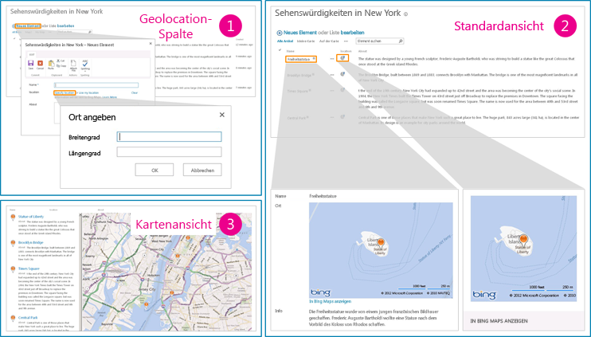

# <a name="how-to-add-a-geolocation-column-to-a-list-programmatically-in-sharepoint"></a><span data-ttu-id="dac11-102">Vorgehensweise: Hinzufügen einer Geolocation-Spalte einer Liste in SharePoint programmgesteuert</span><span class="sxs-lookup"><span data-stu-id="dac11-102">How to: Add a Geolocation column to a list programmatically in SharePoint</span></span>
<span data-ttu-id="dac11-p101">In diesem Artikel erfahren Sie, wie Sie programmgesteuert eine Geolocation-Spalte einer Liste in SharePoint hinzufügen. Sie können Standortinformationen und Karten in SharePoint-Listen und standortbasierten Websites mithilfe des neuen Geolocation-Felds hinzufügen, indem Sie Ihren eigenen Geolocation-basierten Feldtyp erstellen.</span><span class="sxs-lookup"><span data-stu-id="dac11-p101">Learn how to programmatically add a Geolocation column to a list in SharePoint. Integrate location information and maps in SharePoint lists and location-based websites by using the new Geolocation field creating your own Geolocation-based field type. SharePoint introduces a new field type named Geolocation that enables you to annotate SharePoint lists with location information. In columns of type Geolocation, you can enter location information as a pair of latitude and longitude coordinates in decimal degrees or retrieve the coordinates of the user's current location from the browser if it implements the W3C Geolocation API. For more information about the Geolocation column, see [Integrating location and map functionality in SharePoint](integrating-location-and-map-functionality-in-sharepoint.md). The Geolocation column is not available by default in SharePoint lists. To add the column to a SharePoint list, you have to write code. In this article, learn how to add the Geolocation field to a list programmatically by using the SharePoint client object model.</span></span>
  
    
    

<span data-ttu-id="dac11-111">Sie müssen ein MSI-Paket mit dem Namen "SQLSysClrTypes.msi" auf jedem SharePoint-Front-End-Webserver installieren, um Geolocation-Feldwerte oder -Daten in einer Liste anzuzeigen.</span><span class="sxs-lookup"><span data-stu-id="dac11-111">An MSI package named SQLSysClrTypes.msi must be installed on every SharePoint front-end web server to view the geolocation field value or data in a list.</span></span> <span data-ttu-id="dac11-112">Dieses Paket installiert Komponenten, welche die neuen Geometrie-, Geografie- und Hierarchie-ID-Typen in SQL Server 2008 implementieren.</span><span class="sxs-lookup"><span data-stu-id="dac11-112">This package installs components that implement the new geometry, geography, and hierarchy ID types in SQL Server 2008.</span></span> <span data-ttu-id="dac11-113">Diese Datei wird standardmäßig für SharePoint Online installiert.</span><span class="sxs-lookup"><span data-stu-id="dac11-113">By default, this file is installed for SharePoint Online.</span></span> <span data-ttu-id="dac11-114">Dies gilt jedoch nicht für eine lokale Bereitstellung von SharePoint.</span><span class="sxs-lookup"><span data-stu-id="dac11-114">However, it is not for an on-premises deployment of SharePoint.</span></span> <span data-ttu-id="dac11-115">Sie müssen Mitglied der Gruppe der Farmadministratoren sein, um diesen Vorgang ausführen zu können.</span><span class="sxs-lookup"><span data-stu-id="dac11-115">You must be a member of the Farm Administrators group in order to complete this and the remaining steps.</span></span> <span data-ttu-id="dac11-116">Informationen zum Herunterladen von SQLSysClrTypes.msi finden Sie unter [Microsoft SQL Server 2008 R2 SP1 Feature Pack](http://www.microsoft.com/en-us/download/details.aspx?id=26728) für SQL Server 2008 oder unter [Microsoft SQL Server 2012 Feature Pack](http://www.microsoft.com/en-us/download/details.aspx?id=29065) für SQL Server 2012 im Microsoft Download Center.</span><span class="sxs-lookup"><span data-stu-id="dac11-116">To download SQLSysClrTypes.msi, see  [Microsoft SQL Server 2008 R2 SP1 Feature Pack](http://www.microsoft.com/en-us/download/details.aspx?id=26728) for SQL Server 2008, or [Microsoft SQL Server 2012 Feature Pack](http://www.microsoft.com/en-us/download/details.aspx?id=29065)for SQL Server 2012 in the Microsoft Download Center.</span></span>
## <a name="prerequisites-for-adding-a-geolocation-column"></a><span data-ttu-id="dac11-117">Voraussetzungen für das Hinzufügen einer Geolocation-Spalte</span><span class="sxs-lookup"><span data-stu-id="dac11-117">Prerequisites for adding a Geolocation column</span></span>
<span data-ttu-id="dac11-118"><a name="SP15addgeo_prereq"> </a></span><span class="sxs-lookup"><span data-stu-id="dac11-118"></span></span>


  
    
    

- <span data-ttu-id="dac11-119">Zugriff auf eine Liste von SharePoint, mit der ausreichenden Berechtigungen, um eine Spalte hinzuzufügen.</span><span class="sxs-lookup"><span data-stu-id="dac11-119">Access to a SharePoint list, with sufficient privileges to add a column.</span></span>
    
  
- <span data-ttu-id="dac11-120">Ein gültiger Bing Karten-Schlüssel muss auf Farm- oder Webebene festgelegt sein. Dieser kann aus dem [Bing Karten-Kontocenter](https://www.bingmapsportal.com/) abgerufen werden.</span><span class="sxs-lookup"><span data-stu-id="dac11-120">A valid Bing Maps key set at the farm or web level, which can be obtained from the  [Bing Maps Account Center](https://www.bingmapsportal.com/).</span></span>
    
    > <span data-ttu-id="dac11-121">**Wichtig:** Bitte beachten Sie, dass Sie für die Einhaltung der für Ihre Nutzung des Bing Karten-Schlüssels anwendbaren Geschäftsbedingungen und alle erforderlichen Veröffentlichungen gegenüber Benutzern Ihrer Anwendung bezüglich an den Bing Daten-Dienst übermittelter Daten verantwortlich sind.</span><span class="sxs-lookup"><span data-stu-id="dac11-121">**IMPORTANT** Please note that you are responsible for compliance with terms and conditions applicable to your use of the Bing Maps key, and any necessary disclosures to users of your application regarding data passed to the Bing Maps service.</span></span> 
- <span data-ttu-id="dac11-122">Visual Studio 2010.</span><span class="sxs-lookup"><span data-stu-id="dac11-122">Visual Studio 2010.</span></span>
    
  

## <a name="code-example-add-a-geolocation-column-to-a-list-programmatically"></a><span data-ttu-id="dac11-123">Codebeispiel: Programmgesteuertes Hinzufügen eine Geolocation-Spalte zu einer Liste</span><span class="sxs-lookup"><span data-stu-id="dac11-123">Code example: Add a Geolocation column to a list programmatically</span></span>
<span data-ttu-id="dac11-124"><a name="SP15addgeo_addcolumn"> </a></span><span class="sxs-lookup"><span data-stu-id="dac11-124"></span></span>

<span data-ttu-id="dac11-125">Gehen folgendermaßen Sie vor, um die Geolocation-Spalte zu einer Liste mithilfe des Clientobjektmodells SharePoint hinzuzufügen.</span><span class="sxs-lookup"><span data-stu-id="dac11-125">Follow these steps to add the Geolocation column to a list using the SharePoint client object model.</span></span>
  
    
    

### <a name="to-add-the-geolocation-column-to-a-list-using-the-client-object-model"></a><span data-ttu-id="dac11-126">So fügen Sie der Geolocation-Spalte zu einer Liste mithilfe des Clientobjektmodells hinzu</span><span class="sxs-lookup"><span data-stu-id="dac11-126">To add the Geolocation column to a list using the client object model</span></span>


1. <span data-ttu-id="dac11-127">Starten Sie Visual Studio.</span><span class="sxs-lookup"><span data-stu-id="dac11-127">Start Visual Studio.</span></span>
    
  
2. <span data-ttu-id="dac11-p103">Wählen Sie auf der Menüleiste die Optionen Sie **Datei, neues Projekt** aus. Das Dialogfeld **Neues Projekt** wird geöffnet.</span><span class="sxs-lookup"><span data-stu-id="dac11-p103">On the menu bar, choose **File, New Project**. The **New Project** dialog box opens.</span></span>
    
  
3. <span data-ttu-id="dac11-130">Klicken Sie im Dialogfeld **Neues Projekt** wählen Sie **c#** im Feld **Installierte Vorlagen**, und wählen Sie dann die Vorlage **Konsolenanwendung**.</span><span class="sxs-lookup"><span data-stu-id="dac11-130">In the **New Project** dialog box, choose **C#** in the **Installed Templates** box, and then choose the **Console Application** template.</span></span>
    
  
4. <span data-ttu-id="dac11-131">Benennen Sie dem Projekt, und wählen Sie dann auf die Schaltfläche **OK**.</span><span class="sxs-lookup"><span data-stu-id="dac11-131">Give the project a name, and then choose the **OK** button.</span></span>
    
  
5. <span data-ttu-id="dac11-p104">Visual Studio erstellt das Projekt. Fügen Sie einen Verweis auf die folgenden Assemblys hinzu, und wählen Sie **OK**.</span><span class="sxs-lookup"><span data-stu-id="dac11-p104">Visual Studio creates the project. Add a reference to the following assemblies, and choose **OK**.</span></span>
    
    <span data-ttu-id="dac11-134">Microsoft.SharePoint.Client.dll</span><span class="sxs-lookup"><span data-stu-id="dac11-134">Microsoft.SharePoint.Client.dll</span></span>
    
    <span data-ttu-id="dac11-135">Microsoft.SharePoint.Client.Runtime.dll</span><span class="sxs-lookup"><span data-stu-id="dac11-135">Microsoft.SharePoint.Client.Runtime.dll</span></span>
    
  
6. <span data-ttu-id="dac11-136">Fügen Sie eine Richtlinie **using** in der Standard-cs-Datei wie folgt.</span><span class="sxs-lookup"><span data-stu-id="dac11-136">In the default .cs file, add a **using** directive as follows.</span></span>
    
     `using Microsoft.SharePoint.Client;`
    
  
7. <span data-ttu-id="dac11-137">Fügen Sie den folgenden Code zur **Main**-Methode in der CS-Datei hinzu.</span><span class="sxs-lookup"><span data-stu-id="dac11-137">Add the following code to the **Main** method in the .cs file.</span></span>
    
```cs
  
class Program
    {
        static void Main(string[] args)
        {
            AddGeolocationField();
            Console.WriteLine("Location field added successfully");
        }
        private static void AddGeolocationField()
        { 
         // Replace site URL and List Title with Valid values.
            ClientContext context = new ClientContext("<Site Url>"); 
            List oList = context.Web.Lists.GetByTitle("<List Title>");
            oList.Fields.AddFieldAsXml("<Field Type='Geolocation' DisplayName='Location'/>",true, AddFieldOptions.AddToAllContentTypes);                                        
            oList.Update();
            context.ExecuteQuery();
        } 
    }
```

8. <span data-ttu-id="dac11-138">Ersetzen Sie \<Site Url\> und \<List Title\> durch gültige Werte.</span><span class="sxs-lookup"><span data-stu-id="dac11-138">Replace \<Site Url\> and \<List Title\> with valid values.</span></span>
    
  
9.  <span data-ttu-id="dac11-139">Legen Sie das Zielframework in den Projekteigenschaften als .NET Framework 4.0 oder 3.5 fest, und führen Sie das Beispiel aus.</span><span class="sxs-lookup"><span data-stu-id="dac11-139">Set the target framework in Project Properties as .NET Framework 4.0 or 3.5, and run the example.</span></span>
    
  
10. <span data-ttu-id="dac11-p105">Navigieren Sie zu der Liste. Sie sollten eine Spalte mit dem Namen **Speicherort** vom Typ Geolocation in der Liste anzeigen können. Sie können nun einige Werte und erleben. Abbildung 1 zeigt den Standardspeicherort und Map-Features, die Sie erwarten können, finden in der Liste.</span><span class="sxs-lookup"><span data-stu-id="dac11-p105">Navigate to the list. You should be able to see a column named **Location** of type Geolocation in the list. You can now enter some values and see it in action. Figure 1 shows the default location and map features that you can expect to see in your list.</span></span>
    
   <span data-ttu-id="dac11-144">**Abbildung 1. Übersicht der standardmäßige Standort- und Karten-features**</span><span class="sxs-lookup"><span data-stu-id="dac11-144">**Figure 1. Summarized view of the default location and map features**</span></span>

  

  
  

  

  

## <a name="add-a-list-item-with-the-geolocation-field-value-to-a-sharepoint-list-programmatically"></a><span data-ttu-id="dac11-146">Programmgesteuertes Hinzufügen eines Listenelements mit dem Wert des Geolocation-Feld zu einer SharePoint-Liste</span><span class="sxs-lookup"><span data-stu-id="dac11-146">Add a list item with the Geolocation field value to a SharePoint list programmatically</span></span>
<span data-ttu-id="dac11-147"><a name="SP15addgeo_addlistitem"> </a></span><span class="sxs-lookup"><span data-stu-id="dac11-147"></span></span>

<span data-ttu-id="dac11-p106">Nach der Geolocation wird Feld hinzugefügt, einer SharePoint-Liste der Entwickler das Listenelement programmgesteuert zur Liste hinzufügen kann. Es gibt zwei Methoden, um das Listenelement programmgesteuert hinzufügen:, indem Sie auf das Geolocation-Feld **komplexer FieldGeolocationValue**-Objekt übergeben und von Geolocation-Feld **Roh-Wert** übergeben.</span><span class="sxs-lookup"><span data-stu-id="dac11-p106">After the Geolocation field is added to a SharePoint list, the developer can add the list item to the list programmatically. There are two ways to add the list item programmatically: by passing the **FieldGeolocationValue** object to the Geolocation field, and by passing **Raw Value** to the Geolocation field.</span></span>
  
    
    

### <a name="method-a-pass-the-fieldgeolocationvalue-object-to-the-geolocation-field"></a><span data-ttu-id="dac11-150">Methode A: übergeben Sie komplexer FieldGeolocationValue-Objekt an die Geolocation-Feld</span><span class="sxs-lookup"><span data-stu-id="dac11-150">Method A: Pass the FieldGeolocationValue object to the Geolocation field</span></span>


- <span data-ttu-id="dac11-151">Die folgende Methode fügt ein Listenelement, indem Sie als ein Objekt den Geolocation-Wert übergeben.</span><span class="sxs-lookup"><span data-stu-id="dac11-151">The following method adds a list item by passing the Geolocation value as an object.</span></span>
    
```cs
  
private void AddListItem()
        {   // Replace site URL and List Title with Valid values.
            ClientContext context = new ClientContext("<Site Url>");
            List oList = context.Web.Lists.GetByTitle("<List Name>");

            ListItemCreationInformation itemCreationInfo = new ListItemCreationInformation();
            ListItem oListItem = oList.AddItem(itemCreationInfo);

            oListItem["Title"] = "New Title";

            FieldGeolocationValue oGeolocationValue = new FieldGeolocationValue();
            oGeolocationValue.Latitude = (double)17.4;
            oGeolocationValue.Longitude = (double)78.4;
            oListItem["location"] = oGeolocationValue;

            oListItem.Update();
            context.ExecuteQuery();
        }

```


### <a name="method-b-pass-a-raw-value-to-the-geolocation-field"></a><span data-ttu-id="dac11-152">Methode B: übergeben Sie unformatierten Wert an die Geolocation-Feld</span><span class="sxs-lookup"><span data-stu-id="dac11-152">Method B: Pass a raw value to the Geolocation field</span></span>


- <span data-ttu-id="dac11-153">Die folgende Methode fügt ein Listenelement zur SharePoint-Liste, indem Sie auf das Geolocation-Feld unformatierte Werte übergeben.</span><span class="sxs-lookup"><span data-stu-id="dac11-153">The following method adds a list item to the SharePoint list by passing raw values to the Geolocation field.</span></span>
    
```cs
  
private void AddListItem()
        {   // Replace site URL and List Title with Valid values.
            ClientContext context = new ClientContext("<Site Url>");
            List oList = context.Web.Lists.GetByTitle("<List Name>");

            ListItemCreationInformation itemCreationInfo = new ListItemCreationInformation();
            ListItem oListItem = oList.AddItem(itemCreationInfo);

            oListItem["Title"] = "New Title";
             // Data in WKT (World Known Text) format.
            oListItem["location"] = "POINT (78.4 17.4)" ; 

            oListItem.Update();
            context.ExecuteQuery();
        }

```


## <a name="additional-resources"></a><span data-ttu-id="dac11-154">Zusätzliche Ressourcen</span><span class="sxs-lookup"><span data-stu-id="dac11-154">Additional resources</span></span>
<span data-ttu-id="dac11-155"><a name="SP15addgeo_addlresources"> </a></span><span class="sxs-lookup"><span data-stu-id="dac11-155"></span></span>


-  [<span data-ttu-id="dac11-156">Integrieren von Standort- und Kartenfunktionen in SharePoint</span><span class="sxs-lookup"><span data-stu-id="dac11-156">Integrating location and map functionality in SharePoint</span></span>](integrating-location-and-map-functionality-in-sharepoint.md)
    
  
-  [<span data-ttu-id="dac11-157">Vorgehensweise: Legen Sie die Bing Maps-Taste auf Ordnerebene Web und Farm in SharePoint</span><span class="sxs-lookup"><span data-stu-id="dac11-157">How to: Set the Bing Maps key at the web and farm level in SharePoint</span></span>](how-to-set-the-bing-maps-key-at-the-web-and-farm-level-in-sharepoint.md)
    
  
-  [<span data-ttu-id="dac11-158">Vorgehensweise: erweitern den Geolocation-Feldtyp verwenden clientseitiges Rendering</span><span class="sxs-lookup"><span data-stu-id="dac11-158">How to: Extend the Geolocation field type using client-side rendering</span></span>](how-to-extend-the-geolocation-field-type-using-client-side-rendering.md)
    
  
-  [<span data-ttu-id="dac11-159">Erstellen einer Kartenansicht für Geolocation-Feld in SharePoint</span><span class="sxs-lookup"><span data-stu-id="dac11-159">Create a map view for the Geolocation field in SharePoint</span></span>](create-a-map-view-for-the-geolocation-field-in-sharepoint.md)
    
  
-  [<span data-ttu-id="dac11-160">Vorgehensweise: Integrieren von Zuordnungen in Windows Phone-Anwendungen und SharePoint aufgelistet</span><span class="sxs-lookup"><span data-stu-id="dac11-160">How to: Integrate maps with Windows Phone apps and SharePoint lists</span></span>](how-to-integrate-maps-with-windows-phone-apps-and-sharepoint-lists.md)
    
  
-  <span data-ttu-id="dac11-161">
  [Verwenden des Standortfeldtyps in mobilen Anwendungen für SharePoint](http://technet.microsoft.com/en-us/library/fp161355%28v=office.15%29.aspx)</span><span class="sxs-lookup"><span data-stu-id="dac11-161">[Use the SharePoint location field type in mobile applications](http://technet.microsoft.com/en-us/library/fp161355%28v=office.15%29.aspx)</span></span>
    
  

