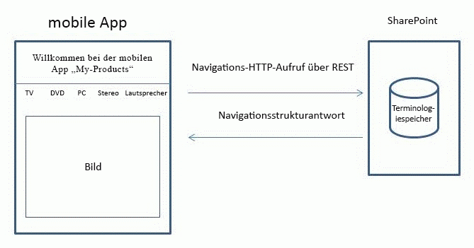
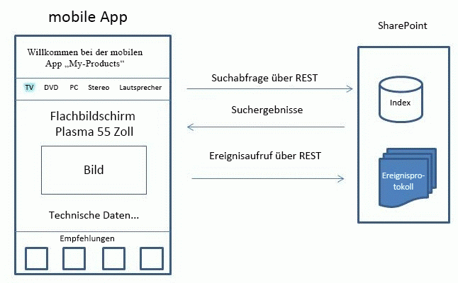

# <a name="build-search-driven-mobile-apps-with-the-navigation-and-event-logging-rest-interfaces"></a><span data-ttu-id="01499-102">Erstellen von suchgesteuerten mobilen Apps mit den REST-Schnittstellen für Navigation und Ereignisprotokollierung</span><span class="sxs-lookup"><span data-stu-id="01499-102">Build search-driven mobile apps with the Navigation and Event Logging REST interfaces</span></span>

<span data-ttu-id="01499-103">In SharePoint werden die REST-Schnittstellen für Navigation und Ereignisprotokollierung eingeführt, die es Ihnen ermöglichen, eine suchgesteuerte mobile App für mobile Geräte wie Smartphones und Tablets zu erstellen, auf denen andere Betriebssysteme (keine Windows-Betriebssysteme) wie beispielsweise Android und iOS ausgeführt werden.</span><span class="sxs-lookup"><span data-stu-id="01499-103">SharePoint introduces the Navigation and Event Logging REST interfaces, enabling you to create a search-driven mobile app for mobile devices such as phones and tablets that run on operating systems other than Windows—for example, Android and iOS.</span></span>
## <a name="how-apps-work-with-the-product-catalog"></a><span data-ttu-id="01499-104">Zusammenarbeit von Apps mit dem Produktkatalog</span><span class="sxs-lookup"><span data-stu-id="01499-104">How apps work with the product catalog</span></span>
<span data-ttu-id="01499-105"><a name="mobile_app_and_product_catalog"> </a></span><span class="sxs-lookup"><span data-stu-id="01499-105"><a name="mobile_app_and_product_catalog"> </a></span></span>

<span data-ttu-id="01499-p101">Ein Produktkatalog kann auf unterschiedliche Weise auf einem mobilen Gerät angezeigt werden. In der Vergangenheit können Sie einen mobilen Channel für den Produktkatalog in SharePoint konfigurieren. Erstellen eines mobilen Kanals können Sie ein Erscheinungsbild anpassen, die alle Bildschirmgröße auf einem mobilen Gerät entspricht. Die resultierende Seite wird im angezeigt. ASPX-Format mit einem Webbrowser auf dem mobilen Gerät. Die Struktur der Seiten und die entsprechende Logik wird von dem Server mit SharePoint behandelt. Im Gegensatz dazu eine app, die mit der Navigation und Ereignis Protokollierung REST-Schnittstellen erstellt ist suchbasierte und fungiert als Front-End, die Produkt-Katalogstrukturen zu navigieren.</span><span class="sxs-lookup"><span data-stu-id="01499-p101">A product catalog can be displayed on a mobile device in different ways. Traditionally, you can configure a mobile channel for the product catalog within SharePoint. Creating a mobile channel enables you to tailor a look and feel that matches any screen size on a mobile device. The resulting page is viewed in .ASPX format using the web browser on the mobile device. The structure of the pages and its corresponding logic is handled by the server running SharePoint. In contrast, an app created with the Navigation and Event Logging REST interfaces is search-driven and acts as a front-end to navigate the product catalog structures.</span></span>
  
    
    
<span data-ttu-id="01499-p102">Eine app ist keine eigenständige Anwendung, aber es funktioniert in einer vorhandenen SharePoint-Installation mit einem Produktkatalog einrichten. Die app kann die Navigationsstruktur dynamisch aktualisieren, wenn Produktkatalog in dieser bestimmten SharePoint-Installation geändert wurde. Darüber hinaus, klicken Sie auf Ereignisse, die durch den Benutzer wieder auf dem Server mit SharePoint gesendet werden, um die Qualität der Empfehlungen für den Produktkatalog vorgenommene insgesamt zu verbessern.</span><span class="sxs-lookup"><span data-stu-id="01499-p102">An app is not a stand-alone program, but works with a product catalog set up in an existing SharePoint installation. The app can update the navigation structure dynamically if the product catalog has changed in that particular SharePoint installation. In addition, click events made by the user are sent back to the server running SharePoint to improve the overall quality of recommendations made by the product catalog.</span></span>
  
    
    
<span data-ttu-id="01499-p103">Die app erstellt Produktkatalog anzeigen, ohne mit einem Webbrowser vom Benutzer benötigten Seiten. Gestaltungsvorlagen, Seitenlayouts und Logik zum Erstellen von Seiten zum Anzeigen des Produktkatalogs werden als einer app auf Geräte heruntergeladen; Diese Seiten werden wiederverwendet, wenn der Benutzer die app ausgeführt wird. Während der Benutzer des Produktkatalogs navigiert, wird die app gleichzeitig eine Navigationsstruktur erstellt und richtet Seiten. Suchabfragen werden zum Ausfüllen relevanter Seiten mit Elementinhalts an der Produktkatalog in SharePoint gesendet. Die entsprechenden Suchergebnisse werden dann verwendet, um die Seiten zu füllen.</span><span class="sxs-lookup"><span data-stu-id="01499-p103">The app constructs the pages needed by the user to view the product catalog without using a web browser. Master pages, page layouts, and logic to construct the pages to view the product catalog are downloaded onto devices as an app; these pages are reused whenever the user runs the app. While the user navigates the product catalog, the app simultaneously constructs a navigation structure and sets up the pages. To fill in relevant pages with item content, search queries are sent to the product catalog in SharePoint. The corresponding search results are then used to fill the pages.</span></span>
  
    
    

## <a name="example-create-a-search-driven-mobile-app-with-home-category-and-item-detail-pages"></a><span data-ttu-id="01499-120">Beispiel: Erstellen einer mobilen suchbasierte-app mit Home, Kategorie und Element Projektdetailseiten verwalten</span><span class="sxs-lookup"><span data-stu-id="01499-120">Example: Create a search-driven mobile app with home, category, and item detail pages</span></span>
<span data-ttu-id="01499-121"><a name="example_search_driven_mobile_app"> </a></span><span class="sxs-lookup"><span data-stu-id="01499-121"><a name="example_search_driven_mobile_app"> </a></span></span>

<span data-ttu-id="01499-p104">Angenommen, Sie haben eine mobile app mit drei Arten von Seiten: eine Homepage, Kategorieseiten und objektdetailseiten. In den folgenden Abschnitten wird beschrieben, wie die Navigation, Ereignisprotokollierung und Search-REST-Schnittstellen zum Erstellen von Seiten verwendet werden.</span><span class="sxs-lookup"><span data-stu-id="01499-p104">Suppose you have a mobile app with three types of pages: a home page, category pages, and item detail pages. The following sections describe how the Navigation, Event Logging, and Search REST interfaces are used to create the pages.</span></span>
  
    
    

### <a name="home-page-for-a-search-driven-mobile-app"></a><span data-ttu-id="01499-124">Homepage für eine suchbasierte mobilen app</span><span class="sxs-lookup"><span data-stu-id="01499-124">Home page for a search-driven mobile app</span></span>

<span data-ttu-id="01499-p105">In der Regel wird **die Homepage** angezeigt, wenn die app gestartet wird. **Die Homepage** enthält im Menü der Produkt-Katalog, Text und ein statisches Bild, wie in Abbildung 1 dargestellt.</span><span class="sxs-lookup"><span data-stu-id="01499-p105">Typically the **Home** page is displayed when the app starts up. The **Home** page contains the product catalog menu, some text, and a static image, as shown in Figure 1.</span></span>
  
    
    

<span data-ttu-id="01499-127">**Abbildung 1. Homepage für eine suchbasierte mobilen app**</span><span class="sxs-lookup"><span data-stu-id="01499-127">**Figure 1. Home page for a search-driven mobile app**</span></span>

  
    
    

  
    
    

  
    
    
<span data-ttu-id="01499-p106">Um diese Seite zu konstruieren, sendet die app einen Navigation REST-Aufruf an den Server mit SharePoint Anfordern der Navigationsstruktur des Produktkatalogs. Im nächsten Schritt wird die app verwendet die Antwortdaten, um die richtige Taxonomie oder Menüstruktur einzurichten und zeigt die richtige Begriffsnamen für den Produktkatalog. Zusätzliche Inhalte wie Seitenlayout, Titeltext und statische Bilder werden in der app selbst gespeichert. Wenn die Taxonomie zu einem späteren Zeitpunkt geändert wird, kann die app aktualisiert werden, mit dem REST der Navigation angerufen, wenn es ausgeführt wird.</span><span class="sxs-lookup"><span data-stu-id="01499-p106">To construct this page, the app sends a Navigation REST call to the server running SharePoint requesting the navigation structure of the product catalog. Next, the app uses the response data to set up the correct taxonomy or menu structure and displays the correct term names for the product catalog. Additional content such as page layout, title text, and static images are stored in the app itself. If the taxonomy is modified at a later time, the app can be updated with the Navigation REST call when it is run.</span></span>
  
    
    
<span data-ttu-id="01499-133">Es folgt ein Beispiel für eine typische Navigation REST-Aufrufs.</span><span class="sxs-lookup"><span data-stu-id="01499-133">The following is an example of a typical Navigation REST call.</span></span>
  
    
    


```

GET http://server/_api/navigation/menustate?mapprovidername='GlobalNavigationSwitchableProvider'

```

<span data-ttu-id="01499-134">Eine entsprechende Antwort wird angezeigt,  [Beispielantwort für eine REST Navigation für eine mobile app aufgerufen werden](how-to-build-search-driven-mobile-apps-with-the-navigation-and-event-logging-res.md#response_navigation_rest).</span><span class="sxs-lookup"><span data-stu-id="01499-134">A matching response is shown in  [Example response for a Navigation REST call for a mobile app](how-to-build-search-driven-mobile-apps-with-the-navigation-and-event-logging-res.md#response_navigation_rest).</span></span>
  
    
    

### <a name="category-page-for-a-search-driven-mobile-app"></a><span data-ttu-id="01499-135">Kategorieseite für eine suchbasierte mobilen app</span><span class="sxs-lookup"><span data-stu-id="01499-135">Category page for a search-driven mobile app</span></span>

<span data-ttu-id="01499-p107">**Kategorieseite** viele Elemente in einer ausgewählten Kategorie angezeigt. Jedes Element in einer Kategorie aufgeführt kann in der Regel durch einige relevante Elementdaten wie Titel, ein Bild und Preis dargestellt werden. Diese Daten werden aus dem Produktkatalog erfasst, mithilfe einer Suchabfrage SharePoint Search-REST-Dienst wie in Abbildung 2 dargestellt.</span><span class="sxs-lookup"><span data-stu-id="01499-p107">The **Category** page displays many items in a selected category. Each item listed in a category can typically be represented by some relevant item data, such as title, an image, and price. This data is collected from the product catalog by using a search query through the SharePoint Search REST service as shown in Figure 2.</span></span>
  
    
    

<span data-ttu-id="01499-139">**Abbildung 2. Kategorieseite für eine suchbasierte mobilen app**</span><span class="sxs-lookup"><span data-stu-id="01499-139">**Figure 2. Category page for a search-driven mobile app**</span></span>

  
    
    

  
    
    

  
    
    
<span data-ttu-id="01499-141">Wenn Sie eine der Kategorien im vorherigen Diagramm auswählen, wird angenommen, **TV**, **eine Kategorieseite** angezeigt.</span><span class="sxs-lookup"><span data-stu-id="01499-141">If you choose one of the categories in the previous diagram, for example, **TV**, a **Category** page appears.</span></span>
  
    
    
<span data-ttu-id="01499-142">Es folgt ein Beispiel für eine typische Search-REST-Abfrage zum Abrufen von Inhalten für eine bestimmte Kategorie.</span><span class="sxs-lookup"><span data-stu-id="01499-142">The following is an example of a typical Search REST query to obtain content for a particular category.</span></span>
  
    
    


```

GET http://server/_api/search/query?querytext='owstaxidProductCatalogItemCategory:#0<TermGuid>'

```

<span data-ttu-id="01499-143">Eine übereinstimmende Antwort wird in [Beispielantwort für eine Search-REST-Abfrage für eine mobile App](how-to-build-search-driven-mobile-apps-with-the-navigation-and-event-logging-res.md#response_search_rest) gezeigt.</span><span class="sxs-lookup"><span data-stu-id="01499-143">A matching response is shown in  [Example response for a Search REST query for a mobile app](how-to-build-search-driven-mobile-apps-with-the-navigation-and-event-logging-res.md#response_search_rest).</span></span>
  
    
    
<span data-ttu-id="01499-144">Die Abfrageverarbeitungskomponente in SharePoint gibt Suchergebnisse zurück, die Daten für eine bestimmte Kategorie enthalten. Die App präsentiert die Daten auf der Seite **Kategorie**.</span><span class="sxs-lookup"><span data-stu-id="01499-144">The query processing component in SharePoint returns search results that contain data for a particular category, and the app presents the data in the **Category** page.</span></span> <span data-ttu-id="01499-145">Liegt ein bestes Suchergebnis vor, das der ausgewählten Kategorie zugeordnet ist, erkennt die Abfrageverarbeitungskomponente diese Zuordnung und extrahiert die Daten des besten Suchergebnisses aus der entsprechenden Datenbank. Diese ist im Diagramm als **BB** bezeichnet.</span><span class="sxs-lookup"><span data-stu-id="01499-145">If there is a Best Bet associated with the selected category, the query processing component detects this association and extracts the Best Bet data from the Best Bet database, labeled **BB** in the diagram.</span></span> <span data-ttu-id="01499-146">Die Suchergebnisse werden dann mit Ergebnissen aus der Datenbank der besten Suchergebnisse gemischt und in einer Ergebnistabelle zurück an die App gesendet.</span><span class="sxs-lookup"><span data-stu-id="01499-146">The search results are then mixed with results from the Best Bet database and sent back to the app in a result table.</span></span> <span data-ttu-id="01499-147">Die App ist verantwortlich für die Extraktion der verschiedenen Teile der Ergebnisse aus der Tabelle und für die Anzeige des besten Suchergebnisses an einem dedizierten Ort.</span><span class="sxs-lookup"><span data-stu-id="01499-147">The app is responsible for extracting the different parts of the results from the table and displaying the Best Bet in a dedicated location.</span></span>
  
    
    

### <a name="item-detail-pages-for-a-search-driven-mobile-app"></a><span data-ttu-id="01499-148">Elementdetailseiten für eine suchbasierte mobile App</span><span class="sxs-lookup"><span data-stu-id="01499-148">Item detail pages for a search-driven mobile app</span></span>

<span data-ttu-id="01499-p109">Wenn Sie ein Element in einer Kategorie auswählen, wird die Seite **Elementdetails** angezeigt. Auf dieser Seite wird ein Element mit Daten wie Titel, Produktbilder, technische Beschreibung, Preis und Übermittlungsinformationen ausführlich beschrieben. Weitere Empfehlungen oder Bewertungen, wenn verfügbar, auch angezeigt. Um die Seite **Details für** zu konstruieren, sendet die app zwei Abfragen: eine Abfrage zum Abrufen von Elementdaten und eine andere Abfrage empfangen Empfehlungen im Zusammenhang mit, dass das Element, wie in Abbildung 3 dargestellt.</span><span class="sxs-lookup"><span data-stu-id="01499-p109">If you select an item in a category, the **Item details** page appears. On this page, an item is described in detail with data such as title, product images, technical description, price, and delivery information. More recommendations or ratings, if available, are also displayed. To construct the **Item details** page, the app sends two queries: one query to retrieve item data and another query to receive recommendations related to that item, as shown in Figure 3.</span></span>
  
    
    

<span data-ttu-id="01499-153">**Abbildung 3. Element-Detailseite für eine suchbasierte mobilen app**</span><span class="sxs-lookup"><span data-stu-id="01499-153">**Figure 3. Item detail page for a search-driven mobile app**</span></span>

  
    
    

  
    
    

  
    
    
<span data-ttu-id="01499-155">Es folgt ein Beispiel für eine typische Search-REST-Abfrage zum Abrufen von Inhalten für ein bestimmtes Element.</span><span class="sxs-lookup"><span data-stu-id="01499-155">The following is an example of a typical Search REST query to obtain content for a particular item.</span></span>
  
    
    


```

GET http://server/_api/search/query?querytext='ProductCatalogItemNumberOWSTEXT:1234567'
```

<span data-ttu-id="01499-p110">Empfehlungen werden nicht in der app selbst in SharePoint, berechnet. Empfehlungen basierend auf der Benutzerereignisse erstellen - nicht nur in diese spezielle app aber alle Benutzerereignisse, die mithilfe des Produktkatalogs erfasst werden - die app sendet ständig Veranstaltungen, sobald sie, an den Produktkatalog in SharePoint über einen Anruf Ereignis auftreten. Diese Benutzerereignisse werden im Ereignisprotokoll gespeichert und verarbeitet nur wie andere Benutzer Ereignissen im Zusammenhang mit diesem bestimmten Element. Kein Rückruf wird an die app aus dem Produktkatalog gesendet. Die Empfehlungen berechnet stehen für die app über den SharePoint Search-REST-Dienst.</span><span class="sxs-lookup"><span data-stu-id="01499-p110">Recommendations are calculated in SharePoint, not in the app itself. To create recommendations based on user events—not only in this particular app but all user events that are collected by the product catalog—the app constantly sends user events, as they occur, back to the product catalog in SharePoint via an Event call. These user events are stored in the event log and processed only like other user events associated with that particular item. No callback is sent to the app from the product catalog. The recommendations calculated are available for the app through the SharePoint Search REST service.</span></span>
  
    
    
<span data-ttu-id="01499-161">Das folgende Beispiel zeigt einen Anruf typische **POST** für die ereignisprotokollierung.</span><span class="sxs-lookup"><span data-stu-id="01499-161">The following example shows a typical **POST** call for event logging.</span></span>
  
    
    


```
POST http://server/_api/events/logevent
{
      "usageEntry": {
            "__metadata": {
                  "type": "Microsoft.SharePoint.Administration.UsageEntry"
            },
            "EventTypeId": 1,
            "ItemId": "an item fb7c-4196-8123-e54eee5f4787",
            "ScopeId": "61141c0e-fb7c ",
            "Site": "61141c0e- 
-4196-8123-e54eee5f4787",
            "User": "johndoe"
      }
}
```

<span data-ttu-id="01499-p111">Der Dienst folgt standard-HTTP-Rückgabecodes: eine 200 HTTP-Antwort gibt eine erfolgreiche Anforderung. Es sind keine Antworten aus dem Produktkatalog für das Ereignis Protokollierung REST-Schnittstelle.</span><span class="sxs-lookup"><span data-stu-id="01499-p111">The service follows standard HTTP return codes: an HTTP 200 response indicates a successful request. There are no responses from the product catalog for the Event Logging REST interface.</span></span>
  
    
    

## <a name="example-response-for-a-navigation-rest-call-for-a-mobile-app"></a><span data-ttu-id="01499-164">Beispielantwort für eine REST Navigation für eine mobile app aufgerufen werden</span><span class="sxs-lookup"><span data-stu-id="01499-164">Example response for a Navigation REST call for a mobile app</span></span>
<span data-ttu-id="01499-165"><a name="response_navigation_rest"> </a></span><span class="sxs-lookup"><span data-stu-id="01499-165"><a name="response_navigation_rest"> </a></span></span>


```

<?xml version="1.0" encoding="utf-8"?>
<d:MenuState xmlns:d="http://schemas.microsoft.com/ado/2007/08/dataservices" xmlns:m="http://schemas.microsoft.com/ado/2007/08/dataservices/metadata" xmlns:georss="http://www.georss.org/georss" xmlns:gml="http://www.opengis.net/gml" m:type="SP.MenuState">

  <d:FriendlyUrlPrefix>/sites/contoso/</d:FriendlyUrlPrefix>
  <d:Nodes>
    <d:element m:type="SP.MenuNode">
      <d:CustomProperties m:null="true" />
      <d:FriendlyUrlSegment>electronics</d:FriendlyUrlSegment>
      <d:Hidden m:type="Edm.Boolean">false</d:Hidden>
      <d:Key>16c4c3c8-0309-47f7-9d9b-17e699febce8</d:Key>
      <d:Nodes>
        <d:element m:type="SP.MenuNode">
          <d:CustomProperties m:null="true" />
          <d:FriendlyUrlSegment>audio</d:FriendlyUrlSegment>
          <d:Hidden m:type="Edm.Boolean">false</d:Hidden>
          <d:Key>3e2d5c67-3fad-4cfa-8e1c-8c74fdf3a34b</d:Key>
          <d:Nodes>
            <d:element m:type="SP.MenuNode">
              <d:CustomProperties m:null="true" />
              <d:FriendlyUrlSegment>car-audio</d:FriendlyUrlSegment>
              <d:Hidden m:type="Edm.Boolean">false</d:Hidden>
              <d:Key>e3d271a4-dcbf-464d-a557-23848ccaa54f</d:Key>
              <d:Nodes />
              <d:NodeType m:type="Edm.Int32">1</d:NodeType>
              <d:SimpleUrl></d:SimpleUrl>
              <d:Title>Car audio</d:Title>
            </d:element>
            <d:element m:type="SP.MenuNode">
              <d:CustomProperties m:null="true" />
              <d:FriendlyUrlSegment>headphones</d:FriendlyUrlSegment>
              <d:Hidden m:type="Edm.Boolean">false</d:Hidden>
              <d:Key>7ad146d0-61b5-4b55-9da0-db7eaaa20f4a</d:Key>
              <d:Nodes />
              <d:NodeType m:type="Edm.Int32">1</d:NodeType>
              <d:SimpleUrl></d:SimpleUrl>
              <d:Title>Headphones</d:Title>
            </d:element>
            <d:element m:type="SP.MenuNode">
              <d:CustomProperties m:null="true" />
              <d:FriendlyUrlSegment>mp3</d:FriendlyUrlSegment>
              <d:Hidden m:type="Edm.Boolean">false</d:Hidden>
              <d:Key>7387fe97-52fa-464b-878a-b05d04e7032e</d:Key>
              <d:Nodes />
              <d:NodeType m:type="Edm.Int32">1</d:NodeType>
              <d:SimpleUrl></d:SimpleUrl>
              <d:Title>MP3</d:Title>
            </d:element>
            <d:element m:type="SP.MenuNode">
              <d:CustomProperties m:null="true" />
              <d:FriendlyUrlSegment>speakers</d:FriendlyUrlSegment>
              <d:Hidden m:type="Edm.Boolean">false</d:Hidden>
              <d:Key>65da907c-9565-45f6-a278-cbce7f74ab3d</d:Key>
              <d:Nodes />
              <d:NodeType m:type="Edm.Int32">1</d:NodeType>
              <d:SimpleUrl></d:SimpleUrl>
              <d:Title>Speakers</d:Title>
            </d:element>
          </d:Nodes>
          <d:NodeType m:type="Edm.Int32">1</d:NodeType>
          <d:SimpleUrl></d:SimpleUrl>
          <d:Title>Audio</d:Title>
        </d:element>
      </d:Nodes>
      <d:NodeType m:type="Edm.Int32">1</d:NodeType>
      <d:SimpleUrl></d:SimpleUrl>
      <d:Title>Electronics</d:Title>
    </d:element>
  </d:Nodes>
  <d:SimpleUrl m:null="true" />
  <d:SPSitePrefix>/sites/contoso/</d:SPSitePrefix>
  <d:SPWebPrefix>/sites/contoso/</d:SPWebPrefix>
  <d:StartingNodeKey>2168423f-3fea-4324-a5cb-90be8f079750</d:StartingNodeKey>
  <d:StartingNodeTitle>contoso</d:StartingNodeTitle>
  <d:Version>2012-05-29T12:00:04.4747484Z</d:Version>
</d:MenuState>

```


## <a name="example-response-for-a-search-rest-query-for-a-mobile-app"></a><span data-ttu-id="01499-166">Beispielantwort für eine Search-REST-Abfrage für eine mobile app</span><span class="sxs-lookup"><span data-stu-id="01499-166">Example response for a Search REST query for a mobile app</span></span>
<span data-ttu-id="01499-167"><a name="response_search_rest"> </a></span><span class="sxs-lookup"><span data-stu-id="01499-167"><a name="response_search_rest"> </a></span></span>


```

<d:query xmlns:d="http://schemas.microsoft.com/ado/2007/08/dataservices" xmlns:m="http://schemas.microsoft.com/ado/2007/08/dataservices/metadata" xmlns:georss="http://www.georss.org/georss" xmlns:gml="http://www.opengis.net/gml" m:type="Microsoft.Office.Server.Search.REST.SearchResult">
  <d:ElapsedTime m:type="Edm.Int32">4640</d:ElapsedTime>
  <d:PrimaryQueryResult m:type="Microsoft.Office.Server.Search.REST.QueryResult">
    <d:CustomResults m:null="true"/>
    <d:QueryId>7fea4ced-5789-4067-beab-8f807410b29e</d:QueryId>
    <d:QueryRuleId m:type="Edm.Guid">00000000-0000-0000-0000-000000000000</d:QueryRuleId>
    <d:RefinementResults m:null="true"/>
    <d:RelevantResults m:type="Microsoft.Office.Server.Search.REST.RelevantResults">
      <d:GroupTemplateId m:null="true"/>
      <d:ItemTemplateId m:null="true"/>
      <d:Properties>
        ...
      </d:Properties>
      <d:ResultTitle m:null="true"/>
      <d:ResultTitleUrl m:null="true"/>
      <d:RowCount m:type="Edm.Int32">10</d:RowCount>
      <d:Table m:type="SP.SimpleDataTable">
        <d:Rows>
          ...
        </d:Rows>
      </d:Table>
      <d:TotalRows m:type="Edm.Int32">2048964</d:TotalRows>
      <d:TotalRowsIncludingDuplicates m:type="Edm.Int32">2048964</d:TotalRowsIncludingDuplicates>
    </d:RelevantResults>
    <d:SpecialTermResults m:null="true"/>
  </d:PrimaryQueryResult>
  <d:Properties>
    ...
  </d:Properties>
  <d:SecondaryQueryResults m:null="true"/>
  <d:SpellingSuggestion/>
  <d:TriggeredRules>
  </d:TriggeredRules>
</d:query>
```


## <a name="see-also"></a><span data-ttu-id="01499-168">Siehe auch</span><span class="sxs-lookup"><span data-stu-id="01499-168">See also</span></span>
<span data-ttu-id="01499-169"><a name="bk_addresources"> </a></span><span class="sxs-lookup"><span data-stu-id="01499-169"><a name="bk_addresources"> </a></span></span>


-  [<span data-ttu-id="01499-170">Erstellen von Windows Phone-Apps, die auf SharePoint zugreifen</span><span class="sxs-lookup"><span data-stu-id="01499-170">Build Windows Phone apps that access SharePoint</span></span>](build-windows-phone-apps-that-access-sharepoint.md)
    
  
-  [<span data-ttu-id="01499-171">Programmieren mit dem SharePoint REST-Dienst</span><span class="sxs-lookup"><span data-stu-id="01499-171">Use OData query operations in SharePoint REST requests</span></span>](http://msdn.microsoft.com/library/d4b5c277-ed50-420c-8a9b-860342284b72%28Office.15%29.aspx)
    
  

