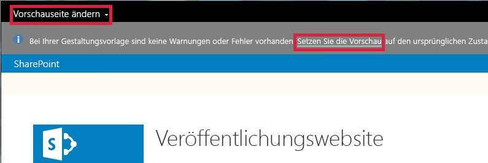

# Vorgehensweise: ändern die Vorschauseite in SharePoint-Design-ManagerHow to: Change the preview page in SharePoint Design Manager
Informationen Sie zum Festlegen, erstellen und Ändern der Vorschauseite im Entwurfs-Manager in SharePoint. Die Vorschauseite ist die Seite der Website, mit denen Sie Ihren Entwurf aussehen. Sie können entweder eine bestimmte Seite innerhalb Ihrer Website oder eine generische Vorschau die Vorschauseite festlegen. Wenn Sie die generische Vorschau auswählen, sehen Sie die Masterseite mit nur einem Platzhalter für Inhalt. Auch sehen eine Nachricht im Banner Sie, dass aktuell die Gestaltungsvorlage ohne Inhalt in der Vorschau angezeigt werden. Wenn Sie eine bestimmte Seite auswählen, sehen Sie sich, dass der Seiteninhalt mit dem Master Seite und das entsprechende Seitenlayout gerendert.Learn how to set, create, and change the preview page in Design Manager in SharePoint. The preview page is the page of your site that you use to see how your design looks. You can set the preview page to be either a specific page within your site or a generic preview. If you choose the generic preview, you'll see your master page with only a placeholder for content. You'll also see a message in the banner that you're currently previewing the master page without any content. If you choose a specific page, you'll see the page content rendered with the master page and the appropriate page layout.
  
    
    

Wie Sie mit der Seite interagieren, können Sie etwas, das bewirkt, SharePoint dass Verschiebung aus der Vorschau. Beispielsweise bei Auswahl von **Speichern** auf dem Menüband SharePoint speichert die Seite, und klicken Sie dann die liveversion der Seite angezeigt. (Die liveversion der Seite verwendet die live Gestaltungsvorlage, nicht die Gestaltungsvorlage, die Sie entwerfen.) Sie können zur Vorschauseite zurückgeben, indem Sie auf **die Vorschau zurücksetzen**.As you interact with the page, you might do something that causes SharePoint to move away from the preview. For example, if you select **Save** on the ribbon, SharePoint saves the page and then displays the live version of the page. (The live version of the page uses the live master page, not the master page that you are designing.) You can return to the preview page by choosing **Reset the preview**.
  
    
    

  
    
    

  
    
    

  
    
    

## Festlegen der Vorschauseite im Entwurfs-ManagerSet the preview page in Design Manager

Verwenden Sie dieses Verfahren, um die Vorschauseite festzulegen.Use this procedure to set the preview page.
  
    
    

### So legen Sie die Vorschauseite festTo set the preview page

1. Wählen Sie im Banner am Anfang des Webbrowsers **Vorschauseite ändern**.In the banner at the top of the web browser, choose **Change Preview Page**.
    
  
2. Wählen Sie **Vorhandenes auswählen**.Choose **Select Existing**.
    
  
3. Wählen Sie für die Verwendung einer generischen Vorschauseite **Generische Vorschau**.To use a generic preview page, select **Generic Preview**.
    
  
4. Um eine bestimmte Seite als der Vorschauseite verwenden möchten, wählen Sie **URL** aus, und geben Sie die URL der Seite.To use a specific page as the preview page, select **URL** and enter the URL of the page.
    
  
5. Wählen Sie **OK** aus.Choose **OK**.
    
  

## Erstellen einer neuen Vorschauseite im Entwurfs-ManagerCreate a new preview page in Design Manager

Verwenden Sie dieses Verfahren zum Erstellen einer Seite, und legen Sie es als der Vorschauseite.Use this procedure to create a page and set it as the preview page.
  
    
    

### Zum Erstellen einer neuen VorschauseiteTo create a new preview page

1. Wählen Sie im Banner am Anfang des Webbrowsers **Vorschauseite ändern**.In the banner at the top of the web browser, choose **Change Preview Page**.
    
  
2. Wählen Sie **neu erstellen**.Choose **Create New**.
    
  
3. Geben Sie einen Namen für die Seite, und klicken Sie dann auf **Erstellen**.Type a name for the page and then choose **Create**.
    
    Die Seite erstellt wird, und Sie getroffen werden, um eine Ansicht aus der Sie die neue Seite Inhalte hinzufügen können.The page is created, and you are taken to a view from which you can add content to the new page.
    
  

## Zurück zu der Vorschauseite im Entwurfs-ManagerReturn to the preview page in Design Manager

Verwenden Sie dieses Verfahren, um zur Seite Preview zurückzugeben.Use this procedure to return to the preview page.
  
    
    

### Zurückkehren zu der VorschauseiteTo return to the preview page

- Wählen Sie in der Nachricht Informationen am oberen Rand der Web-Browser **die Vorschau zurücksetzen** aus.In the information message at the top of the web browser, select **Reset the preview**.
    
  

## Zusätzliche RessourcenAdditional resources

-  [Gestaltungsvorlagen, der Gestaltungsvorlagenkatalog und Seitenlayouts in SharePointMaster pages, the Master Page Gallery, and page layouts in SharePoint](master-pages-the-master-page-gallery-and-page-layouts-in-sharepoint.md)
    
  
-  [Entwickeln des Website-Designs in SharePointDevelop the site design in SharePoint](develop-the-site-design-in-sharepoint.md)
    
  
-  [Gewusst wie: Zuordnen eines Netzlaufwerks zum SharePoint-GestaltungsvorlagenkatalogHow to: Map a network drive to the SharePoint Master Page Gallery](how-to-map-a-network-drive-to-the-sharepoint-master-page-gallery.md)
    
  
-  [SharePoint-Design-Manager-GerätekanäleSharePoint Design Manager device channels](sharepoint-design-manager-device-channels.md)
    
  
-  [SharePoint Design Manager - BilddarstellungenSharePoint Design Manager image renditions](sharepoint-design-manager-image-renditions.md)
    
  

