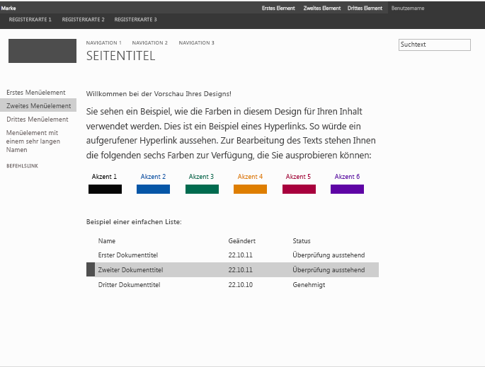

# <a name="how-to-create-a-master-page-preview-file-in-sharepoint"></a><span data-ttu-id="d7cf5-102">Gewusst wie: Erstellen einer Gestaltungsvorlagen-Vorschaudatei in SharePoint</span><span class="sxs-lookup"><span data-stu-id="d7cf5-102">How to: Create a master page preview file in SharePoint</span></span>
<span data-ttu-id="d7cf5-p101">Informationen zum Erstellen von Gestaltungsvorlagen-Vorschaudateien, die auf der SharePoint-Designoberfläche verwendet werden, um eine Vorschau ausgewählter Designkomponenten anzuzeigen. Der Assistent **Aussehen ändern** bietet den Einstiegspunkt in die Designoberfläche von SharePoint. Die Design Gallery ist die erste Seite im Assistenten **Aussehen ändern**. Sie enthält eine Miniaturansicht sämtlicher verfügbarer Designs. Benutzer wählen ein Design für ihre Website aus und können dieses dann auf der nächsten Seite anpassen. Anschließend können Benutzer eine Vorschau der Website anzeigen, bevor sie das Design auf ihre Website anwenden. Die Gestaltungsvorlagen-Vorschaudatei wird zur Generierung der Miniaturansichten und der Vorschaubilder verwendet. Wenn eine Gestaltungsvorlage nicht über eine zugehörige Vorschaudatei verfügt, kann sie nicht auf der Designoberfläche verwendet werden.</span><span class="sxs-lookup"><span data-stu-id="d7cf5-p101">Learn how to create master page preview files that are used in the SharePoint theming experience to display a preview of selected theme components. The **Change the look** wizard is the entry point to the SharePoint theming experience. The design gallery is the first page in the **Change the look** wizard and shows a thumbnail view of available designs. Users select a design for their site and then continue to the next page where they can customize the design. Users can then preview the site before applying the design to their site. The master page preview file is used to generate the thumbnail and preview images. If a master page does not have a corresponding preview file, it cannot be used in the theming experience.</span></span>
  
    
    

<span data-ttu-id="d7cf5-110">Weitere Informationen finden Sie unter  [Übersicht über Designs für SharePoint](themes-overview-for-sharepoint.md).</span><span class="sxs-lookup"><span data-stu-id="d7cf5-110">For more information, see  [Themes overview for SharePoint](themes-overview-for-sharepoint.md).</span></span>
## <a name="core-concepts-to-know-for-working-with-master-page-preview-files"></a><span data-ttu-id="d7cf5-111">Kernkonzepte für die Verwendung von Gestaltungsvorlagen-Vorschaudateien</span><span class="sxs-lookup"><span data-stu-id="d7cf5-111">Core concepts to know for working with master page preview files</span></span>
<span data-ttu-id="d7cf5-112"><a name="Introduction"> </a></span><span class="sxs-lookup"><span data-stu-id="d7cf5-112"></span></span>

<span data-ttu-id="d7cf5-113">Tabelle 1 enthält Artikel, die die Kernkonzepte für die Verwendung von Gestaltungsvorlagen-Vorschaudateien erläutern.</span><span class="sxs-lookup"><span data-stu-id="d7cf5-113">Table 1 lists articles that can help you understand the core concepts for working with master page preview files.</span></span>
  
    
    

<span data-ttu-id="d7cf5-114">**Tabelle 1. Kernkonzepte für die Verwendung von Gestaltungsvorlagen-Vorschaudateien**</span><span class="sxs-lookup"><span data-stu-id="d7cf5-114">**Table 1. Core concepts for working with master page preview files**</span></span>


|<span data-ttu-id="d7cf5-115">**Titel des Artikels**</span><span class="sxs-lookup"><span data-stu-id="d7cf5-115">**Article Title**</span></span>|<span data-ttu-id="d7cf5-116">**Beschreibung**</span><span class="sxs-lookup"><span data-stu-id="d7cf5-116">**Description**</span></span>|
|:-----|:-----|
| [<span data-ttu-id="d7cf5-117">Übersicht über Designs für SharePoint</span><span class="sxs-lookup"><span data-stu-id="d7cf5-117">Themes overview for SharePoint</span></span>](themes-overview-for-sharepoint.md) <br/> |<span data-ttu-id="d7cf5-118">Informationen zur Designoberfläche in SharePoint.</span><span class="sxs-lookup"><span data-stu-id="d7cf5-118">Learn about the theming experience in SharePoint.</span></span>  <br/> |
| [<span data-ttu-id="d7cf5-119">Auswählen eines Designs für Ihre Veröffentlichungswebsite</span><span class="sxs-lookup"><span data-stu-id="d7cf5-119">Choose a theme for your publishing site</span></span>](http://office.microsoft.com/en-us/office365-sharepoint-online-enterprise-help/choose-a-theme-for-your-publishing-site-HA102891580.aspx) <br/> |<span data-ttu-id="d7cf5-120">Erfahren Sie, wie Sie das Aussehen und Verhalten einer SharePoint-Website mithilfe des Assistenten **Aussehen ändern** ändern können.</span><span class="sxs-lookup"><span data-stu-id="d7cf5-120">Learn how to change the look and feel of a SharePoint site by using the **Change the look** wizard.</span></span> <br/> |
   

## <a name="what-is-a-master-page-preview-file"></a><span data-ttu-id="d7cf5-121">Was ist eine Gestaltungsvorlagen-Vorschaudatei?</span><span class="sxs-lookup"><span data-stu-id="d7cf5-121">What is a master page preview file?</span></span>
<span data-ttu-id="d7cf5-122"><a name="section1"> </a></span><span class="sxs-lookup"><span data-stu-id="d7cf5-122"></span></span>

<span data-ttu-id="d7cf5-123">Vorschaudateien für Masterseiten (.preview-Dateien) sind speziell formatierte Dateien mit Abschnitten für die Standardfarbpalette, das Standardschriftartenschema, die Token-CSS sowie die Token-HTML.</span><span class="sxs-lookup"><span data-stu-id="d7cf5-123">Master page preview files (.preview files) are specially formatted files that have sections for default color palette, default font scheme, tokenized CSS, and tokenized HTML.</span></span> <span data-ttu-id="d7cf5-124">Die Vorschaudatei für die Masterseite muss denselben Namen (ohne Erweiterung) wie die entsprechende Masterseite verwenden.</span><span class="sxs-lookup"><span data-stu-id="d7cf5-124">The master page preview file must use the same name (excluding the extension) as the corresponding master page.</span></span> <span data-ttu-id="d7cf5-125">Wenn Sie eine beispielsweise eine Masterseite mit dem Namen „article.master“ haben, weist die entsprechende Vorschaudatei der Masterseite den Namen „article.preview“ auf.</span><span class="sxs-lookup"><span data-stu-id="d7cf5-125">For example, if you have a master page named article.master, the corresponding master page preview file is named article.preview.</span></span> <span data-ttu-id="d7cf5-126">Masterseiten und Vorschauen für Masterseiten werden im Masterseitenkatalog gespeichert.</span><span class="sxs-lookup"><span data-stu-id="d7cf5-126">Master pages and master page previews are stored in the Master Page Gallery.</span></span>
  
    
    
<span data-ttu-id="d7cf5-127">Eine Vorschaudatei für eine Masterseite weist die folgende Struktur auf:</span><span class="sxs-lookup"><span data-stu-id="d7cf5-127">A master page preview file has the following structure:</span></span>
  
    
    


```HTML
Default color palette
[SECTION]
Default font scheme
[SECTION]
CSS
[SECTION]
HTML
```

<span data-ttu-id="d7cf5-128">In der Gestaltungsvorlagenkatalog-Vorschaudatei:</span><span class="sxs-lookup"><span data-stu-id="d7cf5-128">In the master page preview file:</span></span>
  
    
    

-  <span data-ttu-id="d7cf5-p103">_Standardfarbpalette_ ist die SPCOLOR-Datei im Designkatalog (http:// _SiteColltionName_/_catalogs/theme/15/), die Sie als Standard verwenden möchten. Die Standardfarbpalette entspricht den Farben, die in der Standardeinstellung in der Gestaltungsvorlage verwendet werden. Das heißt, bevor ein Benutzer eine Farbpalette im Assistenten **Aussehen ändern** ausgewählt hat.</span><span class="sxs-lookup"><span data-stu-id="d7cf5-p103">_Default color palette_ is the .spcolor file in the Theme Gallery (http:// _SiteColltionName_/_catalogs/theme/15/) that you want to use as the default. The default color palette corresponds to the colors that are used in the master page in its default state. That is, before a user has selected a color palette in the **Change the look** wizard.</span></span>
    
  
-  <span data-ttu-id="d7cf5-p104">_Standardschriftartenschema_ ist die SPFONT-Datei im Designkatalog (http:// _SiteCollectionName_/_catalogs/theme/15/), die Sie als Standard verwenden möchten. Das Standardschriftartenschema entspricht den Schriftarten, die in der Standardeinstellung in der Gestaltungsvorlage verwendet werden. Das heißt, bevor ein Benutzer ein Schriftartenschema im Assistenten **Aussehen ändern** ausgewählt hat.</span><span class="sxs-lookup"><span data-stu-id="d7cf5-p104">_Default font scheme_ is the .spfont file in the Theme Gallery (http:// _SiteCollectionName_/_catalogs/theme/15/) that you want to use as the default. The default font scheme corresponds to the fonts that are used in the master page in its default state. That is, before a user has selected a font scheme in the **Change the look** wizard.</span></span>
    
  
-  <span data-ttu-id="d7cf5-p105">_CSS_ ist der Abschnitt, der Cascading Stylesheets (CSS) enthält. Allen CSS-Klassen muss[ID] vorangestellt werden. Das folgende Beispiel zeigt einen Teil des CSS-Abschnitts in einer Gestaltungsvorlagen-Vorschaudatei.</span><span class="sxs-lookup"><span data-stu-id="d7cf5-p105">_CSS_ is the section that contains cascading style sheets (CSS). All CSS classes must be prefixed with[ID]. The following example shows a portion of the CSS section in a master page preview file.</span></span>
    
```
  
[ID] #dgp-pageContainer
{
    background-color: [T_THEME_COLOR_PAGEBACKGROUND];
    color: [T_THEME_COLOR_BODYTEXT];
    width: 100%;
    height:100%;     
    background-image: url('[T_IMAGE]');       
    background-size: cover;
    font-family: [T_BODY_FONT];   
}
```

-  <span data-ttu-id="d7cf5-138">_HTML_ ist der HTML-Abschnitt, der die HTML-Struktur der Vorschau definiert.</span><span class="sxs-lookup"><span data-stu-id="d7cf5-138">_HTML_ is the HTML section that defines the HTML structure of the preview.</span></span>
    
  

> <span data-ttu-id="d7cf5-139">**Hinweis:** Alle Dimensionswerte sollten als relative Einheiten in der Vorschaudatei der Masterseite angegeben werden.</span><span class="sxs-lookup"><span data-stu-id="d7cf5-139">**Note:** All dimension values should be specified as relative units in the master page preview file.</span></span> <span data-ttu-id="d7cf5-140">Beispielsweise können Dimensionswerte als Prozentsatz oder als em-Maßeinheit angegeben werden.</span><span class="sxs-lookup"><span data-stu-id="d7cf5-140">For example, dimension values can be specified as a percent or as an em measurement.</span></span> <span data-ttu-id="d7cf5-141">Weitere Informationen zu em-Maßeinheiten finden Sie im Abschnitt [5.1.1. Font-relative lengths: the 'em', 'ex', 'ch', 'rem' units](http://www.w3.org/TR/2012/WD-css3-values-20120308/#font-relative-lengths) im Arbeitsentwurf „W3C CSS Values and Units Module Level 3“.</span><span class="sxs-lookup"><span data-stu-id="d7cf5-141">Note All dimension values should be specified as relative units in the master page preview file. For example, dimension values can be specified as a percent or as an em measurement. For more information about em measurements, see section  [5.1.1. Font-relative lengths: the 'em', 'ex', 'ch', 'rem' units](http://www.w3.org/TR/2012/WD-css3-values-20120308/#font-relative-lengths) in the W3C CSS Values and Units Module Level 3 Working Draft.</span></span>
  
    
    

<span data-ttu-id="d7cf5-p107">Token werden in der gesamten Gestaltungsvorlagen-Vorschaudatei verwendet. Token sind Zeichenfolgenwerte, die in der generierten Vorschau durch Text, Farbwerte oder Schriftartenwerte ersetzt werden. In den folgenden Abschnitten werden die verfügbaren Token und deren Verwendung beschrieben.</span><span class="sxs-lookup"><span data-stu-id="d7cf5-p107">Tokens are used throughout the master page preview file. Tokens are string values that will be replaced with text, color values, or font values in the generated preview. The following sections describe the available tokens and how they are used.</span></span>
  
    
    

### <a name="miscellaneous-tokens"></a><span data-ttu-id="d7cf5-145">Verschiedene Token</span><span class="sxs-lookup"><span data-stu-id="d7cf5-145">Miscellaneous tokens</span></span>

<span data-ttu-id="d7cf5-146">Die verschiedenen Token werden in der Vorschau durch die angegebenen Höhen- und Breitenwerte ersetzt.</span><span class="sxs-lookup"><span data-stu-id="d7cf5-146">The miscellaneous tokens are replaced with specified height and width values in the preview.</span></span>
  
    
    

<span data-ttu-id="d7cf5-147">**Tabelle 2. Verschiedene Token**</span><span class="sxs-lookup"><span data-stu-id="d7cf5-147">**Table 2. Miscellaneous tokens**</span></span>


|<span data-ttu-id="d7cf5-148">**Tokenname**</span><span class="sxs-lookup"><span data-stu-id="d7cf5-148">**Token Name**</span></span>|<span data-ttu-id="d7cf5-149">**Beschreibung**</span><span class="sxs-lookup"><span data-stu-id="d7cf5-149">**Description**</span></span>|
|:-----|:-----|
|<span data-ttu-id="d7cf5-150">[T_HEIGHT]</span><span class="sxs-lookup"><span data-stu-id="d7cf5-150">[T_HEIGHT]</span></span>  <br/> |<span data-ttu-id="d7cf5-151">Die Höhe der Vorschau.</span><span class="sxs-lookup"><span data-stu-id="d7cf5-151">The height of the preview.</span></span>  <br/> |
|<span data-ttu-id="d7cf5-152">[T_WIDTH]</span><span class="sxs-lookup"><span data-stu-id="d7cf5-152">[T_WIDTH]</span></span>  <br/> |<span data-ttu-id="d7cf5-153">Die Breite der Vorschau.</span><span class="sxs-lookup"><span data-stu-id="d7cf5-153">The width of the preview.</span></span>  <br/> |
|<span data-ttu-id="d7cf5-154">[T_IMAGE]</span><span class="sxs-lookup"><span data-stu-id="d7cf5-154">[T_IMAGE]</span></span>  <br/> |<span data-ttu-id="d7cf5-155">Die URL eines optionalen Hintergrundbilds.</span><span class="sxs-lookup"><span data-stu-id="d7cf5-155">The URL of an optional background image.</span></span>  <br/> |
|<span data-ttu-id="d7cf5-156">[T_IMGHEIGHT]</span><span class="sxs-lookup"><span data-stu-id="d7cf5-156">[T_IMGHEIGHT]</span></span>  <br/> |<span data-ttu-id="d7cf5-157">Ggf. die Höhe des Bilds.</span><span class="sxs-lookup"><span data-stu-id="d7cf5-157">The height of the image, if needed.</span></span>  <br/> |
|<span data-ttu-id="d7cf5-158">[T_IMGWIDTH]</span><span class="sxs-lookup"><span data-stu-id="d7cf5-158">[T_IMGWIDTH]</span></span>  <br/> |<span data-ttu-id="d7cf5-159">Ggf. die Breite des Bilds.</span><span class="sxs-lookup"><span data-stu-id="d7cf5-159">The width of the image, if needed.</span></span>  <br/> |
   

### <a name="color-tokens"></a><span data-ttu-id="d7cf5-160">Farbtoken</span><span class="sxs-lookup"><span data-stu-id="d7cf5-160">Color tokens</span></span>

<span data-ttu-id="d7cf5-p108">Farbtoken werden im Vorschaubild durch Farbwerte ersetzt. In Tabelle 3 werden zwei Formate für Farbtoken beschrieben. Ersetzen Sie  _ColorSlot_ durch den Anmerkungsnamen des Farbplatzes. Die Farbtoken müssen in Großbuchstaben angeben werden (z. B. [T_THEME_COLOR_PAGEBACKGROUND]). Die Liste der verfügbaren Farbtoken finden Sie im Abschnitt [Zuordnen von Farbplätzen](color-palettes-and-fonts-in-sharepoint.md#colorSlots) in [Farbpaletten und Schriftarten in SharePoint](color-palettes-and-fonts-in-sharepoint.md).</span><span class="sxs-lookup"><span data-stu-id="d7cf5-p108">Color tokens are replaced with color values in the preview image. Table 3 describes two formats for color tokens. Replace  _ColorSlot_ with the annotation name of the color slot. The color tokens must be uppercase (for example, [T_THEME_COLOR_PAGEBACKGROUND]). To see the list of available color tokens, see the [Color slot mapping](color-palettes-and-fonts-in-sharepoint.md#colorSlots) section in [Color palettes and fonts in SharePoint](color-palettes-and-fonts-in-sharepoint.md).</span></span>
  
    
    

<span data-ttu-id="d7cf5-166">**Tabelle 3. Farbtoken**</span><span class="sxs-lookup"><span data-stu-id="d7cf5-166">**Table 3. Color tokens**</span></span>


|<span data-ttu-id="d7cf5-167">**Tokenname**</span><span class="sxs-lookup"><span data-stu-id="d7cf5-167">**Token Name**</span></span>|<span data-ttu-id="d7cf5-168">**Beschreibung**</span><span class="sxs-lookup"><span data-stu-id="d7cf5-168">**Description**</span></span>|
|:-----|:-----|
|<span data-ttu-id="d7cf5-169">[T_THEME_COLOR_ _ColorSlot_]</span><span class="sxs-lookup"><span data-stu-id="d7cf5-169">[T_THEME_COLOR_ _ColorSlot_]</span></span>  <br/> |<span data-ttu-id="d7cf5-170">Verwenden Sie dieses Format, wenn Sie den Farbwert für den Farbplatz benötigen.</span><span class="sxs-lookup"><span data-stu-id="d7cf5-170">Use this format if you want the color value of the color slot.</span></span>  <br/> |
|<span data-ttu-id="d7cf5-171">[T_THEME_COLOR_ _ColorSlot__AA]</span><span class="sxs-lookup"><span data-stu-id="d7cf5-171">[T_THEME_COLOR_ _ColorSlot__AA]</span></span>  <br/> |<span data-ttu-id="d7cf5-p109">Verwenden Sie dieses Format, wenn Sie den 8-stelligen Hexadezimalwert des Farbplatzes benötigen. Dieses Format ist nützlich für Filterwerte, um Deckkraft und Farbverläufe in Internet Explorer zu aktivieren.</span><span class="sxs-lookup"><span data-stu-id="d7cf5-p109">Use this format if you want the 8-digit hexadecimal value of the color slot. This format is useful for filter values to enable opacity and gradients in Internet Explorer.</span></span>  <br/> |
   

### <a name="font-tokens"></a><span data-ttu-id="d7cf5-174">Schriftarttoken</span><span class="sxs-lookup"><span data-stu-id="d7cf5-174">Font tokens</span></span>

<span data-ttu-id="d7cf5-175">Die Schriftarttoken werden im Vorschaubild durch Schriftartenwerte ersetzt.</span><span class="sxs-lookup"><span data-stu-id="d7cf5-175">The font tokens are replaced with font values in the preview image.</span></span>
  
    
    

- <span data-ttu-id="d7cf5-176">[T_ _SlotName__FONT]</span><span class="sxs-lookup"><span data-stu-id="d7cf5-176">[T_ _SlotName__FONT]</span></span>
    
  
<span data-ttu-id="d7cf5-p110">Ersetzen Sie  _SlotName_ durch den Namen des Schriftartenplatzes. Die Schriftarttoken müssen in Großbuchstaben angegeben werden (z. B. [T_BODY_FONT]). Die Liste der Schriftartenplätze und ihre Verwendung auf einer Seite finden Sie im Abschnitt [Schriftartenplätze](color-palettes-and-fonts-in-sharepoint.md#fontSlot) in [Farbpaletten und Schriftarten in SharePoint](color-palettes-and-fonts-in-sharepoint.md).</span><span class="sxs-lookup"><span data-stu-id="d7cf5-p110">Replace  _SlotName_ with the name of the font slot. The font tokens must be uppercase (for example, [T_BODY_FONT]).To see the list of font slots and where they are used in a page, see the [Font slots](color-palettes-and-fonts-in-sharepoint.md#fontSlot) section in [Color palettes and fonts in SharePoint](color-palettes-and-fonts-in-sharepoint.md).</span></span>
  
    
    

### <a name="text-content-tokens"></a><span data-ttu-id="d7cf5-179">Textinhaltstoken</span><span class="sxs-lookup"><span data-stu-id="d7cf5-179">Text content tokens</span></span>

<span data-ttu-id="d7cf5-p111">Die in Tabelle 4 aufgeführten Token werden im HTML-Abschnitt der Gestaltungsvorlagen-Vorschaudatei verwendet. Die Token werden im Vorschaubild in der Design Gallery durch Beispieltext ersetzt. Der Beispieltext wird in der gleichen Sprache wie der Rest der Website angezeigt.</span><span class="sxs-lookup"><span data-stu-id="d7cf5-p111">The tokens listed in Table 4 are used in the HTML section of the master page preview file. The tokens are replaced with sample text in the preview image in the design gallery. The sample text is shown in the same language as the rest of the site.</span></span>
  
    
    

<span data-ttu-id="d7cf5-183">**Tabelle 4. Textinhaltstoken**</span><span class="sxs-lookup"><span data-stu-id="d7cf5-183">**Table 4. Text content tokens**</span></span>


|<span data-ttu-id="d7cf5-184">**Tokenname**</span><span class="sxs-lookup"><span data-stu-id="d7cf5-184">**Token Name**</span></span>|<span data-ttu-id="d7cf5-185">**Beschreibung**</span><span class="sxs-lookup"><span data-stu-id="d7cf5-185">**Description**</span></span>|
|:-----|:-----|
|<span data-ttu-id="d7cf5-186">[BRANDSTRING]</span><span class="sxs-lookup"><span data-stu-id="d7cf5-186">[BRANDSTRING]</span></span>  <br/> |<span data-ttu-id="d7cf5-p112">Der Markentext, der auf der Seite angezeigt wird. In den vorinstallierten Designs wird er in der linken oberen Ecke als "Marke" angezeigt.</span><span class="sxs-lookup"><span data-stu-id="d7cf5-p112">The brand text that appears on the page. In the preinstalled themes, it appears on the top-left corner "Brand".</span></span>  <br/> |
|<span data-ttu-id="d7cf5-189">[SUITELINK1]</span><span class="sxs-lookup"><span data-stu-id="d7cf5-189">[SUITELINK1]</span></span>  <br/> <span data-ttu-id="d7cf5-190">[SUITELINK2]</span><span class="sxs-lookup"><span data-stu-id="d7cf5-190">[SUITELINK2]</span></span>  <br/> <span data-ttu-id="d7cf5-191">[SUITELINK3]</span><span class="sxs-lookup"><span data-stu-id="d7cf5-191">[SUITELINK3]</span></span>  <br/> |<span data-ttu-id="d7cf5-p113">Die Suitenlinks, die in der Suitenleiste angezeigt werden. Siehe "Erstes Element", "Zweites Element", "Drittes Element" in Abbildung 1.</span><span class="sxs-lookup"><span data-stu-id="d7cf5-p113">The suite links that appear in the suite bar. See "First Item", "Second Item", "Third Item" in Figure 1.</span></span>  <br/> |
|<span data-ttu-id="d7cf5-194">[WELCOME]</span><span class="sxs-lookup"><span data-stu-id="d7cf5-194">[WELCOME]</span></span>  <br/> |<span data-ttu-id="d7cf5-p114">Der Benutzernamentext. Siehe "Benutzername" in Abbildung 1.</span><span class="sxs-lookup"><span data-stu-id="d7cf5-p114">The user name text. See "User Name" in Figure 1.</span></span>  <br/> |
|<span data-ttu-id="d7cf5-197">[RIBBONTAB1]</span><span class="sxs-lookup"><span data-stu-id="d7cf5-197">[RIBBONTAB1]</span></span>  <br/> <span data-ttu-id="d7cf5-198">[RIBBONTAB2]</span><span class="sxs-lookup"><span data-stu-id="d7cf5-198">[RIBBONTAB2]</span></span>  <br/> <span data-ttu-id="d7cf5-199">[RIBBONTAB3]</span><span class="sxs-lookup"><span data-stu-id="d7cf5-199">[RIBBONTAB3]</span></span>  <br/> |<span data-ttu-id="d7cf5-p115">Die Namen der Registerkarten des Menübands. Siehe "Registerkarte 1", "Registerkarte 2", "Registerkarte 3" in Abbildung 1.</span><span class="sxs-lookup"><span data-stu-id="d7cf5-p115">The names of ribbon tabs. See "TAB 1", "TAB 2", "TAB 3" in Figure 1.</span></span>  <br/> |
|<span data-ttu-id="d7cf5-202">[SEARCHBOX]</span><span class="sxs-lookup"><span data-stu-id="d7cf5-202">[SEARCHBOX]</span></span>  <br/> |<span data-ttu-id="d7cf5-p116">Der Text im Suchfeld. Siehe "Suchtext" in Abbildung 1.</span><span class="sxs-lookup"><span data-stu-id="d7cf5-p116">The text inside the search box. See "Search text" in Figure 1.</span></span>  <br/> |
|<span data-ttu-id="d7cf5-205">[TN1]</span><span class="sxs-lookup"><span data-stu-id="d7cf5-205">[TN1]</span></span>  <br/> <span data-ttu-id="d7cf5-206">[TN2]</span><span class="sxs-lookup"><span data-stu-id="d7cf5-206">[TN2]</span></span>  <br/> <span data-ttu-id="d7cf5-207">[TN3]</span><span class="sxs-lookup"><span data-stu-id="d7cf5-207">[TN3]</span></span>  <br/> |<span data-ttu-id="d7cf5-p117">Die horizontalen Navigationselemente. "NAVIGATION 1", "NAVIGATION 2", "NAVIGATION 3".</span><span class="sxs-lookup"><span data-stu-id="d7cf5-p117">The horizontal navigation items. "NAVIGATION 1", "NAVIGATION 2", "NAVIGATION 3".</span></span>  <br/> |
|<span data-ttu-id="d7cf5-210">[TITLE]</span><span class="sxs-lookup"><span data-stu-id="d7cf5-210">[TITLE]</span></span>  <br/> |<span data-ttu-id="d7cf5-p118">Der Titel der Seite. "Seitentitel".</span><span class="sxs-lookup"><span data-stu-id="d7cf5-p118">The page title. "Page Title".</span></span>  <br/> |
|<span data-ttu-id="d7cf5-213">[QL1]</span><span class="sxs-lookup"><span data-stu-id="d7cf5-213">[QL1]</span></span>  <br/> <span data-ttu-id="d7cf5-214">[QL2]</span><span class="sxs-lookup"><span data-stu-id="d7cf5-214">[QL2]</span></span>  <br/> <span data-ttu-id="d7cf5-215">[QL3]</span><span class="sxs-lookup"><span data-stu-id="d7cf5-215">[QL3]</span></span>  <br/> <span data-ttu-id="d7cf5-216">[QL4]</span><span class="sxs-lookup"><span data-stu-id="d7cf5-216">[QL4]</span></span>  <br/> |<span data-ttu-id="d7cf5-p119">Die vertikalen Navigationselemente. "Erstes Menüelement", "Zweites Menüelement", "Drittes Menüelement".</span><span class="sxs-lookup"><span data-stu-id="d7cf5-p119">The vertical navigation items. "First menu item", "Second menu item", "Third menu item".</span></span>  <br/> |
|<span data-ttu-id="d7cf5-219">[QLADD]</span><span class="sxs-lookup"><span data-stu-id="d7cf5-219">[QLADD]</span></span>  <br/> |<span data-ttu-id="d7cf5-p120">Der Link unter den vertikalen Navigationselementen. Siehe "BEFEHLSLINK" in Abbildung 1.</span><span class="sxs-lookup"><span data-stu-id="d7cf5-p120">The link below the vertical navigation items. See "COMMAND LINK" in Figure 1.</span></span>  <br/> |
|<span data-ttu-id="d7cf5-222">[CA TABLE HEADER]</span><span class="sxs-lookup"><span data-stu-id="d7cf5-222">[CA TABLE HEADER]</span></span>  <br/> |<span data-ttu-id="d7cf5-p121">Die Überschrift über dem Seitentext. In Abbildung 1: "Willkommen bei der Vorschau Ihres Designs".</span><span class="sxs-lookup"><span data-stu-id="d7cf5-p121">The heading above the page text. In Figure 1, "Welcome to the preview of your theme!".</span></span>  <br/> |
|<span data-ttu-id="d7cf5-225">[CA TABLE DESCRIPTION]</span><span class="sxs-lookup"><span data-stu-id="d7cf5-225">[CA TABLE DESCRIPTION]</span></span>  <br/> |<span data-ttu-id="d7cf5-p122">Der Beschreibungstext. In Abbildung 1: "Hier sehen Sie ein Beispiel, wie die Farben in diesem Design für Ihre Inhalte verwendet werden. Dies ist ein Beispiel für…".</span><span class="sxs-lookup"><span data-stu-id="d7cf5-p122">The description text. In Figure 1, "You are looking at an example of how the colors will be used in this theme for your content. This is an example of a…".</span></span>  <br/> |
|<span data-ttu-id="d7cf5-229">[CA ACCENT COLORS]</span><span class="sxs-lookup"><span data-stu-id="d7cf5-229">[CA ACCENT COLORS]</span></span>  <br/> |<span data-ttu-id="d7cf5-230">Die Liste der Akzentfarben und -blöcke.</span><span class="sxs-lookup"><span data-stu-id="d7cf5-230">The list of accent colors and blocks.</span></span>  <br/> |
|<span data-ttu-id="d7cf5-231">[CA LIST TITLE]</span><span class="sxs-lookup"><span data-stu-id="d7cf5-231">[CA LIST TITLE]</span></span>  <br/> |<span data-ttu-id="d7cf5-p123">Die Überschrift der Liste. In Abbildung 1: "Beispiel einer Liste".</span><span class="sxs-lookup"><span data-stu-id="d7cf5-p123">The heading of the list. In Figure 1, "Example of a list".</span></span>  <br/> |
|<span data-ttu-id="d7cf5-234">[CA TABLE]</span><span class="sxs-lookup"><span data-stu-id="d7cf5-234">[CA TABLE]</span></span>  <br/> |<span data-ttu-id="d7cf5-235">Die Beispielliste.</span><span class="sxs-lookup"><span data-stu-id="d7cf5-235">The sample list.</span></span>  <br/> |
|<span data-ttu-id="d7cf5-236">[SITETITLE]</span><span class="sxs-lookup"><span data-stu-id="d7cf5-236">[SITETITLE]</span></span>  <br/> |<span data-ttu-id="d7cf5-p124">Der Titel der Website. Siehe "Websitetitel" in Abbildung 1.</span><span class="sxs-lookup"><span data-stu-id="d7cf5-p124">The title of the site. See "Site Title" in Figure 1.</span></span>  <br/> |
   

<span data-ttu-id="d7cf5-239">**Abbildung 1: Vorinstalliertes Design mit Beispieltext**</span><span class="sxs-lookup"><span data-stu-id="d7cf5-239">**Figure 1. Preinstalled theme with sample text**</span></span>

  
    
    

  
    
    

  
    
    

  
    
    

  
    
    

## <a name="create-a-master-page-preview-file"></a><span data-ttu-id="d7cf5-241">Erstellen einer Gestaltungsvorlagen-Vorschaudatei</span><span class="sxs-lookup"><span data-stu-id="d7cf5-241">Create a master page preview file</span></span>
<span data-ttu-id="d7cf5-242"><a name="section2"> </a></span><span class="sxs-lookup"><span data-stu-id="d7cf5-242"></span></span>

<span data-ttu-id="d7cf5-243">Um eine Gestaltungsvorlagen-Vorschaudatei zu erstellen, verwenden Sie eine vorhandene Gestaltungsvorlagenvorschau als Ausgangspunkt.</span><span class="sxs-lookup"><span data-stu-id="d7cf5-243">To create a master page preview file, use an existing master page preview as a starting point.</span></span>
  
    
    

### <a name="to-create-a-master-page-preview"></a><span data-ttu-id="d7cf5-244">So erstellen Sie eine Masterseiten-Vorschau</span><span class="sxs-lookup"><span data-stu-id="d7cf5-244">To create a master page preview</span></span>


1. <span data-ttu-id="d7cf5-245">Erstellen Sie eine Kopie einer Masterseiten-Vorschau.</span><span class="sxs-lookup"><span data-stu-id="d7cf5-245">Make a copy of a master page preview.</span></span> <span data-ttu-id="d7cf5-246">SharePoint enthält „oslo.preview“ und „seattle.preview“.</span><span class="sxs-lookup"><span data-stu-id="d7cf5-246">SharePoint includes oslo.preview and seattle.preview.</span></span>
    
  
2. <span data-ttu-id="d7cf5-247">Benennen Sie die Kopie der Masterseiten-Vorschau so um, dass diese der entsprechenden Masterseite entspricht.</span><span class="sxs-lookup"><span data-stu-id="d7cf5-247">Rename the copy of the master page preview to match its corresponding master page.</span></span> <span data-ttu-id="d7cf5-248">Wenn die Masterseite beispielsweise „article.master“ benannt wird, benennen Sie die Masterseiten-Vorschau in „article.preview“ um.</span><span class="sxs-lookup"><span data-stu-id="d7cf5-248">For example, if your master page is named article.master, rename the master page preview article.preview.</span></span>
    
  
3. <span data-ttu-id="d7cf5-p127">Verwenden Sie einen HTML-Editor, um die Gestaltungsvorlagen-Vorschaudatei zu bearbeiten. Aktualisieren Sie die Datei, um das Layout und die Darstellung der Gestaltungsvorlage wiederzugeben.</span><span class="sxs-lookup"><span data-stu-id="d7cf5-p127">Use an HTML editor to edit the master page preview file. Update the file to reflect the layout and appearance of your master page.</span></span>
    
    > <span data-ttu-id="d7cf5-251">**Tipp:** Dimensionswerte werden in der Vorschaudatei für die Masterseite als Prozentsätze angegeben.</span><span class="sxs-lookup"><span data-stu-id="d7cf5-251">**Tip:** Dimension values are specified as percentages in the master page preview file.</span></span> <span data-ttu-id="d7cf5-252">Im folgenden Beispiel ist eine Methode zum Konvertieren einer absoluten Maßeinheit (Pixel) in eine relative Maßeinheit (Prozentsatz) angegeben.</span><span class="sxs-lookup"><span data-stu-id="d7cf5-252">The following example shows one method for converting an absolute measurement (pixels) into a relative measurement (percentage).</span></span> <span data-ttu-id="d7cf5-253">Angenommen, Sie haben einen Browser in der Größe 1024x768.</span><span class="sxs-lookup"><span data-stu-id="d7cf5-253">Assume you have a browser size of 1024x768.</span></span> <span data-ttu-id="d7cf5-254">Wenn die Masterseite eine Elementhöhe von 32 Pixel aufweist und das übergeordnete Element der Textkörper der Seite ist, berechnen Sie den Prozentsatz, indem Sie die Elementhöhe durch die Browserhöhe dividieren.</span><span class="sxs-lookup"><span data-stu-id="d7cf5-254">TIP Dimension values are specified as percentages in the master page preview file. The following example shows one method for converting an absolute measurement (pixels) into a relative measurement (percentage). Assume you have a browser size of 1024x768. If the master page has an element height of 32 pixels and the parent element is the body of the page, you calculate the percentage by dividing the element height by the browser height. The relative measurement is 4%(32/768).</span></span> <span data-ttu-id="d7cf5-255">Die relativeMaßeinheit beträgt 4 % (32/768).</span><span class="sxs-lookup"><span data-stu-id="d7cf5-255">The relative measurement is 4%(32/768).</span></span> 
4. <span data-ttu-id="d7cf5-256">Laden Sie die Vorschaudatei der Masterseite in den Masterseitenkatalog hoch.</span><span class="sxs-lookup"><span data-stu-id="d7cf5-256">Upload the master page preview file to the Master Page Gallery.</span></span>
    
  
5. <span data-ttu-id="d7cf5-257">Verwenden Sie den Assistenten **Erscheinungsbild ändern**, um die Vorschau der Masterseite mit Ihrem Websiteinhalt zu testen.</span><span class="sxs-lookup"><span data-stu-id="d7cf5-257">Use the **Change the look** wizard to test the master page preview with your site content.</span></span>
    
    > <span data-ttu-id="d7cf5-258">**Hinweis:** Sie können auch ein Design erstellen, das die neue Masterseite verwendet, indem Sie der Liste „Zusammengesetzte Designs“ ein Element hinzufügen.</span><span class="sxs-lookup"><span data-stu-id="d7cf5-258">**Note:** You can also create a design that uses the new master page by adding an item to the Composed Looks list.</span></span> <span data-ttu-id="d7cf5-259">Das Design steht in der Design Gallery (die erste Seite des Assistenten **Erscheinungsbild ändern**) zur Verfügung.</span><span class="sxs-lookup"><span data-stu-id="d7cf5-259">The design will be available in the design gallery (the first page of the **Change the look** wizard).</span></span> <span data-ttu-id="d7cf5-260">Weitere Informationen finden Sie im Verfahren[Bereitstellen eines Designs mithilfe der Benutzeroberfläche](how-to-deploy-a-custom-theme-in-sharepoint.md#section2) in [Vorgehensweise: Bereitstellen eines benutzerdefinierten Designs in SharePoint](how-to-deploy-a-custom-theme-in-sharepoint.md).</span><span class="sxs-lookup"><span data-stu-id="d7cf5-260">For more information, see the [Deploy a theme by using the user interface](how-to-deploy-a-custom-theme-in-sharepoint.md#section2) procedure in [How to: Deploy a custom theme in SharePoint](how-to-deploy-a-custom-theme-in-sharepoint.md).</span></span> 
6. <span data-ttu-id="d7cf5-261">Wiederholen Sie die Schritte 3 bis 5, falls erforderlich.</span><span class="sxs-lookup"><span data-stu-id="d7cf5-261">Repeat steps 3 to 5, as necessary.</span></span>
    
  

## <a name="additional-resources"></a><span data-ttu-id="d7cf5-262">Zusätzliche Ressourcen</span><span class="sxs-lookup"><span data-stu-id="d7cf5-262">Additional resources</span></span>
<span data-ttu-id="d7cf5-263"><a name="bk_addresources"> </a></span><span class="sxs-lookup"><span data-stu-id="d7cf5-263"></span></span>


-  [<span data-ttu-id="d7cf5-264">Entwickeln des Website-Designs in SharePoint</span><span class="sxs-lookup"><span data-stu-id="d7cf5-264">Develop the site design in SharePoint</span></span>](develop-the-site-design-in-sharepoint.md)
    
  
-  [<span data-ttu-id="d7cf5-265">Vorgehensweise: Bereitstellen eines benutzerdefinierten Designs in SharePoint</span><span class="sxs-lookup"><span data-stu-id="d7cf5-265">How to: Deploy a custom theme in SharePoint</span></span>](how-to-deploy-a-custom-theme-in-sharepoint.md)
    
  
-  [<span data-ttu-id="d7cf5-266">Farbpaletten und Schriftarten in SharePoint</span><span class="sxs-lookup"><span data-stu-id="d7cf5-266">Color palettes and fonts in SharePoint</span></span>](color-palettes-and-fonts-in-sharepoint.md)
    
  
-  [<span data-ttu-id="d7cf5-267">SharePoint-Teamblog: Beweisen Sie Stil mit SharePoint-Designs</span><span class="sxs-lookup"><span data-stu-id="d7cf5-267">SharePoint Team Blog: Show off your style with SharePoint theming</span></span>](http://blogs.office.com/b/sharepoint/archive/2012/10/29/show-off-your-style-with-sharepoint-theming.aspx)
    
  

