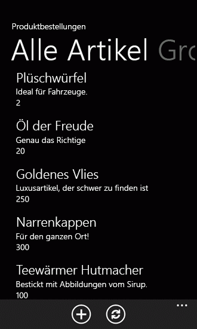

# <a name="customize-list-item-queries-and-filter-data-for-windows-phone-apps"></a><span data-ttu-id="fadf0-102">Anpassen von Listenelementabfragen und Filtern von Daten für Windows Phone-Apps</span><span class="sxs-lookup"><span data-stu-id="fadf0-102">Customize list item queries and filter data for Windows Phone apps</span></span>

<span data-ttu-id="fadf0-p101">Passen Sie die Datenabfragen an, auf denen die Ansichten in einer Windows Phone-App basieren. Mit Projekten, die aus der Vorlage für Windows Phone SharePoint List Application erstellt haben können Entwickler nutzen ein Entwurfsmuster in die Vorlage, die sie zum Anpassen von Komponenten der Datenebene für eine Windows Phone-app kann implementiert. Eine Ansicht einer SharePoint-Liste in einer Windows Phone-app enthalten, wie in der app auf dem Telefon wird und in Microsoft SharePoint Server konfiguriert werden kann, oder eine benutzerdefinierte Ansicht für die app erstellt werden.</span><span class="sxs-lookup"><span data-stu-id="fadf0-p101">Customize the data queries on which the views in a Windows Phone app are based. With projects created from the Windows Phone SharePoint List Application template, developers can take advantage of a design pattern implemented in the template that allows them to customize parts of the data layer for a Windows Phone app. A view of a SharePoint list in a Windows Phone app can be configured in Microsoft SharePoint Server and included as is in the app on the phone, or a custom view can be created for the app.</span></span>
  
    
    


> <span data-ttu-id="fadf0-106">**Wichtig:** Wenn Sie eine App für Windows Phone 8 entwickeln, müssen Sie Visual Studio Express 2012 anstelle von Visual Studio 2010 Express verwenden.</span><span class="sxs-lookup"><span data-stu-id="fadf0-106">**Important:** If you are developing an app for Windows Phone 8, you must use Visual Studio Express 2012 instead of Visual Studio 2010 Express.</span></span> <span data-ttu-id="fadf0-107">Mit Ausnahme der Entwicklungsumgebung gelten alle Informationen in diesem Artikel für das Erstellen von Apps sowohl auf Windows Phone 8 als auch auf Windows Phone 7.</span><span class="sxs-lookup"><span data-stu-id="fadf0-107">Except for the development environment, all information in this article applies to creating apps for both Windows Phone 8 and Windows Phone 7.</span></span> <span data-ttu-id="fadf0-108">Weitere Informationen finden Sie unter [Vorgehensweise: Einrichten einer Umgebung für die Entwicklung mobiler Apps für SharePoint](how-to-set-up-an-environment-for-developing-mobile-apps-for-sharepoint.md).</span><span class="sxs-lookup"><span data-stu-id="fadf0-108">> For more information, see  [How to: Set up an environment for developing mobile apps for SharePoint](how-to-set-up-an-environment-for-developing-mobile-apps-for-sharepoint.md).</span></span> 
  
    
    


## <a name="configure-list-views-on-the-server-for-use-in-windows-phone-apps"></a><span data-ttu-id="fadf0-109">Konfigurieren von Listenansichten auf dem Server für die Verwendung in Windows Phone-Apps</span><span class="sxs-lookup"><span data-stu-id="fadf0-109">Configure list views on the server for use in Windows Phone apps</span></span>
<span data-ttu-id="fadf0-110"><a name="BKMK_ConfiguringLists"> </a></span><span class="sxs-lookup"><span data-stu-id="fadf0-110"><a name="BKMK_ConfiguringLists"> </a></span></span>

<span data-ttu-id="fadf0-p103">Wenn Sie eine SharePoint-Listen-app für eine Windows Phone mithilfe der Windows Phone SharePoint List Application Vorlage erstellen, können Sie auswählen in Ihrer app enthalten alle vorhandenen Ansichten, die Ziel-SharePoint-Liste zugeordnet sind. Einer der Methoden zum Filtern von Elementen in einer SharePoint-Liste wie die Liste auf dem Telefon angezeigt wird dann ist so konfigurieren Sie eine gefilterte Ansicht für die Liste auf dem Server und dann wählen Sie diese Ansicht für die in Ihrer Windows Phone-app enthalten sein. Die Windows Phone SharePoint List Application Vorlagen-Assistent generiert eine Abfrage Collaborative Application Markup Language (CAML) für die ausgewählte Ansicht, die die filterbedingungen für die Ansicht auf dem Server konfiguriert. Sie möglicherweise, beispielsweise eine Liste auf dem Server verfügen, die auf die Listenvorlage Aufgaben basiert. Sie können eine Ansicht erstellen für die Liste mit dem Namen "Feiertag Partei", die nur Elemente im Zusammenhang mit, beispielsweise umfasst Planung einer Unternehmens Feiertag Partei durch das Hinzufügen einer filterbedingung zum Anzeigen der Listenelemente, nur, wenn das Feld Beschreibung die Wörter "Feiertag" oder "Partei" enthält. In der Windows Phone-app würde das CAML-Markup für die Ansicht generiert (je nach den Feldern, die sich entschieden, die in Ihrer app enthalten sein) wie folgt.</span><span class="sxs-lookup"><span data-stu-id="fadf0-p103">When you create a SharePoint list app for a Windows Phone by using the Windows Phone SharePoint List Application template, you can choose to include in your app any existing views that are associated with the target SharePoint list. One of the ways to filter items in a SharePoint list as the list appears on the phone, then, is to configure a filtered view for the list on the server and then to select that view to be included in your Windows Phone app. The Windows Phone SharePoint List Application template wizard generates a Collaborative Application Markup Language (CAML) query for the selected view that includes the filtering conditions configured for the view on the server. You might, for example, have a list on the server that is based on the Tasks list template. You can create a view for the list named "Holiday Party" that includes only items related to, for example, planning a company holiday party by adding a filter condition to show list items only when the Description field contains the words "holiday" or "party". In the Windows Phone app, the CAML markup generated for the view would resemble the following (depending on the fields chosen to be included in your app).</span></span>
  
    
    

```XML

<View>
    <Query>
        <Where>
            <Or>
                <Contains>
                    <FieldRef Name='Body' />
                    <Value Type='Note'>holiday</Value>
                </Contains>
                <Contains>
                    <FieldRef Name='Body' />
                    <Value Type='Note'>party</Value>
                </Contains>
            </Or>
        </Where>
    </Query>
    <RowLimit>30</RowLimit>
    <ViewFields>
        <FieldRef Name='Title'/>
        <FieldRef Name='Body'/>
        <FieldRef Name='AssignedTo'/>
        <FieldRef Name='Status'/>
        <FieldRef Name='PercentComplete'/>
        <FieldRef Name='StartDate'/>
        <FieldRef Name='DueDate'/>
        <FieldRef Name='Checkmark'/>
    </ViewFields>
</View>
```

<span data-ttu-id="fadf0-117">Wie bei anderen vorhandenen Ansichten für die Aufgabenliste, die Sie angeben, dass in Ihrer Windows Phone-app einschließen aus, wenn Sie das Projekt erstellen, wird ein **PivotItem** -Steuerelement, das der ausgewählten Ansicht entspricht dem Steuerelement **Pivot** hinzugefügt, aus denen das wichtigsten Element der Benutzeroberfläche (UI) in der app besteht.</span><span class="sxs-lookup"><span data-stu-id="fadf0-117">As with other existing views for the Tasks list that you choose to include in your Windows Phone app when you create your project, a **PivotItem** control corresponding to the chosen view is added to the **Pivot** control that constitutes the main user interface (UI) element in the app.</span></span>
  
    
    

## <a name="customize-list-view-queries-in-the-windows-phone-app"></a><span data-ttu-id="fadf0-118">Anpassen der Liste Ansicht Abfragen in der Windows Phone-app</span><span class="sxs-lookup"><span data-stu-id="fadf0-118">Customize list view queries in the Windows Phone app</span></span>
<span data-ttu-id="fadf0-119"><a name="BKMK_CustomizingLists"> </a></span><span class="sxs-lookup"><span data-stu-id="fadf0-119"><a name="BKMK_CustomizingLists"> </a></span></span>

<span data-ttu-id="fadf0-p104">Für einen oder anderen Grund möglicherweise nicht möglich oder sinnvoll sein, die Ansichten zu konfigurieren, die alle von Ihren Erfordernissen für eine bestimmte Liste auf dem Server erfüllen. In einem Microsoft Visual Studio-Projekt aus der Vorlage für Windows Phone SharePoint List Application erstellt haben sind Aspekte der was der Datenebene aufgerufen werden kann für Entwickler, hauptsächlich durch die ListDataProvider.cs-Datei des Projekts verfügbar. Sie können das CAML für eine vorhandene Ansicht definierten ändern, oder Sie können CAML-Abfragen für neue Ansichten in der Datei ListDataProvider.cs hinzufügen.</span><span class="sxs-lookup"><span data-stu-id="fadf0-p104">For one reason or another, it may not be possible or reasonable to configure views that meet all of your design needs for a given list on the server. In a Microsoft Visual Studio project created from the Windows Phone SharePoint List Application template, aspects of what may be called the data layer are made available to developers, primarily through the ListDataProvider.cs file in the project. You can modify the CAML defined for an existing view, or you can add CAML queries for new views in the ListDataProvider.cs file.</span></span>
  
    
    

### <a name="the-listdataprovidercs-file"></a><span data-ttu-id="fadf0-123">Die Datei ListDataProvider.cs</span><span class="sxs-lookup"><span data-stu-id="fadf0-123">The ListDataProvider.cs file</span></span>

<span data-ttu-id="fadf0-p105">In einem Projekt basierend auf der Vorlage Windows Phone SharePoint List Application definiert die Datei ListDataProvider.cs Objekte, die für den Zugriff und Konfigurieren einer SharePoint-Liste als Datenquelle für die Ansichten in der Windows Phone-app bereitstellen. In der Datei List.xaml, die die wichtigsten Anwendungsseite für die app definiert wird, wird ein **Pivot** -Steuerelement (selbst mit den untergeordneten **PivotItem** Steuerelementen) mit einem Ereignishandler zugewiesen an das Ereignis **LoadedPivotItem** deklariert. Die **LoadDataFromServer** -Methode in der Datei ListDataProvider.cs ist letztlich aufgerufen, wenn ein **PivotItem** -Steuerelement (die als Rendering Container für Listenelemente in der Windows Phone-app verwendet wird) auf der Seite Anwendung der app geladen wird.</span><span class="sxs-lookup"><span data-stu-id="fadf0-p105">In a project based on the Windows Phone SharePoint List Application template, the ListDataProvider.cs file defines objects that provide for accessing and configuring a SharePoint list as a data source for the views in the Windows Phone app. In the List.xaml file, which defines the main application page for the app, a **Pivot** control (itself containing the child **PivotItem** controls) is declared with an event handler assigned to its **LoadedPivotItem** event. The **LoadDataFromServer** method in the ListDataProvider.cs file is ultimately called when a **PivotItem** control (which is used as the rendering container for list items in the Windows Phone app) is loaded on the main application page of the app.</span></span>
  
    
    

1. <span data-ttu-id="fadf0-127">Die **PivotItem** einer angegebenen Listenansicht zugeordnet ist in der Benutzeroberfläche geladen.</span><span class="sxs-lookup"><span data-stu-id="fadf0-127">The **PivotItem** associated with a given list view is loaded in the UI.</span></span>
    
  
2. <span data-ttu-id="fadf0-p106">In der Datei List.xaml.cs ruft der Ereignishandler für das Ereignis **LoadedPivotItem** die **LoadData** -Methode in der Datei ListViewModel.cs implementiert übergeben Sie den Namen des Steuerelements **PivotItem**, die vollständig geladen wurde. (Zum Entwerfen von Projekten basierend auf der Vorlage Windows Phone SharePoint List Application ist der Name eines bestimmten **PivotItem** -Steuerelements auf festgelegt den Schlüsselwert für die CAML-Abfragezeichenfolge für die Ansicht in der **ViewXmls** **Dictionary** -Typ in der **CamlQueryBuilder** -Klasse in ListViewModel.cs definierten diesem Steuerelement zugeordneten identisch sein.)</span><span class="sxs-lookup"><span data-stu-id="fadf0-p106">In the List.xaml.cs file, the handler for the **LoadedPivotItem** event calls the **LoadData** method implemented in the ListViewModel.cs file, passing the name of the **PivotItem** control that has finished loading. (In the design of projects based on the Windows Phone SharePoint List Application template, the name of a given **PivotItem** control is set to be the same as the key value for the CAML query string for the view associated with that control in the **ViewXmls** **Dictionary** type defined in the **CamlQueryBuilder** class in ListViewModel.cs.)</span></span>
    
  
3. <span data-ttu-id="fadf0-130">Die **LoadData** -Methode in ListViewModel.cs Ruft die **LoadData** -Methode in der Datei ListDataProvider.cs implementiert.</span><span class="sxs-lookup"><span data-stu-id="fadf0-130">The **LoadData** method in ListViewModel.cs calls the **LoadData** method implemented in the ListDataProvider.cs file.</span></span>
    
  
4. <span data-ttu-id="fadf0-p107">Die **LoadData** -Methode in ListDataProvider.cs Ruft die **LoadDataFromServer** -Methode, die auch in der gleichen Datei implementiert. Die **LoadDataFromServer** -Methode führt dann Folgendes aus:</span><span class="sxs-lookup"><span data-stu-id="fadf0-p107">The **LoadData** method in ListDataProvider.cs calls the **LoadDataFromServer** method also implemented in that same file. The **LoadDataFromServer** method then does the following:</span></span>
    
1. <span data-ttu-id="fadf0-133">Ruft die CAML-Abfrage-Zeichenfolge einer bestimmten Ansicht zugeordnet.</span><span class="sxs-lookup"><span data-stu-id="fadf0-133">Gets the CAML query string associated with a given view.</span></span>
    
```cs
  
CamlQuery query = CamlQueryBuilder.GetCamlQuery(ViewName);
```

2. <span data-ttu-id="fadf0-134">Journale mit das Clientobjekt modellieren die Liste abgerufen werden sollen.</span><span class="sxs-lookup"><span data-stu-id="fadf0-134">Registers with the client object model the list to be retrieved.</span></span>
    
```cs
  ListItemCollection items = Context.Web.Lists.GetByTitle(ListTitle).GetItems(query);
```

3. <span data-ttu-id="fadf0-135">Zeigt das Clientobjektmodell, dass die Listenelemente und den Feldern des diese Listenelemente (als Textwerte) zurückgegeben werden soll.</span><span class="sxs-lookup"><span data-stu-id="fadf0-135">Indicates to the client object model that it should return the list items and the fields of those list items (as text values).</span></span>
    
```cs
  Context.Load(items);
Context.Load(items, listItems => listItems.Include(item => item.FieldValuesAsText));
```

4. <span data-ttu-id="fadf0-136">Ruft die **ExecuteQueryAsync** zum Senden von Anfragen an SharePoint Server und die Daten (asynchron) abzurufen.</span><span class="sxs-lookup"><span data-stu-id="fadf0-136">Calls **ExecuteQueryAsync** to send the requests to SharePoint Server and retrieve the data (asynchronously).</span></span>
    
  

  
    
    

## <a name="add-a-custom-list-view-query-and-corresponding-ui-elements"></a><span data-ttu-id="fadf0-137">Hinzufügen einer benutzerdefinierten listenansichtsabfrage und der entsprechenden Benutzeroberfläche Elemente</span><span class="sxs-lookup"><span data-stu-id="fadf0-137">Add a custom list view query and corresponding UI elements</span></span>
<span data-ttu-id="fadf0-138"><a name="BKMK_AddingCustomizations"> </a></span><span class="sxs-lookup"><span data-stu-id="fadf0-138"><a name="BKMK_AddingCustomizations"> </a></span></span>

<span data-ttu-id="fadf0-139">In eigene Projekte können Sie die Art und Weise nutzen, die die Datenebene entwickelt wurde, um Ihre eigenen benutzerdefinierten CAML-Abfragezeichenfolgen und Listenansichten hinzuzufügen.</span><span class="sxs-lookup"><span data-stu-id="fadf0-139">In your own projects, you can take advantage of the way the data layer is designed to add your own custom CAML query strings and list views.</span></span>
  
    
    
<span data-ttu-id="fadf0-140">Gehen Sie beim folgenden Codebeispiel erneut davon aus, dass die Zielinstallation von SharePoint Server über eine Liste „Product Orders“ verfügt, die aus der Vorlage „Benutzerdefinierte Liste“ erstellt wurde und mit den in Tabelle 1 des Themas [Vorgehensweise: Implementieren von Geschäftslogik und Datenüberprüfung in einer Windows Phone-App für SharePoint](how-to-implement-business-logic-and-data-validation-in-a-windows-phone-app-for-s.md) angegebenen Feldern und Typen konfiguriert ist.</span><span class="sxs-lookup"><span data-stu-id="fadf0-140">For the following code sample, assume again that the target installation of SharePoint Server has a Product Orders list created from the Custom List template, configured with the fields and types indicated in Table 1 in the topic  [How to: Implement business logic and data validation in a Windows Phone app for SharePoint](how-to-implement-business-logic-and-data-validation-in-a-windows-phone-app-for-s.md).</span></span> <span data-ttu-id="fadf0-141">Erstellen Sie ein Projekt auf Basis der Vorlage „Windows Phone - SharePoint-Listenanwendung“, die eine Liste wie die Liste „Product Orders“ als Quelle verwendet (entsprechend der Beschreibung in [Vorgehensweise: Erstellen einer Windows Phone SharePoint-Listen-App](how-to-create-a-windows-phone-sharepoint-list-app.md)).</span><span class="sxs-lookup"><span data-stu-id="fadf0-141">Create a project based on the Windows Phone SharePoint List Application template that uses a list like the Product Orders list as a source (as described in  [How to: Create a Windows Phone SharePoint list app](how-to-create-a-windows-phone-sharepoint-list-app.md)).</span></span> <span data-ttu-id="fadf0-142">Für die Zwecke dieses Beispiels fügen wir eine benutzerdefinierte Ansicht zur Windows Phone-App hinzu (nicht zur Liste auf server.md), die so gefiltert ist, dass nur die Produktbestellungen mit einer Bestellmenge von 100 oder mehr angezeigt werden.</span><span class="sxs-lookup"><span data-stu-id="fadf0-142">For the purposes of this example, we add a custom view to the Windows Phone app (not to the list on the server.md) that is filtered to display only those product orders in which the quantity ordered is 100 or more.</span></span>
  
    
    

### <a name="to-add-a-custom-query-and-view"></a><span data-ttu-id="fadf0-143">So fügen Sie eine benutzerdefinierte Abfrage und Ansicht hinzu</span><span class="sxs-lookup"><span data-stu-id="fadf0-143">To add a custom query and view</span></span>


1. <span data-ttu-id="fadf0-144">Klicken Sie im **Projektmappen-Explorer** Doppelklicken Sie auf die Datei ListDataProvider.cs (oder wählen Sie die Datei und drücken SieF7) die Datei zur Bearbeitung geöffnet.</span><span class="sxs-lookup"><span data-stu-id="fadf0-144">In **Solution Explorer**, double-click the ListDataProvider.cs file (or choose the file and press F7) to open the file for editing.</span></span>
    
  
2. <span data-ttu-id="fadf0-145">Aktualisieren Sie die Definition der **ViewXmls** **Dictionary** -Typ in der statischen **CamlQueryBuilder** -Klasse, die eine zusätzliche CAML-Abfrage mit einer WHERE-Klausel legt die entsprechende Filtern Bedingung enthalten.</span><span class="sxs-lookup"><span data-stu-id="fadf0-145">Update the definition of the **ViewXmls** **Dictionary** type in the static **CamlQueryBuilder** class to include an additional CAML query, with a WHERE clause stipulating the appropriate filtering condition.</span></span>
    
```cs
  
static Dictionary<string, string> ViewXmls = new Dictionary<string, string>()
{   
    {"View1",   @"<View><Query><OrderBy><FieldRef Name='ID'/>
        </OrderBy></Query><RowLimit>30</RowLimit><ViewFields>{0}</ViewFields></View>"},
    {"View2",   @"<View><Query><OrderBy><FieldRef Name='ID' /></OrderBy>
     <Where><Geq><FieldRef Name='Quantity' />
          <ValueType='Number'>100</Value>
                </Geq></Where>
             </Query><RowLimit>30</RowLimit>
               <ViewFields>{0}</ViewFields></View>"}
};
```

3. <span data-ttu-id="fadf0-146">Doppelklicken Sie auf die Datei List.xaml, um die Datei zur Bearbeitung zu öffnen.</span><span class="sxs-lookup"><span data-stu-id="fadf0-146">Double-click the List.xaml file to open the file for editing.</span></span>
    
  
4. <span data-ttu-id="fadf0-p109">Hinzufügen von Markup, um eine zusätzliche untergeordnete **PivotItem** Steuerelement innerhalb des Steuerelements Hauptfenster **Pivot** definieren. Das **Grid** -Element, in dem die Elemente der Benutzeroberfläche, die die wichtigsten Anwendungsseite definieren deklariert werden, sollte dem folgenden Code ähneln.</span><span class="sxs-lookup"><span data-stu-id="fadf0-p109">Add markup to define an additional child **PivotItem** control within the main **Pivot** control. The **Grid** element in which the UI elements that define the main application page are declared should resemble the following code.</span></span>
    
```XML
  
<Grid x:Name="LayoutRoot" Background="Transparent"
 xmlns:x="http://schemas.microsoft.com/winfx/2006/xaml" 
 xmlns:controls="clr-namespace:Microsoft.Phone.Controls;assembly=Microsoft.Phone.Controls">
    <!--Pivot Control-->
    <ProgressBar x:Name="progressBar" Opacity="1" HorizontalAlignment="Center" 
     VerticalAlignment="Top" Height="30" Width="470" IsIndeterminate="{Binding IsBusy}" 
     Visibility="{Binding ShowIfBusy}" />
    <Grid x:Name="ContentPanel" Grid.Row="0" Width="470">
        <controls:Pivot Name="Views" Title="Product Orders" LoadedPivotItem="OnPivotItemLoaded">
            <!--Pivot item-->
            <controls:PivotItem Name="View1" Header="All Items">
                <!--Double line list with text wrapping-->
                <ListBox x:Name="lstBox1" Margin="0,0,-12,0" SelectionChanged="OnSelectionChanged" 
                 ItemsSource="{Binding [View1]}">
                    <ListBox.ItemTemplate>
                        <DataTemplate>
                            <StackPanel Orientation="Vertical" Margin="10">
                                <TextBlock Name="txtTitle" Text="{Binding [Title]}" 
                                 TextWrapping="NoWrap" Style="{StaticResource PhoneTextTitle2Style}" />
                                <TextBlock Name="txtDescription" Text="{Binding [Description]}" 
                                 TextWrapping="NoWrap" Style="{StaticResource PhoneTextNormalStyle}" />
                                <TextBlock Name="txtQuantity" Text="{Binding [Quantity]}" 
                                 TextWrapping="NoWrap" Style="{StaticResource PhoneTextNormalStyle}" />
                            </StackPanel>
                        </DataTemplate>
                    </ListBox.ItemTemplate>
                </ListBox>                    
            </controls:PivotItem>
            
            <!--Added PivotItem control for customized view--><controls:PivotItem Name="View2" Header="Big Orders"><!--Double line list with text wrapping--><ListBox x:Name="lstBox2" Margin="0,0,-12,0" 
                 SelectionChanged="OnSelectionChanged" ItemsSource="{Binding [View2]}"><ListBox.ItemTemplate><DataTemplate><StackPanel Orientation="Vertical" Margin="10"><TextBlock Name="txtTitle" Text="{Binding [Title]}" 
                                 TextWrapping="NoWrap" Style="{StaticResource PhoneTextTitle2Style}" /><TextBlock Name="txtDescription" Text="{Binding [Description]}" 
                                 TextWrapping="NoWrap" Style="{StaticResource PhoneTextNormalStyle}" /><TextBlock Name="txtQuantity" Text="{Binding [Quantity]}" 
                                 TextWrapping="NoWrap" Style="{StaticResource PhoneTextNormalStyle}" /></StackPanel></DataTemplate></ListBox.ItemTemplate></ListBox></controls:PivotItem>

        </controls:Pivot>
    </Grid>
</Grid>
```


    > [!NOTE]
    > In particular that the value of the **Name** attribute ("View2") of the **PivotItem** control is the same as the key value of the entry added to the **Dictionary** type defined in step 2. This value is used to identify the appropriate CAML query to use to retrieve the data to be displayed in the **PivotItem**. Also note that the **ListBox** declared here (named "lstBox2" simply to distinguish it from the **ListBox** for the default view) is also bound to the view.

    
    
  
<span data-ttu-id="fadf0-p110">Wenn Sie Ihr Projekt (durch Drücken von F5) starten, enthält das **Pivot** -Steuerelement für die app die beiden **PivotItem** Steuerelemente und die Daten abgerufen, indem die CAML-Abfragen, die ihren jeweiligen Ansichten zugeordnet. Die Standardansicht für alle Elemente zeigt alle Aufträge, wie in Abbildung 1 (mit Beispieldaten) dargestellt.</span><span class="sxs-lookup"><span data-stu-id="fadf0-p110">When you start your project (by pressing F5), the **Pivot** control for the app includes the two **PivotItem** controls and the data retrieved by the CAML queries associated with their respective views. The default All Items view displays all the orders, as shown in Figure 1 (with sample data).</span></span>
  
    
    

<span data-ttu-id="fadf0-151">**Abbildung 1. Alle Bestellungen (Listenelemente) in einer Beispielliste**</span><span class="sxs-lookup"><span data-stu-id="fadf0-151">**Figure 1. All orders (list items) in a sample list**</span></span>

  
    
    

  
    
    

  
    
    
<span data-ttu-id="fadf0-153">Und die benutzerdefinierte Ansicht, wie im vorherigen Verfahren definiert eine gefilterte Liste von Elementen, die nur die Aufträge für die eine Menge von mindestens 100 angegeben ist, enthält, wie in Abbildung 2 dargestellt angezeigt.</span><span class="sxs-lookup"><span data-stu-id="fadf0-153">And the custom view, as defined in the preceding procedure, displays a filtered list of items that includes only those orders for which a quantity of 100 or more is specified, as shown in Figure 2.</span></span>
  
    
    

<span data-ttu-id="fadf0-154">**Abbildung 2. Nur die großen Bestellungen**</span><span class="sxs-lookup"><span data-stu-id="fadf0-154">**Figure 2. Only the big orders**</span></span>

  
    
    

  
    
    

  
    
    
<span data-ttu-id="fadf0-156">Sie können viele weitere Anpassungen vor tätigen, um die CAML-Abfragen, auf denen Ansichten basieren, und die Benutzeroberflächenelemente Ansichten zugeordnet.</span><span class="sxs-lookup"><span data-stu-id="fadf0-156">You can make many other customizations both to the CAML queries on which views are based and to the UI elements associated with views.</span></span>
  
    
    

## <a name="see-also"></a><span data-ttu-id="fadf0-157">Siehe auch</span><span class="sxs-lookup"><span data-stu-id="fadf0-157">See also</span></span>
<span data-ttu-id="fadf0-158"><a name="SP15Custlistitem_addlresources"> </a></span><span class="sxs-lookup"><span data-stu-id="fadf0-158"><a name="SP15Custlistitem_addlresources"> </a></span></span>


-  [<span data-ttu-id="fadf0-159">Erstellen von Windows Phone-Apps, die auf SharePoint zugreifen</span><span class="sxs-lookup"><span data-stu-id="fadf0-159">Build Windows Phone apps that access SharePoint</span></span>](build-windows-phone-apps-that-access-sharepoint.md)
    
  
-  [<span data-ttu-id="fadf0-160">Einführung in Collaborative Application Markup Language (CAML)</span><span class="sxs-lookup"><span data-stu-id="fadf0-160">Introduction to Collaborative Application Markup Language (CAML)</span></span>](http://msdn.microsoft.com/de-DE/library/ms426449.aspx)
    
  
-  [<span data-ttu-id="fadf0-161">Vorgehensweise: Einrichten einer Umgebung für die Entwicklung von mobilen Anwendungen für SharePoint</span><span class="sxs-lookup"><span data-stu-id="fadf0-161">How to: Set up an environment for developing mobile apps for SharePoint</span></span>](how-to-set-up-an-environment-for-developing-mobile-apps-for-sharepoint.md)
    
  
-  [<span data-ttu-id="fadf0-162">Windows Phone SDK 8.0</span><span class="sxs-lookup"><span data-stu-id="fadf0-162">Windows Phone SDK 8.0</span></span>](http://www.microsoft.com/en-us/download/details.aspx?id=35471)
    
  
-  [<span data-ttu-id="fadf0-163">Microsoft SharePoint SDK für Windows Phone 8</span><span class="sxs-lookup"><span data-stu-id="fadf0-163">Microsoft SharePoint SDK for Windows Phone 8</span></span>](http://www.microsoft.com/en-us/download/details.aspx?id=36818)
    
  
-  [<span data-ttu-id="fadf0-164">Windows Phone SDK 7.1</span><span class="sxs-lookup"><span data-stu-id="fadf0-164">Windows Phone SDK 7.1</span></span>](http://www.microsoft.com/en-us/download/details.aspx?id=27570)
    
  
-  [<span data-ttu-id="fadf0-165">Microsoft SharePoint SDK für Windows Phone 7.1</span><span class="sxs-lookup"><span data-stu-id="fadf0-165">Microsoft SharePoint SDK for Windows Phone 7.1</span></span>](http://www.microsoft.com/en-us/download/details.aspx?id=30476)
    
  

