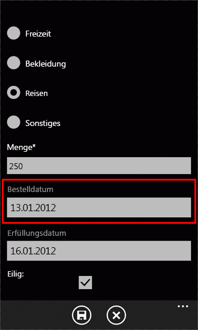
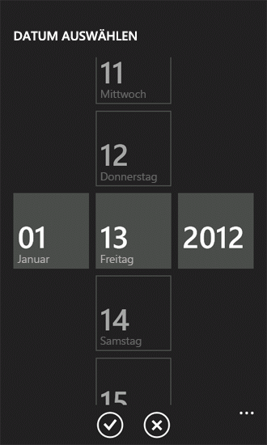

# <a name="customize-the-user-interface-of-a-sharepoint-list-app-for-windows-phone"></a><span data-ttu-id="17cc5-102">Anpassen der Benutzeroberfläche einer SharePoint-Listen-App für Windows Phone</span><span class="sxs-lookup"><span data-stu-id="17cc5-102">Customize the user interface of a SharePoint list app for Windows Phone</span></span>
<span data-ttu-id="17cc5-p101">Passen Sie die durch die Vorlage „Windows Phone - SharePoint-Listenanwendung" generierte Windows Phone-Benutzeroberfläche an. SharePoint-Listen-Apps, die über die Vorlage „Windows Phone - SharePoint-Listenanwendung" erstellt werden, basieren auf dem Silverlight für Windows Phone-Framework. Alle von der Silverlight-Plattform auf einem Windows Phone bereitgestellten Funktionen stehen für Entwickler für die Anpassung der Benutzeroberfläche einer für ein Windows Phone entworfenen SharePoint-Listen-App zur Verfügung.</span><span class="sxs-lookup"><span data-stu-id="17cc5-p101">Customize the Windows Phone user interface generated by the Windows Phone SharePoint List Application template. SharePoint list apps created from the Windows Phone SharePoint List Application template are based on the Silverlight for Windows Phone framework. All of the capabilities provided by the Silverlight platform on a Windows Phone are available to developers for customizing the user interface (UI) of a SharePoint list app designed for a Windows Phone.</span></span>
  
    
    


> <span data-ttu-id="17cc5-106">**Wichtig:** Wenn Sie eine App für Windows Phone 8 entwickeln, müssen Sie Visual Studio Express 2012 anstelle von Visual Studio 2010 Express verwenden.</span><span class="sxs-lookup"><span data-stu-id="17cc5-106">**Important:** If you are developing an app for Windows Phone 8, you must use Visual Studio Express 2012 instead of Visual Studio 2010 Express.</span></span> <span data-ttu-id="17cc5-107">Mit Ausnahme der Entwicklungsumgebung gelten alle Informationen in diesem Artikel für das Erstellen von Apps sowohl auf Windows Phone 8 als auch auf Windows Phone 7.</span><span class="sxs-lookup"><span data-stu-id="17cc5-107">Except for the development environment, all information in this article applies to creating apps for both Windows Phone 8 and Windows Phone 7.</span></span> <span data-ttu-id="17cc5-108">Weitere Informationen finden Sie unter [Vorgehensweise: Einrichten einer Umgebung für die Entwicklung mobiler Apps für SharePoint](how-to-set-up-an-environment-for-developing-mobile-apps-for-sharepoint.md).</span><span class="sxs-lookup"><span data-stu-id="17cc5-108">> For more information, see  [How to: Set up an environment for developing mobile apps for SharePoint](how-to-set-up-an-environment-for-developing-mobile-apps-for-sharepoint.md).</span></span> 
  
    
    


## <a name="create-a-sharepoint-list-app-for-user-interface-customizations"></a><span data-ttu-id="17cc5-109">Erstellen einer SharePoint-Listen-App für Anpassungen der Benutzeroberfläche</span><span class="sxs-lookup"><span data-stu-id="17cc5-109">Create a SharePoint list app for user interface customizations</span></span>
<span data-ttu-id="17cc5-110"><a name="BKMK_CreatingSPListApp"> </a></span><span class="sxs-lookup"><span data-stu-id="17cc5-110"><a name="BKMK_CreatingSPListApp"> </a></span></span>

<span data-ttu-id="17cc5-p103">Bei den folgenden Verfahren wird davon ausgegangen, dass ein Server, auf dem SharePoint Server ausgeführt wird, über die Liste „Product Orders" verfügt, die aus der Vorlage „Benutzerdefinierte Liste" erstellt wurde, ähnlich wie die Beispielliste „Product Orders", die unter  [Vorgehensweise: Implementieren von Validierung von Business Logik und die Daten in einem Windows Phone-app für SharePoint](how-to-implement-business-logic-and-data-validation-in-a-windows-phone-app-for-s.md) verwendet wird. Für die in diesem Thema verwendete Windows Phone-Beispiel-App wurden der Liste „Product Orders", auf der die App basiert, zusätzliche Felder hinzugefügt. Die geänderte Liste „Product Orders", die für die Zwecke der Beispiele in diesem Thema verwendet wird, wurde mit den Spalten und Felddtypen erstellt, die in Tabelle 1 aufgeführt sind.</span><span class="sxs-lookup"><span data-stu-id="17cc5-p103">For the following procedures, assume a server running SharePoint Server has a Product Orders list created from the Custom List template, similar to the sample Product Orders list used in  [How to: Implement business logic and data validation in a Windows Phone app for SharePoint](how-to-implement-business-logic-and-data-validation-in-a-windows-phone-app-for-s.md). For the sample Windows Phone app used in this topic, the Product Orders list on which the app is based has been modified to include additional fields. The modified Product Orders list used for the purposes of the examples in this topic has been created with the columns and field types shown in Table 1.</span></span>
  
    
    

<span data-ttu-id="17cc5-114">**Tabelle 1: Geänderte Liste „Product Orders"**</span><span class="sxs-lookup"><span data-stu-id="17cc5-114">**Table 1. Modified Product Orders list**</span></span>


|<span data-ttu-id="17cc5-115">**Spalte**</span><span class="sxs-lookup"><span data-stu-id="17cc5-115">**Column**</span></span>|<span data-ttu-id="17cc5-116">**Typ**</span><span class="sxs-lookup"><span data-stu-id="17cc5-116">**Type**</span></span>|<span data-ttu-id="17cc5-117">**Erforderlich**</span><span class="sxs-lookup"><span data-stu-id="17cc5-117">**Required**</span></span>|
|:-----|:-----|:-----|
|<span data-ttu-id="17cc5-118">Product (d. h., Titel)</span><span class="sxs-lookup"><span data-stu-id="17cc5-118">Product (i.e., Title)</span></span>  <br/> |<span data-ttu-id="17cc5-119">Einzelne Textzeile (Text)</span><span class="sxs-lookup"><span data-stu-id="17cc5-119">Single line of text (Text)</span></span>  <br/> |<span data-ttu-id="17cc5-120">Ja</span><span class="sxs-lookup"><span data-stu-id="17cc5-120">Yes</span></span>  <br/> |
|<span data-ttu-id="17cc5-121">Beschreibung</span><span class="sxs-lookup"><span data-stu-id="17cc5-121">Description</span></span>  <br/> |<span data-ttu-id="17cc5-122">Einzelne Textzeile (Text)</span><span class="sxs-lookup"><span data-stu-id="17cc5-122">Single line of text (Text)</span></span>  <br/> |<span data-ttu-id="17cc5-123">Nein</span><span class="sxs-lookup"><span data-stu-id="17cc5-123">No</span></span>  <br/> |
|<span data-ttu-id="17cc5-124">Product Category</span><span class="sxs-lookup"><span data-stu-id="17cc5-124">Product Category</span></span>  <br/> |<span data-ttu-id="17cc5-125">Auswahl</span><span class="sxs-lookup"><span data-stu-id="17cc5-125">Choice</span></span>  <br/> |<span data-ttu-id="17cc5-126">Nein</span><span class="sxs-lookup"><span data-stu-id="17cc5-126">No</span></span>  <br/> |
|<span data-ttu-id="17cc5-127">Menge</span><span class="sxs-lookup"><span data-stu-id="17cc5-127">Quantity</span></span>  <br/> |<span data-ttu-id="17cc5-128">Zahl</span><span class="sxs-lookup"><span data-stu-id="17cc5-128">Number</span></span>  <br/> |<span data-ttu-id="17cc5-129">Ja</span><span class="sxs-lookup"><span data-stu-id="17cc5-129">Yes</span></span>  <br/> |
|<span data-ttu-id="17cc5-130">Bestelldatum</span><span class="sxs-lookup"><span data-stu-id="17cc5-130">Order Date</span></span>  <br/> |<span data-ttu-id="17cc5-131">Datum und Uhrzeit (DateTime)</span><span class="sxs-lookup"><span data-stu-id="17cc5-131">Date and Time (DateTime)</span></span>  <br/> |<span data-ttu-id="17cc5-132">Nein</span><span class="sxs-lookup"><span data-stu-id="17cc5-132">No</span></span>  <br/> |
|<span data-ttu-id="17cc5-133">Erfüllungsdatum</span><span class="sxs-lookup"><span data-stu-id="17cc5-133">Fulfillment Date</span></span>  <br/> |<span data-ttu-id="17cc5-134">Datum und Uhrzeit (DateTime)</span><span class="sxs-lookup"><span data-stu-id="17cc5-134">Date and Time (DateTime)</span></span>  <br/> |<span data-ttu-id="17cc5-135">Nein</span><span class="sxs-lookup"><span data-stu-id="17cc5-135">No</span></span>  <br/> |
|<span data-ttu-id="17cc5-136">Rush</span><span class="sxs-lookup"><span data-stu-id="17cc5-136">Rush</span></span>  <br/> |<span data-ttu-id="17cc5-137">Boolescher Wert</span><span class="sxs-lookup"><span data-stu-id="17cc5-137">Boolean</span></span>  <br/> |<span data-ttu-id="17cc5-138">Nein</span><span class="sxs-lookup"><span data-stu-id="17cc5-138">No</span></span>  <br/> |
|<span data-ttu-id="17cc5-139">Rufnummer</span><span class="sxs-lookup"><span data-stu-id="17cc5-139">Contact Number</span></span>  <br/> |<span data-ttu-id="17cc5-140">Einzelne Textzeile (Text)</span><span class="sxs-lookup"><span data-stu-id="17cc5-140">Single line of text (Text)</span></span>  <br/> |<span data-ttu-id="17cc5-141">Nein</span><span class="sxs-lookup"><span data-stu-id="17cc5-141">No</span></span>  <br/> |
   
<span data-ttu-id="17cc5-p104">Befolgen Sie die Verfahren unter  [Vorgehensweise: Erstellen eine Windows Phone SharePoint Liste app](how-to-create-a-windows-phone-sharepoint-list-app.md), um die Vorlage „Windows Phone - SharePoint-Listenanwendung" zu verwenden, um eine SharePoint-Listen-App als Anfangspunkt für die folgenden Benutzeroberflächenanpassungen zu verwenden. Geben Sie als Ziel-SharePoint-Liste für die App eine Liste an, die ein ähnliches Schema wie das in Tabelle 1 gezeigte hat.</span><span class="sxs-lookup"><span data-stu-id="17cc5-p104">Follow the procedures in  [How to: Create a Windows Phone SharePoint list app](how-to-create-a-windows-phone-sharepoint-list-app.md) to use the Windows Phone SharePoint List Application template to generate a SharePoint list app as a starting point for the following UI customizations. Specify as the target SharePoint list for the app a list that has a schema similar to what is represented in Table 1.</span></span>
  
    
    

## <a name="replace-textbox-controls-with-datepicker-controls"></a><span data-ttu-id="17cc5-144">Ersetzen von TextBox-Steuerelementen durch DatePicker-Steuerelemente</span><span class="sxs-lookup"><span data-stu-id="17cc5-144">Replace TextBox controls with DatePicker controls</span></span>
<span data-ttu-id="17cc5-145"><a name="BKMK_ReplacingControls"> </a></span><span class="sxs-lookup"><span data-stu-id="17cc5-145"><a name="BKMK_ReplacingControls"> </a></span></span>

<span data-ttu-id="17cc5-p105">Basierend auf dem von der Vorlage generierten Projekt sind die Felder in der Liste, die als **DateTime** -Felder festgelegt sind (z. B . das Feld **Order Date** in der Beispielliste „Product Orders") standardmäßig an **TextBox**-Steuerelemente im Formular „Bearbeiten" (EditForm.xaml) und im Formular „Neu" (NewForm.xaml) in der App gebunden. Die erste Verbesserung, die Sie an der Benutzeroberfläche vornehmen, ist eine Vereinfachung der Eingabe von Datumswerten für solche Felder, indem Sie die zugehörigen **TextBox**-Steuerelemente durch **DatePicker**-Steuerelemente aus dem  [Silverlight für Windows Phone-Toolkit](http://silverlight.codeplex.com/releases/view/75888) ersetzen. Sie installieren das Silverlight für Windows Phone-Toolkit über die [CodePlex-Website](http://www.codeplex.com/), eine Hostingswebsite für Open-Source-Softwareprojekte.</span><span class="sxs-lookup"><span data-stu-id="17cc5-p105">Based on the project as generated by the template, fields in the list designated as **DateTime** fields (as, for example, the **Order Date** field in the sample Product Orders list) are bound by default to **TextBox** controls in the Edit form (EditForm.xaml) and the New form (NewForm.xaml) in the app. The first improvement you will make to the user interface is to facilitate entering date values for such fields by replacing their associated **TextBox** controls with **DatePicker** controls from the [Silverlight for Windows Phone Toolkit](http://silverlight.codeplex.com/releases/view/75888). You can install Silverlight for Windows Phone Toolkit from the  [CodePlex Website](http://www.codeplex.com/), a hosting site for open-source software projects.</span></span>
  
    
    

### <a name="to-replace-textbox-controls-with-datepicker-controls"></a><span data-ttu-id="17cc5-149">So ersetzen Sie TextBox-Steuerelemente durch DatePicker-Steuerelemente</span><span class="sxs-lookup"><span data-stu-id="17cc5-149">To replace TextBox controls with DatePicker controls</span></span>


1. <span data-ttu-id="17cc5-150">Falls noch nicht geschehen, öffnen Sie in Microsoft Visual Studio 2010 das Projekt, das Sie im vorherigen Abschnitt auf der Basis der Vorlage „Windows Phone - SharePoint-Listenanwendung" und unter Verwendung einer SharePoint-Liste wie der in Tabelle 1 aufgeführten Liste „Product Orders" erstellt haben.</span><span class="sxs-lookup"><span data-stu-id="17cc5-150">In Microsoft Visual Studio 2010, if the project is not opened already, open the project you created in the preceding section, based on the Windows Phone SharePoint List Application template and using a SharePoint list like the Product Orders list represented in Table 1.</span></span>
    
  
2. <span data-ttu-id="17cc5-p106">Klicken Sie im Menü **Projekt** in Visual Studio auf **Verweis hinzufügen**. Das Dialogfeld **Verweis hinzufügen** wird angezeigt.</span><span class="sxs-lookup"><span data-stu-id="17cc5-p106">On the **Project** menu in Visual Studio, click **Add Reference**. The **Add Reference** dialog box appears.</span></span>
    
  
3. <span data-ttu-id="17cc5-153">Navigieren Sie auf der Registerkarte **Durchsuche** zu der Assembly „Microsoft.Phone.Controls.Toolkit.dll“, die vom Silverlight für Windows Phone-Toolkit installiert wurde.</span><span class="sxs-lookup"><span data-stu-id="17cc5-153">On the **Browse** tab, navigate to the Microsoft.Phone.Controls.Toolkit.dll assembly installed by the Silverlight for Windows Phone Toolkit.</span></span>
    
    > [!NOTE]
    > <span data-ttu-id="17cc5-154">Sie finden die Assembly „Microsoft.Phone.Controls.Toolkit.dll“ unter %PROGRAMFILES%(x86)\\Microsoft SDKs\\Windows Phone\\v7.1\\Toolkit\\< *MonthYear*  >\\Bin in einer Standardinstallation des Toolkits, wobei < *MonthYear*  > etwas wie „Oct11" sein kann, je nachdem, welche Version des Toolkits installiert ist.</span><span class="sxs-lookup"><span data-stu-id="17cc5-154">Note: The Microsoft.Phone.Controls.Toolkit.dll assembly can be found in %PROGRAMFILES%(x86)\\Microsoft SDKs\\Windows Phone\\v7.1\\Toolkit< *MonthYear*\\Bin in a standard installation of the Toolkit, where < *MonthYear*  > may be something like "Oct11", depending on the version of the Toolkit installed.</span></span> <span data-ttu-id="17cc5-155">(Die vom Toolkit installierten Assemblys können Sie auch auf Ihrem System finden, indem Sie auf die Schaltfläche **Start** klicken, auf **Alle Programme** zeigen, das Element **Microsoft Silverlight für Windows Phone-Toolkit** Menü „Programme“ erweitern und auf **Binärdateien** klicken.)</span><span class="sxs-lookup"><span data-stu-id="17cc5-155">(Or you can find the assemblies installed by the Toolkit on your system by clicking the **Start** button, pointing to **All Programs**, expanding the **Microsoft Silverlight for Windows Phone Toolkit** item in the Programs menu, and clicking **Binaries**.)</span></span> 

4. <span data-ttu-id="17cc5-156">Wählen Sie im **Projektmappen-Explorer** die Datei „EditForm.xaml“ unter dem Knoten **Ansichten** aus.</span><span class="sxs-lookup"><span data-stu-id="17cc5-156">In **Solution Explorer**, select the EditForm.xaml file under the **Views** node.</span></span>
    
  
5. <span data-ttu-id="17cc5-157">Drücken Sie UMSCHALT + F7 (oder doppelklicken Sie auf die Datei), um die Datei im Designer zu öffnen.</span><span class="sxs-lookup"><span data-stu-id="17cc5-157">Press SHIFT + F7 (or double-click the file) to open the file in the designer.</span></span>
    
  
6. <span data-ttu-id="17cc5-158">Fügen Sie im XAML-Bereich des Designers eine Namespace-Deklaration hinzu, um die Steuerelemente in der Toolkit-Assembly vom `<phone:PhoneApplicationPage>`-Tag unterscheiden zu können.</span><span class="sxs-lookup"><span data-stu-id="17cc5-158">In the XAML pane of the designer, add a namespace declaration for distinguishing the controls in the Toolkit assembly to the  `<phone:PhoneApplicationPage>` tag.</span></span>
    
```
  
<phone:PhoneApplicationPage
    x:Class="ContosoSPListApp.EditForm"
    xmlns="http://schemas.microsoft.com/winfx/2006/xaml/presentation"
    xmlns:x="http://schemas.microsoft.com/winfx/2006/xaml"
    xmlns:phone="clr-namespace:Microsoft.Phone.Controls;assembly=Microsoft.Phone"
    xmlns:toolkit="clr-namespace:Microsoft.Phone.Controls;assembly=Microsoft.Phone.Controls.Toolkit"
    xmlns:shell="clr-namespace:Microsoft.Phone.Shell;assembly=Microsoft.Phone"
    xmlns:d="http://schemas.microsoft.com/expression/blend/2008"
    xmlns:mc="http://schemas.openxmlformats.org/markup-compatibility/2006"
    mc:Ignorable="d" d:DesignWidth="480" d:DesignHeight="696"
    FontFamily="{StaticResource PhoneFontFamilyNormal}"
    FontSize="{StaticResource PhoneFontSizeNormal}"
    Foreground="{StaticResource PhoneForegroundBrush}"
    SupportedOrientations="Portrait" Orientation="Portrait"
    shell:SystemTray.IsVisible="True" x:Name = "EditPage">
```


    The only change to the default markup generated by the template is the addition of the "xmlns:toolkit" namespace designation. Also note that the value of the **Class** attribute here is based on the name of your project. "ContosoSPListApp" is the name of this sample project. The value of this attribute in your project will differ from the value here depending on the name of your project.
    
  
7. <span data-ttu-id="17cc5-p108">Suchen Sie in der Datei EditForm.xaml nach dem **StackPanel**-Steuerelement im Markup, das die mit dem Feld **Order Date** (das als „Order_x0020_Date" im XML-Schema für das Feld festgelegt ist) verbundenen Steuerelemente enthält. Standardmäßig generiert die Vorlage ein **TextBox**-Steuerelement und zwei **TextBlock**-Steuerelemente für **DateTime** -Felder. Das Markup, das das Steuerelement **StackPanel** und die darin enthaltenen Steuerelemente enthält, sollte dem folgenden Markup ähneln.</span><span class="sxs-lookup"><span data-stu-id="17cc5-p108">In the EditForm.xaml file, locate the **StackPanel** control in the markup that contains the controls associated with the **Order Date** field (designated as "Order_x0020_Date" in the XML schema for the field). By default, the template generates a **TextBox** control and two **TextBlock** controls for **DateTime** fields. The markup for the **StackPanel** control and the controls it contains should resemble the following markup.</span></span>
    
```
  
<StackPanel Orientation="Vertical" Margin="0,5,0,5">
    <TextBlock TextWrapping="Wrap" HorizontalAlignment="Left" 
             Style="{StaticResource PhoneTextNormalStyle}">Order Date</TextBlock>
    <TextBox Height="Auto" Style="{StaticResource TextValidationTemplate}" 
                FontSize="{StaticResource PhoneFontSizeNormal}" Width="470" 
                HorizontalAlignment="Left" Name="txtOrder_x0020_Date" 
                Text="{Binding [Order_x0020_Date], Mode=TwoWay, ValidatesOnNotifyDataErrors=True,
                NotifyOnValidationError=True}" TextWrapping="Wrap" />
    <TextBlock FontSize="16" TextWrapping="Wrap" HorizontalAlignment="Left" Style="{StaticResource PhoneTextSubtleStyle}" Text="{Binding DateTimeFormat}" />
</StackPanel>
```

8. <span data-ttu-id="17cc5-162">Ersetzen Sie das Steuerelement **StackPanel** und die darin enthaltenen Steuerelemente durch das folgende Markup.</span><span class="sxs-lookup"><span data-stu-id="17cc5-162">Replace that **StackPanel** control and the controls it contains with the following markup.</span></span>
    
```
  
<StackPanel Orientation="Vertical" Margin="0,5,0,5">
    <toolkit:DatePicker Header="Order Date" Value="{Binding [Order_x0020_Date], Mode=TwoWay}">
              </toolkit:DatePicker>
</StackPanel>
```

9. <span data-ttu-id="17cc5-p109">Suchen Sie als Nächstes (auch in EditForm.xaml) nach dem Steuerelement **StackPanel**, das die dem Feld „Fulfillment Date" zugeordneten Steuerelemente enthält (die im Schema für das Feld als „Fulfillment_x0020_Date" festgelegt sind). Das Markup für **StackPanel** und die darin enthaltenen Steuerelemente sollte dem folgenden Markup ähneln.</span><span class="sxs-lookup"><span data-stu-id="17cc5-p109">Next, locate (also in EditForm.xaml) the **StackPanel** control in the markup that contains the controls associated with the Fulfillment Date field (designated as "Fulfillment_x0020_Date" in the schema for the field). The markup for the **StackPanel** and the controls it contains should resemble the following markup.</span></span>
    
```
  
<StackPanel Orientation="Vertical" Margin="0,5,0,5">
    <TextBlock TextWrapping="Wrap" HorizontalAlignment="Left" Style="{StaticResource PhoneTextNormalStyle}">Fulfillment Date</TextBlock>
    <TextBox Height="Auto" Style="{StaticResource TextValidationTemplate}" 
           FontSize="{StaticResource PhoneFontSizeNormal}" Width="470" HorizontalAlignment="Left"
           Name="txtFulfillment_x0020_Date" Text="{Binding [Fulfillment_x0020_Date], 
           Mode=TwoWay, ValidatesOnNotifyDataErrors=True, NotifyOnValidationError=True}" 
           TextWrapping="Wrap" />
    <TextBlock FontSize="16" TextWrapping="Wrap" HorizontalAlignment="Left" 
          Style="{StaticResource PhoneTextSubtleStyle}" Text="{Binding DateTimeFormat}" />
</StackPanel>
```

10. <span data-ttu-id="17cc5-165">Ersetzen Sie das Steuerelement **StackPanel** und die darin enthaltenen Steuerelemente durch das folgende Markup.</span><span class="sxs-lookup"><span data-stu-id="17cc5-165">Replace that **StackPanel** control and the controls it contains with the following markup.</span></span>
    
```
  
<StackPanel Orientation="Vertical" Margin="0,5,0,5">
    <toolkit:DatePicker Header="Fulfillment Date" Value="{Binding [Fulfillment_x0020_Date], Mode=TwoWay}"></toolkit:DatePicker>
</StackPanel>
```

11. <span data-ttu-id="17cc5-p110">Schließlich können Sie Bilder für Benutzeroberflächensymbole aus dem Silverlight für Windows Phone-Toolkit zu Ihrem Projekt hinzufügen. Wählen Sie im **Projektmappen-Explorer** den Knoten aus, der das Projekt (z. B. namens „ContosoSPListApp") darstellt.</span><span class="sxs-lookup"><span data-stu-id="17cc5-p110">Finally, you can add user interface icon images from the Silverlight for Windows Phone Toolkit to your project. In **Solution Explorer**, select the node representing the project (named, for example, "ContosoSPListApp").</span></span>
    
  
12. <span data-ttu-id="17cc5-p111">Klicken Sie im Menü **Projekt** in Visual Studio auf **Neuer Ordner**. Unter den Knoten des Projekts wird ein neuer Ordner hinzugefügt. Nennen Sie den Ordner „Toolkit.Content".</span><span class="sxs-lookup"><span data-stu-id="17cc5-p111">On the **Project** menu in Visual Studio, click **New Folder**. A new folder is added under the project node. Name the folder "Toolkit.Content".</span></span>
    
  
13. <span data-ttu-id="17cc5-171">Wählen Sie im **Projektmappen-Explorer** den Ordner aus, den Sie im vorherigen Schritt erstellt haben.</span><span class="sxs-lookup"><span data-stu-id="17cc5-171">In **Solution Explorer**, select the folder you created in the preceding step.</span></span>
    
  
14. <span data-ttu-id="17cc5-p112">Klicken Sie im Menü **Projekt** auf **Vorhandenes Element hinzufügen**. Das Fenster **Dateibrowser** wird geöffnet.</span><span class="sxs-lookup"><span data-stu-id="17cc5-p112">On the **Project** menu, click **Add Existing Item**. A **File Browser** window opens.</span></span>
    
  
15. <span data-ttu-id="17cc5-174">Navigieren Sie zu dem Ordner, in dem die unterstützenden Symbolbilder, „ApplicationBar.Cancel.png“ und „ApplicationBar.Check.png“ vom Silverlight für Windows Phone-Toolkit installiert wurden.</span><span class="sxs-lookup"><span data-stu-id="17cc5-174">Navigate to the folder where the supporting icon images, ApplicationBar.Cancel.png and ApplicationBar.Check.png, were installed by the Silverlight for Windows Phone Toolkit.</span></span>
    
    > [!NOTE]
    > <span data-ttu-id="17cc5-175">Sie finden die Bilder unter %PROGRAMFILES%(x86)\\Microsoft SDKs\\Windows Phone\\v7.1\\Toolkit\\< *MonthYear*  >\\Bin\\Icons in einer Standardinstallation des Toolkits, wobei < *MonthYear*  > etwas wie „Oct11" sein kann, je nachdem, welche Version des Toolkits installiert ist.</span><span class="sxs-lookup"><span data-stu-id="17cc5-175">Note The images are in %PROGRAMFILES%(x86)\\Microsoft SDKs\\Windows Phone\\v7.1\\Toolkit< *MonthYear*\\Bin\\Icons in a standard installation of the Toolkit, where < *MonthYear*  > may be something like "Oct11", depending on the version of the Toolkit installed.</span></span>

16. <span data-ttu-id="17cc5-p113">Wählen Sie beide Bilder aus, und klicken Sie auf **Hinzufügen**. Die Bilddateien werden dem Projekt unter dem Knoten **Toolkit.Content** hinzugefügt.</span><span class="sxs-lookup"><span data-stu-id="17cc5-p113">Select both images and click **Add**. The image files are added to the project under the **Toolkit.Content** folder node.</span></span>
    
    > <span data-ttu-id="17cc5-178">**Wichtig:** Damit die Komponenten des Silverlight für Windows Phone-Toolkits die Symbolbilder verwenden können, müssen diese an dem Standort in Ihrem Projekt abgelegt werden, den Sie in den vorherigen Schritten angegeben haben.</span><span class="sxs-lookup"><span data-stu-id="17cc5-178">**Important:** For the components of the Silverlight for Windows Phone Toolkit to be able to use the icon images, they must be placed in the location in your projected as specified in the preceding steps.</span></span> 
17. <span data-ttu-id="17cc5-179">Wählen Sie im **Projektmappen-Explorer** beide Bilddateien unter dem Ordner **Toolkit.Content** aus.</span><span class="sxs-lookup"><span data-stu-id="17cc5-179">In **Solution Explorer**, select both image files under the **Toolkit.Content** folder.</span></span>
    
  
18. <span data-ttu-id="17cc5-180">Legen Sie im **Eigenschaftenfenster** die Eigenschaft **Buildvorgang** für die Bilder auf „Inhalt" und die Eigenschaft **In Ausgabeverzeichnis kopieren** auf „Kopieren, wenn neuer" fest.</span><span class="sxs-lookup"><span data-stu-id="17cc5-180">In the **Properties Window**, set the **Build Action** property for the images to "Content" and set the **Copy to Output Directory** property to "Copy if newer".</span></span>
    
    > [!NOTE]
    > <span data-ttu-id="17cc5-181">Wenn das **Eigenschaftenfenster** nicht sichtbar ist, drücken Sie STRG+W und dann P, um das Fenster in Visual Studio anzuzeigen.</span><span class="sxs-lookup"><span data-stu-id="17cc5-181">Note: If the **Properties Window** is not visible, press CTRL + W and then P to display the window in Visual Studio.</span></span>

    <span data-ttu-id="17cc5-182">Wenn Sie das Projekt (durch Drücken von F5) starten, um es im Windows Phone-Emulator bereitzustellen, können Sie zum Formular **Bearbeiten** für ein Element navigieren (indem Sie in der Hauptseite der Listenansicht auf ein Element und dann auf die Schaltfläche **Bearbeiten** in der **Anwendungsleiste** in der App klicken).</span><span class="sxs-lookup"><span data-stu-id="17cc5-182">If you start the project (by pressing F5) to deploy it to the Windows Phone Emulator, you can navigate to the **Edit** form for an item (by clicking an item in the main List View page and then clicking the **Edit** button on the **Application Bar** in the app).</span></span> <span data-ttu-id="17cc5-183">Die **DateTime**-Felder im Formular sind jetzt mit dem Steuerelement **DatePicker** verknüpft, wie in Abbildung 1 dargestellt.</span><span class="sxs-lookup"><span data-stu-id="17cc5-183">The **DateTime** fields in the form are now associated with the **DatePicker** control, as shown in Figure 1.</span></span>
 
    <span data-ttu-id="17cc5-184">**Abbildung 1: Bearbeitungsformular mit DatePicker-Steuerelement**</span><span class="sxs-lookup"><span data-stu-id="17cc5-184">**Figure 1. Edit form with DatePicker control**</span></span>

    
  
    
    
<span data-ttu-id="17cc5-186">Das Steuerelement **DatePicker** (das für das Feld **Order Date** in Abbildung 1 hervorgehoben ist) ähnelt stark einem **TextBox**-Steuerelement mit einem zugehörigen **TextBlock** als Bezeichnung. Aber wenn Sie auf das Steuerelement **DatePicker** klicken (oder darauf tippen auf einem Windows Phone-Gerät), zeigt das Steuerelement eine separate Seite mit Steuerelementen für die Auswahl von Datumsangaben mithilfe von Gesten an, wie in Abbildung 2 dargestellt.</span><span class="sxs-lookup"><span data-stu-id="17cc5-186">The **DatePicker** control (highlighted for the **Order Date** field in Figure 1) looks very much like a **TextBox** control with an associated **TextBlock** as a label, except that when you click the **DatePicker** control (or tap it on a Windows Phone device), the control displays a separate page with controls for selecting dates using gestures, as shown in Figure 2.</span></span>
  
    
    

<span data-ttu-id="17cc5-187">**Abbildung 2: Seite mit Datumsauswahl**</span><span class="sxs-lookup"><span data-stu-id="17cc5-187">**Figure 2. Date chooser page**</span></span>

  
    
    

  
    
    

  
    
    
<span data-ttu-id="17cc5-p115">Durch Klicken auf die Schaltfläche **Fertig** werden die ausgewählten Daten an das **DatePicker**-Steuerelement auf dem Formular **Bearbeiten** übertragen. Wenn Sie dann in diesem Formular auf die Schaltfläche **Speichern** klicken, werden die Werte der **DateTime** -Felder, die mit den **DatePicker**-Steuerelementen verbunden sind, in der SharePoint-Liste auf dem Server aktualisiert, da die **Value**-Eigenschaften der Steuerelemente im obigen Verfahren an die entsprechenden Felder in der EditForm.xaml gebunden wurden. Wenn Sie die **TextBox**-Steuerelemente auch im Formular „Neu" durch **DatePicker**-Steuerelemente ersetzen möchten, wiederholen Sie die Schritte 4 bis 10 des Verfahrens für die Datei NewForm.xaml im Projekt.</span><span class="sxs-lookup"><span data-stu-id="17cc5-p115">Clicking the **Done** button transfers the chosen date to the **DatePicker** control on the **Edit** form. If you then click the **Save** button on that form, the values of the **DateTime** fields associated with the **DatePicker** controls are updated in the SharePoint list on the server, because the **Value** properties of the controls were bound to the appropriate fields in the EditForm.xaml file in the procedure above. If you wanted to replace **TextBox** controls with **DatePicker** controls in the New form as well, you would repeat Steps 4 through 10 of the procedure for the NewForm.xaml file in the project.</span></span>
  
    
    

## <a name="add-controls-to-support-custom-fill-in-options-for-choice-fields"></a><span data-ttu-id="17cc5-192">Hinzufügen von Steuerelementen zur Unterstützung von benutzerdefinierten Ausfülloptionen für Auswahlfelder</span><span class="sxs-lookup"><span data-stu-id="17cc5-192">Add controls to support custom fill-in options for Choice fields</span></span>
<span data-ttu-id="17cc5-193"><a name="BKMK_AddingControlsForChoiceFields"> </a></span><span class="sxs-lookup"><span data-stu-id="17cc5-193"><a name="BKMK_AddingControlsForChoiceFields"> </a></span></span>

<span data-ttu-id="17cc5-p116">Felder in einer SharePoint-Liste, für die der Feldtyp „Choice" festgelegt wird, können so auf einem SharePoint-Server konfiguriert werden, dass Benutzer benutzerdefinierte (oder „ausfüllbare") Auswahlwerte für ein Feld angeben können, zusätzlich zu deklarierten Auswahlwerten, die möglicherweise einem Choice-Feld zugewiesen sind, wenn dieses auf dem Server definiert wird. In Projekten, die aus der Vorlage „Windows Phone - SharePoint-Listenanwendung" erstellt werden, werden die Choice-Felder nicht standardmäßig so wiedergegeben, dass eine Benutzeroberflächenunterstützung für die Eingabe von „Ausfüll"-Optionen eingeschlossen ist. In den Verfahren in diesem Abschnitt fügen Sie UI-Steuerelemente und Code zu Ihrer App hinzu, um die Eingabe benutzerdefinierter Auswahlwerte für das Feld „Product Category" zu unterstützen.</span><span class="sxs-lookup"><span data-stu-id="17cc5-p116">Fields designated with the Choice field type in a SharePoint list can be configured on a SharePoint Server to allow users to specify custom (or "fill-in") choice values for a field, in addition to any declared choice values that may be assigned to a Choice field when it is defined on the server. In projects created from the Windows Phone SharePoint List Application template, Choice fields are not rendered by default to include UI support for entering "fill-in" options. In the procedures in this section, you will add UI controls and code to your app to support entering custom choice values for the Product Category field.</span></span>
  
    
    
<span data-ttu-id="17cc5-197">In den folgenden Verfahren werden Sie Folgendes durchführen:</span><span class="sxs-lookup"><span data-stu-id="17cc5-197">In the following procedures, you will:</span></span>
  
    
    

- <span data-ttu-id="17cc5-198">Hinzufügen einer Klasse ( **ContosoConverter**) mit Konvertierungslogik zum Verarbeiten von Daten, die im Auswahlfeld „Product Category" gespeichert werden</span><span class="sxs-lookup"><span data-stu-id="17cc5-198">Add a class ( **ContosoConverter**) with conversion logic to process data to be saved to the Product Category Choice field.</span></span>
    
  
- <span data-ttu-id="17cc5-p117">Hinzufügen eines Eigenschaftenmembers ( **OtherCategoryValue**) zur Klasse **EditItemViewModel**, der Zugriff auf eine Zeichenfolge bereitstellt, die den „Ausfüll"-Wert für das Choice-Feld bereitstellt. Dieser Eigenschaftenmember dient als Quelle in einer Binding-Deklaration für ein zusätzliches **TextBox**-Steuerelement auf dem Formular „Bearbeiten".</span><span class="sxs-lookup"><span data-stu-id="17cc5-p117">Add a property member ( **OtherCategoryValue**) to the **EditItemViewModel** class that provides access to a string representing the "fill-in" value for the Choice field. This property member will serve as the source in a Binding declaration for an added **TextBox** control on the Edit form.</span></span>
    
  
- <span data-ttu-id="17cc5-201">Hinzufügen eines **RadioButton**-Steuerelements und eines **TextBox**-Steuerelements zum Formular „Bearbeiten", damit Benutzer einen „Ausfüll"-Auswahlwert für das „Product Category" angeben können</span><span class="sxs-lookup"><span data-stu-id="17cc5-201">Add a **RadioButton** control and a **TextBox** control to the Edit form for users to be able to specify a "fill-in" choice value for the Product Category field.</span></span>
    
  
- <span data-ttu-id="17cc5-202">Ändern der Code-Behind-Datei EditForm.xaml.cs, die mit dem Formular „Bearbeiten" verbunden ist, um eine **set** -Funktion für den Wertkonverter für das Feld zum Bearbeiten für Choice-Felder zu registrieren und Ereignishandler für die Steuerelemente zu implementieren, die dem Formular „Bearbeiten" hinzugefügt werden.</span><span class="sxs-lookup"><span data-stu-id="17cc5-202">Modify the code-behind file, EditForm.xaml.cs, associated with the Edit form to register an edit field value converter **set** function for Choice fields and implement event handlers for the controls added to the Edit form.</span></span>
    
> [!NOTE]
> <span data-ttu-id="17cc5-203">Weitere Informationen zu Feldwertkonvertern finden Sie unter [Vorgehensweise: Unterstützen und Konvertieren von SharePoint-Feldtypen für Windows Phone-Apps](how-to-support-and-convert-sharepoint-field-types-for-windows-phone-apps.md).</span><span class="sxs-lookup"><span data-stu-id="17cc5-203">[Note:](how-to-support-and-convert-sharepoint-field-types-for-windows-phone-apps.md) For more information about field value converters, see  How to: Support and convert SharePoint field types for Windows Phone apps.</span></span> 
  
    
    


  
    
    

### <a name="to-add-a-class-to-support-data-conversion-for-choice-fields"></a><span data-ttu-id="17cc5-204">So fügen Sie eine Klasse zur Unterstützung der Datenkonvertierung für Choice-Felder hinzu</span><span class="sxs-lookup"><span data-stu-id="17cc5-204">To add a class to support data conversion for Choice fields</span></span>


1. <span data-ttu-id="17cc5-205">Wählen Sie im **Projektmappen-Explorer** den Knoten aus, der das Projekt (z. B. namensContosoSPListApp) darstellt.</span><span class="sxs-lookup"><span data-stu-id="17cc5-205">In **Solution Explorer**, select the node representing the project (named, for example, ContosoSPListApp).</span></span>
    
  
2. <span data-ttu-id="17cc5-p118">Klicken Sie im Menü **Projekt** in Visual Studio (oder Visual Studio Express für Windows Phone) auf **Klasse hinzufügen**. Das Dialogfeld **Neues Element hinzufügen** wird geöffnet, in dem die C#-Vorlage **Klasse** bereits ausgewählt ist.</span><span class="sxs-lookup"><span data-stu-id="17cc5-p118">On the **Project** menu in Visual Studio (or Visual Studio Express for Windows Phone), click **Add Class**. The **Add New Item** dialog box opens with the C# **Class** template already selected.</span></span>
    
  
3. <span data-ttu-id="17cc5-p119">Geben Sie einen Namen für die Klassendatei (z. B. ContosoConverter.cs) an, und klicken Sie auf **Hinzufügen**. Die Klassendatei wird zum Projekt hinzugefügt und zur Bearbeitung geöffnet.</span><span class="sxs-lookup"><span data-stu-id="17cc5-p119">Specify a name for the class file (as, for example, ContosoConverter.cs) and click **Add**. The class file is added to the project and opened for editing.</span></span>
    
  
4. <span data-ttu-id="17cc5-210">Ersetzen Sie den Inhalt der Datei durch den folgenden Code:</span><span class="sxs-lookup"><span data-stu-id="17cc5-210">Replace the contents of the file with the following code.</span></span>
    
```cs
  
using System;
using System.Net;
using System.Windows;
using System.Collections.ObjectModel;
using Microsoft.SharePoint.Phone.Application;
using Microsoft.SharePoint.Client;

namespace SPListAppUICustomization
{
    public class ContosoConverter
    {
        // Edit Field Value Converter SET function for Choice fields.
        public static void SetConvertedChoiceEditFieldValue(string fieldName, object fieldValue, 
                                        ListItem item, ConversionContext context, string customCategory)
        {
            ObservableCollection<ChoiceFieldViewModel> choices = fieldValue as
                                                   ObservableCollection<ChoiceFieldViewModel>;
               bool isCustomValue = true;

            string specifiedChoice = string.Empty;

            if (choices != null)
            {
                foreach (ChoiceFieldViewModel choiceItem in choices)
                {
                    if ((choiceItem.IsChecked == true) || (choiceItem.Name.Equals(customCategory, 
                                                             StringComparison.CurrentCultureIgnoreCase)))
                    {
                        specifiedChoice = choiceItem.Name;
                        isCustomValue = false;
                        break;
                    }
                }

                if (isCustomValue == true)
                {
                    specifiedChoice = customCategory;
                }
            }
            else
            {
                specifiedChoice = customCategory;
            }

            item[fieldName] = specifiedChoice;
        }
    }
}
```

5. <span data-ttu-id="17cc5-211">Speichern Sie die Datei.</span><span class="sxs-lookup"><span data-stu-id="17cc5-211">Save the file.</span></span>
    
  
<span data-ttu-id="17cc5-p120">Die Funktion **SetConvertedChoiceEditFieldValue** wird hier für die Implementierung des **set** -Funktionsdelegaten des Wertkonverters für das Feld zum Bearbeiten verwendet, der für Choice-Felder in der App registriert ist. Die Funktion durchläuft die Auflistung von **ChoiceFieldViewModel**-Objekten, die als das Argument **fieldValue** übergeben werden. **ChoiceFieldViewModel**-Objekte werden verwendet, um einzelne Werte für Choice-Felder in Projekten darzustellen, die auf der Vorlage „Windows Phone - SharePoint-Listenanwendung" basieren. Jedes Objekt verfügt über eine **Name**-Eigenschaft, die eine bestimmte Auswahl und eine boolesche Eigenschaft darstellt ( **IsChecked**), die darauf hinweist, ob ein angegebener Auswahlwert (der für ein Feld verfügbaren Werte, wie definiert) der für das Feld angegebene Wert ist. Die Funktion **SetConvertedChoiceEditFieldValue** bestimmt, ob ein **ChoiceFieldViewModel**-Objekt in der Auflistung überprüft wird oder ob die Eigenschaft **Name** eines Objekts einem angegebenen benutzerdefinierten Wert für das Feld „Product Category" entspricht. In diesem Fall wird die Eigenschaft **Name** dieses **ChoiceFieldViewModel**-Objekts verwendet, um den Wert des Felds festzulegen. Andernfalls wird ein angegebener benutzerdefinierter Wert (aus dem Argument **customCategory**) als Wert des Felds festgelegt.</span><span class="sxs-lookup"><span data-stu-id="17cc5-p120">The **SetConvertedChoiceEditFieldValue** function here is used for the implementation of the edit field value converter **set** function delegate registered for Choice fields in the app. The function iterates through the collection of **ChoiceFieldViewModel** objects passed as the **fieldValue** argument. **ChoiceFieldViewModel** objects are used to represent individual values for Choice fields in projects based on the Windows Phone SharePoint List Application template. Each object has a **Name** property that represents a given choice and a Boolean property ( **IsChecked**) indicating whether a given choice value (of those values available for a field as was defined) is the value specified for the field. The **SetConvertedChoiceEditFieldValue** function determines whether a **ChoiceFieldViewModel** object in the collection is checked or whether the **Name** property of an object matches a specified custom value for the Product Category field. If so, the **Name** property of that **ChoiceFieldViewModel** object is used to set the value of the field. Otherwise, a specified custom value (from the **customCategory** argument) is set as the value of the field.</span></span>
  
    
    
<span data-ttu-id="17cc5-219">Als Nächstes fügen Sie einen Eigenschaftenmember zur Klasse **EditItemViewModel** hinzu, die Zugriff auf den „Ausfüll"-Wert für ein Choice-Feld bereitstellt (oder eine leere Zeichenfolge, wenn der angegebene Wert des Choice-Felds eine der für das Feld auf dem Server definierten verfügbaren Auswahloptionen ist).</span><span class="sxs-lookup"><span data-stu-id="17cc5-219">Next you will add a property member to the **EditItemViewModel** class that provides access to the "fill-in" value for a Choice field (or an empty string if the specified value of the Choice field is one of the available choices defined for the field on the server).</span></span>
  
    
    

### <a name="to-add-a-property-member-to-the-edititemviewmodel-class"></a><span data-ttu-id="17cc5-220">So fügen Sie einen Eigenschaftenmember zur Klasse EditItemViewModel hinzu</span><span class="sxs-lookup"><span data-stu-id="17cc5-220">To add a property member to the EditItemViewModel class</span></span>


1. <span data-ttu-id="17cc5-221">Wählen Sie im **Projektmappen-Explorer**unter dem Ordnerknoten **ViewModels** die Datei EditItemViewModel.cs aus.</span><span class="sxs-lookup"><span data-stu-id="17cc5-221">In **Solution Explorer**, under the **ViewModels** folder node, select the EditItemViewModel.cs file.</span></span>
    
  
2. <span data-ttu-id="17cc5-222">Drücken Sie F7 (oder doppelklicken Sie auf die Datei), um die Datei zum Bearbeiten zu öffnen.</span><span class="sxs-lookup"><span data-stu-id="17cc5-222">Press F7 (or double-click the file) to open the file for editing.</span></span>
    
  
3. <span data-ttu-id="17cc5-223">Fügen Sie nach den standardmäßigen **using**-Direktiven in der Datei die folgende Direktive hinzu.</span><span class="sxs-lookup"><span data-stu-id="17cc5-223">After the default **using** directives in the file, add the following directive.</span></span>
    
```cs
  
using System.Collections.ObjectModel;
```

4. <span data-ttu-id="17cc5-224">Fügen Sie die folgende Implementierung eines Eigenschaftenmembers (namens **OtherCategoryValue**) innerhalb des Codeblocks (abgegrenzt von öffnenden und schließenden Klammern), der die **EditItemViewModel**-Klasse implementiert, zur Datei hinzu.</span><span class="sxs-lookup"><span data-stu-id="17cc5-224">Add the following implementation of a property member (named **OtherCategoryValue**) to the file, within the code block (demarcated by opening and closing braces) that implements the **EditItemViewModel** class.</span></span>
    
```cs
  public string OtherCategoryValue
{
    get
    {
        string specifiedCategory = string.Empty;

        // See if specified Choice field value is one of the available values
        // from the List ViewModel. If it is, return an empty string.
        ObservableCollection<ChoiceFieldViewModel> choicesCollection = this["Product_x0020_Category"] as
                                               ObservableCollection<ChoiceFieldViewModel>;
        if (choicesCollection != null &amp;&amp; choicesCollection.Any(choice => choice.IsChecked))
        {
            return specifiedCategory;
        }

        // If Choice field value is not one of the values from the List ViewModel,
        // get the value from the underlying list item and return value as string.
        specifiedCategory = SharePointListItem.FieldValuesAsText["Product_x0020_Category"];
        return specifiedCategory;
    }
}
```

5. <span data-ttu-id="17cc5-225">Speichern Sie die Datei.</span><span class="sxs-lookup"><span data-stu-id="17cc5-225">Save the file.</span></span>
    
  
<span data-ttu-id="17cc5-226">Als Nächstes fügen Sie Steuerelemente zum Formulare „Bearbeiten" hinzu, und konfigurieren Sie diese Steuerelemente so, dass die Eingabe von benutzerdefinierten Werten für das Feld „Product Category" unterstützt wird.</span><span class="sxs-lookup"><span data-stu-id="17cc5-226">Next, you will add controls to the Edit form and configure those controls to support entering custom values for the Product Category field.</span></span>
  
    
    

### <a name="to-add-and-configure-ui-controls-for-entering-custom-choice-field-values"></a><span data-ttu-id="17cc5-227">So fügen Sie UI-Steuerelemente für das Eingeben benutzerdefinierter Choice-Feldwerte hinzu und konfigurieren diese</span><span class="sxs-lookup"><span data-stu-id="17cc5-227">To add and configure UI controls for entering custom Choice field values</span></span>


1. <span data-ttu-id="17cc5-228">Wählen Sie im **Projektmappen-Explorer** die Datei EditForm.xaml unter dem Ordnerknoten **Ansichten** aus.</span><span class="sxs-lookup"><span data-stu-id="17cc5-228">In **Solution Explorer**, select the EditForm.xaml file under the **Views** folder node.</span></span>
    
  
2. <span data-ttu-id="17cc5-229">Drücken Sie UMSCHALT + F7 (oder doppelklicken Sie auf die Datei), um die Datei im Designer zu öffnen.</span><span class="sxs-lookup"><span data-stu-id="17cc5-229">Press SHIFT + F7 (or double-click the file) to open the file in the designer.</span></span>
    
  
3. <span data-ttu-id="17cc5-p121">Suchen Sie nach dem **StackPanel**-Steuerelement, das die Steuerelemente (ein **TextBlock**-Steuerelement und ein **ListBox**-Steuerelement) für das Rendern des Felds **Product Category** aus der SharePoint-Liste „Product Orders" enthält. Fügen Sie ein **RadioButton**-Steuerelement und ein weiteres **TextBox**-Steuerelement zum **StackPanel**-Container hinzu, wie im folgenden Code gezeigt.</span><span class="sxs-lookup"><span data-stu-id="17cc5-p121">Locate the **StackPanel** control that contains the controls (a **TextBlock** control and a **ListBox** control) for rendering the **Product Category** field from the Product Orders SharePoint list. Add and configure a **RadioButton** control and another **TextBox** control to the **StackPanel** container, as shown in the following code.</span></span>
    
```
  
<StackPanel Orientation="Vertical" Margin="0,5,0,5">
    <TextBlock TextWrapping="Wrap" HorizontalAlignment="Left" Style="{StaticResource PhoneTextNormalStyle}">
                                                                    Product Category</TextBlock>
    <ListBox MaxHeight="400" Width="Auto" x:Name="lstBoxProduct_x0020_Category" 
                                             ItemsSource="{Binding [Product_x0020_Category]}">
        <ListBox.ItemTemplate>
            <DataTemplate>
                <RadioButton FontSize="{StaticResource PhoneFontSizeNormal}" HorizontalAlignment="Left" 
                               GroupName="Product_x0020_Category" Content="{Binding Name}" 
                                  IsChecked="{Binding IsChecked, Mode=TwoWay}" />
            </DataTemplate>
        </ListBox.ItemTemplate>
    </ListBox>
    <!-- The following two controls added to support UI Customization for Choice field. -->
    <RadioButton x:Name="rbOtherCategory" FontSize="{StaticResource PhoneFontSizeNormal}" HorizontalAlignment="Left" GroupName="Product_x0020_Category" Content="Other:" IsChecked ="True" /><TextBox x:Name="txtOtherCategory" Text="{Binding OtherCategoryValue}" FontSize="{StaticResource PhoneFontSizeNormal}" Width="470" HorizontalAlignment="Left" TextWrapping="Wrap" Visibility="Visible" />
</StackPanel>
```

4. <span data-ttu-id="17cc5-232">Achten Sie darauf, dass die Datei EditForm.xaml im **Projektmappen-Explorer** ausgewählt ist, und drücken Sie F7, um die zugeordnete Code-Behind-Datei EditForm.xaml.cs für die Bearbeitung zu öffnen.</span><span class="sxs-lookup"><span data-stu-id="17cc5-232">With the EditForm.xaml file selected in **Solution Explorer**, press F7 to open its associated code-behind file, EditForm.xaml.cs, for editing.</span></span>
    
  
5. <span data-ttu-id="17cc5-p122">Ändern Sie den Konstruktor in der Datei, um den Ereignishandler **EditForm_Loaded** für das **Loaded**-Ereignis hinzuzufügen. Der geänderte Konstruktor sollte dem Konstruktor im folgenden Code entsprechen.</span><span class="sxs-lookup"><span data-stu-id="17cc5-p122">Modify the constructor in the file to add a handler, **EditForm_Loaded**, for the **Loaded** event. The modified constructor should match the constructor in the following code.</span></span>
    
```cs
  
public EditForm()
{
    InitializeComponent();

    viewModel = App.MainViewModel.SelectedItemEditViewModelInstance;
    if (!viewModel.IsInitialized)
    {
        viewModel.InitializationCompleted += new
                       EventHandler<InitializationCompletedEventArgs>(OnViewModelInitialization);
        viewModel.Initialize();
    }
    else
    {
        this.DataContext = viewModel;
    }

    // Adding handler for Loaded event.
    this.Loaded += new RoutedEventHandler(EditForm_Loaded);
}
```

6. <span data-ttu-id="17cc5-235">Fügen Sie die folgende Implementierung für den **EditForm_Loaded**-Ereignishandler innerhalb des Codeblocks (abgegrenzt von öffnenden und schließenden Klammern), der die partielle **EditForm**-Klasse implementiert, zur Datei hinzu.</span><span class="sxs-lookup"><span data-stu-id="17cc5-235">Add the following implementation for the **EditForm_Loaded** event handler to the file, within the code block (demarcated by opening and closing braces) that implements the **EditForm** partial class.</span></span>
    
```cs
  
private void EditForm_Loaded(object sender, RoutedEventArgs e)
{
    // Register EditFieldValueConverter SET function on Choice fields.
    Converter.RegisterEditFieldValueConverter(FieldType.Choice, 
                            (string fieldName, object fieldValue, ListItem item, 
                                               ConversionContext context) =>
    {
        string otherCategoryValue = string.Empty;
        if (this.rbOtherCategory.IsChecked == true)
        {                    
            otherCategoryValue = this.txtOtherCategory.Text.Trim();
            if (string.IsNullOrWhiteSpace(OtherCategoryValue))
            {
                otherCategoryValue = "(Unspecified)";
            }
        }

        ContosoConverter.SetConvertedChoiceEditFieldValue(fieldName, 
                                         fieldValue, item, context, otherCategoryValue);
    });

    // Adding RadioButton event handlers here because the
    // txtOtherCategory TextBox will be loaded and available at this point.
    this.rbOtherCategory.Checked += new RoutedEventHandler(rbOtherCategory_Checked);
    this.rbOtherCategory.Unchecked += new RoutedEventHandler(rbOtherCategory_Unchecked);
}
```


    In this code, the lambda statement used in the call to the **RegisterEditFieldValueConverter** method of the **Converter** class determines whether the **rbOtherCategory** **RadioButton** control (added in Step 3) is checked. If so, the value in the **Text** property of **txtOtherCategory** **TextBox** control is passed to the **SetConvertedChoiceEditFieldValue** function. If **rbOtherCategory** is not checked, an empty string is passed. If **rbOtherCategory** is checked, but nothing is actually specified by the user in the **txtOtherCategory** text box, a value of "(Unspecified)" is passed.
    
  
7. <span data-ttu-id="17cc5-p123">Fügen Sie schließlich Handler für die Ereignisse **Checked** und **Unchecked** von **rbOtherCategory** **RadioButton** hinzu, um das Steuerelement **TextBox** ein- oder auszublenden, das verwendet wird, um benutzerdefinierte Werte für „Product Category" bereitzustellen. Schließen Sie die folgenden Implementierungen für diese Handler in die Datei EditForm.xaml.cs ein, erneut innerhalb des Codeblocks, der die partielle **EditForm**-Klasse implementiert.</span><span class="sxs-lookup"><span data-stu-id="17cc5-p123">Finally, add handlers for the **Checked** and **Unchecked** events of the **rbOtherCategory** **RadioButton** to show or hide the **TextBox** control used to provide custom Product Category values. Include the following implementations for these handlers in the EditForm.xaml.cs file, again within the code block that implements the **EditForm** partial class.</span></span>
    
```cs
  
private void rbOtherCategory_Checked(object sender, RoutedEventArgs e)
{
    this.txtOtherCategory.Visibility = System.Windows.Visibility.Visible;
    this.txtOtherCategory.Focus();
}

private void rbOtherCategory_Unchecked(object sender, RoutedEventArgs e)
{
    this.txtOtherCategory.Visibility = System.Windows.Visibility.Collapsed;
}
```

8. <span data-ttu-id="17cc5-238">Speichern Sie die Datei.</span><span class="sxs-lookup"><span data-stu-id="17cc5-238">Save the file.</span></span>
    
  
<span data-ttu-id="17cc5-p124">Wenn Sie das Projekt erstellen und an einen Windows Phone-Emulator (durch Drücken von F5) bereitstellen, sehen Sie, dass im Formular zum Bearbeiten ein **RadioButton**-Steuerelement für jeden Auswahlwert hinzugefügt wird, der in der Definition für das Feld „Product Category" festgelegt ist, basierend auf der Standard-UI-Renderinglogik für Choice-Felder. Darüber hinaus wird ein weiteres **RadioButton**-Steuerelement (das in der Benutzeroberfläche mit „Other:" beschriftet ist) eingeschlossen, damit Benutzer benutzerdefinierte Auswahlwerte angeben können. Wenn das zusätzliche **RadioButton**-Steuerelement aktiviert ist, wird ein **TextBox**-Steuerelement für das Eingeben des gewünschten Werts angezeigt.</span><span class="sxs-lookup"><span data-stu-id="17cc5-p124">If you build the project and deploy it to a Windows Phone Emulator (by pressing F5), you can see that in the Edit form, a **RadioButton** control is added for each choice value designated in the Product Category field definition, based on the default UI rendering logic for Choice fields. In addition, another **RadioButton** control (labeled as "Other:" in the UI) is included for users to be able to specify custom choice values. If the additional **RadioButton** control is checked, a **TextBox** control is displayed for entering the intended value.</span></span>
  
    
    
<span data-ttu-id="17cc5-242">Für Elemente in der Liste „Product Orders", die bereits mit einem benutzerdefinierten Product Category-Wert verbunden sind, und dann in der App bearbeitet werden, wird das zusätzliche **RadioButton**-Steuerelement bereits aktiviert, und das **TextBox**-Steuerelement, das den benutzerdefinierten Wert anzeigt, ist bereits sichtbar.</span><span class="sxs-lookup"><span data-stu-id="17cc5-242">For items in the Product Orders list that are already associated with a custom Product Category value and then edited in the app, the Edit form is rendered with the additional **RadioButton** control already checked and the **TextBox** control displaying the custom value already visible.</span></span>
  
    
    

## <a name="see-also"></a><span data-ttu-id="17cc5-243">Siehe auch</span><span class="sxs-lookup"><span data-stu-id="17cc5-243">See also</span></span>
<span data-ttu-id="17cc5-244"><a name="BKMK_AddingControlsForChoiceFields"> </a></span><span class="sxs-lookup"><span data-stu-id="17cc5-244"><a name="BKMK_AddingControlsForChoiceFields"> </a></span></span>


-  [<span data-ttu-id="17cc5-245">Erstellen von Windows Phone-Apps, die auf SharePoint zugreifen</span><span class="sxs-lookup"><span data-stu-id="17cc5-245">Build Windows Phone apps that access SharePoint</span></span>](build-windows-phone-apps-that-access-sharepoint.md)
    
  
-  [<span data-ttu-id="17cc5-246">Vorgehensweise: Einrichten einer Umgebung für die Entwicklung von mobilen Anwendungen für SharePoint</span><span class="sxs-lookup"><span data-stu-id="17cc5-246">How to: Set up an environment for developing mobile apps for SharePoint</span></span>](how-to-set-up-an-environment-for-developing-mobile-apps-for-sharepoint.md)
    
  
-  [<span data-ttu-id="17cc5-247">Windows Phone SDK 8.0</span><span class="sxs-lookup"><span data-stu-id="17cc5-247">Windows Phone SDK 8.0</span></span>](http://www.microsoft.com/en-us/download/details.aspx?id=35471)
    
  
-  [<span data-ttu-id="17cc5-248">Microsoft SharePoint SDK für Windows Phone 8</span><span class="sxs-lookup"><span data-stu-id="17cc5-248">Microsoft SharePoint SDK for Windows Phone 8</span></span>](http://www.microsoft.com/en-us/download/details.aspx?id=36818)
    
  
-  [<span data-ttu-id="17cc5-249">Windows Phone SDK 7.1</span><span class="sxs-lookup"><span data-stu-id="17cc5-249">Windows Phone SDK 7.1</span></span>](http://www.microsoft.com/en-us/download/details.aspx?id=27570)
    
  
-  [<span data-ttu-id="17cc5-250">Microsoft SharePoint SDK für Windows Phone 7.1</span><span class="sxs-lookup"><span data-stu-id="17cc5-250">Microsoft SharePoint SDK for Windows Phone 7.1</span></span>](http://www.microsoft.com/en-us/download/details.aspx?id=30476)
    
  

