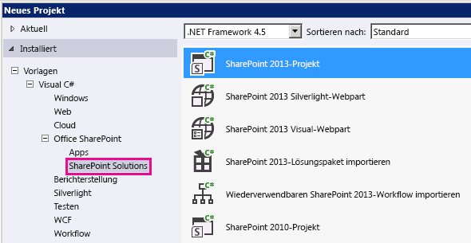
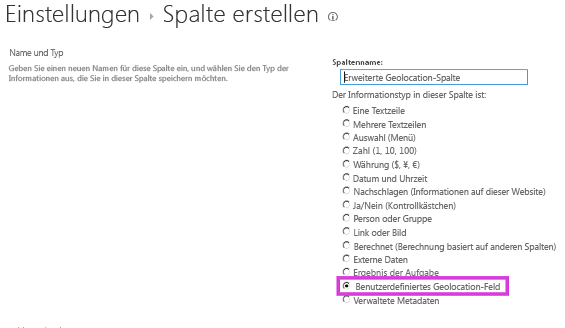

# <a name="extend-the-geolocation-field-type-by-using-client-side-rendering"></a><span data-ttu-id="a51ba-102">Erweitern des Geolocation-Feldtyps mithilfe von clientseitigem Rendering</span><span class="sxs-lookup"><span data-stu-id="a51ba-102">Extend the Geolocation field type by using client-side rendering</span></span>

<span data-ttu-id="a51ba-103">In diesem Artikel erfahren Sie, wie Sie den Geolocation-Feldtyp von SharePoint programmgesteuert mithilfe von clientseitigem Rendering anpassen.</span><span class="sxs-lookup"><span data-stu-id="a51ba-103">Learn how to customize the SharePoint Geolocation field type programmatically using client-side rendering.</span></span>

<span data-ttu-id="a51ba-p101">SharePoint führt einen neuen Feldtyp namens Geolocation, die Ihnen das Hinzufügen von SharePoint-Listen mit Standortinformationen Anmerkungen ermöglicht. In Spalten vom Typ Geolocation können Sie Standortinformationen als ein Paar von Breiten- und Längengrad Koordinaten in decimal Grad eingeben, oder die Koordinaten des aktuellen Standort des Benutzers vom Browser abrufen, wenn sie die W3C Geolocation-API implementiert. Weitere Informationen über das Geolocation-Feld finden Sie unter  [Integrieren von Standort- und Kartenfunktionen in SharePoint](integrating-location-and-map-functionality-in-sharepoint.md). Geolocation-Feldtyp ist in den Standardinhaltstyp eine beliebige Liste oder Dokumentbibliothek in SharePoint nicht verfügbar. Geolocation-Feldtyp in SharePoint enthalten ist, jedoch nicht auf der Seite der Spalte erstellen für die Liste sichtbar ist; Sie müssen den Geolocation-Feldtyp programmgesteuert hinzufügen. Weitere Informationen finden Sie unter  [Vorgehensweise: Hinzufügen einer Geolocation-Spalte einer Liste in SharePoint programmgesteuert](how-to-add-a-geolocation-column-to-a-list-programmatically-in-sharepoint.md).</span><span class="sxs-lookup"><span data-stu-id="a51ba-p101">SharePoint introduces a new field type named Geolocation that enables you to annotate SharePoint lists with location information. In columns of type Geolocation, you can enter location information as a pair of latitude and longitude coordinates in decimal degrees, or retrieve the coordinates of the user's current location from the browser if it implements the W3C Geolocation API. For more information about the Geolocation field, see  [Integrating location and map functionality in SharePoint](integrating-location-and-map-functionality-in-sharepoint.md). The Geolocation field type is not available in the default content type of any list or document library in SharePoint. The Geolocation field type is included in SharePoint but isn't visible on the create column page for the list; you must add the Geolocation field type programmatically. For more information, see  [How to: Add a Geolocation column to a list programmatically in SharePoint](how-to-add-a-geolocation-column-to-a-list-programmatically-in-sharepoint.md).</span></span> 
  
    
    

<span data-ttu-id="a51ba-p102">Nachdem Sie den Geolocation-Feldtyp SharePoint hinzugefügt haben, können Sie es zum Rendern von Karten mithilfe von Bing Maps verwenden. Das integrierte Geolocation-Feld kann nur mit Bing Maps gerendert werden. Jedoch können Sie ein benutzerdefiniertes Feld erstellen, mit der Geolocation-Feld als einen übergeordneten Feldtyp. Benutzerdefiniertes Rendering kann über die **JSLink** -Eigenschaft in clientseitiges Rendering Framework bereitgestellt werden. Clientseitiges Rendering Rahmen wird in SharePoint eingeführt. Weitere Informationen finden Sie unter [Vorgehensweise: Anpassen eines Feldtyps mithilfe vom clientseitigem Rendering](how-to-customize-a-field-type-using-client-side-rendering.md).</span><span class="sxs-lookup"><span data-stu-id="a51ba-p102">After you add the Geolocation field type to SharePoint, you can use it to render maps by using Bing Maps. The built-in Geolocation field can render only with Bing Maps. However, you can create a custom field by using the Geolocation field as a parent field type. Custom rendering can be provided through the **JSLink** property in the client-side rendering framework. The client-side rendering framework is introduced in SharePoint. For more information, see [How to: Customize a field type using client-side rendering](how-to-customize-a-field-type-using-client-side-rendering.md).</span></span> 

> [!NOTE]
> <span data-ttu-id="a51ba-p103">Die JSLink-Eigenschaft wird nicht für Umfrage- oder Ereignislisten unterstützt. Ein SharePoint-Kalender ist eine Ereignisliste.</span><span class="sxs-lookup"><span data-stu-id="a51ba-p103">The JSLink property is not supported on Survey or Events lists. A SharePoint calendar is an Events list.</span></span> 
  
    
    

<span data-ttu-id="a51ba-118">Mit dem Verfahren in diesem Abschnitt erstellen Sie ein benutzerdefiniertes Feld, das mit clientseitigem Rendering vom Geolocation-Feldtyp abgeleitet wird.</span><span class="sxs-lookup"><span data-stu-id="a51ba-118">In the procedure of this section, you create a custom field derived from Geolocation field type using client-side rendering..</span></span> 
## <a name="prerequisites-for-creating-a-custom-geolocation-field"></a><span data-ttu-id="a51ba-119">Voraussetzungen für die Erstellung eines benutzerdefinierten Geolocation-Felds</span><span class="sxs-lookup"><span data-stu-id="a51ba-119">Prerequisites for creating a custom Geolocation field</span></span>
<span data-ttu-id="a51ba-120"><a name="CreatingCustomGeolocation_prereq"> </a></span><span class="sxs-lookup"><span data-stu-id="a51ba-120"><a name="CreatingCustomGeolocation_prereq"> </a></span></span>

<span data-ttu-id="a51ba-121">Sie müssen über Folgendes verfügen:</span><span class="sxs-lookup"><span data-stu-id="a51ba-121">You must have the following:</span></span>
  
    
    

- <span data-ttu-id="a51ba-122">Ein Server mit SharePoint</span><span class="sxs-lookup"><span data-stu-id="a51ba-122">A server running SharePoint</span></span>
    
  
- <span data-ttu-id="a51ba-123">Microsoft Visual Studio 2012</span><span class="sxs-lookup"><span data-stu-id="a51ba-123">Microsoft Visual Studio 2012</span></span>
    
  
- <span data-ttu-id="a51ba-124">Office Developer Tools für Visual Studio 2012</span><span class="sxs-lookup"><span data-stu-id="a51ba-124">Office Developer Tools for Visual Studio 2012</span></span>
    
  
- <span data-ttu-id="a51ba-125">Zugriff auf eine Liste SharePoint mit ausreichenden Berechtigungen zum Hinzufügen einer Spalte</span><span class="sxs-lookup"><span data-stu-id="a51ba-125">Access to a SharePoint list, with sufficient privileges to add a column</span></span>
    
  

### <a name="core-concepts-to-know-for-customizing-the-geolocation-field"></a><span data-ttu-id="a51ba-126">Kernkonzepte für das Anpassen des Geolocation-Felds</span><span class="sxs-lookup"><span data-stu-id="a51ba-126">Core concepts to know for customizing the Geolocation field</span></span>


  
    
    

<span data-ttu-id="a51ba-127">**In Tabelle 1. Zentrale Konzepte zur Erweiterung der Geolocation-Feldtyp**</span><span class="sxs-lookup"><span data-stu-id="a51ba-127">**Table 1. Core concepts for extending the Geolocation field type**</span></span>


|<span data-ttu-id="a51ba-128">**Titel des Artikels**</span><span class="sxs-lookup"><span data-stu-id="a51ba-128">**Article title**</span></span>|<span data-ttu-id="a51ba-129">**Beschreibung**</span><span class="sxs-lookup"><span data-stu-id="a51ba-129">**Description**</span></span>|
|:-----|:-----|
| [<span data-ttu-id="a51ba-130">Integrieren von Standort- und Kartenfunktionen in SharePoint</span><span class="sxs-lookup"><span data-stu-id="a51ba-130">Integrating location and map functionality in SharePoint</span></span>](integrating-location-and-map-functionality-in-sharepoint.md) <br/> |<span data-ttu-id="a51ba-131">Erfahren Sie, wie Sie Standortinformationen und Karten in SharePoint-Listen und standortbasierte Web und mobilen apps mithilfe des neuen Geolocation-Felds und Erstellen eigener Geolocation-basierte Feldtypen integrieren.</span><span class="sxs-lookup"><span data-stu-id="a51ba-131">Learn how to integrate location information and maps in SharePoint lists and location-based web and mobile apps by using the new Geolocation field, and by creating your own Geolocation-based field types.</span></span>  <br/> |
| [<span data-ttu-id="a51ba-132">Vorgehensweise: Anpassen eines Feldtyps mithilfe vom clientseitigem Rendering</span><span class="sxs-lookup"><span data-stu-id="a51ba-132">How to: Customize a field type using client-side rendering</span></span>](how-to-customize-a-field-type-using-client-side-rendering.md) <br/> |<span data-ttu-id="a51ba-133">Erfahren Sie mehr über das neue clientseitige Rendering in SharePoint eingeführt.</span><span class="sxs-lookup"><span data-stu-id="a51ba-133">Learn more about the new client-side rendering introduced in SharePoint.</span></span>  <br/> |
| [<span data-ttu-id="a51ba-134">Vorgehensweise: Hinzufügen einer Geolocation-Spalte einer Liste in SharePoint programmgesteuert</span><span class="sxs-lookup"><span data-stu-id="a51ba-134">How to: Add a Geolocation column to a list programmatically in SharePoint</span></span>](how-to-add-a-geolocation-column-to-a-list-programmatically-in-sharepoint.md) <br/> |<span data-ttu-id="a51ba-135">Informationen Sie zum Hinzufügen einer Geolocation-Spalteninhalts zu einer Liste programmgesteuert in SharePoint.</span><span class="sxs-lookup"><span data-stu-id="a51ba-135">Learn how to add a Geolocation column to a list programmatically in SharePoint.</span></span>  <br/> |
   

## <a name="step-1-set-up-the-visual-studio-project"></a><span data-ttu-id="a51ba-136">Schritt 1: Einrichten des Visual Studio-Projekts</span><span class="sxs-lookup"><span data-stu-id="a51ba-136">Step 1: Set up the Visual Studio project</span></span>
<span data-ttu-id="a51ba-137"><a name="CreatingCustomGeolocationStep_1"> </a></span><span class="sxs-lookup"><span data-stu-id="a51ba-137"><a name="CreatingCustomGeolocationStep_1"> </a></span></span>


### <a name="to-set-up-the-custom-field-project"></a><span data-ttu-id="a51ba-138">So richten Sie das Projekt für das benutzerdefinierte Feld ein</span><span class="sxs-lookup"><span data-stu-id="a51ba-138">To set up the custom field project</span></span>


1. <span data-ttu-id="a51ba-139">Starten Sie Visual Studio 2012 auf demselben Computer, auf dem SharePoint installiert ist.</span><span class="sxs-lookup"><span data-stu-id="a51ba-139">Start Visual Studio 2012 on the same computer where SharePoint is installed.</span></span>
    
  
2. <span data-ttu-id="a51ba-p104">Wählen Sie im Dialogfeld **Neues Projekt** unter **Installierte Vorlagen** **Visual c#**, **Office SharePoint**, **SharePoint-Lösungen**. Wählen Sie den **SharePoint**-Projekttyp. Abbildung 1 zeigt den Speicherort der Vorlage **SharePoint-Projekts** in Visual Studio 2012. Erleichtern Sie eine **farmlösung**, nicht in einer sandkastenlösung.</span><span class="sxs-lookup"><span data-stu-id="a51ba-p104">In the **New Project** dialog box, under **Installed templates**, choose **Visual C#**, **Office SharePoint**, **SharePoint Solutions**. Choose the **SharePoint** project type. Figure 1 shows the location of the **SharePoint Project** template in Visual Studio 2012. Make it a **farm solution**, not a sandboxed solution.</span></span>
    
   <span data-ttu-id="a51ba-144">**Abbildung 1. SharePoint-Projektvorlage in Visual Studio**</span><span class="sxs-lookup"><span data-stu-id="a51ba-144">**Figure 1. SharePoint project template in Visual Studio**</span></span>

  

  
  

  

  
3. <span data-ttu-id="a51ba-p105">Geben Sie einen Namen für das Projekt. In diesem Beispiel verwenden wir **CustomGeolocationField**. Wählen Sie dann die Schaltfläche **OK**.</span><span class="sxs-lookup"><span data-stu-id="a51ba-p105">Specify a name for the project. We are using **CustomGeolocationField** in this example. Then choose the **OK** button.</span></span>
    
  
4. <span data-ttu-id="a51ba-149">Geben Sie im **Assistenten zum Anpassen von SharePoint** die URL für die SharePoint-Website, wo Sie Ihre neuen benutzerdefinierten Feldtyps bereitstellen möchten.</span><span class="sxs-lookup"><span data-stu-id="a51ba-149">In the **SharePoint Customization Wizard**, enter the URL for the SharePoint site where you want to deploy your new custom field type.</span></span>
    
  
5. <span data-ttu-id="a51ba-150">Öffnen Sie im **Projektmappen-Explorer** das Kontextmenü für den Projektnamen (in unserem Beispiel, es ist **CustomGeolocationField** ), und wählen Sie **Hinzufügen** und **Neues Element**.</span><span class="sxs-lookup"><span data-stu-id="a51ba-150">In **Solution Explorer**, open the shortcut menu for the project name (in our example, it is **CustomGeolocationField**), and choose **Add**, **New Item**.</span></span>
    
  
6. <span data-ttu-id="a51ba-151">Klicken Sie im Dialogfeld **Neues Element hinzufügen** unter dem Vorlagen **Code** wählen Sie **Klasse aus**, und geben Sie den Namen für die Klasse (in diesem Beispiel **CustomGeolocationField.cs** ).</span><span class="sxs-lookup"><span data-stu-id="a51ba-151">In the **Add New Item** dialog box, under the **Code** templates, choose **Class**, and specify the name for the class ( **CustomGeolocationField.cs** in this example).</span></span>
    
  
7. <span data-ttu-id="a51ba-152">Klicken Sie im **Projektmappen-Explorer** öffnen Sie das Kontextmenü für den Projektnamen, und wählen Sie **Hinzufügen** und **zugeordneten SharePoint-Ordner**.</span><span class="sxs-lookup"><span data-stu-id="a51ba-152">In **Solution Explorer**, open the shortcut menu for the project name, and choose **Add**, **SharePoint mapped folder**.</span></span>
    
  
8. <span data-ttu-id="a51ba-153">Klicken Sie im Dialogfeld **Zugeordneten SharePoint-Ordner hinzufügen** mithilfe der Strukturansicht den Ordner **TEMPLATE\\LAYOUTS** zuzuordnen, und wählen Sie die Schaltfläche **OK**.</span><span class="sxs-lookup"><span data-stu-id="a51ba-153">In the **Add SharePoint Mapped Folder** dialog box, use the tree control to map the folder to **TEMPLATE\\LAYOUTS**, and choose the **OK** button.</span></span>
    
  
9. <span data-ttu-id="a51ba-154">Klicken Sie im **Projektmappen-Explorer** öffnen Sie das Kontextmenü für den neuen Ordner " **LAYOUTS** " (nicht auf den Projektnamen), und wählen Sie **Hinzufügen** und **Neues Element**.</span><span class="sxs-lookup"><span data-stu-id="a51ba-154">In **Solution Explorer**, open the shortcut menu for the new **LAYOUTS** folder (not the project name), and choose **Add**, **New Item**.</span></span>
    
  
10. <span data-ttu-id="a51ba-155">Klicken Sie im Dialogfeld **Neues Element hinzufügen** wählen Sie **Visual C#-** **Web**, und wählen Sie dann **Javascript-Datei** unter **Vorlagen**.</span><span class="sxs-lookup"><span data-stu-id="a51ba-155">In the **Add New Item** dialog box, choose **Visual C#**, **Web**, and then choose **Javascript File** under **Templates**.</span></span>
    
  
11. <span data-ttu-id="a51ba-156">Klicken Sie im Feld **Name** Geben Sie den Namen für die Datei (CustomGeolocationField in unserem Beispiel), und wählen Sie **Hinzufügen**.</span><span class="sxs-lookup"><span data-stu-id="a51ba-156">In the **Name** box, specify the name for the file (CustomGeolocationField in our example), and choose **Add**.</span></span>
    
  
12. <span data-ttu-id="a51ba-p106">Wiederholen Sie Schritt 8, wenn Sie einen anderen zugeordneten SharePoint-Ordner zu erstellen, und ordnen Sie es **template\\xml zu**. Wählen Sie dann die Schaltfläche **OK**.</span><span class="sxs-lookup"><span data-stu-id="a51ba-p106">Repeat step 8 to create another SharePoint mapped folder, and map it to **TEMPLATE\\XML**. Then choose the **OK** button.</span></span>
    
  
13. <span data-ttu-id="a51ba-159">Klicken Sie im **Projektmappen-Explorer** öffnen Sie das Kontextmenü für den neuen Ordner **XML** (nicht auf den Projektnamen), und wählen Sie **Hinzufügen** und **Neues Element**.</span><span class="sxs-lookup"><span data-stu-id="a51ba-159">In **Solution Explorer**, open the shortcut menu for the new **XML** folder (not the project name), and choose **Add**, **New Item**.</span></span>
    
  
14. <span data-ttu-id="a51ba-160">Klicken Sie im Dialogfeld **Neues Element hinzufügen** wählen Sie **Visual C#-** **Daten**, und wählen Sie dann **XML-Datei** unter **Vorlagen**.</span><span class="sxs-lookup"><span data-stu-id="a51ba-160">In the **Add New Item** dialog box, choose **Visual C#**, **Data**, and then choose **XML File** under **Templates**.</span></span>
    
  
15. <span data-ttu-id="a51ba-161">Geben Sie im Feld **Name** den Namen für die Datei (in diesem Beispiel wirdfldtypes_CustomGeolocationControl.xml), und wählen Sie die Schaltfläche **Hinzufügen**.</span><span class="sxs-lookup"><span data-stu-id="a51ba-161">In the **Name** box, specify the name for the file (this example usesfldtypes_CustomGeolocationControl.xml), and choose the **Add** button.</span></span>
    
  

## <a name="step-2-create-a-custom-field-class"></a><span data-ttu-id="a51ba-162">Schritt 2: Erstellen einer benutzerdefinierten Feldklasse</span><span class="sxs-lookup"><span data-stu-id="a51ba-162">Step 2: Create a custom field class</span></span>
<span data-ttu-id="a51ba-163"><a name="CreatingCustomGeolocationStep_2"> </a></span><span class="sxs-lookup"><span data-stu-id="a51ba-163"><a name="CreatingCustomGeolocationStep_2"> </a></span></span>

 <span data-ttu-id="a51ba-p107">Eine Feldklasse ist eine Klasse, deren Instanzen können bestimmte Felder darstellen, die auf benutzerdefinierten Feldtyps basieren. Diese Klasse muss von **SPField** oder eine der Klassen in SharePoint Foundation, die sich daraus ableiten erben. Diese Klasse muss zum Aktivieren Sie erweitern oder Anpassen des Geolocation-Feldtyps von **SPFieldGeolocation**erben. Weitere Informationen zum Erstellen von Feldtypen finden Sie unter  [Walkthrough: Creating a Custom Field Type]((http://msdn.microsoft.com/library/089a1b8a-cafc-4050-b445-16650602fe4f%28Office.15%29.aspx)).</span><span class="sxs-lookup"><span data-stu-id="a51ba-p107">A field class is a class whose instances can represent particular fields that are based on your custom field type. This class must inherit from **SPField** or one of the classes in SharePoint Foundation that derive from it. To enable you to extend or customize the Geolocation field type, this class must inherit from **SPFieldGeolocation**. For more information about creating field types, see  [Walkthrough: Creating a Custom Field Type]((http://msdn.microsoft.com/library/089a1b8a-cafc-4050-b445-16650602fe4f%28Office.15%29.aspx)).</span></span> 
  
> [!NOTE]
> <span data-ttu-id="a51ba-168">In diesem Beispiel werden die Klasse und die Lösung **CustomGeolocationField** benannt. Sie können den Namen der Klasse und des Projekts beim Erstellen des Visual Studio-Projekts angeben.</span><span class="sxs-lookup"><span data-stu-id="a51ba-168">**Note:** In this example, the class and solution are named CustomGeolocationField; you can specify the name of the class and project that you want as you create your Visual Studio project.</span></span> 
  
    
    


### <a name="to-create-a-custom-field-class"></a><span data-ttu-id="a51ba-169">So erstellen Sie eine Klasse für ein benutzerdefiniertes Feld</span><span class="sxs-lookup"><span data-stu-id="a51ba-169">To create a custom field class</span></span>


1. <span data-ttu-id="a51ba-170">Öffnen Sie die Datei CustomGeolocationField.cs, und fügen Sie eine Richtlinie **using** wie folgt hinzu.</span><span class="sxs-lookup"><span data-stu-id="a51ba-170">Open the CustomGeolocationField.cs file, and add a **using** directive as follows.</span></span>
    
```cs
  
using System;
using Microsoft.SharePoint;
using Microsoft.SharePoint.WebControls;
```

2. <span data-ttu-id="a51ba-171">Stellen Sie sicher, dass der Namespace **CustomGeolocationField**ist.</span><span class="sxs-lookup"><span data-stu-id="a51ba-171">Ensure that the namespace is **CustomGeolocationField**.</span></span> 
    
  
3. <span data-ttu-id="a51ba-p108">Achten Sie darauf, dass die Klasse **CustomGeolocationField**heißt, und ändern Sie die Deklaration so, dass es von **SPFieldGeolocation**erbt. Fügen Sie die folgenden erforderlichen Konstruktoren für die Klasse hinzu.</span><span class="sxs-lookup"><span data-stu-id="a51ba-p108">Be sure that the class is named **CustomGeolocationField**, and change its declaration to specify that it inherits from **SPFieldGeolocation**. Add the following required constructors for the class.</span></span>
    
```cs
  
public class CustomGeolocationField : SPFieldGeolocation
    {
        /// <summary>
        /// Create an instance of CustomGeolocationField object.
        /// </summary>
        /// <param name="fields">Field collection</param>
        /// <param name="fieldName">Name of the field</param>
        /// 
        public CustomGeolocationField(SPFieldCollection fields, string fieldName)
            : base(fields, fieldName)
        {
        }

        /// <summary>
        /// Create an instance of CustomGeolocationField object.
        /// </summary>
        /// <param name="fields">Field collection</param>
        /// <param name="typeName">type name of the field</param>
        /// <param name="displayName">display name of the field</param>

        public CustomGeolocationField(SPFieldCollection fields, string typeName, string displayName)
            : base(fields, typeName, displayName)
        {
        }
```

4. <span data-ttu-id="a51ba-p109">Die folgende Überschreibung der **JSLink** -Methode der Klasse hinzufügen. CustomGeolocationControl.js ist eine JavaScript-Datei, die Sie im nächsten Schritt erstellen. Durch die Bereitstellung einer eigenen Datei JavaScript, überschreiben Sie die Standardwiedergabe von Bing Maps. Wenn Sie diese Methode nicht überschreiben, werden standardmäßig von Bing Maps. Die **JSLink** -Eigenschaft wird in SharePoint eingeführt. Weitere Informationen über die **JSLink** -Eigenschaft finden Sie unter [Vorgehensweise: Anpassen eines Feldtyps mithilfe vom clientseitigem Rendering](how-to-customize-a-field-type-using-client-side-rendering.md).</span><span class="sxs-lookup"><span data-stu-id="a51ba-p109">Add the following override of the **JSLink** method to the class. CustomGeolocationControl.js is a JavaScript file that you create in the following step. By providing your own JavaScript file, you are overriding the default rendering of Bing Maps. If you do not override this method, the default rendering will be from Bing Maps. The **JSLink** property is introduced in SharePoint. For more information about the **JSLink** property, see [How to: Customize a field type using client-side rendering](how-to-customize-a-field-type-using-client-side-rendering.md).</span></span>
    
```cs
  
/// <summary>
        /// Override JSLink property.
        /// </summary>

public override string JSLink
        {
            get
            {
                return "CustomGeolocationControl.js";
            }
            set
            {
                base.JSLink = value;
            }
        }
```

5. <span data-ttu-id="a51ba-p110">Die **GetFieldValue** -Methode konvertiert den angegebenen Wert in einen Wert vom Typ dar. Weitere Informationen über die **GetFieldValue** -Methode finden Sie unter [GetFieldValue(String)]((https://msdn.microsoft.com/library/Microsoft.SharePoint.SPField.GetFieldValue.aspx)) . Die folgende Überschreibung der **GetFieldValue** -Methode der **CustomGeolocationField** -Klasse hinzufügen.</span><span class="sxs-lookup"><span data-stu-id="a51ba-p110">The **GetFieldValue** method converts the specified value into a field type value. For more information about the **GetFieldValue** method, see [GetFieldValue(String)]((https://msdn.microsoft.com/library/Microsoft.SharePoint.SPField.GetFieldValue.aspx)) . Add the following override of the **GetFieldValue** method to the **CustomGeolocationField** class.</span></span>
    
```cs
  
/// <summary>
        /// get the field values
        /// </summary>
        /// <param name="value"></param>
        /// <returns></returns>
        
        public override object GetFieldValue(string value)
        {
            return base.GetFieldValue(value);
        }
```

6. <span data-ttu-id="a51ba-183">Die folgende Überschreibung der  [GetValidatedString]((https://msdn.microsoft.com/library/Microsoft.SharePoint.SPField.GetValidatedString.aspx)) -Methode der **CustomGeolocationField** -Klasse hinzufügen:</span><span class="sxs-lookup"><span data-stu-id="a51ba-183">Add the following override of the  [GetValidatedString]((https://msdn.microsoft.com/library/Microsoft.SharePoint.SPField.GetValidatedString.aspx)) method to the **CustomGeolocationField** class:</span></span>
    
```cs
  
/// <summary>
        /// get validated string
        /// </summary>
        /// <param name="value"></param>
        /// <returns></returns>
        
       public override string GetValidatedString(object value)
        {
            return base.GetValidatedString(value);
        }
```


## <a name="step-3-create-rendering-for-the-new-custom-field"></a><span data-ttu-id="a51ba-184">Schritt 3: Erstellen von Rendering für das neue benutzerdefinierte Feld</span><span class="sxs-lookup"><span data-stu-id="a51ba-184">Step 3: Create rendering for the new custom field</span></span>
<span data-ttu-id="a51ba-185"><a name="CreatingCustomGeolocationStep_3"> </a></span><span class="sxs-lookup"><span data-stu-id="a51ba-185"><a name="CreatingCustomGeolocationStep_3"> </a></span></span>

<span data-ttu-id="a51ba-p111">Im nächsten Schritt sollten Sie die Datei JavaScript erstellen, der auf die **JSLink** -Methode der Feldklasse verweist. Diese Datei sollte das Rendering des benutzerdefinierten Feldtyps mit dem neuen Framework clientseitiges Rendering definieren. Weitere Informationen finden Sie unter [Vorgehensweise: Anpassen eines Feldtyps mithilfe vom clientseitigem Rendering](how-to-customize-a-field-type-using-client-side-rendering.md).</span><span class="sxs-lookup"><span data-stu-id="a51ba-p111">Next, you should create the JavaScript file that the **JSLink** method of the field class points to. This file should define the rendering of the custom field type using the new client-side rendering framework. For more information, see [How to: Customize a field type using client-side rendering](how-to-customize-a-field-type-using-client-side-rendering.md).</span></span>
  
    
    
<span data-ttu-id="a51ba-189">Das folgende Beispiel zeigt die Registrierung Logik für das Registrieren von mit dem Client Side Rendering Framework in SharePoint eingeführt.</span><span class="sxs-lookup"><span data-stu-id="a51ba-189">The following example shows the registration logic for registering with the client side rendering framework introduced in SharePoint.</span></span>
  
    
    


```

function _registerCustomGeolocationFieldTemplate() {
          
            var geolocationFieldContext = {};
            geolocationFieldContext.Templates = {};
            geolocationFieldContext.Templates.Fields = {

                'CustomGeolocationField': {
                    'View': CustomGeolocationFieldTemplate.RenderGeolocationField,
                    'DisplayForm': CustomGeolocationFieldTemplate.SPFieldGeolocation_Display,
                    'EditForm': CustomGeolocationFieldTemplate.SPFieldGeolocation_Edit,
                    'NewForm': CustomGeolocationFieldTemplate.SPFieldGeolocation_Edit
                }
            };
            SPClientTemplates.TemplateManager.RegisterTemplateOverrides(geolocationFieldContext);
        }
```

<span data-ttu-id="a51ba-p112">In den Registrierungsprozess sind vier Variablen und ihre entsprechenden Methoden. Das clientseitiges Rendering-Framework ruft diese Methoden für das Rendering **CustomGeolocationControl**.</span><span class="sxs-lookup"><span data-stu-id="a51ba-p112">In the registration process there are four variables and their respective methods. The client-side rendering framework calls these methods for rendering **CustomGeolocationControl**.</span></span>
  
    
    
<span data-ttu-id="a51ba-192">Das folgende Codebeispiel erstellt neues Rendering für ein neues benutzerdefiniertes Feld für neues benutzerdefiniertes Feld, das von Geolocation abgeleitet ist.</span><span class="sxs-lookup"><span data-stu-id="a51ba-192">The following code example creates new rendering for a new custom field for new custom field that is derived from Geolocation.</span></span>
  
    
    

### <a name="to-create-the-javascript-file"></a><span data-ttu-id="a51ba-193">So erstellen Sie die Datei JavaScript</span><span class="sxs-lookup"><span data-stu-id="a51ba-193">To create the JavaScript file</span></span>


1. <span data-ttu-id="a51ba-p113">Erstellen Sie eine Textdatei und geben Sie einen Namen, beispielsweise X, weisen Sie ihr eine JS-Erweiterung und die TEMPLATE\\LAYOUTS zugeordneten SharePoint-Ordner speichern. In diesem Beispiel wird der Name **CustomGeolocationControl.js** verwendet.</span><span class="sxs-lookup"><span data-stu-id="a51ba-p113">Create a text file and specify a name, such as x, give it a .js extension, and save it to the SharePoint-mapped TEMPLATE\\LAYOUTS folder. This example uses the name **CustomGeolocationControl.js**.</span></span>
    
  
2. <span data-ttu-id="a51ba-196">Kopieren Sie den folgenden Code in die JS-Datei.</span><span class="sxs-lookup"><span data-stu-id="a51ba-196">Copy the following code into the .js file.</span></span>
    
```
  
(function () {
        if (typeof CustomGeolocationFieldTemplate == "object") {
            return;
        }
        window.CustomGeolocationFieldTemplate = (function () {
            return {
                SPFieldGeolocation_Display: function (rCtx) {
                    if (rCtx == null || rCtx.CurrentFieldValue == null || rCtx.CurrentFieldValue == '')
                        return '';
                    var listItem = rCtx['CurrentItem'];
                    var fldvalue = CustomGeolocationFieldTemplate.ParseGeolocationValue(listItem[rCtx.CurrentFieldSchema.Name]);
                    var _myData = SPClientTemplates.Utility.GetFormContextForCurrentField(rCtx);

                    if (_myData == null || _myData.fieldSchema == null)
                        return '';
                    var _latitude = 0;
                    var _longitude = 0;

                    if (fldvalue != null) {
                        _latitude = fldvalue.latitude;
                        _longitude = fldvalue.longitude;
                    }
                  
                    var result = '<div>';
                    result += '<span>Latitude:</span><span>' + _latitude + '</span><span>Longitude:</span><span>' + _longitude + '</span>';
                    result += '</div>';
                    return result;
                },                
                ParseGeolocationValue: function (fieldValue) {

                    if (fieldValue == null || fieldValue == '')
                        return null;

                    var point = new Object();
                    point.longitude = null;
                    point.latitude = null;
                    point.altitude = null;
                    point.measure = null;

                    var matches = fieldValue.match(/POINT\\s*\\((\\d+(\\.\\d+)?)\\s+(\\d+(\\.\\d+)?)\\s+(\\d+(\\.\\d+)?)\\s+(\\d+(\\.\\d+)?)\\)/i);
                    if (matches != null) {

                        point.longitude = parseFloat(matches[1]);
                        point.latitude = parseFloat(matches[3]);
                        point.altitude = parseFloat(matches[5]);
                        point.measure = parseFloat(matches[7]);
                    }
                    else
                    {
                        matches = fieldValue.match(/POINT\\s*\\((\\d+(\\.\\d+)?)\\s+(\\d+(\\.\\d+)?)\\)/i);
                        if (matches != null) {

                            point.longitude = parseFloat(matches[1]);
                            point.latitude = parseFloat(matches[3]);
                        }
                    }
                    return point;
                },
                SPFieldGeolocation_Edit: function (rCtx) {
                    if (rCtx == null)
                        return '';
                    var _myData = SPClientTemplates.Utility.GetFormContextForCurrentField(rCtx);

                    if (_myData == null || _myData.fieldSchema == null)
                        return '';
                    var _latitude = null;
                    var _longitude = null;
                    var _inputId_Latitude = _myData.fieldName + '_' + _myData.fieldSchema.Id + '_$geolocationField_Latitude';
                    var _inputId_Longitude = _myData.fieldName + '_' + _myData.fieldSchema.Id + '_$geolocationField_Longitude';
                    var _inputId_Div = _myData.fieldName + '_' + _myData.fieldSchema.Id + '_$geolocationField_Div';
                    var _latitudeBox = null;
                    var _longitudeBox = null;

                    var _value = _myData.fieldValue != null ? _myData.fieldValue : '';
                    var listItem = rCtx['CurrentItem'];
                    var fldvalue = CustomGeolocationFieldTemplate.ParseGeolocationValue(listItem[rCtx.CurrentFieldSchema.Name]);

                    if (fldvalue != null) {
                        _latitude = fldvalue.latitude;
                        _longitude = fldvalue.longitude;
                    }

                    var validators = new SPClientForms.ClientValidation.ValidatorSet();

                    if (_myData.fieldSchema.Required)
                        validators.RegisterValidator(new SPClientForms.ClientValidation.RequiredValidator());

                    _myData.registerClientValidator(_myData.fieldName, validators);

                    // Post DOM initialization callback.
                    _myData.registerInitCallback(_myData.fieldName, function () {

                        // Initialize the input control references.
                        _latitudeBox = document.getElementById(_inputId_Latitude);
                        _longitudeBox = document.getElementById(_inputId_Longitude);

                        // Set the initial values.
                        if ((_latitudeBox != null &amp;&amp; _longitudeBox != null) &amp;&amp;
                            (_latitude != null &amp;&amp; _longitude != null)) {
                            _latitudeBox.value = _latitude;
                            _longitudeBox.value = _longitude;
                        }
                    });
                    // On focus call back.
                    _myData.registerFocusCallback(_myData.fieldName, function () {
                        if (_latitudeBox != null)
                            _latitudeBox.focus();
                    });
                    // Validation failure handler.
                    _myData.registerValidationErrorCallback(_myData.fieldName, function (errorResult) {
                        SPFormControl_AppendValidationErrorMessage(_inputId_Div, "invalid Geolocation Field");
                    });

                    // Register a callback just before submit.
                    _myData.registerGetValueCallback(_myData.fieldName, function () {
                        if (_latitudeBox == null &amp;&amp; _longitudeBox == null)
                            return '';
                        else {
                            _latitude = _latitudeBox.value;
                            _longitude = _longitudeBox.value;

                            if (_latitude != null &amp;&amp; _longitude != null)
                                return "Point(" + _longitude + " " + _latitude + ")";
                        }
                    });
                    _myData.updateControlValue(_myData.fieldName, _value);

                    var result = '<div width="100%" id=' + STSHtmlEncode(_inputId_Div) + '>';
                    result += '<div><span>Latitude:</span><input id=' + STSHtmlEncode(_inputId_Latitude) + ' type="text" name="Latitude" /></div>';
                    result += '<div><span>Longitude:</span><input id=' + STSHtmlEncode(_inputId_Longitude) + ' type="text" name="Longitude" /></div>';
                    result += '</div>';
                    return result;

                },
                RenderGeolocationField: function (inCtx, field, listItem, listSchema) {
                    var fldvalue = CustomGeolocationFieldTemplate.ParseGeolocationValue(listItem[field.Name]);
                    var result = '';

                    if (fldvalue != null) {
                        var result = '<div>';
                        result += '<span>Latitude:</span><span>' + fldvalue.latitude + '</span><span>Longitude:</span><span>' + fldvalue.longitude + '</span>';
                        result += '</div>';                            
                    }
                    return result;                    
                }                                       
            };
        })();
        function _registerCustomGeolocationFieldTemplate() {
          
            var geolocationFieldContext = {};
            geolocationFieldContext.Templates = {};
            geolocationFieldContext.Templates.Fields = {

                'CustomGeolocationField': {
                    'View': CustomGeolocationFieldTemplate.RenderGeolocationField,
                    'DisplayForm': CustomGeolocationFieldTemplate.SPFieldGeolocation_Display,
                    'EditForm': CustomGeolocationFieldTemplate.SPFieldGeolocation_Edit,
                    'NewForm': CustomGeolocationFieldTemplate.SPFieldGeolocation_Edit
                }
            };
            SPClientTemplates.TemplateManager.RegisterTemplateOverrides(geolocationFieldContext);
        }
        ExecuteOrDelayUntilScriptLoaded(_registerCustomGeolocationFieldTemplate, 'clienttemplates.js');
    })();
```


## <a name="step-4-create-a-field-type-definition"></a><span data-ttu-id="a51ba-197">Schritt 4: Erstellen einer feldtypdefinition</span><span class="sxs-lookup"><span data-stu-id="a51ba-197">Step 4: Create a field type definition</span></span>
<span data-ttu-id="a51ba-198"><a name="CreatingCustomGeolocationStep_4"> </a></span><span class="sxs-lookup"><span data-stu-id="a51ba-198"><a name="CreatingCustomGeolocationStep_4"> </a></span></span>

<span data-ttu-id="a51ba-p114">Eine feldtypdefinition ist eine XML-Datei mit dem Namen  _fldtypes\*.xml_, die in %ProgramFiles%\\Common Files\\Microsoft Shared\\web Server extensions\\15\\TEMPLATE\\XML bereitgestellt wird. Eine Feld-Definitionsdatei enthält Informationen, SharePoint Foundation benötigt, um das Feld in Listenansichten und Formularen anzeigen, bearbeiten und neu ordnungsgemäß zu rendern. Der wichtigste enthält die Definition Informationen über die Assembly, die den kompilierten Feldtyp enthält. Weitere Informationen zu feldtypdefinitionen finden Sie unter [Vorgehensweise: Erstellen einer Custom Field Type Definition]((http://msdn.microsoft.com/library/b3315997-671f-4c29-9518-48cc4592f205%28Office.15%29.aspx)).</span><span class="sxs-lookup"><span data-stu-id="a51ba-p114">A field type definition is an XML file with a name like  _fldtypes\*.xml_ that is deployed to %ProgramFiles%\\Common Files\\Microsoft Shared\\web server extensions\\15\\TEMPLATE\\XML. A field definition file contains the information that SharePoint Foundation needs to correctly render the field in list views, and on the Display, Edit, and New forms. Most importantly, the definition contains information about the assembly that contains the compiled field type. For more information about field type definitions, see [How to: Create a Custom Field Type Definition]((http://msdn.microsoft.com/library/b3315997-671f-4c29-9518-48cc4592f205%28Office.15%29.aspx)).</span></span>
  
    
    

### <a name="to-create-the-field-type-definition"></a><span data-ttu-id="a51ba-203">So erstellen Sie die Feldtypdefinition</span><span class="sxs-lookup"><span data-stu-id="a51ba-203">To create the field type definition</span></span>


1. <span data-ttu-id="a51ba-p115">Erstellen Sie das Projekt in Visual Studio. Das Projekt ist noch nicht fertig, aber Sie müssen es jetzt erstellen, um eine GUID und ein öffentliches Schlüsseltoken für die Assembly zu generieren.</span><span class="sxs-lookup"><span data-stu-id="a51ba-p115">In Visual Studio, build the project. The project is not finished, but you need to build at this time to generate a GUID and a Public Key Token for the assembly.</span></span> 
    
  
2. <span data-ttu-id="a51ba-206">Öffnen Sie die Datei „fldtypes_CustomGeolocationControl.xml“, und ersetzen Sie deren Inhalt durch das folgende Markup.</span><span class="sxs-lookup"><span data-stu-id="a51ba-206">Open the fldtypes_CustomGeolocationControl.xml file, and replace its contents with the following markup.</span></span>
    
```XML
  
?xml version="1.0" encoding="utf-8" ?>

<FieldTypes>
  <FieldType>
    <Field Name="TypeName">CustomGeolocationField</Field>
    <Field Name="ParentType">Geolocation</Field>
    <Field Name="TypeDisplayName">Custom Geolocation field</Field>
    <Field Name="TypeShortDescription"> Custom Geolocation field </Field>
    <Field Name="UserCreatable">TRUE</Field>
    <Field Name="ShowOnListCreate">TRUE</Field>
    <Field Name="ShowOnSurveyCreate">TRUE</Field>
    <Field Name="ShowOnDocumentLibraryCreate">TRUE</Field>
    <Field Name="ShowOnColumnTemplateCreate">TRUE</Field>
    <Field Name="FieldTypeClass">CustomGeolocationField.CustomGeolocationField,$SharePoint.Project.AssemblyFullName$</Field>
    <Field Name="SQLType">nvarchar</Field>
  </FieldType>
</FieldTypes>

```


    This file defines the custom field type for SharePoint. For details about the purpose and meaning of its elements, see  [Custom Field Type Definition](http://msdn.microsoft.com/library/b3315997-671f-4c29-9518-48cc4592f205%28Office.15%29.aspx),  [FldTypes.xml](http://msdn.microsoft.com/library/8f8db866-03f8-4001-aae3-4c4102a7aed6%28Office.15%29.aspx),  [FieldTypes Element (Field Types)](http://msdn.microsoft.com/library/ebac779f-c7c5-401b-8503-e514cd96f5a7%28Office.15%29.aspx),  [FieldType Element (Field Types)](http://msdn.microsoft.com/library/9ab89988-3462-422f-9808-40618da7316b%28Office.15%29.aspx), and  [Field Element (Field Types)](http://msdn.microsoft.com/library/c168e8bc-8aba-4b72-a9c4-a0ad7a4aff9a%28Office.15%29.aspx). Note that the **<Field Name="FieldTypeClass">** element must be entirely on one line.
    
  
3. <span data-ttu-id="a51ba-p116">Der Wert des **<Field Name="FieldTypeClass">** -Elements ist der vollständig qualifizierte Name der der benutzerdefinierten Feldklasse gefolgt von einem Komma und ein Token Visual Studio ( `$SharePoint.Project.AssemblyFullName$`). Wenn Sie das Projekt kompilieren, wird eine Kopie dieser Datei erstellt, in dem das Token durch den vollständigen vierteiligen Namen der Assembly ersetzt wird. Die Kopie wird bereitgestellt, wenn Sie eine **Lösung bereitstellen**Visual Studio **Erstellen** im Menü Visual Studio 2012 auswählen.</span><span class="sxs-lookup"><span data-stu-id="a51ba-p116">The value of the **<Field Name="FieldTypeClass">** element is the fully qualified name of your custom field class followed by a comma and then a Visual Studio token ( `$SharePoint.Project.AssemblyFullName$`). When you compile the project, a copy of this file is created in which the token is replaced by the full four-part name of the assembly. That copy is deployed when you choose **Deploy Solution** on the Visual Studio **Build** menu in Visual Studio 2012.</span></span>
    
  

## <a name="step-5-build-and-test-the-custom-field-type"></a><span data-ttu-id="a51ba-210">Schritt 5: Erstellen Sie und Testen Sie den benutzerdefinierten Feldtyp</span><span class="sxs-lookup"><span data-stu-id="a51ba-210">Step 5: Build and test the custom field type</span></span>
<span data-ttu-id="a51ba-211"><a name="CreatingCustomGeolocationStep_5"> </a></span><span class="sxs-lookup"><span data-stu-id="a51ba-211"><a name="CreatingCustomGeolocationStep_5"> </a></span></span>

<span data-ttu-id="a51ba-212">Nachdem Sie ein benutzerdefiniertes Feld in der SharePoint-Server bereitstellen, steht eine neue benutzerdefinierte Spalte zum Hinzufügen zu einer beliebigen SharePoint-Liste auf dem Server, auf dem die Lösung bereitgestellt wird.</span><span class="sxs-lookup"><span data-stu-id="a51ba-212">After you deploy a custom field to the SharePoint server, a new custom column is available for you to add to any SharePoint list on the server where the solution is deployed.</span></span>
  
    
    

1. <span data-ttu-id="a51ba-213">Drücken Sie F5.</span><span class="sxs-lookup"><span data-stu-id="a51ba-213">Choose the F5 key.</span></span>
    
    > [!NOTE]
    > <span data-ttu-id="a51ba-214">Wenn Sie F5 drücken, erstellt Visual Studio die Projektmappe, stellt die Lösung bereit und öffnet die SharePoint-Website, auf der die Lösung bereitgestellt wird.</span><span class="sxs-lookup"><span data-stu-id="a51ba-214">Note: When you choose F5, Visual Studio builds the solution, deploys the solution, and opens the SharePoint website where the solution is deployed.</span></span> 

2. <span data-ttu-id="a51ba-215">Erstellen Sie eine benutzerdefinierte Liste, und fügen Sie eine neue benutzerdefinierte Geolocation-Feldspalte hinzu.</span><span class="sxs-lookup"><span data-stu-id="a51ba-215">Create a custom list and add a new Custom Geolocation field column.</span></span>
    
  
3. <span data-ttu-id="a51ba-216">Der Liste ein Element hinzu, und geben Sie Länge und Breite Werte für die benutzerdefinierte Geolocation-Spalte.</span><span class="sxs-lookup"><span data-stu-id="a51ba-216">Add one item to the list, and provide Longitude and Latitude values for the Custom Geolocation column.</span></span>
    
  
4. <span data-ttu-id="a51ba-217">Abbildung 2 zeigt mit den neuen benutzerdefinierten Feldtyp Seite Spalte erstellen.</span><span class="sxs-lookup"><span data-stu-id="a51ba-217">Figure 2 shows the create column page with the new custom field type.</span></span>
    
   <span data-ttu-id="a51ba-218">**Abbildung 2. Erstellen einer neuen Spalte mit benutzerdefiniertem Feldtyp**</span><span class="sxs-lookup"><span data-stu-id="a51ba-218">**Figure 2. Creating a new custom field type column**</span></span>

  

  
  

  

  

## <a name="see-also"></a><span data-ttu-id="a51ba-220">Siehe auch</span><span class="sxs-lookup"><span data-stu-id="a51ba-220">See also</span></span>
<span data-ttu-id="a51ba-221"><a name="SP15Createcustomgeo_addlresources"> </a></span><span class="sxs-lookup"><span data-stu-id="a51ba-221"><a name="SP15Createcustomgeo_addlresources"> </a></span></span>


-  [<span data-ttu-id="a51ba-222">Integrieren von Standort- und Kartenfunktionen in SharePoint</span><span class="sxs-lookup"><span data-stu-id="a51ba-222">Integrating location and map functionality in SharePoint</span></span>](integrating-location-and-map-functionality-in-sharepoint.md)
    
  
-  [<span data-ttu-id="a51ba-223">Vorgehensweise: Hinzufügen einer Geolocation-Spalte einer Liste in SharePoint programmgesteuert</span><span class="sxs-lookup"><span data-stu-id="a51ba-223">How to: Add a Geolocation column to a list programmatically in SharePoint</span></span>](how-to-add-a-geolocation-column-to-a-list-programmatically-in-sharepoint.md)
    
  
-  [<span data-ttu-id="a51ba-224">Vorgehensweise: Anpassen eines Feldtyps mithilfe vom clientseitigem Rendering</span><span class="sxs-lookup"><span data-stu-id="a51ba-224">How to: Customize a field type using client-side rendering</span></span>](how-to-customize-a-field-type-using-client-side-rendering.md)
    
  
-  <span data-ttu-id="a51ba-225">[SharePoint: Erstellen eines Geolocation-Felds, das Karten mithilfe von Nokia Maps wiedergibt]((http://code.msdn.microsoft.com/SharePoint-Create-a-d9a91551))</span><span class="sxs-lookup"><span data-stu-id="a51ba-225">[SharePoint: Create a Geolocation field that renders maps using Nokia Maps]((http://code.msdn.microsoft.com/SharePoint-Create-a-d9a91551))</span></span>
    
  
-  <span data-ttu-id="a51ba-226">[Vorgehensweise: erstellen ein benutzerdefinierten Feldtyps]((http://msdn.microsoft.com/library/aacdc6d1-86c8-4a6b-953d-22ecac209d0f%28Office.15%29.aspx))</span><span class="sxs-lookup"><span data-stu-id="a51ba-226">[How to: Create a Custom Field Type]((http://msdn.microsoft.com/library/aacdc6d1-86c8-4a6b-953d-22ecac209d0f%28Office.15%29.aspx))</span></span>
    
  
-  <span data-ttu-id="a51ba-227">[Bereitstellen von Dateien mithilfe von Ordnern zugeordnet sind]((http://blogs.msdn.com/b/vssharepointtoolsblog/archive/2010/03/12/deploying-files-using-mapped-folders.aspx))</span><span class="sxs-lookup"><span data-stu-id="a51ba-227">[Deploying files using Mapped Folders]((http://blogs.msdn.com/b/vssharepointtoolsblog/archive/2010/03/12/deploying-files-using-mapped-folders.aspx))</span></span>
    
  

