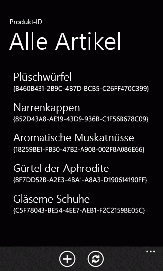

# <a name="support-and-convert-sharepoint-field-types-for-windows-phone-apps"></a><span data-ttu-id="c205c-102">Unterstützen und Konvertieren von SharePoint-Feldtypen für Windows Phone-Apps</span><span class="sxs-lookup"><span data-stu-id="c205c-102">Support and convert SharePoint field types for Windows Phone apps</span></span>

<span data-ttu-id="c205c-p101">Implementieren Sie die Datenkonvertierungslogik, um SharePoint-Feldtypen in Windows Phone-Apps zu unterstützen. In Projekten basierend auf die Vorlage Windows Phone SharePoint List Application die Daten der viele SharePoint-Feldtypen verarbeitet und vom Standard Konvertierungslogik, eignet sich für die Anzeige und Bearbeitung in der Silverlight-Benutzeroberfläche von einer Windows Phone koordiniert, jedoch Entwickler können auch ihre eigenen benutzerdefinierten Datenverarbeitung Routinen implementieren.</span><span class="sxs-lookup"><span data-stu-id="c205c-p101">Implement data-conversion logic to support SharePoint field types in Windows Phone apps. In projects based on the Windows Phone SharePoint List Application template, the data of many SharePoint field types is processed and coordinated by default conversion logic to be suitable for display and manipulation in the Silverlight user interface of a Windows Phone, but developers can also implement their own custom data handling routines.</span></span>
  
    
    


> <span data-ttu-id="c205c-105">**Wichtig:** Wenn Sie eine App für Windows Phone 8 entwickeln, müssen Sie Visual Studio Express 2012 anstelle von Visual Studio 2010 Express verwenden.</span><span class="sxs-lookup"><span data-stu-id="c205c-105">**Important:** If you are developing an app for Windows Phone 8, you must use Visual Studio Express 2012 instead of Visual Studio 2010 Express.</span></span> <span data-ttu-id="c205c-106">Mit Ausnahme der Entwicklungsumgebung gelten alle Informationen in diesem Artikel für das Erstellen von Apps sowohl auf Windows Phone 8 als auch auf Windows Phone 7.</span><span class="sxs-lookup"><span data-stu-id="c205c-106">Except for the development environment, all information in this article applies to creating apps for both Windows Phone 8 and Windows Phone 7.</span></span> <span data-ttu-id="c205c-107">Weitere Informationen finden Sie unter [Vorgehensweise: Einrichten einer Umgebung für die Entwicklung mobiler Apps für SharePoint](how-to-set-up-an-environment-for-developing-mobile-apps-for-sharepoint.md).</span><span class="sxs-lookup"><span data-stu-id="c205c-107">> For more information, see  [How to: Set up an environment for developing mobile apps for SharePoint](how-to-set-up-an-environment-for-developing-mobile-apps-for-sharepoint.md).</span></span> 
  
    
    


## <a name="sharepoint-field-types-in-windows-phone-apps"></a><span data-ttu-id="c205c-108">SharePoint-Feldtypen in Apps für Windows Phone</span><span class="sxs-lookup"><span data-stu-id="c205c-108">SharePoint field types in Windows Phone apps</span></span>
<span data-ttu-id="c205c-109"><a name="BKMK_SharePointFieldTypes"> </a></span><span class="sxs-lookup"><span data-stu-id="c205c-109"><a name="BKMK_SharePointFieldTypes"> </a></span></span>

<span data-ttu-id="c205c-p103">SharePoint-Listen werden darstellten nach Feldern (in Spalten angeordnet sind), und ein bestimmtes Feld wird als Daten eines bestimmten Typs (d. h., Daten auf eine bestimmte Weise strukturiert) enthalten. Diese Typen werden Feldtypenbezeichnet. (Solche Typen können auch Spaltentypenbezeichnet werden, da Sie, wenn Sie eine SharePoint-Liste eine Spalte hinzufügen, mit einem bestimmten Typ von Daten verknüpften Felder in eine Spalte hinzufügen möchten.) Diese Felder sind durch ein XML-Schema definiert. Das Schema für ein Feld namens "Bestelldatum" mit einem **DateTime** Datentyp (dargestellt als Feld Datum und Uhrzeit in der Benutzeroberfläche von einer Microsoft SharePoint Server ) kann wie folgt aussehen.</span><span class="sxs-lookup"><span data-stu-id="c205c-p103">SharePoint lists are constituted by fields of data (arranged in columns), and a given field is designated to contain data of a certain type (that is, data structured in a certain way). These types are called field types. (Such types may also be called column types, because when you add a column to a SharePoint list, you are adding a column of fields associated with a certain type of data.) These fields are defined by an XML schema. The schema for a field called "Order Date" with a **DateTime** data type (represented as a Date and Time field in the user interface of a Microsoft SharePoint Server) might look like the following.</span></span>
  
    
    

```XML

<Field Type="DateTime" DisplayName="Order Date" Required="FALSE"
 EnforceUniqueValues="FALSE" Indexed="FALSE" Format="DateOnly"
 FriendlyDisplayFormat="Disabled" Name="Order_x0020_Date">
  <Default>[today]</Default>
  <DefaultFormulaValue>2012-01-10T00:00:00Z</DefaultFormulaValue>
</Field>
```

<span data-ttu-id="c205c-p104">Beachten Sie insbesondere den Wert des **Type** -Attributs des angegebenen Schemas-Elements **Field** hier als "DateTime". Listenfelder erstellt, um Daten auf andere Weise strukturiert enthalten möglicherweise mit einem **Type** -Wert der sag, "Choice" oder "Text" oder "Boolean" festgelegt werden.</span><span class="sxs-lookup"><span data-stu-id="c205c-p104">Notice in particular the value of the **Type** attribute of the **Field** element in this schema, specified here as "DateTime". List fields created to contain data structured in other ways might be designated with a **Type** value of, say, "Choice" or "Text" or "Boolean".</span></span>
  
    
    
<span data-ttu-id="c205c-p105">SharePoint-Feldtypen können nicht direkt an die Silverlight-Steuerelemente in einer Windows Phone-app gebunden werden. Die Daten in der SharePoint-Liste unverändert müssen vorbereitet oder auf eine bestimmte Weise (oder in der standard-Terminologie Silverlight Bindung, konvertiert), um auf die Steuerelemente in der app gebunden werden verarbeitet und in Vorbereitung und Koordinierung wird durch die ViewModels in Projekten erstellt aus der Vorlage für Windows Phone SharePoint List Application behandelt. Projekte, die auf dieser Vorlage basierende dienen zum standardmäßigen Konvertierungslogik zur Unterstützung der Bindung und Anzeigen von SharePoint-Daten in einer Windows Phone-app für eine Reihe von standardmäßigen SharePoint-Feldtypen (oder für benutzerdefinierte Felder, die basierend auf eine der folgenden Standardtypen erstellt) enthält. Mit der standardmäßigen Konvertierungslogik unterstützten die Feldtypen werden in Tabelle 1 aufgeführt.</span><span class="sxs-lookup"><span data-stu-id="c205c-p105">SharePoint field types cannot be bound directly to Silverlight controls in a Windows Phone app. The data as it is in the SharePoint list must be prepared or processed in a certain way (or, in the standard terminology of Silverlight data binding, converted) in order to be bound to the controls in the app and this preparation and coordination is handled by the ViewModels in projects created from the Windows Phone SharePoint List Application template. Projects based on this template are designed to include default conversion logic to support the binding and display of SharePoint data in a Windows Phone app for a number of standard SharePoint field types (or for custom fields created based on one of these standard types). The field types supported with default conversion logic are listed in Table 1.</span></span>
  
    
    

<span data-ttu-id="c205c-120">**In Tabelle 1. Feldtypen Vorschriften für die Standard-Konvertierung**</span><span class="sxs-lookup"><span data-stu-id="c205c-120">**Table 1. Field types with provisions for default conversion**</span></span>


|<span data-ttu-id="c205c-121">**SharePoint-Feldtyps**</span><span class="sxs-lookup"><span data-stu-id="c205c-121">**SharePoint field type**</span></span>|<span data-ttu-id="c205c-122">**Silverlight-Datentyp**</span><span class="sxs-lookup"><span data-stu-id="c205c-122">**Silverlight data type**</span></span>|
|:-----|:-----|
|<span data-ttu-id="c205c-123">Anlagen</span><span class="sxs-lookup"><span data-stu-id="c205c-123">Attachments</span></span>  <br/> |<span data-ttu-id="c205c-124">File</span><span class="sxs-lookup"><span data-stu-id="c205c-124">File</span></span>  <br/> |
|<span data-ttu-id="c205c-125">Boolescher Wert</span><span class="sxs-lookup"><span data-stu-id="c205c-125">Boolean</span></span>  <br/> |<span data-ttu-id="c205c-126">Boolescher Wert</span><span class="sxs-lookup"><span data-stu-id="c205c-126">Boolean</span></span>  <br/> |
|<span data-ttu-id="c205c-127">Berechnet (nur zur Anzeige)</span><span class="sxs-lookup"><span data-stu-id="c205c-127">Calculated (for display only)</span></span>  <br/> |<span data-ttu-id="c205c-128">Zeichenfolge</span><span class="sxs-lookup"><span data-stu-id="c205c-128">String</span></span>  <br/> |
|<span data-ttu-id="c205c-129">Auswahl</span><span class="sxs-lookup"><span data-stu-id="c205c-129">Choice</span></span>  <br/> |<span data-ttu-id="c205c-130">Zeichenfolge</span><span class="sxs-lookup"><span data-stu-id="c205c-130">String</span></span>  <br/> |
|<span data-ttu-id="c205c-131">Währung</span><span class="sxs-lookup"><span data-stu-id="c205c-131">Currency</span></span>  <br/> |<span data-ttu-id="c205c-132">Numeric</span><span class="sxs-lookup"><span data-stu-id="c205c-132">Numeric</span></span>  <br/> |
|<span data-ttu-id="c205c-133">DateTime</span><span class="sxs-lookup"><span data-stu-id="c205c-133">DateTime</span></span>  <br/> |<span data-ttu-id="c205c-134">Datum (nach Gebietsschema des Telefons dargestellt)</span><span class="sxs-lookup"><span data-stu-id="c205c-134">Date (represented according to locale on the phone)</span></span>  <br/> |
|<span data-ttu-id="c205c-135">URL</span><span class="sxs-lookup"><span data-stu-id="c205c-135">URL</span></span>  <br/> |<span data-ttu-id="c205c-136">Linkdatenbank</span><span class="sxs-lookup"><span data-stu-id="c205c-136">Link</span></span>  <br/> |
|<span data-ttu-id="c205c-137">Ganze Zahl</span><span class="sxs-lookup"><span data-stu-id="c205c-137">Integer</span></span>  <br/> |<span data-ttu-id="c205c-138">Numeric</span><span class="sxs-lookup"><span data-stu-id="c205c-138">Numeric</span></span>  <br/> |
|<span data-ttu-id="c205c-139">Ort</span><span class="sxs-lookup"><span data-stu-id="c205c-139">Location</span></span>  <br/> |<span data-ttu-id="c205c-140">GeoCoordinate</span><span class="sxs-lookup"><span data-stu-id="c205c-140">GeoCoordinate</span></span>  <br/> |
|<span data-ttu-id="c205c-141">Nachschlagen</span><span class="sxs-lookup"><span data-stu-id="c205c-141">Lookup</span></span>  <br/> |<span data-ttu-id="c205c-142">Zeichenfolge</span><span class="sxs-lookup"><span data-stu-id="c205c-142">String</span></span>  <br/> |
|<span data-ttu-id="c205c-143">MultiChoice</span><span class="sxs-lookup"><span data-stu-id="c205c-143">MultiChoice</span></span>  <br/> |<span data-ttu-id="c205c-144">Zeichenfolge</span><span class="sxs-lookup"><span data-stu-id="c205c-144">String</span></span>  <br/> |
|<span data-ttu-id="c205c-145">Hinweis</span><span class="sxs-lookup"><span data-stu-id="c205c-145">Note</span></span>  <br/> |<span data-ttu-id="c205c-146">Zeichenfolge</span><span class="sxs-lookup"><span data-stu-id="c205c-146">String</span></span>  <br/> |
|<span data-ttu-id="c205c-147">Zahl</span><span class="sxs-lookup"><span data-stu-id="c205c-147">Number</span></span>  <br/> |<span data-ttu-id="c205c-148">Numeric</span><span class="sxs-lookup"><span data-stu-id="c205c-148">Numeric</span></span>  <br/> |
|<span data-ttu-id="c205c-149">OutcomeChoice</span><span class="sxs-lookup"><span data-stu-id="c205c-149">OutcomeChoice</span></span>  <br/> |<span data-ttu-id="c205c-150">Zeichenfolge</span><span class="sxs-lookup"><span data-stu-id="c205c-150">String</span></span>  <br/> |
|<span data-ttu-id="c205c-151">Bild</span><span class="sxs-lookup"><span data-stu-id="c205c-151">Picture</span></span>  <br/> |<span data-ttu-id="c205c-152">Linkdatenbank</span><span class="sxs-lookup"><span data-stu-id="c205c-152">Link</span></span>  <br/> |
|<span data-ttu-id="c205c-153">Text</span><span class="sxs-lookup"><span data-stu-id="c205c-153">Text</span></span>  <br/> |<span data-ttu-id="c205c-154">Zeichenfolge</span><span class="sxs-lookup"><span data-stu-id="c205c-154">String</span></span>  <br/> |
|<span data-ttu-id="c205c-155">Benutzer</span><span class="sxs-lookup"><span data-stu-id="c205c-155">User</span></span>  <br/> |<span data-ttu-id="c205c-156">Zeichenfolge</span><span class="sxs-lookup"><span data-stu-id="c205c-156">String</span></span>  <br/> |
   
<span data-ttu-id="c205c-p106">Andere SharePoint-Feldtypen wie **Guid** -Felder können in Windows Phone-apps verwendet werden, jedoch müssen Entwickler benutzerdefinierte Konvertierungslogik zur Unterstützung der Bindung und Anzeigen von Werten für diese Feldtypen für welche keinen, die Standardwert Konvertierungslogik angegeben wurde bereitstellen. (Siehe [Benutzerdefinierte Konvertierungslogik zum Bereitstellen von nicht unterstützte Feldtypen](#BKMK_ConversionForUnsupportedFields) in diesem Artikel).</span><span class="sxs-lookup"><span data-stu-id="c205c-p106">Other SharePoint field types, such as **Guid** fields, can be used in Windows Phone apps, but developers need to provide custom conversion logic to support binding and displaying values for those field types for which no default conversion logic has been provided. (See [Custom conversion logic to provision unsupported field types](#BKMK_ConversionForUnsupportedFields) in this article.)</span></span>
  
    
    
<span data-ttu-id="c205c-p107">Zum veranschaulichen, wie die Vorlage Standard Konvertierung und Support bietet für bestimmte Feldtypen, nehmen Sie an einer SharePoint Liste eine Spalte von Feldern mit dem Namen "Produktkategorie" mit einem **Choice** festgelegt und mehrere Optionen für "Freizeit" und "Culinary" zugeordnet sind. Das Schema für ein solches Feld auf dem Server möglicherweise das folgende Markup ähneln.</span><span class="sxs-lookup"><span data-stu-id="c205c-p107">For the purpose of illustrating how the template provides default conversion and support for certain field types, assume a SharePoint list includes a column of fields named "Product Category" designated with a type of **Choice** and associated with several options, such as "Recreation" and "Culinary". The schema for such a field on the server might resemble the following markup.</span></span>
  
    
    


```XML

<Field Type="Choice" DisplayName="Product Category" Required="FALSE"
 EnforceUniqueValues="FALSE" Indexed="FALSE" Format="Dropdown"
 FillInChoice="TRUE" 
 Name="Product_x0020_Category">
  <Default>Recreation</Default>
  <CHOICES>
    <CHOICE>Culinary</CHOICE>
    <CHOICE>Recreation</CHOICE>
    <CHOICE>Sartorial</CHOICE>
    <CHOICE>Travel</CHOICE>
    <CHOICE>Other</CHOICE>
  </CHOICES>
</Field>
```

<span data-ttu-id="c205c-p108">Dieses Feld **Choice** muss verarbeitet werden, um für die Anzeige in der Windows Phone-Benutzeroberfläche geeignet sein. In diesem Fall werden die Daten in das Feld als Zeichenfolge (z. B. "Freizeit") in einer Auflistung von Zeichenfolgenwerten (insbesondere als einen der Werte der **FieldValuesAsText** -Eigenschaft eines Objekts **ListItem** ) dargestellt. Die Konvertierungslogik für **Choice** Felder extrahiert diese Zeichenfolge für die Anzeige auf dem Telefon-Benutzeroberfläche. Die Zeichenfolge kann an und in einem **TextBlock** -Steuerelement in einem Formular angezeigt werden. Wenn der Wert für die Bearbeitung dargestellt wird, extrahiert die standardmäßige Konvertierungslogik für **Choice** Felder die verfügbaren Optionen für das Feld ("Kulinarischen", "Freizeit", "Sartorial" usw.) aus dem XML-Schema, das das Feld definiert und stellt den verfügbaren "" eine Auflistung (insbesondere als eine Art der Auflistung, die basierend auf der **ObservableCollection(T)** -Klasse Optionen) von Objekten, die sich selbst die Option für bestimmte (z. b enthalten sind "Kulinarischen") und gibt an, ob diese Option ausgewählt wurde. Diese Vorgänge werden alle in der ViewModel-Schicht der app behandelt. In der Ansicht (oder Präsentation) Ebene (die in der XAML-Datei für das Formular Bearbeiten von der Windows Phone SharePoint List Application Vorlage generiert wird,), diese Optionen sind standardmäßig als Silverlight **RadioButton** Steuerelemente in einem **ListBox** Steuerelement gerendert.</span><span class="sxs-lookup"><span data-stu-id="c205c-p108">This **Choice** field has to be processed in order to be suitable for display in the Windows Phone interface. In this case, the data in the field is represented as a string (for example, "Recreation") within a collection of string values (specifically, as one of the values of the **FieldValuesAsText** property of a **ListItem** object). The conversion logic for **Choice** fields extracts this string to display it in the phone's user interface. The string might be bound to and displayed in a **TextBlock** control in a form. If the value is presented for editing, the default conversion logic for **Choice** fields extracts the available options for the field ("Culinary", "Recreation", "Sartorial", etc.) from the XML schema that defines the field and represents those available options a collection (specifically, as a kind of collection based on the **ObservableCollection(T)** class) of objects that themselves include the specific option (for example, "Culinary") and whether that option has been selected. These operations are all handled in the ViewModel layer of the app. In the View (or Presentation) layer (that is, in the XAML file generated for the Edit form by the Windows Phone SharePoint List Application template), these options are rendered by default as Silverlight **RadioButton** controls within a **ListBox** control.</span></span>
  
    
    

## <a name="custom-conversion-for-sharepoint-field-types"></a><span data-ttu-id="c205c-168">Benutzerdefinierte Konvertierung für SharePoint-Feldtypen</span><span class="sxs-lookup"><span data-stu-id="c205c-168">Custom conversion for SharePoint field types</span></span>
<span data-ttu-id="c205c-169"><a name="BKMK_CustomConversion"> </a></span><span class="sxs-lookup"><span data-stu-id="c205c-169"><a name="BKMK_CustomConversion"> </a></span></span>

<span data-ttu-id="c205c-170">In Visual Studio-Projekten, die auf die Vorlage Windows Phone SharePoint List Application basieren, wurde der Mechanismus für die Behandlung der Koordination und die Konvertierung von Daten zwischen SharePoint und die Windows Phone Silverlight-Benutzeroberfläche für die Flexibilität und Erweiterbarkeit.</span><span class="sxs-lookup"><span data-stu-id="c205c-170">In Visual Studio projects that are based on the Windows Phone SharePoint List Application template, the mechanism for handling the coordination and conversion of data between SharePoint and the Windows Phone Silverlight user interface has been designed to be flexible and extensible.</span></span>
  
    
    
<span data-ttu-id="c205c-171">Je nach den Absichten Design für Ihre Anwendung möglicherweise bieten Konvertierungslogik zur Unterstützung der Bindung und Anzeigen von SharePoint-Feldtypen, die nicht mit der Konvertierungslogik standardmäßig bereitgestellt werden soll, oder Sie möchten Daten für ein Feld unterstützten auf die Weise anzuzeigen, die von der Standard-Implementierung unterscheidet.</span><span class="sxs-lookup"><span data-stu-id="c205c-171">Depending on the design intentions for your particular application, you may want to provide conversion logic to support binding and displaying SharePoint field types that are not provided with conversion logic by default, or you may want to display data for a supported field in a way that differs from the default implementation.</span></span>
  
    
    
<span data-ttu-id="c205c-p109">Projekten basierend auf die Vorlage Windows Phone SharePoint List Application implementieren Sie eine statische **Converter** -Klasse, die für das Registrieren von Methoden für die Verarbeitung der Konvertierung Vorgänge speziell für die angegebenen Daten Datentypen Routinen enthält. Das Projekt enthält und Daten Konvertierungsroutinen für bestimmte Datentypen standardmäßig registriert. Der Registrierungsmechanismus verwendet Delegaten, um für die Erweiterbarkeit des zulassen. Entwickler können eigene Funktionen zum Bereitstellen der Logik für die Konvertierung von Daten aus diesem Grund schreiben und diese benutzerdefinierten Funktionen aufgerufen werden können, wenn die Stellvertretungen anstelle der Standardfunktionen aufgerufen werden. Registrieren Sie Ihre Funktionen, anordnen für benutzerdefinierte Funktionen für die Konvertierung Datenvorgänge aufgerufen werden, um mit der **Converter** -Klasse mithilfe der Registrierungsmethoden der Klasse. Die Registrierung, die Methoden spezifisch für jede ViewModel sind, die Möglichkeit zu berücksichtigen, die möglicherweise zu implementieren und registrieren verschiedene Funktionen zum Verarbeiten Daten unterschiedlich abhängig, z. B., ob die Daten präsentiert zur Bearbeitung oder zur Anzeige nur (ohne bearbeiten).</span><span class="sxs-lookup"><span data-stu-id="c205c-p109">Projects based on the Windows Phone SharePoint List Application template implement a static **Converter** class that includes routines for registering methods for handling data conversion operations specific to given data types. The project includes and registers data conversion routines for certain data types by default. The registration mechanism uses delegates to allow for extensibility. Developers can therefore write their own functions to provide the logic for data conversions and these custom functions can be called when the delegates are invoked instead of the default functions. In order to arrange for custom functions to be called for data conversion operations, register your functions with the **Converter** class using the registration methods of the class. The registration methods are specific to each ViewModel, to accommodate the possibility that you may want to implement and register different functions to process data differently depending on, for example, whether the data will presented for editing or for viewing only (without editing).</span></span>
  
    
    

> <span data-ttu-id="c205c-178">**Tipp:** Das im Anzeigeformular dargestellte Währungssymbol stammt aus dem SharePoint-Gebietsschema, auch wenn das Windows Phone-Gebietsschema anders ist.</span><span class="sxs-lookup"><span data-stu-id="c205c-178">**Tip:** The currency symbol shown in the display form is from SharePoint locale, even if the Windows Phone locale is different.</span></span> <span data-ttu-id="c205c-179">Entwickler können dieses Verhalten mithilfe von **Converter**-Objekten anpassen.</span><span class="sxs-lookup"><span data-stu-id="c205c-179">Developers can customize this behavior by using **Converter** objects.</span></span>
  
    
    

<span data-ttu-id="c205c-p111">Um Daten Konvertierungsfunktionen für das Formular anzeigen (DisplayForm.xaml) zu registrieren, verwenden Sie die **RegisterDisplayFieldValueConverter** -Methode der **Converter** -Klasse. Zum Registrieren von Funktionen für das Formular bearbeiten (EditForm.xaml) verwenden Sie die **RegisterEditFieldValueConverter** -Methode, und verwenden Sie die **RegisterNewFieldValueConverter** -Methode für das neue Formular (NewForm.xaml).</span><span class="sxs-lookup"><span data-stu-id="c205c-p111">To register data conversion functions for the Display form (DisplayForm.xaml), use the **RegisterDisplayFieldValueConverter** method of the **Converter** class. To register functions for the Edit form (EditForm.xaml), use the **RegisterEditFieldValueConverter** method, and for the New form (NewForm.xaml), use the **RegisterNewFieldValueConverter** method.</span></span>
  
    
    
<span data-ttu-id="c205c-182">Konvertierungsfunktionen, die Daten verarbeiten stammt aus der Liste dargestellt werden in der Benutzeroberfläche können Sie registrieren (d. h., Funktionen, mit denen bestimmt wie auf **Daten** ) und können Sie Funktionen, die Daten aus der Benutzeroberfläche als gespeicherten in der Liste auf dem Server verarbeitet registrieren (Funktionen, die bestimmen, wie Daten **festlegen** ).</span><span class="sxs-lookup"><span data-stu-id="c205c-182">You can register conversion functions that process data as it comes from the list to be presented in the user interface (that is, functions that determine how to **get** data) and you can register functions that process data from the user interface as its saved to the list on the server (functions that determine how to **set** data).</span></span>
  
    
    
<span data-ttu-id="c205c-183">Die Funktionen **erhalten möchten**, müssen die Signatur der folgenden Delegatdeklaration in der Klasse **Converter** übereinstimmen.</span><span class="sxs-lookup"><span data-stu-id="c205c-183">The **get** functions must match the signature of the following delegate declaration in the **Converter** class.</span></span>
  
    
    


```cs

public delegate object GetConvertedFieldValue(string fieldName,
  ListItem item, ConversionContext context);
```

<span data-ttu-id="c205c-184">Die Funktionen **festlegen**, müssen die Signatur der der Delegatdeklaration übereinstimmen.</span><span class="sxs-lookup"><span data-stu-id="c205c-184">The **set** functions must match the signature of the following delegate declaration.</span></span>
  
    
    


```cs

public delegate void SetConvertedFieldValue(string fieldName,
  object fieldValue, ListItem item, ConversionContext context);
```

<span data-ttu-id="c205c-p112">Die **RegisterDisplayFieldValueConverter** -Methode akzeptiert eine **get** -Funktion nur, da die **DisplayItemViewModel** -Klasse, wie entwickelt, anzeigen, jedoch nicht bearbeiten von Daten vorgesehen ist. Die **RegisterEditFieldValueConverter** und die **RegisterNewFieldValueConverter** -Methoden sind **get** -Funktion, einer Funktion **festgelegt** oder beides Annahme überlastet.</span><span class="sxs-lookup"><span data-stu-id="c205c-p112">The **RegisterDisplayFieldValueConverter** method accepts a **get** function only, because the **DisplayItemViewModel** class, as designed, is intended to display but not edit data. The **RegisterEditFieldValueConverter** and the **RegisterNewFieldValueConverter** methods are overloaded to accept a **get** function, a **set** function, or both.</span></span>
  
    
    
<span data-ttu-id="c205c-p113">In  [Vorgehensweise: Implementieren von Validierung von Business Logik und die Daten in einem Windows Phone-app für SharePoint](how-to-implement-business-logic-and-data-validation-in-a-windows-phone-app-for-s.md)wurde eine Überprüfungsroutine entwickelt, um zu überprüfen, die Format oder Telefon Zahlen, die durch den Benutzer einer Windows Phone-App bereitgestellt. Um die Konvertierung benutzerdefinierte Daten in das folgende Codebeispiel veranschaulichen implementieren wir **Abrufen** und **Festlegen von** Funktionen zum Behandeln Telefon Datentyp Zahl in eine ganz bestimmte Weise und registrieren diese Funktionen in die bearbeiten und neue Formulare mit der **Converter** -Klasse verwendet werden.</span><span class="sxs-lookup"><span data-stu-id="c205c-p113">In  [How to: Implement business logic and data validation in a Windows Phone app for SharePoint](how-to-implement-business-logic-and-data-validation-in-a-windows-phone-app-for-s.md), a validation routine was developed to verify the format or phone numbers provided by the user of a Windows Phone app. To demonstrate custom data conversion, in the following code sample, we'll implement **get** and **set** functions to handle phone number data in a particular way and register those functions to be used in the Edit and New forms with the **Converter** class.</span></span>
  
    
    
<span data-ttu-id="c205c-p114">Wird davon ausgegangen Sie, die aus Gründen der im folgenden Codebeispiel wird eine Windows Phone SharePoint-Listen-app basierend auf einer Bestellungen Liste erstellt mithilfe der Vorlage für benutzerdefinierte Listen auf dem Server erstellt haben. Wird davon ausgegangen Sie, dass die Liste ein Feld namens "Telefonnummer" hat und dieses Feld als **Text** Feld in der Liste vorgesehen ist. In der Standardkonfiguration der eines Listenfelds als einen Typ **Text** auf eine SharePoint Server kann ein Benutzer alle Textzeichen (bis zu 255 Zeichen) eingeben. Die Vorlage stellt Standard Konvertierungslogik zum Anzeigen und Bearbeiten von Daten aus **Text** Felder in SharePoint, aber ein **Text** -Feld (standardmäßig) ist nicht die Struktur bedingen oder bestimmte Formatierung anzeigen, wie etwa möglicherweise Regel angewendet werden an externe Telefonnummern. In Ihrer Windows Phone-app sollten Sie Telefonnummern, die Benutzern angezeigt einheitlich und, wenn in der Liste auf dem Server gespeichert formatiert werden auf eine bestimmte Weise, obwohl die zugrunde liegenden Feldtyps ( **Text**) nicht bestimmte Formatierungsregeln zugeordnet ist. Wenn Ihre bestimmten Regeln für die Formatierungen anwenden möchten, können Sie eigene benutzerdefinierte Daten Konvertierungslogik anstelle der Standardlogik für einen unterstützten Feldtyp implementieren.</span><span class="sxs-lookup"><span data-stu-id="c205c-p114">Assume for the purposes of the following code example that you have created a Windows Phone SharePoint list app based on a Product Orders list created using the Custom List template on the server. Assume that the list has a field named "Contact Number" and that this field is designated as a **Text** field in the list. In the default configuration of a list field designated as a **Text** type on a SharePoint Server, a user can enter any text characters (up to 255 characters). The template provides default conversion logic for displaying and editing data from **Text** fields in SharePoint, but a **Text** field (by default) is not structured to impose or display any specific formatting, such as might be conventionally applied to phone numbers. In your Windows Phone app, you may want phone numbers to be displayed to users in a consistent way and, when saved to the list on the server, formatted in a particular way, even though the underlying field type ( **Text**) is not associated with specific formatting rules. To apply your particular formatting rules, you can implement your own custom data conversion logic in place of the default logic for a supported field type.</span></span>
  
    
    

### <a name="to-implement-custom-data-conversion"></a><span data-ttu-id="c205c-195">Implementieren der Konvertierung benutzerdefinierte Daten</span><span class="sxs-lookup"><span data-stu-id="c205c-195">To implement custom data conversion</span></span>


1. <span data-ttu-id="c205c-196">Wenn Sie auf eine SharePoint Server, die ein **Text** Feld mit dem Namen "Telefonnummer" (wie in [Vorgehensweise: Implementieren von Validierung von Business Logik und die Daten in einem Windows Phone-app für SharePoint](how-to-implement-business-logic-and-data-validation-in-a-windows-phone-app-for-s.md)verwendeten Bestellungen Beispielliste) enthält eine Liste erstellt haben, erstellen Sie eine Windows Phone-app mithilfe der Windows Phone SharePoint List Application-Vorlage in Visual Studio mithilfe der in  [Vorgehensweise: Erstellen eine Windows Phone SharePoint Liste app](how-to-create-a-windows-phone-sharepoint-list-app.md)beschriebenen Schritte.</span><span class="sxs-lookup"><span data-stu-id="c205c-196">Assuming you have created a list on a SharePoint Server that includes a **Text** field named "Contact Number" (like the Product Orders sample list used in [How to: Implement business logic and data validation in a Windows Phone app for SharePoint](how-to-implement-business-logic-and-data-validation-in-a-windows-phone-app-for-s.md)), create a Windows Phone app using the Windows Phone SharePoint List Application template in Visual Studio by following the steps detailed in  [How to: Create a Windows Phone SharePoint list app](how-to-create-a-windows-phone-sharepoint-list-app.md).</span></span>
    
  
2. <span data-ttu-id="c205c-197">Wählen Sie im **Projektmappen-Explorer** den Knoten ab, das Projekt (mit dem Namen, beispielsweiseContosoSPListApp).</span><span class="sxs-lookup"><span data-stu-id="c205c-197">In **Solution Explorer**, choose the node representing the project (named, for example, ContosoSPListApp).</span></span>
    
  
3. <span data-ttu-id="c205c-p115">Wählen Sie im Menü **Projekt** in Visual Studio (oder Visual Studio Express für Windows Phone) **Klasse hinzufügen** aus. Das Dialogfeld **Neues Element hinzufügen** wird geöffnet, mit der Vorlage C#- **Klasse**, die bereits ausgewählt.</span><span class="sxs-lookup"><span data-stu-id="c205c-p115">On the **Project** menu in Visual Studio (or Visual Studio Express for Windows Phone), choose **Add Class**. The **Add New Item** dialog box opens with the C# **Class** template already chosen.</span></span>
    
  
4. <span data-ttu-id="c205c-p116">Geben Sie einen Namen für die Klassendatei (beispielsweise ContosoConverter.cs), und wählen Sie **Hinzufügen**. Die Klassendatei ist dem Projekt hinzugefügt und zur Bearbeitung geöffnet.</span><span class="sxs-lookup"><span data-stu-id="c205c-p116">Specify a name for the class file (such as ContosoConverter.cs) and choose **Add**. The class file is added to the project and opened for editing.</span></span>
    
  
5. <span data-ttu-id="c205c-202">Ersetzen Sie den Inhalt der Datei durch den folgenden Code:</span><span class="sxs-lookup"><span data-stu-id="c205c-202">Replace the contents of the file with the following code.</span></span>
    
```cs
  
using System;
using Microsoft.SharePoint.Client;  // Added for ListItem.
using Microsoft.SharePoint.Phone.Application; // Added for ConversionContext.
using System.Text.RegularExpressions;

// Specify a namespace appropriate for your particular project.
namespace ContosoSPListApp
{
    public static class ContosoConverter
    {
        static Regex StandardNumberFormat = 
          new Regex(@"^\\(?([0-9]{3})\\)?[-. ]?([0-9]{3})[-. ]?([0-9]{4})$", RegexOptions.Compiled);

        public static object GetConvertedTextFieldValue(string fieldName, 
          ListItem item, ConversionContext context)
        {
            if (item == null) return null;

            if (fieldName == "Contact_x0020_Number")
            {
                string contactNumber = string.Empty;
                try
                {
                    contactNumber = item.FieldValuesAsText[fieldName];
                }
                catch (PropertyOrFieldNotInitializedException)
                {
                    object itemValue = item[fieldName];
                    if (itemValue != null)
                    {
                        contactNumber = itemValue.ToString();
                    }
                }

                // Regularize the formatting of phone number for display in UI.
                if (StandardNumberFormat.IsMatch(contactNumber))
                {
                    // Phone number is in an acceptable format, but formatting it
                    // in a specific way for visual consistency in the UI.
                    string properlyFormattedNumber = 
                      StandardNumberFormat.Replace(contactNumber, "($1) $2-$3");
                    return properlyFormattedNumber;
                }
                else
                {
                    // Return a representation of the data adorned in such a way 
                    // as to designate its invalidity.
                    if (!contactNumber.Contains("Invalid Number"))
                    {
                        return string.Format("Invalid Number: {0}", contactNumber);
                    }
                    else
                    {
                        // Assume data is already adorned with an invalidity designation.
                        return contactNumber;
                    }
                }
            }
            else
            {
                return item[fieldName];
            }
        }

        public static void SetConvertedTextFieldValue(string fieldName, 
                             object fieldValue, ListItem item, ConversionContext context)
        {
            if (fieldValue == null) return;

            if (fieldName == "Contact_x0020_Number")
            {
                // Conventional formats (e.g., 555-555-5555) are acceptable,
                // but formatting phone numbers consistently here for storage in list on Server.
                string contactNumber = (string)fieldValue;

                if (StandardNumberFormat.IsMatch(contactNumber))
                {
                    string properlyFormattedNumber = StandardNumberFormat.Replace
                                                               (contactNumber, "($1) $2-$3");
                    item[fieldName] = properlyFormattedNumber;
                }
                else
                {
                    if (!contactNumber.Contains("Invalid Number"))
                    {
                        item[fieldName] = string.Format("Invalid Number: {0}", contactNumber);
                    }
                    else
                    {
                        // Assume data is already adorned with an invalidity designation.
                        item[fieldName] = contactNumber;
                    }                    
                }
            }
            else
            {
                // Allow values for other Text fields to be passed on to list without modification.
                item[fieldName] = fieldValue;                
            }
        }
    }
}
```

6. <span data-ttu-id="c205c-203">Speichern Sie die Datei.</span><span class="sxs-lookup"><span data-stu-id="c205c-203">Save the file.</span></span>
    
  
<span data-ttu-id="c205c-p117">Die **GetConvertedTextFieldValue** -Funktion bestimmt, ob die Zeichenfolge, die Daten aus einem Feld für die direkte Verwendung eine Telefonnummer (namens "Telefonnummer" in diesem Beispiel) enthält entsprechend der standard-Konventionen für Telefonnummern (in Nordamerika) formatiert ist, und, wenn dies der Fall ist, die Zahl in einem bestimmten Format für die Anzeige "(XXX) XXX-XXXX konvertiert". Wenn die Daten nicht als standard Telefonnummer formatiert ist, wird es mit einem Kennzeichner vorangestellt. Diese Funktion wird nicht tatsächlich die Daten in der Liste ändern. Die Funktion **SetConvertedTextFieldValue** wird in entgegengesetzter Richtung auf der anderen Seite fortgesetzt. Den Wert der Daten für ein Feld vom Benutzer eingegeben wird bestimmt, ob die angegebenen Daten das Muster für Telefonnummern standard oder nicht entspricht überprüft. Ist dies der Fall ist, wird der angegebene Wert in der Liste auf dem Server gespeichert werden sollen ein spezifisches Format konvertiert. Der Wert mit einem Kennzeichner vorangestellt ist, ist der angegebene Wert nicht in ein Standardformat, und klicken Sie dann als Präfix Wert ist auf dem Server gespeichert.</span><span class="sxs-lookup"><span data-stu-id="c205c-p117">The **GetConvertedTextFieldValue** function here determines whether string data from a field intended to contain a phone number (named "Contact Number" in this example) is formatted according to standard conventions for phone numbers (in North America) and, if so, converts the number into a specific format for display, "(XXX) XXX-XXXX". If the data is not formatted as a standard phone number, it is prefixed with a designator. This function doesn't actually change the data in the list. The **SetConvertedTextFieldValue** function, on the other hand, proceeds in the opposite direction. It checks the value of data supplied for a field by a user to determine whether the supplied data matches the pattern for standard phone numbers or not. If so, the supplied value is converted into a specific format to be saved to the list on the server. If the supplied value is not in a standard format, the value is prefixed with a designator and that prefixed value is then saved to the server.</span></span>
  
    
    
<span data-ttu-id="c205c-p118">Es bleibt jetzt um diese Daten Konvertierungsfunktionen mit der **Konverter** -Klasse für die Verwendung in den Formularen bearbeiten und neu zu registrieren. Sie können an mehreren Stellen die Konverter registrieren. Im folgenden Verfahren werden die Konverter in das **OnNavigatedTo** -Ereignis des Listenformulars (List.xaml) registriert. Das Listenformular erstellt und navigiert, bevor das Bearbeiten und das neue Formular in der app instanziiert werden, damit die in diesem Ereignis in der Listenform registriert Konverter für Textfelder in allen Formularen wirksam werden.</span><span class="sxs-lookup"><span data-stu-id="c205c-p118">It remains now to register these data-conversion functions with the **Converter** class for use on the Edit and New forms. You can register the converters in several places. In the following procedure, the converters are registered in the **OnNavigatedTo** event of the List form (List.xaml). The List form is created and navigated to before the Edit and New forms are instantiated in the app, so the converters registered in this event in the List form will take effect for text fields in all the forms.</span></span>
  
    
    

### <a name="to-register-the-data-conversion-functions"></a><span data-ttu-id="c205c-215">Registrieren Sie die Daten Konvertierungsfunktionen</span><span class="sxs-lookup"><span data-stu-id="c205c-215">To register the data-conversion functions</span></span>


1. <span data-ttu-id="c205c-216">Klicken Sie im **Projektmappen-Explorer** für die dasselbe Projekt, in der Sie die Klasse im vorherigen Verfahren erstellt haben, wählen Sie die List.xaml-Datei unter dem Knoten **Ansichten**.</span><span class="sxs-lookup"><span data-stu-id="c205c-216">In **Solution Explorer** for the same project in which you created the class in the previous procedure, choose the List.xaml file under the **Views** node.</span></span>
    
  
2. <span data-ttu-id="c205c-217">Taste(n)F7um die zugeordneten Code-Behind-Datei List.xaml.cs, zur Bearbeitung zu öffnen.</span><span class="sxs-lookup"><span data-stu-id="c205c-217">Press F7 to open the associated code-behind file, List.xaml.cs, for editing.</span></span>
    
  
3. <span data-ttu-id="c205c-218">Fügen Sie die folgende Variablendeklaration private an den Anfang des Codeblocks, die nach der öffnenden Klammer in der Codeblock und vor dem  `ListForm()` Konstruktor die partiellen Klasse **ListForm** implementiert wird.</span><span class="sxs-lookup"><span data-stu-id="c205c-218">Add the following private variable declaration to the top of the code block that implements the **ListForm** partial class, after the opening brace in the code block and before the `ListForm()` constructor.</span></span>
    
```cs
  
private bool _isConversionRegistered;
```

4. <span data-ttu-id="c205c-219">Fügen Sie die folgende Methode, **RegisterTextFieldValueConverters**, an der Datei, in der Codeblock (abgegrenzt durch öffnende und schließende geschweifte Klammern), der die partiellen Klasse **ListForm** implementiert.</span><span class="sxs-lookup"><span data-stu-id="c205c-219">Add the following method, **RegisterTextFieldValueConverters**, to the file, within the code block (demarcated by opening and closing braces) that implements the **ListForm** partial class.</span></span>
    
```cs
  private void RegisterTextFieldValueConverters()
{
    Converter.RegisterEditFieldValueConverter(FieldType.Text, 
                      ContosoConverter.GetConvertedTextFieldValue, 
                        ContosoConverter.SetConvertedTextFieldValue);

    Converter.RegisterNewFieldValueConverter(FieldType.Text, 
                          ContosoConverter.GetConvertedTextFieldValue, 
                          ContosoConverter.SetConvertedTextFieldValue);
}
```


    This method simply calls the appropriate registration methods of the **Converter** class. It is assumed for this code that the custom class containing the **get** and **set** functions created in the preceding procedure is named "ContosoConverter". If you specified a different name for your class, change the code here accordingly.
    
  
5. <span data-ttu-id="c205c-p119">Ändern Sie die Implementierung der **OnNavigatedTo** -Ereignishandler in der Datei, indem Sie eine Prüfung auf den Wert des Flags **_isConversionRegistered** und einen Anruf an die **RegisterTextFieldValueConverters** -Funktion, die im vorherigen Schritt hinzugefügt hinzufügen. Der geänderte Handler sollte wie folgt aussehen.</span><span class="sxs-lookup"><span data-stu-id="c205c-p119">Modify the implementation of the **OnNavigatedTo** event handler in the file by adding a check for the value of the **_isConversionRegistered** flag and a call to the **RegisterTextFieldValueConverters** function added in the previous step. The modified handler should be as follows.</span></span>
    
```cs
  
protected override void OnNavigatedTo(System.Windows.Navigation.NavigationEventArgs e)
{
    base.OnNavigatedTo(e);

    App.MainViewModel.ViewDataLoaded += 
      new EventHandler<ViewDataLoadedEventArgs>(OnViewDataLoaded);
    App.MainViewModel.InitializationCompleted += 
      new EventHandler<InitializationCompletedEventArgs>(OnViewModelInitialization);

    // The OnNavigatedTo event can fire more than once, but the converters only need
    // to be registered once, so checking the conversion flag first.
    if (_isConversionRegistered == false)
    {
        // Register converters.
        RegisterTextFieldValueConverters();
        _isConversionRegistered = true;
    }
}
```

6. <span data-ttu-id="c205c-222">Speichern Sie die Datei.</span><span class="sxs-lookup"><span data-stu-id="c205c-222">Save the file.</span></span>
    
  
<span data-ttu-id="c205c-p120">Beachten Sie, dass die Konvertierungsfunktionen Daten für alle Felder, die ein **Text** -Datentyp in den Formularen bearbeiten und neu zugeordnete registriert sind. Aus diesem Grund, dass die **Abrufen** und **Festlegen von** Funktionen für die im vorhergehenden Verfahren erstellten **ContosoConverter** -Klasse implementiert bedingte Prüfungen zum Verarbeiten der Daten für ein bestimmtes Feld nur enthalten ist (mit dem Namen, in diesem Fall "Contact_x0020_Number"), wobei die Daten nach "für die anderen Felder **Text** passieren".</span><span class="sxs-lookup"><span data-stu-id="c205c-p120">Note that the data conversion functions are registered for all fields associated with a **Text** data type in the Edit and New forms. It is for this reason that the **get** and **set** functions implemented for the **ContosoConverter** class created in the preceding procedure include conditional checks to process the data for a particular field only (named, in this case, "Contact_x0020_Number"), allowing the data to "pass through" for other **Text** fields.</span></span>
  
    
    

## <a name="custom-conversion-logic-to-provision-unsupported-field-types"></a><span data-ttu-id="c205c-225">Benutzerdefinierte Konvertierungslogik zum Bereitstellen von nicht unterstützte Feldtypen</span><span class="sxs-lookup"><span data-stu-id="c205c-225">Custom conversion logic to provision unsupported field types</span></span>
<span data-ttu-id="c205c-226"><a name="BKMK_ConversionForUnsupportedFields"> </a></span><span class="sxs-lookup"><span data-stu-id="c205c-226"><a name="BKMK_ConversionForUnsupportedFields"> </a></span></span>

<span data-ttu-id="c205c-p121">Auch wenn Sie Konvertierungslogik in Ihrer app für **Text** Felder nicht angeben, können diese Felder weiterhin angezeigt und bearbeitet werden. Bereitstellung von eigenen Konvertierungslogik für Felder, die bereits mit der standardmäßigen Konvertierungslogik bereitgestellt werden stellt eine größere Kontrolle über das Format oder die Struktur der Daten in die Felder an, wenn die Standardlogik für Ihre Absichten Design nicht geeignet ist. Für Felder mit bestimmten anderen Datentypen wie **Guid** -Feldern Konvertierungslogik nicht standardmäßig bereitgestellt, aber wenn Sie den Mechanismus (im vorherigen Abschnitt beschrieben) verstehen, um den Konvertierungslogik für Felder bereitgestellt wird, möglicherweise relativ einfach eine eigene Konvertierungslogik zur Unterstützung der Feldtypen in Ihrer app, die mit der Standardlogik nicht unterstützt werden, durch die Vorlage Windows Phone SharePoint List Application bereitzustellen.</span><span class="sxs-lookup"><span data-stu-id="c205c-p121">Even if you don't provide conversion logic in your app for **Text** fields, such fields can still be displayed and edited. Providing your own conversion logic for fields that are already provided with default conversion logic gives you a greater degree of control over the format or the structure of the data in those fields if the default logic is not suited to your design intentions. For fields with certain other data types, like **Guid** fields, conversion logic is not provided by default, but if you understand the mechanism (described in the preceding section) by which conversion logic is provided for fields, it may be fairly simple to provide your own conversion logic to support field types in your app that are not supported with default logic by the Windows Phone SharePoint List Application template.</span></span>
  
    
    
<span data-ttu-id="c205c-p122">Angenommen Sie, Sie erstellen eine Windows Phone-app basierend auf einer SharePoint-Liste mit dem Namen Produkt-IDs, die ein Feld mit einem Datentyp **Guid** enthält. Für die im folgenden Codebeispiel wird davon ausgegangen Sie, dass die Liste ein Feld Product (oder Titel) (der Typ **Text**) und einen Bezeichner dar (der Typ **Guid**) verfügt.</span><span class="sxs-lookup"><span data-stu-id="c205c-p122">Assume you are creating a Windows Phone app based on a SharePoint list named Product Identifiers, which includes a field with a **Guid** data type. For the purpose of the following code sample, assume the list has a Product (or Title) field (of type **Text**) and an Identifier field (of type **Guid**).</span></span>
  
> [!NOTE]
> <span data-ttu-id="c205c-232">SharePoint-Listen mit **Guid**-Feldern müssen programmgesteuert oder über eine Listenvorlage erstellt werden, die **Guid**-Felder enthält.</span><span class="sxs-lookup"><span data-stu-id="c205c-232">**Note:** SharePoint lists with **Guid** fields must be created programmatically or from a list template that includes Guid fields.</span></span>
  
    
    

<span data-ttu-id="c205c-p123">In einer Windows Phone-app mithilfe der Vorlage erstellt und basierend auf dieser einfachen Liste werden die Daten in **Guid** Feldern nicht standardmäßig angezeigt. (Anstelle dieser Daten wird eine Meldung wie die folgende angezeigt: "Kein Konverter für Feldtyp"Guid"registriert ist.") Schließen Sie in der folgenden Prozedur Konvertierungslogik zur Unterstützung der **Guid** Felder für eine Windows Phone app ein. Sie fügen eine Klasse enthält Methoden zum Registrieren von Feld Wertkonvertern GUIDs angezeigt und zum Generieren von neuer GUID-Werten für Listenelemente hinzugefügt.</span><span class="sxs-lookup"><span data-stu-id="c205c-p123">In a Windows Phone app created using the template and based on this simple list, the data in **Guid** fields is not displayed by default. (In place of that data, a message like the following will be displayed: "No Converter for field type 'Guid' is registered.") In the following procedure, you will include conversion logic to support **Guid** fields for a Windows Phone app. You add a class that contains methods to register field value converters to display GUIDs and to generate new GUID values for added list items.</span></span>
  
    
    

### <a name="to-provide-conversion-logic-for-an-unsupported-field-type"></a><span data-ttu-id="c205c-236">Bei der Konvertierungslogik für ein nicht unterstützter Feldtyp werden</span><span class="sxs-lookup"><span data-stu-id="c205c-236">To provide conversion logic for an unsupported field type</span></span>


1. <span data-ttu-id="c205c-237">Wählen Sie in einem Projekt (namens, z. B. SPListAppGuidConversion) aus dem Windows Phone SharePoint List Application erstellt und basierend auf der Produkt-IDs Liste oben erwähnten den Knoten ab, das Projekt im **Projektmappen-Explorer** aus.</span><span class="sxs-lookup"><span data-stu-id="c205c-237">In a project (named, for instance, SPListAppGuidConversion) created from the Windows Phone SharePoint List Application and based on the Product Identifiers list mentioned above, choose the node representing the project in **Solution Explorer**.</span></span>
    
  
2. <span data-ttu-id="c205c-p124">Klicken Sie im Menü **Projekt** auf **Klasse hinzufügen**. Das Dialogfeld **Neues Element hinzufügen** wird angezeigt. Die C#-Vorlage **Klasse** ist bereits ausgewählt.</span><span class="sxs-lookup"><span data-stu-id="c205c-p124">On the **Project** menu, choose **Add Class**. The **Add New Item** dialog box appears with the C# **Class** template already selected.</span></span>
    
  
3. <span data-ttu-id="c205c-p125">Geben Sie GuidConversion.cs als Namen der Datei, und wählen Sie **Hinzufügen**. Die Klassendatei ist zur Lösung hinzugefügt und zur Bearbeitung geöffnet</span><span class="sxs-lookup"><span data-stu-id="c205c-p125">Specify GuidConversion.cs as the name of the file and choose **Add**. The class file is added to the solution and opened for editing</span></span>
    
  
4. <span data-ttu-id="c205c-242">Ersetzen Sie den Inhalt der Datei durch den folgenden Code:</span><span class="sxs-lookup"><span data-stu-id="c205c-242">Replace the contents of the file with the following code.</span></span>
    
```cs
  
using System;
using Microsoft.SharePoint.Phone.Application;
using Microsoft.SharePoint.Client;

namespace SPListAppGuidConversion
{
    public class GuidConversion
    {
        /// <summary>
        /// Registers a GET converter to prepare GUID values for display.
        /// </summary>
        static public void RegisterDisplayFieldGuidConverter()
        {
            // Register GET converter to display GUID values.
            Converter.RegisterDisplayFieldValueConverter(FieldType.Guid,
            getConvertedFieldValue: (string fieldName, ListItem item, ConversionContext context) =>
            {
                string guidValue = string.Empty;

                try
                {
                    guidValue = item.FieldValuesAsText[fieldName];
                }
                catch (PropertyOrFieldNotInitializedException)
                {
                    object itemValue = item[fieldName];
                    if (itemValue != null)
                    {
                        guidValue = itemValue.ToString();
                    }
                }

                if (string.IsNullOrWhiteSpace(guidValue))
                {
                    return string.Format("{{{0}}}", Guid.Empty);
                }
                else
                {
                    Guid g = new Guid();

                    if (Guid.TryParse(guidValue, out g))
                    {
                        guidValue = string.Format("{{{0}}}", g.ToString().ToUpper());
                        return guidValue;
                    }
                    else
                    {
                        return "Invalid Identifier (GUID)";
                    }
                }
            });
        }

        /// <summary>
        /// Registers GET and SET converters for GUID value of new (i.e., added) list items.
        /// </summary>
        public static void RegisterNewFieldGuidConverter()
        {
            Converter.RegisterNewFieldValueConverter(FieldType.Guid,
                getConvertedFieldValue: (string fieldName, ListItem item, 
                                 ConversionContext context) => Guid.NewGuid().ToString(),
                setConvertedFieldValue: (string fieldName, object fieldValue, 
                                ListItem item, ConversionContext context) =>
                {
                    if (fieldValue == null)
                    {
                        item[fieldName] = Guid.Empty.ToString();
                    }
                    else
                    {
                        item[fieldName] = fieldValue;
                    }
                });
        }
    }
}
```


    In this custom class, the **RegisterDisplayFieldValueConverter** and the **RegisterNewFieldValueConverter** methods of the **Converter** class are called using anonymous functions (defined by a statement lambda) to implement the **get** and **set** routines for the delegates required by the registration methods. The optional argument labels here (for example, "getConvertedFieldValue:") are included in this code only to clarify which delegates are defined.)
    
    This approach, involving lambda expressions, is an alternative to passing named functions as parameters to the converter registration functions, which was demonstrated in an earlier procedure described in this topic (in the section  [To register the data conversion functions](#BKMK_RegisterFunctions)).
    
  
5. <span data-ttu-id="c205c-243">Speichern Sie die Datei.</span><span class="sxs-lookup"><span data-stu-id="c205c-243">Save the file.</span></span>
    
  
6. <span data-ttu-id="c205c-244">Wählen Sie im **Projektmappen-Explorer** Objektebene.</span><span class="sxs-lookup"><span data-stu-id="c205c-244">In **Solution Explorer**, choose the App.xaml file.</span></span>
    
  
7. <span data-ttu-id="c205c-245">Taste(n)F7um die zugeordneten Code-Behind-Datei App.xaml.cs, zur Bearbeitung zu öffnen.</span><span class="sxs-lookup"><span data-stu-id="c205c-245">Press F7 to open the associated code-behind file, App.xaml.cs, for editing.</span></span>
    
  
8. <span data-ttu-id="c205c-246">Suchen Sie die Implementierung der **Application_Launching** -Ereignishandler (die in ein neues Projekt erstellt aus der Vorlage für Windows Phone SharePoint List Application leer ist), und Ersetzen Sie ihn durch den folgenden Code.</span><span class="sxs-lookup"><span data-stu-id="c205c-246">Locate the implementation of the **Application_Launching** event handler (which is empty in a new project created from the Windows Phone SharePoint List Application template) and replace it with the following code.</span></span>
    
```cs
  
private void Application_Launching(object sender, LaunchingEventArgs e)
{
    // Register converters for GUID fields. Converters can be
    // registered just once for the app.
    GuidConversion.RegisterDisplayFieldGuidConverter();
    GuidConversion.RegisterNewFieldGuidConverter();
}
```

9. <span data-ttu-id="c205c-p126">Für die Konverterlogik für die neue Listenelemente verwendet werden (d. h., GUID generieren Werte an, wenn der Liste Elemente hinzugefügt werden), müssen Sie sicherstellen, dass das ID-Feld von der **NewItemViewModel** an das neue Formular gebunden ist. Eine Möglichkeit, dies wird durch Hinzufügen eines ausgeblendeten **TextBlock** -Steuerelements zu NewForm.xaml **Binding** Deklaration für die **Text** -Eigenschaft auf das Feld-ID festgelegt. Sie können das Steuerelement **TextBlock** **StackPanel** -Container-Steuerelement hinzufügen, die das **TextBox** -Steuerelement für das Feld Titel wie im folgenden Abschnitt des Markups in der Datei NewForm.xaml enthält.</span><span class="sxs-lookup"><span data-stu-id="c205c-p126">For the converter logic to work for new list items (that is, to generate GUID values when items are added to the list), you need to ensure that the Identifier field of the **NewItemViewModel** is bound to the New form. One way of doing this is by adding a hidden **TextBlock** control to NewForm.xaml with a **Binding** declaration for its **Text** property set to the Identifier field. You can add the **TextBlock** control to the **StackPanel** container control that includes the **TextBox** control for the Title field, as in the following section of the markup in the NewForm.xaml file.</span></span>
    
```
  
...
    <Grid x:Name="LayoutRoot" Background="Transparent" 
         xmlns:x="http://schemas.microsoft.com/winfx/2006/xaml" 
                 xmlns:controls="clr-namespace:Microsoft.Phone.Controls;
                                      assembly=Microsoft.Phone.Controls">
        <StackPanel>
            <ProgressBar Background="Red" x:Name="progressBar" 
                  Opacity="1" HorizontalAlignment="Center" VerticalAlignment="Top" 
                                    Height="15" Width="470" IsIndeterminate="{Binding IsBusy}"
                                       Visibility="{Binding ShowIfBusy}" />
            <ScrollViewer HorizontalScrollBarVisibility="Auto" Height="700">
                <Grid x:Name="ContentPanel" Width="470">
                    <StackPanel Margin="0,5,0,5">
                        <StackPanel Orientation="Vertical" Margin="0,5,0,5">
                            <TextBlock TextWrapping="Wrap" 
                           HorizontalAlignment="Left" Style="{StaticResource PhoneTextNormalStyle}">
                                        Title*</TextBlock>
                            <TextBox Style="{StaticResource TextValidationTemplate}" 
                              FontSize="{StaticResource PhoneFontSizeNormal}" Width="470" 
                                   HorizontalAlignment="Left" Name="txtTitle" Text="{Binding [Title], 
                                    Mode=TwoWay, ValidatesOnNotifyDataErrors=True, 
                                      NotifyOnValidationError=True}" TextWrapping="Wrap" />
                            <TextBlock Name="txtIdentifier" Text="{Binding [Identifier]}" Visibility="Collapsed"/>
                        </StackPanel>
                    </StackPanel>
                </Grid>
            </ScrollViewer>
        </StackPanel>
    </Grid>
...
```


    Save the file.
    
  
<span data-ttu-id="c205c-p127">Wenn Sie das Projekt starten und die app in der Windows Phone-Emulator bereitstellen, um Sie auszuführen, werden in der Listenform (List.xaml) Daten im Feld ID angezeigt, das entsprechende Feld in der SharePoint-Liste enthält einen GUID-Wert. (Siehe Abbildung 1).</span><span class="sxs-lookup"><span data-stu-id="c205c-p127">If you start the project and deploy the app to the Windows Phone Emulator to run it, data in the Identifier field is displayed in the List form (List.xaml) if the corresponding field in the SharePoint list contains a GUID value. (See Figure 1.)</span></span>
  
    
    

<span data-ttu-id="c205c-252">**Abbildung 1. Anzeigen von Guid-Feldern**</span><span class="sxs-lookup"><span data-stu-id="c205c-252">**Figure 1. Displaying Guid fields**</span></span>

  
    
    

  
    
    

  
    
    
<span data-ttu-id="c205c-p128">In Projekten auf Grundlage der Vorlage Windows Phone SharePoint List Application möglicherweise Silverlight-Steuerelemente nicht Formularen hinzugefügt und den Feldtypen, die mit der standardmäßigen Konvertierungslogik in der Vorlage nicht unterstützt werden gebunden werden. Für das Feld Bezeichner der Liste der Produkt-IDs in der vorherigen Prozedur verwendet können Sie Markup hinzufügen auf die Datei DisplayForm.xaml so definieren Sie zusätzliche Steuerelemente zum Anzeigen von GUID-Werten, wie ein **TextBlock** -Steuerelement und ein **TextBox** -Steuerelement in einem **StackPanel** -Steuerelement, das selbst innerhalb der Benutzeroberfläche des **Grid** -Steuerelements enthalten ist. Das Markup für das Steuerelement hinzugefügt **StackPanel** kann wie folgt aussehen.</span><span class="sxs-lookup"><span data-stu-id="c205c-p128">In projects based on the Windows Phone SharePoint List Application template, Silverlight controls may not be added to forms and bound to field types that are not supported with default conversion logic in the template. For the Identifiers field of the Product Identifiers list used in the preceding procedure, you could add markup to the DisplayForm.xaml file to define additional controls to display GUID values, such as a **TextBlock** control and a **TextBox** control in a **StackPanel** control, which is itself contained within the **Grid** control of the user interface. The markup for the added **StackPanel** control could resemble the following.</span></span>
  
    
    


```

<StackPanel HorizontalAlignment="Left" Orientation="Horizontal"
                                             Margin="0,5,0,5">
    <TextBlock TextWrapping="Wrap" Width="150" HorizontalAlignment="Left" 
                      Style="{StaticResource PhoneTextNormalStyle}">Identifier:</TextBlock>
    <TextBlock Width="310" HorizontalAlignment="Left" Name="txtIdentifier" 
                 Text="{Binding [Identifier]}" TextWrapping="Wrap" Style="
                                           {StaticResource PhoneTextSubtleStyle}" />
</StackPanel>
```

<span data-ttu-id="c205c-257">Das Feld-ID wird jetzt im Anzeigeformular ebenso wie die Liste im Formular angezeigt.</span><span class="sxs-lookup"><span data-stu-id="c205c-257">Now the Identifier field is shown on the Display form as well as on the List form.</span></span>
  
    
    

## <a name="see-also"></a><span data-ttu-id="c205c-258">Siehe auch</span><span class="sxs-lookup"><span data-stu-id="c205c-258">See also</span></span>
<span data-ttu-id="c205c-259"><a name="SP15Supportwinphone_addlresources"> </a></span><span class="sxs-lookup"><span data-stu-id="c205c-259"><a name="SP15Supportwinphone_addlresources"> </a></span></span>


-  [<span data-ttu-id="c205c-260">Erstellen von Windows Phone-Apps, die auf SharePoint zugreifen</span><span class="sxs-lookup"><span data-stu-id="c205c-260">Build Windows Phone apps that access SharePoint</span></span>](build-windows-phone-apps-that-access-sharepoint.md)
    
  
-  [<span data-ttu-id="c205c-261">Vorgehensweise: Einrichten einer Umgebung für die Entwicklung von mobilen Anwendungen für SharePoint</span><span class="sxs-lookup"><span data-stu-id="c205c-261">How to: Set up an environment for developing mobile apps for SharePoint</span></span>](how-to-set-up-an-environment-for-developing-mobile-apps-for-sharepoint.md)
    
  
-  [<span data-ttu-id="c205c-262">Windows Phone SDK 8.0</span><span class="sxs-lookup"><span data-stu-id="c205c-262">Windows Phone SDK 8.0</span></span>](http://www.microsoft.com/en-us/download/details.aspx?id=35471)
    
  
-  [<span data-ttu-id="c205c-263">Microsoft SharePoint SDK für Windows Phone 8</span><span class="sxs-lookup"><span data-stu-id="c205c-263">Microsoft SharePoint SDK for Windows Phone 8</span></span>](http://www.microsoft.com/en-us/download/details.aspx?id=36818)
    
  
-  [<span data-ttu-id="c205c-264">Windows Phone SDK 7.1</span><span class="sxs-lookup"><span data-stu-id="c205c-264">Windows Phone SDK 7.1</span></span>](http://www.microsoft.com/en-us/download/details.aspx?id=27570)
    
  
-  [<span data-ttu-id="c205c-265">Microsoft SharePoint SDK für Windows Phone 7.1</span><span class="sxs-lookup"><span data-stu-id="c205c-265">Microsoft SharePoint SDK for Windows Phone 7.1</span></span>](http://www.microsoft.com/en-us/download/details.aspx?id=30476)
    
  

