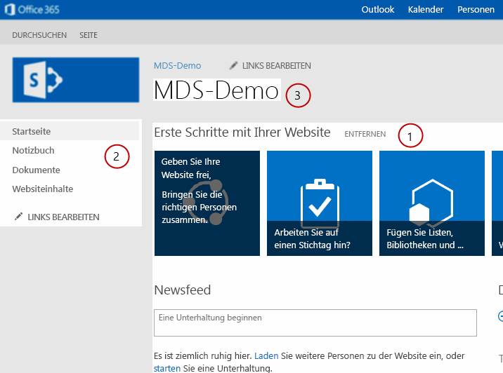

# <a name="modify-sharepoint-components-for-mds"></a><span data-ttu-id="68a16-102">Ändern der SharePoint-Komponenten für MDS</span><span class="sxs-lookup"><span data-stu-id="68a16-102">Modify SharePoint components for MDS</span></span>
<span data-ttu-id="68a16-p101">Erfahren Sie, wie die Komponenten in Ihrem Projekt SharePoint die Vorteile der minimale herunterladen Strategie (MDS) in SharePoint ändern. Minimale herunterladen Strategie (MDS) wurde die benutzerfreundlichkeit verbessert, indem nur die Teile einer Seite erforderlich, um diese ordnungsgemäß im Browser zu rendern vom Server zurückgegeben. Da die Seite vollständig gerendert nicht an den Client zurückgegeben wird, muss der Server sein um genau die Teile zu identifizieren, die zum Rendern der Seite erforderlich sind. Sie müssen möglicherweise die Komponenten in Ihrem Projekt SharePoint ändern, sodass sie als MDS-kompatiblen erkannt werden, und können mit dem Modul MDS arbeiten. Erfahren Sie mehr über MDS in  [Übersicht über die minimale Strategie herunterladen](minimal-download-strategy-overview.md).</span><span class="sxs-lookup"><span data-stu-id="68a16-p101">Learn how to modify the components in your SharePoint project to take advantage of Minimal Download Strategy (MDS) in SharePoint. Minimal Download Strategy (MDS) improves the user experience by returning from the server only the portions of a page required to render it properly in the browser. Because the fully-rendered page is not returned to the client, the server must be able to accurately identify the portions that are required to render the page. You might need to modify the components in your SharePoint project so that they are identified as MDS-compliant and can work with the MDS engine. Learn more about MDS in  [Minimal Download Strategy overview](minimal-download-strategy-overview.md).</span></span>
  
    
    


## <a name="why-modify-sharepoint-components"></a><span data-ttu-id="68a16-108">Gründe für das Ändern SharePoint Komponenten?</span><span class="sxs-lookup"><span data-stu-id="68a16-108">Why modify SharePoint components?</span></span>
<span data-ttu-id="68a16-109"><a name="bk_whymodify"> </a></span><span class="sxs-lookup"><span data-stu-id="68a16-109"></span></span>

<span data-ttu-id="68a16-p102">Wie unter  [Übersicht über die minimale Strategie herunterladen](minimal-download-strategy-overview.md)erläutert, arbeiten SharePoint Steuerelemente, unabhängig davon, ob Sie diese MDS voll ausschöpfen ändern. Wenn Ihre Komponenten nicht MDS kompatibel sind, gibt das Modul MDS jedoch einen Failover aus. In der ein Failover benötigt das Modul MDS ein zusätzlicher Roundtrip zum Umleiten von im Browsers auf die Vollversion der neuen Seite, die Zeit in Anspruch nimmt. Benutzer haben die beste Erfahrung beim Arbeiten mit MDS und einen Failover zu vermeiden, jedes Mal, wenn eine neue Seite in SharePoint Besuch Komponenten ändern. Sie müssen in der Regel Masterseiten, ASP.NET Seiten, Steuerelemente und Webparts ändern.</span><span class="sxs-lookup"><span data-stu-id="68a16-p102">As explained in  [Minimal Download Strategy overview](minimal-download-strategy-overview.md), SharePoint controls work whether or not you modify them to take full advantage of MDS. However, when your components are not MDS compliant, the MDS engine issues a failover. In a failover, the MDS engine takes an extra round trip to redirect the browser to the full version of the new page, which takes time. Users have the best experience when you modify components to work with MDS and avoid a failover every time they browse to a new page in SharePoint. You usually need to modify master pages, ASP.NET pages, controls, and Web Parts.</span></span> 
  
    
    

  
    
    

## <a name="master-pages"></a><span data-ttu-id="68a16-115">Gestaltungsvorlagen</span><span class="sxs-lookup"><span data-stu-id="68a16-115">Master pages</span></span>
<span data-ttu-id="68a16-116"><a name="SP15MDSDev_MasterPages"> </a></span><span class="sxs-lookup"><span data-stu-id="68a16-116"></span></span>

<span data-ttu-id="68a16-p103">Die Gestaltungsvorlage bietet eine Vorlage, mit der MDS Inhaltsbereiche zu identifizieren, die möglicherweise aktualisiert werden, wenn eine Person zu einer neuen Seite navigiert. Optimieren Ihre Gestaltungsvorlagen gehört zu die wichtigsten Schritte bei der Optimierung der Leistung, da Masterseiten Abschnitte, die erfordern identifizieren, aktualisiert Content. Die Gestaltungsvorlage Seattle.master enthaltene SharePoint ist ein gutes Beispiel für eine optimierte Gestaltungsvorlage. Abbildung 1 zeigt Beispiele für Komponenten in der Gestaltungsvorlage Seattle.master, die sich über mehrere Seiten, wie (1) Content Hauptbereich, (2) der linken Navigationsleiste und Titel (3) Seite ändern.</span><span class="sxs-lookup"><span data-stu-id="68a16-p103">The master page provides a template that lets MDS identify the content regions that may need to be updated when someone navigates to a new page. Optimizing your master pages is one of the most important steps to take when optimizing performance because master pages identify sections that require updated content.. The Seattle.master master page included with SharePoint is a good example of an optimized master page. Figure 1 shows examples of components in the Seattle.master master page that change from page to page, such as the (1) main content area, (2) left navigation bar, and (3) page title.</span></span>
  
    
    

<span data-ttu-id="68a16-121">**Abbildung 1. Komponenten, die Updates in eine Gestaltungsvorlage erfordern**</span><span class="sxs-lookup"><span data-stu-id="68a16-121">**Figure 1. Components that require updates in a master page**</span></span>

  
    
    

  
    
    

  
    
    

    
> <span data-ttu-id="68a16-123">**Hinweis:** Es gibt viele weitere Komponenten in der Gestaltungsvorlage Seattle.master, wie etwa Stylesheets und JavaScript Dateien, die von Seite zu Seite ändern.</span><span class="sxs-lookup"><span data-stu-id="68a16-123">**Note** There are many more components in the Seattle.master master page that change from page to page, such as style sheets and JavaScript files. Figure 1 shows only a few examples.</span></span> <span data-ttu-id="68a16-124">Abbildung 1 zeigt nur einige Beispiele.</span><span class="sxs-lookup"><span data-stu-id="68a16-124">Figure 1 shows only a few examples.</span></span> 
  
    
    

<span data-ttu-id="68a16-p105">Es gibt verschiedene Muster zur Optimierung der Komponenten in einer Gestaltungsvorlage. Sie können ein Muster für die folgenden Komponenten verwenden:</span><span class="sxs-lookup"><span data-stu-id="68a16-p105">There are different patterns to optimize the components in a master page. You can use a pattern for the following components:</span></span>
  
    
    

- <span data-ttu-id="68a16-127">HTML-Regionen und Steuerelemente</span><span class="sxs-lookup"><span data-stu-id="68a16-127">HTML regions and controls</span></span>
    
  
- <span data-ttu-id="68a16-128">Stylesheets</span><span class="sxs-lookup"><span data-stu-id="68a16-128">Style sheets</span></span>
    
  
- <span data-ttu-id="68a16-129">JavaScript-Dateien</span><span class="sxs-lookup"><span data-stu-id="68a16-129">JavaScript files</span></span>
    
  
- <span data-ttu-id="68a16-130">Seitentitel</span><span class="sxs-lookup"><span data-stu-id="68a16-130">Page title</span></span>
    
  
<span data-ttu-id="68a16-p106">HTML-Regionen und Steuerelemente sind MDS kompatibel, wenn sie in **SharePoint:AjaxDelta** Tags eingeschlossen sind. Durch Umschließen des Inhalts in **SharePoint:AjaxDelta** -Tags, sind Sie signalisieren, dass das MDS-Modul die eingeschlossenen Steuerelemente und HTML-aktualisiert werden soll. Wenn ein Steuerelement oder ein HTML-Abschnitt nicht von einer Seite zu ändern, sollten sie nicht an den Client gesendet werden. Aus diesem Grund sollten Sie diese Steuerelemente außerhalb **AjaxDelta** Tags beibehalten. In der Seattle.master Gestaltungsvorlage in der in Abbildung 1 dargestellt ist (1) Content Hauptbereich in **AjaxDelta** -Tags eingeschlossen, wie hier gezeigt.</span><span class="sxs-lookup"><span data-stu-id="68a16-p106">HTML regions and controls are MDS compatible if they are wrapped in **SharePoint:AjaxDelta** tags. By wrapping the content in **SharePoint:AjaxDelta** tags, you are signaling that the MDS engine should update the enclosed controls and HTML. If a control or HTML section doesn't change from page to page, it should not be sent to the client. Therefore, you should keep these controls outside of **AjaxDelta** tags. In the Seattle.master master page shown in Figure 1, the (1) main content area is wrapped in **AjaxDelta** tags, as shown here.</span></span>
  
    
    


```cs
<SharePoint:AjaxDelta
            id="DeltaPlaceHolderMain"
            BlockElement="true"
            IsMainContent="true"
            runat="server">
    <a id="mainContent" name="mainContent" tabindex="-1"></a>
    <asp:ContentPlaceHolder id="PlaceHolderMain" runat="server" />
</SharePoint:AjaxDelta>
```

<span data-ttu-id="68a16-p107">Ein weiteres Beispiel für das Muster **AjaxDelta** ist der (2) linken Navigationsleiste in Abbildung 1. Der folgende Code zeigt, wie das Steuerelement in **AjaxDelta** Tags zusammen mit anderen Steuerelemente und HTML-umgebrochen wird.</span><span class="sxs-lookup"><span data-stu-id="68a16-p107">Another example of the **AjaxDelta** pattern is the (2) left navigation bar in Figure 1. The following code shows how the control is wrapped in **AjaxDelta** tags along with many other controls and HTML.</span></span>
  
    
    


```cs
<SharePoint:AjaxDelta
            id="DeltaPlaceHolderLeftNavBar"
            BlockElement="true"
            CssClass="ms-core-navigation"
            role="navigation"
            runat="server">
    <asp:ContentPlaceHolder id="PlaceHolderLeftNavBar" runat="server">
        <a id="startNavigation" name="startNavigation" tabIndex="-1"></a>
        <asp:ContentPlaceHolder id="PlaceHolderLeftNavBarTop" runat="server" />
        <asp:ContentPlaceHolder id="PlaceHolderQuickLaunchTop" runat="server" />
        <asp:ContentPlaceHolder id="PlaceHolderLeftNavBarDataSource" runat="server" />
        <asp:ContentPlaceHolder id="PlaceHolderCalendarNavigator" runat="server" />
        <asp:ContentPlaceHolder id="PlaceHolderLeftActions" runat="server" />
        <!-- There are more controls and HTML in this placeholder in the Seattle master page -->
    </asp:ContentPlaceHolder>
</SharePoint:AjaxDelta>
```

<span data-ttu-id="68a16-p108">Eine Sache zu **AjaxDelta** Tags merken ist, dass sie zu schachteln. Sie sollten in der Gestaltungsvorlage in der Struktur **AjaxDelta** Tags auf der höchsten Ebene erforderlichen angeben.</span><span class="sxs-lookup"><span data-stu-id="68a16-p108">One last thing to remember about **AjaxDelta** tags is that you can't nest them. You should specify **AjaxDelta** tags at the highest required level in the master page structure.</span></span>
  
    
    
<span data-ttu-id="68a16-p109">Das letzte Beispiel in Abbildung 1 ist (3) Seitentitel, der eine spezielle Muster erforderlich sind, die das Tag **SharePoint:PageTitle** verwendet. Der folgende Code zeigt das Tag **PageTitle** wie in der Gestaltungsvorlage Seattle.master.</span><span class="sxs-lookup"><span data-stu-id="68a16-p109">The last example in Figure 1 is the (3) page title, which requires a special pattern that uses the **SharePoint:PageTitle** tag. The following code shows the **PageTitle** tag as used in the Seattle.master master page.</span></span>
  
    
    


```cs

<SharePoint:PageTitle runat="server">
    <asp:ContentPlaceHolder id="PlaceHolderPageTitle" runat="server">
        <SharePoint:ProjectProperty Property="Title" runat="server" />
    </asp:ContentPlaceHolder>
</SharePoint:PageTitle>
```

<span data-ttu-id="68a16-p110">Die Masterseite kann auch Stylesheets und die JavaScript Dateien enthalten. Das Server-Datenbankmodul muss CSS- und JavaScript Dateien nach Bedarf zu identifizieren. Verwenden Sie das folgende Muster, um die CSS-Dateiressourcen nach Bedarf zu identifizieren.</span><span class="sxs-lookup"><span data-stu-id="68a16-p110">Your master page can also include style sheets and JavaScript files. The server engine needs to identify both CSS and JavaScript files as required. To identify the CSS files resources as required, use the following pattern.</span></span>
  
    
    


```cs

<SharePoint:CssLink runat="server" Version="15"/>
<SharePoint:CssRegistration Name="my_styles.css" runat="server" />
```

<span data-ttu-id="68a16-p111">Beachten Sie, dass können Sie nur ein **CssLink** Tag pro Gestaltungsvorlage verfügen, können aber viele **CssRegistration** -Tags, damit viele CSS-Dateien hinzugefügt werden können. Verwenden Sie das folgende Muster für JavaScript-Dateien.</span><span class="sxs-lookup"><span data-stu-id="68a16-p111">Note that you can have only one **CssLink** tag per master page, but you can have many **CssRegistration** tags, so you can add many CSS files. Use the following pattern for JavaScript files.</span></span>
  
    
    


```cs

<SharePoint:ScriptLink language="javascript" name="my_javascript.js" runat="server" />
```

<span data-ttu-id="68a16-147">Einschließlich CSS- und JavaScript-Dateien mithilfe von HTML-Tags für **style** und **script** wird in MDS nicht unterstützt.</span><span class="sxs-lookup"><span data-stu-id="68a16-147">Including CSS and JavaScript files using HTML **style** and **script** tags is not supported in MDS.</span></span>
  
    
    

## <a name="aspnet-pages"></a><span data-ttu-id="68a16-148">ASP.NET-Seiten</span><span class="sxs-lookup"><span data-stu-id="68a16-148">ASP.NET pages</span></span>
<span data-ttu-id="68a16-149"><a name="SP15MDSDev_ASPNET"> </a></span><span class="sxs-lookup"><span data-stu-id="68a16-149"></span></span>

<span data-ttu-id="68a16-p112">Wenn Ihr Projekt ASP.NET Seiten enthält, müssen Sie CSS- und JavaScript-Dateien zu verweisen. Die HTML-Tags **style** und **script** sind nicht kompatibel mit MDS. Verwenden Sie stattdessen die **CssRegistration** und **ScriptLink** Muster, die im vorherigen Abschnitt erläutert.</span><span class="sxs-lookup"><span data-stu-id="68a16-p112">If your project includes ASP.NET pages, you probably need to reference CSS and JavaScript files. The HTML **style** and **script** tags are not compatible with MDS. Instead, use the **CssRegistration** and **ScriptLink** patterns explained in the previous section.</span></span>
  
    
    
<span data-ttu-id="68a16-p113">Ihre Seiten ASP.NET können auch die **Response.Output** -Methode zum Schreiben des Inhalts auf der Seite, der nicht in MDS zulässig ist. Stattdessen können Sie die folgenden MDS-kompatiblen Methoden der [SPHttpUtility](https://msdn.microsoft.com/library/Microsoft.SharePoint.Utilities.SPHttpUtility.aspx) -Klasse:</span><span class="sxs-lookup"><span data-stu-id="68a16-p113">Your ASP.NET pages may also use the **Response.Output** method to write content to the page, which is not allowed in MDS. Instead, you can use the following MDS-compliant methods of the [SPHttpUtility](https://msdn.microsoft.com/library/Microsoft.SharePoint.Utilities.SPHttpUtility.aspx) class:</span></span>
  
    
    

-  [<span data-ttu-id="68a16-155">WriteNoEncode()</span><span class="sxs-lookup"><span data-stu-id="68a16-155">WriteNoEncode()</span></span>](https://msdn.microsoft.com/library/Microsoft.SharePoint.Utilities.SPHttpUtility.WriteNoEncode.aspx)
    
  
-  [<span data-ttu-id="68a16-156">WriteHtmlEncode()</span><span class="sxs-lookup"><span data-stu-id="68a16-156">WriteHtmlEncode()</span></span>](https://msdn.microsoft.com/library/Microsoft.SharePoint.Utilities.SPHttpUtility.WriteHtmlEncode.aspx)
    
  
-  [<span data-ttu-id="68a16-157">WriteEcmaScriptStringLiteralEncode()</span><span class="sxs-lookup"><span data-stu-id="68a16-157">WriteEcmaScriptStringLiteralEncode()</span></span>](https://msdn.microsoft.com/library/Microsoft.SharePoint.Utilities.SPHttpUtility.WriteEcmaScriptStringLiteralEncode.aspx)
    
  
-  [<span data-ttu-id="68a16-158">WriteHtmlEncodeAllowSimpleTextFormatting()</span><span class="sxs-lookup"><span data-stu-id="68a16-158">WriteHtmlEncodeAllowSimpleTextFormatting()</span></span>](https://msdn.microsoft.com/library/Microsoft.SharePoint.Utilities.SPHttpUtility.WriteHtmlEncodeAllowSimpleTextFormatting.aspx)
    
  
-  [<span data-ttu-id="68a16-159">WriteHtmlUrlAttributeEncode()</span><span class="sxs-lookup"><span data-stu-id="68a16-159">WriteHtmlUrlAttributeEncode()</span></span>](https://msdn.microsoft.com/library/Microsoft.SharePoint.Utilities.SPHttpUtility.WriteHtmlUrlAttributeEncode.aspx)
    
  
-  [<span data-ttu-id="68a16-160">WriteUrlKeyValueEncode()</span><span class="sxs-lookup"><span data-stu-id="68a16-160">WriteUrlKeyValueEncode()</span></span>](https://msdn.microsoft.com/library/Microsoft.SharePoint.Utilities.SPHttpUtility.WriteUrlKeyValueEncode.aspx)
    
  
-  [<span data-ttu-id="68a16-161">WriteUrlPathEncode()</span><span class="sxs-lookup"><span data-stu-id="68a16-161">WriteUrlPathEncode()</span></span>](https://msdn.microsoft.com/library/Microsoft.SharePoint.Utilities.SPHttpUtility.WriteUrlPathEncode.aspx)
    
  
<span data-ttu-id="68a16-p114">Zusätzlich zum Verweisen auf JavaScript Dateien können Seiten ASP.NETJavaScript Inlinecode enthalten. Mit dem folgenden Muster stellen Sie das Skript blockiert MDS kompatibel.</span><span class="sxs-lookup"><span data-stu-id="68a16-p114">Besides referencing JavaScript files, your ASP.NET pages can have inline JavaScript code. Use the following pattern to make your script blocks MDS compatible.</span></span>
  
    
    


```cs
<SharePoint:ScriptBlock runat="server" >
    // Your JavaScript code here.
</SharePoint:ScriptBlock>
```


## <a name="controls-and-web-parts"></a><span data-ttu-id="68a16-164">Steuerelemente und Webparts</span><span class="sxs-lookup"><span data-stu-id="68a16-164">Controls and Web Parts</span></span>
<span data-ttu-id="68a16-165"><a name="SP15MDSDev_WebParts"> </a></span><span class="sxs-lookup"><span data-stu-id="68a16-165"></span></span>

<span data-ttu-id="68a16-p115">Außerdem müssen Sie die Steuerelemente und Webparts als MDS kompatibel zu kennzeichnen. Der folgende Code zeigt das zu verwendende Muster.</span><span class="sxs-lookup"><span data-stu-id="68a16-p115">You also need to mark your controls and Web Parts as MDS compliant. The following code shows the pattern to use.</span></span>
  
    
    

```cs

[assembly: Microsoft.SharePoint.WebControlssCompliantAttribute(IsCompliant = true)]
namespace VisualWebPartProject2.VisualWebPart1
{
    // Rest of your control logic
```

<span data-ttu-id="68a16-p116">Darüber hinaus müssen die Steuerelemente und Webparts ihre Ressourcen mithilfe der Methoden in der Klasse  [SPPageContentManager](https://msdn.microsoft.com/library/Microsoft.SharePoint.WebControls.SPPageContentManager.aspx) zu registrieren. Die am häufigsten verwendeten Ressourcen sind JavaScript Snippets und versteckte mithilfe von der **RegisterClientScriptBlock** und **RegisterHiddenField**, registriert werden können.</span><span class="sxs-lookup"><span data-stu-id="68a16-p116">Also, your controls and Web Parts need to register their resources using the methods in the  [SPPageContentManager](https://msdn.microsoft.com/library/Microsoft.SharePoint.WebControls.SPPageContentManager.aspx) class. The most common resources are JavaScript snippets and hidden files, which can be registered using the **RegisterClientScriptBlock** and **RegisterHiddenField**, respectively.</span></span>
  
    
    
<span data-ttu-id="68a16-p117">Die Steuerelemente und Webparts können XSLT-Dateien auch Renderingprozess steuern. Ihre XSLT-Dateien können JavaScript Code oder Dateien eingebettet haben. Das Modul MDS muss diese Ressourcen kennen. Sie können die JavaScript Ressourcen mithilfe eines XSLT-Erweiterung-Objekts mit dem Namen **pcm**registrieren. Ein hervorragendes Beispiel zur Verwendung des **pcm** -Objekts ist in der %ProgramFiles%\\Common Files\\Microsoft Shared\\web server extensions\\15\\ TEMPLATE\\LAYOUTS\\XSL\\fldtypes.xsl-Datei. Der folgende Code zeigt, wie die Datei **fldtypes.xsl** das **pcm** -Objekt verwendet, um JavaScript Ressourcen zu registrieren.</span><span class="sxs-lookup"><span data-stu-id="68a16-p117">Your controls and Web Parts can also use XSLT files to control the rendering process. Your XSLT files can have embedded JavaScript code or files. The MDS engine needs to know about these resources. You can register the JavaScript resources using an XSLT extension object named **pcm**. A great example of how to use the **pcm** object is in the %ProgramFiles%\\Common Files\\Microsoft Shared\\web server extensions\\15\\TEMPLATE\\LAYOUTS\\XSL\\fldtypes.xsl file. The following code shows how the **fldtypes.xsl** file uses the **pcm** object to register JavaScript resources.</span></span>
  
    
    


```XML

<xsl:value-of select="pcm:RegisterScriptBlock(concat('block1',$ViewCounter), string($scriptbody1))"/>
<xsl:value-of select="pcm:RegisterScriptLink('/_layouts/15/wssactionmenu.js')"/>
```


## <a name="additional-resources"></a><span data-ttu-id="68a16-176">Zusätzliche Ressourcen</span><span class="sxs-lookup"><span data-stu-id="68a16-176">Additional resources</span></span>
<span data-ttu-id="68a16-177"><a name="bk_addresources"> </a></span><span class="sxs-lookup"><span data-stu-id="68a16-177"></span></span>


-  [<span data-ttu-id="68a16-178">Übersicht über die minimale Strategie herunterladen</span><span class="sxs-lookup"><span data-stu-id="68a16-178">Minimal Download Strategy overview</span></span>](minimal-download-strategy-overview.md)
    
  
-  [<span data-ttu-id="68a16-179">Erstellen von Websites für SharePoint</span><span class="sxs-lookup"><span data-stu-id="68a16-179">Build sites for SharePoint</span></span>](build-sites-for-sharepoint.md)
    
  

