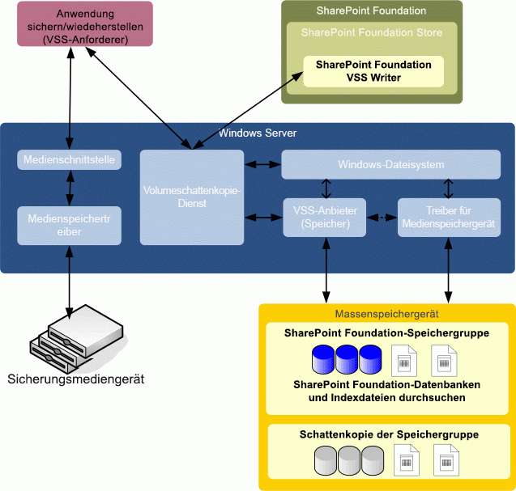

# Übersicht über SharePoint und den Volumeschattenkopie-DienstOverview of SharePoint and the Volume Shadow Copy Service
 **Zusammenfassung:** Lernen Sie die Microsoft SharePoint -Schnittstelle zu Volume Shadow Copy Service (VSS). Für Sicherungsanbieter wird durch den Volumeschattenkopie-Dienst (Volume Shadow Copy Service, VSS) das Sichern von Microsoft-Serverlösungen mit einer zentralisierten API vereinfacht. Microsoft SharePoint Foundation enthält einen referenziellen VSS Writer (nachfolgend "SPF-VSS Writer" genannt), der in das Windows VSS-Sicherungsframework integriert ist. Dadurch wird das Sichern und Wiederherstellen von SharePoint Foundation-Daten durch Sicherungsanwendungen ermöglicht. Es wird ein Überschreibungsszenario mit schwerwiegenden Folgen für die gesamte Farm (einschließlich Suchindex) unterstützt. Bei der Wiederherstellung werden Datenbanken eingebunden und Websitezuordnungen synchronisiert.**Summary:** Learn about the Microsoft SharePoint interface to the Volume Shadow Copy Service (VSS). For backup vendors, the Volume Shadow Copy Service (VSS) simplifies backing up Microsoft server solutions by using a centralized API. Microsoft SharePoint Foundation includes a referential VSS writer (hereafter, called "the SPF-VSS Writer") that integrates with the Windows VSS backup framework, enabling backup applications to back up and restore SharePoint Foundation data. It supports a catastrophic overwrite scenario for the entire farm (search index included). On recovery, it hooks up databases and synchronizes site mappings.
  
    
    

## Entwurf des SystemsDesign of the System

Die folgende Abbildung zeigt die Hauptkomponenten des Systems: Microsoft Windows Server (und Volume Shadow Copy Service), SharePoint Foundation (und SPF-VSS-Writer für die Windows Server-Volume Shadow Copy Service) und Anwendung von Drittanbietern (oder benutzerdefinierte) Backup und Wiederherstellung (einschließlich der Anforderer und Anbieter).The following figure shows the main components in the system: Microsoft Windows Server (and the Volume Shadow Copy Service), SharePoint Foundation (and the SPF-VSS Writer for the Windows Server Volume Shadow Copy Service), and the third-party (or custom) backup/restore application (including the requestor and the provider).
  
    
    

  
    
    

  
    
    
Der VSS kommuniziert mit dem Windows Server-Dateisystem und der Massenspeicher-Gerätetreiber über einen Anbieter von Drittanbietern (oder benutzerdefinierte). Der Hardwareanbieter muss ermitteln, in dem die Schattenkopie erstellt wird. Der VSS abstrahiert die hardwarespezifischen Schattenkopie damit Sicherungs-bzw. Wiederherstellungsvorgang die Schattenkopie einheitlich zugreifen kann, ohne zu wissen, die Implementierungsdetails der Hardware.The VSS communicates with the Windows Server file system and with the mass storage device driver through a third-party (or custom) provider. The hardware provider must determine where the shadow copy is created. The VSS abstracts the hardware-specific shadow copy so the backup/restore application can access the shadow copy in a uniform manner without knowing the hardware implementation details. 
  
    
    
SharePoint Foundation Speicher ist eine Komponente des SharePoint Foundation und greift auf SharePoint Foundation Speichergruppen über das Dateisystem von Windows Server. Innerhalb des Dateisystems enthält jede Speichergruppe SharePoint Foundation Konfiguration, Inhalt, Suche Datenbanken und Datenbanken von Drittanbietern in die Konfiguration Datenbank und Indexdateien registriert. Ebenfalls enthalten sind Dienste auf den SharePoint Foundation Service Application Framework aufgebaut.The SharePoint Foundation store is a component of SharePoint Foundation and accesses SharePoint Foundation storage groups through the Windows Server file system. Within the file system, each SharePoint Foundation storage group includes configuration, content, Search databases, and any third-party databases registered in the configuration database and search index files. Also included are any services built on the SharePoint Foundation Service Application Framework. 
  
    
    
Zur Unterstützung des VSS enthält SharePoint Foundation den SPF-VSS Writer. Der SPF-VSS Writer wird mit dem SharePoint Foundation-Speicher (der im Auftrag des Anforderers betrieben wird) koordiniert, um die Speichergruppe zu sperren und deren Bereitstellung aufzuheben, bevor sie gesichert wird. Nach Abschluss der Sicherung wird dann die Sperrung der Speichergruppe aufgehoben und die Speichergruppe bereitgestellt.To support the VSS, SharePoint Foundation includes the SPF-VSS Writer. The SPF-VSS Writer coordinates with the SharePoint Foundation store (operating on behalf of the requestor) to freeze and dismount the storage group before backing it up, and then to unfreeze and mount the storage group after the backup is complete.
  
    
    
Während einer Wiederherstellung wird der SPF-VSS Writer von der Sicherungs-/Wiederherstellungsanwendung in Koordinierung mit dem SharePoint Foundation-Speicher (der im Auftrag des Anforderers betrieben wird) angewiesen, die Bereitstellung der Speichergruppe aufzuheben, die Datenbankdateien zu ersetzen und die Speichergruppe wieder bereitzustellen.During a recovery, the backup/restore application instructs the SPF-VSS Writer to coordinate with the SharePoint Foundation store (operating on behalf of the requestor) to dismount the storage group, replace the database files, and mount the storage group.
  
> [!NOTE]
> Wichtige Informationen zur Wiederherstellung finden Sie im Abschnitt „Wiederherstellen“ im Artikel [VSS-Anforderer und SharePoint](vss-requestors-and-sharepoint.md).[Note:](vss-requestors-and-sharepoint.md) See "Restoring" in  VSS requestors and SharePoint for important information about restorations.
  
    
    

Als Anforderer wird eine Anwendung eines Drittanbieters (oder benutzerdefinierte Anwendung) bezeichnet, die den VSS zum ordnungsgemäßen Sichern und Wiederherstellen von SharePoint Foundation-Daten verwendet. Der Anforderer kommunizierte mit dem VSS, um Informationen zu SharePoint Foundation anzufordern, die Erstellung von Schattenkopien zu veranlassen und Zugriff auf die Daten für die Sicherung zu erhalten.A requestor is a third-party (or custom) application designed to use the VSS to properly back up and restore SharePoint Foundation data. The requestor communicates with the VSS to obtain information about SharePoint Foundation, command the creation of shadow copies, and gain access to the data for backup. 
  
    
    
Beim Wiederherstellen, kommuniziert des Anforderers auch mit den VSS So bereiten Sie die Wiederherstellung des Systems und zum Einfügen die Daten zurück auf das Massenspeichergerät. Die Sicherungs-bzw. Wiederherstellungsanwendung ist auch verantwortlich für die Arbeit mit Windows-Server zum Lesen und Schreiben von Daten in die backup-Datenträger, gibt an, ob ein Band zu archivieren, ein Storage Area Network oder andere Sicherungsmedien.When restoring, the requestor also communicates with the VSS to prepare the system for the restore operation, and then to put the data back onto the mass storage device. The backup/restore application is also responsible for working with Windows Server to read data from and write data to the backup storage media, whether a tape archive, a storage area network, or other backup medium. 
  
    
    
Die Informationen, die zum erfolgreichen Ausführen von Sicherungs- und Wiederherstellungsvorgängen mit SharePoint Foundation, dem VSS und der Sicherungs-/Wiederherstellungsanwendung erforderlich sind, werden als Teil der SPF-VSS Writer-Metadaten übertragen.Information needed to successfully complete backup and restore operations among SharePoint Foundation, the VSS, and the backup/restore application is transferred as part of the SPF-VSS Writer metadata.
  
    
    
Die Abfolge oberster Ebene von Ergebnissen während der Sicherungs- und Wiederherstellungsvorgänge lautet wie folgt:The following is the high-level sequence of events during backup or restore operations:
  
    
    

  
    
    

1. Vom Sicherungsprogramm (oder Agent) wird ein geplanter Auftrag ausgeführt.The backup program (or agent) runs a scheduled job. 
    
  
2. Der VSS-Anforderer in der Sicherungs-/Wiederherstellungsanwendung sendet einen Befehl zum Erstellen einer Schattenkopie der ausgewählten SharePoint Foundation-Speichergruppen an den VSS.The VSS requestor in the backup/restore application sends a command to the VSS to take a shadow copy of the selected SharePoint Foundation storage groups. 
    
  
3. Der VSS kommuniziert mit dem SPF-VSS Writer, um eine Momentaufnahmensicherung vorzubereiten. SharePoint Foundation lässt Verwaltungsaktionen an der Speichergruppe nicht zu, überprüft Volumeabhängigkeiten und hält alle Schreibvorgänge in Datenbank- und Transaktionsprotokolldateien an, während Nur-Lese-Zugriff erteilt wird.The VSS communicates with the SPF-VSS Writer to prepare for a snapshot backup. SharePoint Foundation prohibits administrative actions against the storage group, checks volume dependencies, and suspends all write operations to database and transaction log files while allowing read-only access. 
    
  
4. Der VSS kommuniziert mit dem entsprechenden Speicheranbieter, damit eine Schattenkopie des Speichervolumes erstellt wird, das die SharePoint Foundation-Speichergruppe enthält.The VSS communicates with the appropriate storage provider to create a shadow copy of the storage volume that contains the SharePoint Foundation storage group. 
    
  
5. Der VSS gibt SharePoint Foundation frei, um die normalen Vorgänge fortzusetzen.The VSS releases SharePoint Foundation to resume ordinary operations.
    
  
6. Der VSS-Anforderer überprüft die Integrität des Sicherungssatzes, bevor der Erfolg der Sicherung angezeigt wird. Die Zeit der letzten Datenbanksicherung wird von SharePoint Foundation erfasst.The VSS requestor verifies the integrity of the backup set prior to signaling that the backup succeeded. SharePoint Foundation records the time of the last backup for the database.
    
  

## Siehe auchSee also

-  [SharePoint VSS WriterSharePoint VSS Writer](sharepoint-vss-writer.md)
    
  
-  [VSS-Anforderer und SharePointVSS requestors and SharePoint](vss-requestors-and-sharepoint.md)
    
  
-  [Vorgehensweise: Erstellen ein Volumenschattenkopie-Anforderers für die Verwendung mit SharePointHow to: Create a VSS requestor for use with SharePoint](how-to-create-a-vss-requestor-for-use-with-sharepoint.md)
    
  
-  [Vorgehensweise: Sichern und Wiederherstellen von SharePoint verwenden eines VSS-RequestorsHow to: Back up and restore SharePoint using a VSS requestor](how-to-back-up-and-restore-sharepoint-using-a-vss-requestor.md)
    
  
-  [Vorgehensweise: Sichern und Wiederherstellen eine Suchdienstanwendung in SharePoint mit VSSHow to: Back up and restore a search service application in SharePoint using VSS](how-to-back-up-and-restore-a-search-service-application-in-sharepoint-using.md)
    
  
-  [Starting and Configuring the WSS Writer Service]((http://msdn.microsoft.com/library/c9243dd6-e61e-4783-9fef-48d0122f1c09.aspx))[Starting and Configuring the WSS Writer Service]((http://msdn.microsoft.com/library/c9243dd6-e61e-4783-9fef-48d0122f1c09.aspx))
    
  
-  
  [Volumeschattenkopie-Dienst](http://msdn.microsoft.com/en-us/library/windows/desktop/bb968832%28v=vs.85%29.aspx)[Volume Shadow Copy Service](http://msdn.microsoft.com/en-us/library/windows/desktop/bb968832%28v=vs.85%29.aspx)
    
  
-  
  [Volume Shadow Copy Service Technical Reference](http://msdn.microsoft.com/en-us/library/windows/desktop/aa384648%28v=vs.85%29.aspx)[Volume Shadow Copy Service Technical Reference](http://msdn.microsoft.com/en-us/library/windows/desktop/aa384648%28v=vs.85%29.aspx)
    
  

