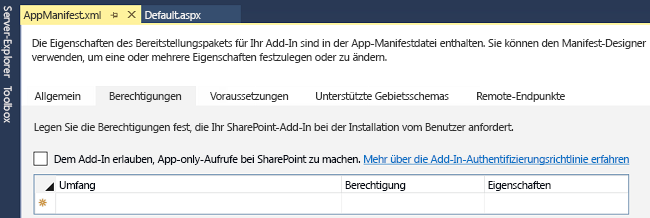
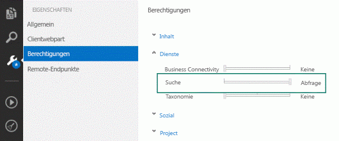

# <a name="search-add-ins-in-sharepoint"></a><span data-ttu-id="fe526-102">Such-Add-Ins in SharePoint</span><span class="sxs-lookup"><span data-stu-id="fe526-102">Search add-ins in SharePoint</span></span>
<span data-ttu-id="fe526-p101">Informationen Sie zur Suche SharePoint-Add-Ins und wie Sie Ihre eigene Search-add-ins erstellen können. Die Add-ins, die Sie erstellen können SharePoint-Add-ins Katalog hinzugefügt werden, damit sie in der lokalen Bereitstellung und Office 365 verwendet werden können. Search-add-ins funktionieren nur mit Daten, die im Suchindex gespeichert sind und nicht mit den ursprünglichen Quelldokumenten. SharePoint-Add-Ins sind eigenständig der Funktionalität, die Erweiterung der Fähigkeiten einer SharePoint-Website. Diese-add-ins zu spezifische Bedürfnissen von Geschäfts- und Endbenutzer durch die Integration von das beste aus dem Web- und SharePoint lösen. Ein Add-In kann verschiedene SharePoint Elemente wie Listen, Remote-Ereignisempfänger, Inhaltstypen, Workflows, benutzerdefinierte Workflowaktivitäten, Websitespalten, Module, im Menü Element benutzerdefinierte Aktionen, Client-Webparts und Suchkonfigurationen enthalten. Weitere Informationen finden Sie unter  [SharePoint-Add-Ins](http://msdn.microsoft.com/library/cd1eda9e-8e54-4223-93a9-a6ea0d18df70%28Office.15%29.aspx).</span><span class="sxs-lookup"><span data-stu-id="fe526-p101">Learn about search SharePoint Add-ins and how you can create your own search add-ins. The add-ins you create can be added to the SharePoint add-ins catalog so that they can be used in both on-premises deployment and Office 365. Search add-ins only work with data that is stored in the search index and not with the original source documents. SharePoint Add-ins are self-contained pieces of functionality that extend the capabilities of a SharePoint website. These add-ins solve specific business and end-user needs by integrating the best of the web and SharePoint. An add-in can contain various SharePoint elements like Lists, Remote Event Receivers, Content Types, Workflows, Workflow Custom Activities, Site Columns, Modules, Menu Item Custom Actions, Client Web Parts, and Search Configurations. For more information, see  [SharePoint Add-ins](http://msdn.microsoft.com/library/cd1eda9e-8e54-4223-93a9-a6ea0d18df70%28Office.15%29.aspx).</span></span>
  
    
    

<span data-ttu-id="fe526-p102">Ein Search-add-in ist ein SharePoint-Add-In, dass die Suchfunktion verwendet. SharePoint API für die Suche können Sie in einem Add-in auf Suche um Inhalte zu suchen. Je nach Art der Berechtigungen, die im [Manifest-Add-in](http://msdn.microsoft.com/library/7cd5850f-cbf3-48d2-bcb7-59b8f4ed0e63%28Office.15%29.aspx)einrichten können Sie entweder innerhalb oder außerhalb der Inhalt des Add-Ins suchen. Darüber hinaus können Sie auch ein Search-add-in verwenden zum Verteilen von Suchkonfigurationen aus einer SharePoint Installation in eine andere. Der Core Entwurf des Search-add-Ins, hängt von der Bereitstellungsmethode, die Sie auswählen. Im folgende Abschnitt werden die verfügbaren Optionen und ihre Vorteile zusammengefasst. Weitere Informationen finden Sie unter  [Auswählen von Mustern für die Entwicklung und das Hosting Ihres Add-Ins für SharePoint](http://msdn.microsoft.com/library/05ce5435-0a03-4ddc-976b-c33b08d03457%28Office.15%29.aspx)</span><span class="sxs-lookup"><span data-stu-id="fe526-p102">A search add-in is an SharePoint Add-in that uses search functionality. In a search add-in, you can use the SharePoint Search API to locate content. Depending on the type of permissions set up in your [add-in manifest](http://msdn.microsoft.com/library/7cd5850f-cbf3-48d2-bcb7-59b8f4ed0e63%28Office.15%29.aspx), you can search either inside or outside the contents of the add-in. In addition, you can also use a search add-in to distribute search configurations from one SharePoint installation to another. The core design of a search add-in depends on the deployment method that you choose. The following section summarizes the available options and their benefits. For more information, see  [Choose patterns for developing and hosting your SharePoint Add-in](http://msdn.microsoft.com/library/05ce5435-0a03-4ddc-976b-c33b08d03457%28Office.15%29.aspx)</span></span>
  
    
    


## <a name="deploy-your-search-add-ins"></a><span data-ttu-id="fe526-116">Bereitstellen der Suche-add-ins</span><span class="sxs-lookup"><span data-stu-id="fe526-116">Deploy your search add-ins</span></span>
<span data-ttu-id="fe526-117"><a name="SP15_Deploy_search_apps"> </a></span><span class="sxs-lookup"><span data-stu-id="fe526-117"></span></span>

<span data-ttu-id="fe526-118">Es gibt zwei Methoden, um Ihre Suche-add-in bereitstellen:</span><span class="sxs-lookup"><span data-stu-id="fe526-118">There are two ways to deploy your search add-in:</span></span>
  
    
    

1. <span data-ttu-id="fe526-p103">SharePoint gehostet - lokale Bereitstellung. Das Search-add-in wird innerhalb des Unternehmensnetzwerks auf das Unternehmen Servern gehostet. Das Unternehmen Administratoren verwalten das Add-in. In diesem Szenario bietet Flexibilität bei der Bereitstellung und Support, da die Hardware und Software lokal, die Administratoren verwaltet wird.</span><span class="sxs-lookup"><span data-stu-id="fe526-p103">SharePoint hosted - On-premises deployment. The search add-in is hosted inside the corporate network on the company's servers. The company's administrators manage the add-in. This scenario offers flexibility in deployment and support because the hardware and software is maintained locally by the administrators.</span></span>
    
  
2. <span data-ttu-id="fe526-p104">Vom Anbieter gehostet - alle Server gehostet. Das Search-add-in wird von jedem Anbieter, außerhalb des Kunden sharepointserver gehostet.</span><span class="sxs-lookup"><span data-stu-id="fe526-p104">Provider hosted - Any web server hosting. The search add-in is hosted by any provider, outside of the customer's SharePoint server.</span></span> 
    
  

## <a name="search-add-in-development-environment"></a><span data-ttu-id="fe526-125">Add-in-Entwicklung suchumgebung</span><span class="sxs-lookup"><span data-stu-id="fe526-125">Search add-in development environment</span></span>
<span data-ttu-id="fe526-126"><a name="SP15_Search_app_dev_environment"> </a></span><span class="sxs-lookup"><span data-stu-id="fe526-126"></span></span>

<span data-ttu-id="fe526-127">Um ein Search-add-in zu erstellen, verwenden Sie eine der folgenden zwei Umgebungen:</span><span class="sxs-lookup"><span data-stu-id="fe526-127">To create a search add-in, use one of these two environments:</span></span>
  
    
    

- <span data-ttu-id="fe526-128">Microsoft Visual Studio 2012 oder Microsoft Visual Studio 2013 oder Visual Studio 2015</span><span class="sxs-lookup"><span data-stu-id="fe526-128">Microsoft Visual Studio 2012 or Microsoft Visual Studio 2013 or Visual Studio 2015</span></span>
    
  
- <span data-ttu-id="fe526-129">Napa Office 365 Development Tools</span><span class="sxs-lookup"><span data-stu-id="fe526-129">Napa Office 365 Development Tools</span></span>
    
  
<span data-ttu-id="fe526-130">Mit Visual Studio 2013 und höher können Sie Ihre Such-Add-Ins sowohl lokal als auch in Office 365 veröffentlichen.</span><span class="sxs-lookup"><span data-stu-id="fe526-130">With Visual Studio 2013 and later, you can publish your search add-ins to both on-premises or in Office 365.</span></span> <span data-ttu-id="fe526-131">Weitere Informationen zu den Entwicklungsumgebungen und zu deren Verwendung für die Erstellung von Such-Add-Ins finden Sie unter [Einrichten einer allgemeinen Entwicklungsumgebung für SharePoint](set-up-a-general-development-environment-for-sharepoint.md).</span><span class="sxs-lookup"><span data-stu-id="fe526-131">For more information about the development environments and how to use them to create search add-ins, see  [Set up a general development environment for SharePoint](set-up-a-general-development-environment-for-sharepoint.md).</span></span>
  
    
    

## <a name="apis-for-search-add-ins"></a><span data-ttu-id="fe526-132">APIs für Suche-Add-Ins</span><span class="sxs-lookup"><span data-stu-id="fe526-132">APIs for search add-ins</span></span>
<span data-ttu-id="fe526-133"><a name="SP15_APIs_search_apps"> </a></span><span class="sxs-lookup"><span data-stu-id="fe526-133"></span></span>

<span data-ttu-id="fe526-134">Sie können die Breite Palette von APIs suchbezogene bietet, SharePoint für Search-add-ins. Die folgende Tabelle enthält diese APIs und des Speicherorts der ihre Klassenbibliotheken.</span><span class="sxs-lookup"><span data-stu-id="fe526-134">You can use the wide range of search-related APIs that SharePoint offers for search add-ins. The following table lists these APIs and the location of their class libraries.</span></span>
  
    
    

<span data-ttu-id="fe526-135">**SharePoint-APIs für Search-add-ins**</span><span class="sxs-lookup"><span data-stu-id="fe526-135">**SharePoint APIs for Search add-ins**</span></span>


|<span data-ttu-id="fe526-136">**API-Name**</span><span class="sxs-lookup"><span data-stu-id="fe526-136">**API name**</span></span>|<span data-ttu-id="fe526-137">**Klassenbibliothek**</span><span class="sxs-lookup"><span data-stu-id="fe526-137">**Class library**</span></span>|
|:-----|:-----|
|<span data-ttu-id="fe526-138">.NET-Clientobjektmodelle (CSOM)</span><span class="sxs-lookup"><span data-stu-id="fe526-138">.NET client object model (CSOM)</span></span>  <br/> |<span data-ttu-id="fe526-139">Microsoft.SharePoint.Client.Search.dll</span><span class="sxs-lookup"><span data-stu-id="fe526-139">Microsoft.SharePoint.Client.Search.dll          %ProgramFiles%Common FilesMicrosoft Sharedweb server extensions15ISAPI</span></span>  <br/> |
|<span data-ttu-id="fe526-140">Silverlight-CSOM</span><span class="sxs-lookup"><span data-stu-id="fe526-140">Silverlight CSOM</span></span>  <br/> |<span data-ttu-id="fe526-141">Microsoft.SharePoint.Client.Search.Silverlight.dll</span><span class="sxs-lookup"><span data-stu-id="fe526-141">Microsoft.SharePoint.Client.Search.Silverlight.dll          %ProgramFiles%Common FilesMicrosoft Sharedweb server extensions15TEMPLATELAYOUTSClientBin</span></span>  <br/> |
|<span data-ttu-id="fe526-142">ECMAScript (JavaScript, JScript)-Objektmodell (JSOM)</span><span class="sxs-lookup"><span data-stu-id="fe526-142">ECMAScript (JavaScript, JScript) object model (JSOM)</span></span>  <br/> |<span data-ttu-id="fe526-143">SP.search.js</span><span class="sxs-lookup"><span data-stu-id="fe526-143">SP.search.js</span></span>  <br/> |
|<span data-ttu-id="fe526-144">REST-API für die Suche</span><span class="sxs-lookup"><span data-stu-id="fe526-144">Search REST API</span></span>  <br/> |<span data-ttu-id="fe526-145">http://Server/_API/Search/Query</span><span class="sxs-lookup"><span data-stu-id="fe526-145">http://server/_api/search/query</span></span>  <br/> |
   

### <a name="code-examples"></a><span data-ttu-id="fe526-146">Codebeispiele</span><span class="sxs-lookup"><span data-stu-id="fe526-146">Code examples</span></span>

<span data-ttu-id="fe526-p106">Hier sind einige Codebeispiele, die mithilfe der verschiedenen APIs. Jedes Codebeispiel sendet eine einfache Suche-Abfrage, die das Schlüsselwort "SharePoint " enthält an Suchdienstanwendung (SSA).</span><span class="sxs-lookup"><span data-stu-id="fe526-p106">Here are some code examples using the different APIs. Each code example sends a simple Search query that contains the keyword "SharePoint" to the Search service application (SSA).</span></span>
  
    
    
 <span data-ttu-id="fe526-149">**Client-side Object Model (CSOM)**</span><span class="sxs-lookup"><span data-stu-id="fe526-149">**Client-side Object Model (CSOM)**</span></span>
  
    
    

  
    
    


```cs

using (ClientContext clientContext = new ClientContext("http://localhost"))
{
    KeywordQuery keywordQuery = new KeywordQuery(clientContext);
    keywordQuery.QueryText = "*";
    SearchExecutor searchExecutor = new SearchExecutor(clientContext);
    ClientResult<ResultTableCollection> results = 
        searchExecutor.ExecuteQuery(keywordQuery);
    clientContext.ExecuteQuery();
}
```

 <span data-ttu-id="fe526-150">**JavaScript Object Model (JSOM)**</span><span class="sxs-lookup"><span data-stu-id="fe526-150">**JavaScript Object Model (JSOM)**</span></span>
  
    
    

  
    
    


```

var keywordQuery = new
Microsoft.SharePoint.Client.Search.Query.KeywordQuery(context);
keywordQuery.set_queryText('SharePoint');
var searchExecutor = new Microsoft.SharePoint.Client.Search.Query.SearchExecutor(context);
results = searchExecutor.executeQuery(keywordQuery);
context.executeQueryAsync(onQuerySuccess, onQueryFail);
```

 <span data-ttu-id="fe526-151">**REST**</span><span class="sxs-lookup"><span data-stu-id="fe526-151">**REST**</span></span>
  
    
    

  
    
    
<span data-ttu-id="fe526-152">HTTP GET-Anforderung</span><span class="sxs-lookup"><span data-stu-id="fe526-152">HTTP GET request</span></span>
  
    
    


```HTML

http://mylocalhost/_api/search/query?querytext='SharePoint'
```

<span data-ttu-id="fe526-153">HTTP POST-Anforderung</span><span class="sxs-lookup"><span data-stu-id="fe526-153">HTTP POST request</span></span>
  
    
    


```HTML
{
'__metadata' : {'type' : 'Microsoft.Office.Server.Search.REST.SearchRequest'},
'Querytext' : 'SharePoint'
}
```


## <a name="search-add-in-permissions"></a><span data-ttu-id="fe526-154">Suche Add-in-Berechtigungen</span><span class="sxs-lookup"><span data-stu-id="fe526-154">Search add-in permissions</span></span>
<span data-ttu-id="fe526-155"><a name="SP15_Search_app_permissions"> </a></span><span class="sxs-lookup"><span data-stu-id="fe526-155"></span></span>

<span data-ttu-id="fe526-p107">Search-Add-ins senden abfrageanforderungen an Suchdienstanwendung (SSA) sowie die Add-ins erforderlich verschiedene Typen von Berechtigungen ordnungsgemäß funktioniert. Sie können diese Berechtigungen über die Add-in-Manifestdatei, konfigurieren, die Bestandteil jedes SharePoint-Add-in ist. Sie können die Add-in-Manifestdatei direkt mit einem Text-Editor ändern oder Sie können es mit Visual Studio oder Napa, ändern, wie in den folgenden Abbildungen gezeigt.</span><span class="sxs-lookup"><span data-stu-id="fe526-p107">Search add-ins send query requests to the Search service application (SSA), and the add-ins require different types of permissions to function correctly. You can configure these permissions via the add-in manifest file, which is a part of each SharePoint add-in. You can modify the add-in manifest file directly with a text editor, or you can modify it with Visual Studio or Napa, as shown in the following figures.</span></span> 
  
    
    

<span data-ttu-id="fe526-159">**Abbildung 1: Einrichten von Berechtigungen für Search-add-ins in Visual Studio 2015**</span><span class="sxs-lookup"><span data-stu-id="fe526-159">**Figure 1: Setting up permissions for search add-ins in Visual Studio 2015**</span></span>

  
    
    

  
    
    

  
    
    

  
    
    

  
    
    

<span data-ttu-id="fe526-161">**Abbildung 2: Einrichten von Berechtigungen für Search-add-ins in "Napa" Office 365-Entwicklungstools**</span><span class="sxs-lookup"><span data-stu-id="fe526-161">**Figure 2: Setting up permissions for search add-ins in "Napa" Office 365 Development Tools**</span></span>

  
    
    

  
    
    

  
    
    
<span data-ttu-id="fe526-p108">Ein SharePoint-Add-In hat eine eigene Identität und ein Sicherheitsprinzipal zugeordnet ist ein Prinzipal-add-inaufgerufen. Wie Benutzer und Gruppen verfügt über ein Principal-Add-in, bestimmte Berechtigungen und Verwaltung von Informationsrechten. Der Prinzipal-Add-in hat Vollzugriff auf das Web-Add-in muss nur auf Ressourcen in der Hostwebsite oder an anderen Standorten außerhalb der Website-Add-Ins wie Websitesammlungen SharePoint Berechtigungen anzufordern. Im Gegensatz zu anderen SharePoint-Add-Ins ein Search-add-in nur auf Benutzerebene sind Berechtigungen erforderlich, als **QueryAsUserIgnoreAppPrincipal**bezeichnet. Mit dieser Berechtigung können Sie die Abfrage des Search-add-Ins basierend auf den Berechtigungen des Benutzers. Dies bedeutet, dass ACLs des Benutzers, dass die Suche, die Ergebnisse zurückgegeben werden, basiert.</span><span class="sxs-lookup"><span data-stu-id="fe526-p108">An SharePoint Add-in has its own identity and is associated with a security principal, called an add-in principal. Like users and groups, an add-in principal has certain permissions and rights. The add-in principal has full control rights to the add-in web, so it only needs to request permissions to SharePoint resources in the host web or other locations outside the add-in web, such as site collections. Unlike other SharePoint Add-ins, a search add-in requires only user-level permissions, known as **QueryAsUserIgnoreAppPrincipal**. This permission lets you query the search add-in based on the user's permissions. This means that search results will be returned based on the user's ACLs.</span></span> 
  
    
    

### <a name="request-permissions-in-the-add-in-manifest-file"></a><span data-ttu-id="fe526-169">Anfordern von Berechtigungen in der Manifestdatei-Add-in</span><span class="sxs-lookup"><span data-stu-id="fe526-169">Request permissions in the add-in manifest file</span></span>

<span data-ttu-id="fe526-p109">Die Manifestdatei-Add-in wird im XML-Format und kann direkt bearbeitet werden. Wenn Sie Berechtigungen erhalten möchten, Schreiben Sie eine Anforderung, wie im folgenden Beispiel dargestellt:</span><span class="sxs-lookup"><span data-stu-id="fe526-p109">The add-in manifest file is in XML format and can be edited directly. To get permissions, you write a request, as shown in the following example:</span></span>
  
    
    

```XML

<AppPermissionRequests>
  <AppPermissionRequest Scope="http://sharepoint/search" Right="QueryAsUserIgnoreAppPrincipal" />
</AppPermissionRequests>
```


## <a name="additional-resources"></a><span data-ttu-id="fe526-172">Zusätzliche Ressourcen</span><span class="sxs-lookup"><span data-stu-id="fe526-172">Additional resources</span></span>
<span data-ttu-id="fe526-173"><a name="SP15_Search_app_addresources"> </a></span><span class="sxs-lookup"><span data-stu-id="fe526-173"></span></span>


-  [<span data-ttu-id="fe526-174">SharePoint-Add-Ins</span><span class="sxs-lookup"><span data-stu-id="fe526-174">SharePoint Add-ins</span></span>](http://msdn.microsoft.com/library/cd1eda9e-8e54-4223-93a9-a6ea0d18df70%28Office.15%29.aspx)
    
  
-  [<span data-ttu-id="fe526-175">Auswählen von Mustern für die Entwicklung und das Hosting Ihres Add-Ins für SharePoint</span><span class="sxs-lookup"><span data-stu-id="fe526-175">Choose patterns for developing and hosting your SharePoint Add-in</span></span>](http://msdn.microsoft.com/library/05ce5435-0a03-4ddc-976b-c33b08d03457%28Office.15%29.aspx)
    
  
-  [<span data-ttu-id="fe526-176">Add-In-Berechtigungen in SharePoint</span><span class="sxs-lookup"><span data-stu-id="fe526-176">Add-in permissions in SharePoint</span></span>](http://msdn.microsoft.com/library/5f7a8440-3c09-4cf8-83ec-c236bfa2d6c4%28Office.15%29.aspx)
    
  
-  [<span data-ttu-id="fe526-177">Add-In-Autorisierungsrichtlinientypen in SharePoint</span><span class="sxs-lookup"><span data-stu-id="fe526-177">Add-in authorization policy types in SharePoint</span></span>](http://msdn.microsoft.com/library/124879c7-a746-4c10-96a7-da76ad5327f0%28Office.15%29.aspx)
    
  
-  [<span data-ttu-id="fe526-178">Wichtige Aspekte der Architektur und Entwicklungslandschaft von Add-Ins für SharePoint</span><span class="sxs-lookup"><span data-stu-id="fe526-178">Important aspects of the SharePoint Add-in architecture and development landscape</span></span>](http://msdn.microsoft.com/library/ae96572b-8f06-4fd3-854f-fc312f7f2d88%28Office.15%29.aspx)
    
  
-  [<span data-ttu-id="fe526-179">Hinweise zur App-Manifeststruktur und zum Paket eines SharePoint-Add-Ins</span><span class="sxs-lookup"><span data-stu-id="fe526-179">Explore the app manifest structure and the package of a SharePoint Add-in</span></span>](http://msdn.microsoft.com/library/7cd5850f-cbf3-48d2-bcb7-59b8f4ed0e63%28Office.15%29.aspx)
    
  
-  [<span data-ttu-id="fe526-180">Hinzufügen von Suchfunktionen für die add-ins für SharePoint</span><span class="sxs-lookup"><span data-stu-id="fe526-180">Add search capabilities to your add-ins for SharePoint</span></span>](http://blogs.msdn.com/b/officeapps/archive/2013/05/30/add-search-capabilities-to-your-apps-for-sharepoint.aspx)
    
  
-  [<span data-ttu-id="fe526-181">Exportieren und Importieren von Konfigurationseinstellungen für Suche in SharePoint</span><span class="sxs-lookup"><span data-stu-id="fe526-181">Exporting and importing search configuration settings in SharePoint</span></span>](exporting-and-importing-search-configuration-settings-in-sharepoint.md)
    
  
-  <span data-ttu-id="fe526-182">
  [Exportieren und Importieren von benutzerdefinierten Suchkonfigurationseinstellungen in SharePoint (TechNet)](http://technet.microsoft.com/en-us/library/jj871675.aspx)</span><span class="sxs-lookup"><span data-stu-id="fe526-182">[Export and import customized search configuration settings in SharePoint Server 2013 (TechNet)](http://technet.microsoft.com/en-us/library/jj871675.aspx)</span></span>
    
  

