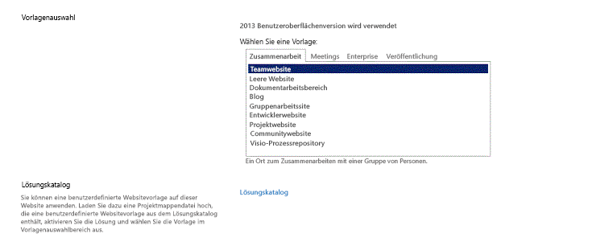

# <a name="set-up-a-general-development-environment-for-sharepoint"></a><span data-ttu-id="42f67-103">Einrichten einer allgemeinen Entwicklungsumgebung für SharePoint</span><span class="sxs-lookup"><span data-stu-id="42f67-103">Set up a general development environment for SharePoint</span></span>
<span data-ttu-id="42f67-104">Hier finden Sie Informationen zu den Schritten zur Einrichtung einer SharePoint-Entwicklungsumgebung, indem Sie SharePoint und Visual Studio installieren.</span><span class="sxs-lookup"><span data-stu-id="42f67-104">Learn the steps to set up a SharePoint development environment by installing SharePoint and Visual Studio.</span></span>
## <a name="how-to-determine-the-sharepoint-development-environment-you-need"></a><span data-ttu-id="42f67-105">Ermitteln der benötigten SharePoint-Umgebung</span><span class="sxs-lookup"><span data-stu-id="42f67-105">How to determine the SharePoint development environment you need</span></span>
<span data-ttu-id="42f67-106"><a name="SP15_bk_determinedevenv"> </a></span><span class="sxs-lookup"><span data-stu-id="42f67-106"></span></span>

<span data-ttu-id="42f67-107">Entscheiden Sie zuerst, welche Art von Lösungen Sie erstellen möchten (weitere Informationen zu SharePoint-Add-Ins finden Sie unter  [SharePoint-Add-Ins](http://msdn.microsoft.com/library/cd1eda9e-8e54-4223-93a9-a6ea0d18df70%28Office.15%29.aspx)):</span><span class="sxs-lookup"><span data-stu-id="42f67-107">First, decide what you want to build (to learn more about SharePoint Add-ins, see  [SharePoint Add-ins](http://msdn.microsoft.com/library/cd1eda9e-8e54-4223-93a9-a6ea0d18df70%28Office.15%29.aspx)):</span></span>
  
    
    

- <span data-ttu-id="42f67-108">Wenn Sie Farmlösungen erstellen möchten, finden Sie in diesem Artikel die entsprechenden Schritte.</span><span class="sxs-lookup"><span data-stu-id="42f67-108">If you want to build farm solutions, we provide those steps in this article.</span></span> 
    
  
- <span data-ttu-id="42f67-109">Wenn Sie SharePoint-Add-Ins erstellen möchten, finden Sie weitere Informationen unter  [Tools und Umgebungen für die Entwicklung von Add-Ins für SharePoint](http://msdn.microsoft.com/library/6906eb86-8270-4098-8106-1e8d0d3c212e%28Office.15%29.aspx).</span><span class="sxs-lookup"><span data-stu-id="42f67-109">If you want to create SharePoint Add-ins, see  [Tools and environments for developing SharePoint Add-ins](http://msdn.microsoft.com/library/6906eb86-8270-4098-8106-1e8d0d3c212e%28Office.15%29.aspx).</span></span> 
    
  

## <a name="create-a-sharepoint-development-environment-on-a-microsoft-azure-virtual-machine"></a><span data-ttu-id="42f67-110">Erstellen einer SharePoint-Entwicklungsumgebung auf einem virtuellen Microsoft Azure-Computer</span><span class="sxs-lookup"><span data-stu-id="42f67-110">Create a SharePoint development environment on a Microsoft Azure virtual machine</span></span>
<span data-ttu-id="42f67-111"><a name="SP15_bk_devenvazure"> </a></span><span class="sxs-lookup"><span data-stu-id="42f67-111"></span></span>

<span data-ttu-id="42f67-112">Wenn Sie über ein MSDN-Abonnement verfügen, können Sie schnell einen virtuellen Computer in Azure bereitstellen.</span><span class="sxs-lookup"><span data-stu-id="42f67-112">If you have an MSDN subscription, you can quickly provision a virtual machine in Azure.</span></span>
  
    
    
<span data-ttu-id="42f67-113">Wenn Sie den Microsoft Azure-Vorteil, der mit Ihrem MSDN-Abonnement verbunden ist, nicht aktiviert haben, können Sie sich unter  [Microsoft Azure-Vorteil für MSDN-Abonnenten](http://azure.microsoft.com/de-DE/pricing/member-offers/msdn-benefits/) darüber informieren.</span><span class="sxs-lookup"><span data-stu-id="42f67-113">If you haven't activated the Microsoft Azure benefit that comes with your MSDN subscription, you can learn more about it at  [Microsoft Azure Benefit for MSDN Subscribers](http://azure.microsoft.com/de-DE/pricing/member-offers/msdn-benefits/).</span></span>
  
    
    

> <span data-ttu-id="42f67-114">**Hinweis:** Im Microsoft Azure-Image-Katalog werden keine Images mehr bereitgestellt, in denen SharePoint und Visual Studio bereits vorinstalliert sind.</span><span class="sxs-lookup"><span data-stu-id="42f67-114">**Note** The Microsoft Azure Image Gallery no longer provides images with SharePoint and Visual Studio preinstalled. But a Microsoft Azure VM is still a good option for a development machine.</span></span> <span data-ttu-id="42f67-115">Ein virtueller Computer in Microsoft Azure ist aber dennoch eine gute Option für einen Entwicklungscomputer.</span><span class="sxs-lookup"><span data-stu-id="42f67-115">Note The Microsoft Azure Image Gallery no longer provides images with SharePoint and Visual Studio preinstalled. But a Microsoft Azure VM is still a good option for a development machine.</span></span> <span data-ttu-id="42f67-116">> Melden Sie sich beim [Microsoft Azure-Verwaltungsportal](https://manage.windowsazure.com) an.</span><span class="sxs-lookup"><span data-stu-id="42f67-116">Sign in to the  [Microsoft Azure management portal](https://manage.windowsazure.com).</span></span> <span data-ttu-id="42f67-117">> Erstellen Sie einen virtuellen Computer mithilfe eines der Images aus dem Katalog (Windows Server 2008 R2 Service Pack 1 x64, Windows Server 2012 oder höher).</span><span class="sxs-lookup"><span data-stu-id="42f67-117">Create a VM using one of the images in the gallery for Windows Server 2008 R2 Service Pack 1 x64, Windows Server 2012 (or later). Follow the instructions provided by the virtual machine creation wizard. We recommend an X-Large VM size for SharePoint development.</span></span> <span data-ttu-id="42f67-118">Befolgen Sie die Anweisungen im Assistenten für die Erstellung virtueller Computer.</span><span class="sxs-lookup"><span data-stu-id="42f67-118">Follow the instructions provided by the virtual machine creation wizard. We recommend an X-Large VM size for spnv development.</span></span> <span data-ttu-id="42f67-119">Für SharePoint-Entwicklungsprojekte empfehlen wir die VM-Größe **Sehr groß**. > Sobald der virtuelle Computer bereitgestellt wurde und ausgeführt wird, können Sie die Einrichtung abschließen. Befolgen Sie dazu die Anleitung im Abschnitt **Erstellen einer lokalen SharePoint-Entwicklungsumgebung** weiter unten.</span><span class="sxs-lookup"><span data-stu-id="42f67-119">We recommend an **X-Large** VM size for SharePoint development.> After the machine is provisioned and running, complete the setup using the same procedures in the section below **Create a SharePoint development environment on premises**.</span></span> <span data-ttu-id="42f67-120">(Überspringen Sie den Abschnitt zum Thema Betriebssysteminstallation.) > Nachdem Sie Ihre Entwicklungsumgebung eingerichtet haben, können Sie auf dem virtuellen Computer in Visual Studio über eine Azure-Point-to-Site-Verbindung auf Ihre Quellcodeverwaltung zugreifen.</span><span class="sxs-lookup"><span data-stu-id="42f67-120">(Skip the section about installing the operating system.)> Once you've set up your development environment, you can access your source control from Visual Studio on the virtual machine by using an Azure Point-to-Site connection.</span></span> <span data-ttu-id="42f67-121">Eine Anleitung finden Sie in unserem Artikel zum Thema [Konfigurieren einer Point-to-Site-VPN-Verbindung zu einem virtuellen Azure-Netzwerk](https://azure.microsoft.com/de-DE/documentation/articles/vpn-gateway-point-to-site-create/).</span><span class="sxs-lookup"><span data-stu-id="42f67-121">See  [Configure a point-to-site VPN connection to an Azure Virtual Network](https://azure.microsoft.com/de-DE/documentation/articles/vpn-gateway-point-to-site-create/) for instructions on how to do this.</span></span>
  
    
    


## <a name="create-a-sharepoint-development-environment-on-premises"></a><span data-ttu-id="42f67-122">Erstellen einer lokalen SharePoint-Entwicklungsumgebung</span><span class="sxs-lookup"><span data-stu-id="42f67-122">Create a SharePoint development environment on premises</span></span>
<span data-ttu-id="42f67-123"><a name="SP15_bk_devenvazure"> </a></span><span class="sxs-lookup"><span data-stu-id="42f67-123"></span></span>


  
    
    

### <a name="install-the-operating-system-for-your-sharepoint-add-ins-development-environment"></a><span data-ttu-id="42f67-124">Installieren des Betriebssystems für Ihre SharePoint-Add-Ins-Entwicklungsumgebung</span><span class="sxs-lookup"><span data-stu-id="42f67-124">Install the operating system for your SharePoint Add-ins development environment</span></span>
<span data-ttu-id="42f67-125"><a name="SP15_bk_InstallOS"> </a></span><span class="sxs-lookup"><span data-stu-id="42f67-125"></span></span>

<span data-ttu-id="42f67-p102">Die Anforderungen für eine Entwicklungsumgebung für eine SharePoint-Installation sind weniger stringent und kostengünstiger als die Anforderungen für eine Produktionsumgebung. In einer Entwicklungsumgebung sollten Sie einen Computer mit einer x64-fähigen CPU, und mindestens 16 GB RAM, um SharePoint zu installieren und auszuführen; 24 GB RAM sind empfehlenswert. Je nach Anforderungen und Budget können Sie aus den folgenden Optionen wählen:</span><span class="sxs-lookup"><span data-stu-id="42f67-p102">The requirements for a development environment for an installation of SharePoint are less stringent and costly than the requirements for a production environment. In any development environment, you should use a computer with an x64-capable CPU, and at least 16 GB of RAM to install and run SharePoint; 24 GB of RAM is preferable. Depending on your specific requirements and budget, you can choose one of the following options:</span></span>
  
    
    

- <span data-ttu-id="42f67-129">Installieren Sie SharePoint unter Windows Server 2008 R2 Service Pack 1 x64 oder Windows Server 2012 (oder höher).</span><span class="sxs-lookup"><span data-stu-id="42f67-129">Install SharePoint on Windows Server 2008 R2 Service Pack 1 x64 or Windows Server 2012 (or later).</span></span>
    
  
- <span data-ttu-id="42f67-p103">Verwenden Sie Microsoft Hyper-V, und installieren Sie SharePoint auf einem virtuellen Computer unter einem Gastbetriebssystem Windows Server 2008 R2 Service Pack 1 x64 oder Windows Server 2012. Eine Anleitung zum Einrichten eines virtuellen Microsoft Hyper-V-Computers für SharePoint finden Sie unter  [Verwenden bewährter Konfigurationsmethoden für virtuelle SharePoint-Computer und die Hyper-V-Umgebung](http://technet.microsoft.com/de-DE/library/ff621103%28v=office.15%29.aspx).</span><span class="sxs-lookup"><span data-stu-id="42f67-p103">Use Microsoft Hyper-V and install SharePoint on a virtual machine running a Windows Server 2008 R2 Service Pack 1 x64 or Windows Server 2012 guest operating system. See  [Use best practice configurations for the SharePoint virtual machines and Hyper-V environment](http://technet.microsoft.com/de-DE/library/ff621103%28v=office.15%29.aspx) for guidance on setting up a Microsoft Hyper-V virtual machine for SharePoint.</span></span>
    
  

### <a name="install-the-app-development-prerequisites-for-the-operating-system-and-sharepoint"></a><span data-ttu-id="42f67-132">Installieren der Voraussetzungen zur App-Entwicklung für das Betriebssystem und SharePoint</span><span class="sxs-lookup"><span data-stu-id="42f67-132">Install the app development prerequisites for the operating system and SharePoint</span></span>
<span data-ttu-id="42f67-133"><a name="SP15_bk_prereqsOS"> </a></span><span class="sxs-lookup"><span data-stu-id="42f67-133"></span></span>

<span data-ttu-id="42f67-p104">Für SharePoint müssen auf Ihrem Betriebssystem als Voraussetzung bestimmte Komponenten installiert sein, bevor die Installation beginnt. Aus diesem Grund enthält SharePoint das PrerequisiteInstaller.exe-Tool, das alle vorausgesetzten Komponenten für Sie installiert. Führen Sie dieses Tool aus, bevor Sie das Setup.exe-Tool ausführen.</span><span class="sxs-lookup"><span data-stu-id="42f67-p104">SharePoint requires your operating system to have certain prerequisites installed before installation begins. For this reason, SharePoint includes a PrerequisiteInstaller.exe tool that installs all of the prerequisites for you. Run this tool before running the Setup.exe tool.</span></span>
  
    
    

1. <span data-ttu-id="42f67-137">Führen Sie das PrerequisiteInstaller.exe-Tool aus.</span><span class="sxs-lookup"><span data-stu-id="42f67-137">Run the PrerequisiteInstaller.exe tool.</span></span>
    
  
2. <span data-ttu-id="42f67-138">Führen Sie das in den Installationsdateien enthaltene Setup.exe-Tool aus.</span><span class="sxs-lookup"><span data-stu-id="42f67-138">Run the Setup.exe tool included with your installation files.</span></span>
    
  
3. <span data-ttu-id="42f67-139">Akzeptieren Sie die Microsoft-Software-Lizenzbedingungen.</span><span class="sxs-lookup"><span data-stu-id="42f67-139">Accept the Microsoft Software License Terms.</span></span>
    
  
4. <span data-ttu-id="42f67-140">Wählen Sie auf der Seite **Gewünschte Installation auswählen** die Option **Eigenständig** aus.</span><span class="sxs-lookup"><span data-stu-id="42f67-140">On the **Choose the installation you want** page, choose **Stand-alone**.</span></span>
    
   <span data-ttu-id="42f67-141">**Abbildung 2. Wahl des Installationstyps**</span><span class="sxs-lookup"><span data-stu-id="42f67-141">**Figure 2. Installation type choice**</span></span>

  

  
  

  

  
5. <span data-ttu-id="42f67-p105">Wenn bei der Installation Fehler auftreten, überprüfen Sie die Protokolldatei. Sie finden die Protokolldatei, indem Sie ein Eingabeaufforderungsfenster öffnen und die folgenden Befehle an der Eingabeaufforderung eingeben. Beim Abschluss der Installation wird ebenfalls ein Link zur Protokolldatei angezeigt.</span><span class="sxs-lookup"><span data-stu-id="42f67-p105">If any errors occur in the installation, review the log file. To find the log file, open a Command Prompt window, and then type the following commands at the command prompt. A link to the log file also appears when the installation is complete.</span></span>
    
```
  
cd %temp
dir /od *.log
```

6. <span data-ttu-id="42f67-146">Nach Abschluss der Installation werden Sie aufgefordert, den Konfigurations-Assistenten für SharePoint-Produkte und -Technologien zu starten.</span><span class="sxs-lookup"><span data-stu-id="42f67-146">After the installation is complete, you are prompted to start the SharePoint Products and Technologies Configuration Wizard.</span></span>
    
    > <span data-ttu-id="42f67-147">**Hinweis:** Der Konfigurations-Assistent für SharePoint-Produkte und -Technologien kann fehlschlagen, wenn Sie einen Computer verwenden, der zwar Mitglied einer Domäne ist, jedoch nicht an einen Domänencontroller angebunden ist.</span><span class="sxs-lookup"><span data-stu-id="42f67-147">**Note** The SharePoint Products and Technologies Configuration Wizard can fail if you are using a computer that is joined to a domain but that is not connected to a domain controller. If this failure occurs, connect to a domain controller either directly or through a Virtual Private Network (VPN) connection, or sign in with a local account that has administrative privileges on the computer.</span></span> <span data-ttu-id="42f67-148">Falls dieser Fehler auftritt, müssen Sie entweder eine direkte Verbindung oder eine VPN (Virtual Private Network)-Verbindung zu einem Domänencontroller herstellen oder sich mit einem lokalen Konto anmelden, das auf dem Computer über Administratorrechte verfügt.</span><span class="sxs-lookup"><span data-stu-id="42f67-148">The SharePoint Products and Technologies Configuration Wizard can fail if you are using a computer that is joined to a domain but that is not connected to a domain controller. If this failure occurs, connect to a domain controller either directly or through a Virtual Private Network (VPN) connection, or sign in with a local account that has administrative privileges on the computer.</span></span> 
7. <span data-ttu-id="42f67-149">Nach Abschluss des Konfigurations-Assistenten wird die Seite **Vorlagenauswahl** der neuen SharePoint-Website angezeigt.</span><span class="sxs-lookup"><span data-stu-id="42f67-149">After the configuration wizard is complete, you see the **Template Selection** page of the new SharePoint site.</span></span>
    
   <span data-ttu-id="42f67-150">**Abbildung 3: Auswählen der Websitevorlagenseite**</span><span class="sxs-lookup"><span data-stu-id="42f67-150">**Figure 3. Choose site template page**</span></span>

  

  
  

  

  

### <a name="install-visual-studio"></a><span data-ttu-id="42f67-152">Installieren von Visual Studio</span><span class="sxs-lookup"><span data-stu-id="42f67-152">Install Visual Studio</span></span>
<span data-ttu-id="42f67-153"><a name="SP15_bk_installVS"> </a></span><span class="sxs-lookup"><span data-stu-id="42f67-153"></span></span>

<span data-ttu-id="42f67-154">Wenn Sie Visual Studio installieren, erhalten Sie alle Vorlagen, Tools und Assemblys, um SharePoint auf Ihrem lokalen Entwicklungscomputer zu entwickeln.</span><span class="sxs-lookup"><span data-stu-id="42f67-154">When you install Visual Studio, you get all of the templates, tools, and assemblies to develop SharePoint on your local development machine.</span></span>
  
    
    
<span data-ttu-id="42f67-155">Unter  [Installieren von Visual Studio](http://msdn.microsoft.com/de-DE/library/e2h7fzkw.aspx) finden Sie Anleitungen zum Installieren von Visual Studio.</span><span class="sxs-lookup"><span data-stu-id="42f67-155">See  [Installing Visual Studio](http://msdn.microsoft.com/de-DE/library/e2h7fzkw.aspx) for instructions about installing Visual Studio.</span></span>
  
    
    

#### <a name="verbose-logging-in-visual-studio"></a><span data-ttu-id="42f67-156">Ausführliche Protokollierung in Visual Studio</span><span class="sxs-lookup"><span data-stu-id="42f67-156">Verbose logging in Visual Studio</span></span>

<span data-ttu-id="42f67-157">Führen Sie die folgenden Schritte aus, wenn Sie die ausführliche Protokollierung aktivieren möchten:</span><span class="sxs-lookup"><span data-stu-id="42f67-157">Follow these steps if you want to turn on verbose logging:</span></span>
  
    
    

1. <span data-ttu-id="42f67-158">Öffnen Sie die Registrierung und navigieren Sie zu **HKEY_CURRENT_USER\\Software\\Microsoft\\VisualStudio\\ _nn.n_\\SharePointTools**, dabei steht _nn.n_ für die Version von Visual Studio, z. B. 12.0 oder 14.0.</span><span class="sxs-lookup"><span data-stu-id="42f67-158">Open the registry, and navigate to **HKEY_CURRENT_USER\\Software\\Microsoft\\VisualStudio\\ _nn.n_\\SharePointTools**, where _nn.n_ is the version of Visual Studio, such as 12.0 or 14.0.</span></span>
    
  
2. <span data-ttu-id="42f67-159">Fügen Sie einen DWORD-Schlüssel mit dem Namen **EnableDiagnostics** hinzu.</span><span class="sxs-lookup"><span data-stu-id="42f67-159">Add a DWORD key named **EnableDiagnostics**.</span></span>
    
  
3. <span data-ttu-id="42f67-160">Geben Sie dem Schlüssel den Wert **1**.</span><span class="sxs-lookup"><span data-stu-id="42f67-160">Give the key the value **1**.</span></span>
    
  
<span data-ttu-id="42f67-161">Der Registrierungspfad wird sich in kommenden Versionen von Visual Studio ändern.</span><span class="sxs-lookup"><span data-stu-id="42f67-161">The registry path will change in future versions of Visual Studio.</span></span>
  
    
    

## <a name="next-steps"></a><span data-ttu-id="42f67-162">Nächste Schritte</span><span class="sxs-lookup"><span data-stu-id="42f67-162">Next steps</span></span>
<span data-ttu-id="42f67-163"><a name="SP15_bk_devenvazure"> </a></span><span class="sxs-lookup"><span data-stu-id="42f67-163"></span></span>

<span data-ttu-id="42f67-164">Wenn Sie Workflows erstellen, fahren Sie mit  [Einrichten und Konfigurieren von SharePoint-Workflow-Manager](set-up-and-configure-sharepoint-workflow-manager.md).</span><span class="sxs-lookup"><span data-stu-id="42f67-164">If you will be creating workflows, continue with  [Set up and configure SharePoint Workflow Manager](set-up-and-configure-sharepoint-workflow-manager.md).</span></span>
  
    
    

## <a name="additional-resources"></a><span data-ttu-id="42f67-165">Zusätzliche Ressourcen</span><span class="sxs-lookup"><span data-stu-id="42f67-165">Additional resources</span></span>
<span data-ttu-id="42f67-166"><a name="SP15_bk_AddlResources"> </a></span><span class="sxs-lookup"><span data-stu-id="42f67-166"></span></span>


-  [<span data-ttu-id="42f67-167">Installieren von Visual Studio</span><span class="sxs-lookup"><span data-stu-id="42f67-167">Installing Visual Studio</span></span>](http://msdn.microsoft.com/de-DE/library/e2h7fzkw%28v=vs.110%29.aspx)
    
  
-  [<span data-ttu-id="42f67-168">Tools und Umgebungen für die Entwicklung von Add-Ins für SharePoint</span><span class="sxs-lookup"><span data-stu-id="42f67-168">Tools and environments for developing SharePoint Add-ins</span></span>](http://msdn.microsoft.com/library/6906eb86-8270-4098-8106-1e8d0d3c212e%28Office.15%29.aspx)
    
  

  
    
    

