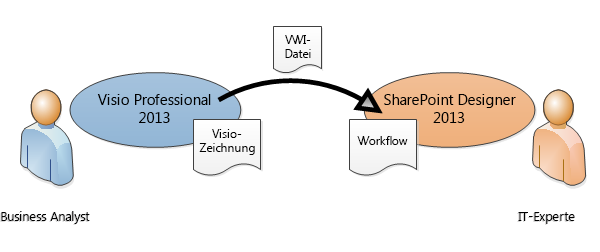
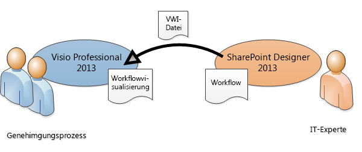
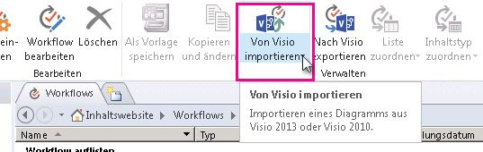
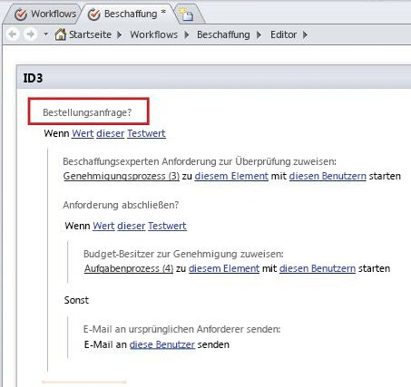

# Übertragen eines Workflows zwischen SharePoint Designer 2013 und Visio Professional 2013 (SharePoint 2010-Workflow-Plattform)Transfer a workflow between SharePoint Designer 2013 and Visio Professional 2013 (SharePoint 2010 Workflow platform)
Verwenden Sie SharePoint Designer zum Importieren eines Workflows aus Visio oder Exportieren eines Workflows zu Visio.Use SharePoint Designer to import a workflow from Visio or export a workflow to Visio.
## Übertragen eines Workflows zwischen SharePoint Designer 2013 und Visio Professional 2013Transferring a workflow between SharePoint Designer 2013 and Visio Professional 2013

Geschäfts- und Prozessanalysten, die bereits mit der Flussdiagrammerstellung in Visio vertraut sind, können Visio zum Erstellen eines SharePoint-Workflows verwenden. Der Workflow stellt in Visio die Geschäftslogik dar. Wenn die Geschäftslogik vollständig ist, kann der Workflow zu SharePoint Designer exportiert werden. Wenn der Workflow in SharePoint Designer vorhanden ist, kann ein IT-Experte diesen mit der SharePoint-Website verknüpfen.Business analysts and process analysts who are already familiar with flowcharting in Visio can use Visio to design a SharePoint workflow. The workflow in Visio represents the business logic. After the business logic is complete, the workflow can be exported to SharePoint Designer. Once the workflow is in SharePoint Designer, an IT professional can wire it up to the SharePoint site.
  
    
    

  
    
    

  
    
    
Sie können in Microsoft SharePoint Designer 2013 einen in Microsoft Visio Professional 2013 erstellten Workflow importieren oder einen Workflow zu Visio zur Ansicht exportieren.In Microsoft SharePoint Designer 2013, you can import a workflow created in Microsoft Visio Professional 2013 or export a workflow to Visio for viewing. 
  
    
    
In diesem Artikel wird die Übertragung eines Workflows mithilfe der SharePoint 2010-Workflowplattform in SharePoint Designer 2013 beschrieben.This article describes transferring a workflow by using the SharePoint 2010 Workflow platform in SharePoint Designer 2013.
  
    
    
So wählen Sie die SharePoint 2010-Workflowplattform aus, wenn Sie einen Workflow erstellenTo select the SharePoint 2010 Workflow platform when you create a workflow:
  
    
    

  
    
    

1. Klicken Sie im Bereich **Navigation** auf **Workflows**.In the **Navigation** pane, click **Workflows**.
    
  
2. Klicken Sie auf der Registerkarte **Workflows** im Abschnitt **Neu** auf **Listenworkflow**, **Wieder verwendbarer Workflow** oder **Websiteworkflow**.On the **Workflows** tab, in the **New** section, click **List Workflow**, **Reusable Workflow**, or **Site Workflow**.
    
  
3. Klicken Sie im Dialogfeld **Workflow erstellen** im Feld **Plattformtyp** auf **SharePoint 2010-Workflow**.In the **Create Workflow** dialog box, in the **Platform Type** box, click **SharePoint 2010 Workflow**.
    
  
Sie können Workflows in SharePoint Designer auf zwei Arten darstellen:You can visualize workflows in SharePoint Designer in two ways:
  
    
    

- Wenn Visio Services auf dem Server installiert ist, auf dem SharePoint ausgeführt wird, können Sie eine Workflowvisualisierung auf der Workflowstatusseite erstellen, auf der Status und Zuordnungen angezeigt werden.If Visio Services is installed on the server that is running SharePoint, you can create a workflow visualization on the workflow status page that displays progress and assignments.
    
  
- Sie können den Workflow zu Visio exportieren, um eine Workflowzeichnung zu erstellen, die für Feedback oder Genehmigung verwendet werden kann.You can export the workflow to Visio to create a workflow drawing that can be used for feedback and approval.
    
  

  
    
    

  
    
    

  
    
    

  
    
    

## Importieren eines Workflows aus VisioImport a workflow from Visio

So importieren Sie ein SharePoint-WorkflowTo import a SharePoint workflow, do the following:
  
    
    

1. Klicken Sie in SharePoint Designer 2013 im Bereich **Navigation** auf **Workflows**.In SharePoint Designer 2013, in the **Navigation** pane, click **Workflows**.
    
  
2. Klicken Sie auf der Registerkarte **Workflows** in der Gruppe **Verwalten** auf **Aus Visio importieren**.On the **Workflows** tab, in the **Manage** group, click **Import from Visio**.
    
  
  

  

  
3. Navigieren Sie im Dialogfeld **Workflow aus Visio-Zeichnung importieren** zu der zu verwendenden VWI-Datei ( Visio Workflow Interchange), wählen Sie diese aus, und klicken Sie dann auf **Weiter**.In the **Import Workflow from Visio Drawing** dialog box, browse to and select the Visio Workflow Interchange (.vwi) file you want to use, and then click **Next**.
    
  
4. Geben Sie einen Namen für den Workflow an, und wählen Sie dann den gewünschten Workflowtyp aus. Folgende Optionen stehen zur Auswahl:Type a name for the workflow, and then select the type of workflow you want it to be once it has been imported. Your choices are:
    
  - **Listenworkflow** Ein Workflow, der einer bestimmten Liste angefügt ist. Wenn Sie diese Option wählen, müssen Sie die Liste wählen, der der Workflow angefügt werden soll.**List workflow** A workflow that is attached to a specific list. If you select this option, you must choose the list to which the workflow will be attached.
    
  
  - **Wieder verwendbarer Workflow** Ein Workflow, der einem Inhaltstyp angefügt ist und daher portabel. Er kann von unterschiedlichen Listen auf einer SharePoint-Website verwendet werden. Wenn Sie diese Option wählen, müssen Sie den Inhaltstyp wählen, auf dem der Workflow ausgeführt wird.**Reusable workflow** A workflow that is attached to a content type, and is therefore portable. It can be used by different lists on a SharePoint site. If you select this option, you must choose the content type on which the workflow will run.
    
  
5. Klicken Sie auf **Fertig stellen**.Click **Finish**.
    
  
Der importierte Workflow wird im Workflow-Editor in SharePoint Designer im Vollbildmodus angezeigt. Der gesamte Text in benutzerdefinierten Visio-Formen wird im SharePoint Designer als Aktivitätsbezeichnung importiert (der graue Text in der Abbildung unten), um die Absicht des Workflows zu erläutern.The imported workflow appears in the SharePoint Designer full-screen workflow editor. All text in the Visio custom shapes is imported into SharePoint Designer as activity labels (the gray text in the image below) to clarify the intent of the workflow:
  
    
    

  
    
    

  
    
    
Wenn der Workflow in SharePoint Designer importiert wurde, kann er bearbeitet. Es können die notwendigen Bedingungen, Aktionen, Schritte und Einstellungen hinzugefügt werden.After the workflow is imported to SharePoint Designer, it is editable and can be revised to add the necessary conditions, actions, steps, and settings. 
  
    
    

## Exportieren eines Workflows zu VisioExport a workflow to Visio

Nachdem Sie einen Workflow in SharePoint Designer 2013 erstellt oder bearbeitet haben, können Sie den Workflow als Visio-Zeichnung exportieren, die in Visio Professional 2013 geöffnet werden kann. Die Möglichkeit, einen Workflow zurück zu Visio exportieren zu können, nachdem er in SharePoint Designer bearbeitet wurde, auch Roundtrips genannt, ermöglicht eine stärkere Zusammenarbeit zwischen Geschäftsbenutzern und Workflowdesignern. Wenn Sie den Workflowentwurf auf diese Weise durchlaufen, können Sie Visio zum Definieren der Geschäftsanforderungen verwenden und dann Roundtrips verwenden, um Änderungen zu koordinieren und zu genehmigen.Once you have created or edited a workflow in SharePoint Designer 2013, you can export the workflow as a Visio drawing that can be opened in Visio Professional 2013. The ability to export a workflow back to Visio after it has been edited in SharePoint Designer—also known as "round-tripping"—enables deeper collaboration between business users and workflow designers. When you iterate the workflow design in this way, you can use Visio to define the business requirements and then use round-tripping to coordinate and approve changes.
  
    
    

> **Hinweis:** Visio Professional 2013 bietet keine Unterstützung für Schritte.**Note:** Visio Professional 2013 does not support steps. In SharePoint Designer hinzugefügte Schrittinformationen gehen möglicherweise verloren, wenn der Workflow in Visio geöffnet und dann zurück in SharePoint Designer importiert wird.vispro15short does not support steps. Step information that has been added in SharePoint Designer may be lost when the workflow is viewed in Visio and then re-imported into SharePoint Designer. 
  
    
    

Gehen Sie wie folgt vor, um einen Workflow zu exportieren:To export a workflow, do the following:
  
    
    

1. Klicken Sie in SharePoint Designer 2013 im Bereich **Navigation** auf **Workflows**.In SharePoint Designer 2013, click **Workflows** in the **Navigation** pane.
    
  
2. Klicken Sie auf der Registerkarte **Workflow** in der Gruppe **Verwalten** auf **Nach Visio exportieren**.On the **Workflow** tab, in the **Manage** group, click **Export to Visio**.
    
  
3. Geben Sie im Dialogfeld **Workflow in Visio-Zeichnung exportieren** einen Namen für die Datei an, wählen Sie einen Speicherort, und klicken Sie auf **Speichern**. Die exportierte Datei wird als VWI-Datei gespeichert, die in Visio Professional 2013 direkt geöffnet werden kann.In the **Export Workflow to Visio Drawing** dialog box, name the file, select a location, and then click **Save**. The exported file is saved as a .vwi file that can be opened directly in Visio Professional 2013.
    
  

## Zusätzliche RessourcenAdditional resources

-  [Neuerungen in Workflows für SharePointWhat's new in workflows for SharePoint](what-s-new-in-workflows-for-sharepoint.md)
    
  
-  [Erste Schritte mit Workflows in SharePointGet started with workflows in SharePoint](get-started-with-workflows-in-sharepoint.md)
    
  
-  [Workflowentwicklung in SharePoint Designer und VisioWorkflow development in SharePoint Designer and Visio](workflow-development-in-sharepoint-designer-and-visio.md)
    
  

  
    
    

