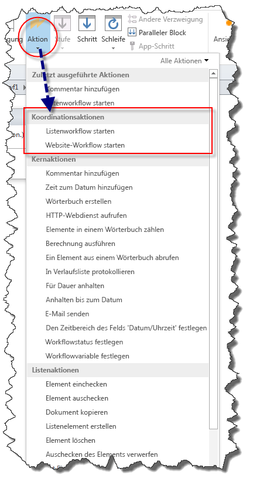
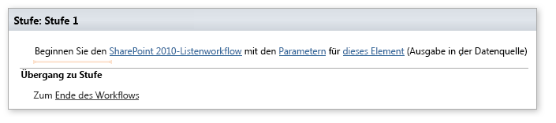
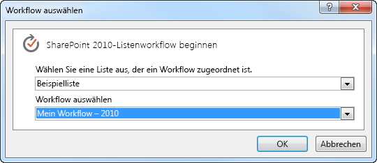
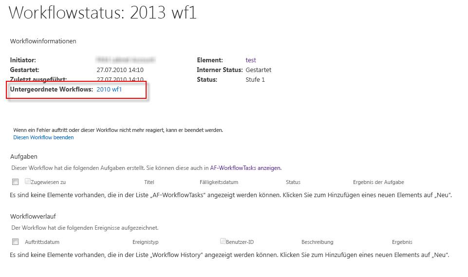

# Verstehen von Koordinationsaktionen in SharePoint Designer 2013Understanding Coordination actions in SharePoint Designer 2013
Koordinationsaktionen in SharePoint Designer 2013 dienen zum Starten eines Workflows, die auf der SharePoint 2010-Workflow-Plattform von innerhalb eines Workflows auf der SharePoint-Workflow-Plattform integriert.Coordination Actions in SharePoint Designer 2013 are designed to start a workflow built on the SharePoint 2010 Workflow platform from within a workflow built on the SharePoint Workflow platform.

   

## Koordinierungsaktionen in SharePoint Designer 2013Coordination Actions in SharePoint Designer 2013

Es sind zwei Koordinationsaktionen in SharePoint Designer 2013 verfügbar. Beide Aktionen sind nur für die SharePoint-Workflow-Plattform verfügbar. Diese Aktionen sind:There are two Coordination Actions available in SharePoint Designer 2013. Both actions are only available for the SharePoint Workflow platform. These actions are:
  
    
    

- Listenworkflow starten: zum Starten eines Workflows für eine bestimmte Liste entwickelt wurde.Start a List Workflow: Used to start a workflow developed for a specific list.
    
  
- Starten Sie einen Website-Workflow: zum Starten eines Workflows für die Website entwickelt wurden.Start a Site Workflow: Used to start a workflow developed for the site.
    
  
Koordinierung Aktionen werden im Dropdown-Menü **Aktionen** angezeigt, bei der Erstellung eines Workflows basierend auf der SharePoint-Workflow-Plattform, wie in der Abbildung dargestellt.Coordination Actions appear in the **Actions** drop-down menu when you build a workflow based on the SharePoint Workflow platform, as shown in the figure.
  
    
    

**Abbildung: Koordinierungsaktionen in SharePoint Designer****Figure: Coordination Actions in SharePoint Designer**

  
    
    

  
    
    

  
    
    
Beide Aktionen dienen zum Starten eines Workflows, die auf der SharePoint 2010-Workflow-Plattform mithilfe eines Workflows auf der SharePoint-Workflow-Plattform integriert.Both actions are designed to start a workflow built on the SharePoint 2010 Workflow platform from a workflow built on the SharePoint Workflow platform.
  
    
    

    
> **Wichtig:** Die Koordinationsaktionen unterstützen nur das Aufrufen eines auf der SharePoint 2010-Workflowplattform basierten Workflows von einem auf der SharePoint-Workflowplattform basierten Workflow.**Important:** The coordination actions only support starting a workflow based on the SharePoint 2010 Workflow platform from a workflow based on the SharePoint Workflow platform. Das Aufrufen eines auf der SharePoint-Workflowplattform basierten Workflows von einem auf derselben Plattform basierten Workflow wird nicht unterstützt.Starting a workflow built on the SharePoint Workflow platform from within a workflow built on the same platform is not supported. 
  
    
    

## Verwenden von KoordinationsaktionenUsing Coordination Actions

Es gibt eine Reihe von Aktionen, die in der SharePoint Workflow-Plattform veraltet sind. Legacy-Workflows zur Erfüllung können Sie Koordinationsaktionen verwenden. Koordinationsaktionen dienen zum Starten einer Listenworkflow oder Website-Workflow, der mithilfe der SharePoint 2010-Workflow-Plattform erstellt wurde.There are a number of actions that have been deprecated in the SharePoint Workflow platform. To accommodate legacy workflows you can use Coordination Actions. Coordination Actions can be used to start a List workflow or a Site workflow that has been built by using the SharePoint 2010 Workflow platform.
  
    
    
Eine Aktion Koordinierung umfasst drei bearbeitbare Bereichen wie in der Abbildung dargestellt.A Coordination Action includes three editable regions, as shown in the figure.
  
    
    

**Abbildung: Starten einer Listenworkflow-koordinierungsaktion****Figure: Start a List Workflow coordination action**

  
    
    

  
    
    

  
    
    
Die drei bearbeitbaren Bereiche sind:The three editable regions are: 
  
    
    

- **Workflow für SharePoint 2010** Wählen Sie den zu startenden Workflow 2010 aus.**SharePoint 2010 list workflow** Select the 2010 workflow to start.
    
  
- **Parameter** Parameter zum Senden an die 2010-Workflows.**parameters** Parameters to send to the 2010 workflow.
    
  
- **dieses Element** Das Element der 2010-Workflows ausgeführt werden soll, klicken Sie auf.**this item** The item which the 2010 workflow should be run on.
    
  
Klicken Sie auf einen bearbeitbaren Link, um Informationen eingeben. Klicken Sie auf den Link **SharePoint 2010-Listenworkflow** beispielsweise markieren Sie den zu startenden Workflow 2010. Ein Dialogfeld angezeigt wird, wählen Sie den Workflow verwendet werden, wie in der Abbildung dargestellt.Click an editable link to enter information. For example, to select the 2010 workflow to start, click the link **SharePoint 2010 list workflow**. A dialog box appears that can be used to select the workflow, as shown in the figure.
  
    
    

**Abbildung: Auswählen eines Workflows basierend auf der 2010-Plattform****Figure: Selecting a workflow based on the 2010 platform**

  
    
    

  
    
    

  
    
    

  
    
    

  
    
    

  
    
    
SharePoint 2010-Workflow-Plattform Workflow-Instanzen, die innerhalb eines SharePoint-Workflows aus koordiniert werden werden auf der Workflowstatusseite im Abschnitt Statusseite aufgelistet, wie in der Abbildung dargestellt.The SharePoint 2010 Workflow platform workflow instances that are coordinated from within a SharePoint workflow are listed on the workflow status page in the Subworkflows section, as shown in the figure.
  
    
    

**Abbildung: Workflow-Statusseite Listet die untergeordneten Workflows****Figure: The workflow status page lists the subworkflows**

  
    
    

  
    
    

  
    
    

  
    
    

  
    
    

## Siehe auchSee also

-  [Neuerungen in SharePoint-WorkflowsWhat's new in workflow in SharePoint](http://msdn.microsoft.com/library/6ab8a28b-fa2f-4530-8b55-a7f663bf15ea.aspx)
    
  
-  [Erste Schritte mit SharePoint-WorkflowsGetting started with SharePoint workflow](http://msdn.microsoft.com/library/cc73be76-a329-449f-90ab-86822b1c2ee8.aspx)
    
  
-  [Verstehen von Wörterbuchaktionen in SharePoint Designer 2013Understanding Dictionary actions in SharePoint Designer 2013](understanding-dictionary-actions-in-sharepoint-designer.md)
    
  

  
    
    

