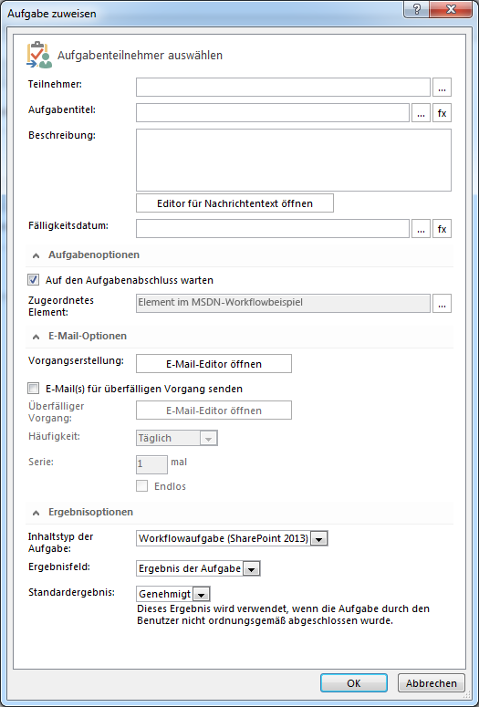

# Verstehen von Aufgabenaktionen in SharePoint Designer 2013Understanding Task Actions in SharePoint Designer 2013
Hier lernen, mit Aufgabenaktionen in SharePoint Designer 2013 zu arbeiten.Learn to use Task Actions in SharePoint Designer 2013.
||
|:-----|
||
   

## Übersicht über Aufgabenaktionen in SharePoint Designer 2013Overview of Task Actions in SharePoint Designer 2013

In SharePoint werden Aufgaben dazu verwendet, Personen oder Gruppen Arbeiten zuzuweisen und den Arbeitsfortschritt nachzuverfolgen.A task in SharePoint is used to assign work to a person or group and then track the progress of that work over time. In SharePoint Designer 2013 gibt es zwei Workflowaktionen für die Arbeit mit Aufgaben.There are two workflow actions in SharePoint Designer 2013 designed for working with tasks.
  
    
    
Konkret sind das die folgenden Aktionen:These actions are:
  
    
    

- **Aufgabe zuweisen** wird verwendet, um eine SharePoint-Aufgabe zu erstellen und einem einzelnen Teilnehmer zuzuweisen.**Assign a task** is used to create a SharePoint task and assign it to a single participant.
    
  
- **Vorgangsprozess starten** wird verwendet, um eine Aufgabe mehreren Teilnehmern zuzuweisen.**Start a task process** is used to assign a task to multiple participants.
    
  
Sie finden die Aufgabenaktionen im Dropdown-Menü **Aktion** im Menüband von SharePoint Designer 2013, wie in der Abbildung unten zu sehen ist.The Task Actions are accessed in the **Action** drop-down menu of the SharePoint Designer 2013 ribbon, as shown in the figure.
  
    
    

**Abbildung: Aufgabenaktionen in SharePoint Designer 2013****Figure: Task Actions in SharePoint Designer 2013**

  
    
    

  
    
    

  
    
    

  
    
    

  
    
    

## Verwenden von Aufgabenaktionen in SharePointUsing Task Actions in SharePoint

Ein Geschäftsprozess besteht häufig aus Aufgaben, die von Personen ausgeführt werden müssen. Ein Workflow koordiniert die einzelnen Prozesschritte. Ein Workflow verwendet Aufgabenaktionen, um Personen Aufgaben zuzuweisen. Beispielsweise müssen verschiedenen Aufgaben durchgeführt werden, wenn ein Unternehmen einen neuen Mitarbeiter anstellt. Eine dieser Aufgaben könnte die Mitarbeitereinführung sein. Für diese Aufgabe könnte dann ein Mitarbeiter der Personalabteilung verantwortlich sein.A business process often consists of tasks that must be performed by people. A workflow orchestrates the steps of a process. A workflow uses Task Actions to assign tasks to people. For example, when a new employee is hired a number of tasks need to be performed. One such task might be a new employee orientation. The task might need to be performed by a member of the Human Resources department.
  
    
    
Die Aktionen **Aufgabe zuweisen** und **Vorgangsprozess starten** befinden sich im Dropdown-Menü **Aktionen** auf dem Menüband in SharePoint Designer 2013. Sie können einem Workflow Aktionen hinzufügen und Sie an Ihre Bedürfnisse anpassen. Die Aktion **Aufgabe zuweisen** wird verwendet, um eine Aufgabe einem einzelnem Teilnehmer zuzuweisen. Die Aktion **Vorgangsprozess starten** wird verwendet, um eine Aufgabe mehreren Teilnehmern zuzuweisen.The **Assign a task** and **Start a task process** actions are located on the **Actions** drop-down menu in the SharePoint Designer 2013 ribbon. You can add the actions to your workflow and then customize them for your particular circumstance. The **Assign a task** action is used to assign a task to a single participant. The **Start a task process** action is used to assign a task to multiple participants.
  
    
    

### Zuweisen einer AufgabeAssign a task

Die untenstehende Abbildung zeigt die Aktion **Aufgabe zuweisen**.The **Assign a task** action is shown in the figure.
  
    
    

**Abbildung: Aktion "Aufgabe zuweisen" in SharePoint Designer 2013****Figure: The Assign a task action in SharePoint Designer 2013**

  
    
    

  
    
    

  
    
    

  
    
    

  
    
    
Für die Aktion **Assign a task** werden drei Eingaben benötigt: der Benutzer, dem die Aufgabe zugeteilt werden soll, die Variable "Ergebnis" und die Variable "Aufgaben-ID.The **Assign a task** action takes three inputs: the user to assign a task, the outcome variable, and the task id variable.
  
    
    

- **this user**: Öffnet das Dialogfenster **Aufgabe zuweisen** (siehe Abbildung unten). In diesem Dialogfenster können Sie verschiedene Parameter festlegen: Teilnehmer, Aufgabentitel, Beschreibung, Fälligkeitsdatum, Aufgabenoptionen, E-Mail-Optionen und Ergebnisoptionen.**this user**: Opens the **Assign a Task** dialog as shown in the figure. Use the dialog to set the participant, task title, description, due date, task options, email options, and outcome options.
    
  
- **Variable: Outcome**: Hiermit wird die Variable zugewiesen, die das Ergebnis der Aufgabe enthält.**Variable: Outcome**: Assigns the variable that will hold the outcome of the task.
    
  
- **Variable: TaskID**: Hiermit wird die Variable zugewiesen, die die Aufgaben-ID enthält.**Variable: TaskID**: Assigns the variable that will hold the id of the task.
    
  

**Abbildung: Dialogfenster "Aufgabe zuweisen"****Figure: The Assign a Task dialog box**

  
    
    

  
    
    

  
    
    

  
    
    

  
    
    

### Aufgabenprozess startenStart a task process

Die untenstehende Abbildung zeigt die Aktion **Vorgangsprozess starten**.The **Start a task process** action is shown in the figure.
  
    
    

**Abbildung: Die Aktion "Vorgangsprozess starten".****Figure: The "Start a task process" action.**

  
    
    

  
    
    

  
    
    

  
    
    

  
    
    
Für die Aktion **Vorgangsprozess starten** werden zwei Eingaben benötigt: die Bentutzer, die an der Aufgabe teilnehmen werden und die Variable "Ergebnis".The **Start a task process** action takes two inputs: the users that will participate in the task and the outcome variable.
  
    
    

- **these users**: Öffnet das Dialogfenster **Vorgangsprozess starten**, wie in der Abbildung unten zu sehen ist. In diesem Dialogfenster können Sie verschiedene Parameter festlegen: Teilnehmer, Aufgabentitel, Beschreibung, Fälligkeitsdatum, Aufgabenoptionen, E-Mail-Optionen und Ergebnisoptionen.**these users**: Opens the **Start a Task Process** dialog box as shown in the figure. Use the dialog box to set the participants, task title, description, due date, task options, email options, and outcome options.
    
  
- **Variable: Outcome**: Hiermit wird die Variable zugewiesen, die das Ergebnis des Vorgangsprozesses enthält.**Variable: Outcome**: Assigns the variable that holds the outcome of the task process.
    
  

**Abbildung: Dialogfenster "Vorgangsprozess starten"****Figure: The Start a Task Process dialog box**

  
    
    

  
    
    

  
    
    

  
    
    

  
    
    

## Siehe auchSee also

-  [Neuerungen in SharePoint-WorkflowsWhat's new in workflow in SharePoint](http://msdn.microsoft.com/library/6ab8a28b-fa2f-4530-8b55-a7f663bf15ea.aspx)
    
  
-  [Erste Schritte mit SharePoint-WorkflowsGetting started with SharePoint workflow](http://msdn.microsoft.com/library/cc73be76-a329-449f-90ab-86822b1c2ee8.aspx)
    
  
-  [Workflowentwicklung in SharePoint Designer und VisioWorkflow development in SharePoint Designer and Visio](workflow-development-in-sharepoint-designer-and-visio.md)
    
  
-  [Kurzübersicht zu Workflowaktionen (SharePoint-Workflowplattform)Workflow actions quick reference (SharePoint Workflow platform)](workflow-actions-quick-reference-sharepoint-workflow-platform.md)
    
  

  
    
    

