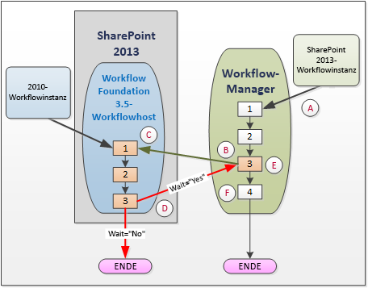
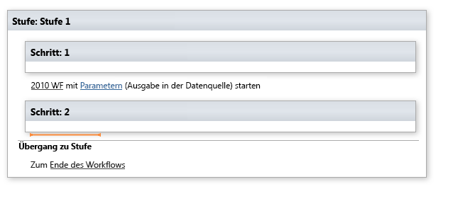
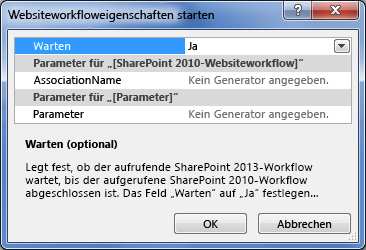
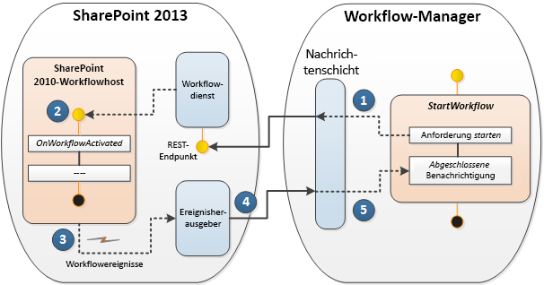

# Verwenden von Workflow-Interop für SharePointUse workflow interop for SharePoint
Enthält eine Erörterung der Verwendung von SharePoint-Workflow Interop im Workflow-Designer Visual Studio 2012. Workflow-Interop ermöglicht Ihnen, einen Workflow SharePoint 2010 innerhalb eines Workflows SharePoint von aufgerufen werden soll. Dies ist ein wichtiges Feature, mit dem Sie die vorhandenen Workflowfeatures wiederverwenden und zum Aufrufen von für Workflow-Aktivitäten, die nicht in SharePoint integriert werden.Provides a discussion of using SharePoint workflow Interop in the Visual Studio 2012 workflow designer. Workflow interop allows you to invoke a SharePoint 2010 workflow from within a SharePoint workflow. This is an important feature that allows you to reuse existing workflow features, and to call on workflow activities that are not integrated into SharePoint.

  
    
    

> **Wichtig:** Informationen zum Verwenden von SharePoint-Workflow-Interop-Funktionen in SharePoint Designer 2013, finden Sie unter  [Grundlegendes zur Koordination Aktionen in SharePoint Designer 2013](understanding-coordination-actions-in-sharepoint-designer.md).**Important:** To learn about using SharePoint workflow interop functionality in SharePoint Designer 2013, see  [Understanding Coordination actions in SharePoint Designer 2013](understanding-coordination-actions-in-sharepoint-designer.md). 
  
    
    

## SharePoint-WorkflowinteroperabilitätSharePoint workflow interop

Es folgt das Problem. Sie haben legacy SharePoint 2010 Workflows, die Sie auf Ihrer SharePoint Plattform wiederverwenden möchten. Oder, schlechter, Sie neue SharePoint Workflows erstellen, und Sie benötigen, Aktivitäten aufgerufen werden soll, die nur in der SharePoint 2010-Plattform verfügbar sind. Und Sie nicht wissen, was zu tun. Tatsächlich, die Lösung ist einfach: Verwenden von SharePoint-Workflow Interop.Here's the problem. You have legacy SharePoint 2010 workflows that you wish to reuse on your SharePoint platform. Or, worse, you are creating new SharePoint workflows and you need to invoke activities that are only available in the SharePoint 2010 platform. And you don't know what to do. Actually, the solution is simple: use SharePoint workflow Interop.
  
    
    
SharePoint-workflowinteroperabilität kann SharePoint 2010 Workflows (basierend auf Windows Workflow Foundation 3) reibungslos das Workflowmodul SharePoint entwickelt dem Windows Workflow Foundation 4 basiert. Während die neue Windows Workflow Foundation 4 Ausführung Engine in Workflow-Manager,, der als externer Dienst ausgeführt wird gehostet wird, enthält SharePoint noch den Vorversionen SharePoint Workflow-Host die verwendet wird, um SharePoint 2010 Workflows zu verarbeiten. SharePoint-workflowinteroperabilität handelt die beiden ausführungsumgebungen, wie in Abbildung 1 dargestellt.SharePoint workflow interop enables SharePoint 2010 workflows (built on Windows Workflow Foundation 3) to work smoothly with the SharePoint workflow engine, which is based on Windows Workflow Foundation 4. While the new Windows Workflow Foundation 4 execution engine is hosted in Workflow Manager, which runs as an external service, SharePoint still contains the legacy SharePoint workflow host which it uses to process SharePoint 2010 workflows. SharePoint workflow interop negotiates the two execution environments, as depicted in Figure 1.
  
    
    

**Abbildung 1. SharePoint-workflowinteroperabilität in Aktion****Figure 1. SharePoint workflow interop in action**

  
    
    

  
    
    

  
    
    
Lassen Sie uns durchgehen des Prozess, der in Abbildung 1 dargestellt. Verwenden Sie die Buchstaben auf Punkt der Hervorhebung in der Abbildung verweisen:Let's walk through the process depicted in Figure 1. Use the letters to reference points of emphasis in the illustration:
  
    
    

  
    
    
> ( **A** ) eine Instanz eines Workflows SharePoint gestartet in dann Windows Workflow Foundation 4-basierte Workflow-Manager. Beachten Sie, dass der Workflow-Manager nicht in SharePoint ist, aber stattdessen als externer Dienst ausgeführt wird.( **A** ) An instance of a SharePoint workflow starts to run in then Windows Workflow Foundation 4-based Workflow Manager. Note that the Workflow Manager is not in SharePoint, but instead runs as an external service.
    
  

  
    
    
> ( **B** ) erreichen Sie einen Punkt im SharePoint Workflow - Schrittnummer 3 im Workflow-Manager -, an den Sie einen Workflow SharePoint 2010 aufrufen möchten. In der Workflow-Designer Visual Studio 2012 führen Sie dies durch die Implementierung der Aktivitätsfeeds **Start 2010 WF** wie in Abbildung 2 dargestellt.( **B** ) You reach a point in the SharePoint workflow - step number 3 in the Workflow Manager - where you wish to invoke a SharePoint 2010 workflow. In the Visual Studio 2012 workflow designer, you do this by implementing the **Start 2010 WF** activity, as shown in Figure 2.
    
   **Abbildung 2. Stufenkachel zum Starten eines Workflows für SharePoint 2010.****Figure 2. Stage tile for starting a SharePoint 2010 workflow.**

  

  
  

    
    
    From the perspective of the SharePoint object model, this is accomplished using the  [StartWorkflow](https://msdn.microsoft.com/library/Microsoft.SharePoint.WorkflowServices.WorkflowInteropService.StartWorkflow.aspx) method on the [WorkflowInteropService](https://msdn.microsoft.com/library/Microsoft.SharePoint.WorkflowServices.WorkflowInteropService.aspx) class.
    
  

  
    
    
> ( **C** ) beginnt zu diesem Zeitpunkt der SharePoint 2010 Workflow in der Windows Workflow Foundation 3.5 Workflow-Host innerhalb von SharePoint ausgeführt. Aber ein wichtiger Aspekt angezeigt wird. In einigen Szenarien sollten Sie den Workflow 2013 warten, bis des 2010-Workflows, bis Sie abgeschlossen (und möglicherweise einige Daten zurückgeben) vor dem Ausführen den 2013-Workflow fortfahren. In anderen Szenarien Dies kann nicht erforderlich sein, und beide Workflows unabhängig und parallel ausgeführt.( **C** ) At this point, the SharePoint 2010 workflow begins executing in the Windows Workflow Foundation 3.5 workflow host inside of SharePoint. But an important consideration comes up. In some scenarios you may want the 2013 workflow to wait for the 2010 workflow to complete running (and perhaps return some data) before continuing to execute the 2013 workflow. In other scenarios, this may not be necessary and both workflows may run independently, in parallel.
    
    To control this behavior, the  [WorkflowInterop](https://msdn.microsoft.com/library/Microsoft.SharePoint.WorkflowServices.Activities.WorkflowInterop.aspx) class, which controls executing workflows in the Windows Workflow Foundation 3.5 workflow host, provides a [Wait](https://msdn.microsoft.com/library/Microsoft.SharePoint.WorkflowServices.Activities.WorkflowInterop.Wait.aspx) property. Setting this Boolean property to " **Yes**" (in the designer dialog box) or to **true** in the on the **Wait** property, causes the 2013 workflow to pause until the 2010 finished executing and returns a **completed** message.
    
    
    

   **Abbildung 3. Starten eines Dialogfelds für Workfloweigenschaften****Figure 3. Start a Workflow properties dialog box.**

  

  
  

  

  

  
    
    
> ( **D** ) die praktische Auswirkung der Auswahl von **true** oder **false** auf die **Wait** -Eigenschaft ( **Yes** oder **No** im Dialogfeld Eigenschaften) wird hier dargestellt. Wenn **Wait** **true**ist, klicken Sie dann der 2010-Workflow übergibt ein  [WorkflowCompleted](https://msdn.microsoft.com/library/Microsoft.SharePoint.WorkflowServices.WorkflowInteropEventReceiver.WorkflowCompleted.aspx) -Ereignis (und optional gibt Daten als Eigenschaft [DynamicValue](http://msdn.microsoft.com/library/2af7983b-8357-4e0f-9ba9-dfdeed05a8a7.aspx) ). Weitere Informationen über dynamische Werte finden Sie unter [Understanding Dynamic Value](http://msdn.microsoft.com/library/c5702628-9625-4d19-95c5-13923e91fea1.aspx).( **D** ) The practical effect of selecting **true** or **false** on the **Wait** property (or **Yes** or **No** in the properties dialog box) is depicted here. If **Wait** is **true**, then the 2010 workflow passes a  [WorkflowCompleted](https://msdn.microsoft.com/library/Microsoft.SharePoint.WorkflowServices.WorkflowInteropEventReceiver.WorkflowCompleted.aspx) event (and, optionally, returns data as a [DynamicValue](http://msdn.microsoft.com/library/2af7983b-8357-4e0f-9ba9-dfdeed05a8a7.aspx) property). For more information about dynamic values, see [Understanding Dynamic Value](http://msdn.microsoft.com/library/c5702628-9625-4d19-95c5-13923e91fea1.aspx).
    
    Of course, if **Wait** is set to **false**, then your 2010 workflow executes, then terminates normally.
    
  

  
    
    
> ( **E** ) dieser Schritt ist nur relevant, wenn der Aufruf des Workflows 2010 **Wait=true**angegeben. In diesem Fall der 2013-Workflow **WorkflowCompleted** -Ereignis empfangen und startet die Ausführung des Workflows 2013 an der Stelle, die sie unterbrochen.( **E** ) This step is only relevant if your invocation of the 2010 workflow specified **Wait=true**. In that case, your 2013 workflow received the **WorkflowCompleted** event and restarts the workflow 2013 execution at the point it left off.
    
  

  
    
    
> ( **F** ) 2013-Workflow dann nach abgeschlossener Ausführung und normal beendet. Wenn **Wait=false**, klicken Sie dann den 2013-Workflow ausgeführt wird und unabhängig von der 2010-Workflow wird beendet.( **F** ) Your 2013 workflow then completes execution and terminates normally. If **Wait=false**, then your 2013 workflow executes and terminates independently of the 2010 workflow. 
    
  

## Workflow-Interop-designWorkflow interop design

SharePoint-workflowinteroperabilität ist eine messaging-Framework, das eine Instanz 1: 1-Zuordnung zwischen WF-3 und 4 WF-Workflow-Aktivitäten unterstützt. WF 3 und 4 WF interagieren über den Nachrichtenaustausch von, die durch eine Reihe von WF 4 Aktivitäten auf  [WorkflowInteropService](https://msdn.microsoft.com/library/Microsoft.SharePoint.WorkflowServices.WorkflowInteropService.aspx) eingebunden sind.SharePoint workflow interop is a messaging framework that supports a one-to-one instance mapping between WF 3 and WF 4 workflow activities. WF 3 and WF 4 interoperate through message exchanges that are wrapped by a set of WF 4 activities on  [WorkflowInteropService](https://msdn.microsoft.com/library/Microsoft.SharePoint.WorkflowServices.WorkflowInteropService.aspx) .
  
    
    
Zur Unterstützung der Workflow-Interop bietet die Workflowentwurfsoberfläche in SharePoint Designer Zugriff auf eine neue Workflowaktivität **Start 2010 WF**, ist ein Wrapper für die  [StartWorkflow](https://msdn.microsoft.com/library/Microsoft.SharePoint.WorkflowServices.WorkflowInteropService.StartWorkflow.aspx) -Methode. Dadurch können Sie einen Listenworkflow oder Website-Workflow starten.To support workflow interop, the workflow design surface in SharePoint Designer provides access to a new workflow activity, **Start 2010 WF**, which is a wrapper on the  [StartWorkflow](https://msdn.microsoft.com/library/Microsoft.SharePoint.WorkflowServices.WorkflowInteropService.StartWorkflow.aspx) method. This activity allows you to start either a list workflow or a site workflow.
  
    
    
Die Aktivität ist tatsächlich eine Folge von Nachrichten, die stattfinden zwischen den Workflow-Manager und SharePoint 2010 Workflow-Host, der in SharePoint ausgeführt wird. Diese beiden sind von messaging-Ebene vermittelt, wie in Abbildung 4 dargestellt. Die Sequenz beginnt im Workflow-Manager SharePoint mit einem Aufruf der Methode **StartWorkflow**. Die Meldung "Start" wechselt zu den Workflowdienst innerhalb von SharePoint, wobei wiederum er den Workflow im Workflow-Host SharePoint 2010 gestartet. Nach Abschluss der Ausführung des Workflows 2010 ist ein Ereignis ausgelöst, die eine "Abgeschlossene" Nachricht über Herausgeber des Ereignisses zurück an den 2013-Workflow-Manager sendet.The activity is in fact a sequence of messages that take place between the Workflow Manager and the SharePoint 2010 Workflow Host that is running inside SharePoint. These two are mediated by a messaging layer, as shown in Figure 4. The sequence begins in the SharePoint workflow manager with an invocation of the **StartWorkflow** method. The "start" message goes to the workflow service inside of SharePoint, where in turn it launches the workflow inside the SharePoint 2010 workflow host. When execution of the 2010 workflow is complete, an event is fired that sends a "completed" message through the event publisher back to the 2013 workflow manager.
  
    
    

**Abbildung 4. SharePoint Workflow Interop-messaging-Protokoll****Figure 4. SharePoint workflow interop messaging protocol**

  
    
    

  
    
    

  
    
    

  
    
    

  
    
    

## Siehe auchSee also

-  [Erste Schritte mit Workflows in SharePointGet started with workflows in SharePoint](get-started-with-workflows-in-sharepoint.md)
    
  
-  [Grundlegendes zu SharePoint-WorkflowsSharePoint workflow fundamentals](sharepoint-workflow-fundamentals.md)
    
  
-  [Grundlegendes zur Koordination Aktionen in SharePoint Designer 2013Understanding Coordination actions in SharePoint Designer 2013](understanding-coordination-actions-in-sharepoint-designer.md)
    
  
-  [WorkflowInteropServiceWorkflowInteropService](https://msdn.microsoft.com/library/Microsoft.SharePoint.WorkflowServices.WorkflowInteropService.aspx)
    
  
-  [WorkflowInteropEventReceiverWorkflowInteropEventReceiver](https://msdn.microsoft.com/library/Microsoft.SharePoint.WorkflowServices.WorkflowInteropEventReceiver.aspx)
    
  

  
    
    

