# Visio-Shapes in SharePoint Designer 2013: Eine Kurzübersicht (SharePoint 2010-Workflowplattform)Visio shapes in SharePoint Designer 2013: A quick reference guide (SharePoint 2010 Workflow platform)
Sie können einen Workflow in Microsoft Visio Professional 2013 erstellen und diesen dann nach Microsoft SharePoint Designer 2013 exportieren. In diesem Handbuch sind die Visio-Shapes aufgeführt, die Sie zum Erstellen des Workflows verwenden.Verwenden Sie diesen Referenzartikel nur, wenn Sie in SharePoint Designer 2013 arbeiten, weiterhin jedoch die SharePoint 2010-Workflowplattform verwenden möchten.Die Shapes für die SharePoint 2010-Workflowplattform umfassen drei Schablonen: **Aktionen - SharePoint 2010-Workflow**, **Bedingungen - SharePoint 2010-Workflow** und **Abschlusszeichen - SharePoint 2010-Workflow**.You can create a workflow in Microsoft Visio Professional 2013 and then export it to Microsoft SharePoint Designer 2013. This guide identifies the Visio shapes that you use to create your workflow.Use this reference article only if you are working in SharePoint Designer 2013 but want to continue to use the SharePoint 2010 Workflow Platform.The shapes for the SharePoint 2010 Workflow Platform come in three stencils: **Actions - SharePoint 2010 Workflow**, **Conditions - SharePoint 2010 Workflow**, and **Terminators - SharePoint 2010 Workflow**.
## WorkflowaktionenWorkflow actions

Workflowaktionen sind bestimmte Vorgänge, die ein Workflow durchführt. Jeder Workflow muss mindestens eine Aktion enthalten.Workflow actions are specific operations that workflow performs. Every workflow must contain at least one action.
  
    
    
Die Aktionen in dieser Liste sind in Kategorien basierend auf ihrem Anwendungsbereich in einem Workflow organisiert. Beispielsweise werden die Aktionen, die Auswirkungen auf das Verhalten eines Listenelements haben, unter **Listenaktionen**, und Aktionen für Dokumentenmappen unter **Aktionen für die Dokumentenmappe** gruppiert. Die Kategorien für Aktionen sind:The actions in this list are organized in categories based on their area of application in a workflow. For example, actions that affect the behavior of a list item are grouped under **List Actions**, and actions related to document sets are grouped under **Document Set Actions**. The categories for actions are:
  
    
    

-  [Hauptaktionen](visio-shapes-in-sharepoint-designer-a-quick-reference-guide-sharepoint-2010.md#section1a) Hierbei handelt es sich um die am häufigsten verwendeten Aktionen in einem Workflow.[Core actions](visio-shapes-in-sharepoint-designer-a-quick-reference-guide-sharepoint-2010.md#section1a) These are the most commonly used actions in a workflow.
    
  
-  [Aktionen für die Dokumentenmappe](visio-shapes-in-sharepoint-designer-a-quick-reference-guide-sharepoint-2010.md#section1e) Diese Aktionen werden normalerweise in Workflows verwendet, die einer Dokumentbibliothek oder dem Dokumentinhaltstyp zugeordnet sind.[Document set actions](visio-shapes-in-sharepoint-designer-a-quick-reference-guide-sharepoint-2010.md#section1e) Typically, these actions are used in workflows that are associated with a document library or the document content type.
    
  
-  [Listenaktionen](visio-shapes-in-sharepoint-designer-a-quick-reference-guide-sharepoint-2010.md#section1b) Diese Aktionen führen Operationen in Listenelementen aus.[List actions](visio-shapes-in-sharepoint-designer-a-quick-reference-guide-sharepoint-2010.md#section1b) These actions perform operations on list items.
    
  
-  [Relationale Aktionen](visio-shapes-in-sharepoint-designer-a-quick-reference-guide-sharepoint-2010.md#section1d) Die einzige Aktion in dieser Kategorie sucht nach dem Vorgesetzten eines Benutzers und speichert diese Informationen in einer Variablen.[Relational actions](visio-shapes-in-sharepoint-designer-a-quick-reference-guide-sharepoint-2010.md#section1d) The single action in this category looks up a user's manager and stores that information in a variable.
    
  
-  [Aufgabenaktionen](visio-shapes-in-sharepoint-designer-a-quick-reference-guide-sharepoint-2010.md#section1c): Aktionen dieses Typs sind mit Genehmigungs-, Feedback- und Formularoperationen verknüpft.[Task actions](visio-shapes-in-sharepoint-designer-a-quick-reference-guide-sharepoint-2010.md#section1c) These actions are associated with approval, feedback, and form operations.
    
  

> **Wichtig:** Die meisten der Aktionsshapes, die sich in Visio in SharePoint-Workflows einfügen lassen, erfordern zusätzliche Konfigurationsanpassungen, wenn der Workflow in SharePoint Designer importiert wird.**Important:** Most of the action shapes that you can insert into a SharePoint workflow in Visio require additional configuration when the workflow is imported into SharePoint Designer. Denken Sie daran, in Visio über die Kommentarfunktion der einzelnen Aktionsshapes die Einstellungen oder Konfigurationsoptionen der jeweiligen Aktion zu vermerken.In Visio, remember to use the comments feature of each action shape to specify the settings or configuration of the action. 
  
    
    

### HauptaktionenCore actions

Dies sind die am häufigsten verwendeten Aktionen, die in in jedem Workflowtyp oder -schritt verwendet werden können.These are the most commonly-used actions and can be used in any type of workflow or step.

|**Visio-Aktions-Shapes****Visio Action Shape**|**Entsprechende Aktion in SharePoint Designer****Corresponding action in SharePoint Designer**|**Aktionsbeschreibung****Action description**|
|:-----|:-----|:-----|
||Diese Visio-Aktion ist identisch mit der Aktion **Kommentar hinzufügen** in SharePoint Designer 2013 und wird angezeigt als:This Visio action is the same as the **Add a Comment** action in SharePoint Designer 2013 and appears as:        **Hinweis:** Kommentare bleiben sichtbar, wenn der Workflow nach Visio exportiert wird.**Note:** Comments remain visible when the workflow is exported to Visio.           |**Kommentar hinzufügen****Add a comment**   Verwenden Sie diese Aktion, um informative Kommentare zu Referenzzwecken im Workflow-Designer zu hinterlassen. Dies ist besonders hilfreich, wenn es andere Benutzer gibt, die sich an der Erstellung von Workflows beteiligen. Wenn z. B. eine Variable im aktuellen Workflow keinen benutzerfreundlichen Namen aufweist, verwenden Sie diese Aktion zum Hinzufügen von Kommentaren, um anzugeben, welche Funktion die Variable im Workflow hat.Use this action to leave informative comments in the workflow designer for reference purposes. This is especially helpful when there are other users co-authoring the workflow. For example, if a variable in the current workflow doesn't have a user-friendly name, you use this action to add a comment to indicate what the variable does in the workflow.    |
||Diese Visio-Aktion ist identisch mit der Aktion **Zeit zum Datum hinzufügen** in SharePoint Designer 2013 und wird angezeigt als:This Visio action is the same as the **Add Time to Date** action in SharePoint Designer 2013 and appears as:   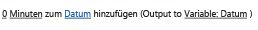|**Zeit zum Datum hinzufügen****Add time to date**   Mit dieser Aktion können Sie eine bestimmte Zeit in Minuten, Stunden, Tagen, Monaten oder Jahren zu einem Datum hinzufügen und den Ausgabewert als Variable speichern. Das Datum kann ein aktuelles Datum, ein bestimmtes Datum oder ein Nachschlagewert sein.Use this action to add a specific time in minutes, hours, days, months, or years to a date, and store the output value as a variable. The date can be a current date, specific date, or a lookup.    |
||Diese Visio-Aktion ist identisch mit der Aktion **Berechnung ausführen** in SharePoint Designer 2013 und wird angezeigt als:This Visio action is the same as the **Do Calculation** action in SharePoint Designer 2013 and appears as:   |**Berechnung ausführen****Do calculation**   Verwenden Sie diese Aktion, um eine Berechnung durchzuführen, z. B. das Addieren, Subtrahieren, Multiplizieren oder Dividieren zweier Werte, und um den Ausgabewert in einer Variablen zu speichern.Use this action to perform a calculation, such as add, subtract, multiply, or divide two values, and stores the output value in a variable.    |
||Diese Visio-Aktion ist identisch mit der Aktion **Für die Verlaufsliste protokollieren** in SharePoint Designer 2013 und wird angezeigt als:This Visio action is the same as the **Log to History List** action in SharePoint Designer 2013 and appears as:   |**Für die Verlaufsliste protokollieren****Log to history list**   Verwenden Sie diese Aktion, um eine Nachricht zum Workflow in seiner Verlaufsliste zu protokollieren. Eine Nachricht kann eine Zusammenfassung eines Workflowereignisses oder etwas anderes wichtiges über den Workflow sein. Die Verlaufsliste des Workflows kann bei der Behandlung von Problemen mit dem Workflow hilfreich sein.Use this action to log a message about the workflow into its history list. A message can be a summary of a workflow event, or anything significant about the workflow. The workflow history list can be helpful in troubleshooting issues with the workflow.    |
||Diese Visio-Aktion ist identisch mit der Aktion **Für Dauer anhalten** in SharePoint Designer 2013 und wird angezeigt als:This Visio action is the same as the **Pause for Duration** action in SharePoint Designer 2013 and appears as:   |**Für Dauer anhalten****Pause for duration**   Mit dieser Aktion können Sie den Workflow während eines bestimmten Zeitraums anhalten, angegeben in Tagen, Stunden oder Minuten.Use this action to pause the workflow for a specific duration in days, hours, or minutes.    **Hinweis:** Die Verzögerungszeit wird durch das Intervall des Zeitgeberauftrags festgelegt. Der Standardwert beträgt 5 Minuten.**Note:** The delay time is effected by the timer job interval, which has a default value of five minutes.           |
||Diese Visio-Aktion ist identisch mit der Aktion **Bis Datum anhalten** in SharePoint Designer 2013 und wird angezeigt als:This Visio action is the same as the **Pause Until Date** action in SharePoint Designer 2013 and appears as:   |**Bis Datum anhalten****Pause until date**   Verwenden Sie diese Aktion, um den Workflow bis zu einem bestimmten Datum anzuhalten. Sie können das aktuelle Datum, ein bestimmtes Datum oder einen Nachschlagewert hinzufügen.Use this action to pause the workflow until a particular date. You can add a current date, a specific date, or a lookup.    |
||Diese Visio-Aktion ist identisch mit der Aktion **Den Zeitbereich des Felds 'Datum/Uhrzeit' festlegen** in SharePoint Designer 2013 und wird angezeigt als:This Visio action is the same as the **Set Time Portion of Date/Time Field** action in SharePoint Designer 2013 and appears as:   |**Den Zeitbereich des Felds 'Datum/Uhrzeit' festlegen****Set time portion of date/time field**   Verwenden Sie diese Aktion, um einen Zeitstempel zu erstellen und den Ausgabewert in einer Variablen zu speichern. Sie können die Uhrzeit in Stunden und Minuten festlegen und ein aktuelles Datum, ein bestimmtes Datum oder einen Nachschlagewert festlegen.Use this action to create a timestamp, and stores the output value in a variable. You can set the time in hours and minutes and add a current date, specific date or a lookup.    |
|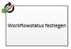| Diese Visio-Aktion ist identisch mit der Aktion **Workflowstatus festlegen** in SharePoint Designer 2013 und wird angezeigt als:This Visio action is the same as the **Set Workflow Status** action in SharePoint Designer 2013 and appears as:    Sie können einen Statuswert nicht umbenennen oder löschen, nachdem dieser erstellt wurde. Allerdings müssen Sie diesen nicht verwenden.  You cannot rename or delete a status value once it has been created. However, you do not have to use it.    Ein benutzerdefinierter Status ist nur für den aktuellen Workflow anwendbar und kann nicht in einem anderen Workflow verwendet werden.A custom status is applicable to the current workflow only, and cannot be used in another workflow    Ein Workflow kann benutzerdefinierte in der Aktion definierte Statuswerte nicht verwenden, wenn die Aktion in einem Identitätswechselschritt verwendet wird.A workflow cannot use custom status values that you define in the action if the action is used inside an impersonation step.   |**Festlegen des Workflowstatus****Set workflow status**    Verwenden Sie diese Aktion, um den Status des Workflows festzulegen. Die Standardoptionen sind **Abgebrochen**, **Genehmigt** und **Abgelehnt**.  Use this action to set the status of the workflow. The default options are **Canceled**, **Approved**, and **Rejected**.    Sie können einen neuen Statuswert in der Dropdownliste in der Aktion eingeben. Sobald Sie einen Statuswert eingegeben haben, wird der Eintrag der Dropdownliste automatisch hinzugefügt.You can enter a new status value in the dropdown in the action. Once you enter a status value, the entry is automatically added to the dropdown list.    Wenn die Aktion **Workflowstatus festlegen** der letzte Schritt in einem Workflow war, in der auch ein benutzerdefinierter Wert verwendet wurde, wird der benutzerdefinierte Wert in der Spalte **Status** in der Liste angezeigt, wenn der Workflow angehalten oder abgeschlossen ist.If the **Set Workflow Status** action is the last step in your workflow where you have also used a custom value, you can see your custom value in the **Status** column in the list upon workflow pausing or completion.   |
||Diese Visio-Aktion ist identisch mit der Aktion **Workflowvariable festlegen** in SharePoint Designer 2013 und wird angezeigt als:This Visio action is the same as the **Set Workflow Variable** action in SharePoint Designer 2013 and appears as:   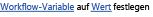|**Workflowvariable festlegen****Set workflow variable**   Verwenden Sie diese Aktion, um eine Workflowvariable auf einen Wert festzulegen. Verwenden Sie diese Aktion, wenn der Workflow einer Variablen Daten zuweisen soll.Use this action to set a workflow variable to a value. Use this action when you want the workflow to assign data to a variable.    |
|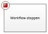|Diese Visio-Aktion ist identisch mit der Aktion **Workflow beenden** in SharePoint Designer 2013 und wird angezeigt als:This Visio action is the same as the **Stop workflow** action in SharePoint Designer 2013 and appears as:   |**Workflow beenden****Stop workflow**    Verwenden Sie diese Aktion, um die aktuelle Instanz des Workflows zu stoppen und eine Nachricht in der Liste **Workflowverlauf** zu protokollieren. Die in der Aktion angegebene Nachricht wird in der Spalte **Beschreibung** im Workflowverlauf angezeigt, wenn der Workflow abgeschlossen wird. Use this action to stop the current instance of the workflow and log a message to the **Workflow History** list. The message that you specify in the action will appear in the **Description** column in the Workflow History upon workflow completion.   |
   

### ListenaktionenList actions

Diese Aktionen werden für Listenelemente verwendet.These actions are used on list items.
  
    
    

|**VISIO-AKTIONS-SHAPE****VISIO ACTION SHAPE**|**ENTSPRECHENDE AKTION IN SHAREPOINT DESIGNER****CORRESPONDING ACTION IN SHAREPOINT DESIGNER**|**AKTIONSBESCHREIBUNG****ACTION DESCRIPTION**|
|:-----|:-----|:-----|
||Diese Visio-Aktion ist identisch mit der Aktion **Listenelementberechtigungen hinzufügen** in SharePoint Designer 2013 und wird wie folgt visuell dargestellt:This Visio action is the same as the **Add List Item Permissions** action in SharePoint Designer 2013 and appears as:       **Hinweis:** Diese Aktion ist nur innerhalb von Identitätswechselschritten verfügbar.    **Note:** This action is only available within an impersonation step.           |**Listenelementberechtigungen hinzufügen****Add list item permissions**   Diese Aktion gewährt bestimmten Benutzern bestimmte Berechtigungsstufen für ein Element.This action grants specific permission levels for an item to specific users.    |
||Diese Visio-Aktion ist identisch mit der Aktion **Element einchecken** in SharePoint Designer 2013 und wird angezeigt als:This Visio action is the same as the **Check In Item** action in SharePoint Designer 2013 and appears as:   |**Element einchecken****Check in item**   Diese Aktion checkt ein ausgechecktes Element ein.This action checks in an item that is checked out.    **Hinweis:** Sie können nur Elemente aus Dokumentbibliotheken einchecken.**Note:** You can only check in items from a document library.           |
||Diese Visio-Aktion ist identisch mit der Aktion **Element auschecken** in SharePoint Designer 2013 und wird angezeigt als:This Visio action is the same as the **Check Out Item** action in SharePoint Designer 2013 and appears as:   |**Element auschecken****Check out item**   Mit dieser Aktion checken Sie ein Element aus. Der Workflow überprüft zunächst, ob das Element eingecheckt ist, bevor das betreffende Dokument ausgecheckt wird.  Use this action to check out an item. The workflow verifies if the item is checked in, before it checks out a document.    **Hinweis:** Sie können nur Elemente aus Bibliotheken innerhalb Ihrer Website auschecken.**Note:** You can only check out items from a library in your site.           |
||Diese Visio-Aktion ist identisch mit der Aktion **Listenelement kopieren** in SharePoint Designer 2013 und wird angezeigt als:This Visio action is the same as the **Copy List Item** action in SharePoint Designer 2013 and appears as:   |**Listenelement kopieren****Copy list item**   Verwenden Sie diese Aktion, um ein Listenelement in eine andere Liste zu kopieren. Wenn ein Dokument in dem Listenelement vorhanden ist, kopiert der Workflow auch das Dokument in die Zielliste.Use this action to copy a list item to another list. If there is a document in the list item, the workflow also copies the document to the destination list.    **Wichtig:** In der Quell- und der Zielliste muss jeweils mindestens eine ähnliche Spalte existieren.**Important:** You must have at least one column similar in both the source and destination lists.           |
||Diese Visio-Aktion ist identisch mit der Aktion **Listenelement erstellen** in SharePoint Designer 2013 und wird angezeigt als:This Visio action is the same as the **Create List Item** action in SharePoint Designer 2013 and appears as:   |**Listenelement erstellen****Create list item**   Verwenden Sie diese Aktion, um ein neues Listenelement in der angegebenen Liste zu erstellen. Sie können die Felder und Werte in dem neuen Element angeben.Use this action to create a new list item in the list that you specify. You can supply the fields and values in the new item.    Diese Aktion kann immer dann verwendet werden, wenn Sie ein neues Element mit bestimmten Informationen erstellen möchten.You can use this action whenever you want a new item to be created with specific information.    **Hinweis:** Die Ausgabevariable ist die ID des in der Liste erstellten Elements.**Note:** The output variable is the ID of the item created in the list.           |
||Diese Visio-Aktion ist identisch mit der Aktion **Element löschen** in SharePoint Designer 2013 und wird angezeigt als:This Visio action is the same as the **Delete Item** action in SharePoint Designer 2013 and appears as:   |**Element löschen****Delete item**   Verwenden Sie diese Aktion, um ein Element zu löschen.Use this action to delete an item.    |
|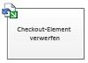|Diese Visio-Aktion ist identisch mit der Aktion **Auschecken von Element verwerfen** in SharePoint Designer 2013 und wird angezeigt als:This Visio action is the same as the **Discard Check Out Item** action in SharePoint Designer 2013 and appears as:   |**Auschecken von Element verwerfen****Discard check out item**   Verwenden Sie diese Aktion, wenn ein Element ausgecheckt ist, Änderungen daran vorgenommen wurden und Sie diese Änderungen verwerfen und das Element wieder einchecken möchten.Use this action if an item is checked out, changes have been made to it, and you want to discard the changes and check the item back in.    |
||Diese Visio-Aktion ist identisch mit der Aktion **Übergeordnete Listenelementberechtigungen erben** in SharePoint Designer 2013 und wird wie folgt visuell dargestellt:This Visio action is the same as the **Inherit List Item Parent Permissions** action in SharePoint Designer 2013 and appears as:       **Hinweis:** Diese Aktion ist nur innerhalb von Identitätswechselschritten verfügbar.    **Note:** This action is only available in an impersonation step.           |**Listenelementberechtigungen erben****Inherit list item permissions**   Wenn das Element über eindeutige Berechtigungen verfügt, können Sie diese Aktion verwenden, damit das Element die übergeordneten Berechtigungen von der Liste erbt.If your item has unique permissions, you can use this action to make the item inherit the parent permissions from the list.    |
||Diese Visio-Aktion ist identisch mit der Aktion **Remove List Item Permission** in SharePoint Designer 2013 und wird wie folgt visuell dargestellt:This Visio action is the same as the **Remove List Item Permission**s action in SharePoint Designer 2013 and appears as:        **Hinweis:** Diese Aktion ist nur innerhalb von Identitätswechselschritten verfügbar.    **Note:** This action is only available in an impersonation step.           |**Listenelementberechtigungen entfernen****Remove list item permissions**   Durch diese Aktion werden Berechtigungen von einem Element für bestimmte Benutzer entzogen.This action removes permissions from an item for specific users.    |
||Diese Visio-Aktion ist identisch mit der Aktion **Listenelementberechtigungen ersetzen** in SharePoint Designer 2013 und wird wie folgt visuell dargestellt:This Visio action is the same as the **Replace List Item Permissions** action in SharePoint Designer 2013 and appears as:       **Hinweis:** Diese Aktion ist nur innerhalb von Identitätswechselschritten verfügbar.    **Note:** This action is only available in an impersonation step.           |**Listenelementberechtigungen ersetzen****Replace list item permissions**   Dadurch werden die aktuellen Berechtigungen eines Elements durch die neuen Berechtigungen ersetzt, die Sie in der Aktion angeben.It replaces an item's current permissions with the new permissions that you specify in the action.    |
|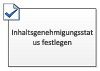|Diese Visio-Aktion ist identisch mit der Aktion **Status für die Genehmigung von Inhalten festlegen** in SharePoint Designer 2013 und wird wie folgt visuell dargestellt:This Visio action is the same as the **Set Content Approval Status** action in SharePoint Designer 2013 and appears as:       **Hinweis:** Diese Aktion kann nur verwendet werden, wenn in der Liste die Inhaltsgenehmigung aktiviert ist.    **Note:** Content approval must be enabled in the list in order to use this action.|**Status für die Genehmigung von Inhalten festlegen****Set content approval status**   Wenn Sie die Genehmigung von Inhalten in Ihrer Liste aktiviert haben, verwenden Sie diese Aktion, um das Statusfeld für die Inhaltsgehnemigung auf einen Wert wie "Genehmigt", "Abgelehnt" oder "Ausstehend" festzulegen. Sie können in der Aktion einen benutzerdefinierten Status eingeben.If you have content approval enabled in your list, use this action to set the content approval status field to a value such as Approved, Rejected, or Pending. You can type a custom status in the action.    **Hinweis:** Die Aktion **Status für die Genehmigung von Inhalten festlegen** wird auf das Element angewendet, das der Workflow aktuell verarbeitet. In Websiteworkflows ist sie daher nicht verfügbar.**Note:** The **Set Content Approval Status** action works on the current item that the workflow is acting upon, therefore the action is not available in a site workflow.          |
||Diese Visio-Aktion ist identisch mit der Aktion **Feld im aktuellen Element festlegen** in SharePoint Designer 2013 und wird angezeigt als:This Visio action is the same as the **Set Field in Current Item** action in SharePoint Designer 2013 and appears as:   |**Feld im aktuellen Element festlegen****Set field in current item**   Mit dieser Aktion können Sie einen Wert für ein Feld im aktuellen Element festlegen.Use the action to set a field in the current item to a value.    **Hinweis:** Soll der Workflow bis zur Änderung des Feldwerts angehalten werden, müssen Sie stattdessen die Aktion **Auf Feldänderung im aktuellen Element warten** verwenden.**Note:** If you want to pause the workflow until it changes the value of the field, use the **Wait for Field Change in Current Item** action instead.          Die Aktion **Feld im aktuellen Element festlegen** sollte nicht in Websiteworkflows verwendet werden.The **Set Field in Current Item** action should not be used in a site workflow.   |
||Diese Visio-Aktion ist identisch mit der Aktion **Listenelement aktualisieren** in SharePoint Designer 2013 und wird angezeigt als:This Visio action is the same as the **Update List Item** action in SharePoint Designer 2013 and appears as:   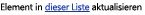|**Listenelement aktualisieren****Update list item**   Verwenden Sie diese Aktion, um ein Listenelement zu aktualisieren. Sie können die Felder und die neuen Werte in diesen Feldern angeben.Use this action to update a list item. You can specify the fields and the new values in those fields.    |
||Diese Visio-Aktion ist identisch mit der Aktion **Auf Feldänderung im aktuellen Element warten** in SharePoint Designer 2013 und wird angezeigt als:This Visio action is the same as the **Wait for Field Change in Current Item** action in SharePoint Designer 2013 and appears as:   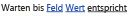|**Auf Feldänderung im aktuellen Element warten****Wait for field change in current item**   Diese Aktion hält den Workflow an, bis das Feld im aktuellen Element auf einen neuen Wert gesetzt wurde.This action pauses the workflow until the field in the current item has changed to a new value.    **Hinweis:** Soll der Workflow den Feldwert ändern, sollten Sie den Workflow nicht auf eine Feldänderung warten lassen, sondern stattdessen die Aktion **Feld im aktuellen Element festlegen** verwenden.**Note:** If you want the workflow to change the value of the field, rather than have the workflow wait for the field to change, use the **Set Field in Current Item** action instead.          |
   

### AufgabenaktionenTask actions

Die Aktionen in dieser Kategorie werden auf Aufgabenelemente angewendet.Actions in this category pertain to task items. Sie lassen sich nur auf SharePoint-Websites in SharePoint anwenden.These actions apply only to SharePoint sites running SharePoint.
  
    
    

|**SHAPE FÜR DIE VISIO-AKTION****VISIO ACTION SHAPE**|**ENTSPRECHENDE AKTION IN SHAREPOINT DESIGNER****CORRESPONDING ACTION IN SHAREPOINT DESIGNER**|**AKTIONSBESCHREIBUNG****ACTION DESCRIPTION**|
|:-----|:-----|:-----|
||Diese Visio-Aktion ist identisch mit der Aktion **Formular einer Gruppe zuordnen** in SharePoint Designer 2013 und wird angezeigt als:This Visio action is the same as the **Assign a Form to a Group** action in SharePoint Designer 2013 and appears as:   |**Formular einer Gruppe zuordnen****Assign a form to a group**   Mithilfe dieser Aktion können Sie ein benutzerdefiniertes Aufgabenformular mit angepassten Feldern erstellen.Use this action to enable you to create a custom task form with customized fields.    Sie können diese Aktion verwenden, um eine Aufgabe einem oder mehreren Teilnehmern bzw. einer oder mehreren Gruppen zuzuweisen und diese aufzufordern, ihre Aufgaben auszuführen. Teilnehmer geben ihre Antworten in die Felder des benutzerdefinierten Aufgabenformulars ein, wenn sie mit der Aufgabe fertig sind, und klicken in dem Formular auf **Aufgabe erledigen**.You can use this action to assign a task to one or more participants or groups prompting them to perform their tasks. Participants provide their responses it the fields of the custom task form and, when they are done with the task, click **Complete Task** on the form.   |
||Diese Visio-Aktion ist identisch mit der Aktion **Aufgabe zuordnen** in SharePoint Designer 2013 und wird angezeigt als:This Visio action is the same as the **Assign a To-do Item** action in SharePoint Designer 2013 and appears as:   |**Aufgabe zuordnen****Assign a to-do item**   Mit dieser Aktion können Sie jedem Teilnehmer eine Aufgabe zuordnen und ihn auffordern, seine Aufgaben zu erledigen und nach Abschluss auf die Schaltfläche **Aufgabe erledigen** im Aufgabenformular zu klicken.Use this action to assign a task to each of the participants, prompting them to perform their tasks and then, when they are done, to click the **Complete Task** button on their task form.   |
||Diese Visio-Aktion ist identisch mit der Aktion **Daten von einem Benutzer sammeln** in SharePoint Designer 2013 und wird angezeigt als:This Visio action is the same as the **Collect Data from a User** action in SharePoint Designer 2013 and appears as:   |**Daten von einem Benutzer sammeln****Collect data from a user**   Mit dieser Aktion können Sie einem Teilnehmer eine Aufgabe zuordnen, ihn auffordern, die erforderlichen Informationen in einem benutzerdefinierten Aufgabenformular anzugeben und dann auf die Schaltfläche **Aufgabe erledigen** im Aufgabenformular zu klicken.Use this action to assign a task to the participant, prompting them to provide the needed information in a custom task form, and then click the **Complete Task** button on the task form.   Diese Aktion verfügt über eine OUTPUT-Klausel.This action has an output clause??? Das bedeutet: Der Workflow speichert die von der Aktion zurückgegebenen Informationen in einer entsprechenden Variablen.meaning, the workflow stores the information returned by the action in a corresponding variable. Die Listenelement-ID des abgeschlossenen Aufgabenelements der Aktion wird in der Variablen „collect“ gespeichert.The list item ID of the completed task item from the action is stored in the collect variable.    |
||Diese Visio-Aktion ist identisch mit der Aktion **Genehmigungsprozess starten** in SharePoint Designer 2013 und wird angezeigt als:This Visio action is the same as the **Start Approval Process** action in SharePoint Designer 2013 and appears as:   |**Genehmigungsprozess starten****Start approval process**   Verwenden Sie diese Aktion, um ein Dokument zur Genehmigung weiterzuleiten. Genehmigende Personen können das Dokument genehmigen oder zurückweisen , die Genehmigungsaufgabe erneut zuweisen oder Änderungen anfordern.Use this action to route a document for approval. Approvers can approve or reject the document, reassign the approval task, or request changes.    Sie können internen und externen Teilnehmern Aufgaben in der Aktion zuweisen. Ein externer Teilnehmer kann ein Mitarbeiter Ihres Unternehmens sein, der kein Benutzer in der Websitesammlung ist, oder jemand außerhalb Ihres Unternehmens.You can assign tasks to both internal and external participants in the action. An external participant can be an employee in your organization who isn't a user in the site collection, or anyone outside your organization.    |
|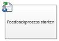|Diese Visio-Aktion ist identisch mit der Aktion **Feedbackvorgang starten** in SharePoint Designer 2013 und wird angezeigt als:This Visio action is the same as the **Start Feedback Process** action in SharePoint Designer 2013 and appears as:   |**Feedbackprozess starten****Start feedback process**   Mit dieser Aktion können Sie Benutzern Feedback-Aufgabenelemente in einer bestimmten Reihenfolge zuweisen: seriell oder parallel.Use this action to assign task items for feedback to users in a specific order???serial or parallel. Der Standardwert ist „parallel“.The default is parallel. Benutzer und Aufgabenteilnehmer können Aufgaben auch an andere Benutzer neu zuweisen.Users or task participants can also reassign a task to other users. Sobald die Benutzer die Aufgabe erledigt haben, können Sie auf die Schaltfläche **Feedback senden** klicken, um mitzuteilen, dass sie fertig sind.When the users are done, they can click the **Submit Feedback** button to indicate task completion.   Sie können internen und externen Teilnehmern Aufgaben in der Aktion zuweisen. Ein externer Teilnehmer kann ein Mitarbeiter Ihres Unternehmens sein, der kein Benutzer in der Websitesammlung ist, oder jemand außerhalb Ihres Unternehmens.You can assign tasks to both internal and external participants in the action. An external participant can be an employee in your organization who isn't a user in the site collection, or anyone outside your organization.    |
||Diese Visio-Aktion ist identisch mit der Aktion **Benutzerdefinierten Aufgabenprozess starten** in SharePoint Designer 2013 und wird angezeigt als:This Visio action is the same as the **Start Custom Task Process** action in SharePoint Designer 2013 and appears as:   |**Benutzerdefinierten Aufgabenprozess starten****Start custom task process**   Die Aktion **Benutzerdefinierten Aufgabenprozess starten** ist eine Vorlage für einen Genehmigungsprozess, die Sie verwenden können, wenn andere Genehmigungsaktionen nicht Ihren Anforderungen entsprechen.The **Start Custom Task Process** action is an approval process template that you can use if other approval actions do not meet your needs.   |
   

### Relationale AktionenRelational actions

In dieser Kategorie existiert nur eine einzige Aktion. Sie ruft den Vorgesetzten eines Benutzers ab und speichert diese Information in einer Variablen.The single action in this category looks up a user's manager and stores that information in a variable. Diese Aktion lässt sich nur auf SharePoint-Websites in SharePoint anwenden.This action applies only to SharePoint sites running SharePoint.
  
    
    

|**SHAPE FÜR DIE VISIO-AKTION****VISIO ACTION SHAPE**|**ENTSPRECHENDE AKTION IN SHAREPOINT DESIGNER****CORRESPONDING ACTION IN SHAREPOINT DESIGNER**|**AKTIONSBESCHREIBUNG****ACTION DESCRIPTION**|
|:-----|:-----|:-----|
||Diese Visio-Aktion ist identisch mit der Aktion **Vorgesetzten eines Benutzers nachschlagen** in SharePoint Designer 2013 und wird angezeigt als:This Visio action is the same as the **Lookup Manager of a User** action in SharePoint Designer 2013 and appears as:   |**Vorgesetzten eines Benutzers nachschlagen****Lookup manager of a user**   Mit dieser Aktion können Sie den Vorgesetzten eines Benutzers abrufen. Der Ausgabewert wird in einer Variablen gespeichert.  Use this action to look up a user's manager. The output value is then stored in a variable.    **Hinweis:** Damit diese Aktion ordnungsgemäß arbeiten kann, muss der Benutzerprofildienst in SharePoint ausgeführt werden.**Note:** For this action to work properly, the User Profile service must be running in SharePoint.           |
   

### DokumentenmappenaktionenDocument set actions

Einige Workflowaktionen sind nur verfügbar, wenn der Workflow mit einer Dokumentbibliothek, z. B. freigegebene Dokumente, oder mit dem Dokumentinhaltstyp verknüpft ist.Some workflow actions are only available when the workflow is associated to a document library, such as Shared Documents, or to the Document content type.
  
    
    

|**VISIO-AKTIONS-SHAPE****VISIO ACTION SHAPE**|**ENTSPRECHENDE AKTION IN SHAREPOINT DESIGNER****CORRESPONDING ACTION IN SHAREPOINT DESIGNER**|**AKTIONSBESCHREIBUNG****ACTION DESCRIPTION**|
|:-----|:-----|:-----|
||Diese Visio-Aktion ist identisch mit der Aktion **Genehmigungsvorgang für Dokumentenmappen starten** in SharePoint Designer 2013 und wird angezeigt als:This Visio action is the same as the **Start Document Set Approval Process** action in SharePoint Designer 2013 and appears as:   |**Genehmigungsvorgang für Dokumentenmappen starten****Send approval for document set**   Verwenden Sie diese Aktion, um den Genehmigungsprozess für eine Dokumentenmappe zu beginnen.Use this action to begin the approval process for a document set.    |
||Diese Visio-Aktion ist identisch mit der Aktion **Dokumentenmappe an Repository senden** in SharePoint Designer 2013 und wird angezeigt als:This Visio action is the same as the **Send Document Set to Repository** action in SharePoint Designer 2013 and appears as:   |**Dokumentenmappe an Repository senden****Send document set to repository**   Mithilfe dieser Aktion können Sie die Dokumentenmappe in ein Dokumentrepository verschieben oder kopieren. Ein Dokumentrepository kann eine Bibliothek auf Ihrer SharePoint-Website oder eine eigene Website wie das Dokumentcenter sein, das Datensätze anhand der von Ihnen definierten Regeln an ein bestimmtes Ziel weiterleitet.Use this action to allow you to move or copy the document set to a document repository. A document repository can be a library in your SharePoint site, or a site on its own like the Document Center, that routes records to a specific destination based on rules that you define.    |
||Diese Visio-Aktion ist identisch mit der Aktion **Dokument an Repository senden** in SharePoint Designer 2013 und wird angezeigt als:This Visio action is the same as the **Send Document to Repository** action in SharePoint Designer 2013 and appears as:   |**Dokument an Repository senden****Send document to repository**   Mithilfe dieser Aktion können Sie ein Dokument in ein Dokumentrepository verschieben oder kopieren. Ein Dokumentrepository kann eine Bibliothek auf Ihrer SharePoint-Website oder eine eigene Website wie das Dokumentcenter sein, das Datensätze anhand der von Ihnen definierten Regeln an ein bestimmtes Ziel weiterleitet.Use this action to allow you to move or copy a document to a document repository. A document repository can be a library in your SharePoint site, or a site on its own like the Document Center, that routes records to a specific destination based on rules that you define.    |
||Diese Visio-Aktion ist identisch mit der Aktion **Inhaltsgenehmigungsstatus für die Dokumentenmappe festlegen** in SharePoint Designer 2013 und wird angezeigt als:This Visio action is the same as the **Set Content Approval Status for the Document Set** action in SharePoint Designer 2013 and appears as:   |**Inhaltsgenehmigungsstatus für die Dokumentenmappe festlegen****Set content approval status for the document set**   Verwenden Sie diese Aktion, um den Inhaltsgenehmigungsstatus für eine Dokumentenmappe auf **Genehmigt**, **Abgelehnt** oder **Ausstehend** festzulegen.Use this action to set content approval of a document set to **Approved**, **Rejected**, or **Pending**.    |
   

## WorkflowbedingungenWorkflow conditions

Eine Workflowbedingung ist ein Verzweigungspunkt im Workflow. Die Workflowbedingung vergleicht die Eingabe mit einem angegebenen Wert. Stimmen sie überein, folgt der Workflow einer Verzweigung. Wenn dies nicht der Fall ist, folgt er der anderen Verzweigung.A workflow condition is a branching point in the workflow. The workflow condition compares the input to a specified value. If they match, the workflow follows one branch; if not, it follows the other branch.
  
    
    

> **Wichtig:** Die meisten der Bedingungsshapes, die sich in Visio in SharePoint-Workflows einfügen lassen, erfordern zusätzliche Konfigurationsanpassungen, wenn der Workflow in SharePoint Designer importiert wird.**Important:** Most of the condition shapes that you can insert into a SharePoint workflow in Visio require additional configuration when the workflow is imported into SharePoint Designer. Denken Sie daran, in Visio über die Kommentarfunktion der einzelnen Bedingungsshapes die Entscheidungskriterien der Bedingung zu vermerken.In Visio, remember to use the comments feature of each condition shape to specify the decision criteria of the condition. 
  
    
    

### Allgemeine BedingungenGeneral conditions

In diesem Abschnitt werden die Bedingungen beschrieben, die in SharePoint Designer 2013 für Listen und wiederverwendbare Listenworkflows verfügbar sind, unabhängig davon, mit welchem Listen- oder Inhaltstyp der Workflow verküpft ist.This section describes the conditions that are available in SharePoint Designer 2013for list and reusable list workflows, no matter which list or content type the workflow is associated with.
  
    
    

|**VISIO-BEDINGUNGS-SHAPE****VISIO CONDITION SHAPE**|**ENTSPRECHENDE BEDINGUNG IN SHAREPOINT DESIGNER****CORRESPONDING CONDITION IN SHAREPOINT DESIGNER**|**BESCHREIBUNG DER BEDINGUNG****CONDITION DESCRIPTION**|
|:-----|:-----|:-----|
||Diese Visio-Bedingung ist identisch mit der Bedingung **Wenn ein beliebiger Wert gleich dem Wert ist** in SharePoint Designer 2013 und wird angezeigt als:This Visio condition is the same as the **If any value equals value** condition in SharePoint Designer 2013 and appears as:   |**Datenquelle vergleichen****Compare data source**   Diese Bedingung vergleicht zwei Werte. Sie können angeben, ob die Werte gleich oder nicht gleich sein sollen.This condition compares two values. You can specify whether the values should be equal or not equal.    |
||Diese Visio-Bedingung ist identisch mit der Bedingung **Wenn das aktuelle Elementfeld gleich Wert ist** in SharePoint Designer 2013 und wird angezeigt als:This Visio condition is the same as the **If current item field equals value** condition in SharePoint Designer 2013 and appears as:   |**Dokumentfeld vergleichen****Compare document field**   Diese Bedingung vergleicht ein Feld mit einem Wert, den Sie angeben. Sie können angeben, ob die Werte gleich oder nicht gleich sein sollen.This condition checks a field against a value that you specify. You can specify whether the values should be equal or not equal.    |
||Diese Visio-Bedingung ist identisch mit der Bedingung **Erstellt von einer bestimmten Person** in SharePoint Designer 2013 und wird angezeigt als:This Visio condition is the same as the **Created by a specific person** condition in SharePoint Designer 2013 and appears as:   |**Erstellt von einer bestimmten Person****Created by a specified person**   Diese Bedingung überprüft, ob ein Element von einem bestimmten Benutzer erstellt wurde. Der Benutzer kann als E-Mail-Adresse, z. B. olivier@contoso.com, angegeben oder aus SharePoint-, Exchange- oder Active Directory-Benutzern ausgewählt werden.This condition checks if an item was created by a specific user. The user can be specified as an e-mail address, such as olivier@contoso.com, or selected from SharePoint, Exchange, or Active Directory users.    **Hinweis:** Bei Benutzernamen und E-Mail-Adressen ist die Groß- und Kleinschreibung zu beachten.**Note:** The user name and e-mail address are case sensitive. Wir empfehlen Ihnen, einen Benutzernamen oder eine E-Mail-Adresse auszuwählen, um die korrekte Groß- und Kleinschreibung zu gewährleisten.It is recommended that you select a user name or e-mail address to help ensure that you use the correct case. Bei der manuellen Eingabe eines Benutzernamens oder einer E-Mail-Adresse müssen Sie die für das Konto verwendete Groß- und Kleinschreibung beachten.If you type a user name or e-mail address, you must match the case of the account. So wird die Bedingung „If created by contoso\\molly“ beispielsweise nicht als „true“ ausgewertet, wenn der Name des Benutzerkontos „Contoso\\Molly“ lautet.For example, If created by contoso\\molly will not evaluate as true if the user account is Contoso\\Molly.           |
||Diese Visio-Bedingung ist identisch mit der Bedingung **Erstellt in einer bestimmten Zeitspanne** in SharePoint Designer 2013 und wird angezeigt als:This Visio condition is the same as the **Created in a specific date span** condition in SharePoint Designer 2013 and appears as:   |**Erstellt in einer bestimmten Zeitspanne****Created in specific date span**   Diese Bedingung überprüft, ob das Element zwischen den Datumsangaben erstellt wurde. Sie können das aktuelle Datum, ein bestimmtes Datum oder einen Nachschlagewert verwenden.This condition checks if the item was created between the specified dates. You can use the current date, a specific date, or a lookup.    |
||Diese Visio-Bedingung ist identisch mit der Bedingung **Geändert von einer bestimmten Person** in SharePoint Designer 2013 und wird angezeigt als:This Visio condition is the same as the **Modified by a specific person** condition in SharePoint Designer 2013 and appears as:   |**Geändert von einer bestimmten Person****Modified by a specific person**   Verwenden Sie diese Bedingung, um zu überprüfen, ob ein Element von einem bestimmten Benutzer geändert wurde. Der Benutzer kann als E-Mail-Adresse, z. B. olivier@contoso.com, angegeben oder aus SharePoint-, Exchange- oder Active Directory-Benutzern ausgewählt werden.Use this condition to check if an item was modified by a specified user. The user can be specified as an e-mail address, such as olivier@contoso.com, or selected from SharePoint, Exchange, or Active Directory users.    **Hinweis:** Bei Benutzernamen und E-Mail-Adressen ist die Groß- und Kleinschreibung zu beachten.**Note:** The user name and e-mail address are case sensitive. Wir empfehlen Ihnen, einen Benutzernamen oder eine E-Mail-Adresse auszuwählen, um die korrekte Groß- und Kleinschreibung zu gewährleisten.It is recommended that you select a user name or e-mail address to help ensure that you use the correct case. Bei der manuellen Eingabe eines Benutzernamens oder einer E-Mail-Adresse müssen Sie die für das Konto verwendete Groß- und Kleinschreibung beachten.If you type a user name or e-mail address, you must match the case of the account. Beispielsweise wird die Bedingung „If modified by contoso\\molly“ nicht als „true“ ausgewertet, wenn der Name des Benutzerkontos „Contoso\\Molly“ lautet.For example, If modified by contoso\\molly will not evaluate as true if the user account is Contoso\\Molly.           |
|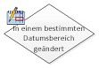|Diese Visio-Bedingung ist identisch mit der Bedingung **Geändert in einer bestimmten Zeitspanne** in SharePoint Designer 2013 und wird angezeigt als:This Visio condition is the same as the **Modified in a specific date span** condition in SharePoint Designer 2013 and appears as:   |**Geändert in einer bestimmten Zeitspanne****Modified in a specific date span**   Diese Bedingung überprüft, ob ein Element zwischen den Datumsangaben geändert wurde. Sie können das aktuelle Datum, ein bestimmtes Datum oder einen Nachschlagewert verwenden.This condition checks if an item was modified between the specified dates. You can use the current date, a specific date, or a lookup.    |
|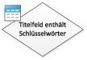|Diese Visio-Bedingung ist identisch mit der Bedingung **Titelfeld enthält Schlüsselwörter** in SharePoint Designer 2013 und wird angezeigt als:This Visio condition is the same as the **Title field contains keywords** condition in SharePoint Designer 2013 and appears as:   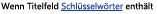|**Titelfeld enthält Schlüsselwörter****Title field contains keywords**   Diese Bedingung überprüft, ob das Feld **Title** eines Elements ein bestimmtes Wort enthält.This condition checks if the **Title** field for an item contains a specific word. Sie können das Schlüsselwort entweder im Zeichenfolgengenerator angeben (als statischen Wert, als dynamische Zeichenfolge oder als Kombination beider Varianten)You can either specify the keyword in the String Builder???which can be a static value or a dynamic string or a combination ??? oder einen Verweis auf ein Feld oder eine Variable einfügen.or insert a lookup to a field or variable.   **Hinweis:** Mit der Bedingung **Titelfeld enthält Schlüsselwörter** lässt sich nur nach einem einzigen Schlüsselwort suchen.**Note:** You cannot search for more than one keyword in the **Title field contains keywords** condition. Sie können jedoch logische Operatoren verwenden, beispielsweise **However, you can use logical operators such as**||** (oder) oder **&amp;&amp;** (und).**( or) or **&amp;&amp;** (and.          |
   

### Bedingungen für DokumentenmappenDocument set conditions

Einige Workflowbedingungen sind nur verfügbar, wenn der Workflow mit einer Dokumentbibliothek, z. B. freigegebene Dokumente, oder mit dem Dokumentinhaltstyp verknüpft ist.Some workflow conditions are only available when the workflow is associated to a document library, such as Shared Documents, or to the Document content type.
  
    
    

|**VISIO-BEDINGUNGS-SHAPE****VISIO CONDITION SHAPE**|**ENTSPRECHENDE BEDINGUNG IN SHAREPOINT DESIGNER****CORRESPONDING CONDITION IN SHAREPOINT DESIGNER**|**BESCHREIBUNG DER BEDINGUNG****CONDITION DESCRIPTION**|
|:-----|:-----|:-----|
||Diese Visio-Bedingung ist identisch mit der Bedingung **Die Dateigröße in einem bestimmten KB-Bereich** in SharePoint Designer 2013 und wird angezeigt als:This Visio condition is the same as the **The file size in a specific range kilobytes** condition in SharePoint Designer 2013 and appears as:   |**Die Dateigröße in einem bestimmten KB-Bereich****File size is in a specific range**   Diese Bedingung überprüft, ob die Dateigröße eines Dokuments zwischen den angegebenen Größen liegt (in KB). Die Bedingung schließt die angegebenen Größenwerte nicht in die Auswertung mit ein. Sie können eine Zahl eingeben oder einen Nachschlagewert für die erste oder zweite Größe in der Bedingung verwenden.This condition checks if the file size of a document is between the specified sizes, in kilobytes. The condition does not include the specified sizes in the evaluation. You can enter a number or use a lookup for the first or the second size in the condition.    |
||Diese Visio-Bedingung ist identisch mit der Bedingung **Der Dateityp weist einen bestimmten Typ auf** in SharePoint Designer 2013 und wird angezeigt als:This Visio condition is the same as the **The file type is a specific type** condition in SharePoint Designer 2013 and appears as:   |**Der Dateityp weist einen bestimmten Typ auf****File is a specific type**   Diese Bedingung überprüft, ob der Dateityp des aktuellen Elements dem angegebenen Typ entspricht, z. B. DOCX. Sie können den Dateityp als Zeichenfolge eingeben oder einen Nachschlagewert verwenden.This condition checks if the file type of the current item is of the specified type, such as docx. You can enter the file type as a string or use a lookup.    |
   

### ListenbedingungenList conditions

  
    
    

|**VISIO-BEDINGUNGS-SHAPE****VISIO CONDITION SHAPE**|**ENTSPRECHENDE BEDINGUNG IN SHAREPOINT DESIGNER****CORRESPONDING CONDITION IN SHAREPOINT DESIGNER**|**BESCHREIBUNG DER BEDINGUNG****CONDITION DESCRIPTION**|
|:-----|:-----|:-----|
||Diese Visio-Bedingung ist identisch mit der Bedingung **Listenelement-Berechtigungsstufen überprüfen** in SharePoint Designer 2013 und wird angezeigt als:This Visio condition is the same as the **Check list item permission levels** condition in SharePoint Designer 2013 and appears as:   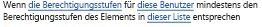|**Exakte Benutzerberechtigungen überprüfen****Check exact user permissions**   Diese Bedingung überprüft, ob der angegebene Benutzer über die minimal erforderliche Berechtigungsstufe verfügt.This condition checks that the specified user has the minimum necessary permission level.    |
||Diese Visio-Bedingung ist identisch mit der Bedingung **Listenelementberechtigungen überprüfen** in SharePoint Designer 2013 und wird angezeigt als:This Visio condition is the same as the **Check list item permissions** condition in SharePoint Designer 2013 and appears as:   |**Benutzerberechtigung überprüfen****Check user permission**   Diese Bedingung überprüft, ob der angegebene Benutzer über die minimal erforderlichen Berechtigungen verfügt.This condition checks if the specified user has the minimum necessary permissions.    |
   

## WorkflowabschlusszeichenWorkflow terminators

In Visio muss jeder Workflow mit einem Start-Abschlusszeichen (In Visio, each workflow must begin with a Start terminator () beginnen und mit einem Stop-Abschlusszeichen () and end with a Stop terminator () enden. In einem Workflow kann jeweils nur ein Typ von Abschlusszeichen verwendet werden. Abschlusszeichen sind erforderlich, wenn Sie einen SharePoint-Workflow in Visio erstellen, damit der Workflow die Validierung besteht und exportiert werden kann. Workflowabschlusszeichen werden in SharePoint Designer nicht verwendet.). Only one of each type of terminator can be used in a given workflow. Terminators are necessary when you create a SharePoint workflow in Visio so that the workflow can pass validation and can be exported. Workflow terminators are not used in SharePoint Designer.
  
    
    

## Siehe auchSee also

-  [Neuerungen in Workflows für SharePointWhat's new in workflows for SharePoint](what-s-new-in-workflows-for-sharepoint.md)
    
  
-  [Erste Schritte mit Workflows in SharePointGet started with workflows in SharePoint](get-started-with-workflows-in-sharepoint.md)
    
  
-  [Workflowentwicklung in SharePoint Designer und VisioWorkflow development in SharePoint Designer and Visio](workflow-development-in-sharepoint-designer-and-visio.md)
    
  

  
    
    
