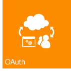
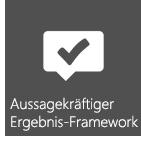

# Neuerungen für Entwickler in SharePointWhat's new for developers in SharePoint
Informationen zu den Features und Funktionen in SharePoint, einschließlich des neuen Cloud-Add-In-Modells, der Entwicklungstools, Plattformverbesserungen, mobilen Add-Ins und vieles mehr.Learn about new features and functionality in SharePoint, including the new Cloud Add-in Model, development tools, platform enhancements, mobile add-ins, and more.
## Cloud-Add-In-ModellCloud Add-in Model

SharePoint führt ein Cloud-Add-In-Modell ein, mit dem Sie Add-Ins erstellen können. Ein SharePoint-Add-In ist eine eigenständige Funktion, die die Funktionen von SharePoint-Websites erweitert.SharePoint introduces a Cloud Add-in Model that enables you to create add-ins. SharePoint Add-ins are self-contained pieces of functionality that extend the capabilities of a SharePoint website. Ein Add-In kann SharePoint-Komponenten wie Listen, Workflows und Seiten der Website enthalten, aber es kann auch eine Remote-Webanwendung und Remotedaten in SharePoint zum Vorschein bringen.An add-in may include SharePoint components such as lists, workflows, and site pages, but it can also surface a remote web application and remote data in SharePoint. Ein Add-In hat nur wenige oder keine Abhängigkeiten von einer anderen Software auf dem Gerät oder der Plattform, wo es installiert ist, außer dem, was in die Plattform integriert ist.An add-in has few or no dependencies on any other software on the device or platform where it is installed, other than what is built into the platform. Aufgrund dieses Merkmals können Add-Ins einfach installiert und sauber deinstalliert werden.This characteristic enables add-ins to be installed simply and uninstalled cleanly. Add-Ins haben keinen benutzerdefinierten Code, der auf SharePoint-Servern ausgeführt wird.Add-ins have no custom code that runs on the SharePoint servers. Stattdessen wird die gesamte benutzerdefinierte Logik „nach oben“ in die Cloud oder „nach unten“ auf Clientcomputer verschoben.Instead, all custom logic moves "up" to the cloud or "down" to client computers. Darüber hinaus führt SharePoint ein innovatives Bereitstellungsmodell für SharePoint-Add-Ins ein, das Komponenten wie Office Store und den Add-In-Katalog enthält.Additionally, SharePoint introduces an innovative delivery model for SharePoint Add-ins that includes components like the Office Store and the Add-in Catalog.

&nbsp;&nbsp;&nbsp;&nbsp;

## Vertrautes Programmiermodell mithilfe von WebstandardsFamiliar programming model using web standards

Mit SharePoint kann jeder Webentwickler, auch jene, die auf Nicht-Microsoft-Plattformstapeln arbeiten, SharePoint-Lösungen erstellen. Dies ist möglich, da SharePoint auf den üblichen Webstandards wie HTML, CSS und JavaScript basiert. Die Implementierung stützt sich außerdem auf eingeführte Protokolle wie OData und OAuth.SharePoint makes it easy for any web developer, including those who work on non-Microsoft platform stacks, to create SharePoint solutions. What makes this possible is that SharePoint is based on common web standards like HTML, CSS, and JavaScript. Furthermore, implementation relies on established protocols like the Open Data protocol (OData), and OAuth.
  

  &nbsp;&nbsp;&nbsp;&nbsp;&nbsp;&nbsp;

## EntwicklungstoolsDevelopment tools

Die aktuelle Version zeigt die enormen Schritte, die für die Optimierung der vorhandenen Entwicklungstools wie Visual Studio und SharePoint Designer unternommen wurden. Daneben wurde auch das neu entwickelte webbasierte Tool Napa Office 365-Entwicklungstools zur Entwicklung von Add-Ins bereitgestellt. Mit dem neuen vereinheitlichten Projektsystem Visual Studio können Sie SharePoint-Add-Ins, Office-Add-Ins und SharePoint-Add-Ins entwickeln, die Office-Add-Ins oder Office-Add-Ins beinhalten, welche von SharePoint gehostet werden. Zusätzlich zu den SharePoint-Projektvorlagen aus früheren Versionen enthält Visual Studio 2012 nun eine neue Add-In-Projektvorlage im Ordner „Add-Ins" namens Add-Ins für SharePoint. Dem Fenster „Eigenschaften" und den Eigenschaftenseiten wurden einige neue Eigenschaften zur Unterstützung von SharePoint-Add-In-Projekten hinzugefügt. Weitere Verbesserungen betreffen umfassende Unterstützung der Entwicklung des Cloud-Add-In-Modells, einschließlich OData- und OAuth-Unterstützung, sowie umfassende Unterstützung der Workflow-Manager-Client 1.0-Plattformentwicklung.The current release reflects enormous strides in optimizing the existing development tools like Visual Studio and SharePoint Designer, in addition to providing the release of newly developed web-based tool Napa Office 365 Development Tools for developing add-ins. The new unified project system in Visual Studio lets you develop SharePoint Add-ins, Office Add-ins, SharePoint Add-ins that include Office Add-ins, or Office Add-ins that are hosted by SharePoint. In addition to the SharePoint project templates that were provided in earlier versions, Visual Studio 2012 now includes a new add-in project template in the Add-ins folder named Add-ins for SharePoint. Several new properties have been added to the Properties window and Properties pages to support SharePoint Add-in projects. Other improvements include full support for development against the Cloud Add-in Model, including OData and OAuth support, and full support for development against the Workflow Manager Client 1.0 platform.

&nbsp;&nbsp;&nbsp;&nbsp;

## Zentrale PlattformverbesserungenCore platform enhancements

SharePoint wurde für die Unterstützung der neuen cloudbasierten Architektur und des app-gesteuerten Entwicklungsframework umfassend verbessert und optimiert. Angefangen bei den SharePoint-APIs auf der untersten Ebene, über Konnektivität bis hin zu Integration sozialer Medien ist SharePoint dafür ausgelegt, eine komplette Anwendungsentwicklungsumgebung zu unterstützen. Neben der Verwendung von REST-Endpunkten (Representational State Transfer) für Webdienste, gibt es auch eine neue API für die Server- und die Cliententwicklung. Remoteereignisempfänger werden jetzt auch neben dem clientseitigen Rendering unterstützt.On a broader scale, SharePoint has been improved and enhanced to support the new cloud-based architecture and app-driven development framework. From the SharePoint APIs at the lowest level to connectivity to social media integration, SharePoint is designed and executed to support a rich application development experience. In addition to the use of Representational State Transfer (REST) endpoints for web services, there is a broad new API for both server and client development. Remote event receivers and now supported in addition to client-side rendering. 
  
&nbsp;&nbsp;&nbsp;&nbsp;&nbsp;&nbsp;

    
    
    

## MobilitätMobility

SharePoint ermöglicht Ihnen, Windows Phone 7-Anwendungen mit lokalen SharePoint-Diensten und -Anwendungen bzw. mit in der Cloud ausgeführten Remote-SharePoint-Diensten und -Anwendungen (wie jene, die SharePoint Online verwenden) zu kombinieren, um leistungsfähige Anwendungen zu entwickeln, deren Funktionalität über die herkömmlichen Desktop- oder Laptopfunktionen hinausgehen und eine wirklich mobile und leichter zugängliche Umgebung schaffen. Die neuen Mobilitätsfeatures in SharePoint bauen auf vorhandenen Microsoft-Tools und -Technologien auf, wie SharePoint, Windows Phone 7, Visual Studio und Microsoft Silverlight. Sie können SharePoint-unterstützte mobile Anwendungen für Windows Phone mit dem neuen SharePoint Phone-Anwendungsassistenten Visual Studio für einfache listenbasierte mobile Anwendungen erstellen. Sie können die neuen Features aus SharePoint, wie den Geolocation-Feldtyp, integrieren und Mitteilungen von SharePoint Server mit Push auf Ihre mobilen Anwendungen übertragen.With SharePoint, you can combine Windows Phone 7 applications with on-premises SharePoint services and applications, or with remote SharePoint services and applications that run in the cloud (such as those that use SharePoint Online), to create powerful applications that extend functionality beyond the traditional desktop or laptop and into a truly portable and much more accessible environment. The new mobility features in SharePoint are built on existing Microsoft tools and technologies, such as SharePoint, Windows Phone 7, Visual Studio, and Microsoft Silverlight. You can create SharePoint-powered mobile applications for Windows Phone using the new SharePoint phone application wizard template in Visual Studio, which lets you create simple list-based mobile applications. You can integrate new features introduced in SharePoint, such as the Geolocation field type and "push" notifications from SharePoint Server, into your mobile applications.

&nbsp;&nbsp;&nbsp;&nbsp;

## Soziale Netzwerke und ZusammenarbeitSocial and collaboration

Neue und verbesserte Features für soziale Funktionen und Zusammenarbeit erleichtern den Benutzern die Kommunikation, damit sie immer auf dem Laufenden sind. Der verbesserte soziale Meine Website-Feed verbindet Menschen und lässt sie Inhalte tauschen. Das neue Feature Communitywebsite stellt den Benutzern eine reichhaltige Communityumgebung bereit, in der sie nicht nur schnell Informationen finden und teilen können, sondern auch auf Menschen mit gleichen Interessen treffen.New and improved social and collaboration features make it easy for users to communicate and to stay engaged and informed. The improved My Site social feed helps users keep up to date with the people and content that they care about. The new Community Site feature provides a rich community experience that lets users easily find and share information and find people who have similar interests.

&nbsp;&nbsp;&nbsp;&nbsp;&nbsp;&nbsp;

## SucheSearch

Die Suchfunktion in SharePoint enthält mehrere Verbesserungen, kundenspezifische Inhaltsverarbeitung mit dem Webdienst für Inhaltserweiterung und ein neues Framework für die Darstellung der Suchergebnistypen. Außerdem wurde bedeutende Verbesserungen bei der Sprache der Schlüsselwortabfrage (KQL) eingeführt.Search functionality in SharePoint includes several enhancements, custom content processing with the Content Enrichment web service, and a new framework for presenting search result types. Additionally, there have been significant enhancements made to the keyword query language (KQL).

&nbsp;&nbsp;&nbsp;&nbsp;

## WorkflowsWorkflows

Workflow-Manager-Client 1.0 ist eine neu entworfene Workflowinfrastruktur, basierend auf Windows Workflow Foundation 4. Sie bringt dem Workflowauthoring in SharePoint mehr Leistungsstärke und Flexibilität. In einer vollständig deklarierten Authoringumgebung können IT-Arbeiter mit SharePoint Designer 2013 leistungsstarke Workflows nutzen. Mit einer Reihe neuer Visual Studio 2012-Workflowprojektvorlagen greifen Entwickler auf intelligentere Features, wie benutzerdefinierte Aktionen, zu. Der wichtigste Punkt aber ist, Workflow-Manager-Client 1.0 ist vollständig mit Modell für SharePoint-Add-Ins integriert. Workflows werden nicht in SharePoint ausgeführt, sondern in der Cloud. Dies bietet enorme Flexibilität bei der Entwicklung von workflowbasierten SharePoint-Add-Ins.Workflow Manager Client 1.0 is a redesigned workflow infrastructure that is built on Windows Workflow Foundation 4 and brings new power and flexibility to workflow authoring in SharePoint. A fully declarative authoring environment enables information workers to use SharePoint Designer 2013 to author powerful workflows, and a new set of Visual Studio 2012 workflow project templates let developers access more sophisticated features like custom actions. Perhaps most importantly, Workflow Manager Client 1.0 is fully integrated with the model for SharePoint Add-ins. In addition, workflows execute in the cloud, not in SharePoint, which provides enormous flexibility in designing workflow-based SharePoint Add-ins.

&nbsp;&nbsp;&nbsp;&nbsp;&nbsp;&nbsp;

## Enterprise Content ManagementEnterprise Content Management

In SharePoint können Sie jetzt .NET-Client, Silverlight, Windows Phone und JavaScript APIs zusätzlich zu der erweiterten Gruppe von .NET-Server-verwalteten APIs verwenden, Um ECM-Bedienerfreundlichkeit und -Verhalten (Enterprise Content Management) anzupassen.In SharePoint, you can now use .NET client, Silverlight, Windows Phone, and JavaScript APIs, in addition to the newly expanded set of .NET server managed APIs, to customize Enterprise Content Management (ECM) experiences and behavior.

&nbsp;&nbsp;&nbsp;&nbsp;&nbsp;&nbsp;

## Business Connectivity ServicesBusiness Connectivity Services

Business Connectivity Services (BCS) ermöglicht SharePoint, auf Daten aus externen Systemen, wie SAP, ERP und CRM, zuzugreifen, zusätzlich zu anderen datengesteuerten Anwendungen, die über WCF-Dienste oder OData-Endpunkte dargestellt werden. BCS in SharePoint wurde in vielfacher weise geändert und verbessert. Dazu zählen auch OData-Konnektivität, externe Ereignisse, externe Daten in Add-Ins, Filterung und Sortierung, REST-Unterstützung und anderes mehr.Business Connectivity Services (BCS) enables SharePoint to access data from external data systems such as SAP, ERP, and CRM, in addition to other data-driven applications that are exposed through WCF services or OData endpoints. BCS in SharePoint has been improved and enhanced in many ways, including OData connectivity, external events, external data in add-ins, filtering and sorting, support for REST, and others.

&nbsp;&nbsp;&nbsp;&nbsp;

## AnwendungsdiensteApplication services

SharePoint umfasst verschiedene Dienste für das Arbeiten mit den Daten Ihrer SharePoint-Websites.SharePoint includes several services for working with data in your SharePoint sites. Neu in SharePoint ist der maschinelle Übersetzungsdienst, der Webseiten, Dokumente und Datenströme in mehrere Sprachen übersetzt.New for SharePoint is the Machine Translation Service, which translates sites, documents, and streams for multilingual support. SharePoint beinhaltet auch Access Services und ein neues Datenzugriffsmodell.SharePoint also includes Access Services and a new data access model. Zum Konvertieren von Dateien und Datenströmen in andere Formate verfügt SharePoint über Word Automation Services und PowerPoint Automation Services (ein neues Feature für SharePoint).For converting files and streams to other formats, SharePoint has Word Automation Services and PowerPoint Automation Services (a new feature for SharePoint). SharePoint bietet auch Tools zur Datenanalyse, z. B. PerformancePoint Services und Visio Services, Business Intelligence und leistungsfähigen neuen Features in Excel Services ermöglichen die einfache.SharePoint also provides data analysis tools, like PerformancePoint Services and Visio Services, that enable business intelligence, and powerful new features in Excel Services.

&nbsp;&nbsp;&nbsp;&nbsp;&nbsp;&nbsp;

## Zusätzliche RessourcenAdditional resources

-  [Übersicht über die SharePoint-EntwicklungSharePoint development overview](sharepoint-development-overview.md)
    
  
-  [Entwickeln von Add-Ins für SharePointDevelop SharePoint Add-ins](../sp-add-ins/sharepoint-add-ins.md)
    
  
-  [SharePoint-Add-Ins im Vergleich zu SharePoint-LösungenSharePoint Add-ins compared with SharePoint solutions](sharepoint-add-ins-compared-with-sharepoint-solutions.md)
    
  
-  [Auswählen des richtigen API-Satzes in SharePointChoose the right API set in SharePoint](choose-the-right-api-set-in-sharepoint.md)
    
  
-  [Barrierefreiheit in SharePointAccessibility in SharePoint](accessibility-in-sharepoint.md)
    
  

