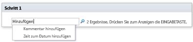

# Kurzübersicht Workflowaktionen (SharePoint 2010-Workflowplattform)Workflow actions quick reference (SharePoint 2010 Workflow platform)
In diesem Artikel werden die Workflowaktionen beschrieben, die in der SharePoint 2010-Workflowplattform in Microsoft SharePoint Designer 2013 zur Verfügung stehen. Diesen Artikel sollten Sie *ausschließlich* dann als Referenz heranziehen, wenn Sie in SharePoint Designer 2013 arbeiten, aber dennoch weiterhin die SharePoint 2010-Workflowplattform verwenden möchten. Wenn Sie stattdessen die SharePoint-Workflowplattform verwenden möchten, ist der Artikel [Kurzübersicht zu Workflowaktionen (SharePoint-Workflowplattform](workflow-actions-quick-reference-sharepoint-workflow-platform.md) die richtige Anlaufstelle, neben anderen Artikeln (aufgeführt im Abschnitt „Zusätzliche Ressourcen“) zu neuen Features in der neueren Plattform. Wenn Sie einen Workflow mit der 2010-Workflowplattform erstellen möchten, müssen Sie zunächst im Dialogfeld **Workflow erstellen** im Feld **Plattformtyp** die Option **SharePoint 2010-Workflow** auswählen.Learn about the workflow actions that are available in the SharePoint 2010 Workflow Platform in Microsoft SharePoint Designer 2013.Use this article  *only*  if you are working in SharePoint Designer 2013, but want to continue to use the SharePoint 2010 Workflow Platform.If instead you want to use the SharePoint Workflow Platform, see  [Workflow actions quick reference (SharePoint Workflow platform)](workflow-actions-quick-reference-sharepoint-workflow-platform.md), along with other articles (mentioned in the "Additional resources" section) about new features that are available in the newer platform.To begin creating a workflow by using the 2010 Workflow Platform, select **SharePoint 2010 Workflow** in the **Platform Type** box in the **Create Workflow** dialog box.
## Zugreifen auf die WorkflowaktionenWhere to find the workflow actions

Es gibt zwei Möglichkeiten, um auf das Menü mit verfügbaren Workflowaktionen zuzugreifen.There are two ways to access the menu of available workflow actions.
  
    
    
Führen Sie eine der folgenden Aktionen beim Bearbeiten in einem Workflowschritt aus:While you are editing inside a workflow step, do one of the following:
  
    
    

- Klicken Sie auf der Registerkarte **Workflow** in der Gruppe **Einfügen** auf **Aktionen**.On the **Workflow** tab, in the **Insert** group, click **Actions**.
    
  
- Doppelklicken Sie in einem Workflowschritt. Geben Sie in dem angezeigten Suchfeld den Text ein, der im Namen der benötigten Aktion anzeigt wird (z. B. „hinzufügen"), und drücken Sie dann EINGABE.Double-click inside the workflow step. In the search box that appears, type text that appears in the name of the action that you want (such as "add"), and then press Enter. Actions and conditions that contain the text that you typed appear below the text box.
    
  
  

  

  
Die beim Erstellen eines Workflows verfügbaren Aktionen sind vom Kontext abhängig. Die Aktionen **Genehmigungsvorgang starten** und **Feedbackvorgang starten** sind für auf Microsoft SharePoint Foundation 2013 basierende Websites nicht verfügbar. Einige Listenaktionen sind nur in einem Identitätswechselschritt verfügbar, andere sind nur verfügbar, wenn der Workflow einer Dokumentbibliothek oder einem Dokumentinhaltstyp zugeordnet ist. Listenaktionen für das aktuelle Element wie **Status für die Genehmigung von Inhalten festlegen** und **Feld im aktuellen Element festlegen** sind in einem Websiteworkflow nicht verfügbar.The actions available to you during workflow creation depend on the current context. For example, the **Start Approval Process** and **Start Feedback Process** actions are not available for sites that are based on Microsoft SharePoint Foundation 2013. Some list actions are available only inside an impersonation step, and others are available only when your workflow is associated with a document library or document content type. List actions that work on the current item, such as **Set Content Approval Status** and **Set Field in Current Item**, are not available in a site workflow.
  
    
    
Aktionen werden basierend auf dem Anwendungsbereich in einem Workflow in zwei Kategorien unterteilt. Aktionen, die das Verhalten eines Elements beeinflussen, werden beispielsweise unter **Listenaktionen**, Aktionen, die Dokumentenmappen beeinflussen, unter **Dokumentenmappenaktionen** und benutzerdefinierte Workflowaktionen unter **Benutzerdefinierte Aktionen** aufgeführt. Die Kategorien für Aktionen sehen wie folgt aus:Actions are organized into categories based on their area of application in a workflow. For example, actions that affect an item's behavior are listed under **List Actions**, actions pertinent to Document Sets under **Document Set Actions**, and custom workflow actions under **Custom Actions**. The categories for actions are:
  
    
    

- KernaktionenCore Actions
    
  
- Dokumentenmappenaktionen (nur verfügbar, wenn der Workflow einer Dokumentbibliothek oder einem Dokumentinhaltstyp zugeordnet ist)Document Set Actions (appear only when your workflow is associated with a document library or a document content type)
    
  
- ListenaktionenList Actions
    
  
- Relationale Aktionen (nur verfügbar auf SharePoint-Websites, die SharePoint ausführen)Relational Actions (appear only when your SharePoint site is running sps15short)
    
  
- Aufgabenaktionen (nur verfügbar auf SharePoint-Websites, die SharePoint ausführen)Task Actions (appear only when your SharePoint site is running sps15short)
    
  
- Aufgabenverhaltensaktionen (nur verfügbar bei der Anpassung von Aufgaben in vordefinierten Workflowaktionen wie **Genehmigungsprozess starten** und **Feedbackprozess starten**)Task Behavior Actions (appear only when you are customizing tasks in pre-built workflow actions, such as **Start Approval Process** and **Start Feedback Process**)
    
  
- HilfsaktionenUtility Actions
    
  
- Benutzerdefinierte AktionenCustom Actions
    
  

## Allgemeine AktionenGeneral actions

Allgemeine Aktionen sind Aktionen, die in allen Workflowkontexten in der Aktionenliste angezeigt werden.General actions are actions that display in the Actions list in all workflow contexts.
  
    
    

|**Aktion****Action**|**Beschreibung****Description**|
|:-----|:-----|
|<u>**Hauptaktionen**</u><u>**Core Actions**</u>   |Die Aktionen in dieser Kategorie sind die am häufigsten verwendeten Workflowaktionen.Actions in this category are the ones most commonly used in workflows.    |
|Kommentar hinzufügenAdd a comment    | Diese Aktion wird zunächst in einem Workflowschritt als **Kommentar: Kommentartext** angezeigt. Mit dieser Aktion können Sie informative Kommentare im Workflow-Designer für Referenzzwecke hinzufügen. Dies ist vor allem dann hilfreich, wenn andere Benutzer an dem Workflow mitarbeiten. Wenn eine Variable im aktuellen Workflow beispielsweise keinen Anzeigenamen hat, können Sie mit dieser Aktion einen Kommentar mit einem Hinweis auf die Funktion der Variablen im Workflow hinzufügen.This action is initially displayed in a workflow step as **Comment: comment text**. Use this action to leave informative comments in the workflow designer for reference purposes. This is especially helpful when there are other users co-authoring the workflow. For example, if a variable in the current workflow doesn't have a user-friendly name, you can use this action to add a comment to indicate what the variable does in the workflow.     Hier ein Beispiel, wie die Aktion in einem Workflowschritt aussehen könnte:Following is an example of what the action might look like in a workflow step:   - Comment: This variable provides the department of the workflows initiator.Comment: This variable provides the department of the workflows initiator.   **Hinweis:** Jeder Benutzer, der den Workflow in Microsoft Visio 2013 bearbeitet, kann die Kommentare sehen.Anyone editing the workflow in Microsoft Visio 2013 will also be able to view the comments.          |
|Zeit zum Datum hinzufügenAdd Time to Date    | Diese Aktion wird zunächst in einem Workflowschritt als **0 Minuten zum Datum hinzufügen (Ausgabe für Variable: Datum)** angezeigt. Mit dieser Aktion können Sie eine bestimmte Anzahl von Minuten, Stunden, Tagen, Monaten oder Jahren zu einem Datumswert hinzufügen, und den Ausgabewert in einer Variablen speichern. Der Datumswert, zu dem die Zeit hinzugefügt wird, kann das aktuelle Datum, ein bestimmtes Datum oder ein Suchergebnis sein.This action is initially displayed in a workflow step as **Add 0 minutes to date (Output to Variable: date)**. Use this action to add a specified number of minutes, hours, days, months, or years to a date value and to store the output value in a variable. The date value to which the time is added can be the current date, a specified date, or the result of a lookup.     Hier ein Beispiel, wie die Aktion in einem Workflowschritt aussehen könnte:Following is an example of what the action might look like in a workflow step:   - Add <u>7 days</u> to <u>Current Item:Modified</u> (Output to: <u>Variable: A week from Modified</u>)Add <u>7</u><u>days</u> to <u>Current Item:Modified</u> (Output to: Variable: A week from Modified)    |
|Do CalculationDo Calculation    | Diese Aktion wird zunächst in einem Workflowschritt als **Wert plus Wert berechnen (Ausgabe für Variable: berechnen)** angezeigt. Mit dieser Aktionen können Sie eine Berechnung unter Verwendung von zwei Werten ausführen, und den Ausgabewert in einer Variablen speichern. Mögliche Berechnungen umfassen die Addition, Subtraktion, Multiplikation und Division.This action is initially displayed in a workflow step as **Calculate value plus value (output to Variable: calc)**. Use this action to perform a calculation using two values and to store the output value in a variable. Possible calculations include addition, subtraction, multiplication, and division.     Hier Beispiele, wie die Aktion in einem Workflowschritt aussehen könnte:Following are examples of what the action might look like in a workflow step:   - Calculate <u>36divided by9</u> (Output to <u>Variable:Number of Widgets<u>/)Calculate 36 divided by 9 (Output to Variable:Number of Widgets)    - Calculate [fx :: Courses*, Filled Seats] plus 1 (Output to Variable: New Filled Seats)Calculate [fx :: Courses*, Filled Seats] plus 1 (Output to Variable: New Filled Seats)   |
|In Verlaufsliste protokollierenLog to History List    | Diese Aktion wird zunächst in einem Workflowschritt als **Diese Nachricht in der Workflow-Verlaufsliste protokollieren** angezeigt. Mit dieser Aktion können Sie eine Nachricht in der Workflow-Verlaufsliste zu Workflowaktionen und -Fortschritt protokollieren. Die Nachricht kann eine Zusammenfassung eines Workflowereignisses oder etwas anderes darstellen, das Sie über den aktuellen Ablauf des Workflows erfassen möchten. Nachrichten dieser Art können bei der Workflowfehlerbehebung hilfreich sein. Sie können z. B. eine Nachricht protokollieren, die Ereignisse wie **In Liste A kopiert** oder **E-Mail an Prüfer gesendet** erfasst. Nach erfolgreichem Abschluss des Workflows können Sie zur Liste **Workflow-Verlauf** wechseln, und die in der Spalte **Beschreibung** angezeigten Nachrichten sehen. This action is initially displayed in a workflow step as **Log this message to the workflow history list**. Use this action to log a message in the workflow's history list about the workflow's actions or progress. The message can be a summary of a workflow event, or anything else that you want to capture about the current run of the workflow. Such messages can be helpful in troubleshooting workflow issues. For example, you can log a message that records an event like **Copied to list A** or **Sent email to reviewers**. After the workflow completes successfully, you can go to the **Workflow History** list and see the messages displayed in the **Description** column.    Hier ein Beispiel, wie die Aktion in einem Workflowschritt aussehen könnte:Following is an example of what the action might look like in a workflow step:   - Log <u>A week from Modified variable set</u> to the workflow history listLog <u>A week from Modified variable set</u> to the workflow history list   **Hinweis:** Soll die Aktion den Workflow beenden und anschließend eine Nachricht in die Verlaufsliste schreiben, müssen Sie stattdessen die Aktion **Workflow beenden** verwenden.If you want an action that stops the workflow and then logs a message to the history list, use the **Stop Workflow** action instead.          |
|Für Dauer anhaltenPause for Duration    |Diese Aktion wird zunächst in einem Workflowschritt als **Für 0 Tage, 0 Stunden, 5 Minuten anhalten** angezeigt. Mit dieser Aktion können Sie den Workflow für eine bestimmte in Tagen, Stunden und Minuten angegebene Dauer anhalten.This action is initially displayed in a workflow step as **Pause for 0 days, 0 hours, 5 minutes**. Use this action to pause the workflow for a duration specified as a number of days, hours, and minutes.    **Hinweis:** Als Verzögerungszeit wird zunächst das Intervall des Zeitgeberauftrags angezeigt. Der Standardwert beträgt 5 Minuten.The delay time that is initially displayed reflects the timer job interval, which has a default value of five minutes.           |
|Bis Datum anhaltenPause until Date    | Diese Aktion wird zunächst in einem Workflowschritt als **Bis zu dieser Zeit anhalten** angezeigt. Mit dieser Aktion können Sie den Workflow bis zu einem bestimmten Datum anhalten. Sie können das aktuelle Datum, ein bestimmtes Datum oder ein Suchergebnis verwenden.This action is initially displayed in a workflow step as **Pause until this time**. Use this action to pause the workflow until a particular date. You can use the current date, a specified date, or the result of a lookup.     Hier Beispiele, wie die Aktion in einem Workflowschritt aussehen könnte:Following are examples of what the action might look like in a workflow step:   - Pause until <u>1/1/2010 12:00:00 AM</u>Pause until <u>1/1/2010 12:00:00 AM</u>   - Pause until <u>Variable: A week from Modified</u>Pause until <u>Variable: A week from Modified</u>   |
|E-Mail sendenSend an Email    | Diese Aktion wird zunächst in einem Workflowschritt als **E-Mails an diese Benutzer senden** angezeigt. Mit dieser Aktion können Sie eine E-Mail-Nachricht an einen Benutzer oder eine Gruppe senden. Sie wird in der Regel zum Senden einer Bestätigungsnachricht an Workflowteilnehmer verwendet. E-Mail-Empfänger können ein Benutzer oder eine Gruppe in einer Websitesammlung sein, oder jemand außerhalb Ihrer Organisation. Sie können nun einen dynamischen Wert wie eine Suche oder eine Zeichenfolge im Betreff angeben.This action is initially displayed in a workflow step as **Email these users**. Use this action to send an email message to a user or a group. It is commonly used to send a confirmation message to workflow participants. Email recipients can be a user or a group within the site collection, or anyone inside your organization. You can now specify a dynamic value, such as a lookup or a string, in your subject.    **Wichtig:** Ausgehende E-Mails müssen in der SharePoint-Zentraladministration konfiguriert werden.Outgoing e-mail must be configured in SharePoint Central Administration.           Hier ein Beispiel, wie die Aktion in einem Workflowschritt aussehen könnte:Following is an example of what the action might look like in a workflow step:   - Email <u>Variable: approvers</u>Email <u>Variable: approvers</u>   |
|Den Zeitbereich des Felds „Datum/Uhrzeit“ festlegenSet Time Portion of Date/Time Field    | Diese Aktion wird zunächst in einem Workflowschritt als **Zeit auf 00:00 für Datum (Ausgabe für Variabe: date1) festlegen** angezeigt. Mit dieser Aktion können Sie einen Zeitstempel erstellen, und den Ausgabewert in einer Variablen speichern. Sie können die Zeit in Stunden und Minuten angeben, und das aktuelle Datum, ein bestimmtes Datum oder das Suchergebnis hinzufügen. Beispiel: Sie möchten einen Zeitstempel für jeden neuen Kundenauftrag hinzufügen, der zu einer Auftragsliste hinzugefügt wird. Anstelle der aktuellen Uhrzeit, zu der der Auftrag in dem Zeitstempel empfangen wurde, möchten Sie eine bestimmte Uhrzeit hinzufügen, damit der Workflow einen Vorgang (z. B. Routingaufträge für das Warenlager) für alle neuen Elemente mit dem gleichen Zeitstempel ausführt. Weiteres Beispiel: Angenommen Sie haben eine Präsentation um 9:00 Uhr an einem bestimmten Tag, und möchten eine Erinnerung per E-Mail erhalten. Mit dieser Aktion können Sie die Uhrzeit zum Datum hinzufügen, den Workflow bis zu einem Tag vor der Präsentation anhalten, und dann eine Erinnerung vom Workflow erhalten.This action is initially displayed in a workflow step as **Set time as 00:00 for date (Output to Variable: date1)**. Use this action to create a timestamp and to store the output value in a variable. You can set the time in hours and minutes and add the current date, a specified date, or the result of a lookup. For example, suppose you want to add a timestamp to any new customer order that is added to an orders list. Instead of using the current time when the order was actually received in the timestamp, you want to add a specific time so that you can have your workflow perform any operation (such as routing orders to the warehouse) on all new items that have the same timestamp. Another example: Suppose that you have a presentation scheduled for 9 a.m. on a particular day, and you want to receive an email reminder. You can use this action to add the time to the date, pause the workflow till the day before the presentation, and then have the workflow send you the reminder.     Hier ein Beispiel, wie die Aktion in einem Workflowschritt aussehen könnte:Following is an example of what the action might look like in a workflow step:   - Set time as <u>00</u>: <u>00</u> for <u>Current Item:Modified</u> (Output to <u>Modified time variable set to midnight</u>)Set time as <u>00</u>: <u>00</u> for <u>Current Item:Modified</u> (Output to <u>Modified time variable set to midnight</u>)    |
|Workflowstatus festlegenSet Workflow Status    | Diese Aktion wird zunächst in einem Workflowschritt als **Workflowstatus auf „Abgebrochen" festlegen** angezeigt. Mit dieser Aktion können Sie den Status des Workflows festlegen. Standardoptionen sind „Abgebrochen", „Bestätigt" und „Abgelehnt".This action is initially displayed in a workflow step as **Set workflow status to Canceled**. Use this action to set the status of the workflow. The default options are Canceled, Approved, and Rejected.       Wenn Sie einen neuen Statuswert in der Dropdownliste in der Aktion eingeben, wird der neue Status automatisch zu der Dropdownliste für die weitere Verwendung hinzugefügt. Beispiel: Sie möchten einen benutzerdefinierten Status wie **Spesenabrechnung genehmigt** hinzufügen, der benutzerfreundlicher und informativer als **Abgeschlossen** oder **Abgebrochen** ist. If you type a new status value in the dropdown list in the action, your new status is automatically added to the dropdown list for subsequent use. For example, you can add a custom status that is more user-friendly and informative than **Completed** or **Canceled**, such as **Expense Report Approved**.    **Hinweis:****Note**   - Benutzerdefinierte Statuswerte lassen sich nach der Erstellung weder umbenennen noch löschen.You cannot rename or delete a custom status value once it has been created. However, you do not ever have to use it. Sie haben jedoch die Möglichkeit, den betreffenden Statuswert einfach niemals zu verwenden.However, you do not ever have to use it.   - Ein benutzerdefinierter Status gilt ausschließlich für den aktuellen Workflow und kann nicht in anderen Workflows verwendet werden.A custom status is applicable to the current workflow only, and cannot be used in another workflow.  - Workflows können in einer Aktion festgelegte benutzerdefinierte Statuswerte nicht verwenden, wenn die Aktion innerhalb eines Identitätswechselschritts verwendet wird.A workflow cannot use custom status values that you define in the action if the action is used inside an impersonation step.  Wenn die Aktion **Workflowstatus festlegen** der letzte Schritt in einem Workflow war, in der auch ein benutzerdefinierter Wert verwendet wurde, wird der benutzerdefinierte Wert in der Spalte **Status** in der Liste angezeigt, wenn der Workflow angehalten oder abgeschlossen ist.If the **Set Workflow Status** action is the last step in a workflow where you have also used a custom value, you can see your custom value in the **Status** column in the list when the workflow pauses or completes.    Hier ein Beispiel, wie die Aktion in einem Workflowschritt aussehen könnte:Following is an example of what the action might look like in a workflow step:   - Set workflow status to <u>Specification status: Ready for Design Review</u>Set workflow status to <u>Specification status: Ready for Design Review</u>   |
|Workflowvariable festlegenSet Workflow Variable    | Diese Aktion wird zunächst in einem Workflowschritt als **Workflow-Variable auf Wert festlegen** angezeigt. Mit dieser Aktion können Sie Wertdaten einer Workflow-Variablen zuweisen.This action is initially displayed in a workflow step as **Set workflow variable to value**. Use this action to direct the workflow to assign value data to a workflow variable.     Hier ein Beispiel, wie die Aktion in einem Workflowschritt aussehen könnte:Following is an example of what the action might look like in a workflow step:   - Set <u>Variable: Expense report total</u> to  <u>Current Item:Total</u>- Set <u>Variable: Expense report total</u> to  <u>Current Item:Total</u>   |
|<u>**Listenaktionen**</u><u>**List Actions**</u>   |Die Aktionen in dieser Kategorie wenden Operationen auf Listenelemente an.Actions in this category perform operations on list items.    **Hinweis:** Einige der Aktionen in dieser Kategorie werden nur in bestimmten Workflowkontexten angezeigt.**Note:** Some actions in this category appear in some but not all workflow contexts. So werden einige Listenaktionen beispielsweise nur dann angezeigt, wenn Sie in einen Identitätswechselschritt in Ihrem Workflow klicken. Andere werden nur dann angezeigt, wenn der Workflow an eine Dokumentbibliothek oder einen Dokumentinhaltstyp angefügt ist.Some actions in this category appear in some but not all workflow contexts. For example, some list actions only appear when you click inside an impersonation step in your workflow, while some appear only when your workflow is attached to a document library or document content type. For more information, see Actions available within an impersonation step and Actions available when the workflow is associated to a document content type later in this article. Weitere Informationen finden Sie im Abschnitt [Nur innerhalb eines Identitätswechselschritts verfügbare Aktionen](workflow-actions-quick-reference-sharepoint-2010-workflow-platform.md#section7a) sowie im Abschnitt [Verfügbare Aktionen, wenn der Workflow mit einer Dokumentbibliothek oder einem Dokumentinhaltstyp verknüpft ist](workflow-actions-quick-reference-sharepoint-2010-workflow-platform.md#section6) weiter unten in diesem Artikel.For more information, see  [Actions available only within an impersonation step](workflow-actions-quick-reference-sharepoint-2010-workflow-platform.md#section7a) and [Actions available when the workflow is associated to a document library or document content type](workflow-actions-quick-reference-sharepoint-2010-workflow-platform.md#section6) later in this article.          |
|Element eincheckenCheck In Item    | Diese Aktion wird zunächst in einem Workflowschritt als **Element in dieser Liste mit Kommentar einchecken** angezeigt. Mit dieser Aktion können Sie ein Element einchecken, das ausgecheckt ist.This action is initially displayed in a workflow step as **Check in item in this list with comment: comment**. Use this action to check in an item that is currently checked out.     Hier ein Beispiel, wie die Aktion in einem Workflowschritt aussehen könnte:Following is an example of what the action might look like in a workflow step:   - Check in item in <u>Expense Reports</u> with comment: <u>Expense report approved</u>Check in item in <u>Expense Reports</u> with comment: <u>Expense report approved</u>   **Hinweis:** Sie können Elemente nur in Dokumentbibliotheken einchecken.You can check in items only in document libraries.          |
|Element auscheckenCheck Out Item    | Diese Aktion wird zunächst in einem Workflowschritt als **Element in der Liste auschecken** angezeigt. Mit dieser Aktion können Sie ein Element auschecken, das eingecheckt ist.This action is initially displayed in a workflow step as **Check out item in this list**. Use this action to check out an item that is currently checked in.     Hier ein Beispiel, wie die Aktion in einem Workflowschritt aussehen könnte:Following is an example of what the action might look like in a workflow step:    - Check out item in <u>Current Item</u>- Check out item in <u>Current Item</u>   **Hinweis:****Note**   - Sie können Elemente nur aus Bibliotheken innerhalb Ihrer Website auschecken.You can check out items only from a library in your site.  - Vor dem Auschecken des Elements überprüft der Workflow zunächst, ob das Element eingecheckt ist.Before checking the item out, the workflow first verifies that the item is currently checked in.          |
|Listenelement kopierenCopy List Item    | Diese Aktion wird zunächst in einem Workflowschritt als **Element in der Liste in diese Liste kopieren** angezeigt. Mit dieser Aktion können Sie ein Listenelement in eine andere Liste kopieren. (Wenn ein Dokument im Listenelement enthalten ist, kopiert der Workflow das Dokument in die Zielliste.)This action is initially displayed in a workflow step as **Copy item in this list to this list**. Use this action to copy a list item to another list. (If there is a document in the list item, the workflow also copies the document to the destination list.)     Hier ein Beispiel, wie die Aktion in einem Workflowschritt aussehen könnte:Following is an example of what the action might look like in a workflow step:   - Copy item in <u>Current Item</u> to <u>Archive Requests</u>Copy item in <u>Current Item</u> to <u>Archive Requests</u>   **Wichtig:** In der Quellliste und der Zielliste muss jeweils mindestens eine ähnliche Spalte existieren.There must be at least one column similar in both the source list and the destination list.          |
|Listenelement erstellenCreate List Item    | Diese Aktion wird zunächst in einem Workflowschritt als **Element in der Liste erstellen (Ausgabe für Variable: erstellen)** angezeigt.This action is initially displayed in a workflow step as **Create item in this list (Output to Variable: create)**. Use this action to create a new list item in the list that you specify. You can supply the fields and values in the new item.     Mit dieser Aktion können Sie ein neues Element mit den angegebenen Informationen erstellen. Sie können beispielsweise eine Ankündigung erstellen, wenn ein wichtiges unternehmensbezogenes Dokument (z. B. ein Vertrag) genehmigt wurde, oder Dokumente archivieren. You can use this action whenever you want a new item to be created containing specified information. For example, create an announcement whenever an important company-related document (such as a contract) is approved, or archive documents.   **Hinweis:****Note**   - Die Ausgabevariable ist die ID des neu erstellten Listenelements.The output variable is the ID of the new item created in the list.           Hier ein Beispiel, wie die Aktion in einem Workflowschritt aussehen könnte:Following is an example of what the action might look like in a workflow step:   - Create item in <u>Orders</u> (Output to Variable: New Order ID)Create item in <u>Orders</u> (Output to Variable: New Order ID)   |
|Element löschenDelete Item    | Diese Aktion wird zunächst in einem Workflowschritt als **Element in der Liste löschen** angezeigt. Mit dieser Aktion können Sie ein Element in einer Liste löschen.This action is initially displayed in a workflow step as **Delete item in this list**. Use this action to delete an item from a list.     Hier ein Beispiel, wie die Aktion in einem Workflowschritt aussehen könnte:Following is an example of what the action might look like in a workflow step:   - Delete item in <u>Documents</u>- Delete item in <u>Documents</u>   |
|Auschecken des Elements verwerfenDiscard Check Out Item    | Diese Aktion wird zunächst in einem Workflowschritt als **Auschecken eines Elements in der Liste verwerfen** angezeigt. Mit dieser Aktion können Sie ein Element wieder Einchecken, ohne die Änderungen seit dem letzten Auschecken zu übernehmen.This action is initially displayed in a workflow step as **Discard check out of item in this list**. Use this action to check an item back in without retaining any changes that have been made to it since it was last checked out.     Hier ein Beispiel, wie die Aktion in einem Workflowschritt aussehen könnte:Following is an example of what the action might look like in a workflow step:   - Discard check out of item in <u>Documents</u>Discard check out of item in <u>Documents</u>   |
|Status für die Genehmigung von Inhalten festlegenSet Content Approval Status    | Diese Aktion wird zunächst in einem Workflowschritt als **Status für die Genehmigung von Inhalten auf diesen Status mit Kommentaren festlegen** angezeigt. Mit dieser Aktion können Sie den Status für die Genehmigung von Inhalten auf einen Wert wie **Genehmigt**, **Angelehnt** oder **Ausstehend** festlegen. (Sie können auch einen benutzerdefinierten Status in der Aktion eingeben.) This action is initially displayed in a workflow step as **Set content approval status to this status with comments**. Use this action to set the content approval status field to a value such as **Approved**, **Rejected**, or **Pending**. (You can also type a custom status in the action.)     Hier ein Beispiel, wie die Aktion in einem Workflowschritt aussehen könnte:Following is an example of what the action might look like in a workflow step:   - Set content approval status to <u>Approved</u> with <u>Looks good</u>Set content approval status to <u>Approved</u> with <u>Looks good</u>   **Hinweis:** Diese Aktion funktioniert nur, wenn in der Liste die Inhaltsgenehmigung aktiviert ist.Content approval must be enabled in the list for this action to function.           Sie wird auf das Element angewendet, das der Workflow aktuell bearbeitet, und steht daher in Websiteworkflows nicht zur Verfügung.This action works on the item that the workflow is currently acting upon, and therefore is not available in a site workflow.   |
|Feld im aktuellen Element festlegenSet Field in Current Item    | Diese Aktion wird zunächst in einem Workflowschritt als **Feld auf Wert festlegen** angezeigt. Mit dieser Aktion können Sie ein Feld im aktuellen Element auf einen Wert festlegen.This action is initially displayed in a workflow step as **Set field to value**. Use this action to set a field in the current item to a value.     Hier ein Beispiel, wie die Aktion in einem Workflowschritt aussehen könnte:Following is an example of what the action might look like in a workflow step:    - Set <u>Content Type ID</u> to <u>Specification</u>Set <u>Content Type ID</u> to <u>Specification</u>   **Hinweis:****Note**   - Soll der Workflow bis zur Änderung des Feldwerts angehalten werden, müssen Sie stattdessen die Aktion **Auf Feldänderung im aktuellen Element warten** verwenden.If you want to pause the workflow until the value of a field changes use the **Wait for Field Change in Current Item** action instead.  - Die Aktion **Feld im aktuellen Element festlegen** steht in Websiteworkflows nicht zur Verfügung.The **Set Field in Current Item** action is not available when you are working in a site workflow.          |
|Listenelement aktualisierenUpdate List Item    | Diese Aktion wir zunächst in einem Workflowschritt als **Element in der Liste aktualisieren** angezeigt. Mit dieser Aktion können Sie ein Listenelement aktualisieren. Sie können die Felder und die neuen Werte in diesen Feldern angeben.This action is initially displayed in a workflow step as **Update item in this list**. Use this action to update a list item. You can specify the fields and the new values in those fields.     Hier ein Beispiel, wie die Aktion in einem Workflowschritt aussehen könnte:Following is an example of what the action might look like in a workflow step:   - Update item in <u>Documents</u>- Update item in <u>Documents</u>   |
|Auf Feldänderung im aktuellen Element wartenWait for Field Change in Current Item    | Diese Aktion wird zunächst in einem Workflowschritt als **Warten, bis Feld dem Wert entspricht** angezeigt. Mit dieser Aktion wird der Workflow angehalten, bis das angegebene Feld im aktuellen Element auf einen angegebenen Wert geändert wurde.This action is initially displayed in a workflow step as **Wait for field to equal value**. Use this action to pause the workflow until the specified field in the current item has changed to a specified value.     Hier ein Beispiel, wie die Aktion in einem Workflowschritt aussehen könnte:Following is an example of what the action might look like in a workflow step:   - Wait for <u>Approval Statusto equal1;#Rejected</u>Wait for Approval Status to equal 1;#Rejected   **Hinweis:** Soll der Workflow den Feldwert ändern, sollten Sie den Workflow nicht auf eine Feldänderung warten lassen, sondern stattdessen die Aktion **Feld im aktuellen Element festlegen** verwenden.If you want the workflow to change the value of the field, rather than having the workflow wait for the field to change, use the **Set Field in Current Item** action instead.          |
|<u>**Aufgabenaktionen**</u><u>**Task Actions**</u>   |Die Aktionen in dieser Kategorie werden auf Aufgabenelemente angewendet.Actions in this category pertain to task items.    |
|Zuweisen eines Formulars zu einer GruppeAssign a Form to a Group    | Diese Aktion wird zunächst in einem Workflowschritt als **Benutzerdefiniertes Formular diesen Benutzern zuweisen** angezeigt. Mit dieser Aktion können Sie ein benutzerdefiniertes Aufgabenformular erstellen, und das Formular einem oder mehreren Teilnehmern oder Gruppen zuweisen. Teilnehmer stellen ihre Antworten in den Formularfeldern zur Verfügung, und klicken nach Abschluss auf **Aufgabe erledigen**.  This action is initially displayed in a workflow step as **Assign a custom form to these users**. Use this action to create a custom task form and to assign the form to one or more participants or groups. Participants provide their responses in the fields of the form and, when they are done, click **Complete Task** on the form.    Hier ein Beispiel, wie die Aktion in einem Workflowschritt aussehen könnte:Following is an example of what the action might look like in a workflow step:   - Assign <u>Asset Reporting</u> to <u>Marketing</u>Assign <u>Asset Reporting</u> to <u>Marketing</u>   **Hinweis:** Es gibt keinen Rückgabewert, der die Aufgabendaten darstellt.There is not a return value that identifies the task data.          |
|Aufgabe zuordnenAssign a To-do Item    | Diese Aktion wird zunächst in einem Workflowschritt als **Aufgabenelement diesen Benutzern zuweisen** angezeigt. Mit dieser Aktion können Sie eine Aufgabe einem oder mehreren Teilnehmern oder Gruppen zuweisen und sie somit zum Ausführen der Aufgaben und, nach Abschluss, zum Klicken auf die Schaltfläche **Aufgabe erledigen** aufzufordern. This action is initially displayed in a workflow step as **Assign a to-do item to these users**. Use this action to assign a to-do task to one or more participants or groups, prompting them to perform their tasks and then, when they are done, to click the **Complete Task** button on their task form.    Hier ein Beispiel, wie die Aktion in einem Workflowschritt aussehen könnte:Following is an example of what the action might look like in a workflow step:   - Assign <u>Submit expense report</u> to <u>Marketing</u>Assign <u>Submit expense report</u> to <u>Marketing</u>   |
|Daten von einem Benutzer sammelnCollect Data from a User    | Diese Aktion wird zunächst in einem Workflowschritt als **Daten von diesem Benutzer sammeln (Ausgabe für Variable: sammeln)** angezeigt. Mit dieser Aktion können Sie eine Aufgabe Teilnehmern zuweisen und sie somit zum Bereitstellen von benötigten Informationen in einem benutzerdefinierten Aufgabenformular und, nach Abschluss der Eingabe, zum Klicken auf die Schaltfläche **Aufgabe erledigen** auffordern. This action is initially displayed in a workflow step as **Collect data from this user (Output to Variable: collect)**. Use this action to assign a task to the participant, prompting them to provide the needed information in a custom task form, and then to click the **Complete Task** button on the task form.    Diese Funktion verfügt über eine OUTPUT-Klausel. Das bedeutet: Der Workflow speichert die von der Aktion zurückgegebenen Informationen in einer entsprechenden Variablen.This action has an output clause—that is, the workflow stores the information returned by the action in a corresponding variable. The list-item ID of the completed task item from the action is stored in the collect variable. Die Listenelement-ID des abgeschlossenen Aufgabenelements der Aktion wird in der Variablen **collect** gespeichert.This action has an output clause—that is, the workflow stores the information returned by the action in a corresponding variable. The list-item ID of the completed task item from the action is stored in the **collect** variable.    Hier ein Beispiel, wie die Aktion in einem Workflowschritt aussehen könnte:Following is an example of what the action might look like in a workflow step:   - Collect <u>Expense report</u> from <u>Marketing</u> (Output to <u>Variable: Marketing Expense Report</u>)Collect <u>Expense report</u> from <u>Marketing</u> (Output to <u>Variable: Marketing Expense Report</u>)    |
|<u>**Hilfsaktionen**</u><u>**Utility Actions**</u>   |Die meisten Aktionen in dieser Kategorie können zum Extrahieren von Informationen aus Textzeichenfolgen verwendet werden.Most actions in this category can be used to extract information from text strings.    Sie können eine Textzeichenfolge aufteilen und sie in mehreren unterschiedlichen Szenarios in einem Workflow verwenden. Angenommen Ihr Unternehmen möchte falls eingehenden Dokumente mithilfe eines bestimmten Namenformats wie Datum_Abteilung kennzeichnen (z. B. 07142009_sales.docx), und Sie möchten Workflows ausführen, die einem Prüfer Aufgaben basierend auf dem Datum im Stempel der Datei zuweisen. Dazu können Sie eine Hilfsaktion verwenden, um die ersten acht Zeichen eines Dokumentnamens (07142009) abzurufen, und sie mithilfe von Suchkoersionen in ein Datum umzuwandeln, sodass Aufgaben mit diesem Fälligkeitsdatum zugewiesen werden können.You can cut up a text string and use it in several different scenarios in a workflow. For example, suppose that your company wants to stamp all incoming documents by using a specific name format such as date_department (for example: 07142009_sales.docx), and you want to run workflows that assign tasks to a reviewer based on the date in the stamp on that file. You could use a utility action to get the first 8 characters of the document name (07142009) and convert them into a date by using lookup coercions, so that you can assign tasks that have that due date.    Weitere Informationen zu Suchkoersionen finden Sie im Abschnitt „Siehe auch“.For more information on lookup coercions, see the See Also section.    |
|Teilzeichenfolge vom Ende der Zeichenfolge extrahierenExtract Substring from End of String    | Diese Aktion wird zunächst in einem Workflowschritt als **0 Zeichen ab Ende der Zeichenfolge kopieren (Ausgabe für Variable: Teilzeichenfolge)** angezeigt. Mit dieser Aktion können Sie eine bestimmte Anzahl von Zeichen ab Ende der Zeichenfolge kopieren und den Ausgabewert in einer Variablen speichern. Sie können eine Anzahl von Zeichen angeben, die der Workflow aus der Zeichenfolge kopieren soll.This action is initially displayed in a workflow step as **Copy 0 characters from end of string (Output to Variable: substring)**. Use this action to copy a specified number of characters from the end of a string and to store the output value in a variable. You specify the number of characters that the workflow copies from the string.     Hier ein Beispiel, wie die Aktion in einem Workflowschritt aussehen könnte:Following is an example of what the action might look like in a workflow step:   - Copy <u>15</u> characters from end of <u>Current Item:Name</u> (Output to Variable: <u>Copy15CharFromEndOfName</u>)Copy <u>15</u> characters from end of <u>Current Item:Name</u> (Output to Variable: <u>Copy15CharFromEndOfName</u>)    |
|Teilzeichenfolge anhand des Index der Zeichenfolge extrahierenExtract Substring from Index of String    | Diese Aktion wird zunächst in einem Workflowschritt als **Aus Zeichenfolge, beginnend bei 0, kopieren (Ausgabe für Variable: Teilzeichenfolge** angezeigt. Mit dieser Aktion werden alle Zeichen ab einem bestimmten Zeichen in einer Zeichenfolge kopiert und die Ausgabe in einer Variablen gespeichert.This action is initially displayed in a workflow step as **Copy from string, starting at 0 (Output to Variable: substring**. Use this action to copy all characters starting from a specified character in a string and to store the output in a variable.     Hier ein Beispiel, wie die Aktion in einem Workflowschritt aussehen könnte:Following is an example of what the action might look like in a workflow step:   - Copy from <u>Current Item:Name</u>, starting at <u>4</u> (Output to Variable: <u>CopyStringFromChar4</u>)Copy from <u>Current Item:Name</u>, starting at <u>4</u> (Output to Variable: <u>CopyStringFromChar4</u>)    |
|Teilzeichenfolge ab Anfang der Zeichenfolge extrahierenExtract Substring from Start of String    | Diese Aktion wird zunächst in einem Workflowschritt als **0 Zeichen ab Beginn der Zeichenfolge kopieren (Ausgabe für Variable: Teilzeichenfolge)** angezeigt. Mit dieser Aktion können Sie eine bestimmte Anzahl von Zeichen ab Beginn der Zeichenfolge kopieren und die Ausgabe in einer Variablen speichern. Sie können eine Anzahl von Zeichen angeben, die der Workflow aus der Zeichenfolge kopieren soll.This action is initially displayed in a workflow step as **Copy 0 characters from start of string (Output to Variable: substring)**. Use this action to copy a specified number of characters from the start of a string and to store the output in a variable. You specify the number of characters that the workflow copies from the string.     Hier ein Beispiel, wie die Aktion in einem Workflowschritt aussehen könnte:Following is an example of what the action might look like in a workflow step:   - Copy <u>15</u> characters from start of <u>Current Item:Name</u> (Output to Variable: <u>Copy15CharFromStartOfName</u>)Copy <u>15</u> characters from start of <u>Current Item:Name</u> (Output to Variable: <u>Copy15CharFromStartOfName</u>)    |
|Teilzeichenfolge der Zeichenfolge anhand des Index mit bestimmter Länge extrahierenExtract Substring of String from Index with Length    | Diese Aktion wird zunächst in einem Workflowschritt als **Aus Zeichenfolge 0 Zeichen kopieren, beginnend bei 0 (Ausgabe für Variable: Teilzeichenfolge)** angezeigt. Mit dieser Aktion können Sie eine bestimmte Anzahl von Zeichen ab einem bestimmten Zeichen in einer Zeichenfolge kopieren und die Ausgabe in einer Variablen speichern. Sie können die Anzahl von Zeichen angeben, die der Workflow aus der Zeichenfolge kopieren soll.This action is initially displayed in a workflow step as **Copy from string, starting at 0 for 0 characters (Output to Variable: substring)**. Use this action to copy a specified number of characters starting from a particular character in a string and to store the output in a variable. You specify the number of characters that the workflow copies from the string.     Hier ein Beispiel, wie die Aktion in einem Workflowschritt aussehen könnte:Following is an example of what the action might look like in a workflow step:    Copy from <u>Current Item:Name</u>, starting at <u>4</u> for <u>15</u> characters (Output to Variable: <u>CopyfromChar4for15CharOfName</u>)Copy from <u>Current Item:Name</u>, starting at <u>4</u> for <u>15</u> characters (Output to Variable: <u>CopyfromChar4for15CharOfName</u>)    |
|Intervall zwischen Datumsangaben suchenFind Interval Between Dates    | Diese Aktion wird zunächst in einem Workflowschritt als **Minuten zwischen Datumsangaben ermitteln (Ausgabe für Variable: Zeit** angezeigt. Mit dieser Aktion können Sie den Zeitunterschied in Minuten, Stunden oder Tagen zwischen Datumsangaben berechnen und die Ausgabe in einer Variablen speichern.This action is initially displayed in a workflow step as **Find minutes between date and date (Output to Variable: time)**. Use this action to calculate the time difference, in terms of minutes, hours, or days, between two dates and to store the output in a variable.     Hier ein Beispiel, wie die Aktion in einem Workflowschritt aussehen könnte:Following is an example of what the action might look like in a workflow step:   - Find <u>minutes</u> between <u>CurrentItem:Modified</u> and <u>Today</u> (Output to <u>Variable: Last Modified In Minutes</u>)Find <u>minutes</u> between <u>CurrentItem:Modified</u> and <u>Today</u> (Output to <u>Variable: Last Modified In Minutes</u>)    |
   

## Verfügbare Aktionen, wenn eine SharePoint-Website SharePoint ausführtActions available when your SharePoint site is running SharePoint Server 2013

Aktionen wie **Genehmigungsprozess starten**, **Datensatz deklarieren** und **Vorgesetzten eines Benutzers nachschlagen** sind nur verfügbar, wenn Ihre SharePoint-Website SharePoint ausführt.Actions such as **Start Approval Process**, **Declare Record**, and **Lookup Manager of a User** are available only when your SharePoint site is running SharePoint Server 2013.
  
    
    

|**Aktion****Action**|**Beschreibung****Description**|
|:-----|:-----|
|<u>**Dokumentenmappenaktionen**</u><u>**Document Set Actions**</u>   |Aktionen in dieser Kategorie beziehen sich auf eine Dokumentenmappe. Eine Dokumentenmappe ist ein Ordner, indem Dokumente gespeichert werden. In einem Workflow wird eine Dokumentenmappe als einzelnes Element behandelt.  Actions in this category pertain to a Document Set. A Document Set is a folder in which documents are stored. In a workflow, a Document Set is treated as a single item.    **Hinweis:** Damit Sie Dokumentenmappen in Ihrer Bibliothek verwenden können, müssen Sie den Inhaltstyp „Dokumentenmappe“ über die Seite „Bibliothekeinstellungen“ auf Ihrer SharePoint-Website hinzufügen.To be able to use Document Sets in your library, you must add the Document Set content type from your Library Settings page in your SharePoint site.           |
|Genehmigungsvorgang für Dokumentenmappen startenStart Document Set Approval Process    | Diese Aktion wird in den Workflowschritten anfangs als **Genehmigungsvorgang für den Inhalt dieser Dokumentenmappe mit den in dieser Spalte angegebenen Benutzern starten** angezeigt. Verwenden Sie diese Aktion, um bei einer Dokumentenmappe und allen darin enthaltenen Dokumenten eine Genehmigungsaktion zu starten.This action is initially displayed in workflow steps as **Start Approval process for the contents of this Document Set with the users specified by this column**. Use this action to start an approval action on a Document Set and all of the documents that it contains.     Wenn Sie diese Aktion verwenden, werden der Status der Dokumentenmappe und der Status aller darin enthaltenen Dokumente geändert (z. B. auf Genehmigt oder Abgelehnt).When you use this action, both the status of the Document Set and the status of all of the documents that it contains it are changed (for example, to Approved or to Rejected).    Wenn Sie andererseits bei der Dokumentenmappe die Aktion **Genehmigungsvorgang starten**verwenden, wird nur der Status der Dokumentenmappe geändert, und nicht der Status der einzelnen darin enthaltenen Dokumente.If, on the other hand, you use the **Start Approval Process** action on the Document Set, only the status of the Document Set itself is changed, and not the statuses of the individual documents that it contains.    Hier ein Beispiel, wie die Aktion in einem Workflowschritt aussehen könnte:Following is an example of what the action might look like in a workflow step:   - Start <u>Bill of material approval</u> process for the contents of this Document Set with the users specified by <u>Variable: Bill of Materials Approvers</u>Start <u>Bill of material approval</u> process for the contents of this Document Set with the users specified by <u>Variable: Bill of Materials Approvers</u>   |
|Version der Dokumentenmappe erfassenCapture a version of the Document Set    | Diese Aktion wird in den Workflowschritten anfangs als **eine Version dieser Dokumentenmappe erfassen, die die Typversionen der Inhalte mit dem Kommentar: Kommentar enthält** angezeigt. Verwenden Sie diese Aktion, um die Dokumentenmappe zu sperren, die die Version von Dokumenten enthält, Hauptversion oder Nebenversion, die Sie in der Aktion angeben.This action is initially displayed in workflow steps as **Capture a version of this Document Set that includes the type versions of the contents with comment: comment**. Use this action to lock the version of the Document Set that contains the version of documents, major or minor, that you specify in the action.     Hier ein Beispiel, wie die Aktion in einem Workflowschritt aussehen könnte:Following is an example of what the action might look like in a workflow step:   - Capture a version of this Document Set that includes the <u>last major</u> versions of the contents with comment: <u>Last major version of the Bill of Material</u>Capture a version of this Document Set that includes the <u>last major</u> versions of the contents with comment: <u>Last major version of the Bill of Material</u>   |
|Dokumentenmappe an Repository sendenSend Document Set to Repository    | Diese Aktion wird in den Workflowschritten anfangs als **Dokumentensatz mithilfe dieser Aktion und dieser Erklärung an diese Zielinhaltsorganisation übermittelt (Ausgabe zur Variable: Dateiergebnis übermitteln)** angezeigt. Verwenden Sie diese Aktion, um eine Dokumentenmappe in ein Dokumentrepository zu verschieben oder zu kopieren. Ein Dokumentrepository kann eine Bibliothek auf Ihrer SharePoint-Website sein oder eine komplette Website (z. B. das Dokumentcenter) sein, die Datensätze anhand von von Ihnen definierten Regeln an einen bestimmten Ort weiterleitet.This action is initially displayed in workflow steps as **Submit Document Set using this action to this destination content organizer with this explanation (Output to Variable: submit file result)**. Use this action to move or copy a Document Set to a document repository. A document repository can be a library in your SharePoint site, or an entire site (like the Document Center), that routes records to a specific destination by using rules that you define.     Hier ein Beispiel, wie die Aktion in einem Workflowschritt aussehen könnte:Following is an example of what the action might look like in a workflow step:   - Submit Document Set using <u>Copy</u> to <u>DocumentRepository:GUID</u> with <u>Copy final bill of Material to repository</u> (Output to <u>Variable: Copy Document Set to repository</u>)Submit Document Set using <u>Copy</u> to <u>DocumentRepository:GUID</u> with <u>Copy final bill of Material to repository</u> (Output to <u>Variable: Copy Document Set to repository</u>)    **Hinweis:** Bevor Sie Regeln definieren und Dokumente verteilen können, müssen Sie auf Ihrer SharePoint-Website das Websitefeature **Inhaltsorganisation** aktivieren.Before you can define rules and route documents, you must enable the **Content Organizer** site feature in your SharePoint site. For more information, see the Configure the content organizer to route records topic in the See Also section. Weitere Informationen finden Sie im Artikel „Configure the content organizer to route records“ (Link siehe Abschnitt „Weitere Artikel“).Before you can define rules and route documents, you must enable the Content Organizer site feature in your SharePoint site. For more information, see the Configure the content organizer to route records topic in the See Also section.          |
|Inhaltsgenehmigungsstatus für die Dokumentenmappe festlegenSet Content Approval Status of the Document Set    | Diese Aktion wird in den Workflowschritten anfangs als **Inhaltsgenehmigungsstatus für die Inhalte dieser Dokumentenmappe auf diesen Status mit Kommentaren festlegen** angezeigt. Verwenden Sie diese Aktion, um die Inhaltsgenehmigung einer Dokumentenmappe auf **Genehmigt**, **Abgelehnt** oder **Ausstehend** festzulegen. This action is initially displayed in workflow steps as **Set content approval status for the contents of this Document Set to this status with comments**. Use this action to set content approval of a Document Set to **Approved**, **Rejected**, or **Pending**.     Hier ein Beispiel, wie die Aktion in einem Workflowschritt aussehen könnte:Following is an example of what the action might look like in a workflow step:   - Set content approval status for the contents of this Document Set to <u>Approved</u> with The bill of materials is approvedSet content approval status for the contents of this Document Set to <u>Approved</u> with The bill of materials is approved   **Hinweis:** Diese Aktion lässt sich nur verwenden, wenn in der Liste die Inhaltsgenehmigung aktiviert ist.Content approval must be enabled in the list before you can use this action.          |
|<u>**Aufgabenaktionen**</u><u>**Task Actions**</u>   |Aktionen in dieser Kategorie werden in Genehmigungsszenarios verwendet. Es gibt in dieser Kategorie zwei vordefinierte Workflowaktionen: **Genehmigungsvorgang starten** und **Feedbackvorgang starten**. Vordefinierte Aktionen funktionieren wie Teilworkflows, d. h. die Workflowlogik ist bereits in den Aktionen definiert. Dazu müssen Sie nur die entsprechenden Informationen angeben.  Actions in this category are used in approval scenarios. There are two pre-built workflow actions in this category: **Start Approval Process** and **Start Feedback Process**. Pre-built actions work sort of like sub-workflows, meaning that the workflow logic is already defined in the actions. All you need to do is supply the appropriate information.    Diese Aktionen werden in den global wiederverwendbaren Workflows **Approval-SharePoint** und **Collect Feedback-SharePoint** verwendet, die in SharePoint integriert sind.These actions are used in the globally reusable workflows **Approval-SharePoint** and **Collect Feedback-SharePoint** that are included with SharePoint. Wann Sie die Workflows verwenden sollten und wann die Aktionen, können Sie im Abschnitt [Wann sollten Sie die Genehmigungs- und Feedbackaktionen verwenden?](workflow-actions-quick-reference-sharepoint-2010-workflow-platform.md#section5) weiter unten in diesem Artikel nachlesen.These actions are used in the globally reusable workflows Approval-SharePoint and Collect Feedback-SharePoint that are included with SharePoint Server 2013. For information about when to use these workflows and when to use the actions, see the [When should you use the approval and feedback actions?](workflow-actions-quick-reference-sharepoint-2010-workflow-platform.md#section5) section of this article.   Daneben ist die Aktion **Benutzerdefinierten Aufgabenprozess starten** verfügbar, die ebenfalls über vordefinierte Logik verfügt. Anders als bei den beiden zuvor erwähnten Aktionen ist bei ihr jedoch nicht bereits festgelegt, was der Workflow in den unterschiedlichen Phasen tun sollte.Also available is the **Start Custom Task Process**, which also has built-in logic, but which (unlike the previous two actions) does not come pre-built with what the workflow should be doing at each phase.     Die Aktionenkategorie mit der Bezeichnung **Aktionen für das Aufgabenverhalten** wird nur in der Aktionsliste angezeigt, wenn Sie das Verhalten einer Genehmigungsaktion anpassen, z. B. **Element für Genehmigung zuweisen** oder **Element für Feedback zuweisen**. Weitere Informationen zu **Aktionen für das Aufgabenverhalten** finden Sie im Abschnitt [Innerhalb von Aufgabenaktionen verfügbare Aktionen](workflow-actions-quick-reference-sharepoint-2010-workflow-platform.md#section4) dieses Artikels. A category of actions called **Task Behavior Actions** appear in the Actions list only when you customize the behavior of an approval action such as **Assign Item for Approval** or **Assign Item for Feedback**. For more information on **Task Behavior Actions**, see the  [Actions available within task actions](workflow-actions-quick-reference-sharepoint-2010-workflow-platform.md#section4) section of this article.   |
|Starten des GenehmigungsvorgangsStart Approval Process    | Diese Aktion wird anfangs in einem Workflowschritt als **Genehmigungsvorgang zum aktuellen Element mit diesen Benutzern starten** angezeigt. Verwenden Sie diese Aktion, um ein Dokument zur Genehmigung weiterzuleiten. Genehmiger können das Dokument genehmigen oder ablehnen, die Genehmigungsaufgabe neu zuweisen, oder Änderungen an dem Dokument anfordern.This action is initially displayed in a workflow step as **Start Approval process on Current Item with these users**. Use this action to route a document for approval. Approvers can approve or reject the document, reassign the approval task, or request changes to the document.     Die Aktion **Genehmigungsprozess starten** verhält sich wie ein vordefinierter Workflow: Die Logik ist bereits in der Aktion definiert.The **Start Approval Process** action behaves like a pre-built workflow: the logic is already defined in the action. Die Aktion ist in verschiedene Phasen unterteilt, die das Aufgabenverhalten, das Aufgabenprozessverhalten, die Protokollierung im Verlaufsprotokoll, E-Mail-Benachrichtigungen und Abschlussbedingungen definieren.The action has distinct phases built in to define task behaviors, task process behaviors, logging to the History Log, e-mail notifications, and completion conditions. Doch auch wenn die Aktion vordefinierte Logik enthält, müssen Sie bestimmte Informationen angeben: die Identität der Prüfer, ob die Genehmigungsaufgaben jeweils nacheinander zugewiesen werden (Standardwert „in serial“) oder alle gleichzeitig („in parallel“) sowie die Fälligkeitsdaten oder die zulässige Zeit für den Abschluss der Aufgaben.The Start Approval Process action behaves like a pre-built workflow: the logic is already defined in the action. The action has distinct phases built in to define task behaviors, task process behaviors, logging to the History Log, e-mail notifications, and completion conditions. Although the action comes with this pre-built logic, it still needs information from you—such as who the reviewers are, whether the approval tasks are assigned one at a time ("in serial", the default) or all at once ("in parallel"), and the due dates or permitted durations for task completion.    Sie können internen und externen Teilnehmern Aufgaben zuweisen. Ein externer Teilnehmer kann ein Mitarbeiter Ihres Unternehmens sein, der kein Benutzer in der Websitesammlung oder jemand außerhalb Ihres Unternehmens ist. You can assign tasks to both internal and external participants. An external participant can be either an employee in your organization who isn't a user in the site collection or anyone outside of your organization.    Hier ein Beispiel, wie die Aktion in einem Workflowschritt aussehen könnte:Following is an example of what the action might look like in a workflow step:    -Start <u>Specification Approval</u> process on <u>Current Item</u> with <u>Variable: Approvers</u>Start <u>Specification Approval</u> process on <u>Current Item</u> with <u>Variable: Approvers</u>   |
|Feedbackprozess startenStart Feedback Process    | Diese Aktion wird anfangs in einem Workflowschritt als **Feedbackvorgang zu aktuellem Element mit diesen Benutzern starten** angezeigt. Verwenden Sie diese Aktion, um ein Dokument zum Feedback weiterzuleiten. Prüfer können Feedback übermitteln oder die Feedbackaufgabe neu zuweisen.This action is initially displayed in a workflow step as **Start Feedback process on Current Item with these users**. Use this action to route a document for feedback. Reviewers can submit feedback or reassign the feedback task.     Die Aktion **Feedbackprozess starten** verhält sich wie ein vordefinierter Workflow: Die Logik ist bereits in der Aktion definiert.The **Start Feedback Process** action behaves like a pre-built workflow: the logic is already defined in the action. Die Aktion ist in verschiedene Phasen unterteilt, die das Aufgabenverhalten, das Aufgabenprozessverhalten, die Protokollierung im Verlaufsprotokoll, E-Mail-Benachrichtigungen und Abschlussbedingungen definieren.The action has distinct phases built in to define task behaviors, task process behaviors, logging to the History Log, e-mail notifications, and completion conditions. Doch auch wenn die Genehmigungsaktion vordefinierte Logik enthält, müssen Sie bestimmte Informationen angeben: die Identität der Prüfer, ob die Genehmigungsaufgaben jeweils nacheinander zugewiesen werden (Standardwert „in serial“) oder alle gleichzeitig („in parallel“) sowie die Fälligkeitsdaten oder die zulässige Zeit für den Abschluss der Aufgaben.The Start Feedback Process action behaves like a pre-built workflow: the logic is already defined in the action. The action has distinct phases built in to define task behaviors, task process behaviors, logging to the History Log, e-mail notifications, and completion conditions. Although the approval action comes with this pre-built logic, it still needs information from your end—such as who the reviewers are, whether the approval tasks are assigned one at a time ("in serial", the default) or all at once ("in parallel"), and the due dates or permitted durations for task completion.    Sie können internen und externen Teilnehmern Aufgaben zuweisen. Ein externer Teilnehmer kann ein Mitarbeiter Ihres Unternehmens sein, der kein Benutzer in der Websitesammlung oder jemand außerhalb Ihres Unternehmens ist. You can assign tasks to both internal and external participants. An external participant can be either an employee in your organization who isn't a user in the site collection, or anyone outside of your organization.    Hier ein Beispiel, wie die Aktion in einem Workflowschritt aussehen könnte:Following is an example of what the action might look like in a workflow step:   - Start <u>Specification Feedback</u> process on <u>Current Item</u> with <u>Variable: Reviewers</u>Start <u>Specification Feedback</u> process on <u>Current Item</u> with <u>Variable: Reviewers</u>   |
|Benutzerdefinierten Aufgabenprozess startenStart Custom Task Process    | Diese Aktion wird anfangs in einem Workflowschritt als **Aufgabenvorgang zum aktuellen Element mit diesen Benutzern starten** angezeigt. Verwenden Sie die Aktion **Benutzerdefinierten Aufgabenvorgang starten** (eine Genehmigungsvorgangsvorlage), wenn keine der beiden vorhergehenden Genehmigungsaktionen Ihre Anforderungen erfüllt. Mit der Option **Benutzerdefinierten Aufgabenvorgang starten** können Sie außerdem die Logik integrieren; im Gegensatz zu den anderen zwei Genehmigungsaktionen fehlt dabei jedoch die Definition der Aktion des Workflows in jeder Phase. Sie können auch Ihre eigenen Aktionen und Bedingungen in Aufgabenverhalten oder Fertigstellungsbedingungen angeben. This action is initially displayed in a workflow step as **Start Task process on Current Item with these users**. Use the **Start Custom Task Process** action (an approval process template) if neither of the two preceding approval actions meets your needs. The **Start Custom Task Process** also allows logic to be built inside of it; but unlike the other two approval actions, it does not come pre-built with every action that the workflow needs in each of its phases. You can specify your own actions and conditions in task behaviors or completion conditions.    Hier ein Beispiel, wie die Aktion in einem Workflowschritt aussehen könnte:Following is an example of what the action might look like in a workflow step:   - Start <u>Video Lesson Approval</u> process on <u>Current Item</u> with <u>Variable: Approvers</u>Start <u>Video Lesson Approval</u> process on <u>Current Item</u> with <u>Variable: Approvers</u>   |
|<u>**Listenaktionen**</u><u>**List Actions**</u>   |Die Aktionen in dieser Kategorie wenden Operationen auf Listenelemente an.Actions in this category perform operations on list items.    |
|Datensatz deklarierenDeclare Record    |Diese Aktion wird in einem Workflowschritt als **Dieses Element als Datensatz deklarieren**. Verwenden Sie diese Aktion, um ein Dokument als Datensatz anzugeben und die Datensatzeinschränkungseinstellungen anzuwenden, die Sie möglicherweise auf der Seite **Datensatzdeklarationseinstellungen** auf Ihrer SharePoint-Website definiert haben. This action displays in a workflow step as **Declare this item as a record**. Use this action to identify a document as a record and to apply the record restrictions settings you may have defined in the **Record Declaration Settings** page on your SharePoint site.   Für diese Aktion müssen keine Variablen festgelegt werden.There are no variables to set for this action.    Sie können Datensatzdeklarationseinstellungen auf der Stammwebsite Ihrer Websitesammlung definieren. Datensatzdeklarationseinstellungen steuern die Behandlung von Datensätzen, z. B. ob sie bearbeitet oder gelöscht werden können, welche Metadaten auf sie angewendet werden und wie die Datensatz-Aufbewahrungsrichtlinie lautet. Datensatzdeklarationseinstellungen geben Einschränkungen an, die nach der Deklaration eines Elements als Datensatz angewendet werden sollen. Außerdem geben sie an, welche Benutzerrollen Datensätze deklarieren dürfen und ob die Datensatzdeklaration für alle Websitebenutzer verfügbar ist.  You can define record declaration settings at the top-level site in your site collection. Record declaration settings govern how records are treated, such as whether they can be edited or deleted, what metadata is applied to them, and what the record-retention policy is. Record declaration settings specify restrictions that should be applied after an item is declared as a record, as well as which user roles are allowed to declare records and whether record declaration is available to all site users.    |
|Deklaration des Datensatzes aufhebenUndeclare Record    |Diese Aktion wird in einem Workflowschritt als **Deklaration des Elements als Datensatz aufheben** angezeigt. Verwenden Sie diese Aktion, um Datensatzdeklarationseinstellungen rückgängig zu machen, die auf einen Datensatz angewendet werden.This action displays in a workflow step as **Undeclare the item as a record**. Use this action to undo any record declaration settings that are applied to a record.    Für diese Aktion müssen keine Variablen festgelegt werden.There are no variables to set for this action.    Sie können Datensatzdeklarationseinstellungen auf der Stammwebsite Ihrer Websitesammlung definieren. Datensatzdeklarationseinstellungen steuern die Behandlung von Datensätzen, z. B. ob sie bearbeitet oder gelöscht werden können, welche Metadaten auf sie angewendet werden und wie die Datensatz-Aufbewahrungsrichtlinie lautet. Datensatzdeklarationseinstellungen geben Einschränkungen an, die nach der Deklaration eines Elements als Datensatz angewendet werden sollen. Außerdem geben sie an, welche Benutzerrollen Datensätze deklarieren dürfen und ob die Datensatzdeklaration für alle Websitebenutzer verfügbar ist.You can define record declaration settings at the top-level site in your site collection. Record declaration settings govern how records are treated, such as whether they can be edited or deleted, what metadata is applied to the record, and what a record's retention policy is. Record declaration settings specify restrictions that should apply after an item is declared as a record, user roles allowed to declare records, and if record declaration is available to all site users.    |
|<u>**Relationale Aktionen**</u><u>**Relational Actions**</u>   |In dieser Kategorie existiert eine einzige Aktion. Mit ihr können Sie den Vorgesetzten eines Benutzers abrufen und den Ausgabewert in einer Variablen speichern.The action in this category enables you to look up a user's manager and to store that output value in a variable.    |
|Vorgesetzten eines Benutzers nachschlagenLookup Manager of a User    | Diese Aktion wird in Workflowschritten anfangs als **Find Vorgesetzter dieses Benutzers (Ausgabe an die Variable: Vorgesetzter)** angezeigt. Verwenden Sie diese Aktion, um den Vorgesetzten eines Benutzers nachzuschlagen und den Ausgabewert in einer Variable zu speichern.This action is initially displayed in workflow steps as **Find Manager of this user (output to Variable: manager)**. Use this action to look up a user's manager and to store that output value in a variable.     Hier ein Beispiel, wie die Aktion in einem Workflowschritt aussehen könnte:Following is an example of what the action might look like in a workflow step:   - Find Manager of <u>Workflow Context:Initiator</u> (output to <u>Variable: manager</u>)Find Manager of <u>Workflow Context:Initiator</u> (output to <u>Variable: manager</u>)    |
   

## Innerhalb von Aufgabenaktionen verfügbare AktionenActions available within task actions

Aktionen wie **Genehmigungsvorgang starten** und **Feedbackvorgang starten** können in Workflows verwendet werden, um Listenelemente zur Genehmigung oder zum Feedback zugewiesen werden. Obwohl diese Aktionen vordefiniert sind (d. h. ein Großteil der Workflowlogik ist bereits in der Aktion definiert), müssen Sie zusätzliche Informationen angeben, die für die Aktion erforderlich sind (z. B. indem Sie Angaben zu den Genehmigern oder Prüfern machen, denen Aufgaben zugewiesen werden müssen).Actions such as **Start Approval Process** and **Start Feedback Process** can be used in workflows to assign list items for approval or feedback. While these actions are pre-built (that is, much of the workflow logic is already defined in the action), you will supply additional information required by the action (for example, by identifying the approvers or reviewers to whom tasks are to be assigned).
  
    
    

> **Hinweis:** Wenn diese Aktionen nicht allen Ihren Anforderungen gerecht werden, können Sie sie anpassen. Das können Sie im Browser, in SharePoint Designer 2013 oder auch in jeder beliebigen Entwicklungsumgebung tun, die mit SharePoint kompatibel ist (einschließlich Visual Studio).**Note** If these actions do not fully meet your needs, you can customize them in the browser, in SharePoint Designer 2013, and in development environments that are compatible with SharePoint, including Visual Studio. You can also customize the Start Custom Task Process action by using the same tools. This action is a template that you can use to define a new task process for your organization. Mit denselben Tools können Sie auch die Aktion **Benutzerdefinierten Aufgabenprozess starten** anpassen.You can also customize the **Start Custom Task Process** action by using the same tools. Diese Aktion ist eine Vorlage, auf deren Basis Sie einen neuen Aufgabenprozess für Ihre Organisation definieren können.This action is a template that you can use to define a new task process for your organization.
  
    
    

Wenn Sie das Aufgabenverhalten innerhalb von Aktionen wie **Genehmigungsvorgang starten** und **Feedbackvorgang starten** anpassen, ist eine neue Aktionenkategorie mit der Bezeichnung **Aufgabenverhaltensaktionen** verfügbar.When you customize task behavior inside actions such as **Start Approval Process** and **Start Feedback Process**, a new category of actions, titled **Task Behavior Actions**, are available.
  
    
    

> **Hinweis:** Welche der in dieser Kategorie aufgeführten Aktionen verfügbar sind, hängt jeweils davon ab, in welcher Phase des Workflows Sie sich aktuell befinden.**Note** Which actions in this category are available varies depending on where in the workflow you are currently working. 
  
    
    

|**Aktion****Action**|**Beschreibung****Description**|
|:-----|:-----|
|Aufgabenvorgang beendenEnd Task Process|Diese Aktion wird in einem Workflowschritt anfangs als **Aufgabenvorgang beenden** angezeigt. Verwenden Sie diese Aktion, um den Aufgabenvorgang zu beenden. Der Hauptworkflow fährt dann mit der nächsten Aktion fort.This action is initially displayed in a workflow step as **End Task Process**. Use this action to end the task process. The main workflow then continues to the next action.|
|Festlegen des Inhaltsgenehmigungsstatus (als Autor)Set Content Approval Status (as author)|Diese Aktion wird in einem Workflowschritt anfangs als **Set Inhaltsgenehmigung des Elements festlegen, das der Aufgabenvorgang bis zu diesem Status ausführt (als Workflowautor ausführen)** angezeigt. Damit können Sie den Genehmigungsstatus des Listenelements auf **Genehmigt**, **Abgelehnt** oder **Ausstehend** festlegen, indem Sie die Berechtigungen des Workflowautors statt die der Person zu verwenden, die den Workflow startet. Diese Aktion wird häufig verwendet, wenn die Person, die einen Genehmigungsworkflow startet, nicht über die erforderlichen Berechtigungen zum Genehmigen eines Dokuments verfügt.Das in der Aktion angegebene Listenelement, zu dem die Aktion aktuell ausgeführt wird. Dabei kann es sich um das gleiche Element handelt, zu dem aktuell der gesamte Workflow ausgeführt wird, das muss aber nicht so sein.This action is initially displayed in a workflow step as **Set content approval of item that the task process is running on to this status (run as the workflow author)**. It allows you to set the approval status of the list item to **Approved**, **Rejected**, or **Pending** by using the permissions of the workflow author instead of those of person who starts the workflow. This action is commonly used if the person who starts an approval workflow might not have the neeecessary permissions to approve a document.The list item specified in the action is the item that the action is currently running on. This may or may not be the same item that the workflow overall is running on.   **Hinweis:** Diese Aktion funktioniert nur, wenn in der Liste die Inhaltsgenehmigung aktiviert ist.Content approval must be enabled in the list for this action to function.           |
|Auf Änderung im Aufgabenvorgangselement wartenWait for Change in Task Process Item|Diese Aktion wird in einem Workflowschritt als **Auf Änderung im Element warten, zu dem der Aufgabenvorgang ausgeführt wird** angezeigt. Verwenden Sie diese Aktion, um den Aufgabenvorgang zu unterbrechen, bis sich ein Wert in dem Element verändert, zu dem der Genehmigungsvorgang ausgeführt wird.This action displays in a workflow step as **Wait for change in item that the task process is running on**. Use this action to pause the task process until a value in the item on which the approval process is running changes.|
|Auf einen Löschvorgang im Aufgabenvorgangselement wartenWait for Deletion in Task Process Item|Diese Aktion wird in einem Workflowschritt als **Auf einen Löschvorgang des Elements warten, zu dem der Aufgabenvorgang ausgeführt wird** angezeigt. Verwenden Sie diese Aktion, um den Aufgabenvorgang zu unterbrechen, bis ein Wert in dem Element gelöscht wird, zu dem der Genehmigungsvorgang ausgeführt wird.This action displays in a workflow step as **Wait for deletion of item that the task process is running on**. Use this action to pause the task process until a value in the item on which the approval process is running is deleted.|
||Die folgende Aktion wird nur angezeigt, wenn Sie die Aktion **Genehmigungsvorgang starten** anpassen, auf **Verhalten einer einzelnen Aufgabe ändern** klicken, und dann in den Schritt **Bevor eine Aufgabe zugewiesen wird** klicken.The following action appears only when, customizing the **Start Approval Process** action, you click **changing the behavior of a single task**, and then click inside the **Before a Task is Assigned** step.|
|Aufgabenfeld festlegenSet Task Field|Diese Aktion wird in einem Workflowschritt anfangs als **Aufgabenfeld auf Wert festlegen** angezeigt. Verwenden Sie diese Aktion, um ein bestimmtes Feld im aktuellen Aufgabenelement auf einen bestimmten Wert festzulegen. Diese Aktion kann bei einer Aufgabe verwendet werden, die noch nicht erstellt wurde.This action is initially displayed in a workflow step as **Set Task field to value**. Use this action to set a specific field in the current task item to a specified value. This action can be used on a task that has not yet been created.|
||Folgende Aktionen werden nur angezeigt, wenn Sie die Aktion **Genehmigungsvorgang starten** anpassen, auf **Verhalten einer einzelnen Aufgabe ändern** klicken, und dann in den Schritt **Bei ausstehender Aufgabe oder abgelaufener Aufgabe** klicken.The following actions appear only when, customizing the **Start Approval Process** action, you click **changing the behavior of a single task**, and then click inside the **When a Task is Pending or When a Task Expires** step.|
|Aufgabe zurückziehenRescind Task|Diese Aktion wird in einem Workflowschritt als **diese Aufgabe anschließend zurückziehen** angezeigt. Verwenden Sie diese Aktion, um die Aufgabe ohne Ergebnis abzuschließen.This action is displayed in a workflow step as **then Rescind this task**. Use this action to complete the task without an outcome.|
|Aufgabe anhängenAppend Task|Diese Aktion wird in einem Workflowschritt als **neue Aufgabe anschließend anhängen und diesem Benutzer zuweisen**. Verwenden Sie diese Aktion, um dem angegebenen Benutzer am Ende der aktuellen Stufe in der Genehmigungsaktion eine neue Aufgabe zuzuweisen. Wenn die aktuelle Stufe Molly;Diane;Oliver lautete, würde das Anhängen einer Aufgabe zu Diane die Stufe zu Molly;Diane;Oliver;Diane ändern.This action is displayed in a workflow step as **then Append a new task and assign to this user**. Use this action to assign a new task to the specified user at the end of the current stage in the approval action. If the current stage was Molly;Diane;Oliver, then appending a task to Diane would change the stage to Molly;Diane;Oliver;Diane.|
|Aufgabe delegierenDelegate Task|Diese Aktion wird in einem Workflowschritt anfangs als **diese Aufgabe anschließend an diesen Benutzer delegieren** angezeigt. Verwenden Sie diese Aktion, um eine Aufgabenzuweisung an einen aktuellen Benutzer zurückzuziehen und die gleiche Aufgabe anschließend einem anderen Benutzer zuzuweisen. Wenn die neue Zuweisung für eine Gruppe erfolgt, wird nur der gesamten Gruppe eine einzelne Aufgabe zugewiesen, und nicht jedem Gruppenmitglied. Um jedem Gruppenmitglied eine Aufgabe zuzuweisen, verwenden Sie stattdessen die Aktion **Aufgabe weiterleiten**.This action is initially displayed in a workflow step as **then Delegate this task to this user**. Use this action to rescind a task assignment to a current user and then assign the same task to a different user. If the new assignment is to a group, only a single task will be assigned to the group as a whole and not one task to each group member. To assign one task to each group member, use the **Forward Task** action instead.|
|Aufgabe eskalierenEscalate Task|Diese Aktion wird in einem Workflowschritt als **diese Aufgabe anschließend an den Vorgesetzten des Zugewiesenen eskalieren** angezeigt. Verwenden Sie diese Aktion, um dem Vorgesetzten des Benutzers, dem die Aufgabe aktuell zugewiesen ist, die Aufgabe zuzuweisen. Für diese Aktion müssen keine Variablen festgelegt werden.This action is initially displayed in a workflow step as **then Escalate this task to the current assignee's manager**. Use this action to assign the task to the manager of the user to whom the task is currently assigned. There are no variables to set for this action.|
|Aufgabe weiterleitenForward Task|Diese Aktion wird in einem Workflowschritt anfangs als **Diese Aufgabe anschließend an diesen Benutzer weiterleiten**. Verwenden Sie diese Aktion, um eine Aufgabenzuweisung an einen aktuellen Benutzer zurückzuziehen und die gleiche Aufgabe einem anderen Benutzer zuzuweisen. Wenn die neue Zuweisung für eine Gruppe erfolgt, wird jedem Gruppenmitglied eine Aufgabe zugewiesen und nicht der gesamten Gruppe eine einzelne Aufgabe zugewiesen. Verwenden Sie stattdessen die Aktion **Aufgabe delegieren**, um der gesamten Gruppe eine einzelne Aufgabe zuzuweisen.This action is initially displayed in a workflow step as **then Forward this task to this user**. Use this action to rescind a task assignment to a current user and assign the same task to a different user. If the new assignment is to a group, one task will be assigned to each member of the group and not only a single task to the group as a whole. To assign a single task to the group as a whole, use the **Delegate Task** action instead.|
|Aufgabe einfügenInsert Task|Diese Aktion wird in einem Workflowschritt anfangs als **eine diesem Benutzer zugewiesene Aufgabe anschließend einfügen** angezeigt. Verwenden Sie diese Aktion im Genehmigungsvorgang, um im Anschluss an die aktuelle Stufe eine neue Stufe einzufügen, in der der angegebene Benutzer nur Teilnehmer ist.This action is initially displayed in a workflow step as **then Insert a task assigned to this user**. Use this action in the approval process to insert, following the current stage, a new stage in which the specified user is the only participant.|
|Aufgabe erneut zuweisenReassign Task|Diese Aktion wird in einem Workflowschritt anfangs als **diese Aufgabe anschließend erneut diesem Benutzer zuweisen** anzuzeigen. Verwenden Sie diese Aktion, um diese Aktion neu an einen anderen Benutzer zuzuweisen.This action is initially displayed in a workflow step as **then Reassign this task to this user**. Use this action to reassign a task to another user.|
|Anfordern einer ÄnderungRequest a Change|Diese Aktion wird in einem Workflowschritt anfangs als **Änderung durch diesen Benutzer anfordern** angezeigt. Verwenden Sie diese Aktion, um eine Änderung von einem anderen Benutzer anzufordern und dem aktuellen Benutzer anschließend eine neue Aufgabe zuzuweisen, nachdem die angeforderte Änderung abgeschlossen wurde.This action is initially displayed in a workflow step as **then Request a change of this user**. Use this action to request a change from a different user and then, when the requested change is completed, to have a new task assigned to the current user.|
|Aufgaben-E-Mail sendenSend Task Email|Diese Aktion wird in einem Workflowschritt anfangs als **Anschließend eine E-Mail an diese Benutzer senden** angezeigt. Verwenden Sie diese Aktion, um die Schaltfläche **Aufgabe bearbeiten** in die E-Mail-Aufgabenbenachrichtigung einzubinden, die an die angegebenen Benutzer gesendet wird.This action is initially displayed in a workflow step as **then Email these users**. Use this action to include the **Edit Task** button in the email task notification that is sent to the specified users.|
   

## Wann sollten Sie die Genehmigungs- und Feedbackaktionen verwenden?When should you use the approval and feedback actions?

In Microsoft Office SharePoint Designer 2007 haben Sie in Genehmigungsszenarien mit Aufgabenaktionen gearbeitet.In Microsoft Office SharePoint Designer 2007, you used task actions in approval scenarios. Sie fragen sich daher wahrscheinlich, inwiefern sich die vordefinierten wiederverwendbaren SharePoint-Workflows wie **Approval-SharePoint** und **Collect Feedback-SharePoint** von den Aufgabenaktionen **Genehmigungsprozess starten** und **Feedbackprozess starten** unterscheiden.In Microsoft Office SharePoint Designer 2007, you used task actions in approval scenarios. With pre-built reusable workflows in SharePoint Server 2013, such as **Approval - SharePoint** and **Collect Feedback - SharePoint**, you are probably wondering how they differ from the task actions **Start Approval Process** and **Start Feedback Process**. Although both the task actions and the pre-built workflows can be used in both collecting feedback and collecting approval scenarios, the pre-built workflows provide a more sophisticated and complete solution. Sowohl mit den Aufgabenaktionen als auch mit den vordefinierten Workflows lassen sich Szenarien zur Feedbackerfassung und Genehmigungsszenarien umsetzen. Die vordefinierten Workflows geben Ihnen jedoch eine komplexere und vollständigere Lösung an die Hand.Although both the task actions and the pre-built workflows can be used in both collecting feedback and collecting approval scenarios, the pre-built workflows provide a more sophisticated and complete solution.
  
    
    
Wenn die vordefinierten wiederverwendbaren Workflows nicht Ihre Anforderungen erfüllen, können Sie sie mit SharePoint Designer 2013 anpassen. Wenn das Anpassen eines vordefinierten Workflows zur Erfüllung Ihrer Anforderungen einen höheren Aufwand als das Erstellen eines neuen Workflows bedeutet, können Sie die Aktionen **Genehmigungsvorgang starten** und **Feedbackvorgang starten** in Ihrem neuen Workflow nutzen. Wenn Sie die Struktur dieser Aktionen beibehalten wollen, jedoch nicht all ihre vorkonfigurieren Funktionen benötigen, können Sie die Aktion **Benutzerdefinierten Aufgabenvorgang starten** verwenden.If the pre-built reusable workflows do not meet your needs, you customize them by using SharePoint Designer 2013. If customizing a pre-built workflow to meet your needs will be more work that creating a new workflow, you can leverage the **Start Approval Process** and **Start Feedback Process** actions in your new workflow. If you want the structure that these actions provide, but not the all of their preconfigured functionality, you can use the **Start Custom Task Process** action.
  
    
    
Beachten Sie, dass die verschiedenen Aufgabenaktionen in Szenarien verwendet werden können, die keine strengen Genehmigungs- und Feedbackvorgänge sind. Sie können eine Aufgabenaktion beispielsweise verwenden, um E-Mail-Nachrichten zu senden, die Mitarbeiter an die Vervollständigung ihrer Arbeitszeittabellen erinnern.Note that the various task actions can be used in scenarios that are not strictly approval or feedback processes. For example, you can use a task action to send email messages that remind employees to complete their timesheets.
  
    
    
Die folgende Tabelle zeigt einen Vergleich zwischen den drei Aufgabenaktionen und den vordefinierten wiederverwendbaren Workflows:The following table presents a comparison between the three task actions on the one hand and the pre-built reusable workflows on the other:
  
    
    

|**Funktion****Feature**|**Aufgabenaktionen****Task actions**|**Vordefinierte wiederverwendbare Workflows****Pre-build reusable workflows**|
|:-----|:-----|:-----|
|Anzahl der an dem Vorgang beteiligten BenutzerNumber of users involved in the process    |Ein einzelner Benutzer oder eine einzelne Gruppe pro Aufgabenaktion.A single user or group per task action.    |In den vordefinierten Workflows können mehrere Benutzer und Gruppen in mehreren Zuweisungsstufen angegeben werden. Bei jeder Zuweisungsstufe können Sie zwei Spezifikationen vornehmen: unabhängig davon, ob die Aufgaben seriell oder parallel zugewiesen werden, und welchen Benutzern, Gruppen oder sonstigen Teilnehmern die Aufgaben zugewiesen werden.In the pre-built workflows, multiple users and groups can be specified in multiple assignment stages. Each assignment stage enables you to make two specifications: whether the tasks are assigned in serial or in parallel, and to which users, groups, and other participants the tasks are assigned.    |
|Vorinstallierte WorkflowlogikPre-loaded workflow logic    |Die drei Aufgabenaktionen besitzen keine integrierte Logik. Sie müssen andere Aktionen und Bedingungen verwenden, um Genehmigungs- oder Feedbackmechanismen zu bilden.The three task actions do not have built-in logic. You must use other actions and conditions to build out an approval or feedback mechanism.    |Die vordefinierten Workflows besitzen bereits alle Teile der integrierten Logik, um von Anfang bis Ende eine Genehmigungs- oder Feedbacksammlungserfahrung zu bieten. Sie können die Standard-Logik verwenden, oder sie anpassen, damit Sie Ihre Anforderungen erfüllen.The pre-built workflows are already equipped with all of the built-in logic to provide a start-to-finish approval or feedback collection experience. You can use their default logic, or customize them to meet your needs.    |
|Reihenfolge, in der die Aufgaben zugewiesen werdenOrder in which tasks are assigned    |In den drei Aufgabenaktionen können Aufgaben nur parallel zugewiesen werden, sowohl für individuelle Benutzer und jedes Mitglied einer Gruppe. Das heißt: alle durch eine Aufgabenaktion zugewiesene Aufgaben werden gleichzeitig zugewiesen, in einer einzelnen Verteilungsstufe.In the three task actions, tasks can only be assigned in parallel, both for individual users and for each member of a group. That is: all tasks assigned by a task action are assigned at the same time, in a single distribution stage.    |In den vordefinierten Workflows können Aufgaben in einer einzelnen Verteilungsstufe oder mehreren Stufen zugewiesen werden; innerhalb jeder Stufe können Aufgaben dann wiederum seriell oder parallel zugewiesen werden.In the pre-built workflows, tasks can be assigned either in a single distribution stage or in multiple stages; and within each stage, tasks can be assigned either in serial or in parallel.    |
|Datenbindung anhand von AufgabeninformationenData binding against task information    |Die drei Aufgabenaktionen besitzen keine einsatzbereiten Suchvorgänge.The three task actions do not come equipped with ready-to-use lookups.    **Daten von einem Benutzer sammeln** ist eine Aktion, die eine Output-Klausel aufweist: die zur Laufzeit eines Workflows generierten Daten werden in der variable in der Output-Klausel gespeichert. Um Ihr eigenes Genehmigungs- oder Feedbackszenario zu erstellen, müssen Sie diese Variable anschließend in verschiedenen Aktionen im Workflow angeben**Collect data from a user** is an action that has an output clause: the data generated at a workflow's run time is stored in the variable in the output clause. To build an approval or feedback scenario on your own, you must then supply this variable in several different actions in the workflow   |Die vordefinierten Workflows profitieren von den Datenquellen (einschließlich dem aktuellen Element, vordefinierten Workflow-Variablen und -Parametern, dem Kontext des aktuellen Workflows und Aufgabenergebnissen), und vereinfachen das Anpassen des Workflows an Ihre Bedürfnisse.The pre-built workflows take advantage of data sources (including Current Item, pre-defined Workflow Variables and Parameters, the context of the current workflow, and Task Results), making it easier to customize the workflow to meet your needs.    Um beispielsweise eine E-Mail an eine Person zu senden, der die aktuelle Aufgabe zugewiesen ist, können Sie die Aktion **E-Mail senden** verwenden und die Aktion so konfigurieren, dass eine E-Mail an **Aktuelle Aufgabe: Zugewiesen an** gesendet wird.For example, to send e-mail to the person to whom the current task is assigned, you can use the **Send an Email** action and configure the action to send email to **Current Task: Assigned To**.    |
|Spezielle Features für AufgabenteilnehmerSpecial features for task participants    |Die drei Aufgabenaktionen bieten keine speziellen Features (z. b. erneute Aufgabenzuweisung und Ändern der Anforderungsoptionen) für Aufgabenteilnehmer.The three task actions do not provide special features (such as task reassignment and change request options) for task participants.    |In vordefinierten Workflows können Genehmigungsaktionen einem Aufgabenteilnehmer erlauben, die Aufgabe einem anderen Benutzer neu zuzuweisen oder eine Änderung des Aufgabenvorgangsbesitzers anzufordern, und das alles mit nur einem einzigen Klick.In the pre-built workflows, approval actions can allow a task participant to reassign the task to another user or to request a change from the task process owner with just a single click.    |
|Abschluss der AufgabeTask completion    |In den drei Aufgabenaktionen trägt die einzige verfügbare Schaltfläche zur Anzeige des Abschlusses der Aufgabe die Bezeichnung **Aufgabe abschließen**.In the three task actions, the only button available to indicate task completion is always labeled **Complete Task**.    |In vordefinierten Workflows können Sie aussagekräftigere Schaltflächen hinzufügen, z. B. **Genehmigen** und **Ablehnen**, um das Aufgabenergebnis im Aufgabenabschluss-Formular anzugeben.  In the pre-built workflows, you can add more meaningful buttons, such as **Approve** and **Reject** to indicate task outcome in the task completion form.   |
   

## Verfügbare Aktionen, wenn der Workflow mit einer Dokumentbibliothek oder einem Dokumentinhaltstyp verknüpft istActions available when the workflow is associated to a document library or document content type

Einige Workflowaktionen (z. B. **Freigegebene Dokumente**) sind nur verfügbar, wenn der Workflow mit einer Dokumentbibliothek, mit dem Inhaltstyp **Dokument** oder mit einem untergeordneten Elements des Inhaltstyps verknüpft ist.Some workflow actions (such as **Shared Documents**) are available only when the workflow is associated to a document library, or to the **Document** content type or a child of that content type..
  
    
    

|**Aktion****Action**|**Beschreibung****Description**|
|:-----|:-----|
|<u>**Hauptaktionen**</u><u>**Core Actions**</u>   ||
|Dokument an Repository sendenSend Document to Repository    | Diese Aktion wird in einem Workflowschritt anfangs als **Datei mithilfe dieser Aktion an diesen Zielrouter mit dieser Erklärung übermitteln (Ausgabe an Variable: Dateiergebnis übermitteln)** angezeigt. Verwenden Sie diese Aktion, um das mit dem Listenelement verknüpfte Dokument in ein Dokumentrepository zu verschieben oder zu kopieren. Ein Dokumentrepository kann eine Bibliothek auf Ihrer SharePoint-Website, oder eine komplette Website (z. B. Dokumentcenter) sein, die Datensätze anhand von von Ihnen definierten Regeln an einen bestimmten Speicherort weiterleitet.This action is initially displayed in a workflow step as **Submit File using this action to this destination router with this explanation (Output to Variable: submit file result)**. Use this action to move or copy the document associated to the list item to a document repository. A document repository can be a library in your SharePoint site, or an entire site (like the Document Center), that routes records to a specific destination by using rules that you define.     Hier ein Beispiel, wie die Aktion in einem Workflowschritt aussehen könnte:Following is an example of what the action might look like in a workflow step:   - Submit File using <u>Move</u> to <u>Archive:DocumentID Value</u> with <u>The file is ready for archival</u> (Output to <u>Variable: Submit file for archival</u>)Submit File using <u>Move</u> to <u>Archive:DocumentID Value</u> with <u>The file is ready for archival</u> (Output to <u>Variable: Submit file for archival</u>)    |
|<u>**Dokumentenmappenaktionen**</u><u>**Document Set Actions**</u>   |Aktionen in dieser Kategorie beziehen sich auf eine Dokumentenmappe. Eine Dokumentenmappe ist ein Ordner, in dem Dokumente gespeichert sind. In einem Workflow wird eine Dokumentenmappe und alle darin enthaltenen Dokumente als einzelnes Element behandelt.  Actions in this category pertain to a Document Set. A Document Set is a folder in which documents are stored. In a workflow, a Document Set and all of the documents that it contains are treated as a single item.    **Hinweis:****Note**  - Damit Sie Dokumentenmappen in Ihrer Bibliothek verwenden können, müssen Sie den Inhaltstyp „Dokumentenmappe“ über die Seite „Bibliothekeinstellungen“ auf Ihrer SharePoint-Website hinzufügen.To be able to use Document Sets in your library, you must add the Document Set content type from your Library Settings page in your SharePoint site.  - Dokumentenmappen sind ein Feature von SharePoint.Document Sets are a feature of sps15short.  Weitere Informationen zu Dokumentenmappenaktionen finden Sie im Abschnitt [Verfügbare Aktionen, wenn eine SharePoint-Website SharePoint ausführt](workflow-actions-quick-reference-sharepoint-2010-workflow-platform.md#section3) in diesem Artikel.For more information about Document Sets Actions, see the [Actions available when your SharePoint site is running sps15short](workflow-actions-quick-reference-sharepoint-2010-workflow-platform.md#section3) section of this article.   |
|<u>**Listenaktionen**</u><u>**List Actions**</u>   |Die Aktionen in dieser Kategorie wenden Operationen auf Listenelemente an.This category of actions performs operations on list items.    |
|Entwürfe löschenDelete Drafts    |Diese Aktion wird in einem Workflowschritt als **Alle Entwürfe des Elements löschen (Nebenversionen)** angezeigt. Verwenden Sie diese Aktion, um alle vorhandenen Entwürfe oder Nebenversionen des aktuellen Elements zu löschen. Für diese Aktion müssen keine Variablen festgelegt werden.This action is displayed in a workflow step as **Delete all drafts (minor versions) of the item**. Use this action to delete all existing draft or minor versions of the current item. There are no variables to set for this action.    **Hinweis:** Damit diese Aktion funktioniert, muss für die SharePoint-Liste die Versionsverwaltung mit Nebenversionen aktiviert sein.Versioning with minor versions must be enabled on the SharePoint list for this action to function.           |
|Vorherige Versionen löschenDelete Previous Versions    |Diese Aktion wird in einem Workflowschritt als **Alle vorherigen Versionen des Elements löschen** angezeigt. Verwenden Sie diese Aktion, um alle vorherigen vorhandenen Versionen des aktuellen Elements zu löschen. Für diese Aktion müssen keine Variablen festgelegt werden.This action is displayed in a workflow step as **Delete all previous versions of the item**. Use this action to delete all existing previous versions of the current item. There are no variables to set for this action.    **Hinweis:** Damit diese Aktion funktioniert, muss für die SharePoint-Liste die Versionsverwaltung aktiviert sein.Versioning must be enabled on the SharePoint list for this action to function.           |
   

## Nur innerhalb eines Identitätswechselschritts verfügbare AktionenActions available only within an impersonation step

Einige Listenaktionen sind nur innerhalb eines Identitätswechselschritts verfügbar. Identitätswechselschritte weisen den Workflow dazu an, Aktionen durch den Identitätswechsel des Workflow-Verfassers durchzuführen, statt dafür den Workflowinitiator zu verwenden. Identitätswechselschritte sind beispielsweise in Genehmigungs- und Veröffentlichungsszenarien nützlich, bei denen Inhalt zur Genehmigung übermittelnde Personen möglicherweise nicht über die gleichen Berechtigungen verfügen wie Personen, die die Inhalte genehmigen. Sie sind ebenfalls hilfreich beim Automatisieren von Websiteadministrator-Aufgaben (z. B. in einem Workflow, der Benutzern automatisch Berechtigungen zuweist).Some list actions are available only inside an impersonation step in. Impersonation steps direct the workflow to perform actions by impersonating the workflow author instead of the workflow initiator. Impersonation steps are useful in scenarios such as approval and publishing, in which people submitting content for approval may not have the same permissions that the people approving the content have. Impersonation steps are also helpful in automating site administrator tasks (for example, in a workflow that automatically assigns permissions to users).
  
    
    

> **Hinweis:** Der Workflowautor ist die Person, die den Workflow zuletzt veröffentlicht hat. Ein Identitätswechselschritt darf nicht in Schritten anderen Typs geschachtelt sein.**Note** The "workflow author" is the person who last published the workflow.  An impersonation step cannot be nested inside of another step of any kind.
  
    
    

|**Aktion****Action**|**Beschreibung****Description**|
|:-----|:-----|
|Hinzufügen von Listenelement-BerechtigungenAdd List Item Permissions    | Diese Aktion wird in einem Workflowschritt anfangs als **Element in der Liste diese Berechtigungen hinzufügen** angezeigt. Verwenden Sie diese Aktion, um den angegebenen Benutzern für das angegebene Element bestimmte Berechtigungsstufen zu gewähren.This action is initially displayed in a workflow step as **Add these permissions to item in list**. Use this action to grant the specified permission levels for the specified item to the specified user or users.     Hier ein Beispiel, wie die Aktion in einem Workflowschritt aussehen könnte:Following is an example of what the action might look like in a workflow step:   - Add <u>Contribute, Read</u> to item in <u>Images</u>Add <u>Contribute, Read</u> to item in <u>Images</u>   |
|Übergeordnete Listenelementberechtigungen erbenInherit List Item Parent Permissions    | Diese Aktion wird in einem Workflowschritt anfangs als **Übergeordnete Berechtigungen von einem Element in dieser Liste erben** angezeigt. Verwenden Sie diese Aktion, um bei einem Listenelement mit eindeutigen Berechtigungen zu erzwingen, dass es die übergeordneten Berechtigungen aus der Liste erbt.This action is initially displayed in a workflow step as **Inherit parent permissions from item in this list**. Use this action to force a list item that has unique permissions to inherit the parent permissions from its list.     Hier ein Beispiel, wie die Aktion in einem Workflowschritt aussehen könnte:Following is an example of what the action might look like in a workflow step:   - Inherit parent permissions from item in <u>Images</u>Inherit parent permissions from item in <u>Images</u>   |
|Listenelementberechtigungen entfernenRemove List Item Permissions    | Diese Aktion wird in einem Workflowschritt anfangs als **Diese Berechtigungen vom Element in der Liste entfernen** angezeigt. Verwenden Sie diese Aktion, um von angegebenen Benutzern bestimmte Berechtigungsstufen für ein angegebenes Element zu entfernen.This action is initially displayed in a workflow step as **Remove these permissions from item in list**. Use this action to remove specified permission levels for a specified item from a specified user or users.     Hier ein Beispiel, wie die Aktion in einem Workflowschritt aussehen könnte:Following is an example of what the action might look like in a workflow step:   - Remove <u>Contribute</u> from item in <u>Images</u>Remove <u>Contribute</u> from item in <u>Images</u>   |
|Listenelementberechtigungen ersetzenReplace List Item Permissions    | Diese Aktion wird in einem Workflowschritt anfangs als **Diese Berechtigungen des Elements in der Liste ersetzen** angezeigt. Verwenden Sie diese Aktion, um für angegebene Benutzer ihre aktuelle Berechtigungsstufe für ein bestimmtes Element durch eine neu angegebene Berechtigungsstufe zu ersetzen.This action is initially displayed in a workflow step as **Replace these permissions of item in list**. Use this action to replace, for a specified user or users, their current permission level for a specified item with a specified new permission level.     Hier ein Beispiel, wie die Aktion in einem Workflowschritt aussehen könnte:Following is an example of what the action might look like in a workflow step:   - Replace <u>Read</u> of item in <u>Images</u>Replace <u>Read</u> of item in <u>Images</u>   |
   

## Aktionen innerhalb eines WebsiteworkflowsActions within a site workflow

Ein Websiteworkflow wird auf einer Websiteebene ausgeführt und ist an kein spezifischeres Objekt angehängt (z. B. ein individuelles Element oder Inhaltstyp). Wenn Sie innerhalb eines Websiteworkflows arbeiten, stehen Ihnen Aktionen, die am aktuellen Element arbeiten, z. B. **Inhaltsgenehmigungsstatus festlegen** and **Feld im aktuellen Element festlegen** nicht zur Verfügung. Weitere Informationen zu diesen Aktionen finden Sie im Abschnitt [Allgemeine Aktionen](workflow-actions-quick-reference-sharepoint-2010-workflow-platform.md#section2) dieses Artikels.A site workflow operates at a site-level and is not attached to any more specific object (such as an individual item or content type). When you are working inside a site workflow, actions that work on a current item, such as **Set Content Approval Status** and **Set Field in Current Item**, are not available to you. For more information about these actions, see the  [General actions](workflow-actions-quick-reference-sharepoint-2010-workflow-platform.md#section2) section of this article.
  
    
    

## Zusätzliche RessourcenAdditional resources

-  [Kurzübersicht zu Workflowaktionen (SharePoint-Workflowplattform)Workflow actions quick reference (SharePoint Workflow platform)](workflow-actions-quick-reference-sharepoint-workflow-platform.md)
    
  
-  [Neuerungen in Workflows für SharePointWhat's new in workflows for SharePoint](what-s-new-in-workflows-for-sharepoint.md)
    
  
-  [Erste Schritte mit Workflows in SharePointGet started with workflows in SharePoint](get-started-with-workflows-in-sharepoint.md)
    
  
-  [Workflowentwicklung in SharePoint Designer und VisioWorkflow development in SharePoint Designer and Visio](workflow-development-in-sharepoint-designer-and-visio.md)
    
  

  
    
    
