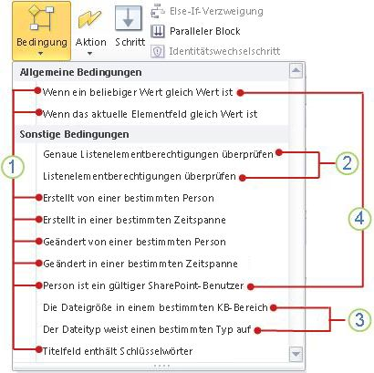

# Kurzübersicht zu Workflowbedingungen (SharePoint 2010-Workflowplattform)Workflow conditions quick reference (SharePoint 2010 Workflow platform)
Erfahren Sie mehr über die Workflowbedingungen, die in der SharePoint 2010-Workflowplattform in Microsoft SharePoint Designer 2013 verfügbar sind.Verwenden Sie diesen Artikel  *nur*  , wenn Sie in SharePoint Designer 2013 arbeiten, weiterhin jedoch die SharePoint 2010-Workflowplattform verwenden möchten.Wenn Sie stattdessen die SharePoint-Workflowplattform verwenden möchten, finden Sie unter  [Workflowaktions- und -aktivitätenreferenz für SharePoint](workflow-actions-and-activities-reference-for-sharepoint.md) und weiteren im Abschnitt „Zusätzliche Ressourcen" aufgeführten Artikeln Informationen zu neuen Funktionen, die in der neueren Plattformversion zur Verfügung stehen.Wählen Sie zum Erstellen eines Workflows mithilfe der 2010-Workflowplattform im Dialogfeld **Workflow erstellen** im Feld **Plattformtyp** **SharePoint 2010-Workflow** aus.Learn about the workflow conditions that are available in the SharePoint 2010 Workflow Platform in Microsoft SharePoint Designer 2013.Use this article  *only*  if you are working in SharePoint Designer 2013, but want to continue to use the SharePoint 2010 Workflow Platform.If instead you want to use the SharePoint Workflow Platform, see  [Workflow actions and activities reference for SharePoint](workflow-actions-and-activities-reference-for-sharepoint.md), and other articles listed in the "Additional resources" section, which describe new features that are available in the newer platform.To begin creating a workflow by using the 2010 Workflow Platform, select **SharePoint 2010 Workflow** in the **Platform Type** box in the **Create Workflow** dialog box.
## Anzeigen der WorkflowbedingungenWhere to find the workflow conditions

Es gibt zwei Möglichkeiten, um auf das Menü mit verfügbaren Workflowbedingungen zuzugreifen.There are two ways to access the menu of available workflow conditions.
  
    
    
Führen Sie eine der folgenden Aktionen beim Bearbeiten in einem Workflowschritt aus:While you are editing inside a workflow step, do one of the following:
  
    
    

- Klicken Sie auf der Registerkarte **Workflow** in der Gruppe **Einfügen** auf **Bedingungen**, um die Liste der Workflowaktionen zu öffnen.On the **Workflow** tab, in the **Insert** group, click **Conditions** to open the list of workflow actions.
    
  
- Doppelklicken Sie in einen Workflowschritt. Geben Sie in dem angezeigten Suchfeld den Text ein, der im Namen der benötigten Bedingung angezeigt wird (z. B. „erstellt"), und drücken Sie dann EINGABE. Aktionen und Bedingungen, die den von Ihnen eingegebenen Text enthalten, werden nach dem Textfeld angezeigt.Double-click inside a workflow step. In the search box that appears, type text that appears in the name of the condition that you want, such as "created", and then press Enter. Actions and conditions that contain the text you typed appear after the text box.
    
  

  
    
    

  
    
    
Welche Bedingungen Ihnen beim Erstellen oder Ändern eines Workflows zur Verfügung stehen, hängt von dem genauen Kontext ab, in dem Sie arbeiten. Weitere Informationen finden Sie in der folgenden Abbildung.Which conditions are available to you while you are creating or modifying a workflow depends on the precise context that you are working in. See the following illustration for more information.
  
    
    

  
    
    

  
    
    
 **1** Allgemeine Bedingungen in SharePoint Designer 2013**1** General conditions in SharePoint Designer 2013.
  
    
    
 **2** **Genaue Listenelementberechtigungen überprüfen** und **Listenelementberechtigungen überprüfen** sind nur in einem Identitätswechselschritt verfügbar.**2** **Check exact list item permissions** and **Check list item permissions** are available only inside an impersonation step.
  
    
    
 **3** **Die Dateigröße eine bestimmter KB-Bereich** und **Der Dateityp weist einen bestimmten Typ auf** stehen nur in einem Workflow zur Verfügung, der dem Dokumentinhaltstyp, einem untergeordneten Element des Dokumentinhaltstyps oder einer Bibliothek zugewiesen ist.**3** **The file size is a specific range kilobytes** and **The file type is a specific type** are available only in a workflow that is associated with the Document content type, a child of the Document content type, or a library.
  
    
    
 **4** **Wenn ein beliebiger Wert gleich Wert ist** und **Person ist ein gültiger SharePoint-Benutzer** sind die einzige Bedingungen, die verfügbar sind, wenn Sie einen Websiteworkflow erstellen.**4** **If any value equals value** and **Person is a valid SharePoint user** are the only conditions available when you create a site workflow.
  
    
    

## Allgemeine BedingungenGeneral conditions

In diesem Abschnitt werden die Bedingungen beschrieben, die in SharePoint Designer 2013 für Listen und wiederverwendbare Listenworkflows verfügbar sind, unabhängig davon, mit welchem Listen- oder Inhaltstyp der Workflow verküpft ist.This section describes the conditions that are available in SharePoint Designer 2013 for list and reusable list workflows, no matter what list type or content type the workflow is associated to.
  
    
    

### Wenn ein beliebiger Wert gleich dem Wert istIf any value equals value

Diese Bedingung wird anfänglich in einem Workflowschritt als **Wenn ein beliebiger Wert gleich Wert ist** angezeigt. Verwenden Sie diese Bedingung, wenn Sie einen Wert mit einem anderen Wert vergleichen möchten. Jeder Wert kann statischer Text, eine dynamische Zeichenfolge oder ein Nachschlagewert für eine Variable für Kontextinformationen oder ein SharePoint-Feld sein.This condition is initially displayed in a workflow step as **If any value equals value**. Use this condition when you want to compare one value with another value. Each value can be static text, a dynamic string, or a lookup to a variable, to context information, or to a SharePoint field.
  
    
    
Sie haben die Auswahl aus einer breiten Palette von Operatoren in Ihrer Bedingung, z. B. **enthält** und **ist größer als**. Dafür müssen Sie den ersten **Wert** in der Bedingung festlegen und dann auf **entspricht** klicken. Die verfügbaren Operatoren hängen davon ab, auf was der erste **Wert** in der Bedingung festgelegt ist. Wenn Sie beispielsweise das Dialogfeld zum Nachschlagen verwendet haben, um den ersten **Wert** in der Bedingung auf einen Datum- und Uhrzeitdatentyp wie **erstellt** festzulegen, gehört der Operator **enthält** nicht zu den verfügbaren Optionen.You can select from a wide range of operators in your condition, such as **contains** and **is greater than**. To do so, you must set the first **value** in the condition and then click **equals**. The operators that are available depend on what the first **value** in the condition is set to. For example, if you used the lookup dialog to set the first **value** in the condition to a Date and Time data type, such as **Created**, the **Contains** operator is not among the available options.
  
    
    
Es gibt zwei Varianten der Operatoren **entspricht** und **enthält**:There are two variations of the **equals** and **contains** operators:
  
    
    

- Bei den Operatoren **entspricht** und **enthält** muss die Groß-/Kleinschreibung beachtet werden.The **equals** and **contains** operators are both case-sensitive.
    
  
- Bei den Operatoren **entspricht (Groß-/Kleinschreibung wird ignoriert)** und **enthält (Groß-/Kleinschreibung wird ignoriert)** muss die Groß-/Kleinschreibung nicht beachtet werden.The **equals (ignoring case)** and **contains (ignoring case)** operators are not case-sensitive.
    
  
Die Option, die Sie für den zweiten **Wert** in der Bedingung verwenden, hängt auch zu einem gewissen Grad davon ab, auf was der erste **Wert** festgelegt wird. Nehmen wir beispielsweise an, dass Sie den ersten **Wert** auf **erstellt** festlegen und dann den zweiten **Wert** suchen, indem Sie eine Variable verwenden, die eine Zeichenfolge wie **Letzte 10 Zeichen** ist. Sie möchten wahrscheinlich die Zeichenfolge **Als Datum/Uhrzeit** zurückgeben, damit der Vergleich mit **erstellt** vorhersagbare Ergebnisse zurückgibt.The option that you choose for the second **value** in the condition also depends to some extent on what the first **value** is set to. For example, suppose that you set the first **value** to **Created**, and then you look up the second **value** by using a variable that is a string, such as **Last 10 Characters**. You would probably want to return the string **As Date/Time**, so that the comparison with **Created** will return predictable results.
  
> [!NOTE] 
> Sie können logische Operatoren wie**||**(oder) oder **&amp;&amp;** (und) in der Bedingung verwenden.Note: You can use logical operators such as**||**(or) or **&amp;** (and) in the condition.
  
    
    

Im Folgenden finden Sie Beispiele dazu, wie die Bedingung in einem Workflowschritt aussieht:Following are examples of what the condition might look like in a workflow step:
  
    
    

- Wenn Variable: Eine Woche ab Änderungist größer alsHeuteIf Variable: A week from Modifiedis greater thanToday
    
  
- Wenn Variable: Spezifikationsnameenthält (Groß-/Kleinschreibung wird ignoriert)SharePoint Designer || SPDIf Variable: Specification Namecontains (ignoring case)SharePoint Designer || SPD
    
  
Die Bedingung **Wenn ein beliebiger Wert gleich Wert ist** ist eine von nur zwei verfügbaren Bedingungen, wenn Sie in einem anderen Websiteworkflow als **Person ist ein gültiger SharePoint-Benutzer** arbeiten. Weitere Informationen zu Websiteworkflows, finden Sie im Abschnitt [Bedingungen, die in einem Websiteworkflow zur Verfügung stehen](workflow-conditions-quick-reference-sharepoint-2010-workflow-platform.md#section5) dieses Artikels.The **If any value equals value** condition is one of only two conditions available when you are working in a site workflow, the other being **Person is a valid SharePoint user**. For more information about site workflows, see the  [Conditions available within a site workflow](workflow-conditions-quick-reference-sharepoint-2010-workflow-platform.md#section5) section of this article.
  
    
    

### Wenn aktuelles Elementfeld dem Wert entsprichtIf current item field equals value

Diese Bedingung wird anfänglich in einem Workflowschritt als **Wenn Feld gleich Wert ist** angezeigt. Verwenden Sie diese Bedingung, um den Wert in einem Feld im aktuellen Element (d. h. dem Element, in dem die Liste oder der wieder verwendbare Listenworkflow derzeit ausgeführt wird) mit einem anderen Wert zu vergleichen. Werte können statischer Text, dynamische Zeichenfolgen oder Suchvorgänge für Variablen für Kontextinformationen oder andere SharePoint-Felder sein.This condition is initially displayed in a workflow step as **If field equals value**. Use this condition to compare the value in a field in the current item (that is, the item that the list or reusable list workflow is currently running on) to another value. Values can be static text, dynamic strings, or lookups to variables, to context information, or to other SharePoint fields.
  
    
    
Klicken Sie auf **Feld**, um die Liste der Optionen anzuzeigen. Die verfügbaren Optionen für **Feld** richten sich nach dem Inhaltstyp, der Liste, der Bibliothek oder der Website, dem oder der der Workflow zugeordnet ist. Ein Workflow, der z. B. einer Standardbibliothek zugeordnet ist, verfügt über Feldoptionen wie **Titel**, **erstellt** und **erstellt von**.You can click **field** to see the list of options. The available options for **field** depend on the content type, list, library, or site that the workflow is associated to. For example, a workflow that is associated to a default library will have field options such as **Title**, **Created**, and **Created By**.
  
    
    
Sie haben die Auswahl aus einer Reihe von Operatoren in Ihrer Bedingung, darunter **enthält** und **ist größer als**. Bevor Sie einen Operator auswählen, müssen Sie zunächst einen Wert für **Feld** auswählen und dann auf **entspricht** klicken. Welche Operatoren verfügbar sind, hängt von der **Feld**-Einstellung ab. Wenn Sie beispielsweise das Dialogfeld zum Nachschlagen verwendet haben, um ein **Feld** auf einen Datum- und Uhrzeitdatentyp wie **erstellt** festgelegt haben, ist der Operator **enthält** nicht als Option aufgelistet.You can select from a range of operators in your condition, including **contains** and **is greater than**. Before you select an operator, you must first select a value for **field**, and then click **equals**. Which operators are available depends on the **field** setting. For example, if you used the lookup dialog to set **field** to a Date and Time data type, such as **Created**, the **Contains** operator is not listed as an option.
  
    
    
Es gibt zwei Varianten der Operatoren **entspricht** und **enthält**. Bei den Operatoren **entspricht** und **enthält** muss die Groß-und Kleinschreibung beachtet werden, bei den Operatoren **entspricht (Groß-/Kleinschreibung wird ignoriert)** und **enthält (Groß-/Kleinschreibung wird ignoriert)** dagegen nicht. Wenn Sie z. B. **Feld** auf **Titel** festlegen und dann den Operator **enthält** verwenden und der **Wert** in Ihrer BedingungDokument ist, gilt die Bedingung nur, wenn der TitelDokument mit großem D enthält, und nicht, wenn er nurdokument ohne großes D enthält. Wenn Sie stattdessen den Operator **enthält (Groß-/Kleinschreibung wird ignoriert)** verwenden, gilt die Bedingung für Titel, dieDokument oderdokument oder beides enthalten.There are two variations of the **equals** and **contains** operators. The **equals** and **contains** operators are case-sensitive, while the **equals (ignoring case)** and **contains (ignoring case)** are not case-sensitive. For example, if you set **field** to **Title** and then use the **contains** operator, and if the **value** in your condition isDocument, then the condition is true only if the title contains Document, with a capital D, and not if it contains only document, without a capital D. If you use the **contains (ignoring case)** operator instead, then the condition is true for titles containing eitherDocument ordocument or both.
  
    
    
Die Option, die Sie für **Wert** auswählen, hängt zu einem gewissen Grad auch von dem ab, auf das **Feld** festgelegt ist. Nehmen wir beispielsweise an, dass Sie **Feld** auf **erstellt** festlegen und dann nach dem **Wert** mit einer Variable suchen, die eine Zeichenfolge wie **Letzte 10 Zeichen** ist. Sie möchten wahrscheinlich die Zeichenfolge **Als Datum/Uhrzeit** zurückgeben, damit der Vergleich mit **erstellt** vorhersagbare Ergebnisse zurückgibt.The option that you choose for **value** also depends to some extent on what **field** is set to. For example, suppose that you set **field** to **Created**, and then you look up the **value** by using a variable that is a string, such as **Last 10 Characters**. You would probably want to return the string **As Date/Time**, so that the comparison with **Created** will return predictable results.
  
> [!NOTE] 
> Sie können logische Operatoren wie**||**(oder) oder **&amp;&amp;** (und) in der Bedingung verwenden.Note: You can use logical operators such as**||**(or) or **&amp;** (and) in the condition.
  
    
    

Im Folgenden finden Sie Beispiele dazu, wie die Bedingung in einem Workflowschritt aussehen kann. (Beachten Sie, dass im ersten Beispiel **ist kleiner als** als „früher als" interpretiert wird.)Following are examples of what the condition might look like in a workflow step. (Note that in the first example, **is less than** is interpreted to mean "earlier than".)
  
    
    

- Wenn Aktuelles Element: geändertist kleiner als1/1/2010 12:00:00 UhrIf Current Item:Modifiedis less than1/1/2010 12:00:00 AM
    
  
- Wenn Current Item:Pathenthält (Groß-/Kleinschreibung wird ignoriert)Marketing || Public RelationsIf Current Item:Pathcontains (ignoring case)Marketing || Public Relations
    
  

### Von einer bestimmten Person erstelltCreated by a specific person

Diese Bedingung wird anfänglich in einem Workflowschritt als **Wenn von bestimmter Person erstellt** angezeigt. Verwenden Sie diese Bedingung, um zu ermitteln, ob ein Element von einem angegebenen Benutzer erstellt wurde. Sie können den Benutzer angeben, indem Sie entweder den Benutzernamen oder die E-Mail-Adresse manuell eingeben (z. B. Olivier@contoso.com) oder indem Sie den Benutzer aus Benutzern auswählen, die bereits in SharePoint, Exchange oder Active Directory aufgelistet sind.This condition is initially displayed in a workflow step as **If created by specific person**. Use this condition to discover whether an item was created by a specified user. You can specify the user either by entering their user name or email address manually (for example, Olivier@contoso.com) or by selecting the user from among users already listed in SharePoint, Exchange, or Active Directory.
  
> [!NOTE] 
> Da bei Benutzernamen und E-Mail-Adressen die Groß-/Kleinschreibung beachtet werden muss, wird empfohlen, dass Sie die zweite Methode verwenden, um sicherzustellen, dass die Eingabe korrekt erfolgt.Note: Because both the user name and the e-mail address are case sensitive, it is recommended that you use the latter method to ensure correct cases. Wenn Sie einen Benutzernamen oder eine E-Mail-Adresse manuell eingeben müssen, achten Sie bitte genau auf die Groß-/Kleinschreibung.If you must enter a user name or e-mail address manually, be careful to match the cases precisely. Beispielsweise wird die Bedingung **Wenn von contoso\\molly erstellt** nicht als "Wahr" ausgewertet, wenn das Benutzerkonto als Contoso\\Molly registriert ist.For example, the condition **If created by contoso\\molly** does not evaluate as true if the user account is registered as Contoso\\Molly.
  
    
    

Im Folgenden finden Sie ein Beispiel dafür, wie die Bedingung in einem Workflowschritt aussehen kann:Following is an example of what the condition might look like in a workflow step:
  
    
    

- Wenn erstellt von Molly ClarkIf created by Molly Clark
    
  

### In einem bestimmten Zeitabschnitt erstelltCreated in a specific date span

Diese Bedingung wird anfänglich in einem Workflowschritt als **Wenn zwischen Datum und Datum erstellt** angezeigt. Verwenden Sie diese Bedingung, um zu ermitteln, ob ein Element zwischen zwei angegebenen Datumswerten erstellt wurde. Sie können das aktuelle Datum, ein bestimmtes Datum oder das Ergebnis einer Suche verwenden.This condition is initially displayed in a workflow step as **If created between date and date**. Use this condition to discover whether an item was created between two specified dates. You can use the current date, a specified date, or the result of a lookup.
  
    
    
Im Folgenden finden Sie ein Beispiel dazu, wie die Bedingung in einem Workflowschritt aussehen kann:Following is an example of what the condition might look like in a workflow step:
  
    
    

- Wenn zwischen 1/1/2009 und1/1/2010 12:00:00 AMerstelltIf created between 1/1/2009 and1/1/2010 12:00:00 AM
    
  

### Von einer bestimmten Person geändertModified by a specific person

Diese Bedingung wird anfänglich in einem Workflowschritt als **Wenn von einer bestimmten Person geändert** angezeigt. Verwenden Sie diese Bedingung, um zu ermitteln, ob ein Element von einem bestimmten Benutzer geändert wurde. Der Benutzer kann als E-Mail-Adresse wie olivier@contoso.com angegeben oder aus SharePoint-, Exchange- oder Active Directory-Benutzern ausgewählt werden.This condition is initially displayed in a workflow step as **If modified by specific person**. Use this condition to discover whether an item was modified by a specified user. The user can be specified as an e-mail address, such as olivier@contoso.com, or selected from SharePoint, Exchange, or Active Directory users.
  
> [!NOTE] 
> Bei Benutzernamen und E-Mail-Adressen ist die Groß- und Kleinschreibung zu beachten.Note: The user name and e-mail address are case sensitive. Wir empfehlen Ihnen, einen Benutzernamen oder eine E-Mail-Adresse auszuwählen, um die korrekte Groß- und Kleinschreibung zu gewährleisten.It is recommended that you select a user name or e-mail address to help ensure that you use the correct case. Wenn Sie einen Benutzernamen oder eine E-Mail-Adresse eingeben, müssen Sie die für das Konto verwendete Groß-/Kleinschreibung beachten.If you type a user name or e-mail address, you must match the case of the account. Beispielsweise wird **Wenn geändert von contoso\\molly** nicht als "Wahr" ausgewertet, wenn das Benutzerkonto Contoso\\Molly lautet.For example, **If modified by contoso\\molly** will not evaluate as true if the user account is Contoso\\Molly.
  
    
    

Im Folgenden finden Sie ein Beispiel dafür, wie die Bedingung in einem Workflowschritt aussehen kann:Following is an example of what the condition might look like in a workflow step:
  
    
    

- Wenn geändert von Molly ClarkIf modified by Molly Clark
    
  

### In einem bestimmten Zeitabschnitt geändertModified in a specific date span

Diese Bedingung wird anfänglich in einem Workflowschritt als **Wenn zwischen Datum und Datum geändert** angezeigt. Verwenden Sie diese Bedingung, um zu ermitteln, ob ein Element zwischen zwei angegebenen Datumswerten erstellt wurde. Sie können für jeden der Datumswerte das aktuelle Datum, ein bestimmtes Datum oder das Ergebnis einer Suche verwenden.This condition is initially displayed in a workflow step as **If modified between date and date**. Use this condition to discover whether an item was modified between two specified dates. For each of the date values, you can use the current date, a specified date, or the result of a lookup.
  
    
    
Im Folgenden finden Sie ein Beispiel dazu, wie die Bedingung in einem Workflowschritt aussehen kann:Following is an example of what the condition might look like in a workflow step,
  
    
    

- Wenn zwischen 1/1/2009 und1/1/2009 12:00:00 AM geändertIf modified between 1/1/2009 and1/1/2009 12:00:00 AM
    
  

### Person ist ein gültiger SharePoint-BenutzerPerson is a valid SharePoint user

Diese Bedingung wird anfänglich in einem Workflowschritt als **Person ist ein gültiger SharePoint-Benutzer** angezeigt. Verwenden Sie diese Bedingung, um zu ermitteln, ob der angegebene Benutzer ein Mitglied der SharePoint-Website ist.This condition is initially displayed in a workflow step as **If person is a valid SharePoint user**. Use this condition to discover whether the specified user is a member of the SharePoint site.
  
    
    
In SharePoint Designer 2013 können Sie Personen außerhalb Ihrer Unternehmensdomäne (die als externe Teilnehmer bezeichnet werden) in Ihre Workflows einschließen. Nehmen wir beispielsweise an, dass Sie Aufgaben in Ihrem Workflow an externe Teilnehmer zugewiesen haben. Diese Aktion können anschließend verwenden, um eine Nachverfolgung der Websitebenutzer mit den externen Teilnehmern durchzuführen, bis die Aufgaben abgeschlossen sind.In SharePoint Designer 2013, you can include people outside your corporate domain (called external participants) in your workflows. For example, suppose that you have assigned tasks in your workflow to external participants. You can then use this action to make a site user follow up with the external participants until the tasks are complete.
  
    
    
Im Folgenden finden Sie ein Beispiel dazu, wie die Bedingung in einem Workflowschritt aussehen kann:Following is an example of what the condition might look like in a workflow step,
  
    
    

- Wenn Molly Clark ein gültiger SharePoint-Benutzer istIf Molly Clark is a valid SharePoint user
    
  
Die Bedingung **Wenn Person ein gültiger SharePoint-Benutzer ist** ist eine von nur zwei verfügbaren Bedingungen, wenn Sie in einem anderen Websiteworkflow als **Wenn ein beliebiger Wert gleich Wert ist** arbeiten. Weitere Informationen zu Websiteworkflows, finden Sie im Abschnitt [Bedingungen, die in einem Websiteworkflow zur Verfügung stehen](workflow-conditions-quick-reference-sharepoint-2010-workflow-platform.md#section5) dieses Artikels.The **Person is a valid SharePoint user** condition is one of only two conditions available when you are working in a site workflow, the other being **If any value equals value**. For more information about site workflows, see the  [Conditions available within a site workflow](workflow-conditions-quick-reference-sharepoint-2010-workflow-platform.md#section5) section in this article.
  
    
    

### Titelfeld enthält StichwörterTitle field contains keywords

Diese Bedingung wird anfänglich in einem Workflowschritt als **Wenn Titelfeld Stichwörter enhält** angezeigt. Verwenden Sie diese Bedingung, um zu ermitteln, ob das Feld **Titel** für ein Element angegebenen Text enthält. Sie können dem Text im Zeichenfolgen-Generator (als statischen Wert, dynamische Zeichenfolge oder eine Kombination der beiden) angeben oder eine Suche für ein Feld oder eine Variable einfügen.This condition is initially displayed in a workflow step as **If title field contains keywords**. Use this condition to discover whether the **Title** field for an item contains specified text. You can either specify the text in the String Builder (as a static value, as a dynamic string, or as a combination of the two) or insert a lookup to a field or variable.
  
> [!NOTE] 
> Bei Verwendung der Bedingung **Titelfeld enthält Schlüsselwörter** können Sie nur nach einem Schlüsselworttext suchen.Note: When using the **Title field contains keywords** condition, you cannot search for more than a single keyword text. Wenn Sie nach mehreren alternativen Schlüsselworttexten suchen möchten, können Sie logische Operatoren wie z. B. **||**(oder) und **&amp;&amp;** (und) unter einer der folgenden beiden Bedingung verwenden: **Wenn ein Wert gleich dem Wert ** ist und **Wenn das aktuelle Elementfeld gleich dem Wert** ist.To search for multiple, alternative keyword texts, you can use logical operators such as**||**( or) and **&amp;&amp;** (and) in either of the following two conditions: **If any value equals value** and **If current item field equals value**. (Verwenden Sie die zweite Bedingung, wenn Sie nur im Feld **Titel** suchen möchten).(Use the latter condition if you want to search in the **Title** field only). Sehen Sie sich beispielsweise das folgende Bild an:>For an example, see the following image:> 
  
    
    

  
    
    

  
    
    

  
    
    

  
    
    

## Nur innerhalb eines Identitätswechselschritts verfügbare BedingungenConditions available only within an impersonation step

Standardmäßig werden beim manuellen Starten eines Workflows die Berechtigungen der Person verwendet, die ihn startet. Aber was passiert, wenn die Person, die den Workflow startet nicht über ausreichende Rechte für einen oder mehrere der Vorgänge verfügt, die der Workflow ausführen muss? Beispiel: Was passiert, wenn der Workflow manchmal ein Dokument in einer Dokumentbibliothek archivieren muss, für die die Person, die den Workflow startet, möglicherweise nur Berechtigungen auf Leseebene hat, die keine Berechtigung zum Archivieren einschließen?By default, when a workflow is started manually it uses the permissions of the person who starts it. But what if the person who starts it doesn't have adequate rights for one or more of the operations that the workflow will need to perform? For example: What if the workflow will sometimes need to archive a document to a library for which the person who starts the workflow might have only the Read permission level, which does not include permission to archive? 
  
    
    
In solchen Fällen können Sie einen oder mehrere Identitätswechselschritte im Workflow verwenden.In such cases, you can use one or more impersonation steps in the workflow. Ein Identitätswechselschritt verwendet die Berechtigungen der Person, die die Workflowvorlage zuletzt gespeichert hat - in der Regel ist das der Autor der Vorlage, der normalerweise über die erforderlichen Berechtigungen für alle Workflowvorgänge verfügt, einschließlich der Berechtigung zum Archivieren des Dokuments in der richtigen Bibliothek für diesen Fall.An impersonation step uses the permissions of the person who most recently saved the workflow template???typically the author of the template, who would typically have the needed permissions for all of the workflow's operations, including in this case permission to archive the document to the appropriate library. 
  
> [!NOTE] 
> Für beide Bedingungen müssen *alle* angegebenen Benutzer und Gruppen den Vergleich bestehen, mit dem die Bedingung als wahr bewertet wird.>  Für beide Bedingungen spielt es keine Rolle, ob die angegebenen Berechtigungen *explizit* den angegebenen einzelnen Benutzern zugewiesen wurden oder ob diese einzelnen Benutzer nur *implizit* über die Berechtigungen verfügen (z. B. als Mitglieder einer Gruppe, der die Berechtigungen zugewiesen wurden). Für angegebene *Gruppen* dagegen müssen die Berechtigungen *explizit* zugewiesen und *nicht* von einer übergeordneten Gruppe vererbt sein.*Note:* For both of these conditions, *all*  of the specified users and groups must pass the comparison in order for the condition to evaluate to True.>  For both of these conditions, it does not matter whether the specified permissions have been assigned *explicitly*  to the specified individual users or whether the permissions are held by those individual users only *implicitly*  (as members of a group to which the permissions have been assigned, for instance).For specified *groups*  , on the other hand, the permissions must have been assigned *explicitly*  and not  inherited from a parent group.
  
    
    

### Überprüfen von ListenelementberechtigungenCheck list item permissions

Diese Bedingung wird anfänglich in einem Identitätswechselschritt als **Wenn Berechtigungen für diese Benutzer mindestens diese Berechtigungen für die Elemente in dieser Liste sind** angegeben.This condition is initially displayed in an impersonation step as **If permissions for these users are at least these permissions on item in this list**. 
  
    
    
Verwenden Sie diese Bedingung, um zu ermitteln, ob für die angegebene Liste oder Bibliothek die  *einzelnen Berechtigungen*  aller angegebenen Benutzer oder Gruppen alle *einzelnen Berechtigungen*  enthalten, die in der angegebenen Sicherheitsebene enthalten sind.Use this condition to discover whether, for the specified list or library, the  *individual permissions*  that each specified user and group holds include all of the *individual permissions*  that are included in the specified security level or levels.
  
    
    
 **Beispiele****Examples**
  
    
    

- Ein Benutzer oder eine Gruppe verfügt nur über Berechtigungen auf der Lesestufe für eine Liste, die Bedingung gibt aber die Stufe „Genehmigen" an. Die Lesestufe schließt  *nicht*  alle Berechtigungen ein, die in der Stufe „Genehmigen" enthalten sind, deshalb wird die Bedingung in diesem Fall als falsch ausgewertet.A user or group has only the Read permission level for a list, but the condition specifies the Approve level. The Read level does  *not*  include all of the permissions that are included in the Approve level, so in this case the condition evaluates as False.
    
  
- Ein anderer Benutzer oder eine andere Gruppe verfügt über die Berechtigungsstufe „Vollzugriff" für dieselbe Liste. Die Stufe „Vollzugriff"  *umfasst*  alle Berechtigungen, die in der Stufe „Genehmigen" (sowie andere Berechtigungen) ein, deshalb wird die Bedingung diesmal als wahr ausgewertet.Another user or group has the Full Control permission level for the same list. The Full Control level  *does*  include all of the permissions that are included in the Approve level (as well as other permissions), and so this time the condition evaluates as True.
    
  
Im Folgenden finden Sie ein Beispiel dazu, wie die Bedingung in einem Workflowschritt aussehen kann:Following is an example of what the condition might look like in a workflow step:
  
    
    

- Wenn Berechtigungen für Contoso-Mitglieder mindestensLeseberechtigungen für die Elemente inAktuelle Elemente sindIf permissions for Contoso Members are at leastRead on item inCurrent Items
    
  

### Überprüfen von Berechtigungsstufen für ListenelementeCheck list item permission levels

Diese Bedingung wird anfänglich in einem Identitätswechselschritt als **Wenn Berechtigungsstufen für diese Benutzer mindestens diese Berechtigungsstufen für die Elemente in dieser Liste sind** angegeben.This condition is initially displayed in an impersonation step as **If permission levels for these users are at least these permission levels on item in this list**. 
  
    
    
Verwenden Sie diese Bedingung, um zu ermitteln, ob für die angegebene Liste oder Bibliothek allen Benutzern und Gruppen  *explizit*  die angegebenen *Berechtigungsstufen*  zugewiesen wurden. Berechtigungen, die nur *implizit*  vorhanden sind (z. B. durch ein Mitglied einer Gruppe, der die Berechtigungen zugewiesen wurden) werden von dieser Bedingung *nicht*  berücksichtigt, genau so wenig wie einzelne Berechtigungen, über die die angegebenen Benutzer und Gruppen verfügen.Use this condition to discover whether, for the specified list or library, each specified user and group has been  *explicitly*  assigned the specified permission *level or levels*  . Permissions held only *implicitly*  (for instance, by a member of a group to which the permissions have been assigned) are *not*  considered by this condition, and neither are the individual permissions held by the specified users and groups.
  
    
    
 **Beispiele****Examples**
  
    
    

- Einem Benutzer wurde explizit nur die Berechtigungsstufe „Vollzugriff " für eine Liste zugewiesen, aber die Bedingung gibt nur die Lesestufe an. Obwohl der Benutzer über alle einzelnen Berechtigungen  *verfügt*  , die in der Lesestufe enthalten sind, wurde dem Benutzer nicht *explizit*  die Lesestufe zugewiesen und deshalb wird die Bedingung als falsch ausgewertet.A user has been explicitly assigned only the Full Control permission level for a list, but the condition specifies only the Read level. Even though the user  *holds*  all of the individual permissions that are included in the Read level, the user not been *explicitly*  assigned the Read level, so the condition evaluates as False.
    
  
- Einem anderen Benutzer wurde nur die Berechtigungsstufe „Entwurf" für eine andere Liste explizit zugewiesen, aber die Bedingung gibt sowohl die Stufe „Entwurf" als auch die Stufe „Hierarchie verwalten" an. Da dem Benutzer nur eine der beiden erforderlichen Stufen zugewiesen wurde, wird die Bedingung als falsch ausgewertet.A different user has been explicitly assigned only the Design permission level for a different list, but the condition specifies both the Design level and the Manage Hierarchy level. Because the user has been assigned only one of the two required levels, the condition evaluates as False.
    
  
- Für eine dritte Liste ist ein Benutzer ein Mitglied der Gruppe „Mitglieder" und erbt die Berechtigungen der Gruppe. Dem Benutzer wurde aber keine Berechtigungsstufe  *explizit*  zugewiesen. Die Bedingung erfordert eine *explizite Zuweisung*  der Stufe „Beitragen", deshalb wird auch diese Bedingung als falsch ausgewertet, da der Benutzer nur implizit über die Berechtigungen dieser Stufe verfügt.For a third list, a user is a member of the Members group and inherits permissions from that group. However, no permissions level has been  *explicitly*  assigned to the user. The condition requires *explicit assignment*  of the Contribute level, so because the user holds the permissions of that level only implicitly, the condition again evaluates to False.
    
  
Im Folgenden finden Sie ein Beispiel dazu, wie die Bedingung in einem Workflowschritt aussehen kann:Following is an example of what the condition might look like in a workflow step:
  
    
    

- Wenn Berechtigungsstufen für Contoso-Mitglieder mindestensLeseberechtigungen für die Elemente inAktuelle Elemente sindIf permission levels for Contoso Members are at leastRead on item inCurrent Items
    
  

## Bedingungen, die nur verfügbar sind, wenn der Workflow einer Bibliothek oder dem Dokumentinhaltstyp zugewiesen istConditions available only when the workflow is associated to a library or the Document content type

Die Bedingungen **Die Dateigröße liegt in einem bestimmten KB-Bereich** und **Der Dateityp weist einen bestimmten Typ auf** sind nur verfügbar, wenn der Workflow einer Bibliothek oder dem Dokumentinhaltstyp zugeordnet ist.The conditions **The file size is a specific range kilobytes** and **The file type is a specific type** are available only when your workflow is associated with a Library or the Document content type.
  
    
    

### Die Dateigröße liegt in einem bestimmten KB-BereichThe file size in a specific range of kilobytes

Diese Bedingung wird anfänglich in einem Workflowschritt als **Die Dateigröße liegt zwischen Größe und Größe KB** angezeigt. Verwenden Sie diese Bedingung, um zu ermitteln, ob die Dateigröße eines Dokuments zwischen zwei angegebenen, in KB gemessenen Größen liegt. Die Bedingung schließt die angegebenen Größenwerte nicht in die Bewertung ein. Sie können für jede Instanz von **Größe** entweder eine Zahl eingeben oder eine Suche verwenden.This condition is initially displayed in a workflow step as **If the file size is between size and size kilobytes**. Use this condition to discover whether the file size of a document falls between two specified sizes measured in kilobytes. The condition does not include the specified sizes in the evaluation. For each instance of **size**, you can either enter a number or use a lookup.
  
    
    
Im Folgenden finden Sie ein Beispiel dazu, wie die Bedingung in einem Workflowschritt aussehen kann:Following is an example of what the condition might look like in a workflow step,
  
    
    

- Wenn die Dateigröße zwischen 1023 und 1048577 Kilobyte beträgtIf the file size is between 1023 and1048577 kilobytes
    
> [!NOTE] 
> Die angegebenen oberen und unteren Grenzwerte sind nicht im definierten Bereich enthalten.Note: The specified upper and lower limits are not included in the defined range. In dem hier angegebenen Beispiel würde eine Datei, die 1023 KB groß ist, als falsch ausgewertet, da die Größe nicht zwischen 1023 ist und 1048577 liegt.In the example given here, a file that is 1023 KB would evaluate as false because it is not between 1023 and 1048577. 
  
    
    

### Der Dateityp weist einen bestimmten Typ aufThe file type is a specific type

Diese Bedingung wird anfänglich in einem Workflowschritt als **Wenn der Dateityp einen bestimmten Typ aufweist** angegeben. Verwenden Sie diese Bedingung, um zu ermitteln, ob der Dateityp des aktuellen Elements dem angegebenen Typ entspricht (z. B. DOCX). Sie können den Dateityp als Zeichenfolge eingeben oder eine Suche verwenden.This condition initially displays in a workflow step as **If the file type is specific type**. Use this condition to discover whether the file type of the current item is the specified type, (such as docx. You can either enter the file type as a string or use a lookup.
  
    
    
Im Folgenden finden Sie ein Beispiel dazu, wie die Bedingung in einem Workflowschritt aussehen kann:Following is an example of what the condition might look like in a workflow step:
  
    
    

- Wenn der Dateityp docx entsprichtIf the file type is docx
    
  

## Bedingungen, die in einem Websiteworkflow zur Verfügung stehenConditions available within a site workflow

Websiteworkflows arbeiten auf Websiteebene und sind nicht mit einem Listenelement verknüpft. Wenn Sie in einem Websiteworkflow arbeiten, stehen nur die folgenden Bedingungen zur Verfügung. (Alle anderen Bedingungen in SharePoint Designer 2013 arbeiten mit Listenelementen und funktionieren deshalb nicht in Websiteworkflows.)Site workflows operate at the site level and are not associated with a list item. When you are working in a site workflow, only the following conditions are available. (All other conditions in SharePoint Designer 2013 operate on list items, and therefore none of them function in site workflows.)
  
    
    

- **Wenn ein beliebiger Wert gleich dem Wert ist****If any value equals value**
    
  
- **Person ist ein gültiger SharePoint-Benutzer****Person is a valid SharePoint user**
    
  
In einem Identitätswechselschritt in einem Websiteworkflow:From within an impersonation step in a site workflow:
  
    
    

- **Überprüfen von Listenelementberechtigungen****Check list item permissions**
    
  
- **Überprüfen von Berechtigungsstufen für Listenelemente****Check list item permission levels**
    
  
- **Person ist ein gültiger SharePoint-Benutzer****Person is a valid SharePoint user**
    
  
Weitere Informationen zu Bedingungen finden Sie im Abschnitt  [Allgemeine Bedingungen](workflow-conditions-quick-reference-sharepoint-2010-workflow-platform.md#section2) in diesem Artikel.For more information about conditions, see the  [General conditions](workflow-conditions-quick-reference-sharepoint-2010-workflow-platform.md#section2) section of this article.
  
    
    

## Siehe auchSee also

-  [Neuerungen in Workflows für SharePointWhat's new in workflows for SharePoint](what-s-new-in-workflows-for-sharepoint.md)
    
  
-  [Erste Schritte mit Workflows in SharePointGet started with workflows in SharePoint](get-started-with-workflows-in-sharepoint.md)
    
  
-  [Workflowentwicklung in SharePoint Designer und VisioWorkflow development in SharePoint Designer and Visio](workflow-development-in-sharepoint-designer-and-visio.md)
    
  

  
    
    

