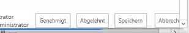
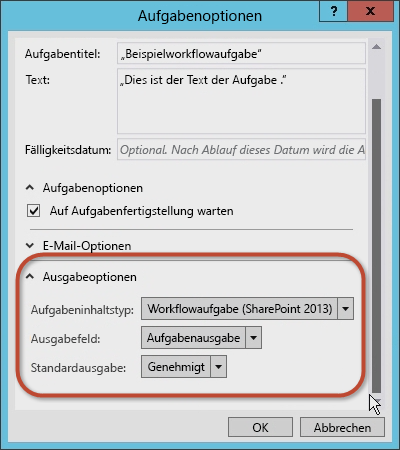
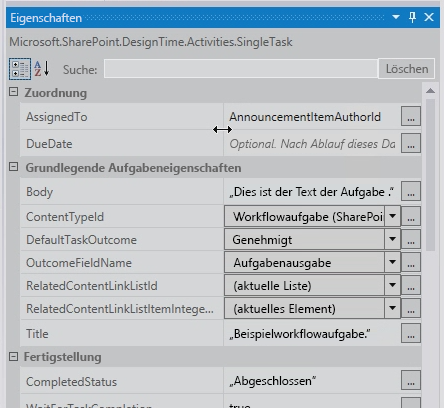

# <a name="working-with-tasks-in-sharepoint-workflows-using-visual-studio-2012"></a><span data-ttu-id="9a1af-102">Arbeiten mit Aufgaben  in SharePoint-Workflows mit Visual Studio 2012</span><span class="sxs-lookup"><span data-stu-id="9a1af-102">Working with Tasks in SharePoint Workflows using Visual Studio 2012</span></span>
<span data-ttu-id="9a1af-p101">Erfahren Sie mehr über das neue und überarbeitete Framework für Workflowaufgaben, das in SharePoint eingeführt wurde und auf dem neuen Workflow-Manager basiert. **Bereitgestellt von:** [Andrew Connell]((http://social.msdn.microsoft.com/profile/andrew%20connell%20%5bmvp%5d/)),  [AndrewConnell.com]((http://www.andrewconnell.com))</span><span class="sxs-lookup"><span data-stu-id="9a1af-p101">Learn about the new and revised workflow task framework that was introduced in SharePoint, which is built on the new Workflow Manager. **Provided by:** [Andrew Connell]((http://social.msdn.microsoft.com/profile/andrew%20connell%20%5bmvp%5d/)),  [AndrewConnell.com]((http://www.andrewconnell.com))</span></span>
  
> [!NOTE] 
> <span data-ttu-id="9a1af-105">Dieser Artikel enthält ein durchgängiges Codebeispiel. Sie können es nutzen, um die Informationen im Artikel nachzuvollziehen, oder es als Grundlage für die Erstellung eigener SharePoint-Workflows verwenden.</span><span class="sxs-lookup"><span data-stu-id="9a1af-105">This article is accompanied by an end-to-end code sample that you can use to follow the article, or as a starter for your own SharePoint workflow projects. You can find the downloadable code here: LINK.</span></span> <span data-ttu-id="9a1af-106">Herunterladen können Sie das Codebeispiel [hier]((http://assets.andrewconnell.com/media/Default/Downloads/SP2013Wf-CustomTasks.zip)).</span><span class="sxs-lookup"><span data-stu-id="9a1af-106">You can find the downloadable code  [here]((http://assets.andrewconnell.com/media/Default/Downloads/SP2013Wf-CustomTasks.zip)).</span></span> 
    
<span data-ttu-id="9a1af-107">Einer der größten Vorteile, den SharePoint der Windows Workflow Foundation bietet, ist die Implementierung eines neuen und verbesserten Frameworks für das Aufgabenmanagement, das den neuen Workflow-Manager als Hostingumgebung umfasst.</span><span class="sxs-lookup"><span data-stu-id="9a1af-107">One of the greatest benefits that the SharePoint brings to Windows Workflow Foundation is the implementation of a new and improved task management framework that incorporates the new Workflow Manager as its hosting environment.</span></span>
## <a name="reviewing-workflow-tasks-in-sharepoint-2007-and-sharepoint-2010"></a><span data-ttu-id="9a1af-108">Rückblick auf Workflowaufgaben in SharePoint 2007 und SharePoint 2010</span><span class="sxs-lookup"><span data-stu-id="9a1af-108">Reviewing workflow tasks in SharePoint 2007 and SharePoint 2010</span></span>

<span data-ttu-id="9a1af-p103">In SharePoint 2007 und SharePoint 2010 wurden Workflowaufgaben auf ähnliche Weise implementiert. Wenn Sie (in SharePoint 2010) eine Workflowzuordnung für eine Liste, einen Inhaltstyp oder ein Website erstellt haben, wurde eine bestimmte Liste als Speicherort festgelegt, in der die Workflowaufgaben erstellt werden sollten. Diese Liste war eine standardmäßige SharePoint- **Task**nliste (ID = 107), die den standardmäßigen Inhaltstyp SharePoint- **Task** (ID = 0x0108) verwendet hat. Benutzer konnten dann auf Elemente in der Liste zugreifen, um sie anzuzeigen, zu bearbeiten und Aufgaben auszuführen. Die Workflowinstanzen überwachten die Aufgabenelemente in der Liste auf Aktualisierungen, sofern der Workflow entsprechend konfiguriert war.</span><span class="sxs-lookup"><span data-stu-id="9a1af-p103">Both SharePoint 2007 and SharePoint 2010 implemented workflow tasks in a similar manner. When you created a workflow association on a list, content type, or site (in SharePoint 2010), you designated a specific list as the location where the workflow tasks would be created. This list was a standard SharePoint **Task** list (ID = 107) that used the standard SharePoint **Task** content type (ID = 0x0108). Users then could access items in the list to view, edit, and complete the task. The workflow instances monitored the task items in the list for updates if the workflow was configured to do so.</span></span>
  
    
    
<span data-ttu-id="9a1af-p104">Das standardmäßige Rendern des Aufgabenformulars in SharePoint war jedoch selbst bei benutzerdefinierten Workflows vorgegeben. War Flexibilität gefragt, mussten Sie ASP.NET [Web Forms]((http://www.asp.net/web-forms)) oder [InfoPath-Formulare](http://msdn.microsoft.com/en-us/library/ms540731%28v=office.14%29.aspx) zum Erstellen benutzerdefinierter Formularlösungen zum Bewältigen Ihrer Aufgaben verwenden.</span><span class="sxs-lookup"><span data-stu-id="9a1af-p104">However, the default rendering of the task form in SharePoint was pre-determined, even for custom workflows. For full flexibility, you needed to use ASP.NET [Web Forms]((http://www.asp.net/web-forms)) or [InfoPath Forms](http://msdn.microsoft.com/en-us/library/ms540731%28v=office.14%29.aspx) when you created custom form solutions to support your tasks.</span></span>
  
    
    

## <a name="whats-new-with-tasks-in-sharepoint"></a><span data-ttu-id="9a1af-116">Neuerungen bei Aufgaben in SharePoint</span><span class="sxs-lookup"><span data-stu-id="9a1af-116">What's new with tasks in SharePoint</span></span>

<span data-ttu-id="9a1af-117">Die Art und Weise, in der Aufgaben in SharePoint erstellt, verwaltet und bearbeitet werden, hat sich aufgrund von Änderungen an der SharePoint-Architektur verändert.</span><span class="sxs-lookup"><span data-stu-id="9a1af-117">The manner in which tasks are created, managed, and handled in SharePoint has changed due to changes in the SharePoint architecture.</span></span>
  
    
    
<span data-ttu-id="9a1af-p105">Die zentrale Änderung besteht darin, dass Workflows nicht mehr innerhalb von SharePoint verwaltet und verarbeitet werden. Stattdessen nutzt SharePoint eine neue Komponente mit dem Namen Workflow-Manager, die extern ausgeführt wird. Workflow-Manager hostet die Windows Workflow Foundation-Laufzeit und die erforderlichen Dienste, die von der Windows Workflow Foundation benötigten werden. Wenn ein Workflow veröffentlicht oder eine neue Instanz eines veröffentlichten Workflows gestartet wird, benachrichtigt SharePoint den Workflow-Manager, der wiederum die Workflowphasen verarbeitet. Wenn ein Workflow Zugriff auf Informationen in SharePoint benötigt, z. B. zu Eigenschaften von Listenelementen oder Benutzern, authentifiziert er sich selbst mithilfe von OAuth und kommuniziert anschließend mit SharePoint mittels Webdienstaufrufen über die REST-APIs.</span><span class="sxs-lookup"><span data-stu-id="9a1af-p105">The central change is that workflows are no longer managed and processed inside of SharePoint. Instead, SharePoint utilizes a new component called Workflow Manager, which runs externally. Workflow Manager hosts the Windows Workflow Foundation runtime and necessary services required by the Windows Workflow Foundation. When a workflow is published or a new instance of a published workflow is started, SharePoint notifies Workflow Manager, which in turn processes the workflow episodes. When a workflow needs to access information in SharePoint, such as list item properties or user properties, it authenticates itself using the OAuth and talks back to SharePoint with web service calls using the REST APIs.</span></span>
  
    
    
<span data-ttu-id="9a1af-p106">Die generelle Richtung für Anpassungen auf der SharePoint-Plattform wurde in SharePoint ebenfalls geändert, wobei diese Änderung bereits mit der Implementierung von Sandkastenlösungen in SharePoint 2010 eingeleitet wurde. In SharePoint hat Microsoft Änderungen eingeführt, durch die Anpassungen von SharePoint Server auf den Clientbrowser oder andere externe Ressourcen verlagert werden. Zu diesen Änderungen zählt das neue SharePoint-App-Modell, die Unterstützung der Zuweisung von App-Identitäten, die Authentifizierung über OAuth sowie Verbesserungen am clientseitigen Objektmodell (CSOM) und den REST-APIs.</span><span class="sxs-lookup"><span data-stu-id="9a1af-p106">The overall customization trend for the SharePoint platform also changed in SharePoint, although this change started with the implementation of sandboxed solutions in SharePoint 2010. In SharePoint, Microsoft introduced changes that moved customizations off of SharePoint Server and onto either to the client's browser or to external resources. These changes include the new SharePoint app model, support for assigning app identity, authentication using OAuth, improvements to the client-side object model (CSOM), and the REST APIs.</span></span>
  
    
    

## <a name="architectural-changes-to-workflow-tasks-in-sharepoint"></a><span data-ttu-id="9a1af-126">Architekturbezogene Änderungen an Workflowaufgaben in SharePoint</span><span class="sxs-lookup"><span data-stu-id="9a1af-126">Architectural changes to workflow tasks in SharePoint</span></span>

<span data-ttu-id="9a1af-p107">Wie wirken sich die architekturbezogenen Änderungen in SharePoint auf Workflowaufgaben aus? Für Workflowaufgaben ist die Auswirkung nicht signifikant, außer wenn Sie mit benutzerdefinierten Aufgabenformularen arbeiten. In der Vergangenheit wurden Aufgabenformulare mit InfoPath-Formularen oder ASP.NET Web Forms erstellt. SharePoint arbeitet hingegen mit dem standardmäßigen Formular für das Rendern von Listenelementen für Workflowaufgaben.</span><span class="sxs-lookup"><span data-stu-id="9a1af-p107">How do the architectural changes in SharePoint affect workflow tasks? For workflow tasks, the impact is not significant except when you are working with custom task forms. In the past, you created task forms using InfoPath or ASP.NET Web Forms. SharePoint, on the other hand, uses the default list item rendering form for workflow tasks.</span></span> 
  
    
    
<span data-ttu-id="9a1af-p108">Möglicherweise müssen Sie mitunter die Darstellung oder das Verhalten der Aufgabenfelder anpassen. Dazu erstellen Sie einen benutzerdefinierten Aufgabeninhaltstyp, der eine Websitespalte enthält. Die Websitespalte kann anschließend das neue clientseitige Renderframework in SharePoint nutzen, welches das Erstellen einer JavaScript-Datei erfordert, die bestimmt, wie das Feld aussehen und sich im Browser verhalten soll.</span><span class="sxs-lookup"><span data-stu-id="9a1af-p108">You may sometimes need to customize the appearance or the behavior of task fields. To do this, create a custom task content type that contains a site column. The site column can then use the new client-side rendering framework in SharePoint, which requires creating a JavaScript file that defines how the field should look and act in the browser.</span></span> 
  
    
    
<span data-ttu-id="9a1af-134">Weitere Informationen zum clientseitigen Rendering finden Sie unter  [Gewusst wie: Anpassen einer Listenansicht in Apps für SharePoint durch clientseitiges Rendering]((http://msdn.microsoft.com/de-DE/library/jj220045.aspx)).</span><span class="sxs-lookup"><span data-stu-id="9a1af-134">For more information about using client-side rendering, see  [How To Customize a List View in Apps for SharePoint Using Client-Side Rendering]((http://msdn.microsoft.com/de-DE/library/jj220045.aspx)).</span></span>
  
    
    
<span data-ttu-id="9a1af-p109">Einzelne Aufgabenelemente basieren auf Inhaltstypen. Vor allem an Inhaltstypen sind in SharePoint verschiedene Änderungen erfolgt. In SharePoint 2007 und SharePoint 2010 wurden Workflowaufgaben mit dem Inhaltstyp **Task** (ID = 0x0108) erstellt. Dies ist derselbe Inhaltstyp, mit dem nicht workflowbezogene Aufgaben in der Aufgabenliste manuell erstellt werden. In SharePoint wird dies durch die Einführung des neuen Inhaltstyps **Workflow Task (SharePoint)** (ID = 0x0108003365C4474CAE8C42BCE396314E88E51F) geändert. Dieser erbt Informationen vom Inhaltstyp "Aufgabe" und vorgibt, dass die Aufgaben nur für den Workflow zu verwenden sind.</span><span class="sxs-lookup"><span data-stu-id="9a1af-p109">Individual task items are based on content types. Importantly, there are some changes to content types in SharePoint. In SharePoint 2007 and SharePoint 2010, workflow tasks were created with the **Task** content type (ID = 0x0108). This is the same content type that is used to manually create non-workflow tasks in the task lists. SharePoint changes this by introducing a new content type, **Workflow Task (SharePoint)** (ID = 0x0108003365C4474CAE8C42BCE396314E88E51F), which inherits from the Task content type and which indicates that the tasks are to be used only for workflow.</span></span>
  
    
    
<span data-ttu-id="9a1af-140">Dieser neue Inhaltstyp **Workflow Task** unterscheidet sich vom früheren Inhaltstyp **Task** dadurch, dass er zwei neue Spalten hat:</span><span class="sxs-lookup"><span data-stu-id="9a1af-140">This new **Workflow Task** content type differs from the earlier **Task** content type in that it has two new columns:</span></span>
  
    
    

- <span data-ttu-id="9a1af-p110">**WorkflowInstanceId**: Enthält einen Verweis auf die Workflowinstanz-ID, mit der die Aufgabe erstellt wurde, und die beispielsweise auf der Workflowstatusseite verwendet wird. Auf der Statusseite wird dieses Feld genutzt, um die zugeordnete Workflowaufgabenliste auf alle Elemente abzufragen, deren Spalte **WorkflowInstanceId** die angegebene ID enthält.</span><span class="sxs-lookup"><span data-stu-id="9a1af-p110">**WorkflowInstanceId**: Contains a reference to the workflow instance identifier that created the task, which is used in such places as the workflow instance status page. The status page can use this field to query the associated workflow task list for all list items whose **WorkflowInstanceId** column contains the specified ID.</span></span>
    
  
- <span data-ttu-id="9a1af-p111">**TaskOutcome**: Ein Auswahlfeld, das bei der Darstellung des Aufgabenformulars verwendet wird, um dem Benutzer zu erlauben, verschiedene Optionen für Fertigstellungskriterien auszuwählen. Das Aufgabenbearbeitungsformular zeigt die angegebenen Ergebnisse der Workflowaufgaben als Schaltflächen am unteren Rand des Formulars neben den Schaltflächen **Speichern** und **Abbrechen** an. Workflows sind in SharePoint nicht bloß auf die beiden Optionen **Approved** und **Rejected** beschränkt (siehe Abbildung 1).</span><span class="sxs-lookup"><span data-stu-id="9a1af-p111">**TaskOutcome**: A choice field that is used in the presentation of the task form to allow the user to select different completion criteria options. The task edit form presents the specified workflow task outcomes as buttons at the bottom of the form, next to the **Save** and **Cancel** buttons. Workflows in SharePoint are not limited to just the two options **Approved** and **Rejected**, as shown in Figure 1.</span></span>
    
   <span data-ttu-id="9a1af-146">**Abbildung 1. Ergebnisse von Workflowaufgaben**</span><span class="sxs-lookup"><span data-stu-id="9a1af-146">**Figure 1. Workflow task outcomes**</span></span>

  

  
  

  

  
<span data-ttu-id="9a1af-p112">Inhaltstypen sind ein Bestandteil von Workflowaufgaben. Die Struktur der Aufgabenlistenelemente wird von Inhaltstypen bestimmt. Ebenso wichtig ist die Aufgabenlistenvorlage, die sich in SharePoint ebenfalls geändert hat.</span><span class="sxs-lookup"><span data-stu-id="9a1af-p112">Of course, content types are a part of workflow tasks. Content types simply dictate the structure of the task list items. Equally important is the task list template, which has also changed in SharePoint.</span></span>
  
    
    
<span data-ttu-id="9a1af-p113">Vor SharePoint hat die Workflowaufgabenliste dieselbe Listenvorlage als Standardaufgabenliste (ID = 107) verwendet. Es handelte sich um eine standardmäßige SharePoint-Aufgabenliste, die auch nicht im Workflow ausgeführte Aufgaben enthalten konnte. Doch in SharePoint ist der Ansatz dahingehend anders, dass ein neuer Typ von Liste eingeführt wird. Diese Liste mit der Bezeichnung Hierarchieaufgabenliste bietet am oberen Rand der Seite eine Zeitachsenansicht, um die Planung von Aufgaben anzuzeigen (siehe Abbildung 2). Beachten Sie, dass Benutzer auch Aufgabenabhängigkeiten erkennen können.</span><span class="sxs-lookup"><span data-stu-id="9a1af-p113">Prior to SharePoint, the workflow task list used the same list template as the standard task list (ID = 107). It was a standard SharePoint task list that could also contain non-workflow tasks. But in SharePoint the approach is different in that it introduces a new type of a list. This list, called the hierarchy tasks list, introduces a timeline view at the top of the page to show the scheduling of tasks, as shown in Figure 2. Note that it also lets users view task dependencies.</span></span>
  
    
    

<span data-ttu-id="9a1af-156">**Abbildung 2: Hierarchieaufgabenliste**</span><span class="sxs-lookup"><span data-stu-id="9a1af-156">**Figure 2. Hierarchy tasks list**</span></span>

  
    
    

  
    
    

  
    
    

  
    
    

  
    
    

## <a name="creating-workflow-task-options-in-sharepoint"></a><span data-ttu-id="9a1af-158">Erstellen von Workflowaufgabenoptionen in SharePoint</span><span class="sxs-lookup"><span data-stu-id="9a1af-158">Creating workflow task options in SharePoint</span></span>

<span data-ttu-id="9a1af-p114">Sowohl SharePoint Designer 2013 als auch Visual Studio 2012 bieten Workflowautoren zwei Möglichkeiten zum Erstellen von Workflowaufgaben. Eine ist das Erstellen einer einzelnen Aufgabe, die einer Person oder Gruppe zugewiesen wird. Die andere besteht darin, eine Aufgabe zu erstellen und mehreren Personen zuzuweisen. Zum Erstellen einer einzelnen Aufgabe in einem benutzerdefinierten Workflow in Visual Studio 2012 verwenden Sie die Aktivität **SingleTask**. Bei Wahl dieser Aktivität können Sie die Eigenschaften entweder im Toolfenster **Eigenschaften** oder mit dem Assistenten ändern (siehe Abbildung 3).</span><span class="sxs-lookup"><span data-stu-id="9a1af-p114">Both SharePoint Designer 2013 and Visual Studio 2012 provide workflow authors two ways to create workflow tasks. One is to create a single task that is assigned to a person or a group. The other is to create a task and assign it to multiple people. When creating a single task in a custom workflow using Visual Studio 2012, use the **SingleTask** activity. By using this activity, you can modify the properties either in the **Properties** tool window, or with the wizard, as shown in Figure 3.</span></span>
  
    
    

<span data-ttu-id="9a1af-164">**Abbildung 3. Assistent für einzelne Aufgabe**</span><span class="sxs-lookup"><span data-stu-id="9a1af-164">**Figure 3. Single-task wizard**</span></span>

  
    
    

  
    
    

  
    
    
<span data-ttu-id="9a1af-p115">SharePoint ermöglicht die Angabe, ob mehrere Aufgaben seriell oder parallel ausgeführt werden sollen, sowie die Angabe der Kriterien für die Erledigung der Aufgabe. Soll SharePoint die Erledigung aller Aufgaben oder eines Prozentsatzes davon mit einem bestimmten Ergebnis abwarten? Um in Visual Studio 2012 mehrere Aufgaben zu erstellen, verwenden Sie die Aktivität **CompositeTask**, deren Assistent und Eigenschaften der Aktivität **SingleTask** ähneln (siehe Abbildung 4).</span><span class="sxs-lookup"><span data-stu-id="9a1af-p115">SharePoint lets you specify whether multiple tasks should run serially or in parallel, as well as specifying the criteria for task completion. Should SharePoint wait for all tasks to be completed, or for a percentage of them to be completed with a specific outcome? To create multiple tasks in Visual Studio 2012, use the **CompositeTask** activity, whose wizard and properties resemble the **SingleTask** activity, as shown in Figure 4.</span></span>
  
    
    

<span data-ttu-id="9a1af-169">**Abbildung 4. Assistent für mehrere Aufgaben**</span><span class="sxs-lookup"><span data-stu-id="9a1af-169">**Figure 4. Composite task wizard**</span></span>

  
    
    

  
    
    

  
    
    

  
    
    

  
    
    

## <a name="how-to-create-and-assign-tasks-in-custom-workflows"></a><span data-ttu-id="9a1af-171">Anleitung zum Erstellen und Zuweisen von Aufgaben in benutzerdefinierten Workflows</span><span class="sxs-lookup"><span data-stu-id="9a1af-171">How to: Create and assign tasks in custom workflows</span></span>

<span data-ttu-id="9a1af-p116">Nachstehend folgt eine exemplarische Vorgehensweise, die das Erstellen und Zuweisen von Aufgaben in einem benutzerdefinierten Workflow veranschaulicht. Bevor Sie beginnen, stellen Sie sicher, dass Sie Zugriff auf eine SharePoint-Entwicklerwebsite haben.</span><span class="sxs-lookup"><span data-stu-id="9a1af-p116">Following is a walkthrough that demonstrates how to create and assign tasks in a custom workflow. Before starting, make sure that you have access to a SharePoint developer site.</span></span>
  
    
    

### <a name="1-create-a-new-sharepoint-app-project"></a><span data-ttu-id="9a1af-174">1. Erstellen eines neuen SharePoint-App-Projekts</span><span class="sxs-lookup"><span data-stu-id="9a1af-174">1. Create a new SharePoint app project</span></span>


1. <span data-ttu-id="9a1af-175">Erstellen Sie ein neues SharePoint-App-Projekt, und konfigurieren Sie das Projekt als eine Von SharePoint gehostetes Add-In.</span><span class="sxs-lookup"><span data-stu-id="9a1af-175">Create a new SharePoint app project and configure the project as a SharePoint-hosted add-in.</span></span>
    
  
2. <span data-ttu-id="9a1af-p117">Fügen Sie dem Projekt eine **Announcement**-Listeninstanz hinzu. Diese dient als Container für Elemente, die zum Testen des Workflows dienen.</span><span class="sxs-lookup"><span data-stu-id="9a1af-p117">To the project, add a new **Announcement** list instance to the project. This will be used as the container for items used to test the workflow.</span></span>
    
  
3. <span data-ttu-id="9a1af-178">Fügen Sie dem Projekt ein Workflowelement hinzu, indem Sie im **Projektmappen-Explorer** mit der rechten Maustaste auf das Projektsymbol klicken und anschließend auf **Hinzufügen** und **Neues Element** klicken.</span><span class="sxs-lookup"><span data-stu-id="9a1af-178">Add a workflow item the project by right-clicking the project icon in **Solution Explorer** and selecting **Add**, followed by **New Item**.</span></span>
    
  
4. <span data-ttu-id="9a1af-179">Wählen Sie im Dialogfeld **Neues Element hinzufügen** in der Kategorie **Office/SharePoint** das Projektelement **Workflow** aus, und nennen Sie es "BenutzerdefinierterAufgabenworkflow", und klicken Sie dann auf **Weiter**.</span><span class="sxs-lookup"><span data-stu-id="9a1af-179">In the **Add New Item** dialog box, select the **Workflow** project item from the **Office/SharePoint** category and name it "CustomTaskWorkflow", and then click **Next**.</span></span>
    
  

### <a name="2-collect-information-on-the-new-announcement-item"></a><span data-ttu-id="9a1af-180">2. Erfassen von Informationen zum Element "Neue Ankündigung"</span><span class="sxs-lookup"><span data-stu-id="9a1af-180">2. Collect information on the New Announcement item</span></span>

<span data-ttu-id="9a1af-p118">Wir erstellen eine Aufgabe in unserem Workflow und weisen sie der Person zu, die das Listenelement mit der Ankündigung erstellt hat, mit dem der Workflow gestartet wird. Das Listenelement übermittelt die Informationen an den Workflow. Wir verwenden eine **LookupSPListItemProperties**-Aktivität, die einen dynamischen Wert aus dem REST-Webdienst zurückgibt, der in SharePoint aufgerufen wird. Wir speichern diesen Wert dann in einer neuen Variablen namens **AnnouncementItemProperties**, deren Datentyp wir in **DynamicValue** ändern.</span><span class="sxs-lookup"><span data-stu-id="9a1af-p118">We are going to create a task in our workflow and assign it to the person who created the announcement list item that kicks off the workflow. The list item itself will provide the information to the workflow. We will use a **LookupSPListItemProperties** activity, which returns a dynamic value from the REST web service that it calls in SharePoint. We're then going to store this value in a new variable named **AnnouncementItemProperties**, whose data type we will change to **DynamicValue**.</span></span>
  
    
    

1. <span data-ttu-id="9a1af-185">Erstellen Sie eine **AnnouncementItemAuthorId**-Variable zum Speichern der ID der Person, die das Listenelement erstellt hat (siehe Abbildung 5) .</span><span class="sxs-lookup"><span data-stu-id="9a1af-185">Create an **AnnouncementItemAuthorId** variable to store the ID of the person who created the list item, as shown in Figure 5.</span></span>
    
   <span data-ttu-id="9a1af-186">**Abbildung 5: "LookupSPListItemProperties"-Aktivität**</span><span class="sxs-lookup"><span data-stu-id="9a1af-186">**Figure 5. LookupSPListItemProperties activity**</span></span>

  

  
  

  

  
2. <span data-ttu-id="9a1af-188">Legen Sie die **LookupSPListItem**-Aktivität auf der Entwurfsoberfläche des Workflows ab, und legen Sie die **ListID**-Eigenschaft auf  _(current list)_ fest.</span><span class="sxs-lookup"><span data-stu-id="9a1af-188">Drop the **LookupSPListItem** activity onto the workflow design surface and set the **ListID** property to _(current list)_.</span></span>
    
  
3. <span data-ttu-id="9a1af-189">Legen Sie den **ItemId**-Wert auf  _(current item)_ fest.</span><span class="sxs-lookup"><span data-stu-id="9a1af-189">Set the **ItemId** to _(current item)_.</span></span>
    
  
4. <span data-ttu-id="9a1af-190">Legen Sie die **Result**-Ausgabe auf die **AnnouncementItemProperties**-Variable fest, die wir zuvor erstellt haben.</span><span class="sxs-lookup"><span data-stu-id="9a1af-190">Set the **Result** output to the **AnnouncementItemProperties** variable that we created earlier.</span></span>
    
  
5. <span data-ttu-id="9a1af-p119">Zum Abrufen des Autors des Elements aus der Variablen klicken Sie auf den Link **Eigenschaften abrufen** in der **LookupSPListItem**-Aktivität und fügen der Entwurfsoberfläche eine **GetDynamicValueProperties**-Aktivität hinzu. Legen Sie deren **Source**-Eigenschaft auf die Ausgabe der **LookupSPListItem**-Aktivität fest.</span><span class="sxs-lookup"><span data-stu-id="9a1af-p119">To get the author of the item from the variable, click the **Get Properties** link in the **LookupSPListItem** activity and add a **GetDynamicValueProperties** activity to the design surface. Set its **Source** property to the output of the **LookupSPListItem** activity.</span></span>
    
  
6. <span data-ttu-id="9a1af-193">Klicken Sie auf die Schaltfläche **[???]** neben der Eigenschaft **Properties**, um das Dialogfeld **Eigenschaften** aufzurufen.</span><span class="sxs-lookup"><span data-stu-id="9a1af-193">Click the **[???]** button on the **Properties** property to bring up the **Properties** dialog box.</span></span>
    
  
7. <span data-ttu-id="9a1af-194">Ändern Sie im Dialogfeld **Eigenschaften** den Wert für **Entitätstyp** in **List Item of Announcements**, wie in Abbildung 6 dargestellt.</span><span class="sxs-lookup"><span data-stu-id="9a1af-194">In the **Properties** dialog box, change the **Entity Type** to **List Item of Announcements**, as shown in Figure 6.</span></span>
    
  
8. <span data-ttu-id="9a1af-195">Weisen Sie den Pfad **Erstellt von** der Variablen **AnnouncementItemAuthorId** zu (siehe Abbildung 6).</span><span class="sxs-lookup"><span data-stu-id="9a1af-195">Assign the **Created By** path to the variable **AnnouncementItemAuthorId**, as shown in Figure 6.</span></span>
    
   <span data-ttu-id="9a1af-196">**Abbildung 6. Dialogfeld "Eigenschaften"**</span><span class="sxs-lookup"><span data-stu-id="9a1af-196">**Figure 6. Properties dialog**</span></span>

  

  
  

  

  

### <a name="3-create-and-assign-the-task"></a><span data-ttu-id="9a1af-198">3. Erstellen und Zuweisen der Aufgabe</span><span class="sxs-lookup"><span data-stu-id="9a1af-198">3. Create and Assign the task</span></span>

<span data-ttu-id="9a1af-199">An dieser Stelle können wir die Aufgabe erstellen und dem Autor des Ankündigungselements zuweisen.</span><span class="sxs-lookup"><span data-stu-id="9a1af-199">At this point we can create and assign the task to the author of the announcement item.</span></span>
  
    
    

1. <span data-ttu-id="9a1af-200">Ziehen Sie aus der Toolbox eine **SingleTask**-Aktivität auf die Entwurfsoberfläche des Workflows.</span><span class="sxs-lookup"><span data-stu-id="9a1af-200">From the toolbox, add a **SingleTask** activity to the workflow design surface.</span></span>
    
  
2. <span data-ttu-id="9a1af-201">Klicken Sie in der Aktivität auf den Link **Konfigurieren**, um das Dialogfeld **Aufgabenoptionen** zu öffnen.</span><span class="sxs-lookup"><span data-stu-id="9a1af-201">Click the **Configure** link in the activity to open the **Task Options** dialog box.</span></span>
    
  
3. <span data-ttu-id="9a1af-202">Legen Sie die Eigenschaft **Zugewiesen an** auf die Variable fest, in der die Autor-ID gespeichert wird.</span><span class="sxs-lookup"><span data-stu-id="9a1af-202">Set the **Assigned To** property to the variable used to store the author identifier.</span></span>
    
  
4. <span data-ttu-id="9a1af-203">Ändern Sie den Titel und Text der Aufgabe (siehe Abbildung 7).</span><span class="sxs-lookup"><span data-stu-id="9a1af-203">Modify the title and body of the task, as shown in Figure 7.</span></span>
    
   <span data-ttu-id="9a1af-204">**Abbildung 7: Dialogfeld "Aufgabenoptionen"**</span><span class="sxs-lookup"><span data-stu-id="9a1af-204">**Figure 7. Task Options dialog**</span></span>

  

  
  

  

  
<span data-ttu-id="9a1af-p120">Es gibt verschiedene andere Optionen, die Sie im Dialogfeld **Aufgabenoptionen** festlegen können. Sie können z. B. den Workflow so festlegen, dass er auf den Abschluss der Aufgabe wartet, indem Sie einfach das Kontrollkästchen aktivieren (siehe Abbildung 7). In früheren Versionen von SharePoint-Workflows war hierfür eine schwierige Befehlslösung erforderlich.</span><span class="sxs-lookup"><span data-stu-id="9a1af-p120">There are several other options that can be set in the **Task Options** dialog box. For example, you can set the workflow to wait for the task to complete by simply checking the box (see Figure 7). Previous versions of SharePoint workflows required a difficult workaround to accomplish this.</span></span>
  
    
    
<span data-ttu-id="9a1af-p121">Beachten Sie in Abbildung 8 die E-Mail-Optionen, die Sie festlegen können. Sie können u. a. sicherstellen, dass E-Mail-Nachrichten gesendet werden, wenn die Aufgabe überfällig ist, sowie angeben, wie oft die Erinnerungen gesendet werden.</span><span class="sxs-lookup"><span data-stu-id="9a1af-p121">Notice in Figure 8 the email options that you can set. Among other options, you can ensure that email messages are sent whenever the task is overdue as well as specifying how often the reminders are sent.</span></span> 
  
    
    

<span data-ttu-id="9a1af-211">**Abbildung 8. Einstellungen für E-Mail-Optionen**</span><span class="sxs-lookup"><span data-stu-id="9a1af-211">**Figure 8. Email Options settings**</span></span>

  
    
    

  
    
    

  
    
    
<span data-ttu-id="9a1af-p122">Sie können auch Optionen für das Ergebnis von Aufgaben festlegen. Sie können den Inhaltstyp der Workflowaufgabe, das **Ergebnisfeld** und das **Standardergebnis** auswählen (siehe Abbildung 9).</span><span class="sxs-lookup"><span data-stu-id="9a1af-p122">You can also set the task outcome options. You can select the workflow task content type, the **Outcome Field**, and the **Default Outcome**, as shown in Figure 9.</span></span>
  
    
    

<span data-ttu-id="9a1af-215">**Abbildung 9. Einstellungen für Ergebnisoptionen**</span><span class="sxs-lookup"><span data-stu-id="9a1af-215">**Figure 9. Outcome Options settings**</span></span>

  
    
    

  
    
    

  
    
    

  
    
    

  
    
    

### <a name="4-examine-and-modify-the-task-properties"></a><span data-ttu-id="9a1af-217">4. Prüfen und Ändern der Aufgabeneigenschaften</span><span class="sxs-lookup"><span data-stu-id="9a1af-217">4. Examine and modify the task properties</span></span>

<span data-ttu-id="9a1af-218">Nachdem Sie die Werte im Dialogfeld **Aufgabenoptionen** akzeptiert haben, wählen Sie die **SingleTask**-Aktivität und untersuchen dann das Eigenschaftenraster **Eigenschaften** (siehe Abbildung 10).</span><span class="sxs-lookup"><span data-stu-id="9a1af-218">Once you have accepted values in the **Task Options** dialog box, select the **SingleTask** activity and then inspect the **Properties** property grid (see Figure 10).</span></span>
  
    
    

<span data-ttu-id="9a1af-219">**Abbildung 10: Toolfenster "Eigenschaften"**</span><span class="sxs-lookup"><span data-stu-id="9a1af-219">**Figure 10. Properties tool window**</span></span>

  
    
    

  
    
    

  
    
    
<span data-ttu-id="9a1af-221">Im Eigenschaftenraster **Eigenschaften** können Sie angeben, ob die Aufgabe bis zur Fertigstellung warten soll, ehe Sie fortfahren, und Sie können die E-Mail-Nachrichten konfigurieren, die die Aufgabe generiert, einschließlich der anfänglichen Zuweisungs-E-Mail, der E-Mail bei Überfälligkeit und der E-Mail zum Abbruch der Aufgabe.</span><span class="sxs-lookup"><span data-stu-id="9a1af-221">Using the **Properties** property grid, you can specify whether you want the task to wait for completion before proceeding, and you can configure the email messages that the task generates, including the initial assignment email message, the overdue email message, and the task cancellation email message.</span></span>
  
    
    
<span data-ttu-id="9a1af-p123">Beachten Sie, dass die **Outcome**-Eigenschaft automatisch eine Variable namens **outcome_0** für die Aufgabe erstellt hat. Um zu sehen, was in dieser Variablen enthalten ist, fügen Sie auf der Entwurfsoberfläche eine **WriteToHistory**-Aktivität hinzu und aktualisieren die Nachricht mit der Ausgabe des Ergebnisses (siehe Abbildung 11).</span><span class="sxs-lookup"><span data-stu-id="9a1af-p123">Notice that the **Outcome** property automatically created a variable named **outcome_0** for the task. To see what is contained in this variable, add a **WriteToHistory** activity on the design surface and update the message to write out the result, as shown in Figure 11.</span></span>
  
    
    

<span data-ttu-id="9a1af-224">**Abbildung 11. Wert der Eigenschaft "Ergebnis"**</span><span class="sxs-lookup"><span data-stu-id="9a1af-224">**Figure 11. Outcome property value**</span></span>

  
    
    

  
    
    

  
    
    

  
    
    

  
    
    

### <a name="5-test-the-workflow"></a><span data-ttu-id="9a1af-226">5. Testen des Workflows</span><span class="sxs-lookup"><span data-stu-id="9a1af-226">5. Test the workflow</span></span>

<span data-ttu-id="9a1af-227">Gehen Sie zum Testen des Workflows wie folgt vor:</span><span class="sxs-lookup"><span data-stu-id="9a1af-227">To test the workflow, do the following:</span></span>
  
    
    

1. <span data-ttu-id="9a1af-p124">Drücken Sie **F5** zum Erstellen und Ausführen des Workflows, oder klicken Sie in Visual Studio 2012 auf die Schaltfläche **Start**. Wenn Sie den Test in einer lokalen Installation von SharePoint durchführen , startet Visual Studio 2012 das Workflow-Manager Test Service Host-Dienstprogramm und stellt den Workflow auf der Entwicklerwebsite bereit. Nach kurzer Zeit wird die Entwicklerwebsite geöffnet.</span><span class="sxs-lookup"><span data-stu-id="9a1af-p124">Press **F5** to build and run, or click the **Start** button in Visual Studio 2012. If you are testing in an on-premises installation of SharePoint, Visual Studio 2012 starts the Workflow Manager Test Service Host utility and deploys the workflow to the developer site. After a moment, the developer site opens.</span></span>
    
  
2. <span data-ttu-id="9a1af-231">Navigieren Sie zur Liste **Ankündigungen**, und erstellen Sie ein Listenelement, und starten Sie den benutzerdefinierten Workflow manuell.</span><span class="sxs-lookup"><span data-stu-id="9a1af-231">Navigate to the **Announcements** list and create a list item, then start the custom workflow manually.</span></span>
    
  
3. <span data-ttu-id="9a1af-p125">Kehren Sie zur Statusseite der Workflowinstanz zurück, um die Aufgabe zu suchen, die vom Workflow erstellt wurde. Klicken Sie auf die Aufgabe, um das Formular anzuzeigen. Beachten Sie die Felder **Aufgabenname** und **Zugewiesen an**, die im Workflow definiert wurden (siehe Abbildung 12).</span><span class="sxs-lookup"><span data-stu-id="9a1af-p125">Return to the workflow instance status page to find the task that was created by the workflow. Click on the task to see the form. Note the **Task Name** and **Assigned To** fields that were defined in the workflow, as shown in Figure 12.</span></span>
    
   <span data-ttu-id="9a1af-235">**Abbildung 12. Aufgabenformular**</span><span class="sxs-lookup"><span data-stu-id="9a1af-235">**Figure 12. Task form**</span></span>

  

  
  

  

  
4. <span data-ttu-id="9a1af-p126">Kehren Sie abschließend zur Aufgabe zurück, bearbeiten Sie das Formular, und klicken Sie dann auf die Schaltfläche **Genehmigen** oder **Ablehnen**, um die Aufgabe abzuschließen. Beachten Sie, dass das Ergebnis der Aufgabe in der Liste **Workflowverlauf** für die Workflowinstanz angezeigt wird (siehe Abbildung 13).</span><span class="sxs-lookup"><span data-stu-id="9a1af-p126">Finally, return to the task, edit the form, and then click the **Approve** or **Reject** to complete the task. Notice that the result of the task is shown in the **Workflow History** list for the workflow instance, as shown in Figure 13.</span></span>
    
   <span data-ttu-id="9a1af-239">**Abbildung 13: Liste "Workflowverlauf"**</span><span class="sxs-lookup"><span data-stu-id="9a1af-239">**Figure 13. Workflow History list**</span></span>

  

  
  

  

  

## <a name="how-to-create-a-custom-task-type-with-a-custom-outcome"></a><span data-ttu-id="9a1af-241">Vorgehensweise: Erstellen eines benutzerdefinierten Aufgabentyps mit einem benutzerdefinierten Ergebnis</span><span class="sxs-lookup"><span data-stu-id="9a1af-241">How to: Create a custom task type with a custom outcome</span></span>

<span data-ttu-id="9a1af-p127">In der vorherigen exemplarischen Vorgehensweise wurde gezeigt, wie Sie eine einfache Aufgabe erstellen und ihre Eigenschaften konfigurieren. Allerdings ist es möglich, dass die Standardoptionen nicht Ihren Anforderungen entsprechen. Nehmen Sie z. B. eine Aufgabe, bei der jemand gebeten wird, ein Dokument zu überprüfen. Beim Überprüfen des Dokumententwurfs hat der Prüfer eine von zwei Optionen: den Entwurf des Dokuments zur Überarbeitung an den Autor zurücksenden oder das Dokument an den Redakteur weiterleiten. Leider erfüllt keine der Standardoptionen ( **Genehmigt** und **Abgelehnt**) die Anforderungen des Prüfers. Besser geeignete Optionen wären "An Autor zurücksenden" und "An Redakteur weiterleiten".</span><span class="sxs-lookup"><span data-stu-id="9a1af-p127">The previous walkthrough demonstrated how to create a simple task and configure its properties. However, sometimes the default options may not meet your needs. For example, consider a task that asks someone to review a document. Upon reviewing the draft document, the reviewer should exercise one of two options: send the draft document back to the author for revision, or forward the document to the editor. Unfortunately, neither of the default options ( **Approved** and **Rejected**) meets the reviewers needs. More appropriate options would be "Return to Author" and "Proceed to Editor".</span></span>
  
    
    
<span data-ttu-id="9a1af-p128">Beim Erstellen von Workflows mit entweder SharePoint Designer 2013 oder Visual Studio 2012 können Sie benutzerdefinierte Workflowaufgaben erstellen, die benutzerdefinierte Aufgabenergebnisse aufweisen. Zu diesem Zweck müssen Sie eine benutzerdefinierte Aufgabe als speziellen Inhaltstyp erstellen und dann eine benutzerdefinierten Websitespalte hinzufügen, die die gewünschten Ergebnisse definiert. Sie können die benutzerdefinierte Spalte vom Feldtyp **OutcomeChoice** ableiten, bei dem es sich um ein Auswahlfeld handelt.</span><span class="sxs-lookup"><span data-stu-id="9a1af-p128">When creating workflows using either SharePoint Designer 2013 or Visual Studio 2012 you can create custom workflow tasks that include custom task outcomes. To do this, you create a custom task as a special content type and then add a custom site column that defines the outcomes you desire. You can derive the custom column from the field type called **OutcomeChoice**, which is a choice field.</span></span>
  
    
    
<span data-ttu-id="9a1af-p129">Dieser Ansatz kann jedoch dahingehend eine Herausforderung darstellen, dass der Inhaltstyp, von dem die benutzerdefinierte Aufgabe abgeleitet ist, der Inhaltstyp **Workflow Task (SharePoint)** ist, der die standardmäßige Websitespalte **TaskOutcome** mit den Optionen **Genehmigt** und **Abgelehnt** enthält. Sie können allerdings die Standardeinstellung umgehen, indem Sie die Spalte **TaskOutcome** aus dem benutzerdefinierten Aufgabeninhaltstyp entfernen und sicherstellen, dass sie nicht in der Aufgabenliste des Workflows vorhanden ist. Andernfalls würden mehrere Optionen angezeigt. Nehmen Sie z. B. ein benutzerdefiniertes Ergebnis mit den beiden Möglichkeiten "Rote Pille" und "Blaue Pille". Wenn das Standardergebnis nicht entfernt wird, würden den Benutzern, die die Aufgabe ausführen, alle verfügbaren Ergebnisoptionen angezeigt (siehe Abbildung 14), auch wenn diese Ergebnisoptionen irrelevant sind.</span><span class="sxs-lookup"><span data-stu-id="9a1af-p129">This approach can pose a challenge, however, in that the content type that the custom task is derived from is the **Workflow Task (SharePoint)** content type, which includes the default **TaskOutcome** site column that contains the **Approved** and **Rejected** options. However, you can work around the default setting by removing the **TaskOutcome** column from the custom task content type and ensure it is not present in the workflow task list. Otherwise, it would result in showing multiple options. For example, consider a custom outcome that had two options, "Red Pill" and "Blue Pill." If the default outcome is not removed, then the users completing the task would be presented with all available outcome options, as shown in Figure 14, even if those outcome options do not apply.</span></span>
  
    
    

<span data-ttu-id="9a1af-256">**Abbildung 14. Ergebnisoptionen**</span><span class="sxs-lookup"><span data-stu-id="9a1af-256">**Figure 14. Outcome options**</span></span>

  
    
    

  
    
    

  
    
    
<span data-ttu-id="9a1af-258">Bewährt hat sich, für jeden Aufgabentyp, den Sie erstellen, eine andere Aufgabenliste für den Workflow zu erstellen.</span><span class="sxs-lookup"><span data-stu-id="9a1af-258">As a best practice, you want to create a different workflow task list for each type of task that you create.</span></span> 
  
    
    

### <a name="create-a-sharepoint-app-project"></a><span data-ttu-id="9a1af-259">Erstellen eines SharePoint-App-Projekts</span><span class="sxs-lookup"><span data-stu-id="9a1af-259">Create a SharePoint app project</span></span>

<span data-ttu-id="9a1af-260">Als ersten Schritt bei der exemplarischen Vorgehensweise zum Erstellen einer benutzerdefinierten Workflowaufgabe mit Visual Studio 2012 müssen Sie sicherstellen, dass Sie Zugriff haben eine SharePoint-Entwicklerwebsite haben.</span><span class="sxs-lookup"><span data-stu-id="9a1af-260">To begin the walkthrough for creating a custom workflow task using Visual Studio 2012, you first want to ensure that you have access to a SharePoint developer site.</span></span> 
  
    
    

1. <span data-ttu-id="9a1af-261">Erstellen Sie in Visual Studio 2012 ein neues SharePoint-App-Projekt, das als Von SharePoint gehostetes Add-In konfiguriert ist.</span><span class="sxs-lookup"><span data-stu-id="9a1af-261">In Visual Studio 2012, create a new SharePoint app project that is configured as a SharePoint-hosted add-in.</span></span>
    
  
2. <span data-ttu-id="9a1af-p130">Fügen Sie dem Projekt eine neue **Announcement**-Listeninstanz hinzu. Diese dient als Container für Elemente, die zum Testen des Workflows dienen.</span><span class="sxs-lookup"><span data-stu-id="9a1af-p130">To the project, add a new **Announcement** list instance. You will use this as the container for items used to test the workflow.</span></span>
    
  
3. <span data-ttu-id="9a1af-264">Fügen Sie dann dem Projekt ein Workflowelement hinzu, indem Sie mit der rechten Maustaste im **Projektmappen-Explorer** auf das Projektsymbol klicken und anschließend auf **Hinzufügen** und **Neues Element** klicken.</span><span class="sxs-lookup"><span data-stu-id="9a1af-264">Next, add a workflow item the project by right-clicking the project icon in the **Solution Explorer** and selecting **Add**, followed by **New Item**.</span></span>
    
  
4. <span data-ttu-id="9a1af-265">Wählen Sie im Dialogfeld **Neues Element hinzufügen** in der Kategorie **Office/SharePoint** das Projektelement **Workflow** aus, und nennen Sie es "BenutzerdefinierterAufgabenworkflow", und klicken Sie dann auf **Weiter**.</span><span class="sxs-lookup"><span data-stu-id="9a1af-265">In the **Add New Item** dialog box, select the **Workflow** project item from the **Office/SharePoint** category and name it "CustomTaskWorkflow"; then click **Next**.</span></span>
    
  

### <a name="create-the-custom-outcome-column"></a><span data-ttu-id="9a1af-266">Erstellen der benutzerdefinierten Ergebnisspalte</span><span class="sxs-lookup"><span data-stu-id="9a1af-266">Create the custom outcome column</span></span>

<span data-ttu-id="9a1af-267">Nachdem wir die Liste **Announcements** erstellt haben, wollen wir als Nächstes den benutzerdefinierten Inhaltstyp erstellen, der die benutzerdefinierte Aufgabe und die Websitespalte für das benutzerdefinierte Ergebnisfeld enthalten soll.</span><span class="sxs-lookup"><span data-stu-id="9a1af-267">Once we have the **Announcements** list created, we next want to create the custom content type that will contain the custom task and the site column for the custom outcome field.</span></span>
  
    
    

1. <span data-ttu-id="9a1af-268">Klicken Sie mit der rechten Maustaste auf das Projekt, klicken Sie auf **Hinzufügen** und dann auf **Neues Element**.</span><span class="sxs-lookup"><span data-stu-id="9a1af-268">Right-click the project and select **Add**, followed by **New Item**.</span></span>
    
  
2. <span data-ttu-id="9a1af-p131">Wählen Sie nun die Projektelementvorlage **Websitespalte**, und legen Sie den Namen dieses Felds auf "BenutzerdefinierteErgebnisspalte" fest. An der Vorlage für die Websitespalte sind einige Änderungen vorzunehmen.</span><span class="sxs-lookup"><span data-stu-id="9a1af-p131">Now choose the **Site Column** project item template and set the name of this field to "CustomOutcomeColumn". Within the template for the site column there are a few changes that need to be made.</span></span>
    
  
3. <span data-ttu-id="9a1af-271">Legen Sie den Feldtyp der Spalte auf **OutcomeChoice**, den erforderlichen Feldtyp für eine Ergebnisspalte, fest.</span><span class="sxs-lookup"><span data-stu-id="9a1af-271">Set the field type of the column to **OutcomeChoice**, which is the required field type for an outcome column.</span></span>
    
  
4. <span data-ttu-id="9a1af-272">Entfernen Sie die Spalte **Erforderlich**.</span><span class="sxs-lookup"><span data-stu-id="9a1af-272">Remove the **Required** column.</span></span>
    
  
5. <span data-ttu-id="9a1af-273">Fügen Sie als Nächstes, da der Feldtyp **OutcomeChoice** auf dem Feldtyp "Auswahl" basiert, eigene Auswahlmöglichkeiten hinzu.</span><span class="sxs-lookup"><span data-stu-id="9a1af-273">Next, because the **OutcomeChoice** field type is based on the choice field type, add a few choices of your own.</span></span>
    
  
<span data-ttu-id="9a1af-274">Das Markup der neuen benutzerdefinierten Spalte sollte jetzt wie folgt aussehen:</span><span class="sxs-lookup"><span data-stu-id="9a1af-274">The new custom site column markup should now look like the following:</span></span>
  
    
    


```XML

<?xml version="1.0" encoding="utf-8"?>
<Elements xmlns="http://schemas.microsoft.com/sharepoint/">  
  <Field
       ID="{7b7edd9e-f5d1-4558-a2c8-e733dcfb0a5e}"
       Name="CustomSiteColumn"
       DisplayName="Better State"
       Type="OutcomeChoice"
       Required="FALSE"
       Group="Custom Site Columns">
       <CHOICES>
         <CHOICE>Florida</CHOICE>
         <CHOICE>Georgia</CHOICE>
       </CHOICES>
       <Default>Florida</Default>
  </Field>
</Elements>
```


### <a name="create-a-custom-task-content-type"></a><span data-ttu-id="9a1af-275">Erstellen eines benutzerdefinierten Aufgabeninhaltstyps</span><span class="sxs-lookup"><span data-stu-id="9a1af-275">Create a custom task content type</span></span>

<span data-ttu-id="9a1af-276">Nach Erstellen der Websitespalte ist der nächste Schritt das Erstellen eines speziellen Inhaltstyp für die benutzerdefinierte Aufgabe.</span><span class="sxs-lookup"><span data-stu-id="9a1af-276">After creating the site column, the next step is to create a specialized content type for the custom task.</span></span>
  
    
    

1. <span data-ttu-id="9a1af-277">Fügen Sie dem Projekt als neues Element den Inhaltstyp mit dem Namen **CustomTaskContentType** hinzu.</span><span class="sxs-lookup"><span data-stu-id="9a1af-277">Add a new content type project item to the project with the name **CustomTaskContentType**.</span></span>
    
  
2. <span data-ttu-id="9a1af-278">Bei der Aufforderung zum Auswählen, auf welchem Inhaltstyp dieser basieren soll, wählen Sie den Inhaltstyp **Workflow Task (SharePoint)**.</span><span class="sxs-lookup"><span data-stu-id="9a1af-278">When prompted to select which content type this is based on, select the **Workflow Task (SharePoint)** content type.</span></span>
    
  
3. <span data-ttu-id="9a1af-279">Fügen Sie als Nächstes die benutzerdefinierte Ergebnisspalte der Liste verfügbarer Spalten hinzu, und entfernen Sie die standardmäßige Ergebnisspalte, damit das Markup des Inhaltstyps wie im folgenden Beispiel aussieht.</span><span class="sxs-lookup"><span data-stu-id="9a1af-279">Next, add the custom outcome column to the list of available columns and also remove the default outcome column so the markup of the content type looks like the following example.</span></span>
    
```XML
  
<?xml version="1.0" encoding="utf-8"?>
<Elements xmlns="http://schemas.microsoft.com/sharepoint/">
  <!-- Parent ContentType: Workflow Task (SharePoint) (0x0108003365C4474CAE8C42BCE396314E88E51F) -->
  <ContentType 
      ID="0x0108003365C4474CAE8C42BCE396314E88E51F00D368DFB2B31A447BB184BA1334E5119E" 
      Name="CustomContentType" 
      Group="Custom Content Types" 
      Description="My Content Type" 
      Inherits="TRUE" Version="0">
      <FieldRefs>
         <FieldRef 
            ID="{7b7edd9e-f5d1-4558-a2c8-e733dcfb0a5e}" 
            DisplayName="Better State" 
            Required="FALSE" 
            Name="CustomSiteColumn" />
            <RemoveFieldRef 
               ID="{55B29417-1042-47F0-9DFF-CE8156667F96}" 
               Name="TaskOutcome" />
      </FieldRefs>
  </ContentType>
</Elements>
```


### <a name="create-a-workflow"></a><span data-ttu-id="9a1af-280">Erstellen eines Workflows</span><span class="sxs-lookup"><span data-stu-id="9a1af-280">Create a workflow</span></span>

<span data-ttu-id="9a1af-281">Jetzt erstellen wir einen Workflow, damit wir die benutzerdefinierte Websitespalte und den Inhaltstyp testen können.</span><span class="sxs-lookup"><span data-stu-id="9a1af-281">Now we create a workflow so we can test the custom site column and content type.</span></span> 
  
    
    

1. <span data-ttu-id="9a1af-282">Fügen Sie unserem Projekt einen Workflow hinzu, und konfigurieren Sie ihn als Listenworkflow.</span><span class="sxs-lookup"><span data-stu-id="9a1af-282">Add a workflow to our project configure it to be a list workflow.</span></span>
    
  
2. <span data-ttu-id="9a1af-283">Erstellen Sie eine Zuordnung mit diesem Workflow mithilfe der Liste **Ankündigungen**, die wir zuvor erstellt haben.</span><span class="sxs-lookup"><span data-stu-id="9a1af-283">Create an association with this workflow using the **Announcements** list that we created earlier.</span></span>
    
  
3. <span data-ttu-id="9a1af-284">Erstellen Sie eine neue Variable vom Typ **DynamicValue**, und nennen Sie sie "Elementeigenschaften". Wir nutzen diese Variable zum Speichern des Elements, das die Eigenschaften des Workflows aktiviert.</span><span class="sxs-lookup"><span data-stu-id="9a1af-284">Create a new variable of type **DynamicValue** and name it "ItemProperties"; we are going to use this variable to store the item that kicks off the workflow's properties.</span></span>
    
  
4. <span data-ttu-id="9a1af-285">Erstellen Sie eine **Int32**-Variable, und nennen Sie sie "Elementautor-ID" (siehe Abbildung 15).</span><span class="sxs-lookup"><span data-stu-id="9a1af-285">Create an **Int32** variable and name it "ItemAuthorId", as shown in Figure 15.</span></span>
    
   <span data-ttu-id="9a1af-286">**Abbildung 15: Erstellen einer Workflowvariablen**</span><span class="sxs-lookup"><span data-stu-id="9a1af-286">**Figure 15. Creating a workflow variable**</span></span>

  

  
  

  

  

### <a name="collect-the-list-item-properties"></a><span data-ttu-id="9a1af-288">Erfassen der Listenelementeigenschaften</span><span class="sxs-lookup"><span data-stu-id="9a1af-288">Collect the list item properties</span></span>

<span data-ttu-id="9a1af-289">Nun erfassen wir die Listenelementeigenschaften.</span><span class="sxs-lookup"><span data-stu-id="9a1af-289">Now we collect the list item properties.</span></span>
  
    
    

1. <span data-ttu-id="9a1af-290">Legen Sie die **LookupSPListItem**-Aktivität auf der Entwurfsoberfläche des Workflows ab, und legen Sie die **ListID**-Eigenschaft auf  _(current list)_ und die **ItemId**-Eigenschaft auf  _(current item)_ fest.</span><span class="sxs-lookup"><span data-stu-id="9a1af-290">Drop the **LookupSPListItem** activity onto the design surface and set the **ListID** property to _(current list)_ and the **ItemId** property to _(current item)_.</span></span> 
    
  
2. <span data-ttu-id="9a1af-291">Legen Sie jetzt die **Result**-Ausgabe auf die **ItemProperties** **DynamicValue**-Variable fest, die wir zuvor erstellt haben.</span><span class="sxs-lookup"><span data-stu-id="9a1af-291">Now set the **Result** output to the **ItemProperties** **DynamicValue** variable that we created a moment ago.</span></span>
    
  
3. <span data-ttu-id="9a1af-292">Zum Abrufen des Autors des Elements aus der Variablen klicken Sie auf den Link **Eigenschaften abrufen** in der **LookupSPListItem**-Aktivität und fügen der Entwurfsoberfläche eine **GetDynamicValueProperties**-Aktivität zu.</span><span class="sxs-lookup"><span data-stu-id="9a1af-292">To get the author of the item from the variable, click the **Get Properties** link in the **LookupSPListItem** activity and add a **GetDynamicValueProperties** activity on the design surface.</span></span>
    
  
4. <span data-ttu-id="9a1af-293">Legen Sie fest, dass als Wert für die Eigenschaft **Source** des Elements automatisch die Ausgabe der Aktivität **LookupSPListItem** gesetzt wird.</span><span class="sxs-lookup"><span data-stu-id="9a1af-293">Set the item's **Source** property to the output of the **LookupSPListItem** activity automatically.</span></span>
    
  
5. <span data-ttu-id="9a1af-294">Klicken Sie auf die Schaltfläche **[???]** neben der Eigenschaft **Properties**, um das Dialogfeld **Eigenschaften** aufzurufen.</span><span class="sxs-lookup"><span data-stu-id="9a1af-294">Click the **[???]** button on the **Properties** property to display the **Properties** dialog box.</span></span>
    
  
6. <span data-ttu-id="9a1af-295">Ändern Sie die **Entity Type**-Eigenschaft in **List Item of Announcements**, um dem Dialogfeld einen Kontext zu geben, und weisen den **Created By**-Pfad der Variablen **ItemAuthorId** zu (siehe Abbildung 16).</span><span class="sxs-lookup"><span data-stu-id="9a1af-295">Change the **Entity Type** to **List Item of Announcements** to give the dialog box a context and assign the **Created By** path to the variable **ItemAuthorId**, as shown in Figure 16.</span></span>
    
   <span data-ttu-id="9a1af-296">**Abbildung 16. Dialogfeld "Eigenschaften"**</span><span class="sxs-lookup"><span data-stu-id="9a1af-296">**Figure 16. Properties dialog**</span></span>

  

  
  

  

  

### <a name="create-a-single-task"></a><span data-ttu-id="9a1af-298">Erstellen einer einzelnen Aufgabe</span><span class="sxs-lookup"><span data-stu-id="9a1af-298">Create a single task</span></span>

<span data-ttu-id="9a1af-299">Jetzt können wir die einzelne Aufgabe erstellen.</span><span class="sxs-lookup"><span data-stu-id="9a1af-299">Now we can create the single task.</span></span> 
  
    
    

1. <span data-ttu-id="9a1af-300">Fügen Sie die **SingleTask**-Aktivität der Entwurfsoberfläche zu.</span><span class="sxs-lookup"><span data-stu-id="9a1af-300">Add a **SingleTask** activity to the design surface.</span></span>
    
  
2. <span data-ttu-id="9a1af-301">Klicken Sie in der Aktivität auf den Link **Konfigurieren**, um das Dialogfeld **Aufgabenoptionen** zu öffnen.</span><span class="sxs-lookup"><span data-stu-id="9a1af-301">Click the **Configure** link in the activity to open the **Task Options** dialog box.</span></span>
    
  
3. <span data-ttu-id="9a1af-302">Legen Sie das Feld **Text** auf eine beliebige Zeichenfolge fest. Legen Sie danach die Eigenschaft **Zugewiesen an** auf die Variable fest, die zum Speichern der Autor-ID dient (in unserem Fall **ItemAuthorId**).</span><span class="sxs-lookup"><span data-stu-id="9a1af-302">Set the **Body** field to some string (it doesn't matter what), then set the **Assigned To** property to the variable you are using to store the author identifier (in our case, **ItemAuthorId**).</span></span>
    
  
4. <span data-ttu-id="9a1af-303">Ändern Sie den Titel der Aufgabe (siehe Abbildung 17).</span><span class="sxs-lookup"><span data-stu-id="9a1af-303">Change the title of the task, as shown in Figure 17.</span></span>
    
   <span data-ttu-id="9a1af-304">**Abbildung 17: Einstellung "Aufgabentitel"**</span><span class="sxs-lookup"><span data-stu-id="9a1af-304">**Figure 17. Task Title setting**</span></span>

  

  
  

  

  
5. <span data-ttu-id="9a1af-306">Legen Sie abschließend das Feld **Ergebnisoptionen** auf das Verwenden des neuen benutzerdefinierten Inhaltstyp und der benutzerdefinierten Ergebnisspalte fest.</span><span class="sxs-lookup"><span data-stu-id="9a1af-306">Finally, set the **Outcome Options** to use the new custom content type and custom outcome column.</span></span>
    
    <span data-ttu-id="9a1af-307">Das Dialogfeld bestimmt die verfügbaren Optionen, indem alle Inhaltstypen untersucht werden, die vom Inhaltstyp **Workflow Task (SharePoint)** abgeleitet sind (siehe Abbildung 18).</span><span class="sxs-lookup"><span data-stu-id="9a1af-307">The dialog box determines what is available by looking at all the content types that are derived from the **Workflow Task (SharePoint)** content type, as shown in Figure 18.</span></span>
    

   <span data-ttu-id="9a1af-308">**Abbildung 18. Einstellungen für Ergebnisoptionen**</span><span class="sxs-lookup"><span data-stu-id="9a1af-308">**Figure 18. Outcome Options settings**</span></span>

  

  
  

  

  

### <a name="update-the-assignedto-field"></a><span data-ttu-id="9a1af-310">Aktualisieren des "AssignedTo"-Felds</span><span class="sxs-lookup"><span data-stu-id="9a1af-310">Update the AssignedTo field</span></span>

<span data-ttu-id="9a1af-p132">Bevor wir fortfahren, müssen wir das **AssignedTo**-Feld für die **SingleTask**-Aktivität ändern, da es eine Zeichenfolge und keine ganze Zahl erwartet. Um dies zu beheben, fügen Sie **ToString()** am Ende des Ausdrucks hinzu.</span><span class="sxs-lookup"><span data-stu-id="9a1af-p132">Before we go any further, we need to update the **AssignedTo** field on the **SingleTask** activity because it is expecting a string, not an integer. To remedy this, add **ToString()** to the end of the expression.</span></span>
  
    
    
<span data-ttu-id="9a1af-p133">Beachten Sie auch, dass die **Outcome**-Eigenschaft automatisch eine Variable namens **outcome_0** erstellt hat. Um zu sehen, was in dieser Variablen enthalten ist, fügen Sie auf der Entwurfsoberfläche eine **WriteToHistory**-Aktivität hinzu und aktualisieren die Nachricht mit der Ausgabe des Ergebnisses.</span><span class="sxs-lookup"><span data-stu-id="9a1af-p133">Also, notice that the **Outcome** property automatically created a variable named **outcome_0**. To see what is in this variable, add a **WriteToHistory** activity on the design surface and update the message to write out the result.</span></span>
  
    
    

### <a name="update-the-workflow-task-list"></a><span data-ttu-id="9a1af-315">Aktualisieren der Aufgabenliste des Workflows</span><span class="sxs-lookup"><span data-stu-id="9a1af-315">Update the workflow task list</span></span>

<span data-ttu-id="9a1af-p134">Der letzte Schritt ist das Konfigurieren der Aufgabenliste des Workflows. Standardmäßig lässt die von der App erstellte Aufgabenliste nur den Inhaltstyp **Workflow Task (SharePoint)** zu. Dieser Workflow verwendet einen benutzerdefinierten Inhaltstyp für das benutzerdefinierte Ergebnis. Öffnen Sie die Datei `Elements.xml` für die Aufgabenliste des Workflows, und ändern Sie das **ContentTypeId**-Attribut des **<ContentTypeBinding>**-Elements entsprechend dem Inhaltstyp im Projekt (siehe das folgende Codebeispiel).</span><span class="sxs-lookup"><span data-stu-id="9a1af-p134">The final step is to configure the workflow task list. By default, the task list that the app creates only accepts the content type **Workflow Task (SharePoint)**. This workflow uses a custom content type for the custom outcome. Open the  `Elements.xml` file for the workflow task list and change the **<ContentTypeBinding>** element's **ContentTypeId** attribute to match the content type in the project, as shown in the code example following.</span></span>
  
    
    

```XML

<?xml version="1.0" encoding="utf-8" ?>
<Elements xmlns="http://schemas.microsoft.com/sharepoint/">
  <ListInstance 
      FeatureId="{f9ce21f8-f437-4f7e-8bc6-946378c850f0}"
      TemplateType="171"
      Title="WorkflowTaskList"
      Description="This list instance is used for workflow Task items."
      Url="Lists/WorkflowTaskList"
      RootWebOnly="FALSE" />
  <!-- CustomContentType -->
  <ContentTypeBinding 
      ListUrl="Lists/WorkflowTaskList"
      RootWebOnly="FALSE"
      ContentTypeId="0x0108003365C4474CAE8C42BCE396314E88E51F00D368DFB2B31A447BB184BA1334E5119E"/>
</Elements>
```


### <a name="test-the-custom-content-task-with-a-custom-task-outcome"></a><span data-ttu-id="9a1af-320">Testen der benutzerdefinierten Inhaltsaufgabe mit einem benutzerdefinierten Aufgabenergebnis</span><span class="sxs-lookup"><span data-stu-id="9a1af-320">Test the custom content task with a custom task outcome</span></span>

<span data-ttu-id="9a1af-321">Lassen Sie uns nun den Workflow testen.</span><span class="sxs-lookup"><span data-stu-id="9a1af-321">Now let's test the workflow.</span></span> 
  
    
    

1. <span data-ttu-id="9a1af-p135">Drücken Sie in Visual Studio 2012 **F5**, oder klicken Sie auf die Schaltfläche **Start**. Wenn Sie den Test in einer lokalen Installation von SharePoint durchführen , startet Visual Studio 2012 das Workflow-Manager Test Service Host-Dienstprogramm und stellt den Workflow auf der Entwicklerwebsite bereit. Nach kurzer Zeit wird die Entwicklerwebsite geöffnet.</span><span class="sxs-lookup"><span data-stu-id="9a1af-p135">In Visual Studio 2012, press **F5** or click the **Start** button. If testing in an on-premises local install of SharePoint, Visual Studio 2012 will start the Workflow Manager Test Service Host utility and deploy the workflow to the developer site. After a moment, the developer site will open.</span></span>
    
  
2. <span data-ttu-id="9a1af-p136">Navigieren Sie zur Liste **Ankündigungen**, und erstellen Sie ein neues Element. Nachdem das Element erstellt wurde, starten Sie den benutzerdefinierten Workflow manuell.</span><span class="sxs-lookup"><span data-stu-id="9a1af-p136">Navigate to the **Announcements** list and create a new item. After creating the item, start the custom workflow manually.</span></span>
    
  
3. <span data-ttu-id="9a1af-327">Kehren Sie als Nächstes zur Statusseite der Workflowinstanz zurück, um die Aufgabe zu suchen, die vom Workflow erstellt wurde.</span><span class="sxs-lookup"><span data-stu-id="9a1af-327">Next, return to the workflow instance's status page to find the task that was created by the workflow.</span></span>
    
  
4. <span data-ttu-id="9a1af-p137">Klicken Sie auf die Aufgabe, und wechseln Sie über die Schaltfläche **Bearbeiten** auf dem Menüband in den Bearbeitungsmodus. Am unteren Rand des Formulars sollten vier Schaltflächen vorhanden sein. Die ersten beiden Schaltflächen sind die benutzerdefinierten Ergebnisschaltflächen, auf die geklickt wird, um die Aufgabe als erledigt zu markieren. Die nächsten beiden Schaltflächen sind die Standardschaltflächen **Speichern** und **Abbrechen**, die zum Aktualisieren des Listenelements dienen, ohne die Aufgabe abzuschließen (siehe Abbildung 19).</span><span class="sxs-lookup"><span data-stu-id="9a1af-p137">Click on the task and, using the **Edit** button in the ribbon, switch to edit mode. At the bottom of the form there should be four buttons. The first two buttons are the custom outcome buttons that, when pressed, will mark the task as complete. The second two buttons are the default **Save** and **Cancel** buttons that simply update the list item without completing the task, as shown in Figure 19.</span></span>
    
   <span data-ttu-id="9a1af-332">**Abbildung 19. Benutzerdefinierte Ergebnisschaltfläche**</span><span class="sxs-lookup"><span data-stu-id="9a1af-332">**Figure 19. Custom outcome buttons**</span></span>

  

  
  

  

  

## <a name="conclusion"></a><span data-ttu-id="9a1af-334">Schlussbemerkung</span><span class="sxs-lookup"><span data-stu-id="9a1af-334">Conclusion</span></span>

<span data-ttu-id="9a1af-p138">Workflows wurden von Microsoft in die SharePoint 2007-Plattform eingeführt, die in SharePoint 2010 hinsichtlich Architektur, Implementierung oder Prozesse so gut wie unverändert blieb. Gleiches galt für Aufgaben in SharePoint-Workflows. In SharePoint wurden Workflows, was Architektur und Implementierung angeht, umfassend geändert.</span><span class="sxs-lookup"><span data-stu-id="9a1af-p138">Microsoft introduced workflows into the SharePoint 2007 platform, and they remained mostly unchanged in SharePoint 2010 in architecture, implementation, or process. This was also true for tasks in SharePoint workflows. However, SharePoint has introduced many changes to workflows in architecture and implementation.</span></span>
  
    
    
<span data-ttu-id="9a1af-p139">In diesem Artikel wurden die Änderungen in Bezug auf Workflowaufgaben erläutert, die sich aufgrund von Änderungen am gesamten Thema Workflow in SharePoint ergeben haben. Es wurde veranschaulicht, wie Sie einen einfachen Workflow erstellen, der mit Aufgaben in SharePoint mithilfe von Visual Studio 2012 arbeitet. Diese Arten von Aufgaben eignen sich für viele Entwickler, obwohl mitunter benutzerdefinierte Aufgaben und benutzerdefinierte Ergebnisse gewünscht werden, die mit Visual Studio 2012 wie gezeigt realisiert werden können.</span><span class="sxs-lookup"><span data-stu-id="9a1af-p139">This article discussed the changes related to workflow tasks that were driven from changes to the workflow story in SharePoint. It demonstrated how to create a simple workflow that leveraged tasks in SharePoint using Visual Studio 2012. These types of tasks are suitable for many developers, although at times custom tasks and custom outcomes are desired, which can be accomplished using Visual Studio 2012 as has been shown.</span></span>
  
    
    

## <a name="see-also"></a><span data-ttu-id="9a1af-341">Siehe auch</span><span class="sxs-lookup"><span data-stu-id="9a1af-341">See also</span></span>
<span data-ttu-id="9a1af-342"><a name="bk_addresources"> </a></span><span class="sxs-lookup"><span data-stu-id="9a1af-342"><a name="bk_addresources"> </a></span></span>


-  <span data-ttu-id="9a1af-343">[Workflows in SharePoint]((http://msdn.microsoft.com/de-DE/library/jj163986.aspx))</span><span class="sxs-lookup"><span data-stu-id="9a1af-343">[Workflows in SharePoint]((http://msdn.microsoft.com/de-DE/library/jj163986.aspx))</span></span>
    
  
-  <span data-ttu-id="9a1af-344">[Autorisierung und Authentifizierung von Apps für SharePoint]((http://msdn.microsoft.com/de-DE/library/office/fp142384.aspx))</span><span class="sxs-lookup"><span data-stu-id="9a1af-344">[Authorization and authentication for apps in SharePoint]((http://msdn.microsoft.com/de-DE/library/office/fp142384.aspx))</span></span>
    
  
-  <span data-ttu-id="9a1af-345">[Gewusst wie: Anpassen einer Listenansicht in Apps für SharePoint durch clientseitiges Rendering]((http://msdn.microsoft.com/de-DE/library/jj220045.aspx))</span><span class="sxs-lookup"><span data-stu-id="9a1af-345">[How To Customize a List View in Apps for SharePoint Using Client-Side Rendering]((http://msdn.microsoft.com/de-DE/library/jj220045.aspx))</span></span>
    
  

