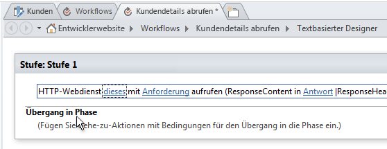
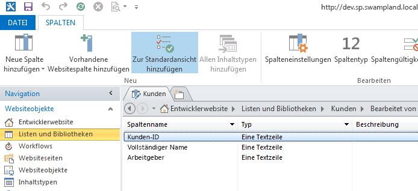
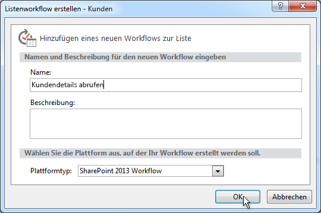
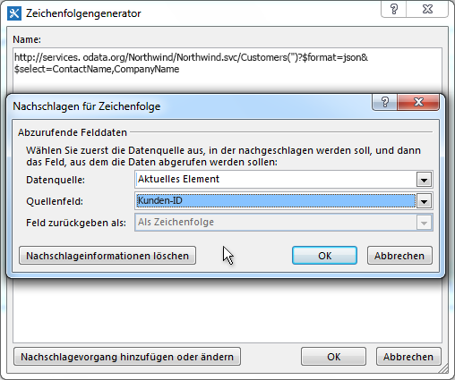
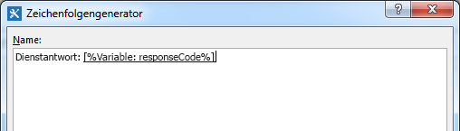
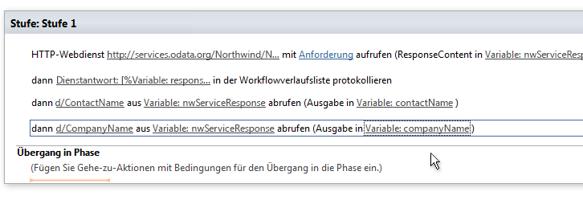
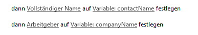
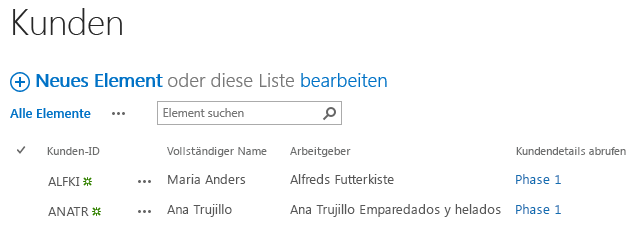

# Arbeiten mit Webdiensten in SharePoint-Workflows mit SharePoint Designer 2013Working with Web Services in SharePoint Workflows using SharePoint Designer 2013
Veranschaulicht die Verwendung von Webdiensten in SharePoint Designer 2013-Workflows. **Bereitgestellt von:** [Andrew Connell](http://social.msdn.microsoft.com/profile/andrew%20connell%20%5bmvp%5d/),  [AndrewConnell.com](http://www.andrewconnell.com)Demonstrates how to use web services in SharePoint Designer 2013 workflows. **Provided by:** [Andrew Connell](http://social.msdn.microsoft.com/profile/andrew%20connell%20%5bmvp%5d/),  [www.AndrewConnell.com](http://www.andrewconnell.com)
  
    
    

Microsoft hat einen neuen Ansatz für Workflows in SharePoint gewagt.Microsoft has taken a fresh approach to workflows in SharePoint. Das Workflow-Team hat mit dem Microsoft Azure-Team gearbeitet, um ein neues Produkt namens „Workflow-Manager“ zu erstellen.The workflow team worked with the Microsoft Azure team to create a new product called Workflow Manager. Der Workflow-Manager dient als Host für die neueste Version von Windows Workflow Foundation Runtime und bietet alle erforderlichen Dienste sowie die Nutzung von Microsoft Azure Service Bus zur Verbesserung der Leistung und Skalierbarkeit.Workflow Manager serves as the host for the latest version of the Windows Workflow Foundation runtime and provides all of the necessary services as well as leveraging the Microsoft Azure Service Bus to enhance performance and scalability. Unabhängig davon, ob die Bereitstellung lokal oder in der Cloud erfolgt, wird er immer gleich ausgeführt.Once deployed, it runs the same whether in an on-premises deployment or deployed to the cloud. SharePoint übergibt alle Workflowausführungen und damit verbundenen Aufgaben an die Workflow-Manager-Farm, die sich außerhalb von SharePoint befindet.Importantly, SharePoint hands off all workflow execution and related tasks to the Workflow Manager farm, which is external to SharePoint.
Eine der wichtigsten Änderungen an der Workflowarchitektur besteht darin, dass jetzt alle Workflows deklarativ auf einer Entwurfsoberfläche erstellt werden, einschließlich der mit Visual Studio 2012 erstellten Workflows.One of the more significant changes to the workflow architecture is that now all workflows are authored in a declaratively, on a designer surface, including those built using Visual Studio 2012. In vorherigen Versionen waren mit Visual Studio 2012 entwickelte Workflows nicht ausschließlich deklarativ.In previous versions of SharePoint, workflows developed with Visual Studio 2012 were not exclusively declarative. Stattdessen bestanden sie aus einer Kombination aus deklarativem XAML-Code und einem kompilierten Assembly, das die Workflowgeschäftslogik enthielt.Instead, they were a mix of declarative XAML and a compiled assembly that contained the workflow business logic.
  
    
    

Für Benutzer, die in der Vergangenheit Workflows mit SharePoint Designer erstellt haben, ist dies nichts Neues. Workflows, die mit SharePoint Designer erstellt wurden, waren immer deklarativ. Diese Änderung stellt einen Vorteil für Benutzer dar, die Workflows mit SharePoint Designer 2013 erstellen, da SharePoint Designer 2013-Workflows nun das Aufrufen und Verarbeiten von Webdiensten unterstützten.For those customers who have created workflows using SharePoint Designer in the past, this is nothing new. Workflows authored using SharePoint Designer have always been fully declarative. This change does benefit customers who create workflows using SharePoint Designer 2013, however, because SharePoint Designer 2013 workflows now support calling and consuming web services.
## Warum sind Web Services für SharePoint-Workflows wichtigWhy are web services important for SharePoint workflows

Beginnen wir mit Szenarien, in denen das Verwenden von Webdiensten sinnvoll ist. In SharePoint 2007 oder SharePoint 2010 wurde das Schreiben von benutzerdefiniertem Code häufig zum Erstellen von Workflows mit Visual Studio verwendet, da dies die beste Möglichkeit zur Durchführung von Berechnungen oder Implementierung benutzerdefinierter Geschäftslogik war.Let's start by understanding scenarios in which using web services makes sense. In the days of SharePoint 2007 or SharePoint 2010, writing custom code was common when using Visual Studio to author workflows because that was the best way to perform calculations or implement custom business logic. Any time you encountered a situation in which the out-of-box actions and activities didn't meet your needs, you could fall back on custom code in a managed assembly.
  
    
    
Für Benutzer von SharePoint Designer 2013, die keine Entwickler waren, war dies jedoch nicht so einfach. Bei Anwendungsfällen, die nicht mit vorhandenen Workflowaktionen gelöst werden konnten, mussten sie Entwickler darum bitten, eine benutzerdefinierte Aktion zu schreiben. Dies war häufig schwierig, da sie nur Code für den Sandkasten (in einer gehosteten Umgebung) erstellen, oder nur voll vertrauenswürdige Lösungen in einer lokalen Bereitstellung verwenden konnten. In anderen Fällen mussten Workflows an einen Entwickler übergeben werden, damit er eine voll vertrauenswürdige Lösung erstellt, da das, was erforderlich war, nicht in SharePoint Designer zu erzielen war.For the non-developer users of SharePoint Designer 2013, on the other hand, this was not so easy. When you ran into a use cases that you couldn't handle with existing workflow actions, you had to call in a developer to write a custom action. Often, this was difficult because they could only create code for the sandbox (when in a hosted environment), or could only use fully-trusted solutions if in an on-premises deployment. In other cases, the workflow had to be completely handed over to a developer to build as a fully-trusted solution because what was needed could not be achieved in SharePoint Designer.
  
    
    
Die gute Nachricht: Wenn bei SharePoint in SharePoint Designer 2013 eine benötigte Aktion fehlt, müssen Sie lediglich einen benutzerdefinierten Webdienst erstellen. Und das Erstellen eines benutzerdefinierten Webdiensts ist viel einfacher als das Erstellen einer benutzerdefinierten Aktion. Während eine benutzerdefinierte Aktion jedoch nur von dem Workflow, in dem sie installiert ist (oder am besten nur von einem SharePoint-Workflow), verwendet werden kann, kann ein benutzerdefinierter Webdienst jedoch übertragen und von einer beliebigen Anzahl von Benutzern verwendet werden.Now comes the good news: In the world of SharePoint, when SharePoint Designer 2013 lacks an action that you need, all you need is to create a custom web service. And creating a custom web service is much easier than creating a custom action. Not only that, but whereas a custom action could only be used by the workflow in which it's installed (or, at best, by only a SharePoint workflow), a custom web service is portable and can be used by any number of consumers.
  
    
    
Das Beste ist wahrscheinlich die Tatsache, dass in Fällen mit einem vorhandenen Webdienst, auf den Sie zugreifen - entweder ein öffentlicher oder ein privater -, der von Ihrem Unternehmen gehostet wird, SharePoint Designer 2013 eine Aktion bietet, die Sie verwenden können, um den Webdienst aufzurufen. Sie sind nicht mehr auf einen Entwickler angewiesen, wenn Sie einen vorhandenen Webdienst aufrufen müssen. .Perhaps best of all, in cases where there is an existing web service that you need to access - either a public one, or perhaps a private web service that is hosted by your company - SharePoint Designer 2013 now provides an action that you can use to call the web service. There is no longer any need to rely on a developer when you need to call an existing web service.
  
    
    
Während SharePoint jede Art von Webdienst nutzen kann, ist es am einfachsten (und empfohlen), Webdienste zu verwenden, die Daten mithilfe der standardmäßigen  [OData](http://www.odata.org/)-Formate von  [Atom](http://msdn.microsoft.com/en-us/library/ff478141.aspx) oder [JSON](http://json.org/) (JavaScript Object Notation) akzeptieren und zurückgeben.While SharePoint can consume any type of web service, it is easiest (and recommended) that you use web services that accept and return data using the standard  [OData](http://www.odata.org/) formats of [Atom](http://msdn.microsoft.com/en-us/library/ff478141.aspx) or [JSON](http://json.org/) (JavaScript Object Notation).
  
    
    
Diese Empfehlung basiert auf der Unterstützung dieser OData-Formate in SharePoint-Tools zum Erstellen von Workflows (sowohl in SharePoint Designer 2013 als auch in Visual Studio 2012). Beide Tools unterstützen das Erstellen von Nutzlasten zur Übermittlung an den Dienst und für die Verarbeitung der Antworten, die von Webdiensten zurückgegeben wurden. Darüber hinaus unterstützen die OData-Formate die Kommunikation mit anonymen Webdiensten und mit solchen, die mit verschiedenen Arten der Authentifizierung geschützt sind. Kurz gesagt, Sie haben die vollständige Kontrolle über die Anforderung und Antwort für jeden Dienstaufruf. Dadurch können Sie eine Reihe von Aktivitäten in einem Workflow zunächst mit einem Dienst authentifizieren und einen OAuth-Token abrufen, und dann das Token in zukünftigen Anforderungen für Dienste einschließen, die mit dem  [OAuth 2.0](http://oauth.net/2/)-Protokoll geschützt sind.This recommendation is based on their being support for these OData formats in SharePoint workflow authoring tools (both SharePoint Designer 2013 and Visual Studio 2012). Both tools support building payloads to submit to the service and for handling the responses returned by the web services. Additionally, the OData formats support communication with anonymous web services as well as with those protected by various types of authentication. In short, you have full control over the request and response for each service call. This allows you to use a series of activities within a workflow to first authenticate using one service and obtain an OAuth token, and then include that token in future requests to services secured using the  [OAuth 2.0](http://oauth.net/2/) protocol.
  
    
    

## Verwenden von Webdiensten in SharePoint-WorkflowsLeveraging web services in SharePoint workflows

Das Aufrufen von Webdiensten aus Workflows, die SharePoint verwenden, erfolgt in zwei Schritten: zuerst erfolgt der Aufruf des Webdiensts und dann der Datenaustausch mit dem Webdienst.Invoking web services from workflows using SharePoint takes place in two stages: first is calling the web service, then is exchanging data with the web service.
  
    
    
In SharePoint-Workflows wird ein Webdienst mithilfe einer neuen in SharePoint aufgeführten Aktion mit dem Namen **Call HTTP Web Service** aufgerufen. Diese Aktion ist flexibel und ermöglicht es Ihnen, mühelos einen Webdienst aufzurufen, bei Bedarf komplexere Anrufe mithilfe von HTTP-Verben zu erstellen oder HTTP-Header hinzuzufügen. Abbildung 1 veranschaulicht die **Call HTTP Web Service**-Aktion auf der SharePoint Designer 2013-Oberfläche.In SharePoint workflows, you call a web service using a new action introduced in SharePoint named **Call HTTP Web Service**. This action is flexible and allow you to make simple calls to a web service easily, or, if needed, you can create more complex calls using HTTP verbs as well as allowing you to add HTTP headers. Figure 1 shows you the **Call HTTP Web Service** action on the SharePoint Designer 2013 surface.
  
    
    

**Abbildung 1. SharePoint Designer 2013-Stufe, die die Aktion "HTTP-Webdienst aufrufen" darstellt.****Figure 1. SharePoint Designer 2013 stage showing the Call HTTP Web Service action**

  
    
    

  
    
    

  
    
    
Mit der **Call HTTP Web Service**-Aktion können Sie zahlreiche Anforderungsmethoden angeben, einschließlich **GET**, **PUT**, **POST** und **DELETE**. Damit können Sie festlegen, welche Aktion Webdienste, insbesondere  [REST](http://msdn.microsoft.com/en-us/library/office/jj164022.aspx)-Dienste, für einen mit der URI-Eigenschaft für die Aktivität festgelegten Dienst durchführen sollen.The **Call HTTP Web Service** action lets you specify any of several request methods, including **GET**, **PUT**, **POST**, and **DELETE**. This lets you tell the web services, specifically  [RESTful](http://msdn.microsoft.com/en-us/library/office/jj164022.aspx) services, what to do on the service that you've specified with the URI property on the activity.
  
    
    
Um alle Eigenschaften eines bestimmten Elements abzurufen, enthält die Dienst-URL beispielsweise die eindeutige Adresse des Elements, und die Methode wird auf **GET** festlegen. Beim Löschen eines Elements ist der Prozess identisch, außer Sie legen die Methode auf **DELETE** fest. Das gleiche gilt für die Aktualisierung eines Elements, außer für das Festlegen der Methode auf **POST**. Legen Sie beim Erstellen eines Elements die URL auf die eindeutige Adresse der Sammlung fest, in der das Element erstellt werden soll, und legen Sie die Methode auf **POST** fest. Beim Erstellen oder Aktualisieren von Elementen verwenden Dienste im Allgemeinen Daten, die Sie als Inhalt in der Anforderung übergeben, und verwenden anschließend die **request**-Eigenschaft für die **Call HTTP Web Service**-Aktion.For instance, to get all the properties of a specific item, the service URL would contain the unique address of the item, and you would set the method to **GET**. To delete the item, the process is the same, except you set the method to **DELETE**. The same is true for updating an item, except for setting the method to **POST**. When you create an item, set the URL to the unique address of the collection where the item is to be created, and then set the method to **POST**. When creating or updating items, services generally require the data to use, which you pass along as content in the request, then indicate using the **request** property on the **Call HTTP Web Service** action.
  
    
    
Der zweite Schritt bei der Arbeit mit Webdiensten umfasst das Senden von Daten an und Empfangen von Daten von einem Webdienst, was Sie mit der **request**- oder **response**-Eigenschaft für die **Call HTTP Web Service**-Aktion durchführen können. Beachten Sie, dass Daten nicht als Stream, sondern als als eine komplexe Struktur mithilfe des  [dynamischen Wert](http://msdn.microsoft.com/en-us/library/windowsazure/microsoft.activities.dynamicvalue%28v=azure.10%29.aspx)-Objekts übergeben werden. (Weitere Informationen zu dynamischen Werten finden Sie unter  [Grundlegendes zum dynamischen Wert](http://msdn.microsoft.com/en-us/library/windowsazure/jj193505%28v=azure.10%29.aspx).)The second stage of working with web services involves submitting data to, and receiving data from, a web service, which you do by using either the **request** or **response** properties on the **Call HTTP Web Service** action. Note, however, that rather than as a stream, data is passed as a complex structure using the [Dynamic Value](http://msdn.microsoft.com/en-us/library/windowsazure/microsoft.activities.dynamicvalue%28v=azure.10%29.aspx) object. (For more information about dynamic values, see [Understanding Dynamic Value](http://msdn.microsoft.com/en-us/library/windowsazure/jj193505%28v=azure.10%29.aspx).)
  
    
    
Datenstrukturen dynamischer Werte sind JavaScript Object Notation (JSON)-Zeichenfolgen. Mit dem von Microsoft bereitgestellten Objekttyp **DynamicValue**, der zum Speichern von hierarchischen Daten und der Antwort auf einen Webdienstaufruf verwendet werden kann, sind Sie beim Erstellen und manuellen Bearbeiten von Zeichenfolgen nicht mehr auf einen Entwickler angewiesen.Dynamic value data structures are formatted as JavaScript Object Notation (JSON) strings. However, instead of having a developer create and manipulate strings manually within the workflow, Microsoft has provided the object type **DynamicValue** that can be used to store both hierarchal data as well as the response to a web service call.
  
    
    
Es gibt eine Reihe von mit dem **DynamicValue**-Typ verknüpfter Aktivitäten, die zum Berechnen der Anzahl von Elementen in der Antwort, zum Extrahieren von Werten aus der Antwort oder zum Erstellen einer neuen Struktur für die Aktualisierung oder Erstellung von Elementen verwendet werden können. Beachten Sie, dass SharePoint Designer 2013 das direkte Arbeiten mit dem **DynamicValue**-Typ nicht unterstützt, und beim Erstellen von Workflows stattdessen der **Dictionary**-Typ verwendet wird.There is a series of activities associated with the **DynamicValue** type that can be used to count the number of items in the response, extract values from the response, or build up a new structure for updating or creating items. Note that SharePoint Designer 2013 does not support working directly with the **DynamicValue** type and instead, workflow authors will use the **Dictionary** type.
  
    
    

## Erstellen von Webdiensten für SharePoint-WorkflowsCreating web services for SharePoint workflows

Wir haben erfahren, dass SharePoint Designer 2013 das Aufrufen von Webdiensten unterstützt, das Aufrufen von benutzerdefiniertem Code aus Workflows jedoch  *nicht*  unterstützt. Daher müssen Sie wissen, wie Sie einen Webdienst erstellen, wenn Sie die Funktionalität Ihrer Workflows über die Standardaktionen hinaus erweitern möchten.So we've learned that SharePoint Designer 2013 supports calling web services, but that it  *doesn't*  support invoking custom code from workflows. Consequently, you will need to know how to create a web service if you wish to extend the functionality of your workflows beyond the default actions.
  
    
    
Glücklicherweise sind einige Optionen zum Erstellen von benutzerdefinierten Webdiensten für die Verwendung in SharePoint-Workflows vorhanden. Insbesondere ist die **HttpSend**-Aktivität zusammen mit dem **DynamicValue**-Datentyp ideal für das Erstellen von REST-Webdiensten, die mit dem OData-Protokoll konform sind.Fortunately, there are plenty of options for creating custom web services for use in SharePoint workflows. Specifically, the **HttpSend** activity, along with the **DynamicValue** data type, are ideally suited for creating RESTful web services that conform to the OData protocol.
  
    
    
 OData ist ein Protokoll zum Erstellen und Verwenden von Daten auf Grundlage der Grundsätze der REST-Dienste. Es wurde entwickelt, um den Austausch von Daten über ausgereifte, zuverlässige und robuste HTTP-Protokolle zu standardisieren. Nachdem die OData-Spezifikation abgeschlossen war, haben verschiedene Organisationen das Protokoll in eigene Technologiestapel implementiert. Microsoft hat eine eigene Version von OData, [WCF Data Services](http://msdn.microsoft.com/en-us/library/hh487257%28v=vs.103%29.aspx), implementiert.OData is a protocol for creating and consuming data based on the principles of REST services. It was developed to standardize exchanging data using mature, reliable, and robust HTTP protocols. Once the OData specification was complete, different organizations implemented the protocol on their own technology stacks. Microsoft implemented its own version of OData, which it branded [WCF Data Services](http://msdn.microsoft.com/en-us/library/hh487257%28v=vs.103%29.aspx).
  
    
    
Im folgenden werden zwei gängige Szenarien erläutert, in denen REST-Webdienste für Workflowentwickler nützlich sind:Following are discussions of two common scenarios in which RESTful web services are useful to workflow developers:
  
    
    

- Implementieren von OData-Dienst-CRUD-Q-VorgängenImplementing OData service CRUD-Q operations
    
  
- Implementieren von OData-VorgängenImplementing OData service operations
    
  

### Implementieren von OData-Dienst-CRUD-Q-VorgängenImplementing OData service CRUD-Q operations

Eine häufige Verwendung für Webdienste ist das Ausführen von einfachen Erstell-, Lese-, Aktualisierungs-, Lösch- und Abfrage (CRUD-Q)-Vorgängen für Daten in einer Datenbank. Es ist relativ einfach, einen OData-Webdienst für einen SharePoint-Workflow-WCF-Datendienst zu erstellen, einen von einem Workflow unter Verwendung von  [WCF Data Services ](http://msdn.microsoft.com/en-us/library/cc668792.aspx),  [www.OData.org](http://www.odata.org) verwendeten OData-Dienst usw.A common use for web services is performing simple create, read, update, delete, and query (CRUD-Q) operations on data in a database. It is relatively easy to create an OData web service for a SharePoint workflow WCF data service an OData service to be used by a workflow by using WCF Data services. You can review the walkthroughs and samples on creating web services at sites like  [WCF Data Services](http://msdn.microsoft.com/en-us/library/cc668792.aspx),  [www.OData.org](http://www.odata.org), and others. 
  
    
    
Mit der Annahme, dass Sie bereits eine Datenbank haben, die ausgeführt werden kann, sind vier einfache Schritte erforderlich:Assuming that you already have database that you can operate against, there are four short steps:
  
    
    

1. Erstellen Sie ein Datenbankmodell mithilfe von Microsoft  [Entity Framework](http://msdn.microsoft.com/en-us/data/aa937723). Es ist kein Code erforderlich, da das Erstellen auf einem Assistenten in Visual Studio basiert. Weitere Informationen finden Sie unter  [Entity Framework 4 und WCF Data Services 4.0 in Visual Studio 2010](http://msdn.microsoft.com/en-us/magazine/ee336128.aspx) und [Verbesserungen an Entity Framework Designer in Visual Studio 2012](http://msdn.microsoft.com/en-us/magazine/jj721589.aspx).Create a model of the database using the Microsoft  [Entity Framework](http://msdn.microsoft.com/en-us/data/aa937723). There is no code required as this is a wizard-based creation in Visual Studio. For additional information, see  [Entity Framework 4.0 and WCF Data Services 4.0 in Visual Studio 2010](http://msdn.microsoft.com/en-us/magazine/ee336128.aspx) and [Entity Framework Designer Gets Some Love in Visual Studio 2012](http://msdn.microsoft.com/en-us/magazine/jj721589.aspx).
    
  
2. Erstellen Sie einen WCF-Datendienst. Es ist kein Code in diesem Visual Studio-Assistenten erforderlich. Weitere Informationen finden Sie unter  [Exemplarische Vorgehensweise: Erstellen von und Zugreifen auf einen WCF-Datendienst in Visual Studio](http://msdn.microsoft.com/en-us/library/vstudio/cc668184.aspx).Create a new WCF Data Service. Again, no code is required in this Visual Studio wizard. For more information, see Walkthrough:  [Creating and Accessing a WCF Data Service in Visual Studio](http://msdn.microsoft.com/en-us/library/vstudio/cc668184.aspx).
    
  
3. Legen Sie in der Dienstcodedatei den Namen des Entitätsmodells fest, den Sie in Schritt 1 für die Quelle des Diensts erstellt haben. Legen Sie dann den Zugriff und die Berechtigung für die Entitäten im Modell fest (beide Schritte in weniger als zwei Codezeilen implementiert).In the service code file, set the name of the entity model that you created in step one to the source of the service; then, set the accessibility and permission for the entities in the model (both steps implemented in as little as two lines of code).
    
  
4. Veröffentlichen Sie den Dienst an einem Speicherort, auf den Workflow-Manager zugreifen kann.Publish the service to a location that Workflow Manager can access.
    
  

### Implementieren von OData-VorgängenImplementing OData service operations

Es ist sehr wahrscheinlich, dass der Workflow eine bestimmte Geschäftslogik ausführen möchte, die nicht in das eingeschränkte CRUD-Q-Modell passt. Es gibt möglicherweise einen OData-Dienst, der CRUD-Q-Vorgänge beim Erstellen eines neuen Bankdarlehens unterstützt. Dieser Dienst kann auch Benutzer dazu auffordern, den Dienst aufzurufen und die Kreditwürdigkeit anzugeben, um den aktuellen Zinssatz abzurufen. Eine solche Aufgabe überschreitet die Möglichkeiten einfacher CRUD-Q-Vorgänge, da hierbei eine Methode aufgerufen, als ganze Zahl übergeben und eine Antwort empfangen wird.There's a pretty good chance that your workflow wants to run some business logic that doesn't fit into limited the CRUD-Q model. For example, there may be an OData service that supports CRUD-Q operations when it creates a new bank loan. This service might also ask for consumers to call the service and provide a credit score so it can then retrieve the current interest rate. Such a task exceeds the capability of simple CRUD-Q operations, since it calls a method, passes in an integer, and receives a response.
  
    
    
Sie können dieses Szenario jedoch mithilfe von OData und WCF Data Services unterstützen, über die Sie  [Dienstvorgänge](http://msdn.microsoft.com/en-us/library/cc668788.aspx) implementieren können. Dienstvorgänge kommen häufig vor und werden sogar in SharePoint-Diensten verwendet. Wenn SharePoint beispielsweise eine bestimmte Liste mit dem Adressformat `http://[..]/_api/web/lists/GetByTitle('ListTitle')` erhält, stellt die **GetByTitle()**-Funktion in der Adresse einen Dienstoperator dar, der vom SharePoint-Team erstellt wurde. Entwickler erstellen in der Regel ihre benutzerdefinierten Dienstvorgänge in Webdiensten, die Sie mit WCF Data Services erstellen.However, you can support this scenario by using OData and WCF Data Services, through which you can implement  [Service Operations](http://msdn.microsoft.com/en-us/library/cc668788.aspx). Service operations are common, and are even used in the SharePoint services. For example, when SharePoint retrieves a specific list using the address format  `http://[..]/_api/web/lists/GetByTitle('ListTitle')`, the **GetByTitle()** function in the address is actually a service operator that was created by the SharePoint team. Typically, developers create their custom service operations in web services they create using WCF Data Services.
  
    
    

## Erstellen eines Workflows mit SharePoint Designer 2013Create a workflow with SharePoint Designer 2013

Die folgende exemplarische Vorgehensweise veranschaulicht das Erstellen eines benutzerdefinierten Workflows, der den OData-Webdienst der Northwind-Datenbank aufruft, die öffentlich auf der  [www.odata.org](http://www.odata.org)-Website gehostet wird. In diesem Beispiel gibt der Kunde eine Kunden-ID ein und startet dann den Workflow, der mit der Kunden-ID den Webdienst zum Erfassen von zusätzlichen Kundeninformationen abfragt, insbesondere vollständiger Name des Kunden und der Arbeitgeber. Der Workflow verwendet dann diese Informationen zum Aktualisieren des Elements der Liste durch Hinzufügen des vollständigen Kundennamens und des Arbeitgebers.The following walkthrough demonstrates how to create a custom workflow that calls the OData web service of the Northwind database, which you can find publically hosted at the  [www.odata.org](http://www.odata.org) site. In this sample, the user enters a customer ID and then starts the workflow, which takes the customer ID and uses it to query the web service to collect additional information about the customer - specifically, the user's full name and employer. The workflow then takes this information and updates the list item by adding the user's customer name and employer.
  
    
    

### Erstellen einer KundenlisteCreate a customer list

1. Erstellen Sie in SharePoint Designer 2013 eine Kundenliste mit dem Namen "Kunden".In SharePoint Designer 2013, create a custom list and name it "Customers".
    
  
2. Benennen Sie das Feld **Titel**in **Kunden-ID** um.Rename the **Title** field **to Customer Id**.
    
  
3. Fügen Sie zwei neue Felder vom Typ **String** hinzu, und geben Sie die Namen **Vollständiger Name** und **Arbeitgeber**für diese ein, wie in Abbildung 2 dargestellt.Add two new fields of type **String** and name them **Full Name** and **Employer**, as shown in Figure 2.
    
   **Abbildung 2. Erstellen der Kundenliste in SharePoint Designer 2013****Figure 2. Creating the Customers list in SharePoint Designer 2013**

  

  
  

  

  

### Erstellen des WorkflowsCreate the workflow

1. Wählen Sie im Navigationsbereich in SharePoint Designer 2013 die Option **Workflows**.In the SharePoint Designer 2013 navigation pane, select the **Workflows** option.
    
  
2. Klicken Sie auf dem Menüband auf die Schaltfläche **Listenworkflows**, und wählen Sie **Kunden** aus der resultierenden Dropdownliste.On the ribbon, click the **List Workflows** button and select **Customers** from the resulting drop-down list.
    
  
3. Geben Sie für den Workflow den Namen "Abrufen von Kundendetails" ein.Name the workflow "Get Customer Details".
    
  
4. Legen Sie **Plattformtyp** auf **SharePoint-Workflow**, wie in Abbildung 3 dargestellt.Set the **Platform Type** to **SharePoint Workflow**, as shown in Figure 3.
    
   **Abbildung 3. Erstellen eines neuen Listenworkflows mit SharePoint Designer 2013****Figure 3. Creating a new List Workflow using SharePoint Designer 2013**

  

  
  

  

  

### Abfragen des Webdiensts für die KundendetailsQuery the web service for the customer details

Nachdem der Workflow erstellt wurde, soll dieser für das Aufrufen eines Webdienst aktiviert werden, indem eine Aktion **HTTP-Webdienst aufrufen** zu der standardmäßigen Workflowstufe hinzugefügt wird.Now that we've created the workflow, we want to enable it to call a web service, which we do by adding a **Call HTTP Web Service** action to the workflow's default stage.
  
    
    

1. Klicken Sie auf den Link mit der Beschriftung **this**.Click on the link labled **this**.
    
  
2. Klicken Sie rechts neben dem Textfeld ** URL des HTTP-Webdiensts eingeben** auf die Generator-Schaltfläche (**???**), um das Dialogfeld **Zeichenfolgengenerator** zu öffnen.To the right of the **Enter the HTTP web service URL** text box, click the  builder button (**…**) to open the **String Builder** dialog box.
    
  
3. Geben Sie in **Zeichenfolgengenerator** die folgende URL ein: `http://services.odata.org/Northwind/Northwind.svc/Customers('CUSTOMERID')?$format=json&amp;$select=ContactName,CompanyName`.Beachten Sie, dass der " `$select`"-Abschnitt der URL nur die für diese Liste relevanten Felder abruft.In the **String Builder**, enter this URL:  `http://services.odata.org/Northwind/Northwind.svc/Customers('CUSTOMERID')?$format=json&amp;$select=ContactName,CompanyName`. Notice the " `$select`" portion of the URL is retrieving only the fields that are relevant to this list. 
    
  
4. Suchen Sie in der URL nach dem URL-Abschnitt  `CUSTOMERID` und entfernen Sie diesen. Lassen Sie die Klammern und die einfachen Anführungszeichen stehen.In the URL, locate the URL segment  `CUSTOMERID` and remove it. Leave the parentheses and single quotes in place.
    
  
5. Klicken Sie zum dynamischen Erstellen der vollständigen URL auf die Schaltfläche **Nachschlagevorgang hinzufügen oder ändern** im **Zeichenfolgengenerator**.To then dynamically create the full URL, click the **Add or Change Lookup** button in the **String Builder**.
    
  
6. Legen Sie im daraus resultierenden Dialogfeld **Nachschlagevorgang für Zeichenfolge** die **Datenquelle** auf **Aktuelles Element** und **Quellenfeld** auf **CustomerId** fest, wie in Abbildung 4 dargestellt.In the resulting **Lookup for String** dialog box, set the **Data Source** to **Current Item** and set the **Field from Source** to **CustomerId**, as shown in Figure 4.
    
   **Abbildung 4. Dynamisches Erstellen der URL für die Webdienstanforderung****Figure 4. Dynamically creating the URL for the web service request**

  

  
  

  

  
7. Klicken Sie auf **OK**, dann noch mal auf **OK**, um die neue URL zu bestätigen.Click **OK**, then **OK** again to accept the new URL.
    
    Nachdem der Webdienst zum Empfangen von Ergebnissen vom Webdienst konfiguriert ist, müssen als Nächstes die Ergebnisse in einer anderen Variablen gespeichert werden.Now that we've set this up to receive results from the web service, next we need to store the results in another variable.
    
  
8. Klicken Sie in der Aktion** HTTP-Webdienst aufrufen** auf den Link **Antwort** in der Aktion, erstellen Sie eine neue Variable vom Typ **Dictionary**, und geben Sie für diese den Namen **nwServiceResponse** ein.In the **Call HTTP Web Service** action, click the **response** link in the action and create a new variable of type **Dictionary** and name it **nwServiceResponse**.
    
    Die gesamte Aktion **HTTP-Webdienst aufrufen** ist wahrscheinlich nicht sichtbar, da sie aus einem langen Satz im Designer besteht. Scrollen Sie nach rechts, und beachten Sie, dass der Antwortstatuscode in einer Variablen mit dem Namen **responseCode** gespeichert ist. Dies ist hilfreich und kann zu einer Statistikseite der Workflowinstanz mithilfe der Workflowverlaufsliste geschrieben werden.The entire **Call HTTP Web Service** action is not likely visible, since it is a long sentence in the designer. Scroll to the right and notice that the response status code is stored in a variable called **responseCode**. This is convenient, and something that can be written to the workflow instance's statistics page using the workflow history list.
    
  
9. Fügen Sie eine Aktion **In Verlaufsliste protokollieren** nach der Aktion **HTTP-Webdienst aufrufen** hinzu, und legen Sie **Meldung** fest, um den Statuscode für die Antwort für das Protokoll zu schreiben, wie in Abbildung 5 dargestellt.Add a **Log to History List** action after the **Call HTTP Web Service** action and set its **message** to write the status code for the response to the log, as shown in Figure 5.
    
   **Abbildung 5. Schreiben des Webdienst-Antwortcodes für die Verlaufsliste****Figure 5. Writing the Web Service Response Code to the History List**

  

  
  

  

  

### Extrahieren von Werten aus der AntwortExtract values from response

Nachdem die Webdienstantwort in der **nwServiceResponse**-Variablen gespeichert wurde, werden nun im folgenden Schritt diese Variablen extrahiert und in lokalen Variablen platziert.Now that we have the web service response stored in the **nwServiceResponse** variable, the next step is to extract these values and place them in local variables.
  
    
    
Hierzu werden zwei Aktionen **Element aus Wörterbuch abrufen** zum Workflow hinzugefügt. Beachten Sie, dass der Pfad zum Element, aus dem ein Wert extrahiert wird, mit der Antwortstruktur übereinstimmen und ein bestimmtes Format aufweisen muss. Geben Sie die URL im Browser ein, um die Antwort zu prüfen. Beachten Sie, dass die Ergebnisse innerhalb des Objekts mit dem Namen **d** verschachtelt sind. Aus diesem Grund lautet der Pfad zum Feld **CompanyName** in der Webdienstantwort `d/CompanyName`.To do this, we're going to add two **Get item from dictionary** actions to the workflow. Note that the path to the item from which we're going to extract a value has to match the structure of the response and be in a specific format. A good way to figure this out is to enter the URL into the browser to see the response that comes back. Notice that the results are nested within the object called **d**. Therefore the path to the field **CompanyName** in the web service response is `d/CompanyName`.
  
    
    

1. Hinzufügen von zwei **Element aus Wörterbuch abrufen**-Aktionen zum Workflow .Add two **Get item from dictionary** actions to the workflow.
    
  
2. Legen Sie für die erste dieser neuen Aktionen **Element nach Name oder Pfad** auf `d/ComopanyName` fest.On the first of these new actions, set **item by name or path** to `d/ComopanyName`.
    
  
3. Legen Sie den **Wörterbuch**-Link auf **nwServiceResponse** fest.Set the **dictionary** link to **nwServiceResponse**.
    
  
4. Legen Sie den **Element**-Link auf eine neue **String**-Variable mit dem Namen **CompanyName** fest.Set the **item** link to a new **String** variable named **CompanyName**.
    
  
5. Wiederholen Sie die Schritte 2, 3 und 4 für die zweite **Element aus Wörterbuch abrufen**-Aktion. Verwenden Sie dabei jedoch **ContactName** anstelle von "CompanyName", wie in Abbildung 6 dargestellt.Repeat steps 2, 3, and 4 on the second **Get item from dictionary** action, except to use **ContactName** instead of "CompanyName", as shown in Figure 6.
    
   **Abbildung 6. Extrahieren von Werten aus der Webdienst-Wörterbuchantwort****Figure 6. Extracting Values from the Web Service Dictionary Response**

  

  
  

  

  

### Aktualisieren des ListenelementsUpdate the list item

Im letzten Schritt wird das Listenelement mithilfe von zwei **Feld im aktuellen Element festlegen**-Aktionen aktualisiert. Damit werden die Felder in diesem Listenelement auf die in den erstellten Variablen gespeicherten Werte festgelegt, wie in Abbildung 7 dargestellt.The final step is to update the list item using two of the **Set field in current item** actions. These set the fields in the list item to the values stored in the variables we created, as shown in Figure 7.
  
    
    

**Abbildung 7. Aktualisieren des Listenelements****Figure 7. Update the List Item**

  
    
    

  
    
    

  
    
    
Abschließend geht es um den Abschluss des Abschnitts **Übergang in Phase** der Workflowstufe.And finally, we complete the **Transition to stage** section of the workflow stage.
  
    
    

1. Fügen Sie eine **Zur Stufe wechseln**-Aktion hinzu.Add a **Go To Stage** action.
    
  
2. Wählen Sie **Ende des Workflows**.Select **End of workflow**.
    
  
3. Speichern und veröffentlichen Sie den Workflow.Save and publish the workflow.
    
  

### Testen des WorkflowsTest the workflow

1. Öffnen Sie einen Browser, und navigieren Sie zur Liste **Kunden**.Open a browser and navigate to the **Customers** list.
    
  
2. Fügen Sie die zwei Kunden-IDs hinzu, die sich im Northwind-Dienst in zwei neuen Listenelementen, **ALFKI** und **ANATR**, befinden.Add the two customer IDs that are in the Northwind service on two new list items, **ALFKI** and **ANATR**.
    
  
3. Starten Sie die Workflows manuell, indem Sie jedes Element auswählen und dann auf die Schalfläche **Workflows** auf dem Menüband klicken.Manually start the workflows by selecting each item, then clicking the **Workflows** button on the ribbon.
    
  
4. Wählen Sie den Workflow **Kundendetails abrufen**.Select the **Get Customer Details** workflow.
    
    Zu diesem Zeitpunkt wird der Workflow wird gestartet, und sendet eine Abfrage an den Webdienst.At this point the workflow will start and will query the web service.
    
  
5. Navigieren Sie zurück zur Liste **Kunden**, und aktualisieren Sie die Seite. Es können mehrere Aktualisierungsvorgänge notwendig sein, bis der Workflow abgeschlossen ist, sie sollte jedoch in etwa wie in Abbildung 8 dargestellt aussehen.Navigate back to the **Customers** list and refresh the page. It might take a few refreshes for the workflows to complete, but eventually it should look like the image in Figure 8. You should see both list items updated with the customer's full name and their employer, which came from the Northwind web service.
    
   **Abbildung 8. Durch benutzerdefinierten Workflow aktualisierte Listenelemente****Figure 8. List Items Updated by Custom Workflow**

  

  
  

  

  

## SchlussbemerkungConclusion

In SharePointwurde durch ein neues Produkt, Workflow-Manager 1.0, eine neue Workflowarchitektur eingeführt. Zur Gewährleistung, dass alle benutzerdefinierten Workflows unabhängig von der Art der SharePoint-Bereitstellung, lokal oder in Office 365 gehostet, funktionieren, sind sie nun alle zu 100 % deklarativ. Die hinzugefügte Unterstützung für das Aufrufen von Webdiensten aus in SharePoint Designer 2013 erstellten Workflows bietet im Vergleich mit den vorherigen Versionen einen flexibleren und leistungsstärkeren Prozess zum Erstellen von Workflows.SharePointintroduced a new workflow architecture facilitated by a new product, Workflow Manager 1.0. To ensure that all custom workflows worked regardless of the SharePoint deployment choice, either on-premises or hosted in Office 365, all workflows are now 100 percent declarative. The added support for calling web services from SharePoint Designer 2013-authored workflows provides a more flexible and powerful workflow authoring process than in previous versions.
  
    
    
 Microsoft hat die Unterstützung für das Aufrufen von Webdiensten in Workflow-Manager unter Verwendung der neuen **Call HTTP Web Service**-Aktion inSharePoint Designer 2013 eingeführt. In Workflow-Manager wurde auch die Unterstützung für das Erstellen von Strukturen zur Übermittlung an Webdienste sowie für die Verwendung ihrer Antworten mithilfe des **Dictionary**-Variablentyps eingeführt. Verwenden Sie beim Erstellen von Workflows den **Dictionary**-Typ und verknüpfte Aktionen in SharePoint-Workflows, die externe Webdienste verwenden.Microsoft introduced support for calling web services in Workflow Manager using the new **Call HTTP Web Service** action in SharePoint Designer 2013. Workflow Manager also introduced support for creating structures to submit to web services as well as consuming their responses using the **Dictionary** variable type. When creating workflows, use the **Dictionary** type and associated actions in SharePoint workflows that use external web services.
  
    
    

## Zusätzliche RessourcenAdditional resources

-  [Workflows in SharePointWorkflows in SharePoint](workflows-in-sharepoint.md)
    
  
-  [ODataOData](http://www.odata.org/)
    
  
-  [Einführung in JSONIntroducing JSON](http://json.org/)
    
  
-  
  [Erste Schritte mit dem SharePoint REST-Dienst](http://msdn.microsoft.com/en-us/library/office/fp142380.aspx)[Get started with the SharePoint REST service](http://msdn.microsoft.com/en-us/library/office/fp142380.aspx)
    
  
-  [Entity Framework 4.0 und WCF Data Services 4.0 in Visual Studio 2010Entity Framework 4.0 and WCF Data Services 4.0 in Visual Studio 2010](http://msdn.microsoft.com/en-us/magazine/ee336128.aspx)
    
  

  
    
    

