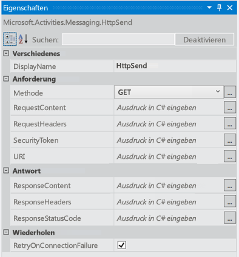
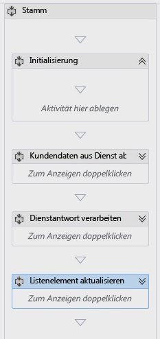
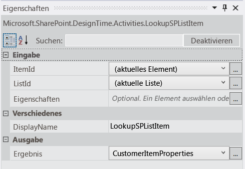
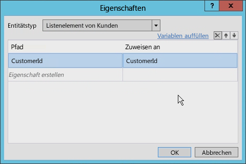
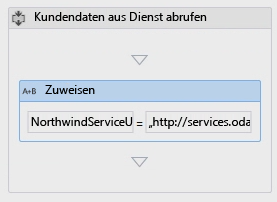
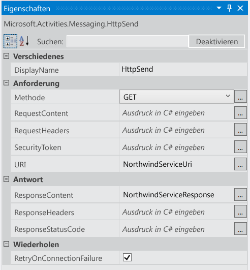
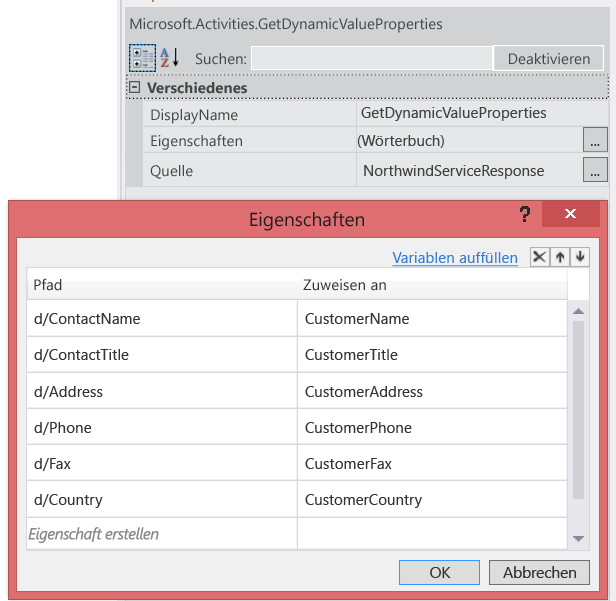
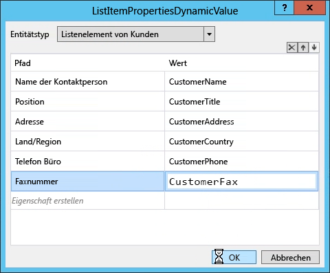
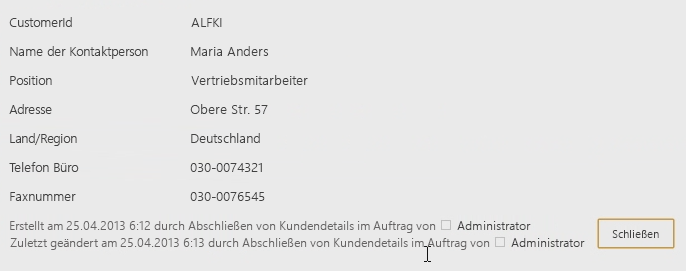

# Arbeiten mit Webdiensten in SharePoint-Workflows mit Visual Studio 2012Working with Web Services in SharePoint Workflows using Visual Studio 2012
In diesem Artikel wird beschrieben, wie Sie Webdienste in Visual Studio 2012-basierten SharePoint-Workflows verwenden können. **Bereitgestellt von:**[Andrew Connell]((http://social.msdn.microsoft.com/profile/andrew%20connell%20%5bmvp%5d/)), [AndrewConnell.com]((http://www.andrewconnell.com))Demonstrates how to use web services in SharePoint workflows using Visual Studio 2012. **Provided by:** [Andrew Connell]((http://social.msdn.microsoft.com/profile/andrew%20connell%20%5bmvp%5d/)),  [AndrewConnell.com]((http://www.andrewconnell.com))
  
> [!NOTE] 
> Dieser Artikel enthält ein durchgängiges Codebeispiel. Sie können es nutzen, um die Informationen im Artikel nachzuvollziehen, oder es als Grundlage für die Erstellung eigener SharePoint-Workflows verwenden.This article is accompanied by an end-to-end code sample that you can use to follow the article, or as a starter for your own SharePoint workflow projects. You can find the downloadable code here: LINK. Herunterladen können Sie den Code in der MSDN Code Gallery unter [Arbeiten mit Webdiensten in SharePoint-Workflows mithilfe von Visual Studio 2012]((http://code.msdn.microsoft.com/Working-with-Web-in-46148199)).You can find the downloadable code in the MSDN Code Gallery, here:  [Working with Web Services in SharePoint Workflows using Visual Studio 2012]((http://code.msdn.microsoft.com/Working-with-Web-in-46148199)). 
  
    
    

  
    
    
In der neuesten SharePoint-Version setzt Microsoft in Bezug auf Workflows auf eine vollkommen andere Strategie als noch in früheren Versionen.Microsoft has taken a very different approach to workflow in SharePoint than in previous versions of SharePoint. Das Workflow-Team hat zusammen mit dem Azure-Team ein neues Produkt entwickelt: Workflow-Manager.The workflow team worked with the Azure team to create a new product called Workflow Manager. Workflow-Manager fungiert als hochverfügbarer und skalierbarer Host für die neueste Version der Windows Workflow Foundation-Laufzeit (Version 4) sowie alle erforderlichen Dienste.Workflow Manager serves the role of hosting the latest version of the Windows Workflow Foundation (version 4) runtime and all the necessary services in a highly available and scalable way. Dabei nutzt das Tool den Microsoft Azure Service Bus, um hohe Leistung und Skalierbarkeit sicherzustellen. Einmal bereitgestellt, bietet es immer denselben Funktionsumfang, ob in einer lokalen Bereitstellung oder in einer Bereitstellung in der Cloud.It takes advantage of Microsoft Azure Service Bus for performance and scalability, and when deployed, it runs the same whether in an on-premises deployment or a deployment in the cloud. Nach der Bereitstellung wird SharePoint an die Workflow-Manager-Farm angebunden und so konfiguriert, dass die gesamte Workflowausführung sowie alle zugehörigen Tasks an die Farm übergeben werden. Eine der wichtigsten Änderungen in der neuen Workflowarchitektur: Alle benutzerdefinierten Workflows in SharePoint sind jetzt vollständig deklarativ, auch Workflows, die in Visual Studio 2012 erstellt wurden.SharePoint is then connected and configured to hand off all workflow execution and related tasks to the Workflow Manager farm.One of the more important changes in the new workflow architecture is that all custom workflows in SharePoint completely declarative, including those built using Visual Studio 2012. In früheren SharePoint-Versionen waren in Visual Studio 2012 erstellte Workflows nicht ausschließlich deklarativ.In previous versions of SharePoint, workflows developed with Visual Studio 2012 were not exclusively declarative. Sie kombinierten stattdessen deklarativen XAML-Code mit einer kompilierten Assembly.Instead, they were a pairing of declarative XAML with a compiled assembly. Die verwaltete Assembly enthielt die Geschäftslogik des Workflows. Als erfahrener SharePoint-Entwickler sind Sie von dieser Neuerung möglicherweise sehr überrascht und fragen sich, wie Sie Ihre benutzerdefinierte Geschäftslogik ohne eine kompilierte Assembly implementieren sollen.The managed assembly contained the workflow's business logic.This might come as a shock to seasoned SharePoint developers who may be asking, "so how do I implement my custom business logic without a compiled assembly?". Microsoft empfiehlt, dass Sie stattdessen einen benutzerdefinierten Webdienst erstellen, idealerweise einen WCF-, OData- oder RESTful-Webdienst, der Daten im JSON (JavaScript Object Notation)-Format zurückgibt. Diesen können Sie mit den neuen Aktivitäten und Objekten aus der neuen Version kombinieren.Microsoft suggests that instead you create a custom web service, ideally a WCF, OData, or RESTful web service that returns data in the JavaScript Object Notation (JSON) format, and to use some of the new activities and objects in this new version. 
## Szenarien für die Verwendung von Webdiensten in SharePoint-WorkflowsScenarios for using web services in SharePoint workflows

Es ist nicht schwierig Szenarios vorstellbar, in dem Sie einen benutzerdefinierten Webdiensten in einem Workflow SharePoint nutzen würden. Entwickler, die erstellten Workflows mit SharePoint 2007 oder SharePoint 2010 sind die Arbeit mit benutzerdefiniertem Code vertraut, da diese Workflows grundsätzlich programmgesteuerten wurden. Es wurden nicht erforderlich, diese Workflows benutzerdefinierten Code hinzufügen, aber dies also durchaus üblich war.It is not difficult to conceive of scenarios where you would leverage a custom web services in a SharePoint workflow. Developers who authored workflows using SharePoint 2007 or SharePoint 2010 are accustomed to working with custom code, since these workflows were inherently programmatic. You were not required to add custom code to these workflows, but doing so was quite common.
  
    
    
Mit SharePoint Workflows als rein deklarative müssen vielen Fällen, in dem Sie benutzerdefinierten Code geschrieben haben, können, nun mit Code aus einer externen Webdienst, der aufgerufen und Identitätsdaten durch den Workflow verarbeitet werden.With SharePoint workflows to being purely declarative, many cases where you may have written custom code must now be handled with code written in an external web service that is called and consumed by the workflow. 
  
    
    
SharePoint Workflows können jede Art von Webdienst nutzen. Dies bedeutet, dass am einfachsten kann für Workflows mit Webdiensten interagieren, die Daten mithilfe der Open Data Protocol ( **OData** ) übergeben, wie in den Formaten **Atom** oder **Json** bereitgestellt. OData ist am besten, da sie vollständig vom SharePoint Workflow authoring-Tools ( SharePoint Designer 2013 und Visual Studio 2012 ) unterstützt wird.SharePoint workflows can consume any sort of web service. That said, it is easiest for workflows to interact with web services that pass data using the Open Data protocol ( **OData** ), as provided in either of the formats **Atom** or **json**. OData is the best approach because it is fully supported by the SharePoint workflow authoring tools (both SharePoint Designer 2013 and Visual Studio 2012).
  
    
    
Darüber hinaus werden sowohl anonyme Webdienste als auch geschützte mit verschiedenen Typen von Authentifizierung unterstützt. Tatsächlich müssen Sie die vollständige Kontrolle über die Anforderung und Antwort für jeden Dienst Anruf behandeln. Folglich beispielsweise können Sie eine Reihe von Aktivitäten innerhalb eines Workflows verwenden, um zuerst authentifizieren einen Dienst verwenden, um ein OAuth-Token abzurufen und fügen Sie dann das Token in zukünftige Anforderungen zu Diensten mit  [OAuth 2.0]((http://oauth.net/2/))gesichert.In addition, both anonymous web services as well as those protected with different types of authentication are supported. In fact, you have full control over the request and response handling for each service call. Thus, for example, you can use a series of activities within a workflow to first authenticate using one service to obtain an OAuth token, and then include that token in future requests to services secured using  [OAuth 2.0]((http://oauth.net/2/)).
  
    
    

## Nutzen von Webdiensten in workflowsLeveraging web services in workflows

Arbeiten mit Webdiensten SharePoint Workflows umfasst zwei Phasen. Die erste ist einfach den Webdienst aufrufen mithilfe einer neuen **HttpSend** Aktivitätsfeeds eingeführt mit SharePoint möchten. Rufen Sie in die einfachste Webdienste oder für komplexere Aufgaben, bietet HTTP-Verben und bietet bestimmte HTTP-Header **HttpSend** können. Abbildung 1 zeigt viele der Eigenschaften, die für die Aktivität **HttpSend** verfügbar sind.Working with web services in SharePoint workflows involves two stages. The first is simply calling the web service, which you do by using a new **HttpSend** activity introduced with SharePoint. **HttpSend** lets you call into the simplest web services or, for more complex tasks, provides HTTP verbs and provides specific HTTP headers. Figure 1 shows many of the properties that are available on the **HttpSend** activity.
  
    
    

**Abbildung 1. Eigenschaftenfenster für die Aktivität HttpSend****Figure 1. Properties Tool Window for the HttpSend Activity**

  
    
    

  
    
    

  
    
    
Sie müssen auch den Methodentyp angeben, in der Service-Anforderung verwendet werden soll. Beachten Sie in Abbildung 1, die in der **fordern** Sie blockieren kann die Methode (in diesem Fall **GET**) angeben. Verfügbaren Optionen umfassen **GET**, **PUT**, **POST**und **DELETE** (obwohl anderen vorhanden sind). Dies ist die primäre Methode anzuweisen, Webdienste, insbesondere Rest-Dienste, was zu tun ist für die Ressource in der URI der Aktivität definiert.You must also specify the method type you wish to use in the service request. Notice in Figure 1 that in the **Request** block you can specify the method type (in this case, **GET**). Available options include **GET**, **PUT**, **POST**, and **DELETE** (although there are others). This is the primary way to tell web services, specifically RESTful services, what to do on the resource defined in the URI of the activity.
  
    
    
Beispielsweise, um alle Eigenschaften eines bestimmten Elements erhalten möchten, würde der **Uri** eindeutige Adresse des Elements enthalten, und die Methode auf **GET**fest. Um das Element zu löschen, bleiben die **Uri** würde dieselbe eindeutige-Adresse des Elements, aber die Methode würde auf **DELETE**festgelegt werden. Dies gilt auch für das Aktualisieren eines Elements mit Ausnahme die-Methode würde **POST**festgelegt werden. Bei der Erstellung eines Elements, würde der **Uri** zeigen Sie auf die eindeutige Adresse der Auflistung, in dem das Element erstellt werden soll, und die Methode auf **POST**fest. Beim Erstellen oder Aktualisieren von Elementen, Dienste die Daten erfordern zu verwenden, was als Inhalt in der Anforderung übergeben wird, mit der **RequestContent** -Eigenschaft für die Aktivität **HttpSend** angegeben.For instance, to get all the properties of a specific item, the **Uri** would contain the unique address of the item, and the method would be set to **GET**. To delete the item, the **Uri** would remain the same unique address of the item but the method would be set to **DELETE**. The same is true for updating an item except the method would be set to **POST**. In creating an item, the **Uri** would point to the unique address of the collection where the item is to be created, and the method would be set to **POST**. When creating or updating items, services require the data to use what is passed along as content in the request, indicated using the **RequestContent** property on the **HttpSend** activity.
  
    
    
Die zweite Phase der Verwendung von Webdiensten, den wir möchten abdecken umfasst das Senden oder Empfangen von Daten von einem Webdienst. Unabhängig davon, ob Sie die **RequestContent** oder **ResponseContent** -Eigenschaften für die Aktivität **HttpSend** verwenden), können Sie übergeben die Daten als eine komplexe Struktur, die als JavaScript Object Notation (JSON) Zeichenfolgen formatiert sind. Die gute Nachricht ist Ihnen keine erstellen und diese Zeichenfolgen Json manuell bearbeiten. Microsoft bietet Ihnen stattdessen einen neuen Objekttyp [DynamicValue](http://msdn.microsoft.com/en-us/library/windowsazure/jj193446%28v=azure.10%29.aspx), die Ihre Aufgabe erheblich erleichtert.The second stage of working with web services that we're going to cover involves submitting or receiving data from a web service. Regardless of whether you use the **RequestContent** or **ResponseContent** properties on the **HttpSend** activity) you can pass the data as a complex structure, which are formatted as JavaScript Object Notation (JSON) strings. The good news is, you don't have to create and manipulate these json strings manually. Instead, Microsoft gives you a new object type, the [DynamicValue](http://msdn.microsoft.com/en-us/library/windowsazure/jj193446%28v=azure.10%29.aspx), that makes your task much easier. 
  
    
    
 **DynamicValue** -Objekte können hierarchische Datenspeicher sowie speichern die Antwort von einem Webdienst aufzurufen. Es ist außerdem eine Reihe von Aktivitäten im Zusammenhang mit **DynamicValue** -Objekten, die Sie verwenden können, um die Anzahl der Elemente in der Antwort, Extrahieren von Werten aus der Antwort oder Erstellen einer neuen Struktur für aktualisieren oder Erstellen von Elementen.**DynamicValue** objects can store hierarchal data as well as store the response of a web service call. Furthermore, there is a series of activities associated with **DynamicValue** objects that you can use to count the number of items in the response, extract values from the response, or build up a new structure for updating or creating items.
  
    
    

## Erstellen von Webdiensten für SharePoint-WorkflowsCreating web services for SharePoint workflows

Mit der Unterstützung für das Aufrufen von Webdiensten und mangelnde Unterstützung von benutzerdefiniertem Code innerhalb von Workflows müssen Entwickler nun wissen, wie Sie Dienste erstellen. Es gibt viele Optionen zum Erstellen von benutzerdefinierten Webdiensten für die Verwendung in SharePoint Workflows. Die **HttpSend** Aktivität und Datentyp **DynamicValue** sind am besten für Rest-Dienste und mit denen das OData-Protokoll entsprechen.With the support for calling web services and the lack of supporting custom code within workflows, developers will now need to know how to create services. There are plenty of options for creating custom web services for use in SharePoint workflows. The **HttpSend** activity and **DynamicValue** data type are best suited for RESTful services and those that conform to the OData Protocol.
  
    
    
OData ist ein Protokoll für das Erstellen und Verarbeiten von Daten basierend auf den Prinzipien von REST-Dienste. Es wurde in einführen, um den Austausch von Daten unter Verwendung des HTTP-Protokolls ausgereiften, zuverlässige und robuste standardisieren entwickelt. Nach die OData-Spezifikation abgeschlossen werden konnte, implementiert verschiedene Organisationen das Protokoll auf ihren eigenen Stapeln Technologie. Microsoft implementiert eine eigene Version der OData und Branding-es  [Windows Communication Foundation (WCF) Data Services 5.0](http://msdn.microsoft.com/en-us/library/hh487257%28v=vs.103%29.aspx).OData is a protocol for creating and consuming data based on the principles of REST services. It was developed in an effort to standardize exchanging data using the mature, reliable, and robust HTTP protocol. Once the OData specification was complete, different organizations implemented the protocol on their own technology stacks. Microsoft implemented its own version of OData and branded it  [Windows Communication Foundation (WCF) Data Services 5.0](http://msdn.microsoft.com/en-us/library/hh487257%28v=vs.103%29.aspx).
  
    
    
Die Rest-Dienste durch SharePoint implementiert unterstützen tatsächlich OData, da sie mithilfe von WCF Data Services insbesondere WCF Data Services 5.0, das die 3.0 OData-Spezifikation implementiert erstellt wurden.The RESTful services implemented by SharePoint actually support OData because they were built using WCF Data Services, specifically WCF Data Services 5.0, which implements the OData 3.0 specification.
  
    
    

### Implementieren von OData-Dienst CRUD-Q-VorgängeImplement OData Service CRUD-Q operations

Häufig verwendet für Webdienste führt einfache erstellen, lesen, aktualisieren, löschen und Abfragen Vorgänge auf Daten in einer Datenbank (CRUD-F). Erstellen einen OData-Dienst für die Verwendung mit einem Workflow SharePoint ist ganz einfach mithilfe von WCF. Unter der Voraussetzung, dass Sie eine vorhandene Datenbank verfügen, es sind vier kurze Schritte, die eine sehr geringe Codierung erforderlich:A common use for web services is performing simple create, read, update, delete, and query (CRUD-Q) operations on data within a database. Creating an OData service for use with a SharePoint workflow is quite simple using WCF. Assuming you have an existing database there are four short steps that require very little coding:
  
    
    

1. Ein Modell von der Datenbank mithilfe der  [Entity Framework](http://msdn.microsoft.com/en-us/library/bb399567%28v=vs.110%29.aspx)zu erstellen. Es ist kein Code erforderlich (Visual Studio, bietet einen Assistenten).Create a model of your database using the  [Entity Framework](http://msdn.microsoft.com/en-us/library/bb399567%28v=vs.110%29.aspx). There is no code required (Visual Studio, provides a wizard).
    
  
2. Erstellen einer neuen WCF Data Service. Es ist kein Code erforderlich (Visual Studio bietet einen Assistenten).Create a new WCF data service. There is no code required (Visual Studio provides a wizard).
    
  
3. Festlegen Sie in der Codedatei Service des Namens des das Entitätsmodell (erstellte in Schritt 1 #) auf die Quelle des Diensts, und klicken Sie dann festlegen Sie den Zugriff und die Berechtigung für die Entitäten im Modell. Beide Schritte benötigen weniger als zwei Codezeilen.In the service code file, set the name of the entity model (created in step #1) to the source of the service, then set the accessibility and permission for the entities in the model. Both steps require as little as two lines of code.
    
  
4. Veröffentlichen Sie den Dienst an einem Speicherort, auf den Workflow-Manager zugreifen kann.Publish the service to a location that Workflow Manager can access.
    
  

### Implementieren von OData-Dienst-VorgängeImplement OData service operations

Sie mithilfe von Webdiensten ausführen möchten einer anderen Aufgabe wird Geschäftslogik, die nicht angepasst werden kann in das Modell CRUDQ ausgeführt. Beispiel: haben Sie einen OData-Dienst, der CRUD-Q-Vorgänge für das Erstellen von neuen Bankdarlehen unterstützt. Nehmen Sie an, dass dieser Dienst unterstützt auch die Consumer Aufrufen des Diensts und Bereitstellen einer Credit Score zum Abrufen einer aktuellen Zinssatz für einen künftigen Kredit. Diese Art von Aufgabe fällt nicht in das Modell CRUDQ inzwischen Ruft eine Methode auf und übergibt in eine ganze Zahl und eine Antwort erhalten.Another task you'll want to accomplish using web services is running business logic that may not fit into the CRUDQ model. For example, consider an OData service that supports CRUD-Q operations for creating new bank loans. Suppose this service also supports consumers calling the service and providing a credit score to retrieve a current interest rate for a prospective loan. This type of task does not fall into the CRUDQ model, since it calls a method and passes in an integer to receive a response.
  
    
    
OData und WCF-Datendienste unterstützen dieses Szenario, indem mit  [Dienstvorgänge](http://msdn.microsoft.com/en-us/library/cc668788%28v=vs.110%29.aspx)bereitgestellt. Dienstvorgänge sind allgemeine und sogar dienen innerhalb der SharePoint-Dienste, beispielsweise beim Abrufen einer bestimmten Liste mit der Adresse  `http://[..]/_api/web/lists/GetByTitle('ListTitle')`. Die **GetByTitle** -Methode ist ein Service-Operator, der das Team SharePoint erstellt. Entwickler Erstellen ihrer eigenen benutzerdefinierten Dienstvorgänge in benutzerdefinierten Webdiensten, die mithilfe von WCF Data Services erstellt.OData and WCF data services support this scenario by providing you with  [service operations](http://msdn.microsoft.com/en-us/library/cc668788%28v=vs.110%29.aspx). Service operations are common and are even used within SharePoint services, for instance, when retrieving a specific list using the address  `http://[..]/_api/web/lists/GetByTitle('ListTitle')`. The **GetByTitle** method is a service operator the SharePoint team created. Developers create their own custom service operations in custom web services created using WCF Data Services.
  
    
    

## Exemplarische Vorgehensweise: Erstellen eines Workflows mit Visual Studio 2012Walkthrough: Create a workflow with Visual Studio 2012

Die folgende exemplarische Vorgehensweise veranschaulicht, wie zum Erstellen eines benutzerdefinierten Workflows, das in der Northwind-Datenbank einen OData-Webdienst aufruft. Sie können die Nordwind-Datenbank gehostet unter  [OData.org]((http://www.odata.org))suchen.The following walkthrough demonstrates how to create a custom workflow that calls an OData web service on the Northwind database. You can find the Northwind database hosted at  [OData.org]((http://www.odata.org)). 
  
    
    
Wenn der Workflow abgeschlossen ist, Benutzer eine Kunden-ID eingeben und dann den Workflow starten. Beim Starten der Workflow zusätzliche Kundeninformationen abgerufen und aktualisiert das Listenelement mit die abgerufene Daten.When the workflow is completed, users will enter a customer ID, then start the workflow. When started, the workflow retrieves additional customer information and updates the list item with the data it has retrieved.
  
    
    

1. Starten Sie Visual Studio 2012, und erstellen Sie ein neues SharePoint gehosteten app-Projekt.Start Visual Studio 2012 and create a new SharePoint-hosted app project.
    
  
2. Erstellen Sie in diesem Projekt eine neue benutzerdefinierte Liste, und nennen Sie sie "Kunden".In this project, create a new custom list and name it "Customers".
    
  
3. Erstellen Sie in dieser Liste neue die folgenden Felder aus. Lassen Sie den Standarddatentyp für jedes Feld als **string**:In this new list, create the following fields. Leave the default data type for each field as **string**:
    
  - CustomerId (aus dem Feld Standard "Titel" umbenannt)CustomerId (renamed from the default "Title" field)
    
  
  - Name des KundenCustomer Name
    
  
  - PositionJob Title
    
  
  - AdresseAddress
    
  
  - Land/RegionCountry/Region
    
  
  - Telefon BüroBusiness Phone
    
  
  - FaxnummerFax Number
    
  
4. Nun, Hinzufügen eines Workflows auf das Projekt, indem Sie auf klicken Sie im **Projektmappen-Explorer** auf **Hinzufügen** > **Neues Element**; Wählen Sie dann im Dialogfeld **Neues Element hinzufügen** das Projektelement **Workflow** aus der Kategorie **Office/SharePoint**.Now, add a workflow to the project by clicking in **Solution Explorer** on **Add** > **New Item**; then, in the **Add New Item** dialog box, select the **Workflow** project item from the **Office/SharePoint** category.
    
  
5. Nennen Sie den Workflow "CompleteCustomerDetails", und klicken Sie auf **Weiter**.Name the workflow "CompleteCustomerDetails" and click **Next**.
    
  
6. Bei Aufforderung durch den **Assistenten zum Anpassen von** nennen Sie den Workflow "Vollständige Kundendetails", und legen sie **einen Listenworkflow** sein. Klicken Sie auf **Weiter**.When prompted by the **Customization wizard**, name the workflow "Complete Customer Details" and set it to be a **List** workflow. Cick **Next**.
    
  
7. Klicken Sie auf der nächsten Seite des Assistenten das Kontrollkästchen Sie, um eine Zuordnung zu erstellen, wählen Sie aus der Liste **Customer** wählen und dann **Neu erstellen** für den Workflow-Listen Verlauf und Aufgabe. Klicken Sie auf **Weiter**.On the next wizard page, check the box to create an association, select the **Customer** list, then select **Create New** for the workflow history and task lists. Click **Next**.
    
  
8. Klicken Sie auf der letzten Seite des Assistenten Kontrollkästchen Sie, um den Workflow manuell starten; Lassen Sie die Option für den automatischen start **aufheben** -überprüft. Klicken Sie auf **Fertig stellen**.On the final wizard page, check the box to start the workflow manually; leave the option to start automatically **un** -checked. Click **Finish**.
    
  
9. Zu diesem Zeitpunkt zeigt Visual Studio die Designeroberfläche Workflow, die eine einzelne **Sequence** Aktivität enthält.At this point, Visual Studio displays the workflow designer surface that contains a single **Sequence** activity.
    
  
10. Ändern des Namens der **Sequence**-Aktivität in **Stamm**.Change the name of the **Sequence** activity to **Root**.
    
  
11. Fügen Sie vier weitere **Sequence** Aktivitäten innerhalb der Stamm-Aktivität hinzu, und nennen Sie sie wie folgt:Add four more **Sequence** activities inside the Root activity and name them as follows:
    
  - InitialisierungInit
    
  
  - Abrufen von Kundendaten aus ServiceGet Customer Data From Service
    
  
  - Process WebdienstantwortProcess Service Response
    
  
  - Listenelement aktualisierenUpdate List Item
  
    
    

    
  
12. Zu diesem Zeitpunkt wird der Workflow angezeigt, wie in Abbildung 2 dargestellt.At this point, the workflow will appear as shown in Figure 2.
    
   **Abbildung 2. Vollständige Kunden Details Workflow mit vier leere Sequences****Figure 2. Complete Customer Details Workflow with Four Empty Sequences**

  

  
  

  

  

### Rufen Sie die Kunden-ID, die vom Benutzer eingegebeneGet the customer ID entered by the user

Ausführen der Workflow muss zunächst wird die Kunden-ID abrufen vom Benutzer eingegeben wurde. Zu diesem Zweck müssen Sie zwei Variable zu erstellen.The first thing the workflow needs to do is retrieve the customer ID, as entered by the user. To do this, you need to create two variable.
  
    
    

1. Klicken Sie auf der Registerkarte **Variablen** im unteren Teil der Workflow-Designer, und erstellen Sie zwei VariablenClick the **Variables** tab at near the bottom of the workflow designer and create two variables
    
  - **CustomerItemProperties** (Datentyp = **DynamicValue**; Bereich = **Init**). Verwenden Sie diese Variable zum Speichern des Resultsets von der Aktivität, die alle Eigenschaften aus dem Listenelement abruft.**CustomerItemProperties** (data type = **DynamicValue**; scope = **Init**). Use this variable to store the result set returned by the activity that gets all properties from the list item.
    
    > [!NOTE] 
    > Der Datentyp **DynamicValue** wird nicht standardmäßig angezeigt.Note: The **DynamicValue** data type is not shown by default. Sie finden ihn über die Option **Nach Typen suchen** in der Spalte **Variablentyp**.To find it, select the **Browse for Types** option in the **Variable Type** column. Geben Sie in das Suchfeld oben im Dialogfeld **DynamicValue** ein, und klicken Sie dann auf **Microsoft.Activities.DynamicValue**.In the search box at the top of the dialog, enter **DynamicValue**, and then select the **Microsoft.Activities.DynamicValue**. 

  - **CustomerId** (Datentyp = **String**, Bereich = **Root**): In dieser Variable wird die vom Benutzer eingegebene Kunden-ID gespeichert.**CustomerId** (data type = **String**; scope = **Root**): Use this variable to store the customer ID entered by the user.
    
  
2. Suchen Sie die **LookupSpListItem**-Aktivität im Abschnitt **SP - Liste** der Toolbox, und ziehen Sie es an die **Init**-Sequenz. Legen Sie die Aktivitätseigenschaften, wie in Abbildung 3 dargestellt.Locate the **LookupSpListItem** activity in the **SP - List** section of the toolbox and drag it to the **Init** sequence. Set the activity properties as shown in Figure 3.
    
   **Abbildung 3. Eigenschaftenfenster für die Aktivität LookupSPListItem****Figure 3. Properties Tool Window for the LookupSPListItem Activity**

  

  
  

    Diese Aktivität weist Workflow-Manager der SharePoint-REST-API verwenden, um die Eigenschaften des aktuellen Listenelements abzurufen und die **JSON** -Antwort in der Variablen **DynamicValue** zu speichern, die Sie gerade erstellt haben.This activity tells Workflow Manager to use the SharePoint REST API to retrieve the properties of the current list item and to store the **JSON** response in the **DynamicValue** variable that you just created.
    
  
3. Rufen Sie die Kunden-ID aus dem Listenelement, indem Sie auf den Link Eigenschaften erhalten möchten , in der **LookupSpListItem**-Aktivität. Auf diese Weise fügt eine **GetDynamicValueProperties**-Aktivität auf die Entwurfsoberfläche.Retrieve the customer ID from the list item by clicking the Get Properties link in the **LookupSpListItem** activity. Doing this adds a **GetDynamicValueProperties** activity to the design surface.
    
  
4. Klicken Sie im Dialogfeld **Eigenschaften** auf das Auslassungssymbol (**???**), um die Eigenschaftenauswahl zu öffnen (Abbildung 4).In the **Properties** dialog box, click the ellipsis ( **???**) to open the Property selector, shown in Figure 4. Wählen Sie im Assistenten für **Entitätstyp** die Option **List Item of Customers** aus. Fügen Sie dann wie in der Abbildung unten gezeigt eine einzige Eigenschaft hinzu (CustomerId), mit „CustomerId“ unter „Pfad“ und „CustomerId“ unter „Assign To“ („CustomerId“ ist die zuvor erstellte Variable). In the wizard, set the **Entity Type** to **List Item of Customers**, then add a single property, CustomerId, with the Path set to CustomerId and Assign To set to CustomerId (the variable previously created), as shown in the following figure.
    
  
5. Klicken Sie auf **Eigenschaft erstellen**, und geben Sie **CustomerId** in die Spalte **Pfad** ein.Click **Create Property** and enter **CustomerId** in the **Path** column.
    
  
6. Geben Sie in der Spalte **Zuordnen zu** **CustomerId**, ist die Variable, die wir zuvor erstellt haben. Abbildung 4 zeigt das Dialogfeld abgeschlossene **Eigenschaften**.In the **Assign To** column, enter **CustomerId**, which is the variable we created earlier. Figure 4 shows the completed **Properties** dialog box.
    
   **Abbildung 4. Dialogfeld "Eigenschaften" für die GetDynamicValueProperties-Aktivität.****Figure 4. Properties dialog for the GetDynamicValueProperties Activity.**

  

  
  

  

  

### Rufen Sie den Northwind-OData-WebdienstCall the Northwind OData web service

Der Workflow hat jetzt einen Verweis auf die Kunden-ID, sodass im nächste Schritt wird den Webdienst aufzurufen. Zu diesem Zweck arbeiten wir in erster Linie mit der Sequenz **Kundendaten vom Dienst abrufen**.The workflow now has a reference to the customer ID, so the next step is to call the web service. To do this, we'll be working primarily with the **Get Customer Data from Service** sequence.
  
    
    

1. Wählen Sie die Sequenz **Kundendaten vom Dienst erhalten möchten**, und erstellen Sie zwei neue Variablen:Select the **Get Customer Data from Service** sequence and create two new variables:
    
  - **NorthwindServiceUri** (Datentyp = **String**; Bereich = **Customer Daten vom Dienst abrufen** ). Diese Variable speichert den URI, der verwendet wird, um den Webdienst abzufragen.**NorthwindServiceUri** (data type = **String**; scope = **Get Customer Data from Service**). This variable stores the URI that is used to query the web service.
    
  
  - **NorthwindServiceResponse** (Datentyp = **DynamicValue**; Bereich = **Root**): Diese Variable wird die Webdienstantwort speichern.**NorthwindServiceResponse** (data type = **DynamicValue**; scope = **Root**): This variable will store the web service response.
    
  
2. Um die URL, um den Webdienst Abfragen zu erstellen, starten Sie, indem Sie suchen nach einer Aktivität **zuweisen** in der Workflowtoolbox, und ziehen Sie es der Sequenz **Kundendaten vom Dienst abrufen**. Beachten Sie, dass die Aktivität **weisen** zwei Teilen, die ein Name / Wert-Paar darstellt.To create the URL to query the web service, start by locating an **Assign** activity in the workflow toolbox and drag it to the **Get Customer Data from Service** sequence. Notice that the **Assign** activity has two parts representing a name-value pair.
    
  
3. Den linken Teil der Aktivität **weisen** auf **NorthwindServiceUri** festgelegt.Set the left portion of the **Assign** activity to **NorthwindServiceUri**.
    
  
4. Legen Sie den rechten Teil der Aktivität auf die Zeichenfolge  `"http://services.odata.org/Northwind/Northwind.svc/Customers('" + CustomerId + "')?$format=json"`. Abbildung 5 zeigt die abgeschlossene Aktivität.Set the right portion of the activity to the string  `"http://services.odata.org/Northwind/Northwind.svc/Customers('" + CustomerId + "')?$format=json"`. Figure 5 shows the completed activity.
    
   **Abbildung 5. Zuweisen von Aktivität zum Festlegen einer Variablen mit dem OData-Dienst verwendet****Figure 5. Assign Activity Used to Set a Variable Containing the OData Service**

  

  
  

  

  
5. Ziehen Sie eine **HttpSend** -Aktivität aus der Toolbox zur Sequenz **Kundendaten vom Dienst erhalten möchten**, unmittelbar auf die Aktivität **zuweisen**.Drag an **HttpSend** activity from the toolbox to the **Get Customer Data from Service** sequence, immediately following the **Assign** activity.
    
  
6. Legen Sie die Eigenschaften für die **HttpSend**-Aktivität unter Verwendung der Werte, die in Abbildung 6 dargestellt.Set the properties on the **HttpSend** activity using the values shown in Figure 6.
    
   **Abbildung 6: HttpSend-Eigenschaften****Figure 6. HttpSend Properties**

  

  
  

  

  

### Verarbeiten der Northwind OData WebdienstantwortProcess the Northwind OData web service response

Nachdem die Web-Service-Anforderung wurde und die Ergebnisse in einer lokalen Variablen gespeichert sind, besteht der nächste Schritt Verarbeitung die Antwort. Jeder Wert in der Antwort muss auf eine andere Variable hinzugefügt werden.Once the web service request has been made and the results are stored in a local variable, the next step is to process the response. Each value in the response needs to be added to a different variable. 
  
    
    

1. Erstellen Sie eine Variable für die einzelnen Felder, die wir am Anfang dieser exemplarischen Vorgehensweise (mit Ausnahme von Kundenfeld-ID) hier gezeigte erstellt:Create a variable for each of the fields that we created at the start of this walkthrough (except the customer ID field), shown here:
    
  - Name des KundenCustomer Name
    
  
  - PositionJob Title
    
  
  - AdresseAddress
    
  
  - Land/RegionCountry/Region
    
  
  - Telefon BüroBusiness Phone
    
  
  - FaxnummerFax Number
    
  
2. Nennen Sie diese Variablen entsprechend der jeweiligen Feldname.Name each of these variables according to its respective field name.
    
  
3. Alle Variablen sollte vom Typ **String**sein; **Root**sollten alle Variablen zugewiesen werden.All of the variables should be of type **String**; all of the variables should be scoped to **Root**.
    
  
4. Fügen Sie eine **GetDynamicValueProperties** -Aktivität, der Sequenz **Prozess Service-Anforderung**.Add a **GetDynamicValueProperties** activity to the **Process Service Request** sequence.
    
  
5. Legen Sie im Fenster **Eigenschaften** für **Source** den Wert **NorthwindServiceRepsonse** fest (siehe Abbildung 7).In the **Properties** window, set the **Source** value to **NorthwindServiceResponse**, as shown in Figure 7.
    
  
6. Klicken Sie auf die Schaltfläche mit den Auslassungszeichen (**??? **) neben der Eigenschaft **Properties**, und geben Sie Werte in die Spalten **Pfad** und **Assign To** ein (siehe Abbildung 7).Click the ellipsis button ( **???**) button on the **Properties** property and then provide values in the **Path** and **Assign To** columns as shown in Figure 7. Die Werte in der Spalte **Assign To** entsprechen den Variablen, die Sie für die verschiedenen Listenfelder in der Liste **Customers** erstellt haben.Notice that the values in the **Assign To** column are the variable you created for each of the **Customers** list fields.
    
   **Abbildung 7: Toolfenster „Eigenschaften“ für „GetDynamicValueProperties“ und Inhalte des Dialogfensters „Eigenschaften“****Figure 7. Properties tool window for GetDynamicValueProperties and contents for Properties dialog**

  

  
  

  

  

### Das Kunden Listenelement aktualisierenUpdate the customer list item

Der letzte Schritt besteht darin, das Listenelement aktualisieren.The last step is to update the list item. 
  
    
    

1. Die Abfolge **Listenelement aktualisieren** einer **UpdateListItem** -Aktivität hinzu, und verwenden Sie das Fenster **Eigenschaften** die folgenden Werte festgelegt:Add an **UpdateListItem** activity to the **Update List Item** sequence and use the **Properties** window to set the following values:
    
  - **ListID:** (aktuelle Liste)**ListId**: (current list)
    
  
  - **ItemId:** (aktuelles Element)**ItemId**: (current item)
    
  
2. Klicken Sie auf die Schaltfläche mit den Auslassungszeichen (**??? **) neben der Eigenschaft **ListItemPropertiesDynamicValues**. Ein Dialogfeld wird geöffnet. Wählen Sie hier für **Entitätstyp** die Option **List Item of Customers** aus.Click the ellipsis button ( **???**) button on the **ListItemPropertiesDynamicValues** property and in the resulting dialog box, set **Entity Type** to **List Item of Customers**. 
    
  
3. Schließlich für jede der Werte aus dem Webdienst extrahiert haben, legen Sie die Werte für das Listenelement an den Variablen im Workflow, wie in Abbildung 8 dargestellt.Finally, for each of the values extracted from the web service, set the values on the list item to the variables in the workflow, as shown in Figure 8.
    
   **Abbildung 8. Dialogfeld mit festgelegten Werten ListItemPropertiesDynamicValue****Figure 8. ListItemPropertiesDynamicValue Dialog with Values Set**

  

  
  

  

  

### Testen des WorkflowsTest the workflow

Der Workflow ist nun abgeschlossen und sollte ordnungsgemäß funktionieren. Um die Stabilität zu bestätigen, sollten Sie sie testen.The workflow is now complete and should function properly. To confirm its stability, you should test it.
  
    
    

1. Drücken Sie **F5**, um das Debuggen zu starten. Visual Studio wird erstellt und die SharePoint-hosted app.Press **F5** to start debugging; Visual Studio builds and deploys the SharePoint-hosted app.
    
  
2. Wenn im Browser geöffnet wird, navigieren Sie zu der Liste der **Kunden**, erstellen Sie einen einzelnen Kunden-Datensatz mit einer **Kunden-Id** "ALFKI", wie in Abbildung 9 dargestellt, und speichern Sie das Element.When the browser opens, navigate to the **Customers** list, create a single customer record with a **Customer Id** of "ALFKI", as shown in Figure 9, and then save the item.
    
   **Abbildung 9: Neues Listenelement****Figure 9. New List Item**

  

  
  

  

  
3. Im nächsten Schritt den Workflow manuell starten, und klicken Sie dann auf das Listenelement zurück. Aktualisieren Sie die Seite, um den Workflow, der das Listenelement aktualisieren finden Sie unter wie in Abbildung 10 dargestellt.Next, manually start the workflow and then go back to the list item. Keep refreshing the page to see the workflow update the list item, as shown in Figure 10
    
   **Abbildung 10: Aktualisiertes Listenelement****Figure 10. Updated List Item**

  

  
  

    Beachten Sie, dass das Listenelement, durch den SharePoint aktualisiert wurde gehosteten app im Namen der Person, die den Workflow gestartet hat. In dieser exemplarischen Vorgehensweise wurde jedoch vom Administrator auslösen.Notice that the list item was updated by the SharePoint hosted app on behalf of the person who started the workflow. In this walkthrough, however, it was started by the administrator.
    
  

## SchlussbemerkungConclusion

SharePoint eingeführt, eine neue Workflowarchitektur, die durch ein neues Produkt vereinfacht: Workflow-Manager 1.0. Um sicherzustellen, dass alle benutzerdefinierten Workflows unabhängig von der SharePoint Bereitstellungsoption lokale oder gehostete in Office 365, woher sind alle Workflows jetzt 100 % deklarativen. Aus diesem Grund benutzerdefinierte Geschäftslogik, die zuvor als benutzerdefinierten Code in Visual Studio erstellten Workflows in früheren Versionen von SharePoint implementiert werden nicht mehr unterstützt.SharePoint introduced a new workflow architecture facilitated by a new product: Workflow Manager 1.0. To ensure that all custom workflows worked regardless of the SharePoint deployment choice, either on-premises or hosted in Office 365, all workflows are now 100-percent declarative. Therefore, custom business logic previously implemented as custom code in Visual Studio-authored workflows in previous versions of SharePoint are no longer supported. 
  
    
    
 Unterstützung für das Aufrufen von Webdiensten in Workflow-Manager mithilfe der neuen **HttpSend** -Aktivität, Microsoft eingeführt. Workflow-Manager eingeführt auch Unterstützung für das Erstellen von Strukturen, an die Webdienste gesendet sowie zum Verarbeiten von deren Antworten, die den Datentyp **DynamicValue** aufgerufen. Beim Erstellen von Workflows, verwenden Sie diese Datentyp und zugehörige Aktionen in zu vereinfachen, erstellen und nutzen robuste Geschäftsprozesse in SharePoint Workflows mithilfe von externen Webdiensten.Microsoft introduced support for calling web services in Workflow Manager using the new **HttpSend** activity. Workflow Manager also introduced support for creating structures to submit to web services as well as consuming their responses called the **DynamicValue** data type. When creating workflows, use this data type and associated actions to facilitate creating and leveraging robust business processes in SharePoint workflows by using external web services.
  
    
    

## Siehe auchSee also

-  
  [Arbeiten mit komplexen Daten in einem workflow](http://msdn.microsoft.com/en-us/library/windowsazure/jj193446%28v=azure.10%29.aspx)[Working with complex data in a workflow](http://msdn.microsoft.com/en-us/library/windowsazure/jj193446%28v=azure.10%29.aspx)
    
  
-  [Workflows in SharePoint]((http://msdn.microsoft.com/de-DE/library/jj163986.aspx))[Workflows in SharePoint]((http://msdn.microsoft.com/de-DE/library/jj163986.aspx))
    
  

