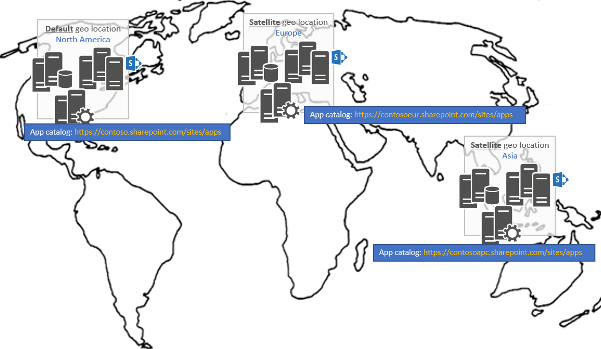

# Verwalten von apps in einem SharePoint Multi-Geo-MandantenManaging apps in a SharePoint Multi-Geo tenant

> **Wichtig:** OneDrive und SharePoint Online Multi-Geo ist derzeit in der Vorschau und kann geändert.**Important:** OneDrive and SharePoint Online Multi-Geo is currently in preview and is subject to change.

In einem Mandanten Multi-Geo müssen Sie einen app-Katalog pro Geo Speicherort ist etwas Konto teilnehmen, wenn Sie Ihre apps an allen geografisch Standorten bereitstellen möchten.In a Multi-Geo tenant, you'll have an app catalog per geo location which is something to take in account if you want to deploy your apps across all geo locations.

## Wobei benötige ich meine apps in einer Serverfarm mit mehreren geografisch Mandanten bereitstellen?Where do I need to deploy my apps in a Multi-Geo tenant?
Vor dem Bereitstellen von apps wir sprechen zunächst definiert mit apps in diesem Artikel: alle apps, die Sie bereitstellen, indem sie in Ihrem Mandanten app-Katalog hinzufügen werden im Rahmen dieses Handbuchs damit, die SharePoint Add-In (in diesem Fall App-Dateien) enthält, sondern auch Apps für SharePoint-Framework und Extensions (.sppkg-Dateien).Before talking about deploying apps let's first define what's meant with apps in this article: all apps that you deploy by first adding them to your tenant app catalog are in scope of this guidance, so that includes SharePoint Add-In's (so .app files) but also SharePoint Framework Apps and Extensions (the .sppkg files). In einer Serverfarm mit mehreren geografisch Mandanten müssen Sie eine app-Katalogwebsite pro Geo Speicherort wie unten:In a Multi-Geo tenant you'll have one app catalog site per geo location as show below:

Eine Folge dieser Architektur ist, müssen Sie Ihre app in **allen** app-Kataloge bereitstellen, wenn Sie möchten Ihre app für alle Websites, unabhängig vom Standort Geo verfügbar sein soll, die in die Website gehostet wird.A consequence of this architecture is that you'll need to deploy your app in **all** app catalogs if you want your app to be available for all sites, regardless of the geo location the site is hosted in. Beachten Sie dies Ihnen 2 zur Verfügung stehen:To realize this you have 2 options:
- Bereitstellen von Ihrer app manuell in den einzelnen Websites der app-KatalogDeploy your app manually in each of the app catalog sites
- Verwenden Sie die ALM-API zum Automatisieren der bereitstellungs Ihrer Apps: Sie können diese API verwenden, die konsistent bereitgestellt und Ihre apps an allen Speicherorten die Geo Ihres Mandanten Multi-Geo Upgrades Code schreiben.Use the ALM API's to automate the deployment of your apps: using these API's you can write code that consistently deploys/upgrades your apps in all the geo locations of your Multi-Geo tenant.

## Siehe auchSee also

- [SharePoint-Apps ALM-APISharePoint Apps ALM API's]()
- [Bereitstellen und Installieren von SharePoint-Add-Ins: Methoden und OptionenDeploying and installing SharePoint Add-ins: methods and options](https://docs.microsoft.com/en-us/sharepoint/dev/sp-add-ins/deploying-and-installing-sharepoint-add-ins-methods-and-options)
- [Mithilfe der clientseitigen hostingwebparts aus Office 365 CDNHosting client-side web part from Office 365 CDN](https://docs.microsoft.com/en-us/sharepoint/dev/spfx/web-parts/get-started/hosting-webpart-from-office-365-cdn)
- [Host-Erweiterung von Office 365 CDNHost extension from Office 365 CDN](https://docs.microsoft.com/en-us/sharepoint/dev/spfx/extensions/get-started/hosting-extension-from-office365-cdn) 

