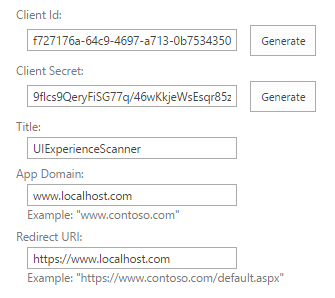
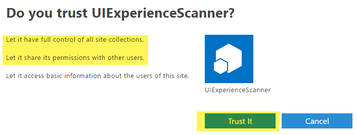

# <a name="granting-access-using-sharepoint-app-only"></a><span data-ttu-id="26456-101">Gewähren des Zugriffs von SharePoint-App-Only</span><span class="sxs-lookup"><span data-stu-id="26456-101">Granting access using SharePoint App-Only</span></span>
<span data-ttu-id="26456-102">SharePoint-App-Only ist der älteren, aber immer noch relevant Modell zum Einrichten von app-Prinzipalen.</span><span class="sxs-lookup"><span data-stu-id="26456-102">SharePoint App-Only is the older, but still very relevant, model of setting up app-principals.</span></span> <span data-ttu-id="26456-103">Dieses Modell funktioniert für beide SharePoint Online und SharePoint 2013/2016 lokalen und eignet sich ideal So bereiten Sie Ihre Anwendung für die Migration von lokalem SharePoint zu SharePoint online vor.</span><span class="sxs-lookup"><span data-stu-id="26456-103">This model works for both SharePoint Online and SharePoint 2013/2016 on-premises and is ideal to prepare your applications for migration from SharePoint on-premises to SharePoint online.</span></span> <span data-ttu-id="26456-104">Unten beschriebenen Schritte wird gezeigt, wie einen app-Prinzipal mit Mandanten Vollzugriff-Berechtigungen einrichten, aber konnte offensichtlich lediglich Leseberechtigungen für diese Vorgehensweise auch erteilen.</span><span class="sxs-lookup"><span data-stu-id="26456-104">Below steps show how to setup an app principal with tenant full control permissions, but obviously you could also grant just read permissions using this approach.</span></span>

## <a name="setting-up-an-app-only-principal-with-tenant-permissions"></a><span data-ttu-id="26456-105">Einrichten eines nur-app-Prinzipals mit Mandanten Berechtigungen</span><span class="sxs-lookup"><span data-stu-id="26456-105">Setting up an app-only principal with tenant permissions</span></span>
<span data-ttu-id="26456-106">Navigieren Sie zu einer Website in Ihrem Mandanten (z. B. https://contoso.sharepoint.com), und rufen Sie dann auf der Seite "appregnew.aspx" (z. B. https://contoso.sharepoint.com/_layouts/15/appregnew.aspx).</span><span class="sxs-lookup"><span data-stu-id="26456-106">Navigate to a site in your tenant (e.g. https://contoso.sharepoint.com) and then call the appregnew.aspx page (e.g. https://contoso.sharepoint.com/_layouts/15/appregnew.aspx).</span></span> <span data-ttu-id="26456-107">In dieser Seite klicken Sie auf die Schaltfläche generieren, um eine Client-Id und den geheimen Clientschlüssel generieren und füllen Sie die verbleibende Informationen wie in der Screenshot-unten angezeigt.</span><span class="sxs-lookup"><span data-stu-id="26456-107">In this page click on the Generate button to generate a client id and client secret and fill the remaining information like shown in the screen-shot below.</span></span>



> [!IMPORTANT]
> <span data-ttu-id="26456-109">Speichern Sie die abgerufene Informationen (Client-Id und den geheimen Clientschlüssel), da Sie dies im nächsten Schritt benötigen!</span><span class="sxs-lookup"><span data-stu-id="26456-109">Store the retrieved information (client id and client secret) since you'll need this in the next step!</span></span>

<span data-ttu-id="26456-110">Nächsten Schritt wird das Erteilen von Berechtigungen für die neu erstellte Prinzipal.</span><span class="sxs-lookup"><span data-stu-id="26456-110">Next step is granting permissions to the newly created principal.</span></span> <span data-ttu-id="26456-111">Da wir Mandanten bezogenen Berechtigungen gewähren kann dieses Verfahren nur über die Seite "appinv.aspx" auf die Mandantenverwaltungs-Website ausgeführt werden.</span><span class="sxs-lookup"><span data-stu-id="26456-111">Since we're granting tenant scoped permissions this granting can only be done via the appinv.aspx page on the tenant administration site.</span></span> <span data-ttu-id="26456-112">Sie können diese Website über https://contoso-admin.sharepoint.com/_layouts/15/appinv.aspx erreichen.</span><span class="sxs-lookup"><span data-stu-id="26456-112">You can reach this site via https://contoso-admin.sharepoint.com/_layouts/15/appinv.aspx.</span></span> <span data-ttu-id="26456-113">Nach dem Laden der Seite fügen Sie Ihrer Client-Id hinzu und den erstellten Prinzipal nachschlagen:</span><span class="sxs-lookup"><span data-stu-id="26456-113">Once the page is loaded add your client id and look up the created principal:</span></span>


<span data-ttu-id="26456-115">Um Berechtigungen zu erteilen, müssen Sie die Berechtigung XML bereitstellen, auf denen die erforderlichen Berechtigungen beschrieben.</span><span class="sxs-lookup"><span data-stu-id="26456-115">To grant permissions, you'll need to provide the permission XML that describes the needed permissions.</span></span> <span data-ttu-id="26456-116">Da diese Anwendung Zugriff auf alle Websites können muss + auch mit nur-app-Suche verwendet muss es unten aufgeführten Berechtigungen:</span><span class="sxs-lookup"><span data-stu-id="26456-116">Since this application needs to be able to access all sites + also uses search with app-only it needs below permissions:</span></span>

```
<AppPermissionRequests AllowAppOnlyPolicy="true">
  <AppPermissionRequest Scope="http://sharepoint/content/tenant" Right="FullControl" />
</AppPermissionRequests>
```

<span data-ttu-id="26456-117">Wenn Sie auf Create wird eine Berechtigung Zustimmungsdialogfeld angezeigt.</span><span class="sxs-lookup"><span data-stu-id="26456-117">When you click on Create you'll be presented with a permission consent dialog.</span></span> <span data-ttu-id="26456-118">Drücken Sie vertrauen, die Berechtigungen erteilen:</span><span class="sxs-lookup"><span data-stu-id="26456-118">Press Trust It to grant the permissions:</span></span>



> [!IMPORTANT]
> <span data-ttu-id="26456-120">Bitte schützen Sie diese Kombination erstellte Client-Id/geheimen Schlüssel wird als wäre es als Administrator an.</span><span class="sxs-lookup"><span data-stu-id="26456-120">Please safeguard the created client id/secret combination as would it be your administrator account.</span></span> <span data-ttu-id="26456-121">Verwenden diesen Client-Id/Schlüssel eine kann Lese-/alle Daten in Ihre SharePoint Online-Umgebung aktualisieren!</span><span class="sxs-lookup"><span data-stu-id="26456-121">Using this client id/secret one can read/update all data in your SharePoint Online environment!</span></span>

<span data-ttu-id="26456-122">Mit den vorbereitenden fahren Sie mit der nächsten Kapitel zeigt, wie Sie den erstellte app-Prinzipal über die Client-Id und der geheime Kombination verwenden können.</span><span class="sxs-lookup"><span data-stu-id="26456-122">With the preparation work done let's continue to the next chapter showing how you can use the created app principal via its client id and secret combination.</span></span>

## <a name="using-this-principal-in-your-application-using-the-sharepoint-pnp-sites-core-library"></a><span data-ttu-id="26456-123">Verwenden diesen Prinzipal in der Anwendung, die mithilfe der Hauptbibliothek der SharePoint Plug & Play-Websites</span><span class="sxs-lookup"><span data-stu-id="26456-123">Using this principal in your application using the SharePoint PnP Sites Core library</span></span>
<span data-ttu-id="26456-124">Im ersten Schritt Sie SharePoint Plug & Play-Websites Core Bibliothek Nuget-Paket hinzufügen: https://www.nuget.org/packages/SharePointPnPCoreOnline.</span><span class="sxs-lookup"><span data-stu-id="26456-124">In a first step, you add the SharePoint PnP Sites Core library nuget package: https://www.nuget.org/packages/SharePointPnPCoreOnline.</span></span> <span data-ttu-id="26456-125">Danach können Sie unter Codekonstrukt verwenden:</span><span class="sxs-lookup"><span data-stu-id="26456-125">Once that’s done you can use below code construct:</span></span>

```C#
string siteUrl = "https://contoso.sharepoint.com/sites/demo";
using (var cc = new AuthenticationManager().GetAppOnlyAuthenticatedContext(siteUrl, "[Your Client ID]", "[Your Client Secret]"))
{
    cc.Load(cc.Web, p => p.Title);
    cc.ExecuteQuery();
    Console.WriteLine(cc.Web.Title);
};
```

## <a name="using-this-principal-in-your-application-without-using-the-pnp-sites-core-library"></a><span data-ttu-id="26456-126">Verwenden diesen Prinzipal in der Anwendung ohne Verwendung der Hauptbibliothek für Plug & Play-Websites</span><span class="sxs-lookup"><span data-stu-id="26456-126">Using this principal in your application without using the PnP Sites Core library</span></span>
<span data-ttu-id="26456-127">Sobald der Prinzipal erstellt und zugestimmt ist können des Prinzipals-Id und geheimen Schlüssel Sie eine Access anfordern.</span><span class="sxs-lookup"><span data-stu-id="26456-127">Once the principal is created and consented you can use the principal's id and secret to request an access.</span></span> <span data-ttu-id="26456-128">Die Klasse "tokenhelper.cs" wird die Id und geheimen Clientschlüssel aus der Anwendungskonfigurationsdatei Code.</span><span class="sxs-lookup"><span data-stu-id="26456-128">The TokenHelper.cs class will grab the id and secret from the application's configuration file.</span></span>
<span data-ttu-id="26456-129">Verwenden von Microsoft.SharePoint.Client; System verwenden;</span><span class="sxs-lookup"><span data-stu-id="26456-129">using Microsoft.SharePoint.Client; using System;</span></span>

```C#
namespace AzureACSAuth
{
    class Program
    {
        static void Main(string[] args)
        {
            string siteUrl = "https://contoso.sharepoint.com/sites/demo";

            //Get the realm for the URL
            string realm = TokenHelper.GetRealmFromTargetUrl(new Uri(siteUrl));

            //Get the access token for the URL.  
            string accessToken = TokenHelper.GetAppOnlyAccessToken(TokenHelper.SharePointPrincipal, new Uri(siteUrl).Authority, realm).AccessToken;

            //Create a client context object based on the retrieved access token
            using (ClientContext cc = TokenHelper.GetClientContextWithAccessToken(siteUrl, accessToken))
            {
                cc.Load(cc.Web, p => p.Title);
                cc.ExecuteQuery();
                Console.WriteLine(cc.Web.Title);
            }
        }
    }
}
```

<span data-ttu-id="26456-130">Ein Beispiel app.config sieht folgendermaßen aus:</span><span class="sxs-lookup"><span data-stu-id="26456-130">A sample app.config looks like this:</span></span>

```XML
<?xml version="1.0" encoding="utf-8" ?>
<configuration>
  <appSettings>
    <!-- Use AppRegNew.aspx and AppInv.aspx to register client id with secret -->
    <add key="ClientId" value="[Your Client ID]" />
    <add key="ClientSecret" value="[Your Client Secret]" />
  </appSettings>
</configuration>
```

> [!NOTE]
> <span data-ttu-id="26456-131">Sie können auf einfache Weise die Klasse "tokenhelper.cs" in Ihrem Projekt einfügen, durch die AppForSharePointOnlineWebToolkit Nuget-Paket für Ihre Lösung hinzufügen.</span><span class="sxs-lookup"><span data-stu-id="26456-131">You can easily insert the TokenHelper.cs class in your project by adding the AppForSharePointOnlineWebToolkit nuget package to your solution.</span></span>

