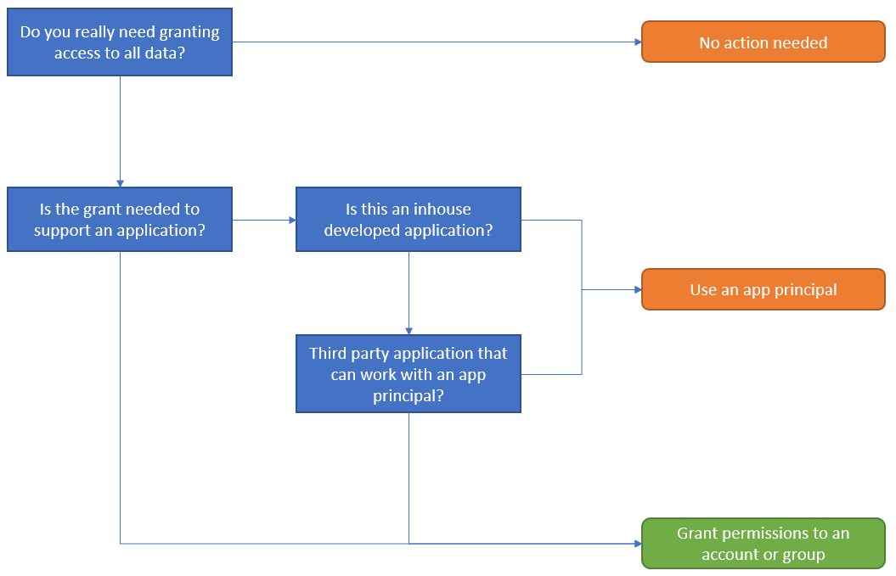
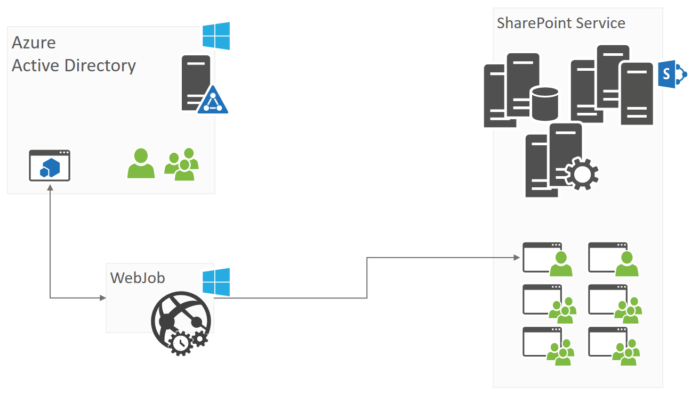

# <a name="alternative-model-for-web-app-policies-in-sharepoint-online"></a><span data-ttu-id="153e5-101">Alternatives Modell zum Web app-Richtlinien in SharePoint Online</span><span class="sxs-lookup"><span data-stu-id="153e5-101">Alternative model for web app policies in SharePoint Online</span></span>

<span data-ttu-id="153e5-102">Richtlinien für die Web app sind ein Konzept, die SharePoint-Administratoren zum Erteilen oder Verweigern von Berechtigungen für Benutzer und Gruppen für alle Websites unter einer Webanwendung ermöglicht.</span><span class="sxs-lookup"><span data-stu-id="153e5-102">Web app policies are a concept that allows SharePoint administrators to either grant or deny permissions to users and groups for all sites under a web application.</span></span> <span data-ttu-id="153e5-103">Diese Berechtigung gewährt und verweigert Take Präferenz über Berechtigungen, die an den Standorten in der Webanwendung festgelegt und daher einen Mechanismus, die in der Regel in diesen Szenarien verwendet werden:</span><span class="sxs-lookup"><span data-stu-id="153e5-103">These permission grants and denies take preference over the permissions set at the sites in the web application and therefore are a mechanism typically used in scenarios like these:</span></span>
 - <span data-ttu-id="153e5-104">Gewähren Sie ein Dienstkonto Berechtigungen für alle Websites, da dieses Dienstkonto verwendet wird, um eine Hintergrund auszuführen, die zum Bearbeiten der Daten in allen Websites muss</span><span class="sxs-lookup"><span data-stu-id="153e5-104">Grant a service account permissions to all the sites because that service account is used to run a background process that needs to manipulate the data in all sites</span></span>
 - <span data-ttu-id="153e5-105">Support Team schreibgeschützten Zugriff auf alle Websites gewähren, sodass der Supporttechniker über die Website mit dem Endbenutzer durchlaufen kann</span><span class="sxs-lookup"><span data-stu-id="153e5-105">Grant support team read-only access to all sites so the support engineer can walk through the site with the end user</span></span>
 - <span data-ttu-id="153e5-106">Verweigern des Zugriffs auf den gesamten Inhalt Benutzer (z. B. nach verlassen das Unternehmen)</span><span class="sxs-lookup"><span data-stu-id="153e5-106">Deny users (e.g. after leaving the company) access to all content</span></span>

<span data-ttu-id="153e5-107">Richtlinien sind in SharePoint Online nicht mehr vorhanden, und es ist keine identische alternative Implementierung möglich, jedoch mit der vorhandenen SharePoint-Sicherheitsmodell ähnliche Ergebnisse erzielen können.</span><span class="sxs-lookup"><span data-stu-id="153e5-107">Web application policies do not exist anymore in SharePoint Online and there’s no identical alternative implementation possible, however by using the existing SharePoint security model you can achieve similar results.</span></span> <span data-ttu-id="153e5-108">In diesem Artikel und Videos erfahren Sie mehr dazu.</span><span class="sxs-lookup"><span data-stu-id="153e5-108">In this article and video you’ll learn more about this.</span></span>

> [!Video https://www.youtube.com/embed/zcmngkgQdTU]

## <a name="granting-access"></a><span data-ttu-id="153e5-109">Gewähren des Zugriffs</span><span class="sxs-lookup"><span data-stu-id="153e5-109">Granting access</span></span>

### <a name="whats-the-business-reason-for-this-permission-grant"></a><span data-ttu-id="153e5-110">Was ist der Grund Business für diese Berechtigung erteilen?</span><span class="sxs-lookup"><span data-stu-id="153e5-110">What’s the business reason for this permission grant?</span></span>
<span data-ttu-id="153e5-111">Bevor Sie beginnen, Berechtigungen gewährt implementieren ist es wichtig zu verstehen, warum eine Grant erforderlich war.</span><span class="sxs-lookup"><span data-stu-id="153e5-111">Before starting to implement permissions grants it’s important to understand why a grant was needed.</span></span> <span data-ttu-id="153e5-112">Fragestellungen selbst sind:</span><span class="sxs-lookup"><span data-stu-id="153e5-112">Questions to ask yourselves are:</span></span>
 - <span data-ttu-id="153e5-113">Gewährt Zugriff auf **Alle** Daten in Ihrer SharePoint Online-Mandanten erforderlich?</span><span class="sxs-lookup"><span data-stu-id="153e5-113">Is granting access to **all** data in your SharePoint Online tenant necessary?</span></span> <span data-ttu-id="153e5-114">Schieben Sie wieder, und stellen Sie sicher, dass der Zugriff auf **Alle** Daten handelt es sich um eine Absolute muss zur Unterstützung der Business-Szenario</span><span class="sxs-lookup"><span data-stu-id="153e5-114">Push back and verify that the access to **all** data is an absolute must to support a business scenario</span></span>
 - <span data-ttu-id="153e5-115">Ist "1" erteilten Berechtigung eine Anwendung oder ein Benutzer geeignet?</span><span class="sxs-lookup"><span data-stu-id="153e5-115">Is the “one” using the granted permission an application or a user?</span></span> <span data-ttu-id="153e5-116">Wenn sie eine Anwendung ist möglicherweise klicken Sie dann eine app-Prinzipal mit SharePoint Online Breite Berechtigungen Mandanten, insbesondere dann, wenn dies eine internen entwickelte Anwendung ist entwickelt werden</span><span class="sxs-lookup"><span data-stu-id="153e5-116">If it’s an application then it might be possible to work with an app principal having SharePoint Online tenant wide permissions, especially if this is an inhouse developed application</span></span>

<span data-ttu-id="153e5-117">Unten Flussdiagramm nimmt diese Fragen:</span><span class="sxs-lookup"><span data-stu-id="153e5-117">Below flowchart is capturing these questions:</span></span>



> [!IMPORTANT]
><span data-ttu-id="153e5-119">Nur in der Groß-/Kleinschreibung wird der Zugriff gewährte verbraucht werden von einem Benutzer oder eine Anwendung, die Sie über die Benutzer oder Gruppen den Zugriff gewähren sollten nicht mit app-Prinzipalen kompatibel ist.</span><span class="sxs-lookup"><span data-stu-id="153e5-119">Only in the case the granted access will be consumed by a user or an application that is not compatible with app principals should you grant access via users or groups.</span></span> <span data-ttu-id="153e5-120">Wenn möglich, bevorzugen Sie app-Prinzipalen über Benutzer und Gruppen, da:</span><span class="sxs-lookup"><span data-stu-id="153e5-120">If possible, prefer app principals above users and groups because:</span></span>
> - <span data-ttu-id="153e5-121">App-Prinzipalen werden mit Bereich erteilt alle Websites, d. h., wenn eine Website hinzugefügt wird, dass der app-Prinzipal automatisch Zugriff darauf sowie hat.</span><span class="sxs-lookup"><span data-stu-id="153e5-121">App principals are granted with scope all sites, meaning if a site gets added the app principal automatically has access to it as well.</span></span> <span data-ttu-id="153e5-122">Im Fall eines WAN-Benutzer-/Gruppen Zugriff auf die jeweiligen Benutzergruppe ersten zur neuen Website hinzugefügt werden muss</span><span class="sxs-lookup"><span data-stu-id="153e5-122">In case of user/group access the respective user/group first needs to be added to the new site</span></span>
> - <span data-ttu-id="153e5-123">App-Prinzipalen überschreiben"" Berechtigung Vererbung Einstellung.</span><span class="sxs-lookup"><span data-stu-id="153e5-123">App principals “override” permission inheritance setting.</span></span> <span data-ttu-id="153e5-124">Nehmen Sie an eine Unterwebsite Unterbrochene Vererbung von Berechtigungen und einem Besitzer Benutzer-/Gruppen beitragen oder Ansicht Zugriff auf die Stammwebsite gewähren des Zugriffs auf die Sub-Website während der app-Prinzipal als solche gewähren, wird immer Zugriff haben.</span><span class="sxs-lookup"><span data-stu-id="153e5-124">Suppose a sub site has broken permission inheritance and as such granting a user/group owner, contribute or view access to the root site does grant access to the sub site while the app principal will always have access.</span></span>

### <a name="granting-access-using-app-principals"></a><span data-ttu-id="153e5-125">Gewähren des Zugriffs von app-Prinzipalen</span><span class="sxs-lookup"><span data-stu-id="153e5-125">Granting access using app principals</span></span>
<span data-ttu-id="153e5-126">Für den Zugriff für alle nicht Human ist es empfehlenswert, app-Prinzipalen verwenden, wie bereits erläutert.</span><span class="sxs-lookup"><span data-stu-id="153e5-126">For all non-human access, it’s advisable to use app principals as discussed previously.</span></span> <span data-ttu-id="153e5-127">Es gibt zwei Ansätze zur Folge:</span><span class="sxs-lookup"><span data-stu-id="153e5-127">There are two approaches for doing so:</span></span> 
 - <span data-ttu-id="153e5-128">Mit einer Azure AD-Anwendung: Dies ist die bevorzugte Methode, wenn Sie SharePoint Online verwenden, da Sie auch mit anderen Office 365-Diensten Berechtigungen gewähren können (falls erforderlich) + haben eine Benutzeroberfläche (Azure-Verwaltungsportal) für Ihre app-Prinzipalen verwalten.</span><span class="sxs-lookup"><span data-stu-id="153e5-128">Using an Azure AD application: this is the preferred method when using SharePoint Online because you can also grant permissions to other Office 365 services (if needed) + you’ve a user interface (Azure management portal) to maintain your app principals.</span></span>
 - <span data-ttu-id="153e5-129">Verwenden eines SharePoint-nur-App-Prinzipals: Diese Methode ist die Funktionsweise der älteren und nur für den Zugriff auf SharePoint, aber immer noch relevant ist.</span><span class="sxs-lookup"><span data-stu-id="153e5-129">Using a SharePoint App-Only principal: this method is older and only works for SharePoint access, but is still relevant.</span></span> <span data-ttu-id="153e5-130">Diese Methode ist auch empfohlen, wenn Sie noch in SharePoint lokal arbeiten, da dieses Modell in SharePoint lokal als SharePoint Online arbeitet.</span><span class="sxs-lookup"><span data-stu-id="153e5-130">This method is also the recommended model when you’re still working in SharePoint on-premises since this model works in both SharePoint on-premises as SharePoint Online.</span></span>

<span data-ttu-id="153e5-131">Beide Modelle werden in [den Zugriff auf SharePoint mithilfe von einem Anwendungskontext, auch bekannt als nur-app -](https://docs.microsoft.com/en-us/sharepoint/dev/solution-guidance/security-apponly) Artikel ausführlich erläutert.</span><span class="sxs-lookup"><span data-stu-id="153e5-131">Both models are explained in detail in the [Accessing SharePoint using an application context, also known as app-only](https://docs.microsoft.com/en-us/sharepoint/dev/solution-guidance/security-apponly) article.</span></span>

### <a name="granting-access-via-users-and-groups"></a><span data-ttu-id="153e5-132">Gewähren des Zugriffs über den Benutzer und Gruppen</span><span class="sxs-lookup"><span data-stu-id="153e5-132">Granting access via users and groups</span></span>
<span data-ttu-id="153e5-133">Wenn Sie Zugriff auf alle Websites zu erteilen, Sie einen Benutzer oder eine Gruppenzugriff auf alle Websites einzeln erteilen müssen, möchten.</span><span class="sxs-lookup"><span data-stu-id="153e5-133">When you want to grant access to all your sites you’ll need to grant either a user or a group access to all sites individually.</span></span> <span data-ttu-id="153e5-134">Dieses Modell unterscheidet sich von was Sie bei der Web-app-Richtlinien verwendet, aber es ist nur Modell, mit denen Sie einem Konto oder eine Gruppe Zugriff auf alle Websites zu gewähren.</span><span class="sxs-lookup"><span data-stu-id="153e5-134">This model is different than what you used to have with web app policies, but it’s the only model that you can use to grant a user account or group access to all sites.</span></span> 

#### <a name="permissions-that-can-be-granted"></a><span data-ttu-id="153e5-135">Berechtigungen, die erteilt werden können</span><span class="sxs-lookup"><span data-stu-id="153e5-135">Permissions that can be granted</span></span>
<span data-ttu-id="153e5-136">Richtlinien für die Web app verwenden, haben die Option, entweder erteilen "Vollzugriff" oder "Alles lesen", die in SharePoint-Berechtigungen übersetzt hängt davon ab, die folgende:</span><span class="sxs-lookup"><span data-stu-id="153e5-136">Using web app policies, you’ve the option to either grant “Full Control” or “Full Read”, which translated into SharePoint permissions comes down to this:</span></span>

|<span data-ttu-id="153e5-137">**Richtlinienberechtigungen für Web-App**</span><span class="sxs-lookup"><span data-stu-id="153e5-137">**Web App policy grant**</span></span>|<span data-ttu-id="153e5-138">**Entsprechende SharePoint-Berechtigungen**</span><span class="sxs-lookup"><span data-stu-id="153e5-138">**Equivalent SharePoint permission**</span></span>|
|:-----|:-----|
| <span data-ttu-id="153e5-139">Vollzugriff</span><span class="sxs-lookup"><span data-stu-id="153e5-139">Full Control</span></span> | <span data-ttu-id="153e5-140">Hinzufügen von Websitesammlungsadministratoren</span><span class="sxs-lookup"><span data-stu-id="153e5-140">Add to site collection administrators</span></span>
| <span data-ttu-id="153e5-141">Alles lesen</span><span class="sxs-lookup"><span data-stu-id="153e5-141">Full Read</span></span> | <span data-ttu-id="153e5-142">Fügen Sie using-Berechtigungsstufe "Lesen" (= Besucher der Website)</span><span class="sxs-lookup"><span data-stu-id="153e5-142">Add using “Read” permission level (= site visitors)</span></span>
| | <span data-ttu-id="153e5-143">Hinzufügen von "Vollzugriff" Berechtigungsstufe (Websitebesitzer =)</span><span class="sxs-lookup"><span data-stu-id="153e5-143">Add using “Full Control” permission level (= site owners)</span></span>
| | <span data-ttu-id="153e5-144">Fügen Sie using "Edit" Berechtigungsstufe (Websitemitglieder (=)</span><span class="sxs-lookup"><span data-stu-id="153e5-144">Add using “Edit” permission level (= site members)</span></span>

<span data-ttu-id="153e5-145">Wir bestätigt absichtlich, um die Rolle Websitesammlungsadministrator für die erteilen "Vollzugriff" verwenden, da diese Weise wir das Problem mit Vererbung von Berechtigungen vermeiden.</span><span class="sxs-lookup"><span data-stu-id="153e5-145">We deliberately opted to use the site collection administrator role for the “Full control” grant because this way we avoid the permission inheritance problem.</span></span> <span data-ttu-id="153e5-146">Benutzer können in SharePoint Unterbrechen der Vererbung von Berechtigungen und eindeutige Berechtigungen für Objekte (z. B. Sub-Websites, Listen, Listenelemente) als solche gewähren.</span><span class="sxs-lookup"><span data-stu-id="153e5-146">In SharePoint users can break permission inheritance and as such grant unique permissions on objects (e.g. sub sites, lists, list items).</span></span> <span data-ttu-id="153e5-147">Wenn ausgeführt wurde und Sie einen Benutzer beispielsweise der Website-Auflistung Websitegruppe Besitzer hinzufügen, würde der Benutzer nicht Berechtigungen für das Objekt mit eindeutigen Berechtigungen verfügen.</span><span class="sxs-lookup"><span data-stu-id="153e5-147">If that was done and you for example add a user to the site collection site owners group, then that user would not have permissions on the object with unique permissions.</span></span>

> [!IMPORTANT]
><span data-ttu-id="153e5-148">Wenn das Business-Szenario, das Sie implementieren mit der Berechtigung Vererbung Einschränkungen vorhanden sein kann, können Sie keine Berechtigungen beschrieben SharePoint verwenden.</span><span class="sxs-lookup"><span data-stu-id="153e5-148">If the business scenario you’re implementing can live with the permission inheritance limitations, then you can use any of the described SharePoint permissions.</span></span> <span data-ttu-id="153e5-149">Wenn Sie 100 % sicher, dass Zugriff auf alle Inhalte sichergestellt werden kann müssen, ist die Berechtigung "nur eine gute SharePoint" die Rolle Websitesammlungsadministrator.</span><span class="sxs-lookup"><span data-stu-id="153e5-149">If you need to guarantee 100% sure access on all content, then the only good SharePoint permission is the site collection administrator role.</span></span>

#### <a name="granting-by-adding-a-user-or-a-group"></a><span data-ttu-id="153e5-150">Erteilen von durch Hinzufügen eines Benutzers oder einer Gruppe?</span><span class="sxs-lookup"><span data-stu-id="153e5-150">Granting by adding a user or a group?</span></span>
<span data-ttu-id="153e5-151">Sie können dasselbe Ergebnis erreichen, indem Sie entweder erteilen der Berechtigungen für einen Benutzer oder eine Gruppe, aber beide Modelle Experten und des kohn</span><span class="sxs-lookup"><span data-stu-id="153e5-151">You can achieve the same result by either granting the permissions to a user or a group, but both models have pro’s and con’s.</span></span>

| |<span data-ttu-id="153e5-152">**Group**</span><span class="sxs-lookup"><span data-stu-id="153e5-152">**Group**</span></span>|<span data-ttu-id="153e5-153">**Benutzer**</span><span class="sxs-lookup"><span data-stu-id="153e5-153">**User**</span></span>|
|:-----|:-----|:-----|
| <span data-ttu-id="153e5-154">Klarheit</span><span class="sxs-lookup"><span data-stu-id="153e5-154">Clarity</span></span> | <span data-ttu-id="153e5-155">Weitere Konten in der Regel nicht sichtbar zu einem anderen Standort Websitesammlungs-Administratoren oder eine Gruppe auf enthalten</span><span class="sxs-lookup"><span data-stu-id="153e5-155">A group can contain on or more accounts, typically not visible to the other site collection administrators</span></span> | <span data-ttu-id="153e5-156">Benutzerkonto wird immer angezeigt, es ist keine unsicher</span><span class="sxs-lookup"><span data-stu-id="153e5-156">User account is always visible, there’s no doubt about it</span></span>
| <span data-ttu-id="153e5-157">Wartung</span><span class="sxs-lookup"><span data-stu-id="153e5-157">Maintenance</span></span> | <span data-ttu-id="153e5-158">Sie können auf einfache Weise Zugriff gewähren, der Gruppe neue Mitglieder hinzu</span><span class="sxs-lookup"><span data-stu-id="153e5-158">You can easily grant access by adding new members to the group</span></span> | <span data-ttu-id="153e5-159">Neue Member müssen alle Websites hinzugefügt werden</span><span class="sxs-lookup"><span data-stu-id="153e5-159">New members must be added to all sites</span></span>
| <span data-ttu-id="153e5-160">Manipulation</span><span class="sxs-lookup"><span data-stu-id="153e5-160">Tamper proof</span></span> | <span data-ttu-id="153e5-161">Eine Gruppe kann vermieden werden, die eigentlichen Konten müssen Zugriff (z. B. rechtliche Konto) und anderen Administratoren werden mit weitaus geringerer Wahrscheinlichkeit die Berechtigungen für die Gruppe entfernen</span><span class="sxs-lookup"><span data-stu-id="153e5-161">A group can shield the actual accounts having access (e.g. legal account) and other admins are less likely to remove the permissions for the group</span></span> | <span data-ttu-id="153e5-162">Vollständiger Transparenz vorhanden ist, sind möglicherweise anderen Administratoren häufiger auf die "Seltsames" Benutzer aus ihrer Website entfernen</span><span class="sxs-lookup"><span data-stu-id="153e5-162">There’s full transparency, other admins might be more likely to remove the “weird” users from their site</span></span>

> [!IMPORTANT]
> <span data-ttu-id="153e5-163">Erteilen von Berechtigungen, die mit einer Gruppe ist ein flexibleres Modell.</span><span class="sxs-lookup"><span data-stu-id="153e5-163">Granting permissions using a group is a more flexible model.</span></span>

#### <a name="what-about-modern-team-sites-aka-group-sites"></a><span data-ttu-id="153e5-164">Was geschieht mit modernem Teamwebsites (auch bekannt als</span><span class="sxs-lookup"><span data-stu-id="153e5-164">What about modern team sites (a.k.a.</span></span> <span data-ttu-id="153e5-165">Gruppe Websites)?</span><span class="sxs-lookup"><span data-stu-id="153e5-165">group sites)?</span></span>
<span data-ttu-id="153e5-166">Moderne Teamwebsites sind SharePoint-Teamwebsites, die mit einer Gruppe von Office 365 verbunden sind.</span><span class="sxs-lookup"><span data-stu-id="153e5-166">Modern team sites are SharePoint team sites which are connected to an Office 365 group.</span></span> <span data-ttu-id="153e5-167">Diese Gruppe von Office 365 fungiert als zentrale Modell für das Gewähren des Zugriffs auf alle Dienste, Gruppe (z. B. SharePoint-Website, Exchange-Postfach, Planner,...).</span><span class="sxs-lookup"><span data-stu-id="153e5-167">This Office 365 group acts as a central model for granting access to all the services on top of that group (e.g. SharePoint Site, Exchange mailbox, Planner, …).</span></span> <span data-ttu-id="153e5-168">Für diese Websites haben Sie 2 Optionen für das Gewähren des Zugriffs:</span><span class="sxs-lookup"><span data-stu-id="153e5-168">For these sites, you do have 2 options for granting access:</span></span>
 - <span data-ttu-id="153e5-169">Hinzufügen von Benutzerkonten (keine Gruppen) an die Mitglieder oder Besitzer der Gruppe der Office 365 mit der modernen Teamwebsite verbunden ist.</span><span class="sxs-lookup"><span data-stu-id="153e5-169">Add user accounts (no groups) to either the members or owners of the Office 365 group connected to the modern team site.</span></span> <span data-ttu-id="153e5-170">Vorteil von diesem Ansatz besteht darin, dass die erteilte Berechtigung gilt für alle Dienste, die dieser Gruppe verwenden, aber beim Auswerten von Richtlinien für die Web app dies in der Regel nicht relevant ist</span><span class="sxs-lookup"><span data-stu-id="153e5-170">The advantage of this approach is that the granted permission applies to all services that use this group, but when evaluating web app policies this typically is not relevant</span></span>
 - <span data-ttu-id="153e5-171">Behandeln der modernen Teamwebsite wie eine Website "normal", und gewähren von Berechtigungen wie in früheren Kapiteln beschrieben</span><span class="sxs-lookup"><span data-stu-id="153e5-171">Treat the modern team site like a “normal” site and grant permission like described in earlier chapters</span></span>

> [!IMPORTANT]
> <span data-ttu-id="153e5-172">Wir empfehlen Erteilen von Berechtigungen auf SharePoint-Ebene, Bedrohung also die modernen Teamwebsites wie regulären klassische SharePoint-Teamwebsites.</span><span class="sxs-lookup"><span data-stu-id="153e5-172">We recommend granting permissions at SharePoint level, so threat the modern team sites like regular classic SharePoint team sites.</span></span> <span data-ttu-id="153e5-173">Dieser Ansatz richtet mit, was die Webanwendungsrichtlinien Bereitstellung wurden.</span><span class="sxs-lookup"><span data-stu-id="153e5-173">This approach aligns with what the web application policies were providing.</span></span>

#### <a name="granting-permissions-using-pnp-powershell"></a><span data-ttu-id="153e5-174">Erteilen von Berechtigungen mithilfe von Plug & Play-PowerShell</span><span class="sxs-lookup"><span data-stu-id="153e5-174">Granting permissions using PnP PowerShell</span></span>
<span data-ttu-id="153e5-175">Klicken Sie unter Skripts eine einfache Möglichkeit zum Gewähren von Zugriff über von Plug & Play-PowerShell anzeigen und kann es sich um eine gute Start-Grundlage für die Implementierung.</span><span class="sxs-lookup"><span data-stu-id="153e5-175">Below scripts show an easy way to grant access via using PnP PowerShell and they can be a good starting basis for your implementation.</span></span> <span data-ttu-id="153e5-176">Unter Skripts nicht berücksichtigt in Konto Folgendes:</span><span class="sxs-lookup"><span data-stu-id="153e5-176">Below scripts do not take in account the following:</span></span>
 - <span data-ttu-id="153e5-177">Get-PnPTenantSite ist derzeit nicht aufzählen modernen Teamwebsites</span><span class="sxs-lookup"><span data-stu-id="153e5-177">Get-PnPTenantSite is currently not enumerating modern team sites</span></span>
 - <span data-ttu-id="153e5-178">Get-PnPTenantSite ist nicht Multi-Geo Beachten</span><span class="sxs-lookup"><span data-stu-id="153e5-178">Get-PnPTenantSite is not Multi-Geo aware</span></span>
 - <span data-ttu-id="153e5-179">Leistung ist nicht optimal, da die Skripts nacheinander ausgeführt werden, es ist keine parallele Ausführung</span><span class="sxs-lookup"><span data-stu-id="153e5-179">Performance is not optimal since the scripts are sequentially running, there’s no parallel execution</span></span>

<span data-ttu-id="153e5-180">Da Benutzer kontinuierlich neue Websitesammlungen erstellen ist es wichtig, diese Skripts regelmäßig, idealerweise als geplante Aufgabe auszuführen.</span><span class="sxs-lookup"><span data-stu-id="153e5-180">Since users continuously create new site collections it’s important to run these scripts on regular basis, ideally as a scheduled task.</span></span>

> [!IMPORTANT]
> <span data-ttu-id="153e5-181">Verfügt Ihre Mandanten einen Großteil der Websitesammlungen, ist der Ansatz mithilfe einer benutzerdefinierten Anwendung entwickelten eine bessere Lösung für Sie.</span><span class="sxs-lookup"><span data-stu-id="153e5-181">If your tenant has a lot of site collections, then the approach using a custom developed application is a better solution for you.</span></span>

##### <a name="full-control"></a><span data-ttu-id="153e5-182">Vollzugriff</span><span class="sxs-lookup"><span data-stu-id="153e5-182">Full Control</span></span>
<span data-ttu-id="153e5-183">Um Benutzern Vollzugriff zu spezifischen (oder alle) SharePoint-Websites können Sie SharePoint PowerShell die Zielbenutzer Websitesammlung-Admins der Ziel-Site (einschließlich aller) vornehmen.</span><span class="sxs-lookup"><span data-stu-id="153e5-183">To give users full control to specific (or all) SharePoint sites, you can use SharePoint PowerShell to make the target users Site Collection admins of the target sites (including all).</span></span> <span data-ttu-id="153e5-184">Dies kann durch ein globaler Administrator oder eine SharePoint-Service-Administrator erfolgen.</span><span class="sxs-lookup"><span data-stu-id="153e5-184">This can be done by a Global administrator or SharePoint Service administrator.</span></span>
<span data-ttu-id="153e5-185">Es wird empfohlen, dass der Zugriff auf Basis bei Bedarf hinzugefügt werden soll, und klicken Sie dann entfernt.</span><span class="sxs-lookup"><span data-stu-id="153e5-185">It is recommended that access be added on an as-needed basis, and then removed.</span></span> <span data-ttu-id="153e5-186">Das folgende Skript werden beispielsweise eine Liste der Administratoren für alle Websitesammlungen in einem Mandanten zugewiesen.</span><span class="sxs-lookup"><span data-stu-id="153e5-186">For example, the script below assigns a list of administrators to all site collections in a tenant.</span></span> <span data-ttu-id="153e5-187">Im Beispiel wird die [SharePoint-Muster und Methoden (Plug & Play-) von PowerShell-Befehlen](http://aka.ms/sppnp-powershell) zwei Benutzer Administratoren aller Websitesammlungen in den Mandanten vornehmen.</span><span class="sxs-lookup"><span data-stu-id="153e5-187">The example uses the [SharePoint Patterns and Practices (PnP) of PowerShell commands](http://aka.ms/sppnp-powershell) to make two users admins of all site collections in the tenant.</span></span>

```PowerShell
# comma separated list of users and groups to be added
$adminAccounts = "admin1@contoso.onmicrosoft.com","admin21@contoso.onmicrosoft.com"

# Specify the tenant here
$tenant = "contoso"

# Note: This example assumes that you are managing your credentials in Windows as documented here:
# https://github.com/SharePoint/PnP-PowerShell/wiki/How-to-use-the-Windows-Credential-Manager-to-ease-authentication-with-PnP-PowerShell
write-host "Connecting to https://$($tenant)-admin.sharepoint.com"
Connect-PnPOnline -Url "https://$($tenant)-admin.sharepoint.com"


#Note: we are only fetching the root site collection and any site collection in the /sites path
#Update filters here accordingly to match your requirements
write-host "Getting list of site collections"
$sitecollections = Get-PnPTenantSite | where {($_.Url -like "*$($tenant).sharepoint.com/") -or ($_.Url -like "*$($tenant).sharepoint.com/sites/*")}
foreach($sitecollection in $sitecollections) {
    write-host "Adding administrators to $($sitecollection.Url)"
    Set-PnPTenantSite -Url $sitecollection.Url -Owners $adminAccounts
}
```

##### <a name="full-read"></a><span data-ttu-id="153e5-188">Alles lesen</span><span class="sxs-lookup"><span data-stu-id="153e5-188">Full Read</span></span>
<span data-ttu-id="153e5-189">So Benutzer vollständigen Lesezugriff auf spezifische (oder alle) übergeben Sie die SharePoint-Websites können SharePoint PowerShell die Zielbenutzer für eine Websitesammlung lesen Rolle hinzufügen.</span><span class="sxs-lookup"><span data-stu-id="153e5-189">To give users full read to specific (or all) SharePoint sites, you can use SharePoint PowerShell to add the target users to a site collection Read Role.</span></span> <span data-ttu-id="153e5-190">Dies kann durch ein globaler Administrator oder eine SharePoint-Service-Administrator erfolgen.</span><span class="sxs-lookup"><span data-stu-id="153e5-190">This can be done by a Global administrator or SharePoint Service administrator.</span></span>
<span data-ttu-id="153e5-191">Die allgemeinen Schritte umfassen die Definition einer SharePoint-Lese-Rolle für die Websitesammlung oder wiederverwenden einer vorhandenen Farm und klicken Sie dann die Rolle Benutzer oder Gruppen zuweisen.</span><span class="sxs-lookup"><span data-stu-id="153e5-191">The general steps include defining a SharePoint Read Role for the site collection, or reuse an existing one, and then assigning users or groups to the Role.</span></span> <span data-ttu-id="153e5-192">Verwendung von Azure Active Directory-Gruppen, einschließlich derjenigen mit dynamischen Mitgliedschaft, zum Steuern des Zugriffs auf Ressourcen finden Sie unter: [Zugriff auf Ressourcen mit Azure Active Directory-Gruppen verwalten](https://docs.microsoft.com/en-us/azure/active-directory/active-directory-manage-groups#https%3A%2F%2Fchannel9.msdn.com%2FSeries%2FAzure-Active-Directory-Videos-Demos%2FAzure-AD--Introduction-to-Dynamic-Memberships-for-Groups%2Fplayer).</span><span class="sxs-lookup"><span data-stu-id="153e5-192">To use Azure AD groups, including those with dynamic membership, to control access to resources refer to: [Manage access to resources with Azure Active Directory groups](https://docs.microsoft.com/en-us/azure/active-directory/active-directory-manage-groups#https%3A%2F%2Fchannel9.msdn.com%2FSeries%2FAzure-Active-Directory-Videos-Demos%2FAzure-AD--Introduction-to-Dynamic-Memberships-for-Groups%2Fplayer).</span></span> <span data-ttu-id="153e5-193">Im Beispiel wird die [SharePoint-Muster und Methoden (Plug & Play-) von PowerShell-Befehlen](http://aka.ms/sppnp-powershell) zum Erstellen einer neuen Rolle Lesezugriff für alle Websitesammlungen in den Mandanten verwendet.</span><span class="sxs-lookup"><span data-stu-id="153e5-193">The example uses the [SharePoint Patterns and Practices (PnP) of PowerShell commands](http://aka.ms/sppnp-powershell) to create a new Read Role for all site collections in the tenant.</span></span>

```PowerShell
# Specify the tenant here
$tenant = "contoso"

# Note: This example assumes that you are managing your credentials in Windows as documented here:
# https://github.com/SharePoint/PnP-PowerShell/wiki/How-to-use-the-Windows-Credential-Manager-to-ease-authentication-with-PnP-PowerShell
write-host "Connecting to https://$($tenant)-admin.sharepoint.com"
Connect-PnPOnline -Url "https://$($tenant)-admin.sharepoint.com"

# Note: we are only fetching the root site collection and any site collection in the /sites/ path
# Update filters here accordingly to match your requirements
write-host "Getting list of site collections"
$sitecollections = Get-PnPTenantSite | where {($_.Url -like "*$($tenant).sharepoint.com/") -or ($_.Url -like "*$($tenant).sharepoint.com/sites/*")}
foreach($sitecollection in $sitecollections) {
    write-host "Set FullRead for MyGroup to $($sitecollection.Url)" 
    Connect-PnPOnline -Url $($sitecollection.Url)
    New-PnPGroup -Title 'FullReader' 
    Set-PnPGroupPermissions -Identity 'FullReader' -RemoveRole 'Full Control' -AddRole 'Read'
}
```

#### <a name="granting-permissions-using-a-custom-developed-application"></a><span data-ttu-id="153e5-194">Erteilen von Berechtigungen mithilfe einer benutzerdefinierten Anwendung entwickelten</span><span class="sxs-lookup"><span data-stu-id="153e5-194">Granting permissions using a custom developed application</span></span>
<span data-ttu-id="153e5-195">Ein alternatives Modell überprüft für der PowerShell-Ansatz Hintergrund beim Erstellen einer Anwendung ist, die alle Websitesammlungen (einschließlich modernen Teamwebsites, OneDrive for Business-Websites über Standorte bei Verwendung von Multi-Geo), zählt, ob die erforderliche Benutzergruppe hat Access und falls nicht, dass eine hinzugefügt.</span><span class="sxs-lookup"><span data-stu-id="153e5-195">An alternative model for the PowerShell approach is creating a background application that enumerates all site collections (including modern team sites, OneDrive for Business sites, across locations when using Multi-Geo), checks if the needed user/group has access and if not adds that one.</span></span> <span data-ttu-id="153e5-196">Die Architektur einer solchen Anwendung könnte so einfach wie das unten definierte sein:</span><span class="sxs-lookup"><span data-stu-id="153e5-196">The architecture of such an application could be as simple as the one defined below:</span></span>
1. <span data-ttu-id="153e5-197">Beginnen Sie mit eine Anwendung in Azure Active Directory für das setup Sie nur-app-Nutzung definieren (siehe "[das Einrichten einer Azure AD-app für nur-app - Zugriff](https://docs.microsoft.com/en-us/sharepoint/dev/solution-guidance/security-apponly-azuread)"), und gewähren Sie Vollzugriff auf alle Websitesammlungen</span><span class="sxs-lookup"><span data-stu-id="153e5-197">You start with defining an application in Azure AD for which you setup app-only usage (see “[Setting up an Azure AD app for app-only access](https://docs.microsoft.com/en-us/sharepoint/dev/solution-guidance/security-apponly-azuread)”) and grant full control on all site collections</span></span>
2. <span data-ttu-id="153e5-198">Erstellen Sie eine C#-Anwendung, die autorisiert selbst mithilfe der Azure AD-Anwendung, die Sie in Schritt 1 definiert haben und durchläuft alle Websitesammlungen (Dies kann OD4B Websitesammlungen enthalten), um die erforderlichen Konten/Gruppen hinzufügen, wenn sie nicht vorhanden sind</span><span class="sxs-lookup"><span data-stu-id="153e5-198">You create a C# application that authorizes itself using the Azure AD application you’ve defined in step 1 and iterates over all the site collections (this can include OD4B site collections) to add the needed accounts/groups if they’re not present</span></span>
3. <span data-ttu-id="153e5-199">In C#-Anwendung dann muss gehostet und Ausführung in regelmäßigen Abständen geplant werden.</span><span class="sxs-lookup"><span data-stu-id="153e5-199">This C# application then needs to be hosted and scheduled to run on regular intervals.</span></span> <span data-ttu-id="153e5-200">Mithilfe einer Azure Web-Projekt ist eine gute Modell dafür, aber die gleiche durch Ausführen der Anwendung als geplante Aufgabe auf einem Server ausgeführt werden konnte</span><span class="sxs-lookup"><span data-stu-id="153e5-200">Using an Azure web job is a good model for doing so, but the same could be done by running the application as a scheduled task on a server</span></span>



<span data-ttu-id="153e5-202">Im Rahmen dieses Handbuchs haben wir eine Anwendung für die ersten Schritte mit diesem erstellt.</span><span class="sxs-lookup"><span data-stu-id="153e5-202">As part of this guidance we’ve created an application to get you started with this.</span></span> <span data-ttu-id="153e5-203">Im Beispiel heißt [Governance.EnsurePolicy](https://github.com/SharePoint/PnP/tree/master/Solutions/Governance.EnsurePolicy) und im Repository Plug & Play-SharePoint werden kann.</span><span class="sxs-lookup"><span data-stu-id="153e5-203">The sample is called [Governance.EnsurePolicy](https://github.com/SharePoint/PnP/tree/master/Solutions/Governance.EnsurePolicy) and can be in the SharePoint PnP repository.</span></span>

> [!NOTE]
> <span data-ttu-id="153e5-204">In diesem Szenario konnte weiter in eine Anwendung erweitert werden, die bedingt gewährt und Berechtigungen entfernt.</span><span class="sxs-lookup"><span data-stu-id="153e5-204">This scenario could be further expanded into an application that conditionally grants and removes permissions.</span></span> <span data-ttu-id="153e5-205">Beispielsweise konnte das Helpdesk-Mitarbeiter Zugriff für eine bestimmte Website über das Erstellen eines Listenelements SharePoint anfordern, die Anwendung sieht dies und gewährt Zugriff für X Stunden... und entfernt die Berechtigungen weiter unten.</span><span class="sxs-lookup"><span data-stu-id="153e5-205">For example, helpdesk employees could request access for a given site via creating a SharePoint list item, the application sees this and grants access for x hours…and removes the permissions later.</span></span> <span data-ttu-id="153e5-206">Diese Anwendung führt auch ein Protokoll anzeigen, die Zugriff auf die Website gewährt wurde und zu welchen Zeitpunkten.</span><span class="sxs-lookup"><span data-stu-id="153e5-206">This application also keeps a log showing who was granted access to which site and when.</span></span>

## <a name="denying-access"></a><span data-ttu-id="153e5-207">Verweigern des Zugriffs</span><span class="sxs-lookup"><span data-stu-id="153e5-207">Denying access</span></span>
### <a name="replace-deny-all-policy-using-office-365-and-sharepoint-access-controls"></a><span data-ttu-id="153e5-208">Ersetzen verweigern, alle Richtlinien, die mit Office 365 und den Zugriff auf SharePoint-Steuerelemente</span><span class="sxs-lookup"><span data-stu-id="153e5-208">Replace Deny All Policy Using Office 365 and SharePoint Access Controls</span></span>
<span data-ttu-id="153e5-209">Es ist keine Richtlinie "Alles verweigern" in Office 365, vielmehr unsere es wird empfohlen, die mit Office 365 SharePoint-Zugriffsrichtlinien Berechtigungen zu verwalten.</span><span class="sxs-lookup"><span data-stu-id="153e5-209">There is no "Deny All" policy in Office 365, rather our recommended approach is to manage the permissions using O365 SharePoint access control policies.</span></span> <span data-ttu-id="153e5-210">Die Querformat muss den Benutzer, Apps und -Geräte.</span><span class="sxs-lookup"><span data-stu-id="153e5-210">The landscape needs to include Users, Apps, and Devices.</span></span> <span data-ttu-id="153e5-211">Einige der folgenden Zugriffsrichtlinien werden nachfolgend beschrieben.</span><span class="sxs-lookup"><span data-stu-id="153e5-211">Some of these access control policies are described below.</span></span>

<span data-ttu-id="153e5-212">Um bestimmte Benutzer den Zugriff auf Office 365-Ressourcen zu blockieren, SharePoint, einschließlich, befolgen Sie die hier beschriebenen Anweisungen: [Entfernen von einem früheren Mitarbeiter von Office 365](https://support.office.com/en-us/article/Remove-a-former-employee-from-Office-365-44d96212-4d90-4027-9aa9-a95eddb367d1).</span><span class="sxs-lookup"><span data-stu-id="153e5-212">To block specific users from accessing Office 365 resources, including SharePoint, follow the instructions outlined here: [Remove a former employee from Office 365](https://support.office.com/en-us/article/Remove-a-former-employee-from-Office-365-44d96212-4d90-4027-9aa9-a95eddb367d1).</span></span> <span data-ttu-id="153e5-213">Geben Sie beispielsweise Folgendes ein, um Zugriff auf einen Mitarbeiter abgeschnitten, die Organisation verlassen hat.</span><span class="sxs-lookup"><span data-stu-id="153e5-213">For example, to cut off access to an employee who has left the organization.</span></span> <span data-ttu-id="153e5-214">Dies kann durch ein globaler Administrator oder Benutzerverwaltungsadministrator mithilfe von Office 365 Admin Center oder Skripts mithilfe von PowerShell erfolgen.</span><span class="sxs-lookup"><span data-stu-id="153e5-214">This can be done by a Global administrator or user management administrator using the Office 365 Admin center or scripted using PowerShell.</span></span>

<span data-ttu-id="153e5-215">Um externe Freigabe, damit Lieferanten, Clients oder Kunden nur Zugriff auf bestimmte Ressourcen haben zu begrenzen, befolgen Sie die Anweisungen hier: [externe Freigabe für Ihre SharePoint Online-Umgebung verwalten](https://support.office.com/en-us/article/Manage-external-sharing-for-your-SharePoint-Online-environment-c8a462eb-0723-4b0b-8d0a-70feafe4be85).</span><span class="sxs-lookup"><span data-stu-id="153e5-215">To limit external sharing so that vendors, clients, or customers have access only to specific resources, follow the guidance here: [Manage external sharing for your SharePoint Online environment](https://support.office.com/en-us/article/Manage-external-sharing-for-your-SharePoint-Online-environment-c8a462eb-0723-4b0b-8d0a-70feafe4be85).</span></span> <span data-ttu-id="153e5-216">Beispielsweise können Sie eine SharePoint Online konfigurieren Zusammenarbeit mit externen Benutzern Extranetwebsite Schwerpunkt.</span><span class="sxs-lookup"><span data-stu-id="153e5-216">For example, you can configure a SharePoint Online extranet site focused on external collaboration.</span></span> 

<span data-ttu-id="153e5-217">Zum Blockieren oder zulassen mit externen Benutzern von bestimmten Domänen auf der Ebene der Mandanten oder Website freigeben, befolgen Sie die Anweisungen hier: [Eingeschränkte Domänen Freigabe in SharePoint Online und OneDrive für Unternehmen](https://support.office.com/en-us/article/Restricted-domains-sharing-in-SharePoint-Online-and-OneDrive-for-Business-5d7589cd-0997-4a00-a2ba-2320ec49c4e9?ui=en-US&rs=en-US&ad=US).</span><span class="sxs-lookup"><span data-stu-id="153e5-217">To block or allow sharing with external users from specific domains at the tenant or site collection level, follow the instructions here: [Restricted domains sharing in SharePoint Online and OneDrive for Business](https://support.office.com/en-us/article/Restricted-domains-sharing-in-SharePoint-Online-and-OneDrive-for-Business-5d7589cd-0997-4a00-a2ba-2320ec49c4e9?ui=en-US&rs=en-US&ad=US).</span></span> <span data-ttu-id="153e5-218">Geben Sie beispielsweise Folgendes ein, um die Freigabe mit nur bestimmte Geschäftspartnern unter Bekannte Domänen zu begrenzen.</span><span class="sxs-lookup"><span data-stu-id="153e5-218">For example, to limit sharing with only specific business partners at well-known domains.</span></span> <span data-ttu-id="153e5-219">Dies kann durch ein globaler Administrator oder eine SharePoint-Service-Administrator konfiguriert werden.</span><span class="sxs-lookup"><span data-stu-id="153e5-219">This can be configured by a Global administrator or SharePoint Service administrator.</span></span> 

<span data-ttu-id="153e5-220">Die Überwachung Features können Sie mit Office 365-Sicherheit und Compliance Center Dateiaktivitäten verfolgen.</span><span class="sxs-lookup"><span data-stu-id="153e5-220">With Office 365 Security and Compliance Center you can use the Auditing features to track file activity.</span></span> <span data-ttu-id="153e5-221">Weitere Informationen finden Sie mit den folgenden Artikeln:</span><span class="sxs-lookup"><span data-stu-id="153e5-221">Learn more with the following articles:</span></span> 
 - <span data-ttu-id="153e5-222">Überwachung von alle Ihre SharePoint-Websitesammlungen mithilfe von Office 365-Sicherheit und Compliance Center: [Suchen der Überwachungsprotokolle melden Sie sich bei der Office 365-Sicherheit und Compliance Center](https://support.office.com/en-us/article/Search-the-audit-log-in-the-Office-365-Security-Compliance-Center-0d4d0f35-390b-4518-800e-0c7ec95e946c?ui=en-US&rs=en-US&ad=US).</span><span class="sxs-lookup"><span data-stu-id="153e5-222">Auditing of all your SharePoint site collections using the Office 365 Security and Compliance center: [Search the audit log in the Office 365 Security & Compliance Center](https://support.office.com/en-us/article/Search-the-audit-log-in-the-Office-365-Security-Compliance-Center-0d4d0f35-390b-4518-800e-0c7ec95e946c?ui=en-US&rs=en-US&ad=US).</span></span> <span data-ttu-id="153e5-223">Dieser Ansatz gibt Ihnen Überwachung aller Ihrer Websites, ein flexibles reporting-Modell und Sie können [API die benutzerdefinierte Verarbeitung von Audit-Daten](https://msdn.microsoft.com/en-us/office-365/office-365-management-activity-api-reference).</span><span class="sxs-lookup"><span data-stu-id="153e5-223">This approach gives you auditing of all your sites, a flexible reporting model and you can use [API’s to do custom processing of the audit data](https://msdn.microsoft.com/en-us/office-365/office-365-management-activity-api-reference).</span></span>
 - <span data-ttu-id="153e5-224">Verwenden Sie [Office 365-Cloud-App-Sicherheit](https://support.office.com/en-us/article/Overview-of-Office-365-Cloud-App-Security-81f0ee9a-9645-45ab-ba56-de9cbccab475): Office 365-Cloud-App-Sicherheit erhalten Sie einen Einblick in verdächtige Aktivitäten in Office 365, sodass Sie Situationen, die potenziell problematisch und untersuchen können bei Bedarf Ausführen einer Aktion zum Beheben von Sicherheitsproblemen.</span><span class="sxs-lookup"><span data-stu-id="153e5-224">Use [Office 365 Cloud App Security](https://support.office.com/en-us/article/Overview-of-Office-365-Cloud-App-Security-81f0ee9a-9645-45ab-ba56-de9cbccab475): Office 365 Cloud App Security gives you insight into suspicious activity in Office 365 so you can investigate situations that are potentially problematic and, if needed, take action to address security issues.</span></span> <span data-ttu-id="153e5-225">Mit Office 365 Cloud App-Sicherheit können Sie alle der folgenden Aufgaben ausführen:</span><span class="sxs-lookup"><span data-stu-id="153e5-225">With Office 365 Cloud App Security, you can do all of the following:</span></span>
    - <span data-ttu-id="153e5-226">Finden Sie unter wie die Daten der Organisation in Office 365 zugegriffen und verwendet wird</span><span class="sxs-lookup"><span data-stu-id="153e5-226">See how your organization's data in Office 365 is accessed and used</span></span>
    - <span data-ttu-id="153e5-227">Definieren von Richtlinien, die Warnungen für untypischen oder verdächtigen Aktivitäten auslösen</span><span class="sxs-lookup"><span data-stu-id="153e5-227">Define policies that trigger alerts for atypical or suspicious activities</span></span>
    - <span data-ttu-id="153e5-228">Anhalten von Benutzerkonten auf verdächtige Aktivitäten</span><span class="sxs-lookup"><span data-stu-id="153e5-228">Suspend user accounts exhibiting suspicious activity</span></span>
    - <span data-ttu-id="153e5-229">Erforderliche Anmeldung wieder in apps für Office 365, nachdem eine Warnung ausgelöst wurde</span><span class="sxs-lookup"><span data-stu-id="153e5-229">Require users to log back in to Office 365 apps after an alert has been triggered</span></span>

<span data-ttu-id="153e5-230">Mit Office 365-Sicherheit und Compliance Center, Sie können auch blockieren, externe Freigabe von vertraulichen Dokumenten definieren, was in Ihrer Organisation vertrauliche Typen sind (Wählen Sie aus der viele Vorlagen oder erstellen Sie eine eigene benutzerdefinierte vertraulichen Typen).</span><span class="sxs-lookup"><span data-stu-id="153e5-230">With Office 365 Security and Compliance Center, you can also block external sharing of sensitive documents by defining what sensitive types are in your organization (pick from one of the many templates or create your own custom sensitive types).</span></span> <span data-ttu-id="153e5-231">Erfahren Sie mehr über integrierte vertrauliche Typen: Arten von vertraulichen Informationen.</span><span class="sxs-lookup"><span data-stu-id="153e5-231">Learn about built-in sensitive types here: Sensitive Information Types.</span></span> <span data-ttu-id="153e5-232">Weitere Informationen zum Erstellen eigener hier: [Erstellen von vertraulichen Informationstypen für benutzerdefinierte](https://support.office.com/en-us/article/Create-a-custom-sensitive-information-type-82c382a5-b6db-44fd-995d-b333b3c7fc30).</span><span class="sxs-lookup"><span data-stu-id="153e5-232">Learn about creating your own here: [Create Custom Sensitive Information Types](https://support.office.com/en-us/article/Create-a-custom-sensitive-information-type-82c382a5-b6db-44fd-995d-b333b3c7fc30).</span></span> 

<span data-ttu-id="153e5-233">Verwendung von Azure Active Directory-Gruppen, einschließlich derjenigen mit dynamischen Mitgliedschaft, zum Steuern des Zugriffs auf Ressourcen finden Sie unter: [Zugriff auf Ressourcen mit Azure Active Directory-Gruppen verwalten](https://docs.microsoft.com/en-us/azure/active-directory/active-directory-manage-groups#https%3A%2F%2Fchannel9.msdn.com%2FSeries%2FAzure-Active-Directory-Videos-Demos%2FAzure-AD--Introduction-to-Dynamic-Memberships-for-Groups%2Fplayer).</span><span class="sxs-lookup"><span data-stu-id="153e5-233">To use Azure AD groups, including those with dynamic membership, to control access to resources refer to: [Manage access to resources with Azure Active Directory groups](https://docs.microsoft.com/en-us/azure/active-directory/active-directory-manage-groups#https%3A%2F%2Fchannel9.msdn.com%2FSeries%2FAzure-Active-Directory-Videos-Demos%2FAzure-AD--Introduction-to-Dynamic-Memberships-for-Groups%2Fplayer).</span></span> <span data-ttu-id="153e5-234">Beispielsweise können Gruppen konfiguriert werden, um Mitglieder zu entfernen, dessen Konto nicht aktiviert ist.</span><span class="sxs-lookup"><span data-stu-id="153e5-234">For example, groups can be configured to remove members whose account is not enabled.</span></span> <span data-ttu-id="153e5-235">Darüber hinaus [Azure Active Directory-Schutz](https://docs.microsoft.com/en-us/azure/active-directory/active-directory-identityprotection) (Teil von Azure AD Premium) ermöglicht Administratoren zum Identifizieren des Anmeldevorgängen riskant und entweder blockieren oder mehrstufige Authentifizierung erfordern.</span><span class="sxs-lookup"><span data-stu-id="153e5-235">In addition, [Azure Active Directory Identity Protection](https://docs.microsoft.com/en-us/azure/active-directory/active-directory-identityprotection) (part of Azure AD Premium) allows admins to identify risky sign-ins and either block or require multi-factor authentication.</span></span>

<span data-ttu-id="153e5-236">Sperren oder beschränken Zugriff auf nicht kompatible oder nicht verwalteten Geräten Funktionalität wird in Kürze verfügbar das [bedingte Zugriffsrichtlinien Azure Active Directory](https://docs.microsoft.com/en-us/azure/active-directory/active-directory-conditional-access-azure-portal)nutzt.</span><span class="sxs-lookup"><span data-stu-id="153e5-236">To block or limit access on non-compliant or unmanaged devices, functionality is coming soon which takes advantage of [Azure Active Directory conditional access policies](https://docs.microsoft.com/en-us/azure/active-directory/active-directory-conditional-access-azure-portal).</span></span> <span data-ttu-id="153e5-237">Mithilfe dieser Richtlinie können Sie Zugriff auf umfangreiche apps auf nicht verwalteten Geräten blockieren und zulassen nur Browserzugriff ohne die Möglichkeit zum Herunterladen, drucken oder synchronisieren. Dies verhindert, dass Daten auf nicht verwalteten Geräten vor.</span><span class="sxs-lookup"><span data-stu-id="153e5-237">Using this policy, you can block access to rich apps on unmanaged devices and allow browser only access without the ability to download, print or sync. This prevents leakage of data on unmanaged devices.</span></span> <span data-ttu-id="153e5-238">Dies wird durch ein globaler Administrator oder eine SharePoint-Service-Administrator konfiguriert werden.</span><span class="sxs-lookup"><span data-stu-id="153e5-238">This will be configurable by a Global administrator or SharePoint Service administrator.</span></span>

<span data-ttu-id="153e5-239">Zum Blockieren des Zugriffs auf nicht vertrauenswürdigen Netzwerkadressen, können Sie standortbasierte Gruppenrichtlinien verwenden, um eine Liste der vertrauenswürdigen IP-Adressen konfigurieren aus der Zugriff gewährt wird.</span><span class="sxs-lookup"><span data-stu-id="153e5-239">To block access on untrusted network locations, you can use location-based policy to configure a list of trusted IP addresses from which access is allowed.</span></span> <span data-ttu-id="153e5-240">Befolgen Sie die Anweisungen hier: [Steuern des Zugriffs auf SharePoint und OneDrive auf der Grundlage von Netzwerkadressen](https://support.office.com/en-us/article/Control-access-to-SharePoint-Online-and-OneDrive-data-based-on-defined-network-locations-b5a5f1f1-1174-4c6b-91d0-9273a6b6971f).</span><span class="sxs-lookup"><span data-stu-id="153e5-240">Follow the instructions here: [Control Access to SharePoint and OneDrive Based on Network Locations](https://support.office.com/en-us/article/Control-access-to-SharePoint-Online-and-OneDrive-data-based-on-defined-network-locations-b5a5f1f1-1174-4c6b-91d0-9273a6b6971f).</span></span>


