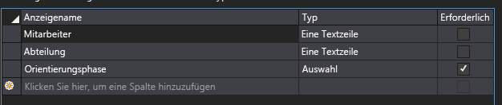

# <a name="add-a-custom-content-type-to-a-sharepoint-hosted-sharepoint-add-in"></a><span data-ttu-id="f431e-102">Hinzufügen eines benutzerdefinierten Inhaltstyps zu einem von SharePoint gehosteten SharePoint-Add-In</span><span class="sxs-lookup"><span data-stu-id="f431e-102">Add a custom content type to a SharePoint-hosted SharePoint Add-in</span></span>
<span data-ttu-id="f431e-103">Erfahren Sie, wie Sie benutzerdefinierte Inhaltstypen in SharePoint-Add-Ins einschließen.</span><span class="sxs-lookup"><span data-stu-id="f431e-103">Learn how to include custom content types in an SharePoint Add-ins.</span></span>
 

 <span data-ttu-id="f431e-p101">**Hinweis** Der Name „Apps für SharePoint“ wird in „SharePoint-Add-Ins“ geändert. Während des Übergangszeitraums wird in der Dokumentation und der Benutzeroberfläche einiger SharePoint-Produkte und Visual Studio-Tools möglicherweise weiterhin der Begriff „Apps für SharePoint“ verwendet. Weitere Informationen finden Sie unter [Neuer Name für Office- und SharePoint-Apps](new-name-for-apps-for-sharepoint.md#bk_newname).</span><span class="sxs-lookup"><span data-stu-id="f431e-p101">**Note**  The name "apps for SharePoint" is changing to "SharePoint Add-ins". During the transition, the documentation and the UI of some SharePoint products and Visual Studio tools might still use the term "apps for SharePoint". For details, see  [New name for apps for Office and SharePoint](new-name-for-apps-for-sharepoint.md#bk_newname).</span></span>
 

<span data-ttu-id="f431e-107">Dies ist der vierte in einer Reihe von Artikeln über die Grundlagen der Entwicklung von von SharePoint gehosteten SharePoint-Add-Ins. Machen Sie sich zunächst mit [SharePoint-Add-Ins](sharepoint-add-ins.md) und den anderen Artikeln in dieser Reihe vertraut:</span><span class="sxs-lookup"><span data-stu-id="f431e-107">This is the fourth in a series of articles about the basics of developing SharePoint-hosted SharePoint Add-ins. You should first be familiar with  [SharePoint Add-ins](sharepoint-add-ins.md) and the other articles in this series:</span></span>
 

-  [<span data-ttu-id="f431e-108">Erste Schritte beim Erstellen von von SharePoint gehosteten SharePoint-Add-Ins</span><span class="sxs-lookup"><span data-stu-id="f431e-108">Get started creating SharePoint-hosted SharePoint Add-ins</span></span>](get-started-creating-sharepoint-hosted-sharepoint-add-ins.md)
    
 
-  [<span data-ttu-id="f431e-109">Bereitstellung und Installation eines von SharePoint gehosteten Add-Ins für SharePoint</span><span class="sxs-lookup"><span data-stu-id="f431e-109">Deploy and install a SharePoint-hosted SharePoint Add-in</span></span>](deploy-and-install-a-sharepoint-hosted-sharepoint-add-in.md)
    
 
-  [<span data-ttu-id="f431e-110">Hinzufügen von benutzerdefinierten Spalten zu einem von SharePoint gehosteten Add-In für SharePoint</span><span class="sxs-lookup"><span data-stu-id="f431e-110">Add custom columns to a SharePoint-hostedSharePoint Add-in</span></span>](add-custom-columns-to-a-sharepoint-hostedsharepoint-add-in.md)
    
 

 <span data-ttu-id="f431e-p102">**Hinweis** Wenn Sie diese Reihe zu von SharePoint gehosteten Add-Ins durchgearbeitet haben, haben Sie eine Visual Studio-Projektmappe, die Sie verwenden können, um mit diesem Thema fortzufahren. Sie können außerdem das Repository unter [SharePoint_SP-Hosted_Add-Ins_Tutorials](https://github.com/OfficeDev/SharePoint_SP-hosted_Add-Ins_Tutorials) herunterladen und die Datei „BeforeContentType.sln“ öffnen.</span><span class="sxs-lookup"><span data-stu-id="f431e-p102">**Note**  If you have been working through this series about SharePoint-hosted add-ins, then you have a Visual Studio solution that you can use to continue with this topic. You can also download the repository at  [SharePoint_SP-hosted_Add-Ins_Tutorials](https://github.com/OfficeDev/SharePoint_SP-hosted_Add-Ins_Tutorials) and open the BeforeContentType.sln file.</span></span>
 

<span data-ttu-id="f431e-113">In diesem Artikel fügen Sie dem SharePoint-Add-In „Orientierung für Mitarbeiter“ einen benutzerdefinierten Inhaltstyp hinzu.</span><span class="sxs-lookup"><span data-stu-id="f431e-113">In this article you add a custom content type to the Employee Orientation SharePoint Add-in.</span></span>
 

## <a name="create-the-custom-content-type"></a><span data-ttu-id="f431e-114">Erstellen des benutzerdefinierten Inhaltstyps</span><span class="sxs-lookup"><span data-stu-id="f431e-114">Create the custom content type</span></span>

1. <span data-ttu-id="f431e-p103">Klicken Sie im **Projektmappen-Explorer** mit der rechten Maustaste auf das Projekt, und wählen Sie **Hinzufügen** > **Neuer Ordner** aus. Nennen Sie den Ordner „Inhaltstypen“.</span><span class="sxs-lookup"><span data-stu-id="f431e-p103">In  **Solution Explorer**, right-click the project and choose  **Add** > **New Folder**. Name the folder Content Types.</span></span>
    
 
2. <span data-ttu-id="f431e-p104">Klicken Sie mit der rechten Maustaste auf den neuen Ordner, und wählen Sie **Hinzufügen** > **Neues Element** aus. Das Dialogfeld **Neues Element hinzufügen** wird mit dem Knoten **Office/SharePoint** geöffnet.</span><span class="sxs-lookup"><span data-stu-id="f431e-p104">Right-click the new folder and choose  **Add** > **New Item**. The  **Add New Item** dialog box opens to the **Office/SharePoint** node..</span></span>
    
 
3. <span data-ttu-id="f431e-p105">Wählen Sie **Inhaltstyp** aus, geben Sie ihm den NamenNewEmployee, und wählen Sie **Hinzufügen** aus. Wenn Sie vom Assistenten dazu aufgefordert werden, den Basisinhaltstyp auszuwählen, wählen Sie **Element** und dann **Fertig stellen** aus.</span><span class="sxs-lookup"><span data-stu-id="f431e-p105">Choose  **Content Type** and give it the nameNewEmployee, and then choose  **Add**. When prompted by the wizard to select the base content type, choose  **Item**, and then choose  **Finish**.</span></span>
    
 
4. <span data-ttu-id="f431e-121">Wenn der Inhaltstyp-Designer nicht automatisch geöffnet wird, wählen Sie den Inhaltstyp **NewEmployee** im **Projektmappen-Explorer** aus, um ihn zu öffnen.</span><span class="sxs-lookup"><span data-stu-id="f431e-121">If the content type designer does not automatically open, choose the  **NewEmployee** content type in **Solution Explorer** to open it.</span></span>
    
 
5. <span data-ttu-id="f431e-122">Öffnen Sie die Registerkarte **Inhaltstyp** im Designer, und füllen Sie die Textfelder wie folgt aus:</span><span class="sxs-lookup"><span data-stu-id="f431e-122">Open the  **Content Type** tab in the designer and fill the text boxes as follows:</span></span>
    
      -  <span data-ttu-id="f431e-123">**Inhaltstypname**: NewEmployee</span><span class="sxs-lookup"><span data-stu-id="f431e-123">**Content Type Name**: NewEmployee</span></span>
    
 
  -  <span data-ttu-id="f431e-124">**Beschreibung**: Stellt einen neuen Mitarbeiter dar.</span><span class="sxs-lookup"><span data-stu-id="f431e-124">**Description**: Represents a new employee.</span></span>
    
 
  -  <span data-ttu-id="f431e-125">**Gruppenname**: Orientierung für Mitarbeiter</span><span class="sxs-lookup"><span data-stu-id="f431e-125">**Group Name**: Employee Orientation</span></span>
    
 
6. <span data-ttu-id="f431e-p106">Stellen Sie sicher, dass  *keines*  der Kontrollkästchen auf der Registerkarte aktiviert ist. Das Kontrollkästchen für **Erbt die Spalten vom übergeordneten Inhaltstyp** ist möglicherweise standardmäßig aktiviert. *Deaktivieren Sie es unbedingt.*  Die Registerkarte sollte jetzt wie folgt aussehen:</span><span class="sxs-lookup"><span data-stu-id="f431e-p106">Verify that  *none*  of the check boxes on the tab are selected. The check box for **Inherits the columns from the parent Content Type** may be selected by default. *Be sure to clear it.*  The tab should now look like the following:</span></span>
    
    <span data-ttu-id="f431e-130">**Registerkarte „Inhaltstyp“**</span><span class="sxs-lookup"><span data-stu-id="f431e-130">**Content Type Tab**</span></span>

  
 
 
7. <span data-ttu-id="f431e-132">Öffnen Sie die Registerkarte **Spalten** im Designer.</span><span class="sxs-lookup"><span data-stu-id="f431e-132">Open the  **Columns** tab in the designer.</span></span>
     
8. <span data-ttu-id="f431e-p107">Wählen Sie im Raster **Klicken Sie hier, um eine Spalte hinzuzufügen** aus, um eine Dropdownliste der Spalten zu öffnen, und fügen Sie die Spalte **Abteilung** hinzu. Sie ist in der Dropdownliste mit ihrem Anzeigenamen aufgeführt: **Abteilung**. Wiederholen Sie den Vorgang für die Spalte **Orientierungsphase**. (Wenn diese nicht aufgeführt sind, haben Sie möglicherweise nicht mit der richtigen Visual Studio-Lösung begonnen. Beginnen Sie mit BeforeContentType.sln.) Wenn Sie fertig sind, sollte das Raster wie folgt aussehen:</span><span class="sxs-lookup"><span data-stu-id="f431e-p107">In the gird, choose  **Click here to add a column** to open a drop down list of columns, and add the **Division** column. It is listed in the drop-down list by its display name: **Division**. Do the same for the  **Orientation Stage** column. (If they are not listed, you may not have started with the correct Visual Studio solution. Start with BeforeContentType.sln.) When your are finished the grid should look like the following:</span></span>
    
    <span data-ttu-id="f431e-138">**Registerkarte „Spalten“**</span><span class="sxs-lookup"><span data-stu-id="f431e-138">**Columns Tab**</span></span>

    
 
 
9. <span data-ttu-id="f431e-140">Speichern Sie die Datei, und schließen Sie den Designer.</span><span class="sxs-lookup"><span data-stu-id="f431e-140">Save the file and close the designer.</span></span>
    
 
10. <span data-ttu-id="f431e-141">Der nächste Schritt erfordert, dass Sie direkt im unformatierten XML des Inhaltstyps arbeiten. Wählen Sie daher im **Projektmappen-Explorer** die dem Inhaltstyp **NewEmployee** untergeordnete Datei elements.xml aus.</span><span class="sxs-lookup"><span data-stu-id="f431e-141">The next step requires that you work directly in the raw XML for the content type, so in  **Solution Explorer**, choose the elements.xml file child of the  **NewEmployee** content type.</span></span>
    
 
11. <span data-ttu-id="f431e-p108">Die Datei enthält bereits **FieldRef**-Elemente für die beiden Spalten, die Sie hinzugefügt haben. Fügen Sie **FieldRef**-Elemente für zwei integrierte SharePoint-Spalten als übergeordnete Elemente der beiden bereits vorhandenen hinzu. Nachfolgend dargestellt ist das Markup für die Elemente. *Sie müssen diese GUIDs für die ID-Attribute verwenden, da diese integrierte Feldtypen mit festen IDs sind.* Fügen Sie sie *über* den beiden **FieldRef**-Elementen für die benutzerdefinierten Websitespalten hinzu.</span><span class="sxs-lookup"><span data-stu-id="f431e-p108">There are already  **FieldRef** elements in the file for the two columns that you added. Add **FieldRef** elements for two built-in SharePoint columns as peers of the two that are already there. The following is the markup for the elements. *You must use these same GUIDs for the ID attribute because these are built-in field types with fixed IDs.*  Add these *above*  the two **FieldRef** elements for the custom site columns.</span></span>
    
```
  <FieldRef Name="LinkTitle" ID="{82642ec8-ef9b-478f-acf9-31f7d45fbc31}" DisplayName="Employee" />
<FieldRef Name="Title" ID="{fa564e0f-0c70-4ab9-b863-0177e6ddd247}" DisplayName="Employee" />
```


    Note that we have given these fields a custom display name:  **Employee**.
    
 
12. <span data-ttu-id="f431e-147">Speichern und schließen Sie die Datei.</span><span class="sxs-lookup"><span data-stu-id="f431e-147">Save and close the file.</span></span>
    
 
13. <span data-ttu-id="f431e-148">Erweitern Sie den Knoten **Listen** im **Projektmappen-Explorer**, und wählen Sie **NewEmployeeOrientation**, um den Listentyp-Designer zu öffnen.</span><span class="sxs-lookup"><span data-stu-id="f431e-148">Expand the  **Lists** node in **Solution Explorer** and choose **NewEmployeeOrientation** to open the list type designer.</span></span>
    
 
14. <span data-ttu-id="f431e-149">Öffnen Sie die Registerkarte **Spalten** im Designer, und klicken Sie dann auf die Schaltfläche **Inhaltstypen**.</span><span class="sxs-lookup"><span data-stu-id="f431e-149">Open the  **Columns** tab in the designer, and then choose the **Content Types** button.</span></span>
    
 
15. <span data-ttu-id="f431e-150">Fügen Sie im Dialogfeld **Inhaltstypeinstellungen** den Inhaltstyp **NewEmployee** hinzu.</span><span class="sxs-lookup"><span data-stu-id="f431e-150">In the  **Content Type Settings** dialog box, add the **NewEmployee** content type.</span></span>
    
 
16. <span data-ttu-id="f431e-151">Wählen Sie in der Liste der Typen den Inhaltstyp **NewEmployee** aus, und klicken Sie auf die Schaltfläche **Als Standard festlegen**.</span><span class="sxs-lookup"><span data-stu-id="f431e-151">Choose the  **NewEmployee** content type in the list of types, and choose the **Set as Default** button.</span></span>
    
 
17. <span data-ttu-id="f431e-152">Wählen Sie den Inhaltstyp **Element** aus, klicken Sie mit der rechten Maustaste auf die kleine Pfeilspitze, die links vom Inhaltstypnamen angezeigt wird, und klicken Sie dann auf **Löschen**.</span><span class="sxs-lookup"><span data-stu-id="f431e-152">Choose the  **Item** content type, right-click the small arrowhead that appears to the left of the content type name, and then choose **Delete**.</span></span>
    
 
18. <span data-ttu-id="f431e-p109">Wiederholen Sie den vorherigen Schritt für den Inhaltstyp **Ordner**, sodass **NewEmployee** als einziger Inhaltstyp angezeigt wird. Das Dialogfeld sollte jetzt wie folgt aussehen:</span><span class="sxs-lookup"><span data-stu-id="f431e-p109">Repeat the preceding step for the  **Folder** content type, so **NewEmployee** is the only content type listed. The dialog box should now look like the following:</span></span>
    
    <span data-ttu-id="f431e-155">**Dialogfeld „Inhaltstypeinstellungen“**</span><span class="sxs-lookup"><span data-stu-id="f431e-155">**Content Type Settings dialog box**</span></span>

    
 
19.  <span data-ttu-id="f431e-157">Klicken Sie auf **OK**, um das Dialogfeld zu schließen, und speichern und schließen Sie anschließend die Datei.</span><span class="sxs-lookup"><span data-stu-id="f431e-157">Choose **OK** to close the dialog box, and then save and close the file.</span></span>
    
20. <span data-ttu-id="f431e-158">Öffnen Sie die Datei „schema.xml“.</span><span class="sxs-lookup"><span data-stu-id="f431e-158">Open the schema.xml file.</span></span>
    
21. <span data-ttu-id="f431e-p110">Suchen Sie nach dem Element **Fields**. Es sollte über drei **Field**-Elemente verfügen: **Title**, Abteilung undOrientationStage. (Diese Elemente befinden sich in der generierten Daten möglicherweise in einer Zeile. Wenn das der Fall ist, trennen Sie sie durch Zeilenumbrüche.)</span><span class="sxs-lookup"><span data-stu-id="f431e-p110">Find the  **Fields** element. It should have three **Field** elements: **Title**, Division, and OrientationStage. (These elements may be on a single line in this generated file. If so, separate them with line breaks.)</span></span>
 
22. <span data-ttu-id="f431e-p111">Lassen Sie die Datei geöffnet, und erweitern Sie im **Projektmappen-Explorer** den Ordner **Websitespalten** und den KnotenAbteilung, und öffnen Sie dann die Datei „elements.xml" für Abteilung. Das Element **Field** fürAbteilung in schema.xml sollte exakt mit dem Element **Field** fürAbteilung in elements.xml übereinstimmen. Wenn keine genaue Übereinstimmung vorhanden ist, kopieren Sie das Element **Field** aus der elements.xml-Datei der Websitespalte, und fügen Sie sie anstelle des nicht übereinstimmenden **Field**-Elements in der schema.xml-Datei ein. Schließen Sie dann die elements.xml-Datei.</span><span class="sxs-lookup"><span data-stu-id="f431e-p111">Leave the file open and in  **Solution Explorer**, expand the  **Site Columns** folder and theDivision node, and then open the elements.xml file forDivision. The  **Field** element forDivision in schema.xml should exactly duplicate the **Field** element in theDivision elements.xml. If there is not an exact match, copy the **Field** element from the site column elements.xml file and paste it in place of the mismatched **Field** element in the schema.xml file. Then close the element.xml file.</span></span>
    
23. <span data-ttu-id="f431e-p112">Öffnen Sie die Datei elements.xml für OrientationStage. Auch hier muss eine exakte Übereinstimmung der **Field**-Elemente in den zwei Dateien für OrientationStage vorhanden sein, einschließlich aller untergeordneten Elemente wie die Elemente **CHOICES** und **MAPPINGS**. Wenn keine Übereinstimmung vorhanden ist, kopieren Sie das Element **Field** in der elements.xml-Datei, und fügen Sie es anstelle des nicht übereinstimmenden **Field**-Elements in der schema.xml-Datei ein. Schließen Sie die elements.xml-Datei.</span><span class="sxs-lookup"><span data-stu-id="f431e-p112">Open the elements.xml file for OrientationStage. Here, too, there must be an exact match of the  **Field** elements in the two files forOrientationStage, including all child elements, such as the  **CHOICES** and **MAPPINGS** elements. If there isn't, copy the **Field** in the elements.xml file and paste it in place of the mismatched **Field** element in the schema.xml file. Then close the element.xml file.</span></span>
 
24. <span data-ttu-id="f431e-p113">Während Sie sich weiterhin in der Datei „schema.xml" befinden, suchen Sie im Element **View**, dessen **BaseViewID**-Wert gleich 1 ist, nach dem untergeordneten **ViewFields**-Element, und fügen Sie ihm dann die folgenden zwei **FieldRef**-Elemente als untergeordnete Elemente hinzu. Möglicherweise sind sie bereits vorhanden, jedoch fehlt ein **ID**-Attribut. Wenn dies der Fall ist, fügen Sie das ID-Attribut hinzu.</span><span class="sxs-lookup"><span data-stu-id="f431e-p113">Still in the schema.xml file, in the  **View** element whose **BaseViewID** value is "1", find the child **ViewFields** element and then add the following two **FieldRef** elements as children of it. They may already be there, but missing an **ID** attribute. If so, add the ID attribute.</span></span>
    
```
  <FieldRef Name="Division" ID="{GUID from the Field element}" />
<FieldRef Name="OrientationStage" ID="{GUID from the Field element}" />

```

25. <span data-ttu-id="f431e-p114">Ersetzen Sie die zwei Platzhalter- **ID**-Attributwerte durch die GUIDs aus den entsprechenden **Field**-Elementen im Element **ContentType** für **NewEmployee**, das sich zuvor in der Datei „schema.xml" befand. Vergessen Sie nicht die umschließenden Klammern „{}".</span><span class="sxs-lookup"><span data-stu-id="f431e-p114">Replace the two placeholder  **ID** attribute values with the GUIDs from the corresponding **Field** elements in the **ContentType** element for **NewEmployee** that is earlier in the schema.xml file. Don't forget the framing braces "{}".</span></span>
    
    <span data-ttu-id="f431e-p115">Das **ViewFields**-Element für das **View**-Element „1“ sollte wie folgt aussehen. (Ihre GUIDs können abweichen.)</span><span class="sxs-lookup"><span data-stu-id="f431e-p115">The  **ViewFields** for the "1" **View** should look like this. (Your GUIDs may be different.)</span></span>
    


```
  <ViewFields>
   <FieldRef Name="LinkTitle" ID="{82642ec8-ef9b-478f-acf9-31f7d45fbc31}" DisplayName="Employee" />
   <FieldRef Name="Division" ID="{509d2d67-9a96-4596-9b3b-58449cdcc6ff}" />
   <FieldRef Name="OrientationStage" ID="{38a3b54c-acf3-4ddf-b748-55c7c28d4cc2}" />        
</ViewFields>
```

26. <span data-ttu-id="f431e-p116">Suchen Sie in der Datei „schema.xml“ nach dem **View**-Element, dessen **BaseViewID** den Wert „0“ hat. Suchen Sie nach dem **ViewFields**-Element in diesem Element.</span><span class="sxs-lookup"><span data-stu-id="f431e-p116">Still in the schema.xml file, find the  **View** element whose **BaseViewID** value is "0". find the **ViewFields** element with in it.</span></span>
    
 
27. <span data-ttu-id="f431e-p117">Kopieren Sie den gesamten Abschnitt **ViewFields** aus Ansicht „1" über den Abschnitt **ViewFields** von Ansicht „0". Die beiden Ansichten sollten jetzt über identische **ViewFields**-Abschnitte verfügen.</span><span class="sxs-lookup"><span data-stu-id="f431e-p117">Copy the whole of the  **ViewFields** section from View "1" over the **ViewFields** section of View "0". The two views should now have identical **ViewFields** sections.</span></span>
    
 
28. <span data-ttu-id="f431e-182">Speichern und schließen Sie die Datei „schema.xml“.</span><span class="sxs-lookup"><span data-stu-id="f431e-182">Save and close the schema.xml file.</span></span>
    
 
29. <span data-ttu-id="f431e-p118">Erweitern Sie im Ordner **Listen** den Node **NewEmployeeOrientation** und seine untergeordneten Listeninstanz **NewEmployeesInSeattle**. Sie sollten die elements.xml für die Vorlage klar von der elements.xml für die Instanz unterscheiden können. Öffnen Sie die Datei für die Instanz.</span><span class="sxs-lookup"><span data-stu-id="f431e-p118">In the  **Lists** folder, expand both the **NewEmployeeOrientation** node and its child list instance **NewEmployeesInSeattle**. You should be able to clearly see and distinguish the elements.xml for the template from the elements.xml for the instance. Open the one for the instance.</span></span> 
    
 
30. <span data-ttu-id="f431e-186">Fügen Sie zwei **Field**-Elemente zum ersten **Row**-Element hinzu, sodass das **Row**-Element wie folgt aussieht.</span><span class="sxs-lookup"><span data-stu-id="f431e-186">Add two  **Field** elements to the first **Row** element, so that the **Row** element looks like the following.</span></span>
    
```
  
<Row>
  <Field Name="Title">Tom Higginbotham</Field>
  <Field Name="Division">Manufacturing</Field>
  <Field Name="OrientationStage">Tour of building</Field>
</Row>
   
```

31. <span data-ttu-id="f431e-187">Speichern und schließen Sie die Datei.</span><span class="sxs-lookup"><span data-stu-id="f431e-187">Save and close the file.</span></span>
    
 

## <a name="run-and-test-the-add-in"></a><span data-ttu-id="f431e-188">Ausführen und Testen des Add-Ins</span><span class="sxs-lookup"><span data-stu-id="f431e-188">Run and test the add-in</span></span>

1. <span data-ttu-id="f431e-p119">Verwenden Sie die F5-TASTE, um Ihr Add-In bereitzustellen und auszuführen. Visual Studio führt eine temporäre Installation des Add-Ins auf Ihrer SharePoint-Testwebsite durch und führt das Add-In sofort aus.</span><span class="sxs-lookup"><span data-stu-id="f431e-p119">Use the F5 key to deploy and run your add-in. Visual Studio makes a temporary installation of the add-in on your test SharePoint site and immediately runs the add-in.</span></span> 
     
2. <span data-ttu-id="f431e-191">Wenn die Standardseite des Add-Ins geöffnet wird, wählen Sie den Link für **Neue Mitarbeiter in Seattle** aus, um die benutzerdefinierte Listeninstanz zu öffnen.</span><span class="sxs-lookup"><span data-stu-id="f431e-191">When the add-in's default page opens, choose the  **New Employees in Seattle** link to open the custom list instance.</span></span>
 
3. <span data-ttu-id="f431e-p120">Die Listenseite wird mit den Spalten Abteilung undOrientationStage geöffnet. Es ist nicht erforderlich, dass ein Benutzer diese manuell hinzufügt, da sie Teil der Inhaltstyp der Liste sind. Das oberste Element verfügt über die Daten, die Sie hinzugefügt haben.</span><span class="sxs-lookup"><span data-stu-id="f431e-p120">The list page opens and the Division andOrientationStage columns are on it. It is not necessary for a user to add them manually because they are part of the list's content type. The top item has the data you added.</span></span>
    
    <span data-ttu-id="f431e-195">**Liste „Neue Mitarbeiter in Seattle“**</span><span class="sxs-lookup"><span data-stu-id="f431e-195">**New Employees in Seattle list**</span></span>

     
 
4. <span data-ttu-id="f431e-197">Versuchen Sie, der Liste neue Elemente hinzuzufügen und vorhandene Elemente zu bearbeiten.</span><span class="sxs-lookup"><span data-stu-id="f431e-197">Try adding new items to the list and editing existing items.</span></span>
    
 
5. <span data-ttu-id="f431e-p121">Schließen Sie zum Beenden der Debugsitzung das Browserfenster, oder beenden Sie das Debuggen in Visual Studio. Jedes Mal, wenn Sie F5 drücken, zieht Visual Studio die vorherige Version des Add-Ins zurück und installiert die neueste.</span><span class="sxs-lookup"><span data-stu-id="f431e-p121">To end the debugging session, close the browser window or stop debugging in Visual Studio. Each time that you press F5, Visual Studio will retract the previous version of the add-in and install the latest one.</span></span>
    
 
6. <span data-ttu-id="f431e-p122">Da Sie mit diesem Add-In und dieser Visual Studio-Lösung in anderen Artikeln arbeiten werden, hat es sich bewähr, das Add-In ein letztes Mal zurückzuziehen, wenn Sie Ihre Arbeit daran für eine Weile abgeschlossen haben. Klicken Sie mit der rechten Maustaste auf das Projekt im **Projektmappen-Explorer**, und wählen Sie **Zurückziehen** aus.</span><span class="sxs-lookup"><span data-stu-id="f431e-p122">You will work with this add-in and Visual Studio solution in other articles, and it's a good practice to retract the add-in one last time when you are done working with it for a while. Right-click the project in  **Solution Explorer** and choose **Retract**.</span></span>

## 
<span data-ttu-id="f431e-202"><a name="Nextsteps"> </a></span><span class="sxs-lookup"><span data-stu-id="f431e-202"></span></span>

<span data-ttu-id="f431e-203">Im nächsten Artikel dieser Reihe fügen Sie ein Listenansicht-Webpart zur Standardseite des SharePoint-Add-Ins hinzu:  [Hinzufügen eines Webparts zu einer Seite in einem von SharePoint gehosteten Add-In für SharePoint](add-a-web-part-to-a-page-in-a-sharepoint-hosted-sharepoint-add-in.md).</span><span class="sxs-lookup"><span data-stu-id="f431e-203">In the next article in this series, you'll add a list view Web Part to the default page of the SharePoint Add-in:  [Add a Web Part to a page in a SharePoint-hosted SharePoint Add-in](add-a-web-part-to-a-page-in-a-sharepoint-hosted-sharepoint-add-in.md).</span></span>
