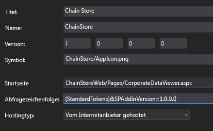
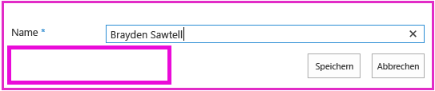
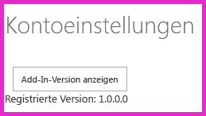

# <a name="add-first-run-logic-to-the-provider-hosted-add-in"></a><span data-ttu-id="23b27-103">Hinzufügen der Logik für die erste Ausführung zum vom Anbieter gehosteten Add-In</span><span class="sxs-lookup"><span data-stu-id="23b27-103">Add first-run logic to the provider-hosted add-in</span></span>

<span data-ttu-id="23b27-104">Dies ist der achte in einer Reihe von Artikeln über die Grundlagen der Entwicklung von vom Anbieter gehosteten SharePoint-Add-Ins. Sie sollten sich zuerst mit [SharePoint Add-Ins](sharepoint-add-ins.md) und den vorherigen Artikeln in dieser Reihe vertraut machen:</span><span class="sxs-lookup"><span data-stu-id="23b27-104">This is the eighth in a series of articles about the basics of developing provider-hosted SharePoint Add-ins. You should first be familiar with  [SharePoint Add-ins](sharepoint-add-ins.md) and the previous articles in this series:</span></span>

-  [<span data-ttu-id="23b27-105">Erste Schritte beim Erstellen von von einem Anbieter gehosteten SharePoint-Add-Ins</span><span class="sxs-lookup"><span data-stu-id="23b27-105">Get started creating provider-hosted SharePoint Add-ins</span></span>](get-started-creating-provider-hosted-sharepoint-add-ins.md)
-  [<span data-ttu-id="23b27-106">Übertragen des SharePoint-Aussehens und -Verhaltens auf Ihr vom Anbieter gehostetes Add-In</span><span class="sxs-lookup"><span data-stu-id="23b27-106">Give your provider-hosted add-in the SharePoint look-and-feel</span></span>](give-your-provider-hosted-add-in-the-sharepoint-look-and-feel.md)
-  [<span data-ttu-id="23b27-107">Einfügen einer benutzerdefinierten Schaltfläche in das vom Anbieter gehostete Add-In</span><span class="sxs-lookup"><span data-stu-id="23b27-107">Include a custom button in the provider-hosted add-in</span></span>](include-a-custom-button-in-the-provider-hosted-add-in.md)
-  [<span data-ttu-id="23b27-108">Schnelle Übersicht über das SharePoint-Objektmodell</span><span class="sxs-lookup"><span data-stu-id="23b27-108">Get a quick overview of the SharePoint object model</span></span>](get-a-quick-overview-of-the-sharepoint-object-model.md)
-  [<span data-ttu-id="23b27-109">Hinzufügen von SharePoint-Schreibvorgängen zum vom Anbieter gehosteten Add-In</span><span class="sxs-lookup"><span data-stu-id="23b27-109">Add SharePoint write operations to the provider-hosted add-in</span></span>](add-sharepoint-write-operations-to-the-provider-hosted-add-in.md)
-  [<span data-ttu-id="23b27-110">Einfügen eines Add-In-Webparts in das vom Anbieter gehostete Add-In</span><span class="sxs-lookup"><span data-stu-id="23b27-110">Include an add-in part in the provider-hosted add-in</span></span>](include-an-add-in-part-in-the-provider-hosted-add-in.md)
-  [<span data-ttu-id="23b27-111">Verarbeiten von Add-In-Ereignissen im vom Anbieter gehosteten Add-In</span><span class="sxs-lookup"><span data-stu-id="23b27-111">Handle add-in events in the provider-hosted add-in</span></span>](handle-add-in-events-in-the-provider-hosted-add-in.md)

> [!NOTE]
> <span data-ttu-id="23b27-112">Wenn Sie unsere Artikelreihe zum Thema anbietergehostete Add-Ins durchgearbeitet haben, haben Sie bereits eine Visual Studio-Lösung, die Sie für diesen Artikel verwenden können.</span><span class="sxs-lookup"><span data-stu-id="23b27-112">Note  If you have been working through this series about provider-hosted add-ins, then you have a Visual Studio solution that you can use to continue with this topic. You can also download the repository at  SharePoint_Provider-hosted_Add-Ins_Tutorials and open the BeforeAdd-inPart.sln file.</span></span> <span data-ttu-id="23b27-113">Sie können auch das Repository unter [SharePoint_Provider-hosted_Add-Ins_Tutorials](https://github.com/OfficeDev/SharePoint_Provider-hosted_Add-ins_Tutorials) herunterladen und die Datei „BeforeFirstRunLogic.sln“ öffnen.</span><span class="sxs-lookup"><span data-stu-id="23b27-113">You can also download the repository at [SharePoint_Provider-hosted_Add-Ins_Tutorials](https://github.com/OfficeDev/SharePoint_Provider-hosted_Add-ins_Tutorials) and open the BeforeFirstRunLogic.sln file.</span></span>

<span data-ttu-id="23b27-114">In diesem Artikel fügen Sie Code zur Startseite des ChainStore-SharePoint-Add-Ins hinzu, der überprüft, ob die aktuelle Instanz des Add-Ins zum ersten Mal ausgeführt wird.</span><span class="sxs-lookup"><span data-stu-id="23b27-114">In this article you add code to the start page of the Chain Store SharePoint Add-in that checks to see if the current instance of the add-in is being run for the first time. If it is the first time, your code will deploy the  Local Employees list and the custom ribbon button.</span></span> <span data-ttu-id="23b27-115">Wenn es das erste Mal ist, stellt Ihr Code die Liste **Lokale Mitarbeiter** und die benutzerdefinierte Menübandschaltfläche bereit.</span><span class="sxs-lookup"><span data-stu-id="23b27-115">If it is the first time, your code deploys the **Local Employees** list and the custom ribbon button.</span></span>

## <a name="create-the-basic-class-for-deploying-sharepoint-components"></a><span data-ttu-id="23b27-116">Erstellen der Basisklasse für die Bereitstellung von SharePoint-Komponenten</span><span class="sxs-lookup"><span data-stu-id="23b27-116">Create the basic class for deploying SharePoint components</span></span>

> [!NOTE]
> <span data-ttu-id="23b27-117">Die Einstellungen für Startprojekte in Visual Studio werden in der Regel nach jedem erneuten Öffnen der Lösung wieder auf die Standardwerte zurückgesetzt.</span><span class="sxs-lookup"><span data-stu-id="23b27-117">NOTE The settings for Startup Projects in Visual Studio tend to revert to defaults whenever the solution is reopened. Always take these steps immediately after reopening the sample solution in this series of articles:</span></span> <span data-ttu-id="23b27-118">Wann immer Sie beim Durcharbeiten dieser Artikelreihe die Beispiellösung erneut öffnen, müssen Sie umgehend die folgenden Schritte durchführen:</span><span class="sxs-lookup"><span data-stu-id="23b27-118">Note  The settings for Startup Projects in Visual Studio tend to revert to defaults whenever the solution is reopened. Always take these steps immediately after reopening the sample solution in this series of articles:</span></span> 
> 1. <span data-ttu-id="23b27-119">Klicken Sie oben im **Projektmappen-Explorer** mit der rechten Maustaste auf den Lösungsknoten, und wählen Sie die Option **Startprojekte festlegen** aus.</span><span class="sxs-lookup"><span data-stu-id="23b27-119">Right-click the solution node at the top of  **Solution Explorer** and select **Set startup projects**.</span></span>  
> 2. <span data-ttu-id="23b27-120">Stellen Sie sicher, dass alle drei Projekte in der Spalte **Aktion** auf **Start** festgelegt sind.</span><span class="sxs-lookup"><span data-stu-id="23b27-120">Make sure all three projects are set to  **Start** in the **Action** column.</span></span>

1. <span data-ttu-id="23b27-121">Klicken Sie im **ChainStoreWeb**-Projekt im **Projektmappen-Explorer** mit der rechten Maustaste auf den Ordner **Dienstprogramme**, und wählen Sie dann **Hinzufügen** > **Vorhandenes Element** aus.</span><span class="sxs-lookup"><span data-stu-id="23b27-121">In the  ChainStoreWeb project in Solution Explorer, right-click the  Utilities folder and select Add | Existing Item.</span></span>
    
2. <span data-ttu-id="23b27-122">Wechseln Sie vom **Datei-Explorer** zum Projektmappenordner, dem **ChainStoreWeb**-Ordner, und öffnen Sie dann den Ordner **Dienstprogramme**.</span><span class="sxs-lookup"><span data-stu-id="23b27-122">In the  **File Explorer** that opens navigate to the solution folder, the **ChainStoreWeb** folder, and then open the **Utilities** folder.</span></span>

3. <span data-ttu-id="23b27-123">Wählen Sie „SharePointComponentDeployer.cs“ aus, und wählen Sie dann **Hinzufügen** aus.</span><span class="sxs-lookup"><span data-stu-id="23b27-123">Select SharePointComponentDeployer.cs and press **Add**.</span></span>

4. <span data-ttu-id="23b27-p104">Öffnen Sie die Datei SharePointComponentDeployer.cs. Sie enthält eine statische Klasse und zwei statische Methoden, die die Add-In-Version in der Tabelle **Mandanten** der Unternehmensdatenbank abrufen und festlegen. Diese Methoden werden nicht besprochen, da diese Artikelreihe nicht dafür vorgesehen ist, Kenntnissse der ASP.NET- oder SQL Server-/Azure-Programmierung zu vermitteln.</span><span class="sxs-lookup"><span data-stu-id="23b27-p104">Open the file SharePointComponentDeployer.cs. It has a static class and two static methods that get and set the add-in's version in the **Tenants** table of the corporate database. We won't discuss these methods because this series of articles is not intended to teach ASP.NET or SQL Server/Azure programming.</span></span>

5. <span data-ttu-id="23b27-127">Fügen Sie die folgenden **using**-Anweisungen an den Anfang der Datei hinzu.</span><span class="sxs-lookup"><span data-stu-id="23b27-127">Add the following **using** statements to the top of the file.</span></span>
    
    ```C#
      using System.Web;
      using System.Linq;
      using System.Collections.Generic;
      using Microsoft.SharePoint.Client;
    ```

6. <span data-ttu-id="23b27-128">Fügen Sie am oberen Rand der `SharePointComponentDeployer`-Klasse die folgenden zwei statischen Felder hinzu.</span><span class="sxs-lookup"><span data-stu-id="23b27-128">At the top of the `SharePointComponentDeployer` class, add the following two static fields.</span></span> <span data-ttu-id="23b27-129">Diese werden in der **Page_Load**-Methode der Add-In-Startseite initialisiert (Sie fügen den Code in einem späteren Schritt hinzu).</span><span class="sxs-lookup"><span data-stu-id="23b27-129">Both of these are initialized in the **Page_Load** method of the add-in's start page (you add that code in a later step).</span></span> 

    ```C#
      internal static SharePointContext sPContext;
      internal static Version localVersion;
    ```

   <span data-ttu-id="23b27-130">Beachten Sie Folgendes zu diesem Code:</span><span class="sxs-lookup"><span data-stu-id="23b27-130">Note the following about this code:</span></span>
   
   - <span data-ttu-id="23b27-131">Das erste Feld enthält das `SharePointContext`-Objekt, das erforderlich ist, um CRUD-Vorgänge in SharePoint durchzuführen.</span><span class="sxs-lookup"><span data-stu-id="23b27-131">The first field holds the `SharePointContext` object that is needed to make CRUD operations on SharePoint.</span></span> 
   
   - <span data-ttu-id="23b27-132">Das zweite Feld enthält die Versionsnummer des Add-Ins, das im Hostweb installiert ist.</span><span class="sxs-lookup"><span data-stu-id="23b27-132">The second field holds the version number of the add-in that is installed on the host web.</span></span> <span data-ttu-id="23b27-133">Dieser Wert weicht anfänglich vom Standardwert (**0000.0000.0000.0000**) ab, der in der **Mandanten**-Tabelle aufgezeichnet wird, wenn der Installationshandler den Mandanten registriert.</span><span class="sxs-lookup"><span data-stu-id="23b27-133">This value is initially different from the default value (**0000.0000.0000.0000**) that is recorded in the corporate **Tenants** table when the installation handler registers the tenant.</span></span> <span data-ttu-id="23b27-134">Die erste Version des Add-Ins lautet z. B. **1.0.0.0**.</span><span class="sxs-lookup"><span data-stu-id="23b27-134">For example, the first version of the add-in will be **1.0.0.0**.</span></span>

7. <span data-ttu-id="23b27-p107">Erstellen Sie die folgende statische Eigenschaft für die Version des Add-Ins, die derzeit in der Tabelle **Mandanten** des Unternehmens aufgezeichnet ist. Sie verwendet die zwei Methoden, die bereits in der Datei vorhanden waren, um diesen Wert abzurufen und festzulegen.</span><span class="sxs-lookup"><span data-stu-id="23b27-p107">Create the following static property to hold the version of the add-in that is currently recorded in the corporate **Tenants** table. It uses the two methods that were already in the file to get and set this value.</span></span>
    
    ```C#
      internal static Version RemoteTenantVersion
    {
        get
        {
            return GetTenantVersion();
        }
        set
        {
            SetTenantVersion(value);
        }
    }
    ```

8. <span data-ttu-id="23b27-137">Erstellen Sie nun die folgende `IsDeployed`-Eigenschaft.</span><span class="sxs-lookup"><span data-stu-id="23b27-137">Now create the following  `IsDeployed` property. Note the following about this code:</span></span> 

    ```C#
      public static bool IsDeployed
    {
        get
        {
            if (RemoteTenantVersion < localVersion)
                return false; 
            else
                return true; 
        }
    }
    ```

   <span data-ttu-id="23b27-138">Beachten Sie Folgendes zu diesem Code:</span><span class="sxs-lookup"><span data-stu-id="23b27-138">Note the following about this code:</span></span>

   - <span data-ttu-id="23b27-139">Die **Page_Load**-Methode für die Stadtseite des Add-Ins verwendet den Wert dieser Eigenschaft, um zu bestimmen, ob das Add-In zum ersten Mal ausgeführt wird.</span><span class="sxs-lookup"><span data-stu-id="23b27-139">The  **Page_Load** method of the add-in's start page will use the value of this property to determine whether or not the add-in is running for the first time. A false value signals that the add-in has not run before on the current host web, so its components need to be deployed.</span></span> <span data-ttu-id="23b27-140">Der Wert **false** besagt, dass das Add-In zuvor noch nicht auf dem aktuellen Hostweb ausgeführt wurde, also müssen die Komponenten bereitgestellt werden.</span><span class="sxs-lookup"><span data-stu-id="23b27-140">The  Page_Load method of the add-in's start page will use the value of this property to determine whether or not the add-in is running for the first time. A **false** value signals that the add-in has not run before on the current host web, so its components need to be deployed.</span></span>

   - <span data-ttu-id="23b27-141">Dabei ist das entscheidende Kriterium, ob die Versionsnummer in der **Mandanten**-Tabelle niedriger als die aktuell installierte Version ist.</span><span class="sxs-lookup"><span data-stu-id="23b27-141">The criterion is whether the version number registered in the **Tenants** table is lower than the version actually installed.</span></span> <span data-ttu-id="23b27-142">Wenn das Add-In zum ersten Mal ausgeführt wird, ist die Version niedriger.</span><span class="sxs-lookup"><span data-stu-id="23b27-142">The first time the add-in runs, it is lower.</span></span> <span data-ttu-id="23b27-143">Code, den Sie in einem späteren Schritt schreiben, legt die Version in der **Mandanten**-Tabelle auf die gleiche Version wie die tatsächlich installierte fest. Wenn das Add-In also erneut ausgeführt wird, gibt `IsDeployed` den Wert **true** zurück und die Bereitstellungslogik wird nicht noch einmal ausgeführt.</span><span class="sxs-lookup"><span data-stu-id="23b27-143">The criterion is whether or not the version number registered in the  Tenants table is lower than the version actually installed. The first time the add-in runs, it will be lower. Code that you write in a later step sets the version in the Tenants table to the same version as is actually installed, so when the add-in runs again,  will return true and the deployment logic will not execute again.</span></span>
 
9. <span data-ttu-id="23b27-144">Fügen Sie der Klasse `SharePointComponentDeployer` die folgende Methode hinzu:</span><span class="sxs-lookup"><span data-stu-id="23b27-144">Add the following method to the  `SharePointComponentDeployer` class.</span></span> <span data-ttu-id="23b27-145">Beachten Sie, dass die letzte Aktion, die die Methode ausführt, das Aktualisieren der Mandantenversion ist, die in der Datenbank des Unternehmens registriert ist (**0000.0000.0000.0000**), damit sie mit der aktuellen Version des Add-Ins im Hostweb übereinstimmt (**1.0.0.0**).</span><span class="sxs-lookup"><span data-stu-id="23b27-145">Add the following method to the SharePointComponentDeployer class. Note that the last thing the method does is update the registered tenant version in the corporate database (0000.0000.0000.0000) to match the actual version of the add-in on the host web (1.0.0.0). You will complete this method in a later step.</span></span> <span data-ttu-id="23b27-146">Sie schließen diese Methode in einem späteren Schritt ab.</span><span class="sxs-lookup"><span data-stu-id="23b27-146">You will complete this method in a later step.</span></span>
    
    ```C#
      internal static void DeployChainStoreComponentsToHostWeb(HttpRequest request)
    {
        // TODO4: Deployment code goes here.

        RemoteTenantVersion = localVersion;
    }
    ```

> [!NOTE]
> <span data-ttu-id="23b27-147">Sie Fragen sich nun vielleicht, warum das Add-In den „Versionsnummer niedriger als“-Test durchführt, um die Antwort auf die einfache Ja/Nein-Frage: „Wird das Add-in zum ersten Mal ausgeführt?“ zu bestimmen.</span><span class="sxs-lookup"><span data-stu-id="23b27-147">You may wonder now why the add-in uses version numbers and a "less than" test to determine the answer to a simple yes/no question: "Is the add-in running for the first time?"</span></span> <span data-ttu-id="23b27-148">Wir könnten auch ein einfaches Zeichenfolgefeld in der **Mandanten**-Tabelle verwenden, das im Installationshandler auf *Noch nicht ausgeführt* gesetzt und dann von der „Erste Ausführung“-Logik auf *Bereits einmal ausgeführt* festgelegt wird, nachdem die SharePoint-Komponenten bereitgestellt wurden.</span><span class="sxs-lookup"><span data-stu-id="23b27-148">Note You may wonder now why the add-in uses version numbers and a "less than" test to determine the answer to a simple yes/no question: is the add-in running for the first time? We could just as well have a simple string field in the Tenants table that is set to "not run yet" in the installation handler, and then changed to "already run once" by the first-run logic after the SharePoint components are deployed.</span></span> 

> <span data-ttu-id="23b27-149">Für das ChainStore-Add-In funktioniert ein einfacher Test.</span><span class="sxs-lookup"><span data-stu-id="23b27-149">For the Chain Store add-in, a simple test would work.</span></span> <span data-ttu-id="23b27-150">Es empfiehlt sich jedoch im Allgemeinen, Versionsnummern zu verwenden. Der Grund ist, dass ein Produktions-Add-In in Zukunft wahrscheinlich direkt aktualisiert wird, d. h. nachdem es bereits installiert wurde.</span><span class="sxs-lookup"><span data-stu-id="23b27-150">However, it is generally a good practice to use version numbers because a production add-in is likely to be updated-in-place in the future; that is, updated after it is already installed.</span></span> <span data-ttu-id="23b27-151">Dann muss Ihre Add-In-Logik auf mehr als die zwei Möglichkeiten *Noch nicht ausgeführt* und *Bereits einmal ausgeführt* reagieren können.</span><span class="sxs-lookup"><span data-stu-id="23b27-151">When that time comes, your add-in logic needs to be sensitive to more than the two possibilities *not-yet-run* and *already-run-once*.</span></span> 

> <span data-ttu-id="23b27-152">Angenommen Sie möchten beispielsweise eine weitere Liste zum Hostweb im Upgrade von Version 1.0.0.0 auf 2.0.0.0 hinzufügen.</span><span class="sxs-lookup"><span data-stu-id="23b27-152">Suppose, for example, that you want to add an additional list to the host web in the upgrade from version 1.0.0.0 to 2.0.0.0.</span></span> <span data-ttu-id="23b27-153">Sie könnten dies mit einem Updateereignishandler durchführen oder in einer „Erste Ausführung nach Update"-Logik.</span><span class="sxs-lookup"><span data-stu-id="23b27-153">You could do this in an update event handler, or in first-run-after-update logic.</span></span> <span data-ttu-id="23b27-154">In beiden Fällen muss Ihre Bereitstellungslogik neue Komponenten bereitstellen, aber auch vermeiden, dass versucht wird, Komponenten erneut bereitzustellen, die in einer früheren Version des Add-Ins bereitgestellt wurden.</span><span class="sxs-lookup"><span data-stu-id="23b27-154">Either way, your deployment logic needs to deploy new components, but it also needs to avoid trying to redeploy components that were deployed in a previous version of the add-in.</span></span> <span data-ttu-id="23b27-155">Die Versionsnummer 1.0.0.0 würde signalisieren, dass die Komponenten der Version 1.0.0.0 bereitgestellt wurden, aber die Logik für die erste Ausführung nach dem Update noch nicht ausgeführt wurde.</span><span class="sxs-lookup"><span data-stu-id="23b27-155">A version number of 1.0.0.0 signals that the components of version 1.0.0.0 have been deployed, but that the first-run-after-update logic has not yet run.</span></span>

## <a name="add-the-basic-startup-logic"></a><span data-ttu-id="23b27-156">Hinzufügen der grundlegenden Startlogik</span><span class="sxs-lookup"><span data-stu-id="23b27-156">Add the basic startup logic</span></span>

<span data-ttu-id="23b27-157">Das SharePoint-Hostweb muss der Remote-Webanwendung mitteilen, welche Version des Add-Ins installiert ist.</span><span class="sxs-lookup"><span data-stu-id="23b27-157">The SharePoint host web needs to tell the remote web application what version of the add-in it has installed.</span></span> <span data-ttu-id="23b27-158">Zu diesem Zweck verwenden wir einen Abfrageparameter.</span><span class="sxs-lookup"><span data-stu-id="23b27-158">We use a query parameter to do this.</span></span> 

1. <span data-ttu-id="23b27-159">Öffnen Sie im **ChainStore**-Projekt die Datei „AppManifest.xml“.</span><span class="sxs-lookup"><span data-stu-id="23b27-159">In  Solution Explorer, open the AppManifest.xml file in the  **ChainStore** project.</span></span> <span data-ttu-id="23b27-160">Im Designer finden Sie den Platzhalter *{StandardTokens}* als Wert für das **Abfragezeichenfolge**-Feld.</span><span class="sxs-lookup"><span data-stu-id="23b27-160">In the designer, you see the placeholder *{StandardTokens}* as the value of the **Query string** box.</span></span> <span data-ttu-id="23b27-161">Fügen Sie die Zeichenfolge `"&amp;SPAddInVersion=1.0.0.0"` zum Textende hinzu.</span><span class="sxs-lookup"><span data-stu-id="23b27-161">Add the string `"&amp;SPAddInVersion=1.0.0.0"` to the end.</span></span> 

   <span data-ttu-id="23b27-162">Der Manifest-Designer sollte ähnlich wie im folgenden Beispiel aussehen.</span><span class="sxs-lookup"><span data-stu-id="23b27-162">The calendar should look similar to the following:</span></span> <span data-ttu-id="23b27-163">*Beachten Sie, dass die Versionsnummer, die Sie in der Abfragezeichenfolge übergeben haben, dem Wert des Feldes __Version__ des Designers entsprechen muss.*</span><span class="sxs-lookup"><span data-stu-id="23b27-163">*Notice that the version number you pass in the query string has to match the value in the __Version__ box of the designer.*</span></span> <span data-ttu-id="23b27-164">Wenn Sie das Add-In aktualisieren sollten, müssen Sie diese beiden Werte auf den gleichen Wert erhöhen.</span><span class="sxs-lookup"><span data-stu-id="23b27-164">If you ever update the add-in, one of your tasks is to raise these two values and keep them the same.</span></span>

   <span data-ttu-id="23b27-165">*Abbildung 1. Registerkarte „Allgemein“ des Manifest-Designers*</span><span class="sxs-lookup"><span data-stu-id="23b27-165">*Figure 1. General tab of the manifest designer*</span></span>

   

2. <span data-ttu-id="23b27-169">Öffnen Sie die Datei „CorporateDataViewer.aspx.cs“, und fügen Sie den folgenden Code zur Methode **Page_Load** hinzu, direkt unter der Zeile, die das `spContext`-Objekt initialisiert.</span><span class="sxs-lookup"><span data-stu-id="23b27-169">Open the CorporateDataViewer.aspx.cs file and add the following code to the  **Page_Load** method, just below the line that initializes the `spContext` object. Note the following about this code:</span></span> 

    ```C#
     SharePointComponentDeployer.sPContext = spContext;
     SharePointComponentDeployer.localVersion = new Version(Request.QueryString["SPAddInVersion"]);

     if (!SharePointComponentDeployer.IsDeployed)
     {
         SharePointComponentDeployer.DeployChainStoreComponentsToHostWeb(Request);
     }
    ```

   <span data-ttu-id="23b27-170">Beachten Sie Folgendes zu diesem Code:</span><span class="sxs-lookup"><span data-stu-id="23b27-170">Note the following about this code:</span></span>

   - <span data-ttu-id="23b27-171">Er beginnt mit der Festlegung der zwei statischen Felder in der statischen `SharePointComponentDeployer`-Klasse. </span><span class="sxs-lookup"><span data-stu-id="23b27-171">It begins by setting the two static fields in the static `SharePointComponentDeployer` class.</span></span> <span data-ttu-id="23b27-172">Er übergibt das Objekt **SharePointContext**, da der Code in `SharePointComponentDeployer`SharePoint aufruft und den Abfrageparameter verwendet, den Sie hinzugefügt haben, um die Eigenschaft `localVersion` festzulegen.</span><span class="sxs-lookup"><span data-stu-id="23b27-172">It begins by setting the two static fields in the static   class. It passes the SharePointContext object because the code in the  will be calling into SharePoint, and it uses the query parameter that you added to set the  property.</span></span>  

   - <span data-ttu-id="23b27-173">Es geschieht nichts, wenn `IsDeployed` „true“ ist, d. h., wenn die erste Ausführungslogik bereits ausgeführt wurde.</span><span class="sxs-lookup"><span data-stu-id="23b27-173">It does nothing if  `IsDeployed` is true; that is, if the "first run" logic has already run. Otherwise it calls the deployment method and passes the ASP.NET Request object.</span></span> <span data-ttu-id="23b27-174">Andernfalls wird die Bereitstellungsmethode aufgegeben, die das ASP.NET-**Anforderungs**objekt übergibt.</span><span class="sxs-lookup"><span data-stu-id="23b27-174">It does nothing if  **** is true; that is, if the "first run" logic has already run. Otherwise it calls the deployment method and passes the ASP.NET Request object.</span></span>

## <a name="programmatically-deploy-a-sharepoint-list"></a><span data-ttu-id="23b27-175">Programmgesteuertes Bereitstellen einer SharePoint-Liste</span><span class="sxs-lookup"><span data-stu-id="23b27-175">Programmatically deploy a SharePoint list</span></span>

1. <span data-ttu-id="23b27-176">Ersetzen Sie in der Datei „SharePointComponentDeployer.cs“ `TODO4` durch die folgende Zeile. (Im nächsten Schritt erstellen Sie diese Methode.)</span><span class="sxs-lookup"><span data-stu-id="23b27-176">In the SharePointComponentDeployer.cs file, replace the  `TODO4` with the following line. You create this method in the next step.</span></span>
    
    ```C#
      CreateLocalEmployeesList();
    ```

2. <span data-ttu-id="23b27-177">Fügen Sie der Klasse `SharePointComponentDeployer` die folgende Methode hinzu:</span><span class="sxs-lookup"><span data-stu-id="23b27-177">Add the following method to the  `SharePointComponentDeployer` class.</span></span> 

    ```C#
      private static void CreateLocalEmployeesList()
    {
        using (var clientContext = sPContext.CreateUserClientContextForSPHost())
        {
            var query = from list in clientContext.Web.Lists
                        where list.Title == "Local Employees"
                        select list;
            IEnumerable<List> matchingLists = clientContext.LoadQuery(query);
            clientContext.ExecuteQuery();

            if (matchingLists.Count() == 0)
            {
               // TODO5: Create the list 

               // TODO6: Rename the Title field on the list 

               // TODO7: Add "Added to Corporate DB" field to the list 

               clientContext.ExecuteQuery();
            }
        }
    }
    ```

   <span data-ttu-id="23b27-178">Beachten Sie Folgendes zu diesem Code:</span><span class="sxs-lookup"><span data-stu-id="23b27-178">Note the following about this code:</span></span>

   - <span data-ttu-id="23b27-p120">Er enthält zwei Aufrufe von **ExecuteQuery**. Die erste ist erforderlich, um festzustellen, ob die Liste bereits vorhanden ist. Die zweite erstellt die Liste.</span><span class="sxs-lookup"><span data-stu-id="23b27-p120">It has two calls of **ExecuteQuery**. The first is needed to determine if the list already exists. The second does the work of creating the list.</span></span>

   - <span data-ttu-id="23b27-182">Die Methode **ClientContext.LoadQuery** ist vergleichbar mit **ClientContext.Load**-Methode, mit der Ausnahme, dass keine Entität wie z. B. eine Liste, sondern die aufzählbaren Ergebnisse einer Abfrage auf den Client gebracht werden.</span><span class="sxs-lookup"><span data-stu-id="23b27-182">The **ClientContext.LoadQuery** method is similar to the **ClientContext.Load** except that instead of bringing an entity, such as a list, down to the client, it brings down the enumerable results of a query.</span></span>

3. <span data-ttu-id="23b27-183">Ersetzen Sie `TODO5` durch den folgenden Code.</span><span class="sxs-lookup"><span data-stu-id="23b27-183">Replace  `TODO5` with the following code.</span></span> 

    ```C#
      ListCreationInformation listInfo = new ListCreationInformation();
      listInfo.Title = "Local Employees";
      listInfo.TemplateType = (int)ListTemplateType.GenericList;
      listInfo.Url = "Lists/Local Employees";
      List localEmployeesList = clientContext.Web.Lists.Add(listInfo);
    ```

   <span data-ttu-id="23b27-184">Beachten Sie Folgendes zu diesem Code:</span><span class="sxs-lookup"><span data-stu-id="23b27-184">Note the following about this code:</span></span>

   - <span data-ttu-id="23b27-185">Die **ListCreationInformation**-Klasse ist vergleichbar mit der **ListItemCreationInformation**-Klasse, die Sie in einem vorherigen Artikel dieser Reihe bereits gesehen haben.</span><span class="sxs-lookup"><span data-stu-id="23b27-185">The  **ListCreationInformation** class is similar to the **ListItemCreationInformation** class you saw in an earlier article in this series. It is a lightweight class more suitable for sending information from the web application to SharePoint than the full List class.</span></span> <span data-ttu-id="23b27-186">Es handelt sich um eine einfache Klasse, die zum Übersenden von Informationen von der Webanwendung zu SharePoint besser geeignet ist, als die vollständige **Listen**-Klasse.</span><span class="sxs-lookup"><span data-stu-id="23b27-186">The ListCreationInformation class is similar to the ListItemCreationInformation class you saw in an earlier article in this series. It is a lightweight class more suitable for sending information from the web application to SharePoint than the full **List** class.</span></span>

   - <span data-ttu-id="23b27-p122">Es gibt viele Arten von Listenvorlagen, z. B. den Typ „Aufgaben" für eine To-Do-Liste und den Typ „Ereignisse" für einen Kalender. Die Liste **Lokale Mitarbeiter**basiert auf der einfachsten Art: dem Typ „Generisch".</span><span class="sxs-lookup"><span data-stu-id="23b27-p122">There are many types of list templates, such as the Tasks type for a "to do" list and the Events type for a calendar. The **Local Employees** list is based on the simplest: the Generic type.</span></span>

   - <span data-ttu-id="23b27-189">Die **ListCreationInformation.Url**-Eigenschaft enthält die URL der Liste *relativ* zum Hostweb.</span><span class="sxs-lookup"><span data-stu-id="23b27-189">The **ListCreationInformation.Url** property holds the URL of the list *relative*  to the host web. By specifying "Lists/LocalEmployees", the code is setting the full URL of the list to https:// {SharePointDomain}  /hongkong/_layouts/15/start.aspx#/Lists/Local%20Employees.</span></span> <span data-ttu-id="23b27-190">Durch die Angabe von `"Lists/LocalEmployees"` setzt der Code die vollständige URL auf `https://{SharePointDomain}/hongkong/_layouts/15/start.aspx#/Lists/Local%20Employees`.</span><span class="sxs-lookup"><span data-stu-id="23b27-190">By specifying `"Lists/LocalEmployees"`, the code is setting the full URL of the list to `https://{SharePointDomain}/hongkong/_layouts/15/start.aspx#/Lists/Local%20Employees`.</span></span>

4. <span data-ttu-id="23b27-191">Ersetzen Sie `TODO6` mit dem folgenden Code, der den öffentlichen Namen des Felds „Titel“ (Spalte) zu „Name“ ändert.</span><span class="sxs-lookup"><span data-stu-id="23b27-191">Replace  `TODO6` with the following code which changes the public name of the "Title" field (column) from "Title" to "Name". This is what you did on the List Settings page when you created the list manually.</span></span> <span data-ttu-id="23b27-192">Dies haben Sie auf der Seite **Listeneinstellungen** getan, als Sie die Liste manuell erstellt haben.</span><span class="sxs-lookup"><span data-stu-id="23b27-192">Replace   with the following code which changes the public name of the "Title" field (column) from "Title" to "Name". This is what you did on the **List Settings** page when you created the list manually.</span></span>
    
    ```C#
      Field field = localEmployeesList.Fields.GetByInternalNameOrTitle("Title");
      field.Title = "Name";
      field.Update();
    ```

5. <span data-ttu-id="23b27-193">Sie können auch manuell ein Feld namens **Zur Unternehmensdatenbank hinzugefügt** erstellen.</span><span class="sxs-lookup"><span data-stu-id="23b27-193">You also manually created a field named **Added to Corporate DB**.</span></span> <span data-ttu-id="23b27-194">Fügen Sie den folgenden Code anstelle von `TODO7` ein, um dies programmgesteuert durchzuführen.</span><span class="sxs-lookup"><span data-stu-id="23b27-194">To do that programmatically, add the following code in place of  `TODO7`.</span></span> 

    ```C#
          localEmployeesList.Fields.AddFieldAsXml("<Field DisplayName='Added to Corporate DB'"
                                                 +"Type='Boolean'>"
                                                 + "<Default>FALSE</Default></Field>",
                                                 true,
                                                 AddFieldOptions.DefaultValue);
    ```

   <span data-ttu-id="23b27-195">Beachten Sie Folgendes zu diesem Code:</span><span class="sxs-lookup"><span data-stu-id="23b27-195">Note the following about this code:</span></span>

   - <span data-ttu-id="23b27-196">Die wichtigsten Eigenschaften des Felds werden mit einem XML-Blob angegeben.</span><span class="sxs-lookup"><span data-stu-id="23b27-196">The key properties of the field are specified with an XML blob.</span></span> <span data-ttu-id="23b27-197">Dies ist eine Legacy der SharePoint-Architektur, in der Websites, Listen, Felder, Inhaltstypen und die meisten anderen Arten von SharePoint-Komponenten im XML-Format definiert sind.</span><span class="sxs-lookup"><span data-stu-id="23b27-197">The key properties of the field are specified with an XML blob. This is a legacy of SharePoint's architecture: websites, lists, fields, content types, and most other kinds of SharePoint components are defined as XML. In this case we are specifying the display name, data type, and default value of the field.</span></span> <span data-ttu-id="23b27-198">In diesem Fall haben wir den Anzeigename, den Datentyp und den Standardwert des Felds angegeben.</span><span class="sxs-lookup"><span data-stu-id="23b27-198">In this case, we specify the display name, data type, and default value of the field.</span></span>

   - <span data-ttu-id="23b27-199">Der zweite Parameter bestimmt, ob das Feld in der Standardansicht der Liste angezeigt wird.</span><span class="sxs-lookup"><span data-stu-id="23b27-199">The second parameter determines whether the field is visible in the default view of the list. We're setting it to  true.</span></span> <span data-ttu-id="23b27-200"> Er wird auf **true** festgelegt.</span><span class="sxs-lookup"><span data-stu-id="23b27-200">We set it to **true**.</span></span> 

   - <span data-ttu-id="23b27-201">Der dritte Parameter bestimmt, welche Inhaltstypen dem Feld hinzugefügt werden.</span><span class="sxs-lookup"><span data-stu-id="23b27-201">The third parameter determines what content types the field is added to.</span></span> <span data-ttu-id="23b27-202">Das Übergeben des **Standardwerts** bedeutet, dass dieser nur zum Standard-Inhaltstyp der Liste hinzugefügt wird.</span><span class="sxs-lookup"><span data-stu-id="23b27-202">The third parameter can be used to determine what content types the field is added to. Passing  **DefaultValue** means that it is only added to the list's default content type.</span></span>


6. <span data-ttu-id="23b27-203">Denken Sie daran, dass **Zur Unternehmensdatenbank hinzugefügt** standardmäßig **Nein** (d. h. „false“) ist, die Schaltfläche des benutzerdefinierten Menübands des Add-Ins den Wert jedoch auf **Ja** setzt, nachdem der Mitarbeiter zur Unternehmensdatenbank hinzugefügt wurde.</span><span class="sxs-lookup"><span data-stu-id="23b27-203">Recall that the **Added to Corporate DB** is **No** (that is, false) by default, but the custom ribbon button in the add-in sets it to **Yes** after it adds the employee to the corporate database.</span></span> <span data-ttu-id="23b27-204">Dieses System funktioniert am besten, wenn Benutzer den Wert des Felds nicht manuell ändern können.</span><span class="sxs-lookup"><span data-stu-id="23b27-204">This system works best only if users cannot manually change the value of the field.</span></span> <span data-ttu-id="23b27-205">Um dies sicherzustellen, blenden Sie das Feld in den Formularen für das Erstellen und Bearbeiten von Elementen in der Liste **Lokale Mitarbeiter** aus.</span><span class="sxs-lookup"><span data-stu-id="23b27-205">To ensure that they don't, make the field invisible in the forms for creating and editing items on the **Local Employees** list.</span></span> <span data-ttu-id="23b27-206">Dazu müssen Sie zwei weitere Attribute zum ersten Parameter hinzufügen, wie im folgenden Code dargestellt.</span><span class="sxs-lookup"><span data-stu-id="23b27-206">We do this by adding two more attributes to the first parameter, as shown in the following code.</span></span>
    
     ```C#
       localEmployeesList.Fields.AddFieldAsXml("<Field DisplayName='Added to Corporate DB'" 
                                              + " Type='Boolean'"  
                                              + " ShowInEditForm='FALSE' "
                                              + " ShowInNewForm='FALSE'>"
                                              + "<Default>FALSE</Default></Field>",
                                              true,
                                              AddFieldOptions.DefaultValue);
     ```
     
     
7. <span data-ttu-id="23b27-207">Die gesamte `CreateLocalEmployeesList` sollte jetzt wie folgt aussehen.</span><span class="sxs-lookup"><span data-stu-id="23b27-207">The entire  `CreateLocalEmployeesList` should now look like the following.</span></span>

    ```C#
           private static void CreateLocalEmployeesList()
         {
             using (var clientContext = sPContext.CreateUserClientContextForSPHost())
             {
                 var query = from list in clientContext.Web.Lists
                             where list.Title == "Local Employees"
                             select list;
                 IEnumerable<List> matchingLists = clientContext.LoadQuery(query);
                 clientContext.ExecuteQuery();

                 if (matchingLists.Count() == 0)
                 {
                     ListCreationInformation listInfo = new ListCreationInformation();
                     listInfo.Title = "Local Employees";
                     listInfo.TemplateType = (int)ListTemplateType.GenericList;
                     listInfo.Url = "LocalEmployees";
                     List localEmployeesList = clientContext.Web.Lists.Add(listInfo);

                     Field field = localEmployeesList.Fields.GetByInternalNameOrTitle("Title");
                     field.Title = "Name";
                     field.Update();

                     localEmployeesList.Fields.AddFieldAsXml("<Field DisplayName='Added to Corporate DB'" 
                                                             + " Type='Boolean'"  
                                                            + " ShowInEditForm='FALSE' "
                                                            + " ShowInNewForm='FALSE'>"
                                                            + "<Default>FALSE</Default></Field>",
                                                             true,
                                                             AddFieldOptions.DefaultValue);
                     clientContext.ExecuteQuery();
                 }
             }
         }
    ```

## <a name="temporarily-remove-the-custom-button-from-the-project"></a><span data-ttu-id="23b27-208">Vorübergehendes Entfernen der benutzerdefinierten Schaltfläche aus dem Projekt</span><span class="sxs-lookup"><span data-stu-id="23b27-208">Temporarily remove the custom button from the project</span></span>

<span data-ttu-id="23b27-209">Aus technischen Gründen, die wir im nächsten Artikel behandeln, kann die benutzerdefinierte Schaltfläche, die wir erstellt haben, nicht ohne Änderung installiert werden, wenn sie auf dem Menüband einer Liste eingefügt wird, die programmgesteuert bereitgestellt wird.</span><span class="sxs-lookup"><span data-stu-id="23b27-209">For technical reasons that we'll discuss in the next article, the custom button we created cannot be installed without modification when it is being put on the ribbon of a list that is programmatically deployed. We'll remove it temporarily from the project, so that we can test our first-run logic. We'll bring it back in the next article.</span></span> <span data-ttu-id="23b27-210">Wir müssen sie vorübergehend aus dem Projekt entfernen, damit wir unsere Logik für die erste Ausführung testen können.</span><span class="sxs-lookup"><span data-stu-id="23b27-210">We'll remove it temporarily from the project so that we can test our first-run logic.</span></span> <span data-ttu-id="23b27-211">Im nächsten Artikel wird die Schaltfläche wieder in das Menüband zurückgebracht.</span><span class="sxs-lookup"><span data-stu-id="23b27-211">We'll bring it back in the next article.</span></span>

- <span data-ttu-id="23b27-212">Klicken Sie im **Projektmappen-Explorer** im **ChainStore**-Projekt mit der rechten Maustaste auf den Knoten **AddEmployeeToCorpDB**, und wählen Sie dann **Aus Projekt ausschließen** aus.</span><span class="sxs-lookup"><span data-stu-id="23b27-212">In  **Solution Explorer**, in the  **ChainStore** project, right-click the **AddEmployeeToCorpDB** node and select **Exclude from Project**.</span></span>

## <a name="request-permission-to-manage-lists-on-the-host-web"></a><span data-ttu-id="23b27-213">Anfordern der Berechtigung zum Verwalten von Listen im Hostweb</span><span class="sxs-lookup"><span data-stu-id="23b27-213">Request permission to manage lists on the host web</span></span>

<span data-ttu-id="23b27-214">Da das Add-In jetzt eine Liste zum Hostweb und nicht nur Elemente zu einer vorhandenen Liste hinzufügt, müssen die Berechtigungen, die das Add-In anfordert, von „Schreiben" zu „Verwalten" eskaliert werden.</span><span class="sxs-lookup"><span data-stu-id="23b27-214">Since the add-in is now adding a list to the host web, not just items to an existing list, we need to escalate the permissions that the add-in requests from Write to Manage. Follow these steps.</span></span>

1. <span data-ttu-id="23b27-215">Öffnen Sie im **Projektmappen-Explorer** die Datei AppManifest.xml im **ChainStore**-Projekt.</span><span class="sxs-lookup"><span data-stu-id="23b27-215">In **Solution Explorer**, open the AppManifest.xml file in the **ChainStore** project.</span></span>

2. <span data-ttu-id="23b27-216">Behalten Sie auf der Registerkarte **Berechtigungen** für den Wert **Bereich** die Einstellung „Web“ bei, aber wählen Sie im Feld **Berechtigung** die Option **Verwalten** aus der Dropdownliste.</span><span class="sxs-lookup"><span data-stu-id="23b27-216">Open the **Permissions** tab and leave the **Scope** value at Web, but in the **Permission** field, select **Manage** from the drop down.</span></span>
 
3. <span data-ttu-id="23b27-217">Speichern Sie die Datei.</span><span class="sxs-lookup"><span data-stu-id="23b27-217">Save the file.</span></span>

## <a name="run-the-add-in-and-test-the-first-run-logic"></a><span data-ttu-id="23b27-218">Ausführen des Add-Ins und Testen der Logik für die erste Ausführung</span><span class="sxs-lookup"><span data-stu-id="23b27-218">Run the add-in and test the "first run" logic</span></span>

1. <span data-ttu-id="23b27-219">Öffnen Sie die Seite **Websiteinhalte** der Website des Hongkong-Stores, und entfernen Sie dann die Liste **Lokale Mitarbeiter**.</span><span class="sxs-lookup"><span data-stu-id="23b27-219">Open the  Site Contents page of the Hong Kong store's website and remove the  Local Employees list!</span></span> 

2. <span data-ttu-id="23b27-220">Drücken Sie auf die F5-TASTE, um Ihr Add-In bereitzustellen und auszuführen.</span><span class="sxs-lookup"><span data-stu-id="23b27-220">Use the F5 key to deploy and run your add-in.</span></span> <span data-ttu-id="23b27-221">Visual Studio hostet die Remotewebanwendung in IIS Express und die SQL-Datenbank in SQL Express.</span><span class="sxs-lookup"><span data-stu-id="23b27-221">Visual Studio hosts the remote web application in IIS Express and hosts the SQL database in SQL Express.</span></span> <span data-ttu-id="23b27-222">Zudem installiert Visual Studio das Add-In vorübergehend auf Ihrer SharePoint-Testwebsite und führt es sofort aus.</span><span class="sxs-lookup"><span data-stu-id="23b27-222">Use the F5 key to deploy and run your add-in. Visual Studio makes a temporary installation of the add-in on your test SharePoint site and immediately runs the add-in.</span></span> <span data-ttu-id="23b27-223">Bevor die Startseite des Add-Ins geöffnet wird, werden Sie aufgefordert, dem Add-In Berechtigungen zu erteilen.</span><span class="sxs-lookup"><span data-stu-id="23b27-223">You are prompted to grant permissions to the add-in before its start page opens.</span></span>

3. <span data-ttu-id="23b27-224">Wenn die Add-In-Startseite geöffnet wird, wählen Sie den Link **Zurück zur Website** auf dem Chromesteuerelement im oberen Bereich aus.</span><span class="sxs-lookup"><span data-stu-id="23b27-224">When the add-in's start page opens, select the **Back to Site** link on the chrome control at the top.</span></span>

4. <span data-ttu-id="23b27-225">Wechseln Sie auf die Seite **Websiteinhalte**.</span><span class="sxs-lookup"><span data-stu-id="23b27-225">Go to the **Site Contents** page.</span></span> <span data-ttu-id="23b27-226">Die Liste **Lokale Mitarbeiter** wird angezeigt, da sie von der First-Run-Logik hinzugefügt wurde.</span><span class="sxs-lookup"><span data-stu-id="23b27-226">Navigate to the  Site Contents page. The **Local Employees** list is present because your first-run logic added it.</span></span>
    
   > [!NOTE]
   > <span data-ttu-id="23b27-227">Falls die Liste nicht angezeigt wird oder Sie Grund zu der Annahme haben, dass die First-Run-Logik nicht ausgeführt wird, kann das daran liegen, wird möglicherweise die Tabelle **Mandanten** beim Drücken von F5 nicht in den leeren Zustand zurückgesetzt.</span><span class="sxs-lookup"><span data-stu-id="23b27-227">If the list is not there or you have other indications that the first-run code is not executing, it may be that the **Tenants** table is not being reverted to an empty state when you select F5.</span></span> <span data-ttu-id="23b27-228">Die häufigste Ursache hierfür: Das Projekt **ChainCorporateDB** ist in Visual Studio nicht mehr als Startprojekt gekennzeichnet.</span><span class="sxs-lookup"><span data-stu-id="23b27-228">The most common cause of this is that the **ChainCorporateDB** project is no longer set as a startup project in Visual Studio.</span></span> <span data-ttu-id="23b27-229">Eine Lösung für dieses Problem finden Sie in dem [Hinweis oben in diesem Artikel](#create-the-basic-class-for-deploying-sharepoint-components).</span><span class="sxs-lookup"><span data-stu-id="23b27-229">See the [note near the top of this article](#create-the-basic-class-for-deploying-sharepoint-components) for how to fix this.</span></span> <span data-ttu-id="23b27-230">Vergewissern Sie sich außerdem, dass die Datenbank so konfiguriert ist, dass sie neu erstellt wird (siehe [Konfigurieren von Visual Studio zum Neuerstellen der Unternehmensdatenbank in jeder Debugsitzung](give-your-provider-hosted-add-in-the-sharepoint-look-and-feel.md#Rebuild)).</span><span class="sxs-lookup"><span data-stu-id="23b27-230">Also be sure that you've configured the database to be rebuilt as described in [Configure Visual Studio to rebuild the corporate database with each debugging session](give-your-provider-hosted-add-in-the-sharepoint-look-and-feel.md#Rebuild).</span></span>

5. <span data-ttu-id="23b27-p134">Öffnen Sie die Liste, und fügen Sie ein Element hinzu. Beachten Sie, dass im Formular für neue Elemente das Feld **Zu Unternehmens-DB hinzugefügt** nicht mehr vorhanden ist und deshalb nicht manuell festgelegt werden kann. Dies gilt auch für das Formular zum Bearbeiten von Elementen.</span><span class="sxs-lookup"><span data-stu-id="23b27-p134">Open the list and add an item. Note that on the new item form, the **Added to Corporate DB** field is no longer present, so it cannot be manually set. This is true of the edit item form as well.</span></span>
    
   <span data-ttu-id="23b27-234">*Abbildung 2. Neues Elementformular für die Liste der lokalen Mitarbeiter*</span><span class="sxs-lookup"><span data-stu-id="23b27-234">*Figure 2. New item form for the Local Employees list*</span></span>

   

6. <span data-ttu-id="23b27-237">Klicken Sie im Browser auf die Schaltfläche „Zurück“, um zurück zur Startseite für das Add-In zu navigieren.</span><span class="sxs-lookup"><span data-stu-id="23b27-237">Use the browser's back button twice to go back to the add-in's start page.</span></span>

7. <span data-ttu-id="23b27-238">Wählen Sie das Zahnradsymbol des Chromsteuerelements im oberen Bereich, und wählen Sie dann **Kontoeinstellungen** aus.</span><span class="sxs-lookup"><span data-stu-id="23b27-238">Press the gear icon on the chrome control at the top, and select  **Account settings**.</span></span>

8. <span data-ttu-id="23b27-239">Klicken Sie auf der Seite **Kontoeinstellungen** auf die Schaltfläche **Add-In-Version anzeigen**.</span><span class="sxs-lookup"><span data-stu-id="23b27-239">On the **Account settings** page, select the **Show Add-in Version** button.</span></span> <span data-ttu-id="23b27-240">Die Version wird als **1.0.0.0** angezeigt, da die erste Ausführungslogik die Version geändert hat.</span><span class="sxs-lookup"><span data-stu-id="23b27-240">On the  Accounts page, press the Show Add-in Version button. The version shows as **1.0.0.0** because the first-run logic changed it.</span></span>
  
   <span data-ttu-id="23b27-241">*Abbildung 3: Seite „Kontoeinstellungen“*</span><span class="sxs-lookup"><span data-stu-id="23b27-241">*Figure 3. Account settings page*</span></span>

   

9. <span data-ttu-id="23b27-243">Schließen Sie zum Beenden der Debugsitzung das Browserfenster, oder beenden Sie das Debuggen in Visual Studio.</span><span class="sxs-lookup"><span data-stu-id="23b27-243">To end the debugging session, close the browser window or stop debugging in Visual Studio. Each time that you press F5, Visual Studio will retract the previous version of the add-in and install the latest one.</span></span> <span data-ttu-id="23b27-244">Jedes Mal, wenn Sie F5 drücken, zieht Visual Studio die vorherige Version des Add-Ins zurück und installiert die neueste.</span><span class="sxs-lookup"><span data-stu-id="23b27-244">Each time you select F5, Visual Studio retracts the previous version of the add-in and installs the latest one.</span></span>

10. <span data-ttu-id="23b27-245">Da Sie mit diesem Add-In und dieser Visual Studio-Lösung in anderen Artikeln arbeiten werden, hat es sich bewährt, das Add-In ein letztes Mal zurückzuziehen, wenn Sie Ihre Arbeit daran für eine Weile abgeschlossen haben.</span><span class="sxs-lookup"><span data-stu-id="23b27-245">You will work with this add-in and Visual Studio solution in other articles, and it's a good practice to retract the add-in one last time when you are done working with it for a while. Right-click the project in  Solution Explorer and choose Retract.</span></span> <span data-ttu-id="23b27-246">Klicken Sie im **Projektmappen-Explorer** mit der rechten Maustaste auf das Projekt, und wählen Sie die Option **Zurückziehen** aus.</span><span class="sxs-lookup"><span data-stu-id="23b27-246">Right-click the project in  **Solution Explorer** and choose **Retract**.</span></span>

## <a name="next-steps"></a><span data-ttu-id="23b27-247">Nächste Schritte</span><span class="sxs-lookup"><span data-stu-id="23b27-247">Next steps</span></span>
<span data-ttu-id="23b27-248"><a name="Nextsteps"> </a></span><span class="sxs-lookup"><span data-stu-id="23b27-248"></span></span>

<span data-ttu-id="23b27-249">Im nächsten Artikel wird gezeigt, wie Sie die benutzerdefinierte Schaltfläche für das Menüband **Lokale Mitarbeiter** zurück in das Add-In bringen, nachdem die Liste jetzt programmgesteuert bereitgestellt wird: [Programmgesteuerte Bereitstellung einer benutzerdefinierten Schaltfläche im vom Anbieter gehosteten Add-In](programmatically-deploy-a-custom-button-in-the-provider-hosted-add-in.md)</span><span class="sxs-lookup"><span data-stu-id="23b27-249">In the next article, you'll see how to get the custom button for the **Local Employee** ribbon back into the add-in now the list is being deployed programmatically: [Programmatically deploy a custom button in the provider-hosted add-in](programmatically-deploy-a-custom-button-in-the-provider-hosted-add-in.md)</span></span>
 

 

