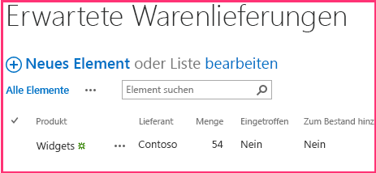

# <a name="add-sharepoint-write-operations-to-the-provider-hosted-add-in"></a><span data-ttu-id="d7ee1-102">Hinzufügen von SharePoint-Schreibvorgängen zum vom Anbieter gehosteten Add-In</span><span class="sxs-lookup"><span data-stu-id="d7ee1-102">Add SharePoint write operations to the provider-hosted add-in</span></span>
<span data-ttu-id="d7ee1-103">Erfahren Sie, wie Sie in einem vom Anbieter gehosteten SharePoint-Add-In Daten an SharePoint schreiben.</span><span class="sxs-lookup"><span data-stu-id="d7ee1-103">Learn how to write data to SharePoint in a provider-hosted SharePoint Add-in.</span></span>
 

 <span data-ttu-id="d7ee1-p101">**Hinweis** Der Name „Apps für SharePoint“ wird in „SharePoint-Add-Ins“ geändert. Während des Übergangszeitraums wird in der Dokumentation und der Benutzeroberfläche einiger SharePoint-Produkte und Visual Studio-Tools möglicherweise weiterhin der Begriff „Apps für SharePoint“ verwendet. Weitere Informationen finden Sie unter [Neuer Name für Office- und SharePoint-Apps](new-name-for-apps-for-sharepoint.md#bk_newname).</span><span class="sxs-lookup"><span data-stu-id="d7ee1-p101">**Note**  The name "apps for SharePoint" is changing to "SharePoint Add-ins". During the transition, the documentation and the UI of some SharePoint products and Visual Studio tools might still use the term "apps for SharePoint". For details, see  [New name for apps for Office and SharePoint](new-name-for-apps-for-sharepoint.md#bk_newname).</span></span>
 

<span data-ttu-id="d7ee1-107">Dies ist der fünfte in einer Reihe von Artikeln über die Grundlagen der Entwicklung von vom Anbieter gehosteten SharePoint-Add-Ins. Sie sollten sich zuerst mit [SharePoint Add-Ins](sharepoint-add-ins.md) und den vorherigen Artikeln in dieser Reihe vertraut machen:</span><span class="sxs-lookup"><span data-stu-id="d7ee1-107">This is the fifthin a series of articles about the basics of developing provider-hosted SharePoint Add-ins. You should first be familiar with  [SharePoint Add-ins](sharepoint-add-ins.md) and the previous articles in this series:</span></span>
 

-  [<span data-ttu-id="d7ee1-108">Erste Schritte beim Erstellen von von einem Anbieter gehosteten SharePoint-Add-Ins</span><span class="sxs-lookup"><span data-stu-id="d7ee1-108">Get started creating provider-hosted SharePoint Add-ins</span></span>](get-started-creating-provider-hosted-sharepoint-add-ins.md)
    
 
-  [<span data-ttu-id="d7ee1-109">Übertragen des SharePoint-Aussehens und -Verhaltens auf Ihr vom Anbieter gehostetes Add-In</span><span class="sxs-lookup"><span data-stu-id="d7ee1-109">Give your provider-hosted add-in the SharePoint look-and-feel</span></span>](give-your-provider-hosted-add-in-the-sharepoint-look-and-feel.md)
    
 
-  [<span data-ttu-id="d7ee1-110">Einfügen einer benutzerdefinierten Schaltfläche in das vom Anbieter gehostete Add-In</span><span class="sxs-lookup"><span data-stu-id="d7ee1-110">Include a custom button in the provider-hosted add-in</span></span>](include-a-custom-button-in-the-provider-hosted-add-in.md)
    
 
-  [<span data-ttu-id="d7ee1-111">Schnelle Übersicht über das SharePoint-Objektmodell</span><span class="sxs-lookup"><span data-stu-id="d7ee1-111">Get a quick overview of the SharePoint object model</span></span>](get-a-quick-overview-of-the-sharepoint-object-model.md)
    
 

 <span data-ttu-id="d7ee1-p102">**Hinweis** Wenn Sie diese Reihe zu vom Anbieter gehosteten Add-Ins durchgearbeitet haben, haben Sie eine Visual Studio-Projektmappe, die Sie verwenden können, um mit diesem Thema fortzufahren. Sie können außerdem das Repository unter [SharePoint_Provider-hosted_Add-Ins_Tutorials](https://github.com/OfficeDev/SharePoint_Provider-hosted_Add-ins_Tutorials) herunterladen und die Datei „BeforeSharePointWriteOps.sln“ öffnen.</span><span class="sxs-lookup"><span data-stu-id="d7ee1-p102">**Note**  If you have been working through this series about provider-hosted add-ins, then you have a Visual Studio solution that you can use to continue with this topic. You can also download the repository at  [SharePoint_Provider-hosted_Add-Ins_Tutorials](https://github.com/OfficeDev/SharePoint_Provider-hosted_Add-ins_Tutorials) and open the BeforeSharePointWriteOps.sln file.</span></span>
 

<span data-ttu-id="d7ee1-114">In diesem Artikel kehren wir zum Codieren zurück und fügen einige Funktionen hinzu, die Daten in das ChainStore-SharePoint-Add-In schreiben.</span><span class="sxs-lookup"><span data-stu-id="d7ee1-114">In this article we get back to coding by adding some functions that write data to the Chain Store SharePoint Add-in.</span></span>
 

## <a name="change-a-column-value-on-a-sharepoint-list-item"></a><span data-ttu-id="d7ee1-115">Ändern eines Spaltenwerts in einem SharePoint-Listenelement</span><span class="sxs-lookup"><span data-stu-id="d7ee1-115">Change a column value on a SharePoint list item</span></span>

<span data-ttu-id="d7ee1-p103">Unser Add-In verfügt über eine benutzerdefinierte Menübandschaltfläche, die einen Mitarbeiter aus der Liste **Lokale Mitarbeiter** des Stores in Hongkong zur Datenbank des Unternehmens hinzufügt. Aber der Benutzer muss daran denken, den Wert des Felds **Zu Unternehmens-DB hinzugefügt** manuell in „Ja“ zu ändern. Lassen Sie uns den Code hinzufügen, der dies automatisch ausführt.</span><span class="sxs-lookup"><span data-stu-id="d7ee1-p103">Our add-in has a custom ribbon button that adds an employee from the Hong Kong store's  **Local Employees** list to the corporate database. But the user has to remember to manually change the value of the **Added to Corporate DB** field toYes. Let's add code to do that automatically.</span></span>
 

 

 <span data-ttu-id="d7ee1-p104">**Hinweis** Die Einstellungen für Startprojekte in Visual Studio werden normalerweise auf die Standardwerte zurückgesetzt, wann immer die Projektmappe erneut geöffnet wird. Führen Sie die folgenden Schritte immer unmittelbar nach dem erneuten Öffnen der Beispielprojektmappe in dieser Artikelreihe durch: Klicken Sie mit der rechten Maustaste oben im **Projektmappen-Explorer** auf den Projektmappenknoten, und wählen Sie **Startprojekte festlegen** aus. Stellen Sie sicher, dass alle drei Projekte in der Spalte **Aktion** auf **Starten** festgelegt sind.</span><span class="sxs-lookup"><span data-stu-id="d7ee1-p104">**Note**   The settings for Startup Projects in Visual Studio tend to revert to defaults whenever the solution is reopened. Always take these steps immediately after reopening the sample solution in this series of articles: Right-click the solution node at the top of **Solution Explorer** and select **Set startup projects**.  Make sure all three projects are set to **Start** in the **Action** column.</span></span>
 


1. <span data-ttu-id="d7ee1-122">Öffnen Sie im **Projektmappen-Explorer** die Datei „EmployeeAdder.cs“.</span><span class="sxs-lookup"><span data-stu-id="d7ee1-122">In  **Solution Explorer**, open the EmployeeAdder.cs file.</span></span>
    
 
2. <span data-ttu-id="d7ee1-p105">Fügen Sie die folgende Zeile zur Methode **Page_Load** zwischen dem Aufruf von `AddLocalEmployeeToCorpDB` und dem Aufruf von **Response.Redirect** hinzu. Sie erstellen die Methode `SetLocalEmployeeSyncStatus` im nächsten Schritt.</span><span class="sxs-lookup"><span data-stu-id="d7ee1-p105">Add the following line to the  **Page_Load** methodbetween the call of `AddLocalEmployeeToCorpDB` and the call of **Response.Redirect**. You will create the  `SetLocalEmployeeSyncStatus` method in the next step.</span></span>
    
```C#
  // Write to SharePoint 
SetLocalEmployeeSyncStatus();
```

3. <span data-ttu-id="d7ee1-p106">Fügen Sie der `EmployeeAdder`-Klasse die folgende neue Methode hinzu. Beachten Sie Folgendes zu diesem Code:</span><span class="sxs-lookup"><span data-stu-id="d7ee1-p106">Add the following new method to the  `EmployeeAdder` class. Note the following about this code:</span></span>
    
      - <span data-ttu-id="d7ee1-p107">Der interne Name für das Feld **Zu Unternehmensdatenbank hinzugefügt** sieht seltsam aus. Interne Feldnamen dürfen keine Leerzeichen enthalten. Wenn ein Benutzer also ein Feld mit Leerzeichen im Anzeigenamen erstellt, ersetzt SharePoint jedes Leerzeichen durch die Zeichenfolge „_x0020_“, wenn der interne Name festgelegt wird. Dadurch wird „Zu Unternehmens-DB hinzugefügt“ zu „Zu_x0020_Unternehmens-DB_x0020_hinzugefügt“. Da interne Namen höchstens 32 Zeichen lang sein dürfen, wird der Name auf „Zu_x0020_Unternehmens-DB_x0020_h“ gekürzt.</span><span class="sxs-lookup"><span data-stu-id="d7ee1-p107">The internal name for the  **Added to Corporate DB** field is odd-looking. Internal field names cannot contain spaces, so when a user creates a field with spaces in its display name, SharePoint substitutes the string "_x0020_" for each space when it sets the internal name. This turns "Added to Employee DB" into "Added_x0020_to_x0020_Corporate_x0020_DB". Internal names cannot be more than 32 characters, so the name is truncated to just "Added_x0020_to_x0020_Corporate_x".</span></span>
    
 
  - <span data-ttu-id="d7ee1-131">Obwohl die Spalte **Zu Unternehmens-DB hinzugefügt** in der SharePoint-UI als „Ja/Nein“-Feld bezeichnet wird, handelt es sich tatsächlich um ein boolesches Feld. Deshalb wird sein Wert auf **true**, nicht „Ja“ festgelegt.</span><span class="sxs-lookup"><span data-stu-id="d7ee1-131">Although the  **Added to Corporate DB** column is called a "Yes/No" field in the SharePoint UI, it is really a boolean, so its value is set to **true**, not "Yes".</span></span>
    
 
  - <span data-ttu-id="d7ee1-p108">Die Methode **Update** der Klasse **ListItem** muss aufgerufen werden, um die Änderungen an der SharePoint-Inhaltsdatenbank zu übernehmen. Es ist eine allgemeine, aber nicht ganz universelle Regel, dass Sie, wenn Sie einen Eigenschaftswert eines Objekts ändern, das in den SharePoint-Datenbanken gespeichert ist, die Methode **Update** des Objekts aufrufen müssen.</span><span class="sxs-lookup"><span data-stu-id="d7ee1-p108">The  **Update** method of the **ListItem** class must be called to commit the changes to SharePoint's content database. It is a general, but not quite universal, rule that when you change a property value of an object that is stored in the SharePoint databases, you must call the object's **Update** method.</span></span>
    
 

```C#
  private void SetLocalEmployeeSyncStatus()
{
    using (var clientContext = spContext.CreateUserClientContextForSPHost())
    {
        List localEmployeesList = clientContext.Web.Lists.GetByTitle("Local Employees");
        ListItem selectedLocalEmployee = localEmployeesList.GetItemById(listItemID);
        selectedLocalEmployee["Added_x0020_to_x0020_Corporate_x"] = true;
        selectedLocalEmployee.Update();
        clientContext.ExecuteQuery();
    }
}
```


## <a name="request-permission-to-write-to-the-host-web-list"></a><span data-ttu-id="d7ee1-134">Anfordern der Berechtigung zum Schreiben in die Hostwebliste</span><span class="sxs-lookup"><span data-stu-id="d7ee1-134">Request permission to write to the host web list</span></span>

<span data-ttu-id="d7ee1-p109">Da das Add-In nun sowohl in die Liste schreibt als auch aus ihr liest, müssen wir die Berechtigungen, die das Add-In benötigt, von Lesen auf Schreiben eskalieren. Gehen Sie folgendermaßen vor.</span><span class="sxs-lookup"><span data-stu-id="d7ee1-p109">Since the add-in is now writing to the list as well as reading it, we need to escalate the permissions that the add-in requests from Read to Write. Follow these steps.</span></span>
 

 

1. <span data-ttu-id="d7ee1-137">Öffnen Sie im **Projektmappen-Explorer** die Datei „AppManifest.xml“ im **ChainStore**-Projekt.</span><span class="sxs-lookup"><span data-stu-id="d7ee1-137">In  **Solution Explorer**, open the AppManifest.xml file in the  **ChainStore** project.</span></span>
    
 
2. <span data-ttu-id="d7ee1-138">Öffnen Sie die Registerkarte **Berechtigungen**, und wählen Sie im Feld **Berechtigung** die Option **Schreiben** aus der Dropdownliste aus.</span><span class="sxs-lookup"><span data-stu-id="d7ee1-138">Open the  **Permissions** tab and in the **Permission** field, select **Write** from the drop down.</span></span>
    
 
3. <span data-ttu-id="d7ee1-139">Speichern Sie die Datei.</span><span class="sxs-lookup"><span data-stu-id="d7ee1-139">Save the file.</span></span> 
    
 

## <a name="run-the-add-in-and-test-the-button"></a><span data-ttu-id="d7ee1-140">Ausführen des Add-Ins und Testen der Schaltfläche</span><span class="sxs-lookup"><span data-stu-id="d7ee1-140">Run the add-in and test the button</span></span>


 

 

1. <span data-ttu-id="d7ee1-p110">Verwenden Sie die F5-TASTE, um Ihr Add-In bereitzustellen und auszuführen. Visual Studio hostet die Remotewebanwendung in IIS Express und die SQL-Datenbank in SQL Express. Außerdem wird eine temporäre Installation des Add-Ins auf Ihrer SharePoint-Testwebsite durchgeführt, und das Add-In wird sofort ausgeführt. Sie werden aufgefordert, Berechtigungen für das Add-In zu erteilen, bevor die Startseite geöffnet wird.</span><span class="sxs-lookup"><span data-stu-id="d7ee1-p110">Use the F5 key to deploy and run your add-in. Visual Studio hosts the remote web application in IIS Express and hosts the SQL database in a SQL Express. It also makes a temporary installation of the add-in on your test SharePoint site and immediately runs the add-in. You are prompted to grant permissions to the add-in before it's start page opens.</span></span> 
    
 
2. <span data-ttu-id="d7ee1-145">Wählen Sie im Berechtigungsformular **Lokale Mitarbeiter** aus der Liste aus, und klicken Sie dann auf **Vertrauen**.</span><span class="sxs-lookup"><span data-stu-id="d7ee1-145">On the permission form, choose  **Local Employees** from the list and then click **Trust it**.</span></span>
    
 
3. <span data-ttu-id="d7ee1-146">Wenn die Add-In-Startseite geöffnet wird, klicken Sie auf **Zurück zur Website** im Chromesteuerelement im oberen Bereich.</span><span class="sxs-lookup"><span data-stu-id="d7ee1-146">When the add-in's start page opens, click  **Back to Site** on the chrome control at the top.</span></span>
    
 
4. <span data-ttu-id="d7ee1-p111">Navigieren Sie auf der Startseite der Website zu **Websiteinhalte | Lokale Mitarbeiter**. Die Seite mit der Listenansicht wird geöffnet.</span><span class="sxs-lookup"><span data-stu-id="d7ee1-p111">From the website's home page navigate to  **Site Contents | Local Employees**. The list view page opens.</span></span>
    
 
5. <span data-ttu-id="d7ee1-149">Wenn auf der Liste keine Mitarbeiter mit **Neine** in der Spalte **Zu Unternehmens-DB hinzugefügt** vorhanden sind, fügen Sie einen Mitarbeiter zu der Liste hinzu, und *aktivieren Sie nicht das Kontrollkästchen **Zu Unternehmens-DB hinzugefügt**.*</span><span class="sxs-lookup"><span data-stu-id="d7ee1-149">If there are no employees on the list with  **No** in the **Added to Corporate DB** column, add an employee to the list, and *do not check the  **Added to Corporate DB** checkbox.*</span></span> 
    
 
6. <span data-ttu-id="d7ee1-150">Öffnen Sie auf dem Menüband die Registerkarte **Elemente**. Im Abschnitt **Aktionen** der Registerkarte wird die benutzerdefinierte Schaltfläche **Zu Unternehmens-DB hinzufügen** angezeigt.</span><span class="sxs-lookup"><span data-stu-id="d7ee1-150">On the ribbon, open the  **Items** tab. In the **Actions** section of the tab, is the custom button **Add to Corporate DB**.</span></span>
    
 
7. <span data-ttu-id="d7ee1-151">Wählen Sie einen Mitarbeiter in der Liste aus, für den **Nein** in der Spalte **Zu Unternehmens-DB hinzugefügt** angezeigt wird.</span><span class="sxs-lookup"><span data-stu-id="d7ee1-151">Select an employee on the list that has  **No** in the **Added to Corporate DB** column.</span></span>
    
 
8. <span data-ttu-id="d7ee1-p112">Klicken Sie auf die Schaltfläche **Zu Unternehmens-DB hinzufügen**. * **Sie müssen zuerst ein Element auswählen!***</span><span class="sxs-lookup"><span data-stu-id="d7ee1-p112">Press the  **Add to Corporate DB** button. * **An item must be selected first!***</span></span> 
    
 
9. <span data-ttu-id="d7ee1-p113">Die Seite scheint neu geladen zu werden, da die Methode **Page_Load** der Seite EmployeeAdder zur Seite umleitet. Der Wert des Felds **Zu Unternehmens-DB hinzugefügt** für den Mitarbeiter hat sich zu **Ja** geändert.</span><span class="sxs-lookup"><span data-stu-id="d7ee1-p113">The page will seem to reload because the  **Page_Load** method of the EmployeeAdder page redirects back to it. The value of the **Added to Corporate DB** field for the employee has changed to **Yes**.</span></span>
    
     <span data-ttu-id="d7ee1-p114">**HINWEIS** Was verhindert, dass ein Benutzer den Wert **Zu Unternehmens-DB hinzugefügt** in einer Weise manuell ändert, die dazu führt, dass die Liste und die Unternehmensdatenbank inkonsistent werden? Für den Moment nichts. Die Lösung für dieses Problem erfahren Sie in einem späteren Artikel dieser Reihe.</span><span class="sxs-lookup"><span data-stu-id="d7ee1-p114">**Note**  What prevents a user from manually changing the value  **Added to Corporate DB** in a way that makes the list and the corporate database inconsistent? Nothing does at the moment. You'll get the solution to this problem in a later article of this series.</span></span>
10. <span data-ttu-id="d7ee1-p115">Schließen Sie zum Beenden der Debugsitzung das Browserfenster, oder beenden Sie das Debuggen in Visual Studio. Jedes Mal, wenn Sie F5 drücken, zieht Visual Studio die vorherige Version des Add-Ins zurück und installiert die neueste.</span><span class="sxs-lookup"><span data-stu-id="d7ee1-p115">To end the debugging session, close the browser window or stop debugging in Visual Studio. Each time that you press F5, Visual Studio will retract the previous version of the add-in and install the latest one.</span></span>
    
 
11. <span data-ttu-id="d7ee1-161">Klicken Sie mit der rechten Maustaste auf das Projekt im **Projektmappen-Explorer**, und wählen Sie **Zurückziehen** aus.</span><span class="sxs-lookup"><span data-stu-id="d7ee1-161">Right-click the project in  **Solution Explorer** and choose **Retract**.</span></span>
    
 

## <a name="create-a-new-custom-list-on-the-host-website"></a><span data-ttu-id="d7ee1-162">Erstellen einer neuen benutzerdefinierten Liste auf der Hostwebsite</span><span class="sxs-lookup"><span data-stu-id="d7ee1-162">Create a new custom list on the host website</span></span>

<span data-ttu-id="d7ee1-p116">Die nächste Verbesserung am ChainStore-Add-In besteht darin, neue Elemente in einer Liste zu erstellen, statt lediglich ein Feld in einem vorhandenen Element zu ändern. Spezifisch gesagt, wenn eine neue Bestellung auf Unternehmensebene aufgegeben wird, wird automatisch ein Element in einer SharePoint-Liste erstellt, das lokale Mitarbeiter darauf aufmerksam macht, eine Lieferung zu erwarten. Die Liste heißt **Erwartete Lieferungen** und wird mit den folgenden Schritten erstellt. In einem späteren Artikel dieser Reihe erfahren Sie, wie Sie eine benutzerdefinierte Liste programmgesteuert zu einer Hostwebsite hinzufügen, aber für den Moment werden Sie diese manuell hinzufügen.</span><span class="sxs-lookup"><span data-stu-id="d7ee1-p116">The next improvement to the Chain Store add-in is to create new items in a list, instead of merely changing a field in an existing item. Specifically, when a new order is placed at the corporate level, an item is automatically created in a SharePoint list that alerts local employees to expect a shipment. The list is called  **Expected Shipments** and you create it with the steps below. In a later article in this series, you'll learn how to programmatically add a custom list to a host website, but for now you'll add this one manually.</span></span>
 

 

1. <span data-ttu-id="d7ee1-167">Navigieren Sie auf der Startseite des Fabrikam-Stores in Hongkong zu **Websiteinhalte | Add-In hinzufügen | Benutzerdefinierte Liste**.</span><span class="sxs-lookup"><span data-stu-id="d7ee1-167">From the home page of the Fabrikam Hong Kong Store, navigate to  **Site Contents | add an add-in | Custom List**.</span></span> 
    
 
2. <span data-ttu-id="d7ee1-168">Geben Sie im Dialogfeld **Benutzerdefinierte Liste hinzufügen** „Erwartete Lieferungen“ als Namen an, und klicken Sie auf **Erstellen**.</span><span class="sxs-lookup"><span data-stu-id="d7ee1-168">In the  **Adding Custom List** dialog, specifyExpected Shipments as the name and press **Create**.</span></span> 
    
 
3. <span data-ttu-id="d7ee1-169">Öffnen Sie auf der Seite **Websiteinhalte** die Liste **Erwartete Lieferungen**.</span><span class="sxs-lookup"><span data-stu-id="d7ee1-169">On the  **Site Contents** page, open the **Expected Shipments** list.</span></span>
    
 
4. <span data-ttu-id="d7ee1-170">Öffnen Sie die Registerkarte **Liste** auf dem Menüband, und klicken Sie dann auf die Schaltfläche **Listeneinstellungen**.</span><span class="sxs-lookup"><span data-stu-id="d7ee1-170">Open the  **List** tab on the ribbon, and then click the **List Settings** button.</span></span>
    
 
5. <span data-ttu-id="d7ee1-171">Klicken Sie im Abschnitt **Spalten** der Seite **Listeneinstellungen** auf die Spalte **Titel**.</span><span class="sxs-lookup"><span data-stu-id="d7ee1-171">In the  **Columns** section of the **List Settings** page, click the **Title** column.</span></span>
    
 
6. <span data-ttu-id="d7ee1-172">Ändern Sie im Formular **Spalte bearbeiten** die Option **Spaltenname** von „Titel“ in „Produkt“, und klicken Sie dann auf **OK**.</span><span class="sxs-lookup"><span data-stu-id="d7ee1-172">In the  **Edit Column** form, change the **Column name** from Title toProduct; and then click  **OK**.</span></span>
    
 
7. <span data-ttu-id="d7ee1-173">Klicken Sie auf der Seite **Einstellungen** auf **Spalte erstellen**.</span><span class="sxs-lookup"><span data-stu-id="d7ee1-173">On the  **Settings** page, click **Create column**.</span></span>
    
 
8. <span data-ttu-id="d7ee1-p117">In einem vorherigen Artikel dieser Reihe haben Sie gelernt, wie Sie benutzerdefinierte Spalten für eine Liste erstellen. Fügen Sie für die Liste **Erwartete Lieferungen** vier Spalten hinzu, und verwenden Sie dabei die Werte in der folgenden Tabelle. Behalten Sie für alle anderen Einstellungen die Standardeinstellungen bei.</span><span class="sxs-lookup"><span data-stu-id="d7ee1-p117">In a previous article of this series, you learned how to create custom columns for a list. For the  **Expected Shipments** list, add four columns, using the values in the following table. Leave all other settings at their defaults.</span></span>
    

|<span data-ttu-id="d7ee1-177">**Spaltenname**</span><span class="sxs-lookup"><span data-stu-id="d7ee1-177">**Column name**</span></span>|<span data-ttu-id="d7ee1-178">**Typ**</span><span class="sxs-lookup"><span data-stu-id="d7ee1-178">**Type**</span></span>|<span data-ttu-id="d7ee1-179">**Erforderlich?**</span><span class="sxs-lookup"><span data-stu-id="d7ee1-179">**Required?**</span></span>|<span data-ttu-id="d7ee1-180">**Standardwert**</span><span class="sxs-lookup"><span data-stu-id="d7ee1-180">**Default value**</span></span>|
|:-----|:-----|:-----|:-----|
|<span data-ttu-id="d7ee1-181">Lieferant</span><span class="sxs-lookup"><span data-stu-id="d7ee1-181">Supplier</span></span>|<span data-ttu-id="d7ee1-182">**Eine Textzeile**</span><span class="sxs-lookup"><span data-stu-id="d7ee1-182">**Single line of text**</span></span>|<span data-ttu-id="d7ee1-183">Nicht erforderlich</span><span class="sxs-lookup"><span data-stu-id="d7ee1-183">not required</span></span>|<span data-ttu-id="d7ee1-184">keine</span><span class="sxs-lookup"><span data-stu-id="d7ee1-184">none</span></span>|
|<span data-ttu-id="d7ee1-185">Menge</span><span class="sxs-lookup"><span data-stu-id="d7ee1-185">Quantity</span></span>|<span data-ttu-id="d7ee1-186">**Zahl**</span><span class="sxs-lookup"><span data-stu-id="d7ee1-186">**Number**</span></span>|<span data-ttu-id="d7ee1-187">Erforderlich</span><span class="sxs-lookup"><span data-stu-id="d7ee1-187">Required</span></span>|<span data-ttu-id="d7ee1-188">1</span><span class="sxs-lookup"><span data-stu-id="d7ee1-188">1</span></span>|
|<span data-ttu-id="d7ee1-189">Eingetroffen</span><span class="sxs-lookup"><span data-stu-id="d7ee1-189">Arrived</span></span>|<span data-ttu-id="d7ee1-190">**Ja/Nein**</span><span class="sxs-lookup"><span data-stu-id="d7ee1-190">**Yes/No**</span></span>|<span data-ttu-id="d7ee1-191">Nicht erforderlich</span><span class="sxs-lookup"><span data-stu-id="d7ee1-191">not required</span></span>|<span data-ttu-id="d7ee1-192">Nein</span><span class="sxs-lookup"><span data-stu-id="d7ee1-192">No</span></span>|
|<span data-ttu-id="d7ee1-193">Zum Bestand hinzugefügt</span><span class="sxs-lookup"><span data-stu-id="d7ee1-193">Added to Inventory</span></span>|<span data-ttu-id="d7ee1-194">**Ja/Nein**</span><span class="sxs-lookup"><span data-stu-id="d7ee1-194">**Yes/No**</span></span>|<span data-ttu-id="d7ee1-195">Nicht erforderlich</span><span class="sxs-lookup"><span data-stu-id="d7ee1-195">not required</span></span>|<span data-ttu-id="d7ee1-196">Nein</span><span class="sxs-lookup"><span data-stu-id="d7ee1-196">No</span></span>|
9. <span data-ttu-id="d7ee1-p118">Nachdem Sie die Spalten erstellt haben, klicken Sie auf der Seite mit den Listeneinstellungen auf **Websiteinhalte**, um die Seite **Websiteinhalte** zu öffnen. Öffnen Sie die Liste **Erwartete Lieferungen**.</span><span class="sxs-lookup"><span data-stu-id="d7ee1-p118">After you have created the columns, on the list settings page, click  **Site Contents** to open the **Site Contents** page. Open the **Expected Shipments** list.</span></span>
    
 
10. <span data-ttu-id="d7ee1-p119">Klicken Sie auf **Neues Element**. Das Formular für das Erstellen von Elementen sollte genau wie folgt aussehen, einschließlich der zwei Sternchen, die erforderliche Felder angeben:</span><span class="sxs-lookup"><span data-stu-id="d7ee1-p119">Click  **new item**. The item creation form should look exactly like the following, including the two asterisks that indicate required fields.:</span></span>
    
  
 

 

 
11. <span data-ttu-id="d7ee1-204">Da wir Elemente in dieser Liste nicht manuell erstellen möchten, klicken Sie auf **Abbrechen**.</span><span class="sxs-lookup"><span data-stu-id="d7ee1-204">We don't want to manually create items on this list, so click  **Cancel**.</span></span>
    
 

## <a name="insert-an-item-into-a-sharepoint-list"></a><span data-ttu-id="d7ee1-205">Einfügen eines Elements in eine SharePoint-Liste</span><span class="sxs-lookup"><span data-stu-id="d7ee1-205">Insert an item into a SharePoint list</span></span>

<span data-ttu-id="d7ee1-206">Jetzt fügen Sie eine Funktion zum Add-In hinzu, die immer dann ein Element in der Liste **Erwartete Lieferungen** erstellt, wenn eine Bestellung für den Store in Hongkong auf Unternehmensebene aufgegeben wird.</span><span class="sxs-lookup"><span data-stu-id="d7ee1-206">Now you add a function to the add-in that creates an item in the  **Expected Shipments** list whenever an order for the Hong Kong store is placed at the corporate level.</span></span>
 

 

1. <span data-ttu-id="d7ee1-207">Öffnen Sie im **Projektmappen-Explorer** die Datei „OrderForm.aspx.cs“.</span><span class="sxs-lookup"><span data-stu-id="d7ee1-207">In  **Solution Explorer**, open the OrderForm.aspx.cs file.</span></span>
    
 
2. <span data-ttu-id="d7ee1-208">Fügen Sie eine **using**-Anweisung für **Microsoft.SharePoint.Client** am Anfang der Datei hinzu.</span><span class="sxs-lookup"><span data-stu-id="d7ee1-208">Add a  **using** statement for **Microsoft.SharePoint.Client** to the top of the file.</span></span>
    
 
3. <span data-ttu-id="d7ee1-p121">Fügen Sie in der Methode `btnCreateOrder_Click` die folgende Zeile direkt unter dem Aufruf von `CreateOrder` hinzu. Sie erstellen die Methode CreateExpectedShipment im nächsten Schritt.</span><span class="sxs-lookup"><span data-stu-id="d7ee1-p121">In the  `btnCreateOrder_Click` method, add the following line just below the call to `CreateOrder`. You'll create the CreateExpectedShipment method in the next step.</span></span>
    
```C#
  CreateExpectedShipment(txtBoxSupplier.Text, txtBoxItemName.Text, quantity);
```

4. <span data-ttu-id="d7ee1-p122">Fügen Sie der `OrderForm`-Klasse die folgende Methode hinzu. Beachten Sie Folgendes zu diesem Code:</span><span class="sxs-lookup"><span data-stu-id="d7ee1-p122">Add the following method to the  `OrderForm` class. Note the following about this code:</span></span>
    
      - <span data-ttu-id="d7ee1-p123">Ein **ListItem**-Objekt wird aus Gründen der Systemleistung nicht mit einem Konstruktor erstellt. Ein **ListItem**-Objekt hat viele Eigenschaften (mit Standardwerten). Wenn ein Konstruktor verwendet wird, würde das gesamte Objekt in der XML-Meldung enthalten sein, die die Methode **ExecuteQuery** an den Server sendet. Das Objekt **ListItemCreationInformation** ist ein einfaches Objekt, das nur die minimalen vom Standard abweichenden Werte enthält, die der Server zum Erstellen eines **ListItem**-Objekts benötigt. Es mag wirken, als würde eine Zeile ein **ListItem**-Objekt erstellen, aber denken Sie daran, dass diese Zeile nur einige XML-Markups zu einer Meldung hinzufügt, die an den Server gesendet wird. Das Objekt **ListItem** wird auf dem Server erstellt.</span><span class="sxs-lookup"><span data-stu-id="d7ee1-p123">A  **ListItem** object is not created with a constructor. This is for performance reasons. A **ListItem** object has many properties (with default values). If a constructor is used, the entire object would be included in the XML message that the **ExecuteQuery** method sends to the server. The **ListItemCreationInformation** object is a lightweight object that only contains the minimal non-default values that the server needs to create a **ListItem** object. It may appear that there is a line that creates a **ListItem** object, but recall that this line only adds some XML markup to a message that is sent to the server. The **ListItem** object is created there on the server.</span></span>
    
 
  - <span data-ttu-id="d7ee1-220">Es besteht keine Notwendigkeit, das Objekt **ListItem** zurück zum Client zu bringen. Deshalb gibt keinen Aufruf an die Methode **ClientContext.Load**.</span><span class="sxs-lookup"><span data-stu-id="d7ee1-220">There is no need to bring the  **ListItem** object back down to the client, so there is no call to **ClientContext.Load** method.</span></span>
    
 
  - <span data-ttu-id="d7ee1-221">Der Code muss nicht explizit die Felder **Eingetroffen** oder **Zum Bestand hinzugefügt** festlegen, da diese die Standardwerte „Nein“ enthalten, was dem entspricht, was wir wollen.</span><span class="sxs-lookup"><span data-stu-id="d7ee1-221">The code does not need to explicitly set the  **Arrived** or **Added to Inventory** fields because they have default values of "No", which is what we want.</span></span>
    
 

```
  private void CreateExpectedShipment(string supplier, string product, UInt16 quantity)
{
    using (var clientContext = spContext.CreateUserClientContextForSPHost())
    {
        List expectedShipmentsList = clientContext.Web.Lists.GetByTitle("Expected Shipments");
        ListItemCreationInformation itemCreateInfo = new ListItemCreationInformation();
        ListItem newItem = expectedShipmentsList.AddItem(itemCreateInfo);
        newItem["Title"] = product;
        newItem["Supplier"] = supplier;
        newItem["Quantity"] = quantity;
        newItem.Update();
        clientContext.ExecuteQuery();
    }
}
```


## <a name="checking-for-deleted-components"></a><span data-ttu-id="d7ee1-222">Suchen nach gelöschten Komponenten</span><span class="sxs-lookup"><span data-stu-id="d7ee1-222">Checking for deleted components</span></span>

<span data-ttu-id="d7ee1-p124">Jeder Benutzer mit Rechten als Eigentümer der Liste für eine SharePoint-Liste kann die Liste löschen. Und wenn die Liste von einem Add-In an das Hostweb bereitgestellt wird, kann der Websiteeigentümer des Hostwebs sie löschen. Das geschieht möglicherweise, wenn der Besitzer entscheidet, ohne die Funktionalität der Liste zurechzukommen. (Sie kann aus dem SharePoint-Papierkorb wiederhergestellt werden, wenn der Eigentümer seiner Meinung ändert.)</span><span class="sxs-lookup"><span data-stu-id="d7ee1-p124">Anyone with list owner privileges for a SharePoint list can delete the list. And if the list is deployed to the host web by an add-in, the website owner of the host web can delete it. That may happen if the owner decides to do without the functionality provided by the list. (It can be restored from the SharePoint Recycle Bin if the owner changes his mind.)</span></span> 
 

 
<span data-ttu-id="d7ee1-p125">Die Methode  `CreateExpectedShipment` hängt vom Vorhandensein der Liste **Erwartete Lieferungen** ab. Angenommen, der Besitzer einer Website entscheidet, die Liste zu löschen. Später, wenn eine Bestellung zum **Bestellformular** des Add-Ins hinzugefügt wird, wird `CreateExpectedShipment` aufgerufen und löst eine Ausnahme aus, deren Meldung besagt, dass keine Liste **Erwartete Lieferungen** auf der SharePoint-Website vorhanden ist.</span><span class="sxs-lookup"><span data-stu-id="d7ee1-p125">The  `CreateExpectedShipment` method depends on the existence of the **Expected Shipments** list. Suppose a website owner decided to delete the list. Later, when an order is added with the add-in's **Order Form**, the  `CreateExpectedShipment` is called and will throw an exception whose message says that there's no **Expected Shipments** list on the SharePoint website.</span></span>
 

 
<span data-ttu-id="d7ee1-p126">Möglicherweise sollten Sie die Methode  `expectedShipmentsList` auf Nichtigkeit überprüfen lassen, bevor sie eine Aktion daran durchführt. Wenn Sie mit CSOM arbeiten, können Sie diese Überprüfung *nicht*  mit einer einfachen Struktur wie der folgenden durchführen:</span><span class="sxs-lookup"><span data-stu-id="d7ee1-p126">You might want the method to check the  `expectedShipmentsList` for nullity before it does anything with it. When you are working with CSOM, you can *not*  make this check with a simple structure like this:</span></span>
 

 
 `if (expectedShipmentsList != null) { ... }`
 

 
<span data-ttu-id="d7ee1-p127">Stattdessen müssen Sie eine spezielle CSOM-Klasse verwenden, die als **ConditionalScope** bezeichnet wird. Die Gründe hierfür hängen mit dem Batchverarbeitungssystem von CSOM zusammen, das im vorherigen Artikel dieser Reihe erwähnt wurde. (Siehe [Clientseitige Laufzeit und Batchverarbeitung](get-a-quick-overview-of-the-sharepoint-object-model.md#CSOMBatching)). **ConditionalScope** und das Batchverarbeitungssystem sind fortgeschrittene Themen, die über den Umfang dieser Reihe für die ersten Schritte hinausgeht, aber Sie sollten einen Blick in die MSDN-Dokumentation dazu werfen, wenn Sie diese Reihe von Lernprogrammen abgeschlossen haben.</span><span class="sxs-lookup"><span data-stu-id="d7ee1-p127">Instead, you need to use a special CSOM class called  **ConditionalScope**. The reasons for this are connected to CSOM's batching system, which was mentioned in the previous article in this series. (See  [Client-side runtime and batching](get-a-quick-overview-of-the-sharepoint-object-model.md#CSOMBatching)).  **ConditionalScope** and the batching system are advanced topics that are outside the scope of this getting started series, but you should see MSDN's documentation of them after you have completed this series of tutorials.</span></span>
 

 
<span data-ttu-id="d7ee1-236">Es gibt eine alternative Möglichkeit zum Prüfen, ob eine Liste vorhanden ist: Statt die Methode **GetByTitle** zu verwenden, um einen Verweis auf die Liste zu erhalten, können Sie mit Code wie dem folgenden überprüfen, ob sich eine Liste mit dem angegebenen Namen in der „Liste der Listen“ der Website befindet.</span><span class="sxs-lookup"><span data-stu-id="d7ee1-236">There is an alternative way to check for the existence of a list: instead of using the  **GetByTitle** method to get a reference to the list, you can check to see if a list with the specified name is in the website's "list of lists" with code like the following.</span></span>
 

 


```C#
var query = from list in clientContext.Web.Lists 
             where list.Title == "Expected Shipments" 
             select list; 
IEnumerable<List> matchingLists = clientContext.LoadQuery(query); 
clientContext.ExecuteQuery(); 
if (matchingLists.Count() != 0) 
{ 
    List expectedShipmentsList = matchingLists.Single(); 
    // Do something with the list. 
}
clientContext.ExecuteQuery(); 
```

<span data-ttu-id="d7ee1-p128">Dieser Code hat den Vorteil, dass Sie die Komplikationen der Klasse **ConditionalScope** vermeiden können, und wir verwenden genau diesen Code an anderer Stelle in dieser Artikelreihe. Es gibt jedoch auch einen Nachteil: Dieser Code erfordert einen zusätzlichen Aufruf von **ExecuteQuery**, nur um den Wert abzurufen, den Sie in der **if**-Anweisung überprüfen möchten. Wenn dieses Verfahren in `CreateExpectedShipment` verwendet wird, um zu prüfen, ob die Liste vorhanden ist, hat diese Methode zwei Aufrufe von **ExecuteQuery**, die jeweils eine HTTP-Anforderung vom Remotewebserver an SharePoint durchführen. Diese Anforderungen sind der zeitaufwändigste Teil jeder CSOM-Methode. Daher ist es im Allgemeinen empfehlenswert, diese zu minimieren.</span><span class="sxs-lookup"><span data-stu-id="d7ee1-p128">The preceding code has the advantage of allowing you to avoid the complications of the  **ConditionalScope** class, and we use exactly this code elsewhere in this series of articles. But there is a disadvantage too: this code requires an extra call of **ExecuteQuery** solely to get the value you want to check in the **if** statement. If we use this technique in the `CreateExpectedShipment` to check for the existence of the list, then that method will have two calls of **ExecuteQuery** each of which makes an HTTP request from the remote web server to SharePoint. These requests are the most time-consuming part of any CSOM method, so it is generally a good practice to minimize them.</span></span>
 

 
<span data-ttu-id="d7ee1-p129">`CreateExpectedShipment` wird wie gehabt beibehalten, aber in einem Produktions-Add-In müssen Sie überlegen, wie Ihr Code funktioniert, wenn eine Komponente, die darauf verweist, gelöscht wird. Das programmgesteuerte Wiederherstellen der Liste aus dem Papierkorb ist eine Option, aber diese würde Benutzer stören, die absichtlich entscheiden, die Liste zu löschen. Berücksichtigen Sie auch, dass möglicherweise die Möglichkeit darin besteht, nichts zu tun, um die Ausnahme zu verhindern. Eine Ausnahme von SharePoint würde Benutzer warnen, dass das Löschen der Liste einen Teil des Add-Ins untauglich macht, was der Person, die sie gelöscht hat, möglicherweise nicht bemerkt hat. Ein Benutzer kann dann entscheiden, ob die Liste aus dem Papierkorb wiedergeherstellt wird oder er ohne den Teil der Add-In-Funktionalität auskommt, der nicht mehr funktioniert.</span><span class="sxs-lookup"><span data-stu-id="d7ee1-p129">We will leave the  `CreateExpectedShipment` as it is, but in a production add-in, you need to think about how your code is going to work if a component that it references is deleted. Programmatically restoring the list from the Recycle Bin is one option, but that would annoy users who intentionally decided to delete the list. You should also consider that doing nothing at all to prevent the exception might be the best choice. An exception from SharePoint would alert users that the deletion of the list has broken part of the add-in, which is something the person who deleted it might not have realized. A user can then decide whether to restore the list from the Recycle Bin or do without the part of the add-in functionality that no longer works.</span></span>
 

 

## <a name="request-permission-to-manage-the-website"></a><span data-ttu-id="d7ee1-246">Anfordern der Berechtigung zum Verwalten der Website</span><span class="sxs-lookup"><span data-stu-id="d7ee1-246">Request permission to manage the website</span></span>

<span data-ttu-id="d7ee1-p130">Sie erinnern sich, dass SharePoint, wenn ein Add-In Lese- oder Schreibberechtigungen im Bereich der Liste anfordert, den Benutzer auffordert, dem Add-In zu vertrauen. Das Dialogfeld enthält eine Dropdownliste, aus der der Benutzer die Liste auswählt, auf die das Add-In Zugriff haben sollte. Nur eine Liste kann ausgewählt werden. Aber das ChainStore-Add-In schreibt jetzt in zwei verschiedene Listen. Um Zugriff auf mehrere Listen zu erhalten, muss das Add-In die Berechtigung im Bereich des Web anfordern. Gehen Sie wie folgt vor:</span><span class="sxs-lookup"><span data-stu-id="d7ee1-p130">Recall that when an add-in requests Read or Write permission with the scope of List, SharePoint prompts the user to trust the add-in and the dialog contains a drop down list where the user selects the list to which the add-in should have access. Only one list can be selected. But the Chain Store add-in now writes to two different lists. To gain access to multiple lists, the add-in has to request permission with the scope of Web. Follow these steps:</span></span>
 

 

1. <span data-ttu-id="d7ee1-252">Öffnen Sie im **Projektmappen-Explorer** die Datei „AppManifest.xml“ im **ChainStore**-Projekt.</span><span class="sxs-lookup"><span data-stu-id="d7ee1-252">In  **Solution Explorer**, open the AppManifest.xml file in the  **ChainStore** project.</span></span>
    
 
2. <span data-ttu-id="d7ee1-253">Öffnen Sie die Registerkarte **Berechtigungen**, und wählen Sie im Feld **Bereich** die Option **Web** aus der Dropdownliste aus.</span><span class="sxs-lookup"><span data-stu-id="d7ee1-253">Open the  **Permissions** tab and in the **Scope** field, select **Web** from the drop down.</span></span>
    
 
3. <span data-ttu-id="d7ee1-254">Wählen Sie im Feld **Berechtigung** die Option **Schreiben** aus der Dropdownliste aus.</span><span class="sxs-lookup"><span data-stu-id="d7ee1-254">In the  **Permission** field, select **Write** from the drop down.</span></span>
    
 
4. <span data-ttu-id="d7ee1-255">Speichern Sie die Datei.</span><span class="sxs-lookup"><span data-stu-id="d7ee1-255">Save the file.</span></span> 
    
 

## <a name="run-the-add-in-and-test-the-item-creation"></a><span data-ttu-id="d7ee1-256">Ausführen des Add-Ins und Testen der Elementerstellung</span><span class="sxs-lookup"><span data-stu-id="d7ee1-256">Run the add-in and test the item creation</span></span>


 

 

1. <span data-ttu-id="d7ee1-p131">Verwenden Sie die F5-TASTE, um Ihr Add-In bereitzustellen und auszuführen. Visual Studio hostet die Remotewebanwendung in IIS Express und die SQL-Datenbank in SQL Express. Außerdem wird eine temporäre Installation des Add-Ins auf Ihrer SharePoint-Testwebsite durchgeführt, und das Add-In wird sofort ausgeführt. Sie werden aufgefordert, Berechtigungen für das Add-In zu erteilen, bevor die Startseite geöffnet wird.</span><span class="sxs-lookup"><span data-stu-id="d7ee1-p131">Use the F5 key to deploy and run your add-in. Visual Studio hosts the remote web application in IIS Express and hosts the SQL database in a SQL Express. It also makes a temporary installation of the add-in on your test SharePoint site and immediately runs the add-in. You are prompted to grant permissions to the add-in before it's start page opens.</span></span> 
    
 
2. <span data-ttu-id="d7ee1-261">Wenn die Add-In-Startseite geöffnet wird, klicken Sie auf den Link **Bestellformular** am unteren Rand der Seite.</span><span class="sxs-lookup"><span data-stu-id="d7ee1-261">When the add-in's start page opens, click the  **Order Form** link at the bottom of the page.</span></span>
    
 
3. <span data-ttu-id="d7ee1-262">Geben Sie einige Werte in das Formular ein, und klicken Sie auf **Bestellung aufgeben**.</span><span class="sxs-lookup"><span data-stu-id="d7ee1-262">Enter some values in the form and press  **Place Order**.</span></span>
    
 
4. <span data-ttu-id="d7ee1-263">Verwenden Sie im Browser die Schaltfläche „Zurück“, um wieder zur Startseite zu navigieren, und klicken Sie dann auf **Zurück zur Website** auf dem Chromesteuerelement oben.</span><span class="sxs-lookup"><span data-stu-id="d7ee1-263">Use the browser's back button to navigate back to the start page, and then click  **Back to Site** on the chrome control at the top.</span></span>
    
 
5. <span data-ttu-id="d7ee1-p132">Navigieren Sie von der Startseite des Hongkong-Stores zur Seite **Websiteinhalte**, und öffnen Sie die Liste **Erwartete Lieferungen**. Es befindet sich jetzt ein Element in der Liste, das der Bestellung entspricht. Der folgende Screenshot ist ein Beispiel.</span><span class="sxs-lookup"><span data-stu-id="d7ee1-p132">From the home page of the Hong Kong store, navigate to  **Site Contents** and open the **Expected Shipments** list. There is now an item on the list corresponding to the order. The following screenshot is an example.</span></span>
    
  
 

 

 
6. <span data-ttu-id="d7ee1-p134">Schließen Sie zum Beenden der Debugsitzung das Browserfenster, oder beenden Sie das Debuggen in Visual Studio. Jedes Mal, wenn Sie F5 drücken, zieht Visual Studio die vorherige Version des Add-Ins zurück und installiert die neueste.</span><span class="sxs-lookup"><span data-stu-id="d7ee1-p134">To end the debugging session, close the browser window or stop debugging in Visual Studio. Each time that you press F5, Visual Studio will retract the previous version of the add-in and install the latest one.</span></span>
    
 
7. <span data-ttu-id="d7ee1-273">Klicken Sie mit der rechten Maustaste auf das Projekt im **Projektmappen-Explorer**, und wählen Sie **Zurückziehen** aus.</span><span class="sxs-lookup"><span data-stu-id="d7ee1-273">Right-click the project in  **Solution Explorer** and choose **Retract**.</span></span>
    
 

## 
<span data-ttu-id="d7ee1-274"><a name="Nextsteps"> </a></span><span class="sxs-lookup"><span data-stu-id="d7ee1-274"></span></span>

 <span data-ttu-id="d7ee1-275">Im nächsten Artikel erfahren Sie, wie Sie das Remotebestellformular als Webpart auf einer SharePoint-Seite anzeigen: [Einfügen eines Add-In-Webparts in das vom Anbieter gehostete Add-In](include-an-add-in-part-in-the-provider-hosted-add-in.md)</span><span class="sxs-lookup"><span data-stu-id="d7ee1-275">In the next article, you'll learn how to surface the remote Order Form as a Web Part in a SharePoint page: [Include an add-in part in the provider-hosted add-in](include-an-add-in-part-in-the-provider-hosted-add-in.md)</span></span>
 

 

