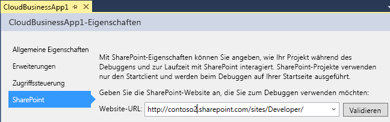

# Erstellen eines Cloud-Business-Add-InsCreate a cloud business add-in
Mit der Cloud-Geschäfts-Add-In-Vorlage in Visual Studio können Sie Add-Ins für SharePoint oder SharePoint in Office 365 erstellen, die für das Hinzufügen und Verwalten von Daten optimiert sind.By using the Cloud Business Add-in template in Visual Studio, you can create SharePoint Add-ins 2013 or SharePoint on Office 365 that are optimized for adding and managing data.
 

 **Hinweis** Der Name „Apps für SharePoint“ wird in „SharePoint-Add-Ins“ geändert. Während des Übergangszeitraums wird in der Dokumentation und der Benutzeroberfläche einiger SharePoint-Produkte und Visual Studio-Tools möglicherweise weiterhin der Begriff „Apps für SharePoint“ verwendet. Weitere Informationen finden Sie unter [Neuer Name für Office- und SharePoint-Apps](new-name-for-apps-for-sharepoint.md#bk_newname).**Note**  The name "apps for SharePoint" is changing to "SharePoint Add-ins". During the transition, the documentation and the UI of some SharePoint products and Visual Studio tools might still use the term "apps for SharePoint". For details, see  [New name for apps for Office and SharePoint](new-name-for-apps-for-sharepoint.md#bk_newname).
 

 **Hinweis** Sie können ein SharePoint-Add-In auch entwickeln, indem Sie die Vorlage für Add-Ins für SharePoint verwenden.**Note**  You can also build a SharePoint Add-in by using the Add-in for SharePoint template.
 

### So erstellen Sie ein Cloud-Business-Add-InTo create a cloud business add-in

1. Wählen Sie auf der Menüleiste die Optionen **Datei**, **Neu**, **Projekt**.On the menu bar, choose  **File**,  **New**,  **Project**.
    
    Das Dialogfeld **Neues Projekt** wird geöffnet.The  **New Project** dialog box opens.
    
 
2. Erweitern Sie in der Vorlagenliste den Knoten **Visual Basic** oder **Visual C#**, dann den Knoten **Office/SharePoint**, klicken Sie auf den Knoten **Add-Ins** und dann auf **Cloud-Business-Add-In**, wie in Abbildung 1 dargestellt.In the list of templates, expand the  **Visual Basic** or **Visual C#** node, expand the **Office/SharePoint** node, choose the **Add-ins** node, and then choose **Cloud Business Add-in**, as shown in Figure 1.
    
    **Abbildung 1. Vorlage für Cloud-Business-Add-Ins****Figure 1. Cloud Business Add-in template**

 

  
 

 

 
3. Geben Sie im Textfeld **Name** den Namen Ihres Projekts ein, und klicken Sie dann auf die Schaltfläche **OK**.In the  **Name** text box, enter a name for your project, and then choose the **OK** button.
    
    Der Assistent **Neues Cloud-Geschäfts-Add-In** wird geöffnet.The  **New Cloud Business Add-in** wizard opens.
    
 
4. Geben Sie im Assistenten **Neues Cloud-Geschäfts-Add-In** die Website-URL für Ihren SharePoint-Server oder Ihre Office 365-Entwicklerwebsite ein, wie in Abbildung 2 dargestellt, und klicken Sie anschließend auf die Schaltfläche **Fertig stellen**.In the  **New Cloud Business Add-in** wizard, enter the Site URL for your SharePoint server or your Office 365 Developer site as shown in Figure 2, and then choose the **Finish** button.
    
    **Abbildung 2. SharePoint-URL****Figure 2. SharePoint URL**

 

  
 

    Die URL sollte das Format „https://_MeineWebsite_.sharepoint.com/sites/Developer/“ haben.The URL should take the form https://  _MySite_.sharepoint.com/sites/Developer/.
    
    Dem Projektmappen-Explorer wurde eine neue Projektmappe mit vier Projekten hinzugefügt: ein Projekt auf oberster Ebene, ein **HTMLClient**-Projekt, ein **Server**-Projekt und ein **SharePoint**-Projekt.A new solution is added to Solution Explorer with four projects: a top-level project, a  **HTMLClient** project, a **Server** project, and a **SharePoint** project.
    
 

### So ändern Sie die Website für ein Cloud-Business-Add-InTo change the site for a cloud business add-in

1. Öffnen Sie im **Projektmappen-Explorer** das Kontextmenü des Projektknotens auf oberster Ebene, und klicken Sie dann auf **Eigenschaften**, wie in Abbildung 3 dargestellt.In  **Solution Explorer**, open the shortcut menu for the top-level project node and choose  **Properties**, as shown in Figure 3.
    
    **Abbildung 3. Der Projektknoten auf oberster Ebene****Figure 3. The top-level project node**

 

  
 

    Der Anwendungs-Designer wird geöffnet.The application designer opens.
    
 
2. Wählen Sie im Anwendungs-Designer die Registerkarte **SharePoint** aus, wie in Abbildung 4 dargestellt.In the application designer, choose the  **SharePoint** tab as shown in Figure 4.
    
    **Abbildung 4. Die Registerkarte „SharePoint“****Figure 4. The SharePoint tab**

 

  
 

 

 
3. Klicken Sie in der Liste **Website-URL** auf eine vorhandene URL, oder geben Sie die Website-URL Ihres SharePoint-Servers oder Ihrer Office 365-Entwicklerwebsite ein.In the  **Site URL** list, choose an existing URL or enter the Site URL for your SharePoint server or your Office 365 Developer site.
    
 
4. Klicken Sie auf die Schaltfläche **Überprüfen**, um die URL zu überprüfen.Choose the  **Validate** button to verify the URL.
    
 

## Zusätzliche RessourcenAdditional resources

-  [Entwickeln von Cloud-Business-Add-InsDevelop cloud business add-ins](develop-cloud-business-add-ins.md)
    
 
-  [Erstellen von Cloud-Business-Add-InsCreate cloud business add-ins](create-cloud-business-add-ins.md)
    
 

