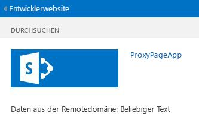

# <a name="create-a-custom-proxy-page-for-the-cross-domain-library-in-sharepoint"></a><span data-ttu-id="85db3-102">Erstellen einer benutzerdefinierten Proxyseite für die domänenübergreifende Bibliothek in SharePoint</span><span class="sxs-lookup"><span data-stu-id="85db3-102">Create a custom proxy page for the cross-domain library in SharePoint</span></span>
<span data-ttu-id="85db3-103">In diesem Artikel erfahren Sie, wie eine benutzerdefinierte Proxyseite für den Zugriff auf Daten in einem Remotedienst von einer SharePoint-Webseite aus unter Verwendung der domänenübergreifenden Bibliothek in SharePoint erstellt wird.</span><span class="sxs-lookup"><span data-stu-id="85db3-103">Learn how to create a custom proxy page to access data in a remote service from a SharePoint webpage by using the cross domain library in SharePoint.</span></span> 
 

 <span data-ttu-id="85db3-p101">**Hinweis** Der Name „Apps für SharePoint“ wird in „SharePoint-Add-Ins“ geändert. Während des Übergangszeitraums wird in der Dokumentation und der Benutzeroberfläche einiger SharePoint-Produkte und Visual Studio-Tools möglicherweise weiterhin der Begriff „Apps für SharePoint“ verwendet. Weitere Informationen finden Sie unter [Neuer Name für Office- und SharePoint-Apps](new-name-for-apps-for-sharepoint.md#bk_newname).</span><span class="sxs-lookup"><span data-stu-id="85db3-p101">**Note**  The name "apps for SharePoint" is changing to "SharePoint Add-ins". During the transition, the documentation and the UI of some SharePoint products and Visual Studio tools might still use the term "apps for SharePoint". For details, see  [New name for apps for Office and SharePoint](new-name-for-apps-for-sharepoint.md#bk_newname).</span></span>
 

<span data-ttu-id="85db3-p102">Beim Erstellen von SharePoint-Add-Ins müssen in der Regel Daten von verschiedenen Quellen eingebunden werden. Aus Sicherheitsgründen gibt es jedoch Sperrmechanismen, die eine gleichzeitige Kommunikation mit mehr als einer Domäne verhindern.</span><span class="sxs-lookup"><span data-stu-id="85db3-p102">When you are building SharePoint Add-ins, you usually have to incorporate data from various sources. However, for security reasons, there are blocking mechanisms that prevent communication with more than one domain at a time.</span></span>
 

<span data-ttu-id="85db3-p103">Über die domänenübergreifende Bibliothek können Sie auf Daten in Ihrem Remote-Add-In zugreifen, wenn Sie eine benutzerdefinierte Proxyseite bereitstellen, die in der Infrastruktur des Remote-Add-Ins gehostet wird. Als Entwickler sind Sie für die Implementierung der benutzerdefinierten Proxyseite verantwortlich und müssen für die benutzerdefinierte Logik sorgen, also auch den Authentifizierungsmechanismus für das Remote-Add-In. Verwenden Sie die domänenübergreifende Bibliothek mit einer benutzerdefinierten Proxyseite, wenn die Kommunikation auf Clientebene erfolgen soll.</span><span class="sxs-lookup"><span data-stu-id="85db3-p103">You can use the cross-domain library to access data in your remote add-in if you provide a custom proxy page that is hosted in the remote add-in infrastructure. As the developer, you are responsible for implementing the custom proxy page, and have to deal with custom logic, such as the authentication mechanism to the remote add-in. Use the cross-domain library with a custom proxy page if you want the communication to occur at the client level.</span></span>
 


## <a name="prerequisites-for-using-the-examples-in-this-article"></a><span data-ttu-id="85db3-112">Voraussetzungen für die Verwendung der Beispiele in diesem Artikel</span><span class="sxs-lookup"><span data-stu-id="85db3-112">Prerequisites for using the examples in this article</span></span>
<span data-ttu-id="85db3-113"><a name="SP15Createcustomproxypage_Prereq"> </a></span><span class="sxs-lookup"><span data-stu-id="85db3-113"><a name="SP15Createcustomproxypage_Prereq"> </a></span></span>

<span data-ttu-id="85db3-114">Sie benötigen eine Entwicklungsumgebung, wie unter [Erste Schritte beim Erstellen von von einem Anbieter gehosteten SharePoint-Add-Ins](get-started-creating-provider-hosted-sharepoint-add-ins.md) erläutert.</span><span class="sxs-lookup"><span data-stu-id="85db3-114">You need a development environment as explained in  [Get started creating provider-hosted SharePoint Add-ins](get-started-creating-provider-hosted-sharepoint-add-ins.md).</span></span>
 

 

### <a name="core-concepts-to-know-before-using-a-custom-proxy-page-with-sharepoint-add-ins"></a><span data-ttu-id="85db3-115">Kernkonzepte, die Ihnen vor der Verwendung einer benutzerdefinierten Proxyseite mit SharePoint-Add-Ins bekannt sein sollten</span><span class="sxs-lookup"><span data-stu-id="85db3-115">Core concepts to know before using a custom proxy page with SharePoint Add-ins</span></span>

<span data-ttu-id="85db3-116">In der folgenden Tabelle werden einige wichtige Artikel aufgelistet, in denen die relevanten Konzepte für ein domänenübergreifendes Szenario für SharePoint-Add-Ins erläutert werden.</span><span class="sxs-lookup"><span data-stu-id="85db3-116">The following table lists some useful articles that can help you understand the concepts involved in a cross-domain scenario for SharePoint Add-ins.</span></span>
 

 

<span data-ttu-id="85db3-117">**Tabelle 1. Kernkonzepte der Verwendung einer benutzerdefinierten Proxyseite**</span><span class="sxs-lookup"><span data-stu-id="85db3-117">**Table 1. Core concepts for using a custom proxy page**</span></span>


|<span data-ttu-id="85db3-118">**Titel des Artikels**</span><span class="sxs-lookup"><span data-stu-id="85db3-118">**Article title**</span></span>|<span data-ttu-id="85db3-119">**Beschreibung**</span><span class="sxs-lookup"><span data-stu-id="85db3-119">**Description**</span></span>|
|:-----|:-----|
| [<span data-ttu-id="85db3-120">SharePoint-Add-Ins</span><span class="sxs-lookup"><span data-stu-id="85db3-120">SharePoint Add-ins</span></span>](sharepoint-add-ins.md)|<span data-ttu-id="85db3-121">Hier finden Sie Informationen über das neue Add-In-Modell in SharePoint, das es Ihnen ermöglicht, Add-Ins als kompakte, einfach zu verwendende Lösungen für Endbenutzer zu erstellen.</span><span class="sxs-lookup"><span data-stu-id="85db3-121">Learn about the new add-in model in SharePoint that enables you to create add-ins, which are small, easy-to-use solutions for end users.</span></span>|
| [<span data-ttu-id="85db3-122">Sicherer Datenzugriff und Clientobjektmodelle für SharePoint-Add-Ins</span><span class="sxs-lookup"><span data-stu-id="85db3-122">Secure data access and client object models for SharePoint Add-ins</span></span>](secure-data-access-and-client-object-models-for-sharepoint-add-ins.md)|<span data-ttu-id="85db3-123">In diesem Artikel erhalten Sie Informationen über Zugriffsoptionen in SharePoint-Add-Ins. Zudem dient er als Leitfaden für Alternativen auf oberer Ebene, aus denen Sie bei der Arbeit mit Daten in Ihrem Add-In auswählen müssen.</span><span class="sxs-lookup"><span data-stu-id="85db3-123">Learn about data access options in SharePoint Add-ins. This topic provides guidance on the high-level alternatives you have to choose from when working with data in your add-in.</span></span>|
| [<span data-ttu-id="85db3-124">Hostwebs, Add-In-Webs und SharePoint-Komponenten in SharePoint</span><span class="sxs-lookup"><span data-stu-id="85db3-124">Host webs, add-in webs, and SharePoint components in SharePoint</span></span>](host-webs-add-in-webs-and-sharepoint-components-in-sharepoint.md)|<span data-ttu-id="85db3-p104">In diesem Artikel erfahren Sie, welche Unterschiede zwischen Hostwebsites und Add-In-Websites bestehen. Sie erfahren zudem, welche SharePoint-Komponenten in eine SharePoint-Add-In aufgenommen werden können, welche Komponenten für die Hostwebsite und welche für die Add-In-Website bereitgestellt werden und wie die Add-In-Website in einer isolierten Domäne bereitgestellt wird.</span><span class="sxs-lookup"><span data-stu-id="85db3-p104">Learn about the difference between host webs and add-in webs. Find out which SharePoint components can be included in a SharePoint Add-in, which components are deployed to the host web, which components are deployed to the add-in web, and how the add-in web is deployed in an isolated domain.</span></span>|
| [<span data-ttu-id="85db3-127">Clientseitige domänenübergreifende Sicherheit</span><span class="sxs-lookup"><span data-stu-id="85db3-127">Client-side Cross-domain Security</span></span>](http://msdn.microsoft.com/en-us/library/cc709423%28v=vs.85%29.aspx)|<span data-ttu-id="85db3-128">In diesem Artikel werden domänenübergreifende Bedrohungen und Anwendungsfälle sowie Sicherheitsprinzipien für ursprungsübergreifende Anforderungen beschrieben und die Risiken für Entwickler bewertet, die den domänenübergreifenden Zugriff von Webanwendungen, die im Browser ausgeführt werden, verbessern möchten.</span><span class="sxs-lookup"><span data-stu-id="85db3-128">Explore cross-domain threats and use cases, and security principles for cross-origin requests, and weigh the risks for developers to enhance cross-domain access from web applications that run in the browser.</span></span>|

## <a name="code-example-access-remote-data-using-a-custom-proxy-page-for-the-cross-domain-library"></a><span data-ttu-id="85db3-129">Codebeispiel: Zugreifen auf Remotedaten unter Verwendung einer benutzerdefinierten Proxyseite für die domänenübergreifende Bibliothek</span><span class="sxs-lookup"><span data-stu-id="85db3-129">Code example: Access remote data using a custom proxy page for the cross-domain library</span></span>
<span data-ttu-id="85db3-130"><a name="SP15Createcustomproxypage_Codeexample"> </a></span><span class="sxs-lookup"><span data-stu-id="85db3-130"><a name="SP15Createcustomproxypage_Codeexample"> </a></span></span>

<span data-ttu-id="85db3-131">Führen Sie die folgenden Schritte aus, um Daten vom Remotedienst zu lesen:</span><span class="sxs-lookup"><span data-stu-id="85db3-131">To read data from the remote service, you must do the following:</span></span> 
 

 

1. <span data-ttu-id="85db3-132">Erstellen Sie ein SharePoint-Add-In-Projekt.</span><span class="sxs-lookup"><span data-stu-id="85db3-132">Create a SharePoint Add-in project.</span></span>
    
 
2. <span data-ttu-id="85db3-133">Ändern Sie das Add-In-Manifest, um die Kommunikation vom Remote-Add-In zu erlauben.</span><span class="sxs-lookup"><span data-stu-id="85db3-133">Modify the add-in manifest to allow communication from the remote add-in.</span></span>
    
 
3. <span data-ttu-id="85db3-134">Erstellen Sie die benutzerdefinierte Proxyseite und eine Inhaltsseite im Webprojekt.</span><span class="sxs-lookup"><span data-stu-id="85db3-134">Create the custom proxy page and a content page in the web project.</span></span>
    
 
4. <span data-ttu-id="85db3-135">Erstellen Sie eine Seite, die die domänenübergreifende Bibliothek im SharePoint-Add-In-Projekt verwendet.</span><span class="sxs-lookup"><span data-stu-id="85db3-135">Create a page that uses the cross-domain library in the SharePoint Add-in project.</span></span>
    
 

### <a name="to-create-the-sharepoint-add-in-project"></a><span data-ttu-id="85db3-136">So erstellen Sie das SharePoint-Add-In-Projekt</span><span class="sxs-lookup"><span data-stu-id="85db3-136">To create the SharePoint Add-in project</span></span>


1. <span data-ttu-id="85db3-p105">Öffnen Sie Visual Studio als Administrator. (Klicken Sie dazu im Menü **Start** mit der rechten Maustaste auf das Visual Studio-Symbol, und wählen Sie **Als Administrator ausführen** aus.)</span><span class="sxs-lookup"><span data-stu-id="85db3-p105">Open Visual Studio as administrator. (To do this, right-click the Visual Studio icon on the  **Start** menu, and choose **Run as administrator**.)</span></span>
    
 
2. <span data-ttu-id="85db3-139">Erstellen Sie das vom Anbieter gehostete SharePoint-Add-In wie unter [Erste Schritte beim Erstellen von von einem Anbieter gehosteten SharePoint-Add-Ins](get-started-creating-provider-hosted-sharepoint-add-ins.md) erläutert, und nennen Sie es „ProxyPageApp“.</span><span class="sxs-lookup"><span data-stu-id="85db3-139">Create the provider-hosted SharePoint Add-in as explained in  [Get started creating provider-hosted SharePoint Add-ins](get-started-creating-provider-hosted-sharepoint-add-ins.md) and name itProxyPageApp.</span></span> 
    
 

### <a name="to-edit-the-add-in-manifest-file"></a><span data-ttu-id="85db3-140">So bearbeiten Sie die Add-In-Manifestdatei</span><span class="sxs-lookup"><span data-stu-id="85db3-140">To edit the add-in manifest file</span></span>


1. <span data-ttu-id="85db3-141">Klicken Sie im **Projektmappen-Explorer** mit der rechten Maustaste auf die Datei **AppManifest.xml**, und wählen Sie **Code anzeigen** aus.</span><span class="sxs-lookup"><span data-stu-id="85db3-141">In  **Solution Explorer**, right-click the  **AppManifest.xml** file, and choose **View code**.</span></span>
    
 
2. <span data-ttu-id="85db3-142">Ersetzen Sie das gesamte **AppPrincipal**-Element durch Folgendes.</span><span class="sxs-lookup"><span data-stu-id="85db3-142">Replace the entire  **AppPrincipal** element with the following.</span></span>
    
```XML
  <AppPrincipal>
    <Internal AllowedRemoteHostUrl="~remoteAppUrl"/>
</AppPrincipal>
```


     **Note**  The  **AllowedRemoteHostUrl** attribute is used to specify the remote domain. The **~remoteAppUrl** resolves to the remote add-in URL. For more information about tokens, see [Explore the app manifest structure and the package of a SharePoint Add-in](explore-the-app-manifest-structure-and-the-package-of-a-sharepoint-add-in.md).

### <a name="to-create-a-custom-proxy-page"></a><span data-ttu-id="85db3-143">So erstellen Sie eine benutzerdefinierte Proxyseite</span><span class="sxs-lookup"><span data-stu-id="85db3-143">To create a custom proxy page</span></span>


1. <span data-ttu-id="85db3-p106">Klicken Sie nach dem Erstellen der Visual Studio-Projektmappe mit der rechten Maustaste auf das Webanwendungsprojekt (nicht das SharePoint-Add-In-Projekt), und fügen Sie ein neues Webformular hinzu, indem Sie **Hinzufügen** > **Neues Element** > **Web** > **Webformular** auswählen. Geben Sie dem Formular den Namen „Proxy.aspx“.</span><span class="sxs-lookup"><span data-stu-id="85db3-p106">After the Visual Studio solution has been created, right-click the web application project (not the SharePoint Add-in project) and add a new Web Form by choosing  **Add** > **New Item** > **Web** > **Web Form**. Name the form Proxy.aspx.</span></span>
    
 
2. <span data-ttu-id="85db3-p107">Ersetzen Sie das gesamte HTML-Element und seine untergeordneten Elemente in der Datei Proxy.aspx durch den folgenden HTML-Code. Behalten Sie das gesamte Markup oberhalb des HTML-Elements wie vorhanden bei. Der HTML-Code enthält ein Markup und JavaScript, das die folgenden Aufgaben ausführt:</span><span class="sxs-lookup"><span data-stu-id="85db3-p107">In the Proxy.aspx file, replace the entire html element and it's children with the following HTML code. Leave all the markup above the html element as it is. The HTML code contains markup and JavaScript that performs the following tasks:</span></span>
    
      - <span data-ttu-id="85db3-149">Es stellt einen Platzhalter für die Datei JavaScript der domänenübergreifenden Bibliothek bereit.</span><span class="sxs-lookup"><span data-stu-id="85db3-149">Provides a placeholder for the cross-domain library JavaScript file.</span></span>
    
 
  - <span data-ttu-id="85db3-150">Es extrahiert die URL der Add-In-Website aus dem Verweiser.</span><span class="sxs-lookup"><span data-stu-id="85db3-150">Extracts the add-in web URL from the referrer.</span></span>
    
 
  - <span data-ttu-id="85db3-151">Es lädt die JavaScript-Datei der domänenübergreifenden Bibliothek dynamisch in den Platzhalter.</span><span class="sxs-lookup"><span data-stu-id="85db3-151">Dynamically loads the cross-domain library JavaScript file into the placeholder.</span></span>
    
 
  - <span data-ttu-id="85db3-152">Es stellt Einstellungen für das **RequestExecutorMessageProcessor**-Objekt bereit.</span><span class="sxs-lookup"><span data-stu-id="85db3-152">Provides settings for the  **RequestExecutorMessageProcessor** object.</span></span>
    
 
  - <span data-ttu-id="85db3-153">Es initialisiert das **RequestExecutorMessageProcessor**-Objekt.</span><span class="sxs-lookup"><span data-stu-id="85db3-153">Initializes the  **RequestExecutorMessageProcessor** object.</span></span>
    
 

```HTML
  <html xmlns="http://www.w3.org/1999/xhtml">
<head runat="server">
    <meta http-equiv="X-UA-Compatible" content="IE=8" /> 
    <title>Custom Proxy Host Page</title>
    <script 
        src="http://ajax.aspnetcdn.com/ajax/4.0/1/MicrosoftAjax.js" 
        type="text/javascript">
    </script>
    <script 
        type="text/javascript" 
        src="http://ajax.aspnetcdn.com/ajax/jQuery/jquery-1.7.2.min.js">
    </script>

    <!-- Script to load the cross-domain library js file -->
    <script type="text/javascript">
        var hostweburl;

        $(document).ready(function(){
            //Get the URI decoded host web URL.
            hostweburl =
                decodeURIComponent(
                    getQueryStringParameter("SPHostUrl")
            );

            // The cross-domain js file is in a URL in the form:
            // host_web_url/_layouts/15/SP.RequestExecutor.js
            var scriptbase = hostweburl + "/_layouts/15/";

            // Load the js file 
            $.getScript(scriptbase + "SP.RequestExecutor.js", initCustomProxy);
        });

        //Function to initialize the custom proxy page
        //  must set the appropriate settings and implement
        //  proper authentication mechanism
        function initCustomProxy() {
            var settings =
            {
                originAuthorityValidator: function (messageOriginAuthority) {
                    // This page must implement the authentication for the
                    //   remote add-in.
                       // You should validate if messageOriginAuthority is
                       //  an approved domain to receive calls from.
                    return true;
                }
            };
            SP.RequestExecutorMessageProcessor.init(settings);
        }

        // Function to retrieve a query string value.
        // For production purposes you may want to use
        //  a library to handle the query string.
        function getQueryStringParameter(paramToRetrieve) {
            var params =
                document.URL.split("?")[1].split("&amp;");
            var strParams = "";
            for (var i = 0; i < params.length; i = i + 1) {
                var singleParam = params[i].split("=");
                if (singleParam[0] == paramToRetrieve)
                    return singleParam[1];
            }
        }
    </script>
</head>
<body>
    
</body>
</html>


```


     **Important**  In a production SharePoint Add-in, you must provide the authorization logic and return the appropriate value in the  **originAuthorityValidator** object in settings.

### <a name="to-create-a-content-page"></a><span data-ttu-id="85db3-154">So erstellen Sie eine Inhaltsseite</span><span class="sxs-lookup"><span data-stu-id="85db3-154">To create a content page</span></span>


1. <span data-ttu-id="85db3-p108">Klicken Sie im **Projektmappen-Explorer** mit der rechten Maustaste auf das Webanwendungsprojekt, und fügen Sie ein neues Webformular hinzu, indem Sie **Hinzufügen** > **Neues Element** > **Web** > **Webformular** auswählen. Geben Sie dem Formular den Namen „Content.aspx“.</span><span class="sxs-lookup"><span data-stu-id="85db3-p108">Right-click the web application project in  **Solution Explorer** and add a new Web Form by choosing **Add** > **New Item** > **Web** > **Web Form**. Name the form Content.aspx..</span></span>
    
 
2. <span data-ttu-id="85db3-p109">Kopieren Sie den folgenden Code, und fügen Sie ihn in die **Page_Load**-Methode in der CodeBehind-Datei ein. Der Code führt die folgenden Aufgaben aus:</span><span class="sxs-lookup"><span data-stu-id="85db3-p109">Copy the following code and paste it in the  **Page_Load** method in the code-behind file. The code performs the following tasks:</span></span>
    
      - <span data-ttu-id="85db3-159">Legt den **content-type** der Ausgabe auf **text/plain** fest</span><span class="sxs-lookup"><span data-stu-id="85db3-159">Sets the output  **content-type** to **text/plain**.</span></span>
    
 
  - <span data-ttu-id="85db3-160">Schreibt den Inhalt in den Ausgabepuffer</span><span class="sxs-lookup"><span data-stu-id="85db3-160">Writes the content to the output buffer.</span></span>
    
 
  - <span data-ttu-id="85db3-161">Beendet die Verbindung</span><span class="sxs-lookup"><span data-stu-id="85db3-161">Ends the connection.</span></span>
    
 

```C#
  string content;
content = "Just some text.";
Response.ContentType="text/plain";
Response.Write(content);
Response.End();

```


### <a name="to-create-a-sharepoint-webpage-that-uses-the-cross-domain-library"></a><span data-ttu-id="85db3-162">So erstellen Sie eine SharePoint-Webseite, die die domänenübergreifende Bibliothek verwendet</span><span class="sxs-lookup"><span data-stu-id="85db3-162">To create a SharePoint webpage that uses the cross-domain library</span></span>


1. <span data-ttu-id="85db3-163">Klicken Sie mit der rechten Maustaste auf das SharePoint-Add-In-Projekt, und wählen Sie **Hinzufügen** > **Neues Element** > **Office/SharePoint** > **Modul** aus.</span><span class="sxs-lookup"><span data-stu-id="85db3-163">Right-click the SharePoint Add-in project, and choose  **Add** > **New Item** > **Office/SharePoint** > **Module**.</span></span>
    
 
2. <span data-ttu-id="85db3-164">Geben Sie dem Modul den Namen „Pages“, und wählen Sie dann **Hinzufügen** aus.</span><span class="sxs-lookup"><span data-stu-id="85db3-164">Name the module Pages, and then choose  **Add**.</span></span>
    
 
3. <span data-ttu-id="85db3-165">Klicken Sie mit der rechten Maustaste auf den Ordner **Pages**, und wählen Sie **Hinzufügen** > **Neues Element**>  **Office/SharePoint** > **Seite** aus.</span><span class="sxs-lookup"><span data-stu-id="85db3-165">Right-click the  **Pages** folder and choose **Add** > **New Item**>  **Office/SharePoint** > **Page**.</span></span> 
    
 
4. <span data-ttu-id="85db3-166">Geben Sie der Seite den Namen „Home.aspx“, und wählen Sie dann **Hinzufügen** aus.</span><span class="sxs-lookup"><span data-stu-id="85db3-166">Name the page Home.aspx and then choose **Add**.</span></span>
    
 
5. <span data-ttu-id="85db3-167">Öffnen Sie die Seite **Home.aspx**, falls sie nicht automatisch geöffnet wird.</span><span class="sxs-lookup"><span data-stu-id="85db3-167">Open the  **Home.aspx** page if it isn't opened automatically.</span></span>
    
 
6. <span data-ttu-id="85db3-168">Kopieren Sie den folgenden Code, und fügen Sie ihn in das **PlaceHolderMain**-Inhaltstag ein.</span><span class="sxs-lookup"><span data-stu-id="85db3-168">Copy the following code and paste it in the  **PlaceHolderMain** content tag.</span></span>
    
```
  <!-- The page dynamically loads the cross-domain library's
    js file, rescript acts as the placeholder. -->
<script 
    type="text/javascript"
    id="rescript"
    src="../_layouts/15/SP.RequestExecutor.js">
</script>
    Data from the remote domain: <span id="TextData"></span>

    <!-- Main script to retrieve the host web's title -->
    <script type="text/javascript">
    (function () {
        var executor;
        var hostweburl;
        var remotedomain;

        remotedomain = "<your_remote_add-in_domain>";

        //Get the URI decoded host web URL.
        hostweburl =
            decodeURIComponent(
                getQueryStringParameter("SPHostUrl")
        );

        // Initialize the RequestExecutor with the custom proxy URL.
        executor = new SP.RequestExecutor(remotedomain);
        executor.iFrameSourceUrl = "Proxy.aspx?SPHostUrl=" + hostweburl;

        // Issue the call against the remote endpoint.
        // The response formats the data in plain text.
        // The functions successHandler and errorHandler attend the
        //      sucess and error events respectively.
        executor.executeAsync(
            {
                url:
                    remotedomain + "Content.aspx",
                method: "GET",
                headers: { "Accept": "text/plain" },
                success: successHandler,
                error: errorHandler
            }
        );
    })();

    // Function to handle the success event.
    // Prints the data to the placeholder.
    function successHandler(data) {
        document.getElementById("TextData").innerText =
            data.body;
    }

    // Function to handle the error event.
    // Prints the error message to the page.
    function errorHandler(data, errorCode, errorMessage) {
        document.getElementById("TextData").innerText =
            "Could not complete cross-domain call: " + errorMessage;
    }

    // Function to retrieve a query string value.
    // For production purposes you may want to use
    //  a library to handle the query string.
    function getQueryStringParameter(paramToRetrieve) {
        var params =
            document.URL.split("?")[1].split("&amp;");
        var strParams = "";
        for (var i = 0; i < params.length; i = i + 1) {
            var singleParam = params[i].split("=");
            if (singleParam[0] == paramToRetrieve)
                return singleParam[1];
        }
    }
    </script>

```

7. <span data-ttu-id="85db3-p110">Suchen Sie im vorstehenden, von Ihnen eingefügten Code nach der Zeile `remotedomain = "<your_remote_add-in_domain>";`, und ersetzen Sie den Platzhalter _<your_remote_add-in_domain>_ durch die Localhost-URL, die Ihre Webanwendung verwendet, wenn Sie das Add-In mit F5 in Visual Studio ausführen. Sie finden diesen Wert, indem Sie das Webanwendungsprojekt im **Projektmappen-Explorer** auswählen. Die Eigenschaft **URL** befindet sich im Bereich **Eigenschaften**. Verwenden Sie den gesamten Wert, einschließlich Protokoll, Port und schließendem Schrägstrich, z. B. „http://localhost:45072“.</span><span class="sxs-lookup"><span data-stu-id="85db3-p110">In the preceding code that you pasted, find the line  `remotedomain = "<your_remote_add-in_domain>";`, and replace the placeholder  _<your_remote_add-in_domain>_ with the "localhost" URL that your web application uses when you are running the add-in with F5 in Visual Studio. To find this value, select the web application project in **Solution Explorer**. The  **URL** property will be in the **Properties** pane. Use the entire value, including the protocol, the port, and the closing slash; for example "http://localhost:45072".</span></span>
    
 
8. <span data-ttu-id="85db3-173">Speichern und schließen Sie die Datei.</span><span class="sxs-lookup"><span data-stu-id="85db3-173">Save and close the file.</span></span>
    
 
9. <span data-ttu-id="85db3-174">Öffnen Sie die Datei „appmanifest.xml“, und legen Sie den Wert **Startseite** auf **ProxyPageApp/Pages/Home.aspx** fest.</span><span class="sxs-lookup"><span data-stu-id="85db3-174">Open the appmanifest.xml file, and set the  **Start page** value to **ProxyPageApp/Pages/Home.aspx**.</span></span>
    
 

### <a name="to-build-and-run-the-solution"></a><span data-ttu-id="85db3-175">So erstellen Sie die Lösung und führen sie aus</span><span class="sxs-lookup"><span data-stu-id="85db3-175">To build and run the solution</span></span>


1. <span data-ttu-id="85db3-176">Stellen Sie sicher, dass das "SharePoint-Add-In"-Projekt als Startprojekt festgelegt ist.</span><span class="sxs-lookup"><span data-stu-id="85db3-176">Make sure that the SharePoint Add-in project is set as the startup project.</span></span>
    
 
2. <span data-ttu-id="85db3-177">Drücken Sie F5.</span><span class="sxs-lookup"><span data-stu-id="85db3-177">Press the F5 key.</span></span>
    
     <span data-ttu-id="85db3-178">**Hinweis** Wenn Sie F5 drücken, erstellt Visual Studio die Lösung, stellt das Add-In bereit und öffnet die Berechtigungsseite für das Add-In.</span><span class="sxs-lookup"><span data-stu-id="85db3-178">**Note**  When you press F5, Visual Studio builds the solution, deploys the add-in, and opens the permissions page for the add-in.</span></span>
3. <span data-ttu-id="85db3-179">Klicken Sie auf die Schaltfläche **Vertrauen**.</span><span class="sxs-lookup"><span data-stu-id="85db3-179">Choose the  **Trust It** button.</span></span>
    
    <span data-ttu-id="85db3-p111">Die Startseite wird geöffnet und sollte wie folgt aussehen. Es kann einige Sekunden dauern, bis der Begriff „Nur etwas Text" angezeigt wird, da er von der Content.aspx-Seite der Remotedomäne abgerufen wird.</span><span class="sxs-lookup"><span data-stu-id="85db3-p111">The Home page will open and it should look like the following. It may take a few seconds for the phrase "Just some text" to appear because it is being fetched from the remote domain's Content.aspx page.</span></span>
    

    <span data-ttu-id="85db3-182">**Daten aus dem Remotedienst auf einer SharePoint-Webseite**</span><span class="sxs-lookup"><span data-stu-id="85db3-182">**Data from the remote service in a SharePoint webpage**</span></span>

 

  
 

 

 

<span data-ttu-id="85db3-184">**Tabelle 2: Problembehandlung für die Lösung**</span><span class="sxs-lookup"><span data-stu-id="85db3-184">**Table 2. Troubleshooting the solution**</span></span>


|<span data-ttu-id="85db3-185">**Problem**</span><span class="sxs-lookup"><span data-stu-id="85db3-185">**Problem**</span></span>|<span data-ttu-id="85db3-186">**Lösung**</span><span class="sxs-lookup"><span data-stu-id="85db3-186">**Solution**</span></span>|
|:-----|:-----|
|<span data-ttu-id="85db3-187">Der Browser wird nicht geöffnet, nachdem Sie F5 gedrückt haben.</span><span class="sxs-lookup"><span data-stu-id="85db3-187">Visual Studio does not open the browser after you press the F5 key.</span></span>|<span data-ttu-id="85db3-188">Legen Sie das SharePoint-Add-In-Projekt als Startprojekt fest.</span><span class="sxs-lookup"><span data-stu-id="85db3-188">Set the SharePoint Add-in project as the startup project.</span></span>|
|<span data-ttu-id="85db3-189">Unbehandelte Ausnahme **SP ist undefiniert**.</span><span class="sxs-lookup"><span data-stu-id="85db3-189">Unhandled exception  **SP is undefined**.</span></span>|<span data-ttu-id="85db3-190">Stellen Sie sicher, dass Sie in einem Browserfenster auf die Datei „SP.RequestExecutor.js“ zugreifen können.</span><span class="sxs-lookup"><span data-stu-id="85db3-190">Make sure that you can access the SP.RequestExecutor.js file in a browser window.</span></span>|

## <a name="next-steps"></a><span data-ttu-id="85db3-191">Nächste Schritte</span><span class="sxs-lookup"><span data-stu-id="85db3-191">Next steps</span></span>
<span data-ttu-id="85db3-192"><a name="SP15Createcustomproxypage_Nextsteps"> </a></span><span class="sxs-lookup"><span data-stu-id="85db3-192"><a name="SP15Createcustomproxypage_Nextsteps"> </a></span></span>

<span data-ttu-id="85db3-p112">In diesem Artikel wurde gezeigt, wie mit einer benutzerdefinierten Proxyseite für die domänenübergreifende Bibliothek in SharePoint auf Remotedaten zugegriffen wird. Als Nächstes können Sie sich über andere Datenzugriffsoptionen in SharePoint-Add-Ins informieren. Nähere Einzelheiten finden Sie unter:</span><span class="sxs-lookup"><span data-stu-id="85db3-p112">This article demonstrated how to access remote data by using a custom proxy page for the cross-domain library in SharePoint. As a next step, you can learn about other data access options available in SharePoint Add-ins. To learn more, see the following:</span></span>
 

 

-  [<span data-ttu-id="85db3-195">Codebeispiel: Abrufen von Daten unter Verwendung einer Proxyseite für die domänenübergreifende Bibliothek</span><span class="sxs-lookup"><span data-stu-id="85db3-195">Code sample: Get data by using a proxy page for the cross-domain library</span></span>](http://code.msdn.microsoft.com/SharePoint-Get-data-10039ff1)
    
 
-  [<span data-ttu-id="85db3-196">Zugreifen auf SharePoint-Daten über Add-Ins mithilfe der domänenübergreifenden Bibliothek</span><span class="sxs-lookup"><span data-stu-id="85db3-196">Access SharePoint data from add-ins using the cross-domain library</span></span>](access-sharepoint-data-from-add-ins-using-the-cross-domain-library.md)
    
 
-  [<span data-ttu-id="85db3-197">Abfragen eines Remotediensts mithilfe des Webproxys in SharePoint</span><span class="sxs-lookup"><span data-stu-id="85db3-197">Query a remote service using the web proxy in SharePoint</span></span>](query-a-remote-service-using-the-web-proxy-in-sharepoint.md)
    
 

## <a name="additional-resources"></a><span data-ttu-id="85db3-198">Zusätzliche Ressourcen</span><span class="sxs-lookup"><span data-stu-id="85db3-198">Additional resources</span></span>
<span data-ttu-id="85db3-199"><a name="SP15Createcustomproxypage_Addresources"> </a></span><span class="sxs-lookup"><span data-stu-id="85db3-199"><a name="SP15Createcustomproxypage_Addresources"> </a></span></span>


-  [<span data-ttu-id="85db3-200">Einrichten einer lokalen Entwicklungsumgebung für SharePoint-Add-Ins</span><span class="sxs-lookup"><span data-stu-id="85db3-200">Set up an on-premises development environment for SharePoint Add-ins</span></span>](set-up-an-on-premises-development-environment-for-sharepoint-add-ins.md)
    
 
-  [<span data-ttu-id="85db3-201">Arbeiten mit externen Daten in SharePoint</span><span class="sxs-lookup"><span data-stu-id="85db3-201">Work with external data in SharePoint</span></span>](work-with-external-data-in-sharepoint.md)
    
 
-  [<span data-ttu-id="85db3-202">Sicherer Datenzugriff und Clientobjektmodelle für SharePoint-Add-Ins</span><span class="sxs-lookup"><span data-stu-id="85db3-202">Secure data access and client object models for SharePoint Add-ins</span></span>](secure-data-access-and-client-object-models-for-sharepoint-add-ins.md)
    
 
-  [<span data-ttu-id="85db3-203">Autorisierung und Authentifizierung für Add-Ins in SharePoint</span><span class="sxs-lookup"><span data-stu-id="85db3-203">Authorization and authentication of SharePoint Add-ins</span></span>](authorization-and-authentication-of-sharepoint-add-ins.md)
    
 
-  [<span data-ttu-id="85db3-204">Verwenden von OData-Abfragevorgängen in SharePoint REST-Anforderungen</span><span class="sxs-lookup"><span data-stu-id="85db3-204">Use OData query operations in SharePoint REST requests</span></span>](use-odata-query-operations-in-sharepoint-rest-requests.md)
    
 
-  [<span data-ttu-id="85db3-205">Drei Ansätze, um Entwurfsentscheidungen für SharePoint-Add-Ins zu treffen</span><span class="sxs-lookup"><span data-stu-id="85db3-205">Three ways to think about design options for SharePoint Add-ins</span></span>](three-ways-to-think-about-design-options-for-sharepoint-add-ins.md)
    
 
-  [<span data-ttu-id="85db3-206">Kritische Aspekte der Architektur und der Entwicklungslandschaft für SharePoint-Add-Ins</span><span class="sxs-lookup"><span data-stu-id="85db3-206">Important aspects of the SharePoint Add-in architecture and development landscape</span></span>](important-aspects-of-the-sharepoint-add-in-architecture-and-development-landscap.md)
    
 
-  [<span data-ttu-id="85db3-207">Datenspeicheroptionen in SharePoint Add-Ins</span><span class="sxs-lookup"><span data-stu-id="85db3-207">Data storage in SharePoint Add-ins</span></span>](important-aspects-of-the-sharepoint-add-in-architecture-and-development-landscap.md#Data)
    
 

