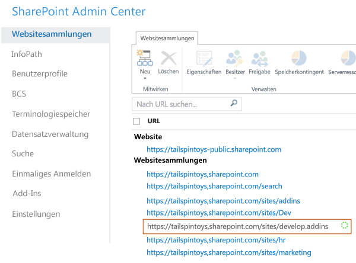

# Erstellen einer Entwicklerwebsite in einem vorhandenen Office 365-AbonnementCreate a developer site on an existing Office 365 subscription
Eine Office 365-Entwicklerwebsite erleichtert Ihnen die Einrichtung und den Einstieg in das Erstellen, Testen und Bereitstellen Ihrer Office- und SharePoint-Add-Ins. Viele Office 365 Business-, Enterprise-, Education- und Government-Abonnements enthalten eine Websitevorlage, die Sie zum Erstellen einer Entwicklerwebsite verwenden können.An Office 365 Developer Site makes it easier to get set up and start creating, testing, and deploying your Office and SharePoint Add-ins more quickly. Many Office 365 Business, Enterprise, Education, and Government subscriptions include a site template you can use to create a Developer Site.
 

 **Hinweis** Der Name „Apps für SharePoint“ wird in „SharePoint-Add-Ins“ geändert. Während des Übergangszeitraums wird in der Dokumentation und der Benutzeroberfläche einiger SharePoint-Produkte und Visual Studio-Tools möglicherweise weiterhin der Begriff „Apps für SharePoint“ verwendet. Weitere Informationen finden Sie unter [Neuer Name für Office- und SharePoint-Apps](new-name-for-apps-for-sharepoint.md#bk_newname).**Note**  The name "apps for SharePoint" is changing to "SharePoint Add-ins". During the transition, the documentation and the UI of some SharePoint products and Visual Studio tools might still use the term "apps for SharePoint". For details, see  [New name for apps for Office and SharePoint](new-name-for-apps-for-sharepoint.md#bk_newname).
 

 **Bevor Sie beginnen****Before you start**
 

-  **Stellen Sie sicher, dass Sie ein Office 365-Abonnement besitzen, das eine Entwicklerwebsite unterstützt.** Wenn Sie eins der folgenden Office 365 Abonnementpläne besitzen, können Sie in Ihrem vorhandenen Abonnement eine Website für Entwickler erstellen:**Be sure you have an Office 365 subscription that supports a Developer Site.** If you have one of the following Office 365 subscription plans, you can create a Developer Site within your existing subscription:
    
    - Office 365 Midsize BusinessOffice 365 Midsize Business
    
 
- Office 365 Enterprise E1, E3, E4, E5 oder K1Office 365 Enterprise E1, E3, E4, E5, or K1
    
 
- Office 365 Education A2, A3 oder A4Office 365 Education A2, A3, or A4
    
 
- Office 365 Government G1, G3, G4 oder K1Office 365 Government G1, G3, G4, or K1
    
 
-  **Wenn Sie ein Office 365 Small Business-Abonnement besitzen,** unterstützt es nur eine einzelne Websitesammlung, sie können damit also keine Entwickler-Websitesammlung erstellen. Weitere Informationen über Office 365-Pläne für Ihr Unternehmen finden Sie unter [SharePoint Online: Softwarelimits und -beschränkungen](http://office.microsoft.com/en-us/office365-sharepoint-online-enterprise-help/sharepoint-online-software-boundaries-and-limits-HA102694293.aspx).**If you have an Office 365 Small Business subscription,** it supports only a single site collection, and so you can't create a Developer Site collection. If you would like to learn more about Office 365 plans for your business, see [SharePoint Online: software boundaries and limits](http://office.microsoft.com/en-us/office365-sharepoint-online-enterprise-help/sharepoint-online-software-boundaries-and-limits-HA102694293.aspx).
    
 
- Weitere Informationen zu den Office 365 Enterprise-Angeboten finden Sie unter [Pläne &amp; Preise](http://products.office.com/en-us/business/office-365-enterprise-e1-business-software ).For more information about the Office 365 Enterprise offerings, see  [Plans &amp; Pricing](http://products.office.com/en-us/business/office-365-enterprise-e1-business-software ).
    
 

## Erstellen einer EntwicklerwebsiteCreate a Developer Site

1. Melden Sie sich bei Office 365 als globaler oder SharePoint Online-Administrator an.Sign in to Office 365 as a Global or SharePoint Online admin.
    
     **Sie müssen als globaler oder SharePoint Online-Administrator angemeldet sein, um neue Websitesammlungen** wie z. B. eine Website für Entwickler zu erstellen. Nur Administratoren werden nach dem Anmelden an Office 365 Administratoroptionen angezeigt. Wenn Sie kein Administrator sind, müssen Sie einen Administrator in Ihrem Unternehmen kontaktieren, der für Sie eine der folgenden Aufgaben ausführen muss:**You must sign in as a Global or SharePoint Online admin to create new site collections,** such as a Developer Site. Only admins can see Admin options when signing into Office 365. If you're not an admin, contact an admin in your company and have them do one of the following:
    
      - Ihnen Administratorrechte gewähren, damit Sie die Entwicklerwebsite selbst erstellen können.Grant you admin rights, so you can create the Developer Site yourself.
    
 
  - Die Website für Entwickler für Sie erstellen und Sie als Administrator für die Websitesammlung angeben.Create the Developer Site for you, and specify you as an admin for the site collection.
    
 
2. Klicken Sie auf die Schaltfläche „App-Startfeld“ ganz links auf der Navigationsleiste am oberen Bildschirmrand.Click the App Launcher button on the far left of the navigation bar at top.
    
 
3. Klicken Sie auf die Kachel **Admin**.Click the  **Admin** tile.
    
 
4. Erweitern Sie in der Navigationsstruktur links den Eintrag **Admin**, und wählen Sie **SharePoint** aus.In the navigation tree on the left, expand  **Admin**, and select  **SharePoint**.
    
 
5. Klicken Sie im **SharePoint Admin Center** auf der Registerkarte **Websitesammlungen** auf **Neu > Private Websitesammlung**.In the  **SharePoint admin center**, on the **Site Collections** tab, click **New > Private Site Collection**.
    
  
 

 

 
6. Geben Sie im Dialogfeld **Neue Websitesammlung** Informationen zu Ihrer Entwicklerwebsite an.In the  **New Site Collection** dialog box, provide information about your Developer Site.
    
|**Feld****Field**|**Wert****Value**|
|:-----|:-----|
|**Titel****Title**|Der Name, den Sie Ihrer Entwicklerwebsite geben möchten.The name you want to give your Developer Site.|
|Liste **Öffentliche Websiteadresse****Public Website Address** list|Ein Domänenname und ein URL-Pfad – entweder **/sites/** oder **/teams/**; geben Sie dann einen URL-Namen für die Websitesammlung ein.A domain name and a URL path—either  **/sites/** or **/teams/**—and then type a URL name for the site collection.|
|Liste **Sprache auswählen** im Abschnitt **Vorlagenauswahl****Select a language** list in the **Template Selection** section|Eine Primärsprache für Ihre Entwicklerwebsite. **Stellen Sie sicher, dass Sie die gewünschte Sprache für die Websitesammlung „Entwicklerwebsite“ auswählen, da diese nach der Auswahl nicht mehr geändert werden kann. **Das Auswählen einer Sprache für Ihre Entwicklerwebsite hat keine Auswirkungen auf die Sprachen, die Sie in Ihren Office- und SharePoint- Add-Ins verfügbar machen können. Sie können für Ihre Websites die mehrsprachige SharePoint-Oberfläche aktivieren, doch die Primärsprache der Websitesammlung wählen Sie hier aus.A primary language to use for your Developer Site. **Be sure to select the appropriate language for the Developer Site site collection, because once you choose it, it can't be changed.**Selecting a language for your Developer Site does not affect the languages you can make available in your Office and SharePoint Add-ins.You can enable the SharePoint multiple language interface on your sites, but the primary language for the site collection is the one you choose here.|
|Abschnitt **Vorlagenauswahl** auf der Registerkarte **Zusammenarbeit** unter **Vorlage auswählen****Template Selection** section, on the **Collaboration** tab under **Select a template**|Klicken Sie auf **Entwicklerwebsite**.Choose  **Developer Site.**|
|**Zeitzone****Time Zone**|Die zum Gebietsschema Ihrer Enwicklerwebsite gehörige Zeitzone.Time zone that's appropriate for the locale of your Developer Site.|
|**Administrator****Administrator**|Der Benutzername des Websitesammlungsadministrators.The user name of your site collection administrator.|
|**Speicherkontingent****Storage Quota**|Die Anzahl der Megabytes (MB), die Sie dieser Websitesammlung zuordnen möchten.Number of megabytes (MB) you want to allocate to this Developer Site site collection.|
|**Serverressourcenkontingent****Server Resource Quota**|Die Menge an Ressourcen, die Sie der Websitesammlung zuordnen möchten. Dieser Wert ist eine Kombination von Leistungsmetriken (wie Prozessorzeit und unbehandelten Ausnahmen), die zu Code in Sandkastenlösungen gehören. Wenn der Wert ein Tageskontingent überschreitet, wird der Sandkasten für diese Websitesammlung deaktiviert.The amount of resources to allocate to the site collection. This number is a combination of performance metrics (such as processor time and unhandled exceptions) that pertain to code in sandboxed solutions. When the level exceeds a daily quota, the sandbox is turned off for this site collection.|
7. Klicken Sie auf **OK**.Click  **OK**.
    
    Die URL der neuen Entwicklerwebsite wird in der Liste **Websitesammlungen** angezeigt. Wenn die Erstellung der Website abgeschlossen ist, können Sie zur URL navigieren, um Ihre Entwicklerwebsite zu öffnen.You'll see the new developer site URL in the  **Site Collections** list. When the site creation is finished, you can navigate to the URL to open your Developer Site.
    
  
 

 

 

## Zusätzliche RessourcenAdditional resources

-  [SharePoint-Add-InsSharePoint Add-ins](sharepoint-add-ins.md)
    
 
-  [Erstellen oder Löschen einer WebsitesammlungCreate or delete a site collection](http://office.microsoft.com/en-us/office365-sharepoint-online-enterprise-help/create-or-delete-a-site-collection-HA102772354.aspx?CTT=1)
    
 

