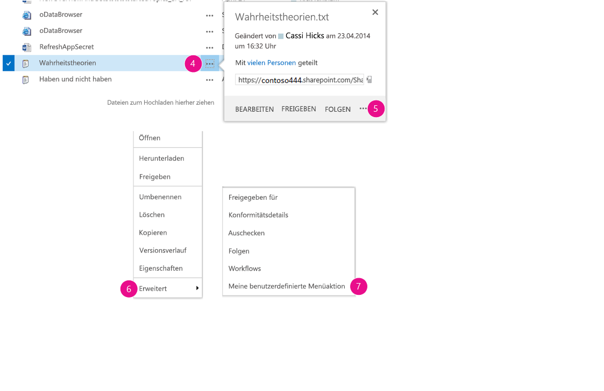

# <a name="create-custom-actions-to-deploy-with-sharepoint-add-ins"></a><span data-ttu-id="a3182-102">Erstellen benutzerdefinierter Aktionen zur Bereitstellung mit SharePoint-Add-Ins</span><span class="sxs-lookup"><span data-stu-id="a3182-102">Create custom actions to deploy with SharePoint Add-ins</span></span>
<span data-ttu-id="a3182-103">In diesem Artikel erfahren Sie, wie Sie eine benutzerdefinierte Aktion in SharePoint erstellen, die für das Hostweb bereitgestellt wird, wenn Sie ein SharePoint-Add-In bereitstellen.</span><span class="sxs-lookup"><span data-stu-id="a3182-103">Learn how to create a custom action in SharePoint that deploys to the host web when you deploy a SharePoint Add-in.</span></span>
 

 <span data-ttu-id="a3182-p101">**Hinweis** Der Name „Apps für SharePoint“ wird in „SharePoint-Add-Ins“ geändert. Während des Übergangszeitraums wird in der Dokumentation und der Benutzeroberfläche einiger SharePoint-Produkte und Visual Studio-Tools möglicherweise weiterhin der Begriff „Apps für SharePoint“ verwendet. Weitere Informationen finden Sie unter [Neuer Name für Office- und SharePoint-Apps](new-name-for-apps-for-sharepoint.md#bk_newname).</span><span class="sxs-lookup"><span data-stu-id="a3182-p101">**Note**  The name "apps for SharePoint" is changing to "SharePoint Add-ins". During the transition, the documentation and the UI of some SharePoint products and Visual Studio tools might still use the term "apps for SharePoint". For details, see  [New name for apps for Office and SharePoint](new-name-for-apps-for-sharepoint.md#bk_newname).</span></span>
 

<span data-ttu-id="a3182-p102">Wenn Sie ein SharePoint-Add-In erstellen, ermöglichen Ihnen benutzerdefinierte Aktionen die Interaktion mit den Listen und dem Menüband im Hostweb. Eine benutzerdefinierte Aktion wird für das Hostweb bereitgestellt, wenn Endbenutzer Ihr Add-In installieren. Mithilfe benutzerdefinierter Aktionen ist es möglich, eine Remotewebseite zu öffnen und über die Abfragezeichenfolge Informationen zu übergeben. Es sind zwei Typen von benutzerdefinierten Aktionen für Add-Ins verfügbar: benutzerdefinierte Aktionen für das Menüband und für Menüelemente.</span><span class="sxs-lookup"><span data-stu-id="a3182-p102">When you are creating a SharePoint Add-in, custom actions let you interact with the lists and the ribbon in the host web. A custom action deploys to the host web when end users install your add-in. Custom actions can open a remote webpage and pass information through the query string. There are two types of custom actions available for add-ins: Ribbon andMenu Item custom actions.</span></span>
 

## <a name="prerequisites-for-using-the-examples-in-this-article"></a><span data-ttu-id="a3182-111">Voraussetzungen für die Verwendung der Beispiele in diesem Artikel</span><span class="sxs-lookup"><span data-stu-id="a3182-111">Prerequisites for using the examples in this article</span></span>
<span data-ttu-id="a3182-112"><a name="SP15Createcustomactionsapps_Prereq"> </a></span><span class="sxs-lookup"><span data-stu-id="a3182-112"></span></span>

<span data-ttu-id="a3182-113">Sie benötigen eine Entwicklungsumgebung, wie unter [Erste Schritte beim Erstellen von von einem Anbieter gehosteten SharePoint-Add-Ins](get-started-creating-provider-hosted-sharepoint-add-ins.md) erläutert.</span><span class="sxs-lookup"><span data-stu-id="a3182-113">You need a development environment as explained in  [Get started creating provider-hosted SharePoint Add-ins](get-started-creating-provider-hosted-sharepoint-add-ins.md).</span></span>
 

 

### <a name="core-concepts-to-help-you-understand-custom-actions"></a><span data-ttu-id="a3182-114">Kernkonzepte für ein besseres Verständnis von benutzerdefinierten Aktionen</span><span class="sxs-lookup"><span data-stu-id="a3182-114">Core concepts to help you understand custom actions</span></span>

<span data-ttu-id="a3182-115">In der folgenden Tabelle sind hilfreiche Artikel aufgeführt, die ein besseres Verständnis der Konzepte und Schritte bei einem Szenarium mit benutzerdefinierten Aktionen ermöglichen.</span><span class="sxs-lookup"><span data-stu-id="a3182-115">The following table lists useful articles that can help you understand the concepts and steps that are involved in a custom action scenario.</span></span>
 

 

<span data-ttu-id="a3182-116">**Tabelle 1. Kernkonzepte für benutzerdefinierte Aktionen**</span><span class="sxs-lookup"><span data-stu-id="a3182-116">**Table 1. Core concepts for custom actions**</span></span>


|<span data-ttu-id="a3182-117">**Artikel**</span><span class="sxs-lookup"><span data-stu-id="a3182-117">**Article**</span></span>|<span data-ttu-id="a3182-118">**Beschreibung**</span><span class="sxs-lookup"><span data-stu-id="a3182-118">**Description**</span></span>|
|:-----|:-----|
| [<span data-ttu-id="a3182-119">SharePoint-Add-Ins</span><span class="sxs-lookup"><span data-stu-id="a3182-119">SharePoint Add-ins</span></span>](sharepoint-add-ins.md)|<span data-ttu-id="a3182-120">Hier finden Sie Informationen über das neue Add-In-Modell in SharePoint, das es Ihnen ermöglicht, Add-Ins als kompakte, einfach zu verwendende Lösungen für Endbenutzer zu erstellen.</span><span class="sxs-lookup"><span data-stu-id="a3182-120">Learn about the new add-in model in SharePoint that enables you to create add-ins, which are small, easy-to-use solutions for end users.</span></span>|
| [<span data-ttu-id="a3182-121">UX-Design für SharePoint-Add-Ins</span><span class="sxs-lookup"><span data-stu-id="a3182-121">UX design for SharePoint Add-ins</span></span>](ux-design-for-sharepoint-add-ins.md)|<span data-ttu-id="a3182-122">Hier erfahren Sie mehr über die UX-Optionen (User eXperience, Benutzerumgebung) beim Erstellen von SharePoint-Add-Ins.</span><span class="sxs-lookup"><span data-stu-id="a3182-122">Learn about the user experience (UX) options that you have when you are building SharePoint Add-ins.</span></span>|
| [<span data-ttu-id="a3182-123">Hostwebs, Add-In-Webs und SharePoint-Komponenten in SharePoint</span><span class="sxs-lookup"><span data-stu-id="a3182-123">Host webs, add-in webs, and SharePoint components in SharePoint</span></span>](host-webs-add-in-webs-and-sharepoint-components-in-sharepoint.md)|<span data-ttu-id="a3182-p103">Hier erhalten Sie Informationen über den Unterschied zwischen einem Hostweb und einem Add-In-Web. Außerdem erfahren Sie, welche SharePoint-Komponenten in ein SharePoint-Add-In eingeschlossen werden können, welche Komponenten für das Hostweb bereitgestellt werden, welche Komponenten für das Add-In-Web bereitgestellt werden, und wie das Add-In-Web in einer isolierten Domäne bereitgestellt wird.</span><span class="sxs-lookup"><span data-stu-id="a3182-p103">Learn about the difference between host webs and add-in webs. Find out which SharePoint components can be included in a SharePoint Add-in, which components are deployed to the host web, which components are deployed to the add-in web, and how the add-in web is deployed in an isolated domain.</span></span>|

## <a name="code-example-create-a-custom-action-in-the-host-web-document-libraries"></a><span data-ttu-id="a3182-126">Codebeispiel: Erstellen einer benutzerdefinierten Aktion in den Hostweb-Dokumentbibliotheken</span><span class="sxs-lookup"><span data-stu-id="a3182-126">Code example: Create a custom action in the host web document libraries</span></span>
<span data-ttu-id="a3182-127"><a name="SP15Createcustomactionsapps_Codeexample"> </a></span><span class="sxs-lookup"><span data-stu-id="a3182-127"></span></span>

<span data-ttu-id="a3182-128">Führen Sie diese Schritte aus, um eine benutzerdefinierte Aktion in den Hostweb-Dokumentbibliotheken zu erstellen:</span><span class="sxs-lookup"><span data-stu-id="a3182-128">Follow these steps to create a custom action in the host web document libraries:</span></span>
 

 

1. <span data-ttu-id="a3182-129">Erstellen Sie die SharePoint-Add-In- und Remotewebprojekte.</span><span class="sxs-lookup"><span data-stu-id="a3182-129">Create the SharePoint Add-in and remote web projects.</span></span>
    
 
2. <span data-ttu-id="a3182-130">Fügen Sie dem SharePoint-Add-In-Projekt ein benutzerdefiniertes Feature hinzu.</span><span class="sxs-lookup"><span data-stu-id="a3182-130">Add a custom action feature to the SharePoint Add-in project.</span></span>
    
 
3. <span data-ttu-id="a3182-131">Fügen Sie dem Webprojekt eine Add-In-Webseite hinzu.</span><span class="sxs-lookup"><span data-stu-id="a3182-131">Add an add-in webpage to the web project.</span></span>
    
 

### <a name="to-create-the-sharepoint-add-in-and-remote-web-projects"></a><span data-ttu-id="a3182-132">So erstellen Sie die Projekte für das SharePoint-Add-In und das Remoteweb</span><span class="sxs-lookup"><span data-stu-id="a3182-132">To create the SharePoint Add-in and remote web projects</span></span>


1. <span data-ttu-id="a3182-p104">Öffnen Sie Visual Studio als Administrator. (Klicken Sie dazu im Menü **Start** mit der rechten Maustaste auf das Visual Studio-Symbol, und wählen Sie **Als Administrator ausführen** aus.)</span><span class="sxs-lookup"><span data-stu-id="a3182-p104">Open Visual Studio as administrator. (To do this, right-click the Visual Studio icon on the  **Start** menu, and choose **Run as administrator**.)</span></span>
    
 
2. <span data-ttu-id="a3182-135">Erstellen Sie das vom Anbieter gehostete SharePoint-Add-In wie unter [Erste Schritte beim Erstellen von von einem Anbieter gehosteten SharePoint-Add-Ins](get-started-creating-provider-hosted-sharepoint-add-ins.md) erläutert, und nennen Sie es „itCustomActionsApp“.</span><span class="sxs-lookup"><span data-stu-id="a3182-135">Create the provider-hosted SharePoint Add-in as explained in  [Get started creating provider-hosted SharePoint Add-ins](get-started-creating-provider-hosted-sharepoint-add-ins.md) and name itCustomActionsApp.</span></span> 
    
 

### <a name="to-add-an-add-in-webpage-for-the-custom-actions"></a><span data-ttu-id="a3182-136">So fügen Sie eine Add-In-Webseite für die benutzerdefinierten Aktionen hinzu</span><span class="sxs-lookup"><span data-stu-id="a3182-136">To add an add-in webpage for the custom actions</span></span>


1. <span data-ttu-id="a3182-p105">Klicken Sie nach dem Erstellen der Visual Studio-Lösung mit der rechten Maustaste auf das Webanwendungsprojekt (nicht das SharePoint-Add-In-Projekt), und fügen Sie ein neues Webformular hinzu, indem Sie **Hinzufügen** > **Neues Element** > **Web** > **Webformular** auswählen. Geben Sie dem Formular den Namen „CustomActionTarget.aspx“.</span><span class="sxs-lookup"><span data-stu-id="a3182-p105">After the Visual Studio solution has been created, right-click the web application project (not the SharePoint Add-in project) and add a new Web Form by choosing  **Add** > **New Item** > **Web** > **Web Form**. Name the form CustomActionTarget.aspx.</span></span>
    
 
2. <span data-ttu-id="a3182-p106">Ersetzen Sie in der Datei CustomActionTarget.aspx das gesamte **html**-Element und seine untergeordneten Elemente durch den folgenden HTML-Code. Behalten Sie das gesamte Markup oberhalb des **html**-Elements wie vorhanden bei. Der HTML-Code enthält JavaScript, das die folgenden Aufgaben durchführt:</span><span class="sxs-lookup"><span data-stu-id="a3182-p106">In the CustomActionTarget.aspx file, replace the entire  **html** element and it's children with the following HTML code. Leave all the markup above the **html** element as it is. The HTML code contains JavaScript that performs the following tasks:</span></span>
    
      - <span data-ttu-id="a3182-142">Bereitstellung eines Platzhalters für die Parameter der Abfragezeichenfolge.</span><span class="sxs-lookup"><span data-stu-id="a3182-142">Provides a placeholder for the query string parameters.</span></span>
    
 
  - <span data-ttu-id="a3182-143">Extrahieren der Parameter aus der Abfragezeichenfolge.</span><span class="sxs-lookup"><span data-stu-id="a3182-143">Extracts the parameters from the query string.</span></span>
    
 
  - <span data-ttu-id="a3182-144">Rendern der Parameter im Platzhalter.</span><span class="sxs-lookup"><span data-stu-id="a3182-144">Renders the parameters in the placeholder.</span></span>
    
 

     <span data-ttu-id="a3182-p107">**Wichtig** Die Token „ItemURL“ und „ItemID“ werden nur übergeben, wenn ein Element ausgewählt ist. In einem SharePoint-Add-In mit Produktionsqualität muss Ihr Code Situationen, in denen kein Element ausgewählt ist, verarbeiten können. In diesem Beispiel warnt der Code den Benutzer, dass kein Element ausgewählt wurde.</span><span class="sxs-lookup"><span data-stu-id="a3182-p107">**Important**  The ItemURL and ItemID tokens only get passed when there is an item selected. In a production quality SharePoint Add-in, your code needs to handle situations where no item is selected. In this example the code alerts the user that no item has been selected.</span></span> 

```HTML
  <html xmlns="http://www.w3.org/1999/xhtml">
<head>
    <title>Custom action target</title>
</head>
<body>
    <h2>Query string parameters passed by the custom action:</h2>

    <!-- Placeholder for query string parameters -->
    <ul id="qsparams"/>

    <!-- Main JavaScript function, renders
         the query string parameters -->
    <script lang="javascript">
        var params = document.URL.split("?")[1].split("&amp;");
        var paramsHTML = "";
      
        // Extracts the parameters from the query string.
        // Parameters are URLencoded, decode for rendering
        // in page.
        for (var i = 0; i < params.length; i = i + 1) {
            params[i] = decodeURIComponent(params[i]);
            paramsHTML += "<li>" + params[i] + "</li>";
        }

         // Alert the user when no item has been selected.
         // (The SPListItemId is the 5th parameter.)
         if (params[5] === undefined) {
            paramsHTML += "<div> <h3> No item has been selected from the list.  Please select an item. </h3> </div> ";
         }

        // Render parameters in the placeholder.
        document.getElementById("qsparams").innerHTML =
            paramsHTML;
    </script>
</body>
</html>
```


### <a name="to-add-a-menu-item-custom-action-to-the-sharepoint-add-in-project"></a><span data-ttu-id="a3182-148">So fügen Sie dem SharePoint-Add-In-Projekt eine benutzerdefinierte Menüelementaktion hinzu</span><span class="sxs-lookup"><span data-stu-id="a3182-148">To add a menu item custom action to the SharePoint Add-in project</span></span>


1. <span data-ttu-id="a3182-149">Klicken Sie mit der rechten Maustaste auf das SharePoint-Add-In-Projekt, und wählen Sie **Hinzufügen** > **Neues Element** > **Office/SharePoint** > **Benutzerdefinierte Menüelementaktion** aus.</span><span class="sxs-lookup"><span data-stu-id="a3182-149">Right-click the SharePoint Add-in project, and choose  **Add** > **New Item** > **Office/SharePoint** > **Menu Item Custom Action**.</span></span> 
    
 
2. <span data-ttu-id="a3182-150">Übernehmen Sie den Standardnamen, und wählen Sie **Hinzufügen** aus.</span><span class="sxs-lookup"><span data-stu-id="a3182-150">Keep the default name and choose  **Add**.</span></span>
    
 
3. <span data-ttu-id="a3182-p108">Der Assistent **Benutzerdefinierte Aktion für ein Menüelement erstellen** stellt Ihnen eine Reihe von Fragen. Geben Sie die Antworten aus der folgenden Tabelle ein:</span><span class="sxs-lookup"><span data-stu-id="a3182-p108">The  **Create Custom Action for Menu Item** wizard asks you a series of questions. Give the answers from the following table:</span></span>
    
    <span data-ttu-id="a3182-153">**Tabelle 2. Eigenschaften der benutzerdefinierten Menüelementaktion**</span><span class="sxs-lookup"><span data-stu-id="a3182-153">**Table 2. Menu Item custom action properties**</span></span>


|<span data-ttu-id="a3182-154">**Frage zur Eigenschaft**</span><span class="sxs-lookup"><span data-stu-id="a3182-154">**Property question**</span></span>|<span data-ttu-id="a3182-155">**Antwort**</span><span class="sxs-lookup"><span data-stu-id="a3182-155">**Answer**</span></span>|
|:-----|:-----|
|<span data-ttu-id="a3182-156">Wo möchten Sie die benutzerdefinierte Aktion verfügbar machen?</span><span class="sxs-lookup"><span data-stu-id="a3182-156">Where do you want to expose the custom action?</span></span>|<span data-ttu-id="a3182-157">Wählen Sie **Hostweb**.</span><span class="sxs-lookup"><span data-stu-id="a3182-157">Choose  **Host Web**.</span></span>|
|<span data-ttu-id="a3182-158">Wo gilt die benutzerdefinierte Aktion?</span><span class="sxs-lookup"><span data-stu-id="a3182-158">Where is the custom action scoped to?</span></span>|<span data-ttu-id="a3182-159">Wählen Sie **Listenvorlage**.</span><span class="sxs-lookup"><span data-stu-id="a3182-159">Choose  **List Template**.</span></span>|
|<span data-ttu-id="a3182-160">Für welches spezielle Element gilt die benutzerdefinierte Aktion?</span><span class="sxs-lookup"><span data-stu-id="a3182-160">Which particular item is the custom action scoped to?</span></span>|<span data-ttu-id="a3182-161">Wählen Sie **Dokumentbibliothek**.</span><span class="sxs-lookup"><span data-stu-id="a3182-161">Choose  **Document Library**.</span></span>|
|<span data-ttu-id="a3182-162">Wie lautet der Text im Menüelement?</span><span class="sxs-lookup"><span data-stu-id="a3182-162">What is the text on the menu item?</span></span>|<span data-ttu-id="a3182-163">Geben Sie **Meine benutzerdefinierte Aktion** ein.</span><span class="sxs-lookup"><span data-stu-id="a3182-163">Type  **My Custom Action**.</span></span>|
|<span data-ttu-id="a3182-164">Wohin navigiert die benutzerdefinierte Aktion?</span><span class="sxs-lookup"><span data-stu-id="a3182-164">Where does the custom action navigate to?</span></span>|<span data-ttu-id="a3182-165">Wählen Sie die Seite **CustomActionAppWeb\CustomActionTarget.aspx** aus.</span><span class="sxs-lookup"><span data-stu-id="a3182-165">Choose the  **CustomActionAppWeb\CustomActionTarget.aspx** page.</span></span>|
4. <span data-ttu-id="a3182-166">Wählen Sie **Fertig stellen**.</span><span class="sxs-lookup"><span data-stu-id="a3182-166">Choose  **Finish**.</span></span>
    
    <span data-ttu-id="a3182-167">Visual Studio generiert das folgende Markup in der Datei „elements.xml“ des Features für die benutzerdefinierte Menüelementaktion:</span><span class="sxs-lookup"><span data-stu-id="a3182-167">Visual Studio generates the following markup in the elements.xml file of the menu item custom action feature:</span></span>
    


```XML
  <?xml version="1.0" encoding="utf-8"?>
<Elements 
    xmlns="http://schemas.microsoft.com/sharepoint/">
    <!-- RegistrationId attribute is the list type id,
        in this case, a document library (id=101). -->
  <CustomAction 
      Id="65695319-4784-478e-8dcd-4e541cb1d682.CustomAction"
      RegistrationType="List"
      RegistrationId="101"
      Location="EditControlBlock"
      Sequence="10001"
      Title="Invoke custom action">
    <!-- 
    Update the Url below to the page you want the custom action to use.
    Start the URL with the token ~remoteAppUrl if the page is in the
    associated web project, use ~appWebUrl if page is in the add-in project.
    -->
    <UrlAction Url=
"~remoteAppUrl/CustomActionTarget.aspx?{StandardTokens}&amp;amp;SPListItemId={ItemId}&amp;amp;SPListId={ListId}" />
  </CustomAction>
</Elements>

```

5. <span data-ttu-id="a3182-168">Fügen Sie die folgenden Abfrageparameter zum Ende des Attributs **Url** des Elements **UrlAction** hinzu:</span><span class="sxs-lookup"><span data-stu-id="a3182-168">Add the following query parameters to the end of the  **Url** attribute of the **UrlAction** element:</span></span>
    
     `&amp;amp;SPSource={Source}&amp;amp;SPListURLDir={ListUrlDir}&amp;amp;SPItemURL={ItemUrl}`
    
    <span data-ttu-id="a3182-169">Das Element **UrlAction** sollte wie folgt aussehen:</span><span class="sxs-lookup"><span data-stu-id="a3182-169">The  **UrlAction** element should look like the following:</span></span>
    
     ` <UrlAction Url= "~remoteAppUrl/CustomActionTarget.aspx?{StandardTokens}&amp;amp;SPListItemId={ItemId}&amp;amp;SPListId={ListId}&amp;amp;SPSource={Source}&amp;amp;SPListURLDir={ListUrlDir}&amp;amp;SPItemURL={ItemUrl}" />`
    
 

 <span data-ttu-id="a3182-p109">**Hinweis** In diesem Beispiel wird die Remotewebseite in einem vollständigen Fenster geöffnet, wenn der Benutzer die benutzerdefinierte Aktion aus dem Menü auswählt. Benutzerdefinierte Menüaktionen können eine Remotewebseite auch in einem Dialogfeld öffnen, indem Sie das Attribut **HostWebDialog** verwenden. Weitere Informationen finden Sie unter [SharePoint-Add-In-Lokalisierung](https://github.com/OfficeDev/SharePoint-Add-in-Localization).</span><span class="sxs-lookup"><span data-stu-id="a3182-p109">**Note**  In this example, the remote web page opens in a full window when the user selects the custom action from the menu. Custom menu actions can also open a remote webpage in a dialog box by using the  **HostWebDialog** attribute. For more information, see [SharePoint-Add-in-Localization](https://github.com/OfficeDev/SharePoint-Add-in-Localization).</span></span>
 


### <a name="to-add-a-ribbon-custom-action-to-the-sharepoint-add-in-project"></a><span data-ttu-id="a3182-173">So fügen Sie dem SharePoint-Add-In-Projekt eine benutzerdefinierte Menübandaktion hinzu</span><span class="sxs-lookup"><span data-stu-id="a3182-173">To add a Ribbon custom action to the SharePoint Add-in project</span></span>


1. <span data-ttu-id="a3182-174">Klicken Sie mit der rechten Maustaste auf das SharePoint-Add-In-Projekt, und wählen Sie **Hinzufügen** > **Neues Element** > **Office/SharePoint** > **Benutzerdefinierte Menübandaktion** aus.</span><span class="sxs-lookup"><span data-stu-id="a3182-174">Right-click the SharePoint Add-in project, and choose  **Add** > **New Item** > **Office/SharePoint** > **Ribbon Custom Action**.</span></span> 
    
 
2. <span data-ttu-id="a3182-175">Übernehmen Sie den Standardnamen, und wählen Sie **Hinzufügen** aus.</span><span class="sxs-lookup"><span data-stu-id="a3182-175">Keep the default name and choose  **Add**.</span></span>
    
 
3. <span data-ttu-id="a3182-p110">Der Assistent **Benutzerdefinierte Aktion für das Menüband erstellen** stellt Ihnen eine Reihe von Fragen. Geben Sie die Antworten aus der folgenden Tabelle ein:</span><span class="sxs-lookup"><span data-stu-id="a3182-p110">The  **Create Custom Action for Ribbon** wizard asks you a series of questions. Give the answers from the following table:</span></span>
    
    <span data-ttu-id="a3182-178">**Tabelle 3. Eigenschaften der benutzerdefinierten Menübandaktion**</span><span class="sxs-lookup"><span data-stu-id="a3182-178">**Table 3. Ribbon custom action properties**</span></span>


|<span data-ttu-id="a3182-179">**Frage zur Eigenschaft**</span><span class="sxs-lookup"><span data-stu-id="a3182-179">**Property question**</span></span>|<span data-ttu-id="a3182-180">**Antwort**</span><span class="sxs-lookup"><span data-stu-id="a3182-180">**Answer**</span></span>|
|:-----|:-----|
|<span data-ttu-id="a3182-181">Wo möchten Sie die benutzerdefinierte Aktion verfügbar machen?</span><span class="sxs-lookup"><span data-stu-id="a3182-181">Where do you want to expose the custom action?</span></span>|<span data-ttu-id="a3182-182">Wählen Sie **Hostweb**.</span><span class="sxs-lookup"><span data-stu-id="a3182-182">Choose  **Host Web**.</span></span>|
|<span data-ttu-id="a3182-183">Wo gilt die benutzerdefinierte Aktion?</span><span class="sxs-lookup"><span data-stu-id="a3182-183">Where is the custom action scoped to?</span></span>|<span data-ttu-id="a3182-184">Wählen Sie **Listenvorlage**.</span><span class="sxs-lookup"><span data-stu-id="a3182-184">Choose  **List Template**.</span></span>|
|<span data-ttu-id="a3182-185">Für welches spezielle Element gilt die benutzerdefinierte Aktion?</span><span class="sxs-lookup"><span data-stu-id="a3182-185">Which particular item is the custom action scoped to?</span></span>|<span data-ttu-id="a3182-186">Wählen Sie **Dokumentbibliothek**.</span><span class="sxs-lookup"><span data-stu-id="a3182-186">Choose  **Document Library**.</span></span>|
|<span data-ttu-id="a3182-187">Wo befindet sich das Steuerelement?</span><span class="sxs-lookup"><span data-stu-id="a3182-187">Where is the control located?</span></span>|<span data-ttu-id="a3182-188">Wählen Sie **Ribbon.Documents.Manage**.</span><span class="sxs-lookup"><span data-stu-id="a3182-188">Choose  **Ribbon.Documents.Manage**.</span></span>|
|<span data-ttu-id="a3182-189">Wie lautet der Text im Menüelement?</span><span class="sxs-lookup"><span data-stu-id="a3182-189">What is the text on the menu item?</span></span>|<span data-ttu-id="a3182-190">Geben Sie **Meine benutzerdefinierte Menübandschaltfläche** ein.</span><span class="sxs-lookup"><span data-stu-id="a3182-190">Type  **My Custom Ribbon Button**.</span></span>|
|<span data-ttu-id="a3182-191">Wohin navigiert die benutzerdefinierte Aktion?</span><span class="sxs-lookup"><span data-stu-id="a3182-191">Where does the custom action navigate to?</span></span>|<span data-ttu-id="a3182-192">Wählen Sie die Seite **CustomActionAppWeb\CustomActionTarget.aspx** aus.</span><span class="sxs-lookup"><span data-stu-id="a3182-192">Choose the  **CustomActionAppWeb\CustomActionTarget.aspx** page.</span></span>|
4. <span data-ttu-id="a3182-193">Visual Studio generiert das folgende Markup in der Datei „elements.xml“ des Features für die benutzerdefinierte Menübandaktion:</span><span class="sxs-lookup"><span data-stu-id="a3182-193">Visual Studio generates the following markup in the elements.xml file of the Ribbon custom action feature:</span></span>
    
```XML
  <?xml version="1.0" encoding="utf-8"?>
<Elements xmlns="http://schemas.microsoft.com/sharepoint/">
  <CustomAction Id="85691508-c076-4f43-93d4-96b4d5253a09.RibbonCustomAction1"
                RegistrationType="List"
                RegistrationId="101"
                Location="CommandUI.Ribbon"
                Sequence="10001"
                Title="Invoke &amp;apos;RibbonCustomAction1&amp;apos; action">
    <CommandUIExtension>
      <!-- 
      Update the UI definitions below with the controls and the command actions
      that you want to enable for the custom action.
      -->
      <CommandUIDefinitions>
        <CommandUIDefinition Location="Ribbon.Documents.Manage.Controls._children">
          <Button Id="Ribbon.Documents.Manage.RibbonCustomAction1Button"
                  Alt="My Custom Ribbon Button"
                  Sequence="100"
                  Command="Invoke_RibbonCustomAction1ButtonRequest"
                  LabelText="My Custom Ribbon Button"
                  TemplateAlias="o1"
                  Image32by32="_layouts/15/images/placeholder32x32.png"
                  Image16by16="_layouts/15/images/placeholder16x16.png" />
        </CommandUIDefinition>
      </CommandUIDefinitions>
      <CommandUIHandlers>
        <CommandUIHandler Command="Invoke_RibbonCustomAction1ButtonRequest"
                          CommandAction="~remoteAppUrl/CustomActionTarget.aspx?{StandardTokens}&amp;amp;SPListItemId={SelectedItemId}&amp;amp;SPListId={SelectedListId}"/>
      </CommandUIHandlers>
    </CommandUIExtension >
  </CustomAction>
</Elements> 

```

5. <span data-ttu-id="a3182-194">Fügen Sie die folgenden Abfrageparameter zum Ende des Attributs **CommandAction** des Elements **CommandUIHandler** hinzu:</span><span class="sxs-lookup"><span data-stu-id="a3182-194">Add the following query parameters to the end of the  **CommandAction** attribute of the **CommandUIHandler** element:</span></span>
    
     `&amp;amp;SPSource={Source}&amp;amp;SPListURLDir={ListUrlDir}`
    
    <span data-ttu-id="a3182-195">Das Element **CommandUIHandler** sollte wie folgt aussehen:</span><span class="sxs-lookup"><span data-stu-id="a3182-195">The  **CommandUIHandler** element should look like the following:</span></span>
    
     ` <CommandUIHandler Command="Invoke_RibbonCustomAction1ButtonRequest" CommandAction="~remoteAppUrl/CustomActionTarget.aspx?{StandardTokens}&amp;amp;SPListItemId={SelectedItemId}&amp;amp;SPListId={SelectedListId}&amp;amp;SPSource={Source}&amp;amp;SPListURLDir={ListUrlDir}" />`
    
     <span data-ttu-id="a3182-p111">**Hinweis** Benutzerdefinierte Menübandaktionen verwenden **SelectedListId** und **SelectedItemId**. **ListId** und **ItemId** werden nur mit benutzerdefinierten Menüelementaktionen verwendet.</span><span class="sxs-lookup"><span data-stu-id="a3182-p111">**Note**  Ribbon custom actions use  **SelectedListId** and **SelectedItemId**.  **ListId** and **ItemId** work only with menu item custom actions.</span></span>

### <a name="set-the-add-in-start-page-to-the-host-web-home-page"></a><span data-ttu-id="a3182-198">Festlegen der Add-In-Startseite auf die Hostweb-Startseite</span><span class="sxs-lookup"><span data-stu-id="a3182-198">Set the add-in start page to the host web home page</span></span>


1. <span data-ttu-id="a3182-p112">Das fortlaufende Beispiel-SharePoint-Add-In verfügt nicht über ein Add-In-Web, und die Remotewebanwendung ist nur für das Hosten des Formulars vorhanden. Deshalb sollte die Startseite des Add-Ins auf die Startseite des Hostwebs festgelegt werden.</span><span class="sxs-lookup"><span data-stu-id="a3182-p112">The continuing sample SharePoint Add-in doesn't have any add-in web and its remote web application exists only to host the form. So the start page of the add-in should be set to the home page of the host web.</span></span> 
    
    <span data-ttu-id="a3182-201">Wählen Sie zunächst das SharePoint-Add-In-Projekt (nicht das Webanwendungsprojekt) im **Projektmappen-Explorer** aus, und kopieren Sie den Wert der Eigenschaft **Website-URL**, einschließlich des Protokolls (z. B. **https://contoso.sharepoint.com**), in die Zwischenablage.</span><span class="sxs-lookup"><span data-stu-id="a3182-201">To begin, select the SharePoint Add-in project (not the web application project) in  **Solution Explorer** and copy the value of the **Site URL** property, including the protocol (for example **https://contoso.sharepoint.com**) into the clipboard.</span></span> 
    
 
2. <span data-ttu-id="a3182-202">Öffnen Sie das Add-In-Manifest, und fügen Sie die URL in das Feld **Startseite** ein.</span><span class="sxs-lookup"><span data-stu-id="a3182-202">Open the add-in manifest, and then paste the URL into the  **Start Page** box.</span></span>
    
 
3. <span data-ttu-id="a3182-203">Optional können Sie die Seite „Default.aspx“ aus dem Webanwendungsprojekt löschen, da sie nicht im SharePoint-Add-In verwendet wird.</span><span class="sxs-lookup"><span data-stu-id="a3182-203">Optionally, you can delete the Default.aspx page from the web application project, because it is not used in the SharePoint Add-in.</span></span>
    
 

### <a name="to-build-and-run-the-solution"></a><span data-ttu-id="a3182-204">So erstellen Sie die Lösung und führen sie aus</span><span class="sxs-lookup"><span data-stu-id="a3182-204">To build and run the solution</span></span>


1. <span data-ttu-id="a3182-205">Drücken Sie F5.</span><span class="sxs-lookup"><span data-stu-id="a3182-205">Press the F5 key.</span></span>
    
     <span data-ttu-id="a3182-206">**Hinweis** Wenn Sie F5 drücken, erstellt Visual Studio die Lösung, stellt das Add-In bereit und öffnet die Berechtigungsseite für das Add-In.</span><span class="sxs-lookup"><span data-stu-id="a3182-206">**Note**  When you press F5, Visual Studio builds the solution, deploys the add-in, and opens the permissions page for the add-in.</span></span>
2. <span data-ttu-id="a3182-p113">Klicken Sie auf die Schaltfläche **Vertrauen**. Die Standardseite Ihrer Entwicklerwebsite wird geöffnet.</span><span class="sxs-lookup"><span data-stu-id="a3182-p113">Choose the  **Trust It** button. The default page of your developer site opens.</span></span>
    
 
3. <span data-ttu-id="a3182-209">Navigieren Sie zu einer beliebigen Dokumentbibliothek im Hostweb.</span><span class="sxs-lookup"><span data-stu-id="a3182-209">Navigate to any document library in the host web.</span></span>
    
    <span data-ttu-id="a3182-210">**Starten einer benutzerdefinierten Menüaktion**</span><span class="sxs-lookup"><span data-stu-id="a3182-210">**Launching a custom menu action**</span></span>

 

  
 

 

 
4. <span data-ttu-id="a3182-p114">Klicken Sie auf die Popupschaltfläche ( **...**) für ein beliebiges Dokument. Das Popup wird geöffnet.</span><span class="sxs-lookup"><span data-stu-id="a3182-p114">Choose the callout button ( **...**) for any document. The callout opens.</span></span>
    
 
5. <span data-ttu-id="a3182-214">5.Klicken Sie auf die Popupschaltfläche ( **...**) im Popup.</span><span class="sxs-lookup"><span data-stu-id="a3182-214">Choose the callout button ( **...**) on the callout.</span></span> 
    
 
6. <span data-ttu-id="a3182-215">Wählen Sie **Erweitert** aus.</span><span class="sxs-lookup"><span data-stu-id="a3182-215">Choose  **Advanced**.</span></span>
    
 
7. <span data-ttu-id="a3182-p115">Wählen Sie im Kontextmenü die Option **Meine benutzerdefinierte Menüaktion** aus. Auf der sich öffnenden Remotewebseite sollte etwas wie Folgendes angezeigt werden:</span><span class="sxs-lookup"><span data-stu-id="a3182-p115">Choose  **My Custom Menu Action** in the context menu. You should see something like the following on the remote webpage that opens:</span></span>
    
    <span data-ttu-id="a3182-218">**Remotewebseite mit Parametern der benutzerdefinierten Aktion**</span><span class="sxs-lookup"><span data-stu-id="a3182-218">**Remote webpage with parameters from the custom action**</span></span>

 

  
 

 

 
8. <span data-ttu-id="a3182-220">Klicken Sie auf die Schaltfläche **Zurück** in Ihrem Browser, um zur Bibliothek zurückzukehren.</span><span class="sxs-lookup"><span data-stu-id="a3182-220">Click the  **Back** button on your browser to return to the library.</span></span>
    
    <span data-ttu-id="a3182-221">**Starten einer benutzerdefinierten Menübandaktion**</span><span class="sxs-lookup"><span data-stu-id="a3182-221">**Launching a custom ribbon action**</span></span>

 

  
 

 

 
9. <span data-ttu-id="a3182-223">Wählen Sie ein beliebiges Dokument aus.</span><span class="sxs-lookup"><span data-stu-id="a3182-223">Select any document.</span></span>
    
 
10. <span data-ttu-id="a3182-224">Öffnen Sie die Registerkarte **Datei** im Menüband.</span><span class="sxs-lookup"><span data-stu-id="a3182-224">Open the  **File** tab on the ribbon.</span></span>
    
 
11. <span data-ttu-id="a3182-p116">Wählen Sie **Meine benutzerdefinierte Menübandschaltfläche** aus. Dieselbe Remotewebseite wird angezeigt.</span><span class="sxs-lookup"><span data-stu-id="a3182-p116">Choose  **My Custom Ribbon Button**. You see the same remote web page.</span></span>
    
 

<span data-ttu-id="a3182-227">**Tabelle 4: Problembehandlung für die Lösung**</span><span class="sxs-lookup"><span data-stu-id="a3182-227">**Table 4. Troubleshooting the solution**</span></span>


|<span data-ttu-id="a3182-228">**Problem**</span><span class="sxs-lookup"><span data-stu-id="a3182-228">**Problem**</span></span>|<span data-ttu-id="a3182-229">**Lösung**</span><span class="sxs-lookup"><span data-stu-id="a3182-229">**Solution**</span></span>|
|:-----|:-----|
|<span data-ttu-id="a3182-230">Der Browser wird nicht geöffnet, nachdem Sie F5 gedrückt haben.</span><span class="sxs-lookup"><span data-stu-id="a3182-230">Visual Studio does not open the browser after you press the F5 key.</span></span>|<span data-ttu-id="a3182-231">Legen Sie das SharePoint-Add-In-Projekt als Startprojekt fest.</span><span class="sxs-lookup"><span data-stu-id="a3182-231">Set the SharePoint Add-in project as the startup project.</span></span>|
|<span data-ttu-id="a3182-232">Die Token in der URL werden nicht aufgelöst, nachdem Sie in Visual Studio F5 gedrückt haben.</span><span class="sxs-lookup"><span data-stu-id="a3182-232">The tokens in the URL are not resolved after you press the F5 key in Visual Studio.</span></span>|<span data-ttu-id="a3182-233">Wechseln Sie zur Seite **Websiteinhalt** im Hostweb, und klicken Sie auf das Symbol für Ihr Add-In.</span><span class="sxs-lookup"><span data-stu-id="a3182-233">Go to the  **Site Contents** page in the host web, and click the icon for your add-in.</span></span>|

## <a name="next-steps"></a><span data-ttu-id="a3182-234">Nächste Schritte</span><span class="sxs-lookup"><span data-stu-id="a3182-234">Next steps</span></span>
<span data-ttu-id="a3182-235"><a name="SP15Createcustomactionsapps_Nextsteps"> </a></span><span class="sxs-lookup"><span data-stu-id="a3182-235"></span></span>

<span data-ttu-id="a3182-p117">In diesem Artikel wurde die Vorgehensweise zum Erstellen einer benutzerdefinierten Aktion in einem SharePoint-Add-In beschrieben. Als nächsten Schritt können Sie sich über andere UX-Komponenten informieren, die für SharePoint-Add-Ins verfügbar sind. Weitere Informationen hierzu finden Sie unter:</span><span class="sxs-lookup"><span data-stu-id="a3182-p117">This article demonstrated how to create a custom action in a SharePoint Add-in. As a next step, you can learn about other UX components that are available for SharePoint Add-ins. To learn more, see the following:</span></span>
 

 

-  [<span data-ttu-id="a3182-238">Codebeispiel: Öffnen einer Remote-Add-In-Webseite mit einer benutzerdefinierten ECB-Aktion</span><span class="sxs-lookup"><span data-stu-id="a3182-238">Code sample: Open a remote add-in webpage using an ECB custom action</span></span>](http://code.msdn.microsoft.com/SharePoint-Open-e0ca1826)
    
 
-  [<span data-ttu-id="a3182-239">SharePoint-Add-in-Localization</span><span class="sxs-lookup"><span data-stu-id="a3182-239">SharePoint-Add-in-Localization</span></span>](https://github.com/OfficeDev/SharePoint-Add-in-Localization)
    
 
-  [<span data-ttu-id="a3182-240">Codebeispiel: Verwenden von benutzerdefinierten Aktionen und der domänenübergreifenden Bibliothek zum Bestellen von Büchern</span><span class="sxs-lookup"><span data-stu-id="a3182-240">Code sample: Use custom actions and the cross-domain library to order books</span></span>](http://code.msdn.microsoft.com/SharePoint-Open-a-36d1598d)
    
 
-  [<span data-ttu-id="a3182-241">Verwenden des Stylesheets einer SharePoint-Website in SharePoint-Add-Ins</span><span class="sxs-lookup"><span data-stu-id="a3182-241">Use a SharePoint website's style sheet in SharePoint Add-ins</span></span>](use-a-sharepoint-website-s-style-sheet-in-sharepoint-add-ins.md)
    
 
-  [<span data-ttu-id="a3182-242">Verwenden des Client-Chromsteuerelements in SharePoint-Add-Ins</span><span class="sxs-lookup"><span data-stu-id="a3182-242">Use the client chrome control in SharePoint Add-ins</span></span>](use-the-client-chrome-control-in-sharepoint-add-ins.md)
    
 
-  [<span data-ttu-id="a3182-243">Erstellen von Add-In-Webparts zur Installation mit Ihrem SharePoint-Add-In</span><span class="sxs-lookup"><span data-stu-id="a3182-243">Create add-in parts to install with your SharePoint Add-in</span></span>](create-add-in-parts-to-install-with-your-sharepoint-add-in.md)
    
 

## <a name="additional-resources"></a><span data-ttu-id="a3182-244">Zusätzliche Ressourcen</span><span class="sxs-lookup"><span data-stu-id="a3182-244">Additional resources</span></span>
<span data-ttu-id="a3182-245"><a name="SP15Createcustomactionsapps_AddResources"> </a></span><span class="sxs-lookup"><span data-stu-id="a3182-245"></span></span>


-  [<span data-ttu-id="a3182-246">Einrichten einer lokalen Entwicklungsumgebung für SharePoint-Add-Ins</span><span class="sxs-lookup"><span data-stu-id="a3182-246">Set up an on-premises development environment for SharePoint Add-ins</span></span>](set-up-an-on-premises-development-environment-for-sharepoint-add-ins.md)
    
 
-  [<span data-ttu-id="a3182-247">UX-Design für SharePoint-Add-Ins</span><span class="sxs-lookup"><span data-stu-id="a3182-247">UX design for SharePoint Add-ins</span></span>](ux-design-for-sharepoint-add-ins.md)
    
 
-  [<span data-ttu-id="a3182-248">Designrichtlinien für die Benutzerfreundlichkeit von Add-Ins für SharePoint</span><span class="sxs-lookup"><span data-stu-id="a3182-248">SharePoint Add-ins UX design guidelines</span></span>](sharepoint-add-ins-ux-design-guidelines.md)
    
 
-  [<span data-ttu-id="a3182-249">Erstellen von UX-Komponenten in SharePoint</span><span class="sxs-lookup"><span data-stu-id="a3182-249">Create UX components in SharePoint</span></span>](create-ux-components-in-sharepoint.md)
    
 
-  [<span data-ttu-id="a3182-250">Drei Ansätze, um Entwurfsentscheidungen für SharePoint-Add-Ins zu treffen</span><span class="sxs-lookup"><span data-stu-id="a3182-250">Three ways to think about design options for SharePoint Add-ins</span></span>](three-ways-to-think-about-design-options-for-sharepoint-add-ins.md)
    
 
-  [<span data-ttu-id="a3182-251">Kritische Aspekte der Architektur und der Entwicklungslandschaft für SharePoint-Add-Ins</span><span class="sxs-lookup"><span data-stu-id="a3182-251">Important aspects of the SharePoint Add-in architecture and development landscape</span></span>](important-aspects-of-the-sharepoint-add-in-architecture-and-development-landscap.md)
    
 

