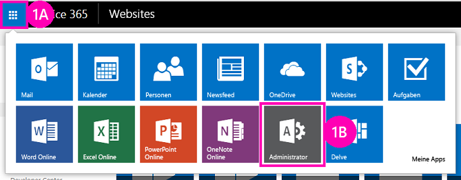

# Bereitstellung und Installation eines von SharePoint gehosteten SharePoint-Add-InsDeploy and install a SharePoint-hosted SharePoint Add-in

Dies ist der zweite in einer Reihe von Artikeln über die Grundlagen der Entwicklung von von SharePoint gehosteten SharePoint-Add-Ins. Sie sollten sich zuerst mit [SharePoint Add-Ins](sharepoint-add-ins.md) und den vorherigen Artikeln in dieser Reihe vertraut machen:This is the second in a series of articles about the basics of developing SharePoint-hosted SharePoint Add-ins. You should first be familiar with the topic  [SharePoint Add-ins](sharepoint-add-ins.md) and the preceding topics in the series:

-  [Erste Schritte beim Erstellen von von SharePoint gehosteten SharePoint-Add-InsGet started creating SharePoint-hosted SharePoint Add-ins](get-started-creating-sharepoint-hosted-sharepoint-add-ins.md)
    
> [!NOTE]
> Wenn Sie diese Reihe zu von SharePoint gehosteten Add-Ins durchgearbeitet haben, können Sie das Thema mit einer Visual Studio-Lösung weiter vertiefen.Note  If you have been working through this series about SharePoint-hosted add-ins, then you have a Visual Studio solution that you can use to continue with this topic. You can also download the repository at  SharePoint_SP-hosted_Add-Ins_Tutorials and open the BeforeClientRenderedControl.sln file. Sie können auch das Repository von [SharePoint_SP-hosted_Add-Ins_Tutorials](https://github.com/OfficeDev/SharePoint_SP-hosted_Add-Ins_Tutorials) herunterladen und die Datei „BeforeColumns.sln“ öffnen.You can also download the repository at [SharePoint_SP-hosted_Add-Ins_Tutorials](https://github.com/OfficeDev/SharePoint_SP-hosted_Add-Ins_Tutorials) and open the BeforeColumns.sln file.

Sie werden feststellen, dass die Entwicklung von SharePoint gehosteter SharePoint-Add-Ins viel einfacher ist, wenn Sie wissen, wie Benutzer bereitgestellt und Ihre Add-Ins installiert werden. Deshalb unterbrechen wir in diesem Artikel kurz die Codierung, um einen Add-In-Katalog zu erstellen und zu verwenden, und installieren dann das Add-In, an dem Sie gearbeitet haben.You'll find it a lot easier to develop SharePoint-hosted SharePoint Add-ins if you are familiar with how users deploy and install your add-ins. So, in this article, we'll take a brief break from coding to create and use an add-in catalog, and then install the add-in you've been working on.

## Erstellen eines Add-In-KatalogsCreate an add-in catalog

1. Melden Sie sich bei Ihrem Office 365-Abonnement als Administrator an.Sign in to your Office 365 subscription as an administrator. Wählen Sie das Symbol für das  Add-In-Startprogramm, und wählen Sie dann das **Admin**-Add-In.Select the add-in launcher icon, and then select the **Admin** add-in.
    
   *Abbildung 1. Add-In-Startprogramm für Office 365**Figure 1. Office 365 add-in launcher*

   
 
2. Erweitern Sie im **Admin Center** den Knoten **Admin** im Aufgabenbereich, und wählen Sie dann **SharePoint** aus.In the  **Admin Center**, expand the  **Admin** node in the task pane and then choose **SharePoint**.
     
3. Wählen Sie im **SharePoint Admin Center** die Option **Add-Ins** im Aufgabenbereich aus.In the  **SharePoint Admin Center**, choose  **add-ins** in the task pane.
     
4. Wählen Sie auf der Seite  **Add-Ins** die Option **Add-In-Katalog** aus.On the **add-ins** page, select **Add-in Catalog**. (Wenn bereits eine Add-In-Katalog-Websitesammlung im Abonnement vorhanden ist, wird diese geöffnet, und Sie sind fertig.(If there is already an add-in catalog site collection in the subscription, it opens and you are finished. Sie können nur jeweils einen Add-In-Katalog pro Abonnement erstellen.)You cannot create more than one add-in catalog in a subscription.)    
 
5. Wählen Sie auf der Seite  **Add-In-Katalogwebsite** **OK** aus, um die Standardoption zu akzeptieren und eine neue Add-In-Katalogwebsite zu erstellen.On the  **Add-in Catalog Site** page, choose **OK** to accept the default option and create a new add-in catalog site.    
 
6. Geben Sie im Dialog  **Add-In-Katalog-Websitesammlung erstellen** den Titel und die Webadresse Ihrer Add-In-Katalogwebsite an.In the **Create Add-in Catalog Site Collection** dialog, specify the title and website address of your add-in catalog site. Wir empfehlen, den Begriff „Katalog“ im Titel und der URL zu verwenden, damit er einprägsamer ist und im **SharePoint Admin Center** besser unterschieden werden kann.On the  Create Add-in Catalog Site Collection dialog, specify the title and web site address of your add-in catalog site. We recommend that you include "catalog" in the title and URL to make it memorable and distinguishable in the **SharePoint Admin Center**.   
 
7. Geben Sie eine **Zeitzone** an, und legen Sie sich selbst als **Administrator** fest.Specify a  **Time Zone** and set yourself as the **Administrator**.
    
8. Legen Sie das **Speicherkontingent** auf den niedrigsten möglichen Wert fest (derzeit 110, das kann sich jedoch ändern), da die Add-In-Pakete, die Sie an diese Websitesammlung hochladen, sehr klein sind.Set the  **Storage Quota** to the lowest possible value (currently 110, but that can change), because the add-in packages you upload to this site collection are very small.
    
9. Legen Sie das **Serverressourcenkontingent** auf 0 (null) fest, und wählen Sie dann **OK** aus.Set the **Server Resource Quota** to 0 (zero), and then select **OK**. (Das Serverressourcenkontingent hat Auswirkungen auf die Einschränkung leistungsschwacher Sandkastenlösungen; Sie müssen jedoch keine Sandkastenlösungen auf der Add-In-Katalogwebsite installieren.)Set the  Server Resource Quota to 0 (zero). (The server resource quota is related to throttling poorly performing sandboxed solutions, but you won't be installing any sandboxed solutions on your add-in catalog site.) 
 
Während die Websitesammlung erstellt wird, gelangen Sie zurück zum **SharePoint Admin Center**.As the site collection is being created, SharePoint takes you back to the  **SharePoint Admin Center**. After a few minutes, you'll see that the collection has been created. Nach ein paar Minuten sehen Sie, dass die Sammlung erstellt wurde.As the site collection is being created, SharePoint takes you back to the  SharePoint Admin Center. After a few minutes, you'll see that the collection has been created.

## Packen des Add-Ins und Hochladen in den KatalogPackage the add-in and upload it to the catalog

1. Öffnen Sie die Visual Studio-Projektmappe, klicken Sie im **Projektmappen-Explorer** mit der rechten Maustaste auf den Projektknoten, und wählen Sie dann **Veröffentlichen** aus.Open the Visual Studio solution, and then right-click the project node in  **Solution Explorer**. Choose  **Publish**.
     
2. Wählen Sie im Bereich **Veröffentlichen** die Option **Add-In verpacken** aus.In the **Publish** pane, select **Package the add-in**. Das Add-In wird gepackt und als `*.app`-Datei im Ordner „\bin\debug\web.publish\1.0.0.0“ der Projektmappe gespeichert.In the  Publish pane, choose Package the add-in. The add-in is packaged and saved as an *.app file in the solution's \bin\debug\web.publish\1.0.0.0 folder.  
 
3. Öffnen Sie die Add-In-Katalogwebsite in einem Browser, und wählen Sie dann **SharePoint-Add-Ins** in der Navigationsleiste aus.Open your add-in catalog site in a browser and choose  **SharePoint Add-ins** in the navigation bar.

4. Der **SharePoint-Add-Ins**-Katalog ist eine standardmäßige SharePoint-Objektbibliothek.The **SharePoint Add-ins** catalog is a standard SharePoint asset library. Laden Sie das Add-In-Paket mithilfe einer der Methoden zum Hochladen von Dateien in SharePoint-Bibliotheken in den Katalog hoch.The spapppluralcap catalog is a standard SharePoint asset library. Upload the add-in package to it using any of the methods of uploading files to SharePoint libraries.

## Installieren des Add-Ins als EndbenutzerInstall the add-in as end users do

1. Navigieren Sie zu einer beliebigen Website im SharePoint Online-Abonnement, und öffnen Sie die Seite **Websiteinhalt**.Navigate to any website in the SharePoint Online subscription and open the  **Site Contents** page.

2. Wählen Sie **Add-In hinzufügen** aus, um die Seite **Ihre Add-Ins** zu öffnen.Choose  **add an add-in** to open the **Your Add-ins** page.

3. Suchen Sie das Add-In **Orientierung für Mitarbeiter** im Abschnitt **Add-Ins, die Sie hinzufügen können**, und wählen Sie die zugehörige Kachel aus.Find the  **Employee Orientation** add-in in the **Add-ins you can add** section and click its tile.

4. Wählen Sie **Vertrauen** im Zustimmungsdialogfeld aus.Select **Trust It** in the consent dialog. Die Seite **Websiteinhalte** wird automatisch geöffnet, und das Add-In wird mit einer Anmerkung, dass es gerade installiert wird, angezeigt.Choose  Trust It on the consent dialog. The **Site Contents** page automatically opens and the add-in appears with a notation that it is installing. After it installs, users can choose the tile to run the add-in. Nach der Installation können Benutzer die Kachel auswählen, um das Add-In auszuführen.After it installs, users can select the tile to run the add-in.

## Entfernen des Add-InsRemove the add-in

Um das gleiche SharePoint-Add-In in Visual Studio noch weiter zu verbessern (siehe [nächste Schritte](#Nextsteps)), entfernen Sie das Add-In mit den folgenden Schritten:In order to continue enhancing the same SharePoint Add-in in Visual Studio (see  [Next steps](#Nextsteps)), remove the add-in with these steps:

1. Bewegen Sie den Cursor auf der Seite **Websiteinhalte** über das Add-In, sodass die Popupschaltfläche **...** angezeigt wird.In the  **Site Contents** page, move the cursor over the add-in so that the callout button **...** appears.

2. Wählen Sie die Popupschaltfläche aus, und wählen Sie dann **ENTFERNEN** im Popup aus.Choose the callout button and then choose  **REMOVE** on the callout.

3. Navigieren Sie zurück zur Add-In-Katalogwebsite, und wählen Sie **SharePoint-Add-Ins** in der Navigationsleiste aus.Navigate back to your add-in catalog site and choose  **SharePoint Add-ins** in the navigation bar.

4. Markieren Sie das Add-In, wählen Sie **Verwalten** auf der Taskleiste direkt oberhalb der Liste aus, und wählen Sie dann **Löschen** im Verwaltungsmenü aus.Highlight the add-in and choose  **manage** on the task bar just above the list, and then choose **Delete** on the manage menu.

## Nächste SchritteNext steps

Es wird dringend empfohlen, dass Sie mit dieser Reihe zu von SharePoint gehosteten Add-Ins fortfahren, bevor Sie mit den fortgeschrittenen Themen beginnen.We strongly recommend that you continue with this series about SharePoint-hosted add-ins before you go on to the more advanced topics. Next we get back to coding in  Add custom columns to a SharePoint-hostedSharePoint Add-in. In [Hinzufügen von benutzerdefinierten Spalten zu einem von SharePoint gehosteten SharePoint-Add-In](add-custom-columns-to-a-sharepoint-hosted-sharepoint-add-in.md) befassen wir uns wieder mit der Programmierung.We strongly recommend that you continue with this series about SharePoint-hosted add-ins before you go on to the more advanced topics. Next we get back to coding in [Add custom columns to a SharePoint-hosted SharePoint Add-in](add-custom-columns-to-a-sharepoint-hosted-sharepoint-add-in.md).
 

 

