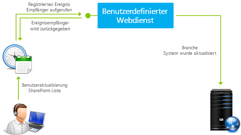

# <a name="handle-events-in-sharepoint-add-ins"></a><span data-ttu-id="6c9c8-102">Behandeln von Ereignissen in SharePoint-Add-Ins</span><span class="sxs-lookup"><span data-stu-id="6c9c8-102">Handle events in SharePoint Add-ins</span></span>

 <span data-ttu-id="6c9c8-p101">**Hinweis** Der Name „Apps für SharePoint“ wird in „SharePoint-Add-Ins“ geändert. Während des Übergangszeitraums wird in der Dokumentation und der Benutzeroberfläche einiger SharePoint-Produkte und Visual Studio-Tools möglicherweise weiterhin der Begriff „Apps für SharePoint“ verwendet. Weitere Informationen finden Sie unter [Neuer Name für Office- und SharePoint-Apps](new-name-for-apps-for-sharepoint.md#bk_newname).</span><span class="sxs-lookup"><span data-stu-id="6c9c8-p101">**Note**  The name "apps for SharePoint" is changing to "SharePoint Add-ins". During the transition, the documentation and the UI of some SharePoint products and Visual Studio tools might still use the term "apps for SharePoint". For details, see  [New name for apps for Office and SharePoint](new-name-for-apps-for-sharepoint.md#bk_newname).</span></span>
 

<span data-ttu-id="6c9c8-106">Ihr benutzerdefinierter Code kann drei Kategorien von Ereignissen in vom Anbieter gehosteten Add-Ins behandeln:</span><span class="sxs-lookup"><span data-stu-id="6c9c8-106">Your custom code can handle three categories of events in provider-hosted add-ins:</span></span>
 

-  <span data-ttu-id="6c9c8-107">**Listenereignisse**, z. B. das Hinzufügen oder Löschen einer Liste auf einer Website.</span><span class="sxs-lookup"><span data-stu-id="6c9c8-107">**List events**, such as the adding or deleting of a list on a website.</span></span>
    
 
-  <span data-ttu-id="6c9c8-108">**Listenelementereignisse**, z. B. das Bearbeiten eines Elements in einer Liste.</span><span class="sxs-lookup"><span data-stu-id="6c9c8-108">**List item events**, such as the editing of an item in a list.</span></span>
    
 
-  <span data-ttu-id="6c9c8-109">**Add-In-Ereignisse**, z. B. die Installation eines Add-Ins.</span><span class="sxs-lookup"><span data-stu-id="6c9c8-109">**Add-in events**, such as the installation of an add-in.</span></span>
    
 
<span data-ttu-id="6c9c8-p102">In SharePoint gehostete SharePoint-Add-Ins unterstützen keine Ereignisbehandlung, aber Sie können einen Workflow in eine Art Listen- oder Listenelement-Ereignishandler umwandeln, indem Sie ein Ereignis festlegen, das den Workflow auslöst. Weitere Informationen finden Sie unter  [Workflows in SharePoint](http://msdn.microsoft.com/library/e0602371-ae22-44be-8a7e-9e47e9f046d6%28Office.15%29.aspx). Workflows können nicht durch Add-In-Ereignisse ausgelöst werden, und somit können Add-In-Ereignisse nicht mit einem in SharePoint gehosteten Add-In behandelt werden.</span><span class="sxs-lookup"><span data-stu-id="6c9c8-p102">SharePoint-hosted SharePoint Add-ins do not support event handling, but you can turn a workflow into a kind of list or list item event handler by setting an event to trigger the workflow. See  [Workflows in SharePoint](http://msdn.microsoft.com/library/e0602371-ae22-44be-8a7e-9e47e9f046d6%28Office.15%29.aspx). Workflows cannot be triggered by add-in events, so add-in events cannot be handled with a SharePoint-hosted add-in.</span></span>
 

 <span data-ttu-id="6c9c8-113">**Hinweis** Websiteereignisse und Websitesammlungsereignisse werden in SharePoint-Add-Ins nicht unterstützt.</span><span class="sxs-lookup"><span data-stu-id="6c9c8-113">**Note**  Website events and site collection events are not supported in SharePoint Add-ins.</span></span>
 

<span data-ttu-id="6c9c8-114">Es gibt zwei Arten von Ereignissen:</span><span class="sxs-lookup"><span data-stu-id="6c9c8-114">There are two kinds of events:</span></span> 
 

-  <span data-ttu-id="6c9c8-p103">***Before*-Ereignisse** werden ausgelöst, bevor die SharePoint-Infrastruktur eine eigene Handhabung des Ereignisses (einschließlich Ausführen eines Commits der Änderungen an der Inhaltsdatenbank) beginnt. In SharePoint ** werden benutzerdefinierte Before-Ereignishandler immer synchron ausgeführt**. Unter anderem können sie verwendet werden, um das Ereignis abzubrechen. Wenn ein Add-In beispielsweise über eine Funktion zum Löschen einer Liste verfügt, kann ein Handler für das Ereignis zum Löschen der Liste den Löschvorgang abbrechen, wenn bestimmte Bedingungen nicht erfüllt sind. Wenn das Ereignis Teil einer Ereignissequenz ist, verhindert das Abbrechen des Ereignisses, dass spätere Ereignisse überhaupt stattfinden. Wenn beispielsweise Ihr Handler für das Ereignis **ItemAdding** das Ereignis abbricht, wird das Ereignis** ItemAdded**, das normalerweise später durchgeführt wird, nicht ausgelöst.</span><span class="sxs-lookup"><span data-stu-id="6c9c8-p103">***Before*  events** are triggered before the SharePoint infrastructure does any of it's own handling of the event (including committing changes to the content database). In SharePoint **custom before event handlers always execute synchronously**. Among other purposes, they can be used to cancel the event. For example, if an add-in has a function for deleting a list, a handler for the list deleting event can cancel the deletion if certain conditions are not met. If the event is part of a sequence of events, cancelling it prevents any of the later events from occurring at all. For example, if your handler for the **ItemAdding** event cancels the event, the **ItemAdded** event, which normally comes later, is not triggered.</span></span>
    
 
-  <span data-ttu-id="6c9c8-p104">***After*  -Ereignisse** werden ausgelöst, nachdem die SharePoint-Infrastruktur ihre eigene Handhabung des Ereignisses begonnen hat. In SharePoint **werden Remote-After-Ereignishandler für Listen- und Listenelementereignisse immer asynchron ausgeführt**. (App-Ereignisse sind eine Ausnahme.) Sie können unter anderem verwendet werden, um Ereignisse zu protokollieren.</span><span class="sxs-lookup"><span data-stu-id="6c9c8-p104">***After*  events** are triggered after the SharePoint infrastructure does any of it's own handling of the event. In SharePoint, **remote after event handlers, for list and list item events, always execute asynchronously**. (App events are an exception.) Among other purposes, they can be used to log events.</span></span>
    
 

## <a name="handle-list-and-list-item-events"></a><span data-ttu-id="6c9c8-124">Behandeln von Listen- und Listenelementereignissen</span><span class="sxs-lookup"><span data-stu-id="6c9c8-124">Handle list and list item events</span></span>
<span data-ttu-id="6c9c8-125"><a name="RER"> </a></span><span class="sxs-lookup"><span data-stu-id="6c9c8-125"></span></span>

<span data-ttu-id="6c9c8-p105">Zur Behandlung von Listen- und Listenelementereignissen erstellen Sie Remoteereignisempfänger (RERs). Dabei handelt es sich um Webdienste, die extern zur SharePoint-Farm oder zu SharePoint Online sind. Die URL des RER-Diensts wird für die Ereignisse registriert, die er verarbeitet. Es gibt zwei Möglichkeiten, einen Handler zu registrieren:</span><span class="sxs-lookup"><span data-stu-id="6c9c8-p105">To handle list and list item events, you create remote event receivers (RERs), which are web services that run externally to the SharePoint farm or SharePoint Online. The URL of the RER service is registered for the events it handles. There are two ways to register a handler:</span></span>
 

 

- <span data-ttu-id="6c9c8-p106">Ereignisse im Hostweb werden programmgesteuert beim CSOM (Clientobjektmodell) oder der SharePoint-REST-API registriert. Diese Aufgabe wird normalerweise in der Logik für die „erste Ausführung" im Add-In oder in einem Handler für ein Add-In-Ereignis ausgeführt. (Eine Übersicht über Add-In-Ereignisse finden Sie im weiteren Verlauf des Artikels unter  [Behandeln von Add-In-Ereignissen](#HandlingAppEvents).) Ein Codebeispiel, das ein Listenereignis programmgesteuert registriert, finden Sie unter  [OfficeDev/PnP/Samples/Core.EventReceivers](https://github.com/OfficeDev/PnP/tree/master/Samples/Core.EventReceivers.md).</span><span class="sxs-lookup"><span data-stu-id="6c9c8-p106">Events in the host web are registered programmatically with the CSOM (client-side object model) or the SharePoint REST API. This task is typically done in "first run" logic in the add-in or in a handler for an add-in event. (See  [Handling add-in events](#HandlingAppEvents) later in the article for an overview of add-in events.) For a code sample that programmatically registers a list event, see [OfficeDev/PnP/Samples/Core.EventReceivers](https://github.com/OfficeDev/PnP/tree/master/Samples/Core.EventReceivers.md).</span></span>
    
 
-  <span data-ttu-id="6c9c8-p107">Ereignisse im Add-In-Web werden normalerweise mit einfachem XML-Markup in einem Feature des Add-In-Webs registriert. Details zum Erstellen des Markups und des Diensts finden Sie in  [Erstellen eines Remoteereignisempfängers in Add-Ins für SharePoint](create-a-remote-event-receiver-in-sharepoint-add-ins.md). Es ist auch möglich, Add-In-Web-Ereignisse programmgesteuert zu registrieren.</span><span class="sxs-lookup"><span data-stu-id="6c9c8-p107">Events in the add-in web are usually registered in a Feature of the add-in web with some simple XML markup. Details of how to create the markup and the service are in [Create a remote event receiver in SharePoint Add-ins](create-a-remote-event-receiver-in-sharepoint-add-ins.md). It is also possible to register add-in web events programmatically.</span></span>
    
 

 <span data-ttu-id="6c9c8-134">**Hinweis** RERs dienen demselben Zweck wie Ereignisempfänger in Farmlösungen. Ereignisempfänger weisen jedoch benutzerdefinierten Code auf, der auf den SharePoint-Servern ausgeführt wird, sodass sie nicht in SharePoint-Add-Ins verwendet werden können.</span><span class="sxs-lookup"><span data-stu-id="6c9c8-134">**Note**  RERs have the same purpose as event receivers in farm solutions; but event receivers have custom code that runs on the SharePoint servers, so they cannot be used in SharePoint Add-ins.</span></span>
 

<span data-ttu-id="6c9c8-p108">Ihr Add-In kann die folgenden Listen- und Dokumentbibliotheksereignisse behandeln. Auf "ing" endende Ereignisse sind (synchrone) Vorabereignisse, die auf "ed" endenden sind (asynchrone) Nachfolgeereignisse.</span><span class="sxs-lookup"><span data-stu-id="6c9c8-p108">Your add-in can handle the following list and document library events. Events ending in "ing" are before (synchronous) events and those ending in "ed" are after (asynchronous) events.</span></span>
 

 

|||
|:-----|:-----|
|<span data-ttu-id="6c9c8-137">ListAdding</span><span class="sxs-lookup"><span data-stu-id="6c9c8-137">ListAdding</span></span>|<span data-ttu-id="6c9c8-138">ListAdded</span><span class="sxs-lookup"><span data-stu-id="6c9c8-138">ListAdded</span></span>|
|<span data-ttu-id="6c9c8-139">ListDeleting</span><span class="sxs-lookup"><span data-stu-id="6c9c8-139">ListDeleting</span></span>|<span data-ttu-id="6c9c8-140">ListDeleted</span><span class="sxs-lookup"><span data-stu-id="6c9c8-140">ListDeleted</span></span>|
|<span data-ttu-id="6c9c8-141">FieldAdding</span><span class="sxs-lookup"><span data-stu-id="6c9c8-141">FieldAdding</span></span>|<span data-ttu-id="6c9c8-142">FieldAdded</span><span class="sxs-lookup"><span data-stu-id="6c9c8-142">FieldAdded</span></span>|
|<span data-ttu-id="6c9c8-143">FieldDeleting</span><span class="sxs-lookup"><span data-stu-id="6c9c8-143">FieldDeleting</span></span>|<span data-ttu-id="6c9c8-144">FieldDeleted</span><span class="sxs-lookup"><span data-stu-id="6c9c8-144">FieldDeleted</span></span>|
|<span data-ttu-id="6c9c8-145">FieldUpdating</span><span class="sxs-lookup"><span data-stu-id="6c9c8-145">FieldUpdating</span></span>|<span data-ttu-id="6c9c8-146">FieldUpdated</span><span class="sxs-lookup"><span data-stu-id="6c9c8-146">FieldUpdated</span></span>|
<span data-ttu-id="6c9c8-147">Bei den FieldUpdate-Ereignissen geht es um die Änderung der Eigenschaften eines Felds (einer Spalte) in einer Liste, z. B. dessen Sortierbarkeit, nicht um die Änderung der Daten in dem Feld.</span><span class="sxs-lookup"><span data-stu-id="6c9c8-147">The field update events are about changing the properties of a field (column) on a list, such as whether it is sortable, not about changing the data in the field.</span></span>
 

 
<span data-ttu-id="6c9c8-148">Ihr Add-In kann die folgenden Listenelementereignisse behandeln.</span><span class="sxs-lookup"><span data-stu-id="6c9c8-148">Your add-in can handle the following list item events.</span></span> 
 

 

|||
|:-----|:-----|
|<span data-ttu-id="6c9c8-149">ItemAdding</span><span class="sxs-lookup"><span data-stu-id="6c9c8-149">ItemAdding</span></span>|<span data-ttu-id="6c9c8-150">ItemAdded</span><span class="sxs-lookup"><span data-stu-id="6c9c8-150">ItemAdded</span></span>|
|<span data-ttu-id="6c9c8-151">ItemUpdating</span><span class="sxs-lookup"><span data-stu-id="6c9c8-151">ItemUpdating</span></span>|<span data-ttu-id="6c9c8-152">ItemUpdated</span><span class="sxs-lookup"><span data-stu-id="6c9c8-152">ItemUpdated</span></span>|
|<span data-ttu-id="6c9c8-153">ItemDeleting</span><span class="sxs-lookup"><span data-stu-id="6c9c8-153">ItemDeleting</span></span>|<span data-ttu-id="6c9c8-154">ItemDeleted</span><span class="sxs-lookup"><span data-stu-id="6c9c8-154">ItemDeleted</span></span>|
|<span data-ttu-id="6c9c8-155">ItemCheckingOut</span><span class="sxs-lookup"><span data-stu-id="6c9c8-155">ItemCheckingOut</span></span>|<span data-ttu-id="6c9c8-156">ItemCheckedOut</span><span class="sxs-lookup"><span data-stu-id="6c9c8-156">ItemCheckedOut</span></span>|
|<span data-ttu-id="6c9c8-157">ItemCheckingIn</span><span class="sxs-lookup"><span data-stu-id="6c9c8-157">ItemCheckingIn</span></span>|<span data-ttu-id="6c9c8-158">ItemCheckedIn</span><span class="sxs-lookup"><span data-stu-id="6c9c8-158">ItemCheckedIn</span></span>|
|<span data-ttu-id="6c9c8-159">ItemUncheckingOut</span><span class="sxs-lookup"><span data-stu-id="6c9c8-159">ItemUncheckingOut</span></span>|<span data-ttu-id="6c9c8-160">ItemUncheckedOut</span><span class="sxs-lookup"><span data-stu-id="6c9c8-160">ItemUncheckedOut</span></span>|
|<span data-ttu-id="6c9c8-161">ItemAttachmentAdding</span><span class="sxs-lookup"><span data-stu-id="6c9c8-161">ItemAttachmentAdding</span></span>|<span data-ttu-id="6c9c8-162">ItemAttachmentAdded</span><span class="sxs-lookup"><span data-stu-id="6c9c8-162">ItemAttachmentAdded</span></span>|
|<span data-ttu-id="6c9c8-163">ItemAttachmentDeleting</span><span class="sxs-lookup"><span data-stu-id="6c9c8-163">ItemAttachmentDeleting</span></span>|<span data-ttu-id="6c9c8-164">ItemAtttachmentDeleted</span><span class="sxs-lookup"><span data-stu-id="6c9c8-164">ItemAtttachmentDeleted</span></span>|
|<span data-ttu-id="6c9c8-165">ItemFileMoving</span><span class="sxs-lookup"><span data-stu-id="6c9c8-165">ItemFileMoving</span></span>|<span data-ttu-id="6c9c8-166">ItemFileMoved</span><span class="sxs-lookup"><span data-stu-id="6c9c8-166">ItemFileMoved</span></span>|
|<span data-ttu-id="6c9c8-167">ItemVersionDeleting*</span><span class="sxs-lookup"><span data-stu-id="6c9c8-167">ItemVersionDeleting*</span></span>|<span data-ttu-id="6c9c8-168">ItemVersonDeleted*</span><span class="sxs-lookup"><span data-stu-id="6c9c8-168">ItemVersonDeleted*</span></span>|
||<span data-ttu-id="6c9c8-169">ItemFileConverted</span><span class="sxs-lookup"><span data-stu-id="6c9c8-169">ItemFileConverted</span></span>|

 <span data-ttu-id="6c9c8-p109">**Hinweis** *Diese zwei neuen Ereignisse sind möglicherweise nicht in der Visual Studio-Benutzeroberfläche verfügbar. Falls nicht, wählen Sie „ItemDeleting" oder „ItemDeleted" aus, und ändern Sie die Namen dann manuell.</span><span class="sxs-lookup"><span data-stu-id="6c9c8-p109">**Note**  *These two new events may not be available in the Visual Studio UI. If not, pick ItemDeleting or ItemDeleted and then manually change the names.</span></span>
 

<span data-ttu-id="6c9c8-172">Wenn Sie in Visual Studio arbeiten und einen RER zu einem SharePoint-Add-In-Projekt hinzufügen, wird von den Office-Entwicklertools für Visual Studio Folgendes ausgeführt:</span><span class="sxs-lookup"><span data-stu-id="6c9c8-172">When you are working in Visual Studio, and you add a RER to a SharePoint Add-in project, the Office Developer Tools for Visual Studio do the following:</span></span>
 

 

- <span data-ttu-id="6c9c8-p110">Eine Webdienstdatei wie "RemoteEventReceiver1.svc" wird der Webanwendung hinzugefügt, um die Ereignisse zu verarbeiten, die Sie beim Hinzufügen des Remoteereignisempfängers zur SharePoint-Add-In angegeben haben. Der Webdienst enthält eine Codedatei zum Behandeln der Remoteereignisse.</span><span class="sxs-lookup"><span data-stu-id="6c9c8-p110">A web service file, such as RemoteEventReceiver1.svc, is added to the web application to handle the events that you specified when you added the remote event receiver to the SharePoint Add-in. The web service contains a code file to handle the remote events.</span></span>
    
    <span data-ttu-id="6c9c8-p111">Nachdem Sie den Remoteereignisempfänger erstellt haben, fügen Sie der Codedatei für den Webanwendungsdienst Code zum Behandeln der Ereignisse hinzu. Standardmäßig enthält die Codedatei zwei Methoden, die Sie Ihrem Behandlungscode hinzufügen:</span><span class="sxs-lookup"><span data-stu-id="6c9c8-p111">After you create the remote event receiver, you add code to the code file for the web application service to handle the events. By default, the code file contains two methods to which you add your handling code:</span></span> 
    
      -  <span data-ttu-id="6c9c8-177">`ProcessEvent()` behandelt Vorabereignisse (wie die in den linken Spalten in den Tabellen im früheren Verlauf des Artikels) und gibt ein Objekt an SharePoint zurück, das meldet, ob das Ereignis abgebrochen oder fortgesetzt werden sollte.</span><span class="sxs-lookup"><span data-stu-id="6c9c8-177">`ProcessEvent()` handles "before" events (such as those in the left-hand columns in the tables earlier in the article) and it returns an object to SharePoint that reports on whether it should cancel the event or let it proceed.</span></span>
    
 
  -  <span data-ttu-id="6c9c8-p112">`ProcessOneWayEvent()` behandelt Nachfolgeereignisse. Es wird asynchron ausgeführt und gibt nichts an SharePoint zurück.</span><span class="sxs-lookup"><span data-stu-id="6c9c8-p112">`ProcessOneWayEvent()` handles "after" events. It runs asynchronously and does not return anything to SharePoint.</span></span>
    
 

    <span data-ttu-id="6c9c8-p113">Wenn ein registriertes Ereignis auftritt, ruft SharePoint die entsprechende Methode in Ihrem Dienst auf und übergibt ein Objekt, das einige Kontextinformationen für den Code bereitstellt. Beispielsweise wird der Ereignistyp (aus einer der beiden Tabellen im früheren Verlauf des Artikels) identifiziert, damit Ihr Code zur dem Ereignis entsprechenden Logik verzweigen kann.</span><span class="sxs-lookup"><span data-stu-id="6c9c8-p113">When a registered event occurs, SharePoint calls the appropriate method in your service and passes an object that provides some context information for your code. For example, the event type (from one of the two tables earlier in the article) is identified, so that your code can branch to the logic that is appropriate for the event.</span></span>
    
 
- <span data-ttu-id="6c9c8-p114">Ein Projektelement für den Remoteereignisempfänger wird dem SharePoint-Add-In-Projekt hinzugefügt. Die Datei "Elements.xml" für den Remoteereignisempfänger verweist auf den Webdienst in der Webanwendung und die Remoteereignisse, die Sie angegeben haben. Das folgende Beispiel zeigt eine Datei "Elements.xml", die das Hinzufügen oder Löschen eines Listenelements behandelt.</span><span class="sxs-lookup"><span data-stu-id="6c9c8-p114">A project item for the remote event receiver is added to the SharePoint Add-in project. The Elements.xml file for the remote event receiver references the web service in the web application and the remote events that you specified. The following example shows an Elements.xml file that handles the addition or deletion of a list item.</span></span>
    
```XML
  <?xml version="1.0" encoding="utf-8"?>
<Elements xmlns="http://schemas.microsoft.com/sharepoint/">
  <Receivers ListTemplateId="104">
      <Receiver>
        <Name>RemoteEventReceiver1ItemAdding</Name>
        <Type>ItemAdding</Type>
        <SequenceNumber>10000</SequenceNumber>
        <Url>~remoteAppUrl/RemoteEventReceiver1.svc</Url>
      </Receiver>
      <Receiver>
        <Name>RemoteEventReceiver1ItemDeleting</Name>
        <Type>ItemDeleting</Type>
        <SequenceNumber>10000</SequenceNumber>
        <Url>~remoteAppUrl/RemoteEventReceiver1.svc</Url>
      </Receiver>
  </Receivers>
</Elements>
```

<span data-ttu-id="6c9c8-185">Um die Ereignisse zu ändern, die der Remote-Ereignisempfänger behandelt, öffnen Sie den **Projektmappen-Explorer** und dann das Fenster **Eigenschaften** für den Remote-Ereignisempfänger, erweitern den Knoten **SharePoint-Ereignisse** und legen dann nur die zu behandelnden Ereignisse auf **True** fest.</span><span class="sxs-lookup"><span data-stu-id="6c9c8-185">To change the events that the remote event receiver handles, open  **Solution Explorer**, open the  **Properties** window for the remote event receiver, expand the **SharePoint Events** node, and then set only the events that you want to handle to **True**.</span></span>
 

 

 <span data-ttu-id="6c9c8-186">**Hinweis** Weitere Informationen zu RERs, einschließlich Informationen zur Problembehandlung, finden Sie unter  [FAQ für Remote-Ereignisempfänger](handle-events-in-sharepoint-add-ins.md#RERFAQ).</span><span class="sxs-lookup"><span data-stu-id="6c9c8-186">**Note**  For additional information about RERs, including some troubleshooting information, see  [Remote Event Receivers FAQ](handle-events-in-sharepoint-add-ins.md#RERFAQ).</span></span>
 


## <a name="handling-add-in-events"></a><span data-ttu-id="6c9c8-187">Behandeln von Add-In-Ereignissen</span><span class="sxs-lookup"><span data-stu-id="6c9c8-187">Handling add-in events</span></span>
<span data-ttu-id="6c9c8-188"><a name="HandlingAppEvents"> </a></span><span class="sxs-lookup"><span data-stu-id="6c9c8-188"></span></span>

<span data-ttu-id="6c9c8-p115">Add-In-Ereignisse werden auch von Remotewebdiensten behandelt, sind jedoch im Add-In-Paket anders konfiguriert als Listen- und Listenelement-RERs, sodass sie als eine separate Kategorie von Komponenten behandelt werden. Der Remotewebdienst ist für ein Add-In-Ereignis im Add-In-Manifest registriert und nicht in einem Add-In-Web-Feature. Das Add-In muss nicht einmal über ein Add-In-Web verfügen. Es gibt drei Add-In-Ereignisse, wie in den folgenden Abschnitten beschrieben.</span><span class="sxs-lookup"><span data-stu-id="6c9c8-p115">Add-in events are also handled by remote web services, but they are configured differently in the add-in package from list and list item RERs, so they are treated as a separate category of component. For an add-in event, the remote web service is registered in the add-in manifest, not in an add-in web Feature. The add-in doesn't even have to have an add-in web. There are three add-in events as described in the next sections.</span></span>
 

 

### <a name="appinstalled-event"></a><span data-ttu-id="6c9c8-193">AppInstalled-Ereignis</span><span class="sxs-lookup"><span data-stu-id="6c9c8-193">AppInstalled event</span></span>

<span data-ttu-id="6c9c8-p116">Das Ereignis **AppInstalled** wird ausgeführt, unmittelbar nachdem SharePoint alle zur Installation des Add-Ins erforderlichen Aktionen abgeschlossen hat, jedoch bevor der Benutzer über den Abschluss der Installation benachrichtigt wird. Obwohl es sich hier um ein *After*-Ereignis handelt, führt SharePoint Ihren Handler *synchron* aus. Das Add-In ist erst verfügbar, wenn der Handler abgeschlossen wurde, und der Handler kann die Installation abbrechen (wodurch SharePoint veranlasst wird, alle im Rahmen der Installation ausgeführten Aktionen zurückzusetzen). Tatsächlich ist es eine bewährte Methode, alle eventuellen Fehler im Handler abzufangen und SharePoint zum Zurücksetzen der Installation anzuweisen. Weitere Informationen finden Sie unter [Einbeziehen von Rollbacklogik und „Bereits erledigt“-Logik in Add-In-Ereignishandler](#Rollback).</span><span class="sxs-lookup"><span data-stu-id="6c9c8-p116">The  **AppInstalled** event runs immediately after SharePoint has finished everything that it needs to do when the add-in is installed, but before the user is notified that installation is complete. Although this is an *after*  event, SharePoint runs your handler *synchronously*  . The add-in is not available for use until after your handler has completed and your handler can cancel the installation (which will cause SharePoint to roll back everything it has done as part of the installation). In fact, it is a best practice to catch any errors in your handler and instruct SharePoint to roll back the installation. For more information, see [Include rollback logic and "already done" logic in your add-in event handlers](#Rollback).</span></span>
 

 

 <span data-ttu-id="6c9c8-p117">**Hinweis** Beim Installieren eines Add-Ins mit  [Mandantenbereich](tenancies-and-deployment-scopes-for-sharepoint-add-ins.md) wird das Add-In in der Add-In-Katalog-Websitesammlung installiert, und das AppInstalled-Ereignis wird dann und nur dann ausgeführt. Das Add-In wird in mehreren Websites des Mandanten angezeigt, aber das Ereignis wird nicht separat für jede ausgeführt.</span><span class="sxs-lookup"><span data-stu-id="6c9c8-p117">**Note**  When you install an add-in with  [Tenant scope](tenancies-and-deployment-scopes-for-sharepoint-add-ins.md), it is installed to the add-in catalog site collection and the AppInstalled event runs then and only then. The add-in is visible in multiple web sites in the tenancy, but the event does not run separately for each of these.</span></span>
 

<span data-ttu-id="6c9c8-201">Neben dem Abbruch der Add-In-Installation kann dieses Ereignis für viele andere Zwecke verwendet werden:</span><span class="sxs-lookup"><span data-stu-id="6c9c8-201">Besides canceling an add-in installation, this event can be used for many other purposes including:</span></span>
 

 

- <span data-ttu-id="6c9c8-202">Installieren von SharePoint-Komponenten im Hostweb, die nicht deklarativ mit dem Hostwebfeature installiert werden können, z. B. Listen oder Unterwebsites.</span><span class="sxs-lookup"><span data-stu-id="6c9c8-202">Install SharePoint components to the host web that cannot be declaratively installed with the host web Feature, such as lists or subwebs.</span></span>
    
 
- <span data-ttu-id="6c9c8-203">Programmgesteuertes Registrieren von Listen- und Listenelement-Ereignishandlern beim Hostweb oder Add-In-Web.</span><span class="sxs-lookup"><span data-stu-id="6c9c8-203">Programmatically register list and list item event handlers with the host web or add-in web.</span></span>
    
 
- <span data-ttu-id="6c9c8-p118">Festlegen der App-Instanz-relativen Initialisierungseinstellungen. Beispielsweise kann Ihr Add-In einen Add-In-Web-Eigenschaftenbehälter zum Speichern von Einstellungen enthalten, die von einer Instanz des Add-Ins zur anderen variieren. Der AppInstalled-Handler kann, z. B. basierend auf dem Websitetyp des Hostwebs (z. B. Teamwebsite oder Blog-Website), unterschiedliche Werte in den Eigenschaftenbehälter schreiben.</span><span class="sxs-lookup"><span data-stu-id="6c9c8-p118">Set app-instance-relative initialization settings. For example, your add-in can have an add-in web property bag for holding settings that vary from one instance of the add-in to another. Your AppInstalled handler can write varying values to the property bag, based on, say, the site type of the host web (such as Team Site or Blog site).</span></span>
    
     <span data-ttu-id="6c9c8-p119">**Hinweis** Durch Überprüfen, ob das Hostweb eine AppCatalog-Website ist, lässt sich einfach feststellen, ob das Add-In mit Mandantenbereich installiert wurde. Siehe  [Mandantschaften und Bereitstellungsbereiche von Add-Ins für SharePoint](tenancies-and-deployment-scopes-for-sharepoint-add-ins.md).</span><span class="sxs-lookup"><span data-stu-id="6c9c8-p119">**Note**  Checking to see if the host web is an AppCatalog site is a good way to detect whether the add-in has been installed with tenant scope. See  [Tenancies and deployment scopes for SharePoint Add-ins](tenancies-and-deployment-scopes-for-sharepoint-add-ins.md).</span></span>
- <span data-ttu-id="6c9c8-209">Ausführen App-Instanz-relativer Konfiguration in der Remotewebanwendung des Add-ins, z. B. Hinzufügen einer Tabelle zu einer Datenbank.</span><span class="sxs-lookup"><span data-stu-id="6c9c8-209">Perform app-instance-relative configuration in the add-in's remote web application, such as adding a table to a database.</span></span>
    
 

 <span data-ttu-id="6c9c8-p120">**Wichtig** Die Implementierung des AppInstalled-Ereignisses muss innerhalb von 30 Sekunden abgeschlossen sein. Andernfalls geht die SharePoint-Installationsinfrastruktur davon aus, dass ein Fehler aufgetreten ist. Die Infrastruktur führt das Ereignis erneut aus  *und wiederholt den Code von Anfang an*  bis zu drei Mal zusätzlich. Nach vier Timeouts wird die gesamte Add-In-Installation von SharePoint zurückgesetzt. Die kompletten Auswirkungen dieser Tatsachen werden unter [Einbeziehen von Rollbacklogik und "Bereits erledigt"-Logik in Add-In-Ereignishandler](#Rollback) erörtert.</span><span class="sxs-lookup"><span data-stu-id="6c9c8-p120">**Important**  Your implementation of the AppInstalled event must complete within 30 seconds or the SharePoint installation infrastructure will think it has failed. The infrastructure will rerun the event,  *and repeat your code from the beginning*  , up to three additional times. After four timeouts, SharePoint will roll back the entire add-in installation. The full implications of these facts are discussed in [Include rollback logic and "already done" logic in your add-in event handlers](#Rollback).</span></span>
 


### <a name="appuninstalling-event"></a><span data-ttu-id="6c9c8-214">AppUninstalling-Ereignis</span><span class="sxs-lookup"><span data-stu-id="6c9c8-214">AppUninstalling event</span></span>

<span data-ttu-id="6c9c8-p121">Das **AppUninstalling**-Ereignis wird *nicht* ausgeführt, wenn das Add-In aus dem Hostweb entfernt wird. Beim Entfernen eines Add-Ins wird dieses nur in den Papierkorb des Benutzers verschoben. Bevor das AppUninstalling-Ereignis ausgelöst wird, sind zwei weitere Schritte erforderlich. Erstens muss ein Benutzer das Add-In aus dem Papierkorb entfernen, sodass es in den endgültigen Papierkorb verschoben wird. Zweitens muss **ein Benutzer das Add-In aus dem endgültigen Papierkorb entfernen. Durch diese letzte Aufgabe wird das AppUninstalling-Ereignis ausgelöst**. Das AppUninstalling-Ereignis ist synchron und kann zum Abbruch der Installation verwendet werden. Dann verbleibt das Add-In im endgültigen Papierkorb.</span><span class="sxs-lookup"><span data-stu-id="6c9c8-p121">The  **AppUninstalling** event does *not*  run when the add-in is removed from the host web. Removal of an add-in only moves the add-in to the user's recycle bin. Two more steps are required before the AppUninstalling event is triggered. First, a user must remove the add-in from the recycle bin, which moves it to the second stage recycle bin. Second, a **user must remove the add-in from the second stage recycle bin. This last task triggers the AppUninstalling event**. The AppUninstalling event is synchronous and you can use it to cancel the uninstallation, which would leave the add-in in the second stage recycle bin.</span></span>
 

 
<span data-ttu-id="6c9c8-p122">Der Hauptzweck eines Handlers für dieses Ereignis besteht darin, mit einem AppInstalled- (oder AppUpdated-)Handler bereitgestellte Dinge zu löschen oder wieder zu verwenden. SharePoint kann diese Elemente nicht löschen oder in den Papierkorb verschieben, da es sie nicht kennt, zumindest nicht als Komponenten des Add-Ins. Es ist in der Regel empfehlenswert, diese Elemente zu entfernen. Sie sollten jedoch keine Elemente löschen, die nach dem Entfernen des Add-Ins weiter nützlich sind: Wenn eine von Ihrem AppInstalled-Handler erstellte Liste oder Website weiterhin verwendet wird, sollten Sie sie im AppUninstalling-Handler nicht löschen.</span><span class="sxs-lookup"><span data-stu-id="6c9c8-p122">The main purpose of a handler for this event is to delete or recycle things that were deployed with a AppInstalled (or an AppUpdated) handler. SharePoint cannot delete these things, or move them to the recycle bin, because it doesn't know about them, at least not as components of the add-in. It is usually a good practice to remove these things. But you don't want to delete things that still have a useful life after the add-in is gone: if a list or website created by your AppInstalled handler is still going to be used, don't delete it in your AppUninstalling handler.</span></span>
 

 

### <a name="appupgraded-event"></a><span data-ttu-id="6c9c8-225">AppUpgraded-Ereignis</span><span class="sxs-lookup"><span data-stu-id="6c9c8-225">AppUpgraded event</span></span>

<span data-ttu-id="6c9c8-p123">Das **AppUpgraded**-Ereignis wird ausgeführt, unmittelbar nachdem SharePoint alle zum Update des Add-Ins auf eine neue Version erforderlichen Aktionen abgeschlossen hat, jedoch bevor der Benutzer über den Abschluss des Updates benachrichtigt wird. Wie das AppInstalled-Ereignis handelt es sich auch hier um ein After-Ereignis, das aber im Wesentlichen synchron ist, und es ist eine bewährte Methode, Fehler abzufangen und SharePoint zum Zurücksetzen des Updates anzuweisen.</span><span class="sxs-lookup"><span data-stu-id="6c9c8-p123">The  **AppUpgraded** event runs immediately after SharePoint has finished everything that it needs to do when the add-in is updated to a new version, but before the user is notified that updating is complete. Like the AppInstalled event, it is an after event, but is essentially synchronous and it is a best practice to catch errors and notify SharePoint to roll back the update.</span></span>
 

 
<span data-ttu-id="6c9c8-228">Einige Beispiele für mögliche Aktionen eines Handlers für dieses Ereignis:</span><span class="sxs-lookup"><span data-stu-id="6c9c8-228">Some examples of what a handler for this event can do:</span></span>
 

 

- <span data-ttu-id="6c9c8-229">Hinzufügen, Ändern oder Entfernen von Add-In-Komponenten aus dem Hostweb.</span><span class="sxs-lookup"><span data-stu-id="6c9c8-229">Add, change, or remove add-in components from the host web.</span></span>
    
 
- <span data-ttu-id="6c9c8-p124">Aktionen im Add-In-Web, die nicht mit der deklarativen Updatesemantik in einem Add-In-Web-Feature möglich sind. Beispielsweise können Sie mit dem deklarativen Update-Markup nichts löschen, aber programmgesteuert in einem AppUpgraded-Handler ist dies möglich.</span><span class="sxs-lookup"><span data-stu-id="6c9c8-p124">Do things in the add-in web that aren't possible with the declarative update semantics in an add-in web Feature. For example, you cannot delete anything with the declarative update markup, but you can do so programmatically in an AppUpgraded handler.</span></span>
    
 
- <span data-ttu-id="6c9c8-232">Ändern App-Instanz-relativer Komponenten in der Webanwendung oder Remotedatenbank des Add-Ins.</span><span class="sxs-lookup"><span data-stu-id="6c9c8-232">Make changes to app-instance-relative components in the add-in's web application or remote database.</span></span>
    
 
 <span data-ttu-id="6c9c8-233">*Ausführliche Anweisungen zum Erstellen von Add-In-Ereignishandlern finden Sie unter [How to: Create an add-in event receiver](create-an-add-in-event-receiver-in-sharepoint-add-ins.md)*.</span><span class="sxs-lookup"><span data-stu-id="6c9c8-233">*Detailed instructions for creating add-in event handlers is in  [Create an add-in event receiver in SharePoint Add-ins](create-an-add-in-event-receiver-in-sharepoint-add-ins.md)*  .</span></span>
 

 

### <a name="include-rollback-logic-and-already-done-logic-in-your-add-in-event-handlers"></a><span data-ttu-id="6c9c8-234">Einbeziehen von Rollbacklogik und „Bereits erledigt“-Logik in Add-In-Ereignishandler</span><span class="sxs-lookup"><span data-stu-id="6c9c8-234">Include rollback logic and "already done" logic in your add-in event handlers</span></span>
<span data-ttu-id="6c9c8-235"><a name="Rollback"> </a></span><span class="sxs-lookup"><span data-stu-id="6c9c8-235"></span></span>

<span data-ttu-id="6c9c8-p125">Wenn in SharePoint bei der Verarbeitung eines der drei Add-In-Ereignisse ein Fehler auftritt, wird das Ereignis abgebrochen, und die in Verbindung mit dem Ereignis vorgenommenen Änderungen werden zurückgesetzt. Ihre Add-In-Ereignishandler müssen in dieses System integriert werden, da bei einem Fehler eines Teils des von Ihnen implementierten Ereignisses das gesamte Ereignis zurückgesetzt werden soll, statt fortgesetzt zu werden und Dinge möglicherweise beschädigt zurückzulassen. In der Regel hat Ihr Handler Folgendes zu tun:</span><span class="sxs-lookup"><span data-stu-id="6c9c8-p125">If SharePoint encounters an error when processing any of the three add-in events, it will cancel the event and roll back any changes it has made in connection with the event. Your add-in event handlers have to integrate with this system because if the part of the event that you are implementing fails, you want the whole event to roll back, rather than continue and leave things in a possibly corrupt state. Here's what your handler usually has to do:</span></span>
 

 

- <span data-ttu-id="6c9c8-p126">SharePoint mitteilen, dass ein Fehler aufgetreten ist. Die SOAP-Nachricht, die Ihr Add-In-Ereignishandler-Webdienst an SharePoint zurückgibt, hat eine **Status**-Eigenschaft, die den Wert **Continue**, **CancelWithError** oder **CancelWithoutError** hat. Jeder **Cancel***-Status weist SharePoint an, das Ereignis zurückzusetzen.</span><span class="sxs-lookup"><span data-stu-id="6c9c8-p126">Tell SharePoint that an error has occurred. The SOAP message that your add-in event handling web service returns to SharePoint will have a  **Status** property that can have the values of **Continue**,  **CancelWithError**, or  **CancelWithoutError**. Either  **Cancel*** status tells SharePoint to roll back the event.</span></span>
    
 
- <span data-ttu-id="6c9c8-p127">Die vor dem Fehler vom Handler durchgeführten Aktionen zurücksetzen. SharePoint kann dies in der Regel nicht für Sie tun, da es nicht weiß, was der Handler getan hat. Dies ist keine allgemeingültige Regel. Z. B. löscht SharePoint bei Abbruch einer Add-In-Installation das gesamte Add-In-Web. Daher hat es keinen Sinn, in einem AppInstalled-Ereignishandler alles zurückzusetzen, was er im Add-In-Web durchgeführt hat. Aber in der Regel sollte der Handler Dinge zurücksetzen, die er mit dem Hostweb oder mit Remotekomponenten des Add-Ins getan hat.</span><span class="sxs-lookup"><span data-stu-id="6c9c8-p127">Roll back what the handler has already done before the handler encounters the error. SharePoint can't usually do this for you because it doesn't know what your handler did. This isn't a universal rule. For example, if an add-in installation is canceled, SharePoint will delete the entire add-in web, so there's no point in an AppInstalled event handler reverting anything it has done to the add-in web. But it usually should roll back things it did to the host web or to remote components of the add-in.</span></span> 
    
 

 <span data-ttu-id="6c9c8-p128">**Hinweis****Spezieller Hinweis zum AppUninstalling-Ereignis:** Die vorstehenden Punkte gelten für das AppUninstalling-Ereignis ebenso wie für die anderen beiden Add-In-Ereignisse. Beispielsweise muss, wenn der Handler für das Uninstalling-Ereignis eine Zeile in einer Remotedatenbank löscht und dann ein Fehler auftritt, die Zeile wiederhergestellt werden. Da Ihr Dienst eine Abbruchnachricht an SharePoint senden wird, wird das Add-In nicht aus dem Papierkorb entfernt. Wenn sie von dort wiederhergestellt und erneut verwendet wird, wird sie eventuell ohne diesen Datenbankeintrag nicht funktionieren.> Ihr AppUninstalling-Handler wird jedoch abgeschlossen, *bevor* SharePoint das Add-In aus dem Papierkorb entfernt. Tritt in SharePoint selbst ein Fehler auf und muss das Entfernen abgebrochen werden, besteht somit keine Möglichkeit für den Handler, seine Aktionen rückgängig zu machen.</span><span class="sxs-lookup"><span data-stu-id="6c9c8-p128">**Note**   **Special note about the AppUninstalling event:** The preceding points apply to the AppUninstalling event as much as to the other two add-in events. For example, if your handler for the uninstalling event deletes a row in a remote database, and then encounters an error, the row needs to be restored. Since your service will be sending a cancel message to SharePoint, the add-in will not be removed from the recycle bin. If it is restored from there and used again, it may fail to work without that database entry.However, your AppUninstalling handler completes  *before*  SharePoint removes the add-in from the recycle bin. So, if SharePoint itself encounters an error and needs to cancel the removal, there is no way for your handler to undo what it has done.</span></span>
 

<span data-ttu-id="6c9c8-p129">Wenn SharePoint innerhalb von 30 Sekunden keine Ergebnisnachricht vom Handler erhält, wird der Handler erneut aufgerufen. Nach drei Wiederholungen (vier Versuchen insgesamt) wird vollständig aufgegeben und das Ereignis zurückgesetzt. Bei jedem Aufruf des Ereignishandlers wird der Code von Anfang an neu gestartet. Aber im Allgemeinen sollen bereits ausgeführte Aktionen des Handlers, z. B. das Erstellen einer Liste im Hostweb, nicht wiederholt werden, und Sie können vor Erreichen des Zeitlimits des Handlers nicht wissen, ob Ihre Rollbacklogik abgeschlossen wurde oder überhaupt ausgelöst wurde. Aus diesem Grund sollte Ihre Handler-Logik keine Aktionen ausführen, ohne zu prüfen, ob die Aktion bereits ausgeführt wurde, es sei denn, eine Wiederholung wäre harmlos.</span><span class="sxs-lookup"><span data-stu-id="6c9c8-p129">If SharePoint doesn't receive a results message from your handler in 30 seconds, it will call the handler again. It gives up entirely, and rolls back the event, after three retries (four tries in all). Each time it calls the handler, your code starts again from the beginning. But you generally don't want your handler to redo things it has already done, such as create a list on the host web, and you can't know if your rollback logic was completed, or even triggered, before the handler timed out. For this reason, your handler logic should not take any action without first checking whether the action has already been done, unless it would be harmless to do it again.</span></span> 
 

 
<span data-ttu-id="6c9c8-256">Installations- und Aktualisierungsfehler können auf der SharePoint-Benutzeroberfläche angezeigt werden, wie in der folgenden Abbildung dargestellt.</span><span class="sxs-lookup"><span data-stu-id="6c9c8-256">Installation and updating errors can be seen in the SharePoint UI, as shown in the following graphic.</span></span>
 

 

<span data-ttu-id="6c9c8-257">**Abbildung 1. Abrufen von Details für Installationsfehler.**</span><span class="sxs-lookup"><span data-stu-id="6c9c8-257">**Figure 1. Getting details for install error.**</span></span>

 

 

 

#### <a name="add-in-event-handler-architecture-strategies"></a><span data-ttu-id="6c9c8-259">Strategien für die Architektur von Add-In-Ereignishandlern</span><span class="sxs-lookup"><span data-stu-id="6c9c8-259">Add-in event handler architecture strategies</span></span>
<span data-ttu-id="6c9c8-260"><a name="Strategies"> </a></span><span class="sxs-lookup"><span data-stu-id="6c9c8-260"></span></span>

<span data-ttu-id="6c9c8-p130">Ausgedrückt in Pseudocode sollte Ihr Handler in der Regel etwa wie folgt aufgebaut sein. Tritt ein Fehler im Abschnitt "Try" auf, sollte der Abschnitt "Catch" und "Rollback" aufgerufen werden. (Dies kann je nach Sprache und Framework automatisch erfolgen.)</span><span class="sxs-lookup"><span data-stu-id="6c9c8-p130">Expressed in pseudo-code, your handler should usually be structured something like the following. If an error occurs in the Try section, the Catch and Rollback section should be invoked. (This may happen automatically depending on the language and framework.)</span></span>
 

 

```
Try
    If X not already done,
        Do X.
Catch
    Send cancel message to SharePoint.
    If X not already undone,
        Undo X.

```

<span data-ttu-id="6c9c8-p131">Das Implementieren der Rollback- und "Bereits erledigt"-Logik in Ihrem Webdienst kann jedoch den Handler verlangsamen. Die Installations- und die Rollbacklogik nehmen in der Regel Änderungen an mehr oder weniger vom Webdienst entfernten Komponenten vor, wie z. B. dem SharePoint-Hostweb oder einer Back-End-Datenbank. Wenn der Installations- und Rollbackcode zwischen den Try und Catch-Abschnitten aufgeteilt ist, macht der Dienst separate Aufrufe an die Remotekomponenten, häufig mehrere solcher Aufrufe in jedem Abschnitt. Die bewährte Methode ist in der Regel, die Installations- und Rollbacklogik auf der Remotekomponente selbst in einer Prozedur zu implementieren, die im Try-Abschnitt vom Ereignishandler aufgerufen werden kann. Die Prozedur sollte eine Erfolgs- oder Fehlernachricht zurückgeben, und wenn ein Fehler gemeldet wird, ruft Code im Try-Abschnitt den Catch-Abschnitt auf (z. B. durch Auslösen einer Ausnahme). Im Catch-Abschnitt wird lediglich SharePoint benachrichtigt. Wir nennen dies die Strategie der Handlerdelegierung. Der folgende Pseudocode veranschaulicht die Strategie:</span><span class="sxs-lookup"><span data-stu-id="6c9c8-p131">However, implementing your rollback and "already done" logic in your web service can slow down the handler. Both your installation and rollback logic usually make changes to something more-or-less remote from the web service, such as the SharePoint host web or a back end database. If your installation and rollback code is split between the Try and Catch sections, then the service is making separate calls to the remote components, often several such calls in each section. The best practice is usually to implement the installation and rollback logic on the remote component itself in a procedure that can be called from your handler in your Try section. The procedure should return a success or failure message, and if it reports failure, code in your Try section invokes the Catch section (by, say, throwing an exception). The only thing the Catch section does is notify SharePoint. We'll call this the handler delegation strategy. The following pseudo-code illustrates the strategy:</span></span>
 

 


```
Try
    Call the "Do X" procedure on remote platform.
    If remote platform reports failure, call Catch.
Catch
    Send cancel message to SharePoint.

```

<span data-ttu-id="6c9c8-272">Die Prozedur "Do X" selbst, die auf dem Remotesystem ausgeführt wird, enthält die Rollback- und "Bereits erledigt"-Logik, wie die folgende.</span><span class="sxs-lookup"><span data-stu-id="6c9c8-272">The "Do X" procedure, that executes on the remote system, would itself contain the rollback and "already done" logic like the following.</span></span>
 

 


```
Try
    If X not already done,
        Do X.
        Set success flag to true.
Catch
    If X was done before error,
        Undo X.
    Set success flag to false.
Send
    Return success flag to the event handler.

```

<span data-ttu-id="6c9c8-p132">Wenn der Handler z. B. eine Aktion in einer SQL Server-Datenbank ausführen muss, können Sie auf dem SQL-Server eine gespeicherte Prozedur mit einem  [TRY-CATCH](http://msdn.microsoft.com/library/248df62a-7334-4bca-8262-235a28f4b07f%28Office.15%29.aspx)-Block für die Logik zum Zurücksetzen der Installation und mit  [IF-ELSE](http://msdn.microsoft.com/library/676c881f-dee1-417a-bc51-55da62398e81%28Office.15%29.aspx)-Blöcken zum Implementieren von "Bereits erledigt"-Logik installieren.</span><span class="sxs-lookup"><span data-stu-id="6c9c8-p132">For example, if your handler needs to take action on an SQL Server database, you can install a stored procedure on the SQL Server that uses a  [TRY-CATCH](http://msdn.microsoft.com/library/248df62a-7334-4bca-8262-235a28f4b07f%28Office.15%29.aspx) block to implement installation-rollback logic. with [IF-ELSE](http://msdn.microsoft.com/library/676c881f-dee1-417a-bc51-55da62398e81%28Office.15%29.aspx) blocks to implement "already done" logic.</span></span>
 

 
<span data-ttu-id="6c9c8-p133">Das SharePoint-Add-In-Modell bietet keine Möglichkeit, benutzerdefinierten serverseitigen Code in SharePoint zu speichern und vom CSOM (clientseitigen Objektmodell) aus aufzurufen. Aber das CSOM ermöglicht, Try-Catch- und If-then-else-Logik zu bündeln und zur Ausführung an den Server zu senden. Ein ausführliches Beispiel eines Add-In-Ereignishandlers, der die Handlerdelegierungsstrategie verwendet, um einem Hostweb eine Liste hinzuzufügen, finden Sie unter  [Erstellen eines Add-In-Ereignisempfängers in SharePoint-Add-Ins](create-an-add-in-event-receiver-in-sharepoint-add-ins.md). Ein Codebeispiel finden Sie unter  [OfficeDev/PnP/Samples/Core.AppEvents.HandlerDelegation](https://github.com/OfficeDev/PnP/tree/master/Samples/Core.AppEvents.HandlerDelegation.md).</span><span class="sxs-lookup"><span data-stu-id="6c9c8-p133">The SharePoint add-in model doesn't provide a way to store custom server-side code on SharePoint and invoke it from the CSOM (client-side object model). But the CSOM does provide a way to bundle try-catch and if-then-else logic and send it to the server for execution. For a detailed example of a add-in event handler that uses the handler delegation strategy to add a list to a host web, see  [Create an add-in event receiver in SharePoint Add-ins](create-an-add-in-event-receiver-in-sharepoint-add-ins.md). For a code sample, see  [OfficeDev/PnP/Samples/Core.AppEvents.HandlerDelegation](https://github.com/OfficeDev/PnP/tree/master/Samples/Core.AppEvents.HandlerDelegation.md).</span></span>
 

 
<span data-ttu-id="6c9c8-p134">Sie können nicht immer die Handlerdelegierungsstrategie verwenden. Wenn der Handler mehrere Komponenten aufruft, z. B. eine Datenbank und das SharePoint-Hostweb, besteht die Möglichkeit, dass die eine erfolgreich abgeschlossen werden kann und dann auf der anderen ein Fehler auftritt. In diesem Szenario wird die Rollbacklogik für die erste Komponente nicht ausgeführt, wenn Sie sie mit der Handlerdelegierungsstrategie entworfen haben. Wenn Sie die Komponenten synchron aufrufen, kann daher nur die zuletzt aufgerufene die Handlerdelegierungsstrategie verwenden. Wenn sie asynchron aufgerufen werden, können Sie diese Strategie in keiner von beiden verwenden. Ein Beispiel für einen Add-In-Ereignishandler, der nicht die Handlerdelegierungsstrategie verwendet, finden Sie unter  [OfficeDev/PnP/Samples/Core.AppEvents](https://github.com/OfficeDev/PnP/tree/master/Samples/Core.AppEvents).</span><span class="sxs-lookup"><span data-stu-id="6c9c8-p134">You cannot always use the handler delegation strategy. For example, when your handler is calling out to more than one component, such as to a database and the SharePoint host web, there is a chance that one could complete successfully and then the other fail. In this scenario, the rollback logic for the first component doesn't run if you designed it with the handler delegation strategy. For this reason, if you are calling to the components synchronously only the last one called can use the handler delegation strategy. If they are called asynchronously, you can't use that strategy in any of them. For a sample of an add-in event handler that does not use the handler delegation strategy, see  [OfficeDev/PnP/Samples/Core.AppEvents](https://github.com/OfficeDev/PnP/tree/master/Samples/Core.AppEvents).</span></span>
 

 

 <span data-ttu-id="6c9c8-p135">**Tipp** Wenn das AppInstalled-Ereignis fehlschlägt, löscht SharePoint das Add-In-Web, wenn eines vorhanden ist. Und wenn das AppUpated-Ereignis fehlschlägt, stellt SharePoint das Add-In-Web im Zustand vor der Aktualisierung wieder her. Aus diesem Grund müssen die Handler nie Aktionen zurücksetzen, die sie im Add-In-Web ausführen. Wenn Ihr Ereignishandler Aktionen im Hostweb und im Add-In-Web ausführen, sollte das Add-In-Web zuerst behandelt werden. So kann die Handlerdelegierungsstrategie für das Hostweb sicher verwendet werden. Selbst wenn die Add-In-Web-Aktionen erfolgreich ausgeführt werden und in den Hostweb-Aktionen Fehler auftreten, bleibt keine Rollbacklogik unausgeführt.</span><span class="sxs-lookup"><span data-stu-id="6c9c8-p135">**Tip**  If the AppInstalled event fails, SharePoint will delete the add-in web, if there is one; and if the AppUpated event fails, SharePoint will restore the add-in web to its pre-update state. For this reason, your handlers never need to rollback actions they take on the add-in web. If you handler performs actions on both the host web and the add-in web, it should deal with the add-in web first. Doing so makes it safe to use the handler delegation strategy for the host web. Even if the add-in web actions succeed and the host web actions fail, there is no rollback logic that goes unexecuted.</span></span>
 


## <a name="remote-event-receivers-in-add-ins-that-support-multiple-security-zones"></a><span data-ttu-id="6c9c8-289">Remoteereignisempfänger in Add-Ins, die mehrere Sicherheitszonen unterstützen</span><span class="sxs-lookup"><span data-stu-id="6c9c8-289">Remote Event Receivers in add-ins that support multiple security zones</span></span>
<span data-ttu-id="6c9c8-290"><a name="HandlingAppEvents"> </a></span><span class="sxs-lookup"><span data-stu-id="6c9c8-290"></span></span>

<span data-ttu-id="6c9c8-p136">Es gibt einige Einschränkungen beim Entwerfen von Add-Ins, die mehrere Sicherheitszonen unterstützen und über einen Remoteereignisempfänger verfügen. Weitere Informationen finden Sie im Knowledge Base-Artikel kb3135876  [ Eine gehostete Anbieter-add-in kann nicht zu einer SharePoint nicht standardmäßigen Zonen hinzufügen](https://support.microsoft.com/de-DE/kb/3135876).</span><span class="sxs-lookup"><span data-stu-id="6c9c8-p136">There are some restrictions on how you design an add-in that supports multiple security zones and has a remote event receiver. For more information, see Knowledge Base article kb3135876  [You can't add an application from the default SharePoint store when you use provider-hosted add-ins in non-default zones in SharePoint](https://support.microsoft.com/de-DE/kb/3135876).</span></span>
 

 

## <a name="remote-event-receivers-faq"></a><span data-ttu-id="6c9c8-293">FAQ für Remote-Ereignisempfänger</span><span class="sxs-lookup"><span data-stu-id="6c9c8-293">Remote Event Receivers FAQ</span></span>
<span data-ttu-id="6c9c8-294"><a name="RERFAQ"> </a></span><span class="sxs-lookup"><span data-stu-id="6c9c8-294"></span></span>

<span data-ttu-id="6c9c8-295">Im Folgenden finden Sie häufig gestellte Fragen, die Sie möglicherweise im Umgang mit Remote-Ereignisempfängern haben.</span><span class="sxs-lookup"><span data-stu-id="6c9c8-295">The following are common questions you may have when using remote event receivers.</span></span>
 

 

### <a name="how-are-remote-event-receivers-different-from-event-receivers-in-sharepoint-2010"></a><span data-ttu-id="6c9c8-296">Wie unterscheiden sich Remote-Ereignisempfänger von Ereignisempfängen in SharePoint 2010?</span><span class="sxs-lookup"><span data-stu-id="6c9c8-296">How are remote event receivers different from event receivers in SharePoint 2010?</span></span>
<span data-ttu-id="6c9c8-297"><a name="RER_HowRERDifferentfrom2010"> </a></span><span class="sxs-lookup"><span data-stu-id="6c9c8-297"></span></span>

<span data-ttu-id="6c9c8-p137">In SharePoint 2010 verarbeiten Ereignisempfänger Ereignisse, die in SharePoint-Listen, Websites und anderen SharePoint-Objekten auftreten, indem Der Code auf dem SharePoint-Server ausgeführt wird (vollständig vertrauenswürdig oder in einem Sandkasten). Dieser Ereignisempfängertyp ist in SharePoint noch vorhanden. SharePoint unterstützt jedoch ebenfalls  *Remote*  -Ereignisempfänger, in denen der Code, der beim Auslösen des Ereignisses ausgeführt wird, von einem Webdienst gehostet wird. Wenn Sie also einen Remote-Ereignisempfänger registrieren, müssen Sie gleichzeitig SharePoint mitteilen, welcher Webdienst aufgerufen werden soll. In Tabelle 1 implementiert das Codebeispiel auf der linken Seite (SharePoint-Lösungen) die Funktion mit einem Ereignishandler. In dem Beispiel auf der rechten Seite (SharePoint-Add-Ins) wird die gleiche Funktion mit einem Remote-Ereignisempfänger implementiert.</span><span class="sxs-lookup"><span data-stu-id="6c9c8-p137">In SharePoint 2010, event receivers handle events that occur on SharePoint lists, sites, and other SharePoint objects by running the code on the SharePoint server (either full-trust or in a sandbox). This type of event receiver still exists in SharePoint. However, SharePoint also supports  *remote*  event receivers in which the code that runs when the event is triggered is hosted by a web service. This means that if you register a remote event receiver, you also need to tell SharePoint which web service to invoke. In Table 1, the code example on the left (SharePoint solutions) implements functionality using an event handler. The example on the right (SharePoint Add-ins) implements the same functionality using a remote event receiver.</span></span>
 

 

<span data-ttu-id="6c9c8-304">**Tabelle 1. Codebeispiele für Ereignisempfänger in SharePoint 2010 im Vergleich zu Remote-Ereignisempfänger in Add-Ins**</span><span class="sxs-lookup"><span data-stu-id="6c9c8-304">**Table 1. Code examples for event receivers in SharePoint 2010 vs. remote event receivers in add-ins**</span></span>


|<span data-ttu-id="6c9c8-305">**SharePoint-Lösungen:**</span><span class="sxs-lookup"><span data-stu-id="6c9c8-305">**SharePoint solutions**</span></span>|<span data-ttu-id="6c9c8-306">**SharePoint-Add-Ins **</span><span class="sxs-lookup"><span data-stu-id="6c9c8-306">**SharePoint Add-ins **</span></span>|
|:-----|:-----|
|
```C#
// Trigger an event when an item is added to the SharePoint list.
Public class OnPlantUpdated : SPItemEventReceiver
{
Public override void ItemAdding (SPItemEventProperties properties)
{
Properties.After.Properties.ChangedProperties.Add("Image",CreateLink(properties));
Properties.status =SPEventReceiverStatus.Continue;
}

/// When an item updates, run the following.
Public override void ItemUpdating(SPItemEventProperties properties)
{
Properties.AfterProperties.ChangedProperties.Add("Image",CreateLink9properties));
Properties.Status= SPEventReceiverStatus.Continue;
}

```

|
```C#
/* Trigger an event when an item is added to the SharePoint list*/
Public class OnPlantUpdated : IRemoteEventService
{
public SPRemoteEventResult ProcessEvent (SPRemoteEventProperties properties)
{
SPRemoteEventResult result =new SPRemoteEventResult();
If (properties.EventType == SPRemoteEventType.ItemAdding ||  
properties.EventType == SPRemoteEventType.ItemUpdating)
{

// Add code that runs when an item is added or updated.
}

```

<span data-ttu-id="6c9c8-p138">| Ein vollständiges Codebeispiel finden Sie unter [Hinzufügen von Listenelement-Eigenschaften mit einem Remote-Ereignisempfänger](http://code.msdn.microsoft.com/SharePoint-Add-list-2c6e71e0). Eine detaillierte Demonstration des Codebeispiels eines Remote-Ereignisempfängers finden Sie unter  [Migrieren eines SharePoint-Ereignisempfängers in einen Remote-Ereignisempfänger](http://channel9.msdn.com/Series/Reimagine-SharePoint-Development/Migrating-a-SharePoint-Event-Receiver-to-a-Remote-Event-Receiver).</span><span class="sxs-lookup"><span data-stu-id="6c9c8-p138">| See  [Add list item properties with a remote event receiver](http://code.msdn.microsoft.com/SharePoint-Add-list-2c6e71e0) for the complete code sample. See [Migrating a SharePoint event receiver to a remote event receiver](http://channel9.msdn.com/Series/Reimagine-SharePoint-Development/Migrating-a-SharePoint-Event-Receiver-to-a-Remote-Event-Receiver) for a detailed demo of the code sample.</span></span>
 

 

### 
<span data-ttu-id="6c9c8-309"><a name="RER_HowRERDifferentfrom2010"> </a></span><span class="sxs-lookup"><span data-stu-id="6c9c8-309"></span></span>

<span data-ttu-id="6c9c8-310">Weitere Informationen finden Sie unter [SPRemoteEventType-Enumeration](https://msdn.microsoft.com/de-DE/library/microsoft.sharepoint.client.eventreceivers.spremoteeventtype.aspx)</span><span class="sxs-lookup"><span data-stu-id="6c9c8-310">For information, see  [SPRemoteEventType enumeration](https://msdn.microsoft.com/de-DE/library/microsoft.sharepoint.client.eventreceivers.spremoteeventtype.aspx)</span></span>
 

 

### <a name="how-do-remote-event-receivers-work"></a><span data-ttu-id="6c9c8-311">Wie funktionieren Remote-Ereignisempfänger?</span><span class="sxs-lookup"><span data-stu-id="6c9c8-311">How do remote event receivers work?</span></span>
<span data-ttu-id="6c9c8-312"><a name="RER_HowDoRERWork"> </a></span><span class="sxs-lookup"><span data-stu-id="6c9c8-312"></span></span>

<span data-ttu-id="6c9c8-313">Abbildung 1 zeigt, wie Remote-Ereignisempfänger funktionieren:</span><span class="sxs-lookup"><span data-stu-id="6c9c8-313">Figure 1 shows how remote event receivers work:</span></span>
 

 

- <span data-ttu-id="6c9c8-314">Der Benutzer führt eine Aktion in SharePoint aus (z. B. bearbeitet ein Listenelement).</span><span class="sxs-lookup"><span data-stu-id="6c9c8-314">The user performs an action on SharePoint (for example, edits a list item).</span></span>
    
 
- <span data-ttu-id="6c9c8-p139">SharePoint kommuniziert anschließend mit dem registrierten Webdienst. Sie können einige Vorgänge ausführen, z. B. eine Listenelement-Eigenschaft aktualisieren oder ein Backend-System aktualisieren.</span><span class="sxs-lookup"><span data-stu-id="6c9c8-p139">SharePoint then talks to the registered web service. You could perform some operations???for example, update a list item property, or update a backend system.</span></span>
    
 
- <span data-ttu-id="6c9c8-p140">Der Webdienst kann auch mit dem Zugriffssteuerungsdienst kommunizieren, um sein eigenes signiertes Token anzufordern, um den Rückruf an SharePoint auszuführen. Mit diesem Token können Sie aufgrund des vorherigen Vorgangs zu dem Listenelement oder im Backend-System Remote-Aktionen aus dem Webdienst ausführen.</span><span class="sxs-lookup"><span data-stu-id="6c9c8-p140">The web service can also talk to the Access Control Service (ACS) to request its own signed token to do a call back to SharePoint. Using this token, you can perform remote actions from within the web service as a result of the earlier operation on the list item or in the backend system.</span></span>
    
 

<span data-ttu-id="6c9c8-319">**Abbildung 2. So funktionieren Remote-Ereignisempfänger in SharePoint**</span><span class="sxs-lookup"><span data-stu-id="6c9c8-319">**Figure 2. How remote event receivers work in SharePoint**</span></span>

 

 

 

 

 

### <a name="how-do-i-debug-remote-event-receivers"></a><span data-ttu-id="6c9c8-321">Wie werden Remote-Ereignisempfänger gedebuggt?</span><span class="sxs-lookup"><span data-stu-id="6c9c8-321">How do I debug remote event receivers?</span></span>
<span data-ttu-id="6c9c8-322"><a name="RER_DebugRER"> </a></span><span class="sxs-lookup"><span data-stu-id="6c9c8-322"></span></span>

<span data-ttu-id="6c9c8-323">Siehe [Debugging und Problembehandlung eines Remoteereignisempfängers in einem Add-In für SharePoint](debug-and-troubleshoot-a-remote-event-receiver-in-a-sharepoint-add-in.md)</span><span class="sxs-lookup"><span data-stu-id="6c9c8-323">See  [Debug and troubleshoot a remote event receiver in a SharePoint Add-in](debug-and-troubleshoot-a-remote-event-receiver-in-a-sharepoint-add-in.md).</span></span> 
 

 

### <a name="can-i-run-client-side-javascript-code-from-remote-event-receivers"></a><span data-ttu-id="6c9c8-324">Kann ich clientseitigen Code (JavaScript) aus Remote-Ereignisempfängern ausführen?</span><span class="sxs-lookup"><span data-stu-id="6c9c8-324">Can I run client-side (JavaScript) code from remote event receivers?</span></span>
<span data-ttu-id="6c9c8-325"><a name="RER_ClientsideCodeFromRER"> </a></span><span class="sxs-lookup"><span data-stu-id="6c9c8-325"></span></span>

<span data-ttu-id="6c9c8-326">Nein.</span><span class="sxs-lookup"><span data-stu-id="6c9c8-326">No.</span></span>
 

 

### <a name="are-there-any-restrictions-on-where-a-remote-event-receiver-can-be-hosted-or-on-its-url"></a><span data-ttu-id="6c9c8-327">Gibt es Einschränkungen dazu, wo ein Remote-Ereignisempfänger oder seine eigene URL gehostet werden kann?</span><span class="sxs-lookup"><span data-stu-id="6c9c8-327">Are there any restrictions on where a remote event receiver can be hosted or on its URL?</span></span>
<span data-ttu-id="6c9c8-328"><a name="RER_ClientsideCodeFromRER"> </a></span><span class="sxs-lookup"><span data-stu-id="6c9c8-328"></span></span>

<span data-ttu-id="6c9c8-p141">Der Remoteereignisempfänger kann in der Cloud oder auf einem lokalen Server gehostet werden, der nicht gleichzeitig als SharePoint-Server verwendet wird. Die URL eines Produktionsempfängers kann keinen bestimmten Port angeben. Daher müssen Sie entweder Port 443 für HTTPS verwenden, was wir empfehlen, oder Port 80 für HTTP. Wenn Sie HTTPS verwenden und der Empfängerdienst lokal gehostet wird, sich das Add-In jedoch auf Microsoft SharePoint Online befindet, muss der Hosting-Server über ein öffentlich vertrauenswürdiges Zertifikat einer Zertifikatstelle verfügen. (Ein selbstsigniertes Zertifikat kann nur verwendet werden, wenn das Add-In sich in einer lokalen SharePoint-Farm befindet.)</span><span class="sxs-lookup"><span data-stu-id="6c9c8-p141">The remote event receiver can be hosted in the cloud or in an on-premise server that is not also being used as a SharePoint server. The URL of a production receiver cannot specify a particular port. This means that you must use either port 443 for HTTPS, which we recommend, or port 80 for HTTP. If you are using HTTPS and the receiver service is hosted on-premise, but the add-in is on Microsoft SharePoint Online, then the hosting server must have a publicly trusted certificate from a certificate authority. (A self-signed certificate works only if the add-in is in an on-premise SharePoint farm.)</span></span>
 

 

### <a name="will-a-sharepoint-2010-event-handler-work-on-sharepoint-after-i-upgrade"></a><span data-ttu-id="6c9c8-334">Funktioniert ein SharePoint 2010-Ereignishandler in SharePoint nach dem Upgrade?</span><span class="sxs-lookup"><span data-stu-id="6c9c8-334">Will a SharePoint 2010 event handler work on SharePoint after I upgrade?</span></span>
<span data-ttu-id="6c9c8-335"><a name="RER_Will2020EventHandlerWillWorkOn2013"> </a></span><span class="sxs-lookup"><span data-stu-id="6c9c8-335"></span></span>

<span data-ttu-id="6c9c8-p142">Wenn ein SharePoint 2010-Projektmappenpaket, das einen Ereignishandler enthält, auf SharePoint aktualisiert wird, kann das Projektmappenpaket möglicherweise je nach Anpassungen ohne Änderungen vorzunehmen funktionieren. Dazu gehört auch der Ereignishandler. Wenn die SharePoint 2010-Projektmappe in einer SharePoint-Add-In in SharePoint neu modelliert wird, sollte der Ereignishandler als Remote-Ereignisempfänger neu geschrieben werden. (Weitere Informationen dazu finden Sie unter  [Migrieren eines SharePoint-Ereignisempfängers in einen Remote-Ereignisempfänger](http://channel9.msdn.com/Series/Reimagine-SharePoint-Development/Migrating-a-SharePoint-Event-Receiver-to-a-Remote-Event-Receiver).)</span><span class="sxs-lookup"><span data-stu-id="6c9c8-p142">If a SharePoint 2010 solution package containing an event handler is upgraded to SharePoint, depending on your customizations, the solution package may work without any modifications. This will include the event handler too. If the SharePoint 2010 solution is remodeled into a SharePoint Add-in in SharePoint, the event handler should be rewritten as a remote event receiver. (See  [Migrating a SharePoint Event Receiver to a Remote Event Receiver](http://channel9.msdn.com/Series/Reimagine-SharePoint-Development/Migrating-a-SharePoint-Event-Receiver-to-a-Remote-Event-Receiver).)</span></span>
 

 

## <a name="additional-resources"></a><span data-ttu-id="6c9c8-340">Zusätzliche Ressourcen</span><span class="sxs-lookup"><span data-stu-id="6c9c8-340">Additional resources</span></span>
<span data-ttu-id="6c9c8-341"><a name="SP15handleevents_addlresources"> </a></span><span class="sxs-lookup"><span data-stu-id="6c9c8-341"></span></span>


-  [<span data-ttu-id="6c9c8-342">Erstellen eines Remoteereignisempfängers in SharePoint-Add-Ins</span><span class="sxs-lookup"><span data-stu-id="6c9c8-342">Create a remote event receiver in SharePoint Add-ins</span></span>](create-a-remote-event-receiver-in-sharepoint-add-ins.md)
    
 
-  [<span data-ttu-id="6c9c8-343">Erstellen eines Add-In-Ereignisempfängers in SharePoint-Add-Ins</span><span class="sxs-lookup"><span data-stu-id="6c9c8-343">Create an add-in event receiver in SharePoint Add-ins</span></span>](create-an-add-in-event-receiver-in-sharepoint-add-ins.md)
    
 
-  [<span data-ttu-id="6c9c8-344">Einführung in Remote-Ereignisempfänger in SharePoint 2013</span><span class="sxs-lookup"><span data-stu-id="6c9c8-344">Introducing remote event receivers in SharePoint</span></span>](http://www.microsoft.com/resources/msdn/en-us/office/media/video/videol?cid=sdc&amp;from=mscomsdc&amp;VideoID=3ef8f7ae-85a7-44c3-967d-d1620e2a019f)
    
 
-  [<span data-ttu-id="6c9c8-345">Migrieren eines SharePoint-Ereignisempfängers in einen Remote-Ereignisempfänger</span><span class="sxs-lookup"><span data-stu-id="6c9c8-345">Migrating a SharePoint Event Receiver to a Remote Event Receiver</span></span>](http://channel9.msdn.com/Series/Reimagine-SharePoint-Development/Migrating-a-SharePoint-Event-Receiver-to-a-Remote-Event-Receiver)
    
 

