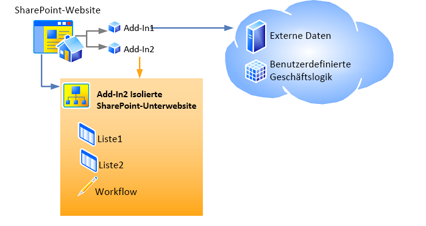

# <a name="host-webs-add-in-webs-and-sharepoint-components-in-sharepoint"></a><span data-ttu-id="20302-102">Hostwebsites, Add-In-Websites und SharePoint-Komponenten in SharePoint</span><span class="sxs-lookup"><span data-stu-id="20302-102">Host webs, add-in webs, and SharePoint components in SharePoint</span></span>
<span data-ttu-id="20302-p101">Hier lernen Sie den Unterschied zwischen Hostwebs und Add-In-Webs kennen. Außerdem erfahren Sie, welche SharePoint-Komponenten einem SharePoint-Add-In hinzugefügt werden können, welche für das Hostweb bereitgestellt werden, welche für das Add-In-Web bereitgestellt werden, und wie das Add-In-Web in einer isolierten Domäne bereitgestellt wird.</span><span class="sxs-lookup"><span data-stu-id="20302-p101">Learn about the distinction between host webs and add-in webs. Also find out which SharePoint components can be included in a SharePoint Add-in, which are deployed to the host web, which are deployed to the add-in web, and how the add-in web is deployed in an isolated domain.</span></span>
 

 <span data-ttu-id="20302-p102">**Hinweis** Der Name „Apps für SharePoint“ wird in „SharePoint-Add-Ins“ geändert. Während des Übergangszeitraums wird in der Dokumentation und der Benutzeroberfläche einiger SharePoint-Produkte und Visual Studio-Tools möglicherweise weiterhin der Begriff „Apps für SharePoint“ verwendet. Weitere Informationen finden Sie unter [Neuer Name für Office- und SharePoint-Apps](new-name-for-apps-for-sharepoint.md#bk_newname).</span><span class="sxs-lookup"><span data-stu-id="20302-p102">**Note**  The name "apps for SharePoint" is changing to "SharePoint Add-ins". During the transition, the documentation and the UI of some SharePoint products and Visual Studio tools might still use the term "apps for SharePoint". For details, see  [New name for apps for Office and SharePoint](new-name-for-apps-for-sharepoint.md#bk_newname).</span></span>
 


## <a name="host-webs-add-in-webs-and-the-isolated-domain"></a><span data-ttu-id="20302-108">Hostwebs, Add-In-Webs und die isolierte Domäne</span><span class="sxs-lookup"><span data-stu-id="20302-108">Host webs, add-in webs, and the isolated domain</span></span>
<span data-ttu-id="20302-109"><a name="IsolatedDomain"> </a></span><span class="sxs-lookup"><span data-stu-id="20302-109"></span></span>

<span data-ttu-id="20302-p103">Wenn ein Add-In, das SharePoint-Komponenten enthält, auf einer Website installiert wird, wird es auf der Seite **Websiteinhalt** aufgeführt und kann von dort aus gestartet werden. Diese Auflistung, die der Startpunkt des Add-Ins ist, ist das einzige Element, das der Website hinzugefügt werden muss. Bestimmte andere Elemente können jedoch optional hinzugefügt werden, wie z. B. eine benutzerdefinierte Aktion oder ein Add-In-Part. Weitere Informationen über diese Optionen finden Sie unter [Zugreifen auf das Add-In über die Benutzeroberfläche](important-aspects-of-the-sharepoint-add-in-architecture-and-development-landscap.md#AccessingApp). Im Gegensatz zu diesen Benutzeroberflächenelementen werden SharePoint-Add-In-Komponenten und Inhalte, wie z. B. Listen, Inhaltstypen, Workflows und Seiten, auf einer anderen Website in einer speziellen isolierten Domäne bereitgestellt. Dies bleibt dem Benutzer weitgehend verborgen. Die spezielle Website, auf der das Add-In *bereitgestellt* wird, wird als Add-In-Web bezeichnet. Die Website, auf der das Add-In *installiert* wird, wird als Hostweb bezeichnet. Obwohl die Add-In-Website eine eigene isolierte Domäne besitzt, befindet sie sich in derselben Websitesammlung wie die Hostweb. (Eine Ausnahme von dieser Regel besteht, wenn das Add-In mit Mandantenbereich installiert wird. In diesem Fall befindet sich die Add-In-Website in der Websitesammlung des Unternehmens-Add-In-Katalogs.)</span><span class="sxs-lookup"><span data-stu-id="20302-p103">When an add-in that includes SharePoint components is installed on a website, it is listed on the  **Site Contents** page from which it can be launched. That listing, which is the launch point of the add-in, is the only required addition to the website, although certain other things can optionally be added, such as a custom action or an add-in part. For information about these options, see [Accessing the add-in from the UI](important-aspects-of-the-sharepoint-add-in-architecture-and-development-landscap.md#AccessingApp). Other than these UI elements, the SharePoint Add-in components and content, such as lists, content types, workflows, and pages, are deployed to a different website in a special isolated domain. This fact is largely hidden from the user. The special website to which the add-in is  *deployed*  is called anadd-in web. The website to which the add-in is  *installed*  is called thehost web. Although the add-in web has its own isolated domain, it is in the same site collection as the host web. (One exception to this rule is when the add-in is installed with tenant scope. In that scenario, the add-in web is in the site collection of the corporate add-in catalog.)</span></span> 
 

 
<span data-ttu-id="20302-p104">Abbildung 1 zeigt eine Hostweb mit zwei installierten SharePoint-Add-Ins. Add-In 1 umfasst Remote-Komponenten, jedoch keine SharePoint-Komponenten. Daher hat sie keine Add-In-Website. Add-In 2 umfasst keine Remote-Komponenten, jedoch zwei SharePoint-Listen und einen Workflow. Diese wurden für eine isolierte Unterwebsite bereitgestellt. (Eine SharePoint-Add-In kann sowohl Remote-Komponenten als auch in SharePoint gehostete Komponenten umfassen. Keine der Add-Ins in diesem Diagramm umfasst jedoch beide Komponenten.)</span><span class="sxs-lookup"><span data-stu-id="20302-p104">Figure 1 shows a host web with two SharePoint Add-ins installed. Add-in 1 has remote components, but no SharePoint components, so it has no add-in web. Add-in 2 has no remote components, but it has two SharePoint lists and a workflow. These have been deployed to an isolated subsite. (a SharePoint Add-in can have both remote and SharePoint-hosted components, although neither add-in in this diagram has both.)</span></span>
 

 

<span data-ttu-id="20302-125">**Abbildung 1: Hostweb mit einem Anbieter-gehosteten Add-In und einem SharePoint-gehosteten Add-In**</span><span class="sxs-lookup"><span data-stu-id="20302-125">**Figure 1: Host web with a provider-hosted add-in and a SharePoint-hosted add-in**</span></span>

 

 

 
<span data-ttu-id="20302-127">Angenommen, ein Add-In mit SharePoint-Komponenten, die über die Benutzeroberflächenelemente hinausgehen, die für eine Hostweb bereitgestellt werden können, wird für eine Hostweb unter der folgenden URL installiert:</span><span class="sxs-lookup"><span data-stu-id="20302-127">For example, suppose that an add-in, with SharePoint components beyond just the UI elements that can be deployed to a host web, is installed on a host website at the following URL:</span></span>
 

 
 `https://www.fabrikam.com/sites/Marketing`
 

 
<span data-ttu-id="20302-128">Die SharePoint-Add-In wird für eine neu erstellte Website mit einer URL wie der folgenden bereitgestellt:</span><span class="sxs-lookup"><span data-stu-id="20302-128">The SharePoint Add-in will be deployed to a newly created website with a URL like the following:</span></span>
 

 
 `http://add-in-bdf2016ea7dacb.fabrikamadd-ins.com/sites/Marketing/Scheduler`
 

 
<span data-ttu-id="20302-129">Beachten Sie, dass diese URL die folgende Struktur hat:</span><span class="sxs-lookup"><span data-stu-id="20302-129">Note that this URL has the following structure:</span></span>
 

 
 <span data-ttu-id="20302-130">`https://` _Add-In_Präfix_ `-` _Add-In_ID_ `.` _Add-In_Basisdomäne_ `/` _Domäne_Relative_URL_von_Hostweb_ `/` _Add-In_Name_</span><span class="sxs-lookup"><span data-stu-id="20302-130">`https://` _Add-in_Prefix_ `-` _Add-in_ID_ `.` _Add-in_Base_Domain_ `/` _Domain_Relative_URL_of_Host_Web_ `/` _Add-in_Name_</span></span>
 

 
<span data-ttu-id="20302-131">Die Platzhalter sind wie folgt definiert:</span><span class="sxs-lookup"><span data-stu-id="20302-131">The placeholders are defined as follows:</span></span>
 

 

 

-  <span data-ttu-id="20302-p105">_Add-In_Präfix_ ist eine beliebige, vom Farmadministrator in der Zentraladministration festgelegte Zeichenfolge. Der Standardwert ist "Standard". In diesem Beispiel wurde dies vom Administrator in "Add-In" geändert.</span><span class="sxs-lookup"><span data-stu-id="20302-p105">_Add-in_Prefix_ is any string set by the farm administrator in Central Administration. The default is "default." In this example the administrator has changed this to "add-in."</span></span>
    
 
-  <span data-ttu-id="20302-135">_Add-In_ID_ ist eine hexadezimale Zahl, die intern bei der Installation des Add-Ins erstellt wird.</span><span class="sxs-lookup"><span data-stu-id="20302-135">_Add-in_ID_ is a hexadecimal number generated internally when the add-in is installed.</span></span>
    
 
-  <span data-ttu-id="20302-p106">_Add-In_Basisdomäne_ ist eine beliebige, vom Farmadministrator in der Zentraladministration oder mit der SharePoint Management Shell festgelegte Zeichenfolge. Dies sollte *nicht* auf eine Subdomäne der SharePoint-Webanwendung festgelegt werden, da der Zweck der Add-In-Isolation sonst nicht erfüllt wird. In diesem Beispiel hat der Administrator „www.“ entfernt und „apps“ zum Unternehmensnamen hinzugefügt. `fabrikamadd-ins.com` ist also die Basisdomäne des Add-Ins.</span><span class="sxs-lookup"><span data-stu-id="20302-p106">_Add-in_Base_Domain_ is any string set by the farm administrator in Central Administration or with SharePoint Management Shell. This should *not*  be set to a subdomain of the SharePoint web application or the purpose of add-in isolation is largely defeated. In this example, the administrator has removed the "www." and added "add-ins" to the company name. So `fabrikamadd-ins.com` is the add-in base domain.</span></span>
    
 
-  <span data-ttu-id="20302-141">_Domäne_Relative_URL_von_Hostweb_ ist die relative URL des übergeordneten Hostwebs, in diesem Fall `sites/Marketing`.</span><span class="sxs-lookup"><span data-stu-id="20302-141">_Domain_Relative_URL_of_Host_Web_ is the relative URL of the parent host web, in this case `sites/Marketing`.</span></span>
    
 
-  <span data-ttu-id="20302-142">_Add-In_Name_ ist der Wert des **Name**-Attributs des **App**-Elements in der Datei „appmanifest.xml“.</span><span class="sxs-lookup"><span data-stu-id="20302-142">_Add-in_Name_ is the value of the **Name** attribute of the **App** element in the appmanifest.xml file.</span></span>
    
 
<span data-ttu-id="20302-p107">Es gibt zwei Hauptgründe, warum SharePoint-Komponenten in Add-In-Webs statt im Hostweb bereitgestellt werden. Beide Gründe beziehen sich auf die Sicherheit.</span><span class="sxs-lookup"><span data-stu-id="20302-p107">There are two primary reasons why SharePoint components are deployed to add-in webs, rather than the host web. Both are related to security.</span></span>
 

 

 

-  <span data-ttu-id="20302-p108">**Erzwingen von Add-In-Berechtigungen:** Im Modell für SharePoint-Add-Ins hat ein Add-In eine eigene Identität und besitzt Berechtigungen, die nicht zwangsläufig mit den Berechtigungen des Benutzers übereinstimmen, der das Add-In ausführt. Diese Berechtigungen werden bei der Installation des Add-Ins angefordert und von dem Benutzer gewährt, welcher das Add-In installiert, falls dieser Benutzer über alle vom Add-In angeforderten Berechtigungen verfügt. (Wenn der betreffende Benutzer nicht über alle vom Add-In angeforderten Berechtigungen verfügt, kann er das Add-In nicht installieren.) Indem jedem Add-In eine eigene Domäne zugewiesen wird, kann SharePoint Anforderungen des Add-Ins zuverlässig identifizieren und die Berechtigungen des Add-Ins überprüfen. Weitere Informationen über Add-In-Berechtigungen finden Sie unter [Add-In-Berechtigungen](important-aspects-of-the-sharepoint-add-in-architecture-and-development-landscap.md#AppPermissions).</span><span class="sxs-lookup"><span data-stu-id="20302-p108">**Enforcement of add-in permissions:** In the model for SharePoint Add-ins, an add-in has its own identity and it has permissions that are not necessarily the same as the permissions of the user who is executing the add-in. These add-in permissions are requested when the add-in is installed and granted by the person who installs the add-in, as long as person has all the permissions that the add-in requests. (If the user who is installing the add-in does not have all the permissions that are requested by the add-in, the user cannot install the add-in.) By giving each add-in its own domain, SharePoint can reliably identify requests made by the add-in and verify the permissions of the add-in. For more information about add-in permissions, see [Add-in permissions](important-aspects-of-the-sharepoint-add-in-architecture-and-development-landscap.md#AppPermissions).</span></span>
    
 
-  <span data-ttu-id="20302-p109">**Domänenübergreifende Scripting-Sicherheit:** Moderne Browser unterstützen das als "Same-Origin-Policy" bezeichnete Sicherheitskonzept im Hinblick auf JavaScript-Methodenaufrufe. Indem jede SharePoint-Add-In in einer eigenen Domäne bereitgestellt wird, nutzt SharePoint die Same-Origin-Policy des Browsers, um sicherzustellen, dass JavaScript in der SharePoint-Add-In kein JavaScript von einer anderen Domäne ausführen kann, einschließlich der Domäne, in der (aus der Endbenutzerperspektive) das Add-In installiert ist.</span><span class="sxs-lookup"><span data-stu-id="20302-p109">**Cross-domain scripting security:** Modern browsers support a "same origin policy" with regard to JavaScript method calls. By deploying each SharePoint Add-in to its own domain, SharePoint takes advantage of the browser's same origin policy to ensure that JavaScript in the SharePoint Add-in cannot execute any JavaScript from any other domain, including the domain in which, from the end-user's perspective, the add-in is installed.</span></span>
    
    <span data-ttu-id="20302-p110">SharePoint bietet außerdem eine Möglichkeit zur sicheren Überwindung der Beschränkungen des Konzepts. Unter anderem können dadurch die Remote-Komponenten einer SharePoint-Add-In, Daten von jeder beliebigen Website in der allgemeinen übergeordneten Mandanteneinheit der Host- und der Add-In-Website abfragen. Weitere Informationen finden Sie unter  [Zugreifen auf SharePoint-Daten über Add-Ins mithilfe der domänenübergreifenden Bibliothek](access-sharepoint-data-from-add-ins-using-the-cross-domain-library.md).</span><span class="sxs-lookup"><span data-stu-id="20302-p110">SharePoint also provides a means of safely overcoming the limits of the policy. Among other things, this enables the remote components of a SharePoint Add-in to query data from any website in the common parent tenancy of the host and add-in webs. For more information, see  [Access SharePoint data from add-ins using the cross-domain library](access-sharepoint-data-from-add-ins-using-the-cross-domain-library.md).</span></span>
    
 

## <a name="types-of-sharepoint-components-that-can-be-in-a-sharepoint-add-in"></a><span data-ttu-id="20302-154">Typen von SharePoint-Komponenten in einem SharePoint-Add-In</span><span class="sxs-lookup"><span data-stu-id="20302-154">Types of SharePoint components that can be in a SharePoint Add-in</span></span>
<span data-ttu-id="20302-155"><a name="TypesOfSPComponentsInApps"> </a></span><span class="sxs-lookup"><span data-stu-id="20302-155"></span></span>

<span data-ttu-id="20302-p111">In der Regel kann ein SharePoint-Add-In eine oder mehrere der Komponenten in der folgenden Liste enthalten. Abgesehen von bestimmten Ausnahmen müssen diese Komponenten in Features mit **Web**-Bereich bereitgestellt werden, die in einer SharePoint-Lösungspaketdatei (WSP-Datei) enthalten sind:</span><span class="sxs-lookup"><span data-stu-id="20302-p111">In general, a SharePoint Add-in can contain one or more of the components in the following list. With certain exceptions, these components must be deployed in  **Web**-scoped Features that are inside a SharePoint solution package (.wsp) file:</span></span>
 

 

 <span data-ttu-id="20302-158">**Hinweis**   ***** Die mit einem Sternchen (*) gekennzeichneten Komponenten werden im Abschnitt [Warnhinweise für die Bereitstellung von SharePoint-Komponenten](#SpecialCases) weiter unten in diesem Artikel ausführlicher behandelt.</span><span class="sxs-lookup"><span data-stu-id="20302-158">**Note**   ***** The components that are marked with an asterisk (*) are discussed in more detail in the section [Caveats for deploying SharePoint components](#SpecialCases) later in this article.</span></span>
 


- <span data-ttu-id="20302-159">Features (nur mit **Webbereich**)</span><span class="sxs-lookup"><span data-stu-id="20302-159">Features ( **Web**-scoped only)</span></span>
    
 
- <span data-ttu-id="20302-160">Benutzerdefinierte Aktionen (einschließlich Kontextmenüelemente und Anpassungen des Menübands)*</span><span class="sxs-lookup"><span data-stu-id="20302-160">Custom actions (including shortcut menu items and ribbon customizations)*</span></span>
    
 
- <span data-ttu-id="20302-161">Remote-Ereignisempfänger*</span><span class="sxs-lookup"><span data-stu-id="20302-161">Remote event receivers*</span></span>
    
 
- <span data-ttu-id="20302-162">Markup, das auf Webparts verweist, einschließlich Add-In-Parts, die SharePoint hinzugefügt werden (jedoch keine benutzerdefinierten Webparts)*</span><span class="sxs-lookup"><span data-stu-id="20302-162">Markup that references Web Parts, including add-in parts, that are included in SharePoint (but not custom Web Parts)*</span></span>
    
 
- <span data-ttu-id="20302-163">Angepasste Cascading Stylesheets (CSS)-Dateien zur Verwendung für SharePoint-Seiten</span><span class="sxs-lookup"><span data-stu-id="20302-163">Custom cascading style sheets (CSS) files for use by SharePoint pages</span></span>
    
 
- <span data-ttu-id="20302-164">Angepasste JavaScript-Dateien zur Verwendung für SharePoint-Seiten</span><span class="sxs-lookup"><span data-stu-id="20302-164">Custom JavaScript files for use by SharePoint pages</span></span>
    
 
- <span data-ttu-id="20302-165">Module (Dateigruppen)</span><span class="sxs-lookup"><span data-stu-id="20302-165">Modules (sets of files)</span></span>
    
 
- <span data-ttu-id="20302-166">Seiten</span><span class="sxs-lookup"><span data-stu-id="20302-166">Pages</span></span>
    
 
- <span data-ttu-id="20302-167">Listenvorlagen</span><span class="sxs-lookup"><span data-stu-id="20302-167">List templates</span></span>
    
 
- <span data-ttu-id="20302-168">Listen- und Bibliotheksinstanzen</span><span class="sxs-lookup"><span data-stu-id="20302-168">List and library instances</span></span>
    
 
- <span data-ttu-id="20302-169">Angepasste Listenformulare</span><span class="sxs-lookup"><span data-stu-id="20302-169">Custom list forms</span></span>
    
 
- <span data-ttu-id="20302-170">Angepasste Listenansichten</span><span class="sxs-lookup"><span data-stu-id="20302-170">Custom list views</span></span>
    
 
- <span data-ttu-id="20302-171">Angepasste Inhaltstypen</span><span class="sxs-lookup"><span data-stu-id="20302-171">Custom content types</span></span>
    
 
- <span data-ttu-id="20302-172">Felder (von Feldtypen, die in SharePoint integriert sind)</span><span class="sxs-lookup"><span data-stu-id="20302-172">Fields (of field types that are built into SharePoint)</span></span>
    
 
- <span data-ttu-id="20302-173">Microsoft Business Connectivity Services (BCS)-Modelle (nur mit **Webbereich**), externe Inhaltstypen auf Grundlage des Modells und externe Listen, die Inhaltstypen verwenden*</span><span class="sxs-lookup"><span data-stu-id="20302-173">Microsoft Business Connectivity Services (BCS) models ( **Web**-scoped only), external content types based on the model, and external lists that use the content types*</span></span>
    
 
- <span data-ttu-id="20302-174">Workflows*</span><span class="sxs-lookup"><span data-stu-id="20302-174">Workflows*</span></span>
    
 
- <span data-ttu-id="20302-175">Eigenschaftenbehälter</span><span class="sxs-lookup"><span data-stu-id="20302-175">Property bags</span></span>
    
 
- <span data-ttu-id="20302-176">Webvorlagen (jedoch keine Websitedefinitionen)*</span><span class="sxs-lookup"><span data-stu-id="20302-176">Web templates (but not site definitions)*</span></span>
    
 
<span data-ttu-id="20302-p112">Kein anderer SharePoint-Komponententyp kann in einer SharePoint-Add-In bereitgestellt werden. Weitere Informationen über Einschränkungen im Hinblick darauf, was in einer SharePoint-Add-In enthalten sein kann, finden Sie unter  [SharePoint-Add-Ins im Vergleich zu SharePoint-Lösungen](http://msdn.microsoft.com/library/0e9efadb-aaf2-4c0d-afd5-d6cf25c4e7a8%28Office.15%29.aspx).</span><span class="sxs-lookup"><span data-stu-id="20302-p112">No other kind of SharePoint component can be deployed in a SharePoint Add-in. For more information about restrictions on what can be included in a SharePoint Add-in, see  [SharePoint Add-ins compared with SharePoint solutions](http://msdn.microsoft.com/library/0e9efadb-aaf2-4c0d-afd5-d6cf25c4e7a8%28Office.15%29.aspx).</span></span>
 

 

## <a name="caveats-for-deploying-sharepoint-components"></a><span data-ttu-id="20302-179">Vorsichtsmaßnahmen für die Bereitstellung von SharePoint-Komponenten</span><span class="sxs-lookup"><span data-stu-id="20302-179">Caveats for deploying SharePoint components</span></span>
<span data-ttu-id="20302-180"><a name="SpecialCases"> </a></span><span class="sxs-lookup"><span data-stu-id="20302-180"></span></span>

<span data-ttu-id="20302-181">Im folgenden finden Sie einige Vorsichtsmaßnahmen und Details in Bezug auf die Bereitstellung von bestimmte Typen von SharePoint-Komponenten in einem Add-In:</span><span class="sxs-lookup"><span data-stu-id="20302-181">The following are some caveats and details concerning the deployment of certain kinds of SharePoint components in an add-in:</span></span> 
 

 

-  <span data-ttu-id="20302-p113">**Benutzerdefinierte Aktionen:** Sie können benutzerdefinierte Aktionen nicht nur der Add-In-Website, sondern auch der Hostwebsite hinzufügen. Um die benutzerdefinierte Aktion der Add-In-Website hinzuzufügen, fügen Sie sie einem Feature mit **Web**-Bereich hinzu, das in einer WSP-Datei enthalten ist. Dabei gehen Sie genauso vor wie bei jeder anderen Komponente, die Sie der Add-In-Website hinzufügen. Um eine benutzerdefinierte Aktion der Hostweb hinzuzufügen, können Sie (selbst bei einem extern basierten Add-In) ein **CustomAction**-Markup in ein Feature einschließen, das sich im Add-In-Paket, jedoch außerhalb einer WSP-Datei befindet. Komponenten in einem solchen "losen" Feature gelten nur für die Hostweb und nicht für die Add-In-Website. Daher wird dieser Feature-Typ als Hostweb-Feature bezeichnet.</span><span class="sxs-lookup"><span data-stu-id="20302-p113">**Custom actions:** In addition to adding custom actions to the add-in web, you can add them to the host web as well. To add the custom action to the add-in web, you include it in a **Web**-scoped Feature that is inside a .wsp file, just as you would include any other component you add to the add-in web. To add a custom action to the host web, you can include (even in an externally based add-in)  **CustomAction** markup in a Feature that is in the add-in package but outside any .wsp file. Components in such a "loose" Feature apply to the host web, not the add-in web, so this type of Feature is called ahost web Feature.</span></span> 
    
 
-  <span data-ttu-id="20302-p114">**Webparts:** Eine Art von Webpart, ein Add-In-Part, kann in einem Add-In bereitgestellt werden. Ein Add-In-Part kann entweder für die Add-In-Website oder die Hostwebsite verwendet werden. Auf alle anderen Typen von Webparts kann in Add-Ins verwiesen, jedoch nicht von ihnen bereitgestellt werden. Wenn ein Add-In-Part für die Hostweb bereitgestellt wird, sollte es in ein Hostweb-Feature eingeschlossen sein.</span><span class="sxs-lookup"><span data-stu-id="20302-p114">**Web Parts:** One kind of Web Part, an add-in part, can be deployed in an add-in, and an add-in part can go to either the add-in web or the host web. All other types of Web Parts can be referenced in add-ins, but not deployed by them. If an add-in part is deployed to the host web, it should be included in a host web Feature.</span></span>
    
 
-  <span data-ttu-id="20302-p115">**Remote-Ereignisempfänger:** Diese sind neu in SharePoint. Sie ähneln den klassischen SharePoint-Ereignisempfängern, mit der Ausnahme, dass der Code in der Cloud ausgeführt wird. Sie sind in einem in SharePoint gehosteten Add-In nicht verfügbar.</span><span class="sxs-lookup"><span data-stu-id="20302-p115">**Remote event receivers:** These are new in SharePoint. They resemble classic SharePoint event receivers except that the code runs in the cloud. These are not available in a SharePoint-hosted add-in.</span></span>
    
 
-  <span data-ttu-id="20302-p116">**Workflows:** Workflows in SharePoint verwenden die in Microsoft Azure gehostete Workflow-Laufzeit, was in SharePoint neu ist. Codierte Workflows, welche die in SharePoint gehostete Workflow-Laufzeit verwenden, können einer SharePoint-Add-In nicht hinzugefügt werden. Zulässig sind nur deklarative Workflows oder Workflows, welche die neuere Laufzeit verwenden.</span><span class="sxs-lookup"><span data-stu-id="20302-p116">**Workflows:** Workflows in SharePoint use the Microsoft Azure-hosted workflow runtime that is new in SharePoint. Coded workflows that use the SharePoint-hosted workflow runtime cannot be included in a SharePoint Add-in. Only declarative workflows or workflows that use the newer runtime are allowed.</span></span>
    
 
-  <span data-ttu-id="20302-p117">**Microsoft Business Connectivity Services (BCS)-Modelle, externe Inhaltstypen und externe Listen:** Business Data Connectivity (BDC)-Dienst-Modelle haben in der Regel einen größeren Bereich als eine Websitesammlung. Wenn jedoch ein Business Data Connectivity (BDC)-Dienst-Modell in einem Add-In bereitgestellt wird, ist sein Bereich auf die Add-In-Website beschränkt. Wenn ein Business Data Connectivity (BDC)-Dienst-Modell einem Add-In hinzugefügt wird, wird es nicht im Business Data Connectivity (BDC)-Dienst-Speicher für freigegebene Dienste gespeichert, sondern als Datei in der Add-In-Website.</span><span class="sxs-lookup"><span data-stu-id="20302-p117">**Microsoft Business Connectivity Services (BCS) models, external content types, and external lists:**Business Data Connectivity (BDC) service models typically have a scope that is wider than a site collection. However, when a Business Data Connectivity (BDC) service model is deployed in an add-in, its scope is limited to the add-in web. When a Business Data Connectivity (BDC) service model is included in an add-in, it is not stored in the Business Data Connectivity (BDC) service shared service store. Instead, it is stored as a file in the add-in web.</span></span>
    
 
-  <span data-ttu-id="20302-p118">**Webvorlagen:** In den meisten Fällen empfiehlt es sich, dass die Add-In-Website die neu integrierte Websitedefinitionskonfiguration **APP#0**, die für Add-In-Webs optimiert ist, instanziiert. (Weitere Informationen hierzu finden Sie unter  [Zugreifen auf das Add-In über die Benutzeroberfläche](important-aspects-of-the-sharepoint-add-in-architecture-and-development-landscap.md#AccessingApp).) SharePoint verwendet automatisch **APP#0**, wenn das Add-In-Paket kein  [WebTemplate](http://msdn.microsoft.com/library/ff4ba91a-cc5f-47ff-9101-a7651f452185%28Office.15%29.aspx)-Element enthält.</span><span class="sxs-lookup"><span data-stu-id="20302-p118">**Web Templates:** In most cases, you will want the add-in web to instantiate the new built-in site definition configuration **APP#0**, which is optimized for add-in webs. (For more information about it, see  [Accessing the add-in from the UI](important-aspects-of-the-sharepoint-add-in-architecture-and-development-landscap.md#AccessingApp).) SharePoint automatically uses  **APP#0** when the add-in package does not include a [WebTemplate](http://msdn.microsoft.com/library/ff4ba91a-cc5f-47ff-9101-a7651f452185%28Office.15%29.aspx) element.</span></span>
    
    <span data-ttu-id="20302-p119">Sie können auch einen benutzerdefinierten Websitetyp für das Add-In-Web definieren. Hierbei sind zwei Hauptschritte durchzuführen:</span><span class="sxs-lookup"><span data-stu-id="20302-p119">You can also define a custom site type for the add-in web. There are two major steps to doing this:</span></span>
    
      - <span data-ttu-id="20302-p120">Schließen Sie ein angepasstes  [WebTemplate-Element (Webvorlage)](http://msdn.microsoft.com/library/ff4ba91a-cc5f-47ff-9101-a7651f452185%28Office.15%29.aspx), eine onet.xml-Datei und ggf. weitere zugehörige Dateien in das Add-In-Web-Feature für Ihr Add-In ein. Stellen Sie die Webvorlage wie gewohnt in dem Feature mit Web-Bereich in einer WSP-Datei in dem Add-In-Paket bereit.</span><span class="sxs-lookup"><span data-stu-id="20302-p120">Include a custom  [WebTemplate Element (Web Template)](http://msdn.microsoft.com/library/ff4ba91a-cc5f-47ff-9101-a7651f452185%28Office.15%29.aspx), an onet.xml file, and possibly other associated files, in the add-in web Feature for your add-in. Deploy the web template in the Web-scoped Feature in a .wsp file inside the add-in package as usual.</span></span>
    
 
  - <span data-ttu-id="20302-p121">Fügen Sie dem Add-In-Manifest ein  [WebTemplate-Element (PropertiesDefinition ComplexType) (SharePoint-Add-in Manifest)](http://msdn.microsoft.com/library/62302903-e97a-a9a3-a64e-13176a7c4e1e%28Office.15%29.aspx) als untergeordnetes Element des **Properties**-Elements hinzu, und legen Sie sein **Id**-Attribut auf die GUID des Add-In-Web-Features und den Wert des **Name**-Attributs des  [WebTemplate-Element (Webvorlage)](http://msdn.microsoft.com/library/ff4ba91a-cc5f-47ff-9101-a7651f452185%28Office.15%29.aspx) fest. Beachten Sie, dass die GUID mit Bindestrichen geschrieben und in geschweifte Klammern "{}" eingeschlossen werden muss, außerdem müssen der GUID- und der Vorlagenname durch das Zeichen "#" getrennt werden. Hier ein Beispiel:</span><span class="sxs-lookup"><span data-stu-id="20302-p121">Add a  [WebTemplate element (PropertiesDefinition complexType) (SharePoint Add-in Manifest)](http://msdn.microsoft.com/library/62302903-e97a-a9a3-a64e-13176a7c4e1e%28Office.15%29.aspx) to the add-in manifest as a child of the **Properties** element and set its **Id** attribute to the GUID of the add-in web Feature and the value of the **Name** attribute of the [WebTemplate Element (Web Template)](http://msdn.microsoft.com/library/ff4ba91a-cc5f-47ff-9101-a7651f452185%28Office.15%29.aspx). Note that GUID must be hyphenated and wrapped in braces "{}", and the GUID and template name are separated by the "#" character. The following is an example:</span></span>
    
```XML
  <WebTemplate Id="{81dd4ae5-873b-4759-9838-4ad9c3dd2952}#NewSiteType" />
```


     **Note**  The new  [WebTemplate](http://msdn.microsoft.com/library/62302903-e97a-a9a3-a64e-13176a7c4e1e%28Office.15%29.aspx) element for add-in manifests is not the same markup as the [WebTemplate](http://msdn.microsoft.com/library/ff4ba91a-cc5f-47ff-9101-a7651f452185%28Office.15%29.aspx) element that can be included in Features. The **WebTemplate** element that can be included in Features defines a type of site, but the **WebTemplate** element for add-in manifests simply identifies what type of site to use. For more information about the add-in manifest of a SharePoint Add-in, see [Add-in package structure](important-aspects-of-the-sharepoint-add-in-architecture-and-development-landscap.md#SPAppModelArch_Package).

     **Caution**  Do not use the  **WebTemplate** element in the add-in manifest to designate any of the built-in SharePoint site definition configurations as the add-in web's site type. We do not support using any of the built-in site definition configurations, other than **APP#0**, for add-in webs. 

    For more information about site definition configurations and web templates, see  [Working with Site Templates and Definitions](http://msdn.microsoft.com/library/1edf6d4d-eddb-4cb5-9034-ed394e8a3e01%28Office.15%29.aspx).
    
 

## <a name="additional-resources"></a><span data-ttu-id="20302-208">Zusätzliche Ressourcen</span><span class="sxs-lookup"><span data-stu-id="20302-208">Additional resources</span></span>
<span data-ttu-id="20302-209"><a name="SP15hostedwebs_bk_addlresources"> </a></span><span class="sxs-lookup"><span data-stu-id="20302-209"></span></span>


-  [<span data-ttu-id="20302-210">Kritische Aspekte der Architektur und der Entwicklungslandschaft für SharePoint-Add-Ins</span><span class="sxs-lookup"><span data-stu-id="20302-210">Important aspects of the SharePoint Add-in architecture and development landscape</span></span>](important-aspects-of-the-sharepoint-add-in-architecture-and-development-landscap.md)
    
 
-  [<span data-ttu-id="20302-211">SharePoint-Add-Ins im Vergleich zu SharePoint-Lösungen</span><span class="sxs-lookup"><span data-stu-id="20302-211">SharePoint Add-ins compared with SharePoint solutions</span></span>](http://msdn.microsoft.com/library/0e9efadb-aaf2-4c0d-afd5-d6cf25c4e7a8%28Office.15%29.aspx)
    
 

 

 

