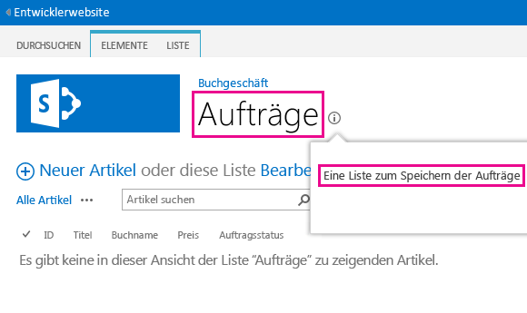
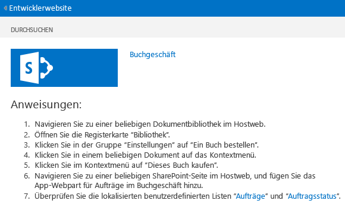

# <a name="localize-sharepoint-add-ins"></a><span data-ttu-id="a8b7a-102">Lokalisieren von Add-Ins für SharePoint</span><span class="sxs-lookup"><span data-stu-id="a8b7a-102">Localize SharePoint Add-ins</span></span>
<span data-ttu-id="a8b7a-103">Lokalisieren Sie ein SharePoint-Add-In mithilfe von Ressourcendateien, JavaScript-Ressourcendateien und anderen Techniken.</span><span class="sxs-lookup"><span data-stu-id="a8b7a-103">Localize a SharePoint Add-in by using resource files, JavaScript resource files, and other techniques.</span></span>
 

 <span data-ttu-id="a8b7a-p101">**Hinweis** Der Name „Apps für SharePoint“ wird in „SharePoint-Add-Ins“ geändert. Während des Übergangszeitraums wird in der Dokumentation und der Benutzeroberfläche einiger SharePoint-Produkte und Visual Studio-Tools möglicherweise weiterhin der Begriff „Apps für SharePoint“ verwendet. Weitere Informationen finden Sie unter [Neuer Name für Office- und SharePoint-Apps](new-name-for-apps-for-sharepoint.md#bk_newname).</span><span class="sxs-lookup"><span data-stu-id="a8b7a-p101">**Note**  The name "apps for SharePoint" is changing to "SharePoint Add-ins". During the transition, the documentation and the UI of some SharePoint products and Visual Studio tools might still use the term "apps for SharePoint". For details, see  [New name for apps for Office and SharePoint](new-name-for-apps-for-sharepoint.md#bk_newname).</span></span>
 


 <span data-ttu-id="a8b7a-107">**Hinweis** In diesem Thema wird davon ausgegangen, dass Sie mit der grundlegenden Erstellung von SharePoint-Add-Ins ebenso vertraut sind wie mit SharePoint-Features, dem Unterschied zwischen Add-In-Webs und Hostwebs,  [welche Arten von SharePoint-Komponenten in einem Add-In enthalten sein können](host-webs-add-in-webs-and-sharepoint-components-in-sharepoint.md#TypesOfSPComponentsInApps) und den Grundlagen der Lokalisierung mit RESX-Dateien.</span><span class="sxs-lookup"><span data-stu-id="a8b7a-107">**Note**  This topic assumes that you are familiar with basic creation of SharePoint Add-ins; and with SharePoint Features, the distinction between add-in webs and host webs,  [what kind of SharePoint components can be in an add-in](host-webs-add-in-webs-and-sharepoint-components-in-sharepoint.md#TypesOfSPComponentsInApps), and the basics of localization with .resx files.</span></span>
 


## <a name="get-ready-to-localize-a-sharepoint-add-in"></a><span data-ttu-id="a8b7a-108">Vorbereiten der Lokalisierung eines Add-Ins für SharePoint</span><span class="sxs-lookup"><span data-stu-id="a8b7a-108">Get ready to localize a SharePoint Add-in</span></span>
<span data-ttu-id="a8b7a-109"><a name="Prerequisites"> </a></span><span class="sxs-lookup"><span data-stu-id="a8b7a-109"><a name="Prerequisites"> </a></span></span>

<span data-ttu-id="a8b7a-110">Bevor Sie beginnen, sollten Sie Folgendes festlegen:</span><span class="sxs-lookup"><span data-stu-id="a8b7a-110">Before you begin, identify the following:</span></span> 
 

 

- <span data-ttu-id="a8b7a-p102">Die Gebietsschemas, die das Add-In unterstützen muss. SharePoint Online und die lokale Bereitstellung von SharePoint mit installierten Sprachpaketen ermöglichen Benutzern das Erstellen von Websites in einer bestimmten Sprache und Kultur. Entscheiden Sie, welche lokalisierten Websites Ihre Kunden verwenden werden, und bestimmen Sie, welche dieser Websites Sie mit einer lokalisierten Version Ihrer Add-In-Komponenten unterstützen möchten.</span><span class="sxs-lookup"><span data-stu-id="a8b7a-p102">The locales that your add-in needs to support. SharePoint Online and SharePoint on premises with Language Packs installed enable users to create websites in a specific language and culture. Decide what localized websites your customers will be using and determine which of these you want to support with a localized version of your add-in's components.</span></span>
    
 
- <span data-ttu-id="a8b7a-114">Die zu lokalisierenden Komponenten Ihres Add-Ins.</span><span class="sxs-lookup"><span data-stu-id="a8b7a-114">The components that you need to localize in your add-in.</span></span>
    
 
<span data-ttu-id="a8b7a-115">Achten Sie auch auf Folgendes:</span><span class="sxs-lookup"><span data-stu-id="a8b7a-115">Also, be aware of the following:</span></span>
 

 

-  <span data-ttu-id="a8b7a-116">Bei den Verfahren in diesem Artikel wird davon ausgegangen, dass Sie die neueste Version von [Office Developer Tools für Visual Studio 2013](http://aka.ms/OfficeDevToolsForVS2013) oder von [Office Developer Tools für Visual Studio 2015](http://aka.ms/OfficeDevToolsForVS2015) verwenden.</span><span class="sxs-lookup"><span data-stu-id="a8b7a-116">The procedures in this article assume that you are using the most recent version of [Office Developer Tools for Visual Studio 2013](http://aka.ms/OfficeDevToolsForVS2013), or  [Office Developer Tools for Visual Studio 2015](http://aka.ms/OfficeDevToolsForVS2015).</span></span>
    
     <span data-ttu-id="a8b7a-p103">**Hinweis** Wenn sich Ihre SharePoint-Testwebsite auf einer lokalen SharePoint-Farm statt auf einer Microsoft SharePoint Online-Entwicklerwebsite befindet, müssen Sie möglicherweise die Sprachpakete der Sprachen installieren, in die Sie Ihre SharePoint-Add-In übersetzen. Weitere Informationen dazu finden Sie unter [Installieren oder Deinstallieren von Sprachpaketen für SharePoint](http://technet.microsoft.com/en-us/library/cc262108%28v=office.15%29.aspx) und [Sprachpakete in SharePoint Server 2013](http://technet.microsoft.com/en-us/library/ff463597%28v=office.15%29.aspx), sowie unter den Downloadlinks.</span><span class="sxs-lookup"><span data-stu-id="a8b7a-p103">**Note**  If your test SharePoint website is an on premise SharePoint farm instead of a Microsoft SharePoint Online Developer Site, you may need to install the language packs for the languages in which you are translating your SharePoint Add-in. For more information, see  [Install or uninstall language packs for SharePoint](http://technet.microsoft.com/en-us/library/cc262108%28v=office.15%29.aspx) and [Language packs in SharePoint Server 2013](http://technet.microsoft.com/en-us/library/ff463597%28v=office.15%29.aspx), and the download links in the latter.</span></span>
- <span data-ttu-id="a8b7a-p104">Die Screenshots und Codebeispiele in diesem Artikel stammen aus dem Beispiel  [SharePoint-Add-In-Lokalisierung](https://github.com/OfficeDev/SharePoint-Add-in-Localization). Dieses Beispiel können Sie herunterladen, um sich die Ergebnisse der Vorgehensweisen aus diesem Artikel anzusehen.</span><span class="sxs-lookup"><span data-stu-id="a8b7a-p104">The screen shots and code examples in this article reflect the sample  [SharePoint-Add-in-Localization](https://github.com/OfficeDev/SharePoint-Add-in-Localization). You can download the sample to see the results of the procedures described in this article.</span></span>
    
 

## <a name="localize-the-add-in-web-components"></a><span data-ttu-id="a8b7a-121">Lokalisieren der Add-In-Web-Komponenten</span><span class="sxs-lookup"><span data-stu-id="a8b7a-121">Localize the add-in web components</span></span>
<span data-ttu-id="a8b7a-122"><a name="LocalizingAppWeb"> </a></span><span class="sxs-lookup"><span data-stu-id="a8b7a-122"><a name="LocalizingAppWeb"> </a></span></span>

<span data-ttu-id="a8b7a-p105">Ein Add-In-Web kann bestimmte Arten von SP-Komponenten enthalten. Weitere Informationen zu den verschiedenen Arten von SharePoint-Komponenten, die in einem SharePoint-Add-In enthalten sein können, finden Sie unter  [Typen von SharePoint-Komponenten, die in einem SharePoint-Add-In enthalten sein können](host-webs-add-in-webs-and-sharepoint-components-in-sharepoint.md#TypesOfSPComponentsInApps). Zum Lokalisieren von Komponenten, die für ein Add-In-Web bereitgestellt werden, fügen Sie RESX-Dateien in Modulen im selben Feature hinzu, das die Add-In-Web-Komponente enthält. Sie verweisen im Markup der Komponente auf die Ressource. Wie das geht, wird weiter unten in diesem Artikel erläutert. Auf benutzerdefinierten Websiteseiten in einem SharePoint-Add-In werden anstelle von RESX-Dateien jedoch JavaScript-Zeichenfolgenvariablendateien verwendet, wie weiter unten in diesem Abschnitt beschrieben.</span><span class="sxs-lookup"><span data-stu-id="a8b7a-p105">An add-in web can contain specific kinds of SP components. For more information about the kinds of SharePoint components that can be in a SharePoint Add-in, see  [Types of SharePoint components that can be in a SharePoint Add-in](host-webs-add-in-webs-and-sharepoint-components-in-sharepoint.md#TypesOfSPComponentsInApps). To localize components that are deployed to an add-in web, you add .resx files in modules in the same Feature that contains the add-in web component. You reference the resources in the markup of the component. How you do this is explained later in this article. However, custom site pages in a SharePoint Add-in use JavaScript string variable files instead of .resx files, as described later in this section.</span></span>
 

 

 <span data-ttu-id="a8b7a-p106">**Hinweis** Ressourcendateien können nicht gemeinsam von mehreren Features des Add-In-Webs genutzt werden. Für jedes Feature in der WSP-Datei müssen separate Gruppen von Ressourcendateien erstellt werden.</span><span class="sxs-lookup"><span data-stu-id="a8b7a-p106">**Note**  Resource files cannot be shared by multiple add-in web Features. For each Feature in the .wsp file, you have to create separate sets of resource files.</span></span>
 


### <a name="to-create-the-add-in-web-resource-files"></a><span data-ttu-id="a8b7a-131">So erstellen Sie die Ressourcendateien für das Add-In-Web</span><span class="sxs-lookup"><span data-stu-id="a8b7a-131">To create the add-in web resource files</span></span>


1. <span data-ttu-id="a8b7a-p107">Öffnen Sie das SharePoint-Add-In-Projekt in Visual Studio. (Das Beispiel, aus dem die Screenshots in diesem Thema stammen, ist ein vom Anbieter gehostetes Add-In mit ASP.NET-Webformularen als Remote-Webanwendungsteil des Projekts).</span><span class="sxs-lookup"><span data-stu-id="a8b7a-p107">Open the SharePoint Add-in project in Visual Studio. (The sample from which the screenshots in this topic were taken is a provider-hosted add-in with ASP.NET Web Forms as the remote web application part of the project.)</span></span>
    
 
2. <span data-ttu-id="a8b7a-134">Öffnen Sie im **Projektmappen-Explorer** das Kontextmenü für den Featurenamen, und wählen Sie **Funktionsressource hinzufügen**.</span><span class="sxs-lookup"><span data-stu-id="a8b7a-134">In  **Solution Explorer**, open the shortcut menu for the Feature name, and choose  **Add Feature Resource**.</span></span>
    
 
3. <span data-ttu-id="a8b7a-p108">Wählen Sie im Dialogfeld **Ressource hinzufügen** die Option **Invariante Sprache (Invariantes Land)** und dann die Schaltfläche **OK**. Die Datei „Resources.resx“ wird im **Projektmappen-Explorer** dem Ordner des Features hinzugefügt und im **Ressourcen-Editor** von Visual Studio geöffnet.</span><span class="sxs-lookup"><span data-stu-id="a8b7a-p108">In the  **Add Resource** dialog box, choose **Invariant Language (Invariant Country)**, and then choose the  **OK** button. A Resources.resx file is added to the Feature's folder in **Solution Explorer**, and the file is opened in the Visual Studio  **Resource Editor**.</span></span> 
    
    <span data-ttu-id="a8b7a-p109">Nach der Bearbeitung enthält diese „invariante Sprachdatei“ die Zeichenfolgen, die im **Featurekatalog** auf allen Websites in Sprachen verwendet werden, für die Sie *keine* lokalisierte Version der Zeichenfolgen bereitstellen. Daher sollten Sie für die Zeichenfolgen in dieser Datei die Sprache verwenden, die mit der höchsten Wahrscheinlichkeit die Zweitsprache der Personen ist, die SharePoint verwenden. Üblicherweise wird zu diesem Zweck Englisch verwendet, in einigen Szenarien kann jedoch eine andere Sprache die bessere Wahl sein. In bestimmten Regionen ist beispielsweise Französisch als Zweitsprache verbreiteter als Englisch. Im weitergeführten Beispiel dieses Themas wird Englisch als invariante Sprache verwendet.</span><span class="sxs-lookup"><span data-stu-id="a8b7a-p109">When edited, this "invariant language" file contains the strings that are used in the  **Feature** gallery on all sites in languages for which you are *not*  going to be providing a localized version of strings. So the language used for the strings in this file should be the language that is most likely to be a second language of people using SharePoint. Traditionally, English is used for this purpose, but in some scenarios another language might be a better choice. For example, in some regions, French may be a more common second language of the users than English. The continuing example in this topic uses English as the invariant language.</span></span>
    
     <span data-ttu-id="a8b7a-p110">**Hinweis** Ein SharePoint-Add-In kann nicht auf einer Website installiert werden, deren Sprache nicht im Abschnitt **Unterstützte Gebietsschemas** des Add-In-Manifests aufgeführt ist. Beachten Sie, dass Sie Sprachen, die Sie in einem lokalisierten Add-In *nicht*  anbieten, dennoch zum Add-In-Manifest hinzufügen müssen. Weitere Informationen zu im Add-In-Manifest unterstützten Gebietsschemas finden Sie im Verfahren **So erstellen Sie die Hostweb-Ressourcendateien** dieses Artikels.</span><span class="sxs-lookup"><span data-stu-id="a8b7a-p110">**Note**  a SharePoint Add-in cannot be installed on a website whose language is not listed in the  **Supported Locales** section of the add-in manifest. Keep in mind that when this article discusses languages for which you are *not*  going to be providing a localized add-in, you do still have to add such languages to the add-in manifest. See the procedure **To create resource files for the host web** in this article for more details about supported locales in the add-in manifest.</span></span>
4. <span data-ttu-id="a8b7a-p111">Geben Sie in der Spalte **Name** in der obersten Zeile im **Ressourcen-Editor** einen aussagekräftigen Namen für die Zeichenfolge (oder eine andere Ressource) ein z. B.OrdersListInstance_Title undOrdersListInstance_Description. Diese Namen lokalisierbarer Ressourcen werden selbst nicht lokalisiert. Die Namen müssen in der Datei eindeutig sein.</span><span class="sxs-lookup"><span data-stu-id="a8b7a-p111">In the  **Name** column of the top row in the **Resource Editor**, enter a descriptive name for the string (or other resource)—for example, OrdersListInstance_Title andOrdersListInstance_Description. These names of localizable resources are not themselves localized. Each resource must have its own name.</span></span> 
    
 
5. <span data-ttu-id="a8b7a-148">Geben Sie in der Spalte **Wert** eine geeignete Zeichenfolge (oder URL oder andere Ressource) in der invarianten Sprache an - beispielsweiseBestellungen undListe zum Speichern der Bestellungen.</span><span class="sxs-lookup"><span data-stu-id="a8b7a-148">In the  **Value** column, enter an appropriate string (or URL or other resource) in the invariant language—for example,Orders, and A list to store the orders.</span></span>
    
 
6. <span data-ttu-id="a8b7a-149">Fügen Sie weitere Name-Wert-Paare für alle Zeichenfolgen und Ressourcen hinzu, die für die Verwendung in beliebigen Komponenten Ihres Features lokalisiert werden sollen.</span><span class="sxs-lookup"><span data-stu-id="a8b7a-149">Add additional name and value pairs for all strings and resources that should be localized for use in any components of your Feature.</span></span>
    
 
7. <span data-ttu-id="a8b7a-150">Speichern Sie die Datei.</span><span class="sxs-lookup"><span data-stu-id="a8b7a-150">Save the file.</span></span>
    
 
8. <span data-ttu-id="a8b7a-p112">Fügen Sie dem Feature wie oben beschrieben eine weitere Ressourcendaten hinzu, wobei Sie jedoch eine bestimmte Sprache statt **Invariante Sprache (Invariantes Land)** auswählen. Sie können zum Beispiel **Spanisch (Spanien)** auswählen. Eine Datei „Resources.LL-CC.resx“ (wobei  `LL` und `CC` [Internet Engineering Task Force (IETF)-konforme](http://tools.ietf.org/html/rfc1766) Sprach- und Kulturcodes sind) wird dem Ordner „Feature“ im **Projektmappen-Explorer** hinzugefügt, und die Datei wird im **Ressourcen-Editor** von Visual Studio geöffnet.</span><span class="sxs-lookup"><span data-stu-id="a8b7a-p112">Add another resource file to the Feature as you did before, but select a particular language instead of  **Invariant Language (Invariant Country)**. For example, you can choose  **Spanish (Spain)**. A Resources.LL-CC.resx file (where  `LL` and `CC` are [Internet Engineering Task Force (IETF)-compliant](http://tools.ietf.org/html/rfc1766) language and culture codes) is added to the Feature's folder in **Solution Explorer**, and the file is opened in the Visual Studio  **Resource Editor**.</span></span> 
    
 
9. <span data-ttu-id="a8b7a-p113">Kopieren Sie im **Ressourcen-Editor** alle Zeilen aus der Datei Resources.resx, und fügen Sie sie in die neue Datei Resources.LL-CC.resx ein. (Falls die **Kopieren**-Funktion im Kontextmenü des Ressourcen-Editors nicht aktiviert ist, können Sie auch die Tastenkombination STRG-C verwenden, um die Zeilen in die Zwischenablage zu kopieren).</span><span class="sxs-lookup"><span data-stu-id="a8b7a-p113">Using the  **Resource Editor**, copy all the rows from Resources.resx, and paste them into the new Resources.LL-CC.resx file. (If  **Copy** is not enabled on the context menu of the resource editor, use Ctrl-C to copy the rows into the clipboard.)</span></span>
    
 
10. <span data-ttu-id="a8b7a-p114">Ersetzen Sie in der Datei „Resources.LL-CC.resx“ die Werte in der Spalte **Wert** durch übersetzte Versionen der Zeichenfolgenwerte. Bei URLs und anderen Ressourcen, die keine Zeichenfolgen sind, ersetzen Sie den Wert durch einen anderen, für die betreffende Sprache und Kultur geeigneten Wert.</span><span class="sxs-lookup"><span data-stu-id="a8b7a-p114">In the Resources.LL-CC.resx file, replace the  **Value** cells with translated versions of the string values. For URLs and other non-string resources, replace the value with a new value that is appropriate for the language and culture.</span></span>
    
 
11. <span data-ttu-id="a8b7a-158">Speichern Sie die neue Datei.</span><span class="sxs-lookup"><span data-stu-id="a8b7a-158">Save the new file.</span></span>
    
 
12. <span data-ttu-id="a8b7a-159">Wiederholen Sie die letzten vier Schritte für jede Fremdsprache.</span><span class="sxs-lookup"><span data-stu-id="a8b7a-159">Repeat the last four steps for each foreign language.</span></span> 
    
     <span data-ttu-id="a8b7a-p115">**Hinweis** Ziehen Sie in Betracht, eine sprachspezifische Datei für die Sprache hinzuzufügen, die Sie als invariante Sprache verwendet haben. Wenn Sie dies tun, können Sie die Zeilen kopieren, ohne die Werte der Zeichenfolgen zu ändern. In vielen Situationen ist keine sprachspezifische Datei für dieselbe Sprache erforderlich, die in der Ressourcendatei als invariante Sprache verwendet wird, insbesondere wenn in den Dateien nur Zeichenfolgen als Ressourcen vorhanden sind. Ressourcendateien können jedoch auch Bilder, Symbole, Dateien und andere Arten von Ressourcen enthalten. Manchmal benötigen Sie die Ressourcendatei in der invarianten Sprache, um ein Bild oder eine sonstige Ressource, die von der entsprechenden Ressource in  *beliebigen*  sprachspezifischen Dateien abweicht, zu verwenden.</span><span class="sxs-lookup"><span data-stu-id="a8b7a-p115">**Note**  Consider adding a language-specific file for the same language as your invariant language. If you do, you can copy the rows without changing the values of the strings. In many situations, it is not necessary to have a language-specific file for the same language that is used in the resource file for the invariant language, especially when the only resources in the files are strings. But resource files can contain images, icons, files, and other kinds of resources too. Sometimes, you need the invariant language resource file to use an image or other resource that is different from the corresponding resource in  *any*  of the language-specific files.</span></span>
13. <span data-ttu-id="a8b7a-165">Vergewissern Sie sich bei jeder Datei, dass die Eigenschaft **Buildvorgang** auf **Inhalt** festgelegt ist.</span><span class="sxs-lookup"><span data-stu-id="a8b7a-165">For each file, verify that the  **Build Action** property is set to **Content**.</span></span>
    
 

### <a name="to-call-the-localized-resources-in-custom-lists"></a><span data-ttu-id="a8b7a-166">So rufen Sie die lokalisierten Ressourcen in benutzerdefinierten Listen auf</span><span class="sxs-lookup"><span data-stu-id="a8b7a-166">To call the localized resources in custom lists</span></span>


1. <span data-ttu-id="a8b7a-p116">Öffnen Sie zum Lokalisieren der Titel- und Beschreibungseigenschaften einer benutzerdefinierten Liste die Datei **Elements.xml** der Listeninstanz. Im Beispiel, das dieses Thema begleitet, würden Sie beispielsweise im **Projektmappen-Explorer** zu **BookstoreApp** > **Bestellstatus** > **OrderStatusInstance** > **Elements.xml** navigieren.</span><span class="sxs-lookup"><span data-stu-id="a8b7a-p116">To localize the title and description properties of a custom list, open the  **Elements.xml** file of the instance of the list. For example, in the sample that accompanies this topic, you would navigate **BookstoreApp** > **Order Status** > **OrderStatusInstance** > **Elements.xml** in **Solution Explorer**.</span></span>
    
 
2. <span data-ttu-id="a8b7a-p117">Geben Sie im Attribut **Titel** die Zeichenfolge$Resources: _StringName_ ein, wobei _StringName_ für den Namen (nicht für den Wert) steht, den Sie in der vorherigen Vorgehensweise für die Zeichenfolge zur Benennung der benutzerdefinierten Liste vergeben haben (beispielsweise$Resources: OrdersListInstance_Title). Beachten Sie, dass hier im Gegensatz zu anderen Kontexten, in denen RESX-Dateien verwendet werden, der Name der Ressourcendatei  *nicht*  Bestandteil Ihrer Eingabe ist.</span><span class="sxs-lookup"><span data-stu-id="a8b7a-p117">In the  **Title** attribute, enter$Resources: _StringName_, where  _StringName_ is the name, not the value, you gave in the previous procedure to the string that names the custom list—for example,$Resources: OrdersListInstance_Title. Note that, unlike in some contexts where .resx files are used, the resource file name is  *not*  part of what you enter.</span></span>
    
 
3. <span data-ttu-id="a8b7a-p118">Verwenden Sie das Attribut **Beschreibung**, um auf die gleiche Weise die Zeichenfolgenressource der Listenbeschreibung aufzurufen - beispielsweise $Resources:OrdersListInstance_Description. Im Folgenden finden Sie das Markup, von dem die lokalisierten Zeichenfolgen aus der Datei "Elements.xml" der Listeninstanz verwendet werden:</span><span class="sxs-lookup"><span data-stu-id="a8b7a-p118">Use the  **Description** attribute to call the string resource of the list description in the same way—for example,$Resources:OrdersListInstance_Description. The following is the markup that uses the localized strings in the Elements.xml file of the instance of a list.</span></span>
    
```XML
  <?xml version="1.0" encoding="utf-8"?>
<Elements xmlns="http://schemas.microsoft.com/sharepoint/">
  <ListInstance 
      Title="$Resources:OrdersListInstance_Title" 
      OnQuickLaunch="TRUE" 
      TemplateType="10000" 
      Url="Lists/Orders" 
      Description="$Resources:OrdersListInstance_Description">
  </ListInstance>
</Elements>
```


    The following image shows the localized custom list in English.
    

    **Localized custom list**

 

  
 

 

 

### <a name="to-localize-the-column-names-of-a-custom-list"></a><span data-ttu-id="a8b7a-174">So lokalisieren Sie die Spaltennamen einer benutzerdefinierten Liste</span><span class="sxs-lookup"><span data-stu-id="a8b7a-174">To localize the column names of a custom list</span></span>


1. <span data-ttu-id="a8b7a-p119">Sie können die Spaltennamen der benutzerdefinierten Liste nicht auf die gleiche Weise wie den Titel und die Beschreibung lokalisieren. Zum Lokalisieren der Spaltennamen müssen Sie die Listenfelder in einer Datei vom Typ **Elements.xml** deklarieren und den Attributwert **DisplayName** mit Verweisen in den Add-In-Web-Ressourcendateien festlegen. Öffnen Sie zunächst die Datei **Elements.xml** Ihrer benutzerdefinierten Liste. Suchen Sie nach dem Knoten **Fields**, und kopieren Sie alle seiner **Field**-Knoten.</span><span class="sxs-lookup"><span data-stu-id="a8b7a-p119">You can't localize the column names of the custom list in the same way as you localize the title and description. To localize the column names, you have to declare the list fields in an  **Elements.xml** file and then set the **DisplayName** attribute value with references in the add-in web resource files. To begin, open the **Schema.xml** file of your custom list. Locate the **Fields** node and copy all its **Field** nodes.</span></span>
    
 
2. <span data-ttu-id="a8b7a-p120">Öffnen Sie die Datei **Elements.xml** Ihrer benutzerdefinierten Liste. Achten Sie darauf, die Datei "Elements.xml" der Listendefinition (nicht die Datei der Listeninstanz) zu öffnen. Fügen Sie die Knoten aus dem vorherigen Schritt als untergeordnete Elemente des Knotens **Elements** ein.</span><span class="sxs-lookup"><span data-stu-id="a8b7a-p120">Open the  **Elements.xml** file of your custom list. Make sure you open the Elements.xml file of the list definition, and not of the instance of the list. Paste the nodes from the previous step as children of the **Elements** node.</span></span>
    
 
3. <span data-ttu-id="a8b7a-182">Geben Sie für jeden Knoten vom Typ **Field** einen Wert nach dem Muster$Resources: _StringName_ in das Attribut **DisplayName** ein, wobei _StringName_ für den Namen eines Eintrags in der Add-In-Web-Ressourcendatei steht.</span><span class="sxs-lookup"><span data-stu-id="a8b7a-182">For every  **Field** node, enter a value of$Resources: _StringName_ in the **DisplayName** attribute where _StringName_ is the name of an entry in the add-in web resource file.</span></span>
    
 
4. <span data-ttu-id="a8b7a-p121">Entfernen Sie in der Datei **Schema.xml** Ihrer benutzerdefinierten Liste das Attribut **DisplayName** aus jedem Knoten vom Typ **Field**, den Sie zuvor kopiert haben. Im Anschluss finden Sie ein Beispiel-Markup, von dem lokalisierte Zeichenfolgen in der Datei **Elements.xml** der Listendefinition verwendet werden:</span><span class="sxs-lookup"><span data-stu-id="a8b7a-p121">In the  **Schema.xml** file of your custom list, remove the **DisplayName** attribute of every **Field** node that you previously copied. The following is an example markup that uses the localized strings in the **Elements.xml** file of the list definition.</span></span>
    
```
  <?xml version="1.0" encoding="utf-8"?>
<Elements xmlns="http://schemas.microsoft.com/sharepoint/">
    <ListTemplate
        Name="Orders"
        Type="10000"
        BaseType="0"
        OnQuickLaunch="TRUE"
        SecurityBits="11"
        Sequence="410"
        DisplayName="Orders"
        Description="My List Definition"
        Image="/_layouts/15/images/itgen.png"/>
    <Field
        Name="Bookname"
        ID="{2ef60a05-29b6-41db-9611-c0cf7d8e73c5}"
        DisplayName="$Resources:OrdersListColumn_Bookname"
        Type="Text"
        Required="TRUE" />
    <Field
        Name="Price"
        ID="{7af42815-d69e-426a-a1c8-9da5610e362c}"
        DisplayName="$Resources:OrdersListColumn_Price"
        Type="Currency"
        Required="FALSE" />
    <Field
        Name="Orderstatus"
        ID="{687ee751-2e0a-4099-966e-d2c225d48234}"
        DisplayName="$Resources:OrdersListColumn_Orderstatus"
        Type="Lookup"
        Required="FALSE"
        List="Lists/Order status"
        ShowField="Title" />
</Elements>
```


### <a name="to-create-javascript-resource-files-for-custom-pages"></a><span data-ttu-id="a8b7a-185">So erstellen Sie JavaScript-Ressourcendateien für benutzerdefinierte Seiten</span><span class="sxs-lookup"><span data-stu-id="a8b7a-185">To create JavaScript resource files for custom pages</span></span>


1. <span data-ttu-id="a8b7a-186">Benutzerdefinierte Seiten auf einer Website in einem SharePoint-Add-In verwenden JavaScript-Zeichenfolgenvariablendateien statt RESX-Dateien.</span><span class="sxs-lookup"><span data-stu-id="a8b7a-186">Custom site pages in a SharePoint Add-in use JavaScript string variable files instead of .resx files.</span></span> 
    
    <span data-ttu-id="a8b7a-p122">Fügen Sie zunächst im **Projektmappen-Explorer** einen Ordner namens „Skripts“ zum SharePoint-Add-In-Projekt (nicht zum Webanwendungsprojekt) hinzu, wenn noch keiner vorhanden ist. Klicken Sie mit der rechten Maustaste auf den Ordner **Skripts**, und wählen Sie **Hinzufügen** > **Neues Element** > **Web** > **JavaScript-Datei** aus. Geben Sie der Datei den Namen „Resources._LL_- _CC_.js (wobei _LL_ für einen Sprachcode und _CC_ für einen Länder- oder Kulturcode steht). Beispiel:Resources.en-US.js.</span><span class="sxs-lookup"><span data-stu-id="a8b7a-p122">To begin, in  **Solution Explorer**, add a folder name Scripts to the SharePoint add-in project (not the web application project) if there isn't one there already. Right-click the **Scripts** folder and add choose **Add** > **New Item** > **Web** > **JavaScript File**. Name the file Resources. _LL_- _CC_.js (where  _LL_ is a language code and _CC_ is a country/region or culture code); for example,Resources.en-US.js.</span></span>
    
 
2. <span data-ttu-id="a8b7a-p123">Wiederholen Sie den vorstehenden Schritt für jede Fremdsprache. Für jede Sprache sollte eine neue leere JavaScript-Datei vorhanden sein. Erstellen Sie  *keine*  invariante Sprachdatei namens "Resources.js". Der Grund hierfür wird weiter unten in diesem Verfahren erklärt.</span><span class="sxs-lookup"><span data-stu-id="a8b7a-p123">Repeat the preceding step for each foreign language. You should now have blank JavaScript files for every language. Do  *not*  create an invariant language file named "Resources.js". The reason is explained in a later procedure.</span></span>
    
 
3. <span data-ttu-id="a8b7a-195">Öffnen Sie die erste der neuen JavaScript-Dateien.</span><span class="sxs-lookup"><span data-stu-id="a8b7a-195">Open the first of the new JavaScript files.</span></span>
    
 
4. <span data-ttu-id="a8b7a-p124">Deklarieren Sie in der Datei für jede lokalisierbare Zeichenfolge der benutzerdefinierten Seiten eine Variable mit einem Namen, der den Zweck der Zeichenfolge angibt, und weisen Sie ihr einen für die Sprache geeigneten Wert zu. Im Anschluss finden Sie den Inhalt der Datei "Resources.en-US.js":</span><span class="sxs-lookup"><span data-stu-id="a8b7a-p124">For each localizable string in each of your custom pages, declare a variable in the file with a name that identifies the purpose of the string and assign it a value that is appropriate for the language. The following is the contents of the Resources.en-US.js file.</span></span>
    
```
  var instructionstitle = "Instructions:";
var step01 = "Go to any document library in the host web.";
var step02 = "Go to the Library tab.";
var step03 = "Click \"Request a book\" in the Settings group.";
var step04 = "Click the contextual menu in any document.";
var step05 = "Click \"Buy this book\" in the contextual menu.";
var step06 = "Go to any SharePoint page in the host web and add the" +
    " Bookstore orders add-in part.";
var step07 = "Review the localized <a href=\"../Lists/Orders\">Orders</a>" +
    " and <a href=\"../Lists/Order status\">Order status</a> custom lists.";

```

5. <span data-ttu-id="a8b7a-198">Kopieren Sie den Inhalt der Datei jeweils in jede der übrigen JavaScript-Dateien, und speichern Sie dann alle Dateien.</span><span class="sxs-lookup"><span data-stu-id="a8b7a-198">Copy the contents of the file into each of the remaining JavaScript files, and then save all files.</span></span>
    
 
6. <span data-ttu-id="a8b7a-p125">Ersetzen Sie in jeder Datei jeweils den Wert der Variablen durch einen neuen für die Sprache der Datei geeigneten Wert.  *Ändern Sie keinesfalls die Variablennamen.*</span><span class="sxs-lookup"><span data-stu-id="a8b7a-p125">In each file, replace the value of each variable with a new value that is appropriate to the language of the file.  *Do not change the variable names.*</span></span> 
    
 

### <a name="to-call-the-localized-variables-in-custom-aspx-pages"></a><span data-ttu-id="a8b7a-201">So rufen Sie die lokalisierten Variablen in benutzerdefinierten ASPX-Seiten auf</span><span class="sxs-lookup"><span data-stu-id="a8b7a-201">To call the localized variables in custom ASPX pages</span></span>


1. <span data-ttu-id="a8b7a-202">Öffnen Sie im **Projektmappen-Explorer** eine benutzerdefinierte ASPX-Seitendatei.</span><span class="sxs-lookup"><span data-stu-id="a8b7a-202">In  **Solution Explorer**, open a custom ASPX page file.</span></span>
    
 
2. <span data-ttu-id="a8b7a-p126">Stellen Sie sicher, dass beim Laden der Seite nur eine der lokalisierten JavaScript-Dateien geladen wird und dass es sich dabei um die Datei handelt, die für die Sprache des SharePoint-Add-In-Webs geeignet ist. Fügen Sie dazu dem Element **asp:content** mit einer `ContentPlaceholderId` mit dem Wert `PlaceholderAdditionalPageHead` das folgende Markup hinzu. *Dieses Markup enthält keine Platzhalter. Geben Sie das Markup genau wie hier angegeben ein.*</span><span class="sxs-lookup"><span data-stu-id="a8b7a-p126">Make sure that only one of the localized JavaScript files is loaded when your page loads, and it should be the one that is appropriate for the language of the SharePoint add-in web. To do this, add the following markup to the  **asp:content** element of the page that has a `ContentPlaceholderId` with the value `PlaceholderAdditionalPageHead`.  *There are no placeholders in the following markup. Enter the markup exactly as it appears here.*</span></span> 
    
```HTML
  <script type="text/javascript" src="../scripts/Resources.<SharePoint:EncodedLiteral runat='server' text='<%$Resources:wss,language_value%>' EncodeMethod='HtmlEncode' />.js"></script>
```


    This markup loads one of your JavaScript files. It determines which language file to load by reading the SharePoint resource named "language_value." This resource resolves to a language-culture name in the pattern  _LL_- _CC_ that was described in an earlier procedure. Specifically, it resolves to the language of the add-in web.
    
     **Note**  The SharePoint resource "language_value" is never null, so a file named "Resources.js" would never be called by this script. That is why you did not make one in the preceding procedure. When the value of "language_value" is a language for which there is no .js file, this script loads nothing. The next step explains how strings get an invariant language value in that situation.
3. <span data-ttu-id="a8b7a-p127">Geben Sie für jedes lokalisierbare Element und jeden lokalisierbaren Attributwert auf der Seite einen Standardwert in der invarianten Sprache an, verwenden Sie dann aber JavaScript, um die entsprechende Variable aus der Datei "Resources. _LL_- _CC_.js zuzuweisen. Wenn die Seite beispielsweise einen öffentlichen Titel in einem Element vom Typ **h2** enthält, versehen Sie das Element mit einem Attribut vom Typ **id**, und fügen Sie dann ein Element vom Typ **script** unter den lokalisierbaren Elementen ein, um lokalisierte Zeichenfolgen zu der **innerText**-Eigenschaft der lokalisierten Elemente hinzuzufügen. Dieser Lokalisierungscode sollte nur ausgeführt werden, wenn eine Resources. _LL_- _CC_.js-Datei geladen und die Variablen deklariert wurden. Fügen Sie sie in einen Bedingungsblock, der zunächst prüft, ob eine der Variablen definiert wurden. Wenn das nicht der Fall ist, wird kein Ressourcenskript geladen und die Standardwerte (invariant) sollten unverändert bleiben. Im Folgenden ein Beispiel dafür.</span><span class="sxs-lookup"><span data-stu-id="a8b7a-p127">For each localizable element and attribute value on the page, give it a default value in the invariant language, but then use JavaScript to assign it the appropriate variable from the Resources. _LL_- _CC_.js file. For example, if the page has a title in an  **h2** element, give the element an **id** attribute and then insert a **script** element below the localized elements to assign localized strings to the **innerText** property of the localized elements. This localization code should only run if a Resources. _LL_- _CC_.js file loaded and declared the variables. So put it in a conditional block that first tests whether one of the variables is defined. If it is not, then no resource script loaded and the default (invariant) values should remain unchanged. The following is an example.</span></span> 
    
     <span data-ttu-id="a8b7a-p128">**Tipp** Das Wort „INVARIANT“ wurde zur ersten invarianten Zeichenfolge hinzugefügt. In einem Produktions-Add-In wäre das nicht der Fall. Während Sie testen, ist das jedoch eine gute Möglichkeit, um sich einen Überblick darüber zu verschaffen, ob invariante Sprachzeichenfolgen verwendet werden oder die Datei „Resources. _LL_- _CC_.js“ für die Sprache geladen wurde, die Ihre invariante Sprache darstellt.</span><span class="sxs-lookup"><span data-stu-id="a8b7a-p128">**Tip**  The word "INVARIANT" has been added to the first of the invariant strings. You would not do this in a production add-in, but while you are testing, it is a useful way of seeing at a glance whether invariant language strings are being used or whether the Resources. _LL_- _CC_.js file for the language that happens to be your invariant language was loaded.</span></span>

```HTML
  <h2 id="instructionsheading">INVARIANT Instructions</h2>
<ol>
    <li id="step01">Go to any document library in the host web.</li>
    <li id="step02">Go to the Library tab.</li>
    <li id="step03">Click "Request a book" in the Settings group.</li>
    <li id="step04">Click the contextual menu in any document.</li>
    <li id="step05">Click "Buy this book" in the contextual menu.</li>
    <li id="step06">Go to any SharePoint page in the host web and add the Bookstore orders add-in part.</li>
    <li id="step07">Review the localized <a href="../Lists/Orders">Orders</a> and <a href="../Lists/Order status">Order status</a> custom lists.</li>
</ol>

<!-- Use the localized strings in the resource JavaScript file -->
<script type="text/javascript">
    window.onload = function () {
        <!-- Test whether a Resources.LL-CC.js loaded.
             If none was, the invariant values remain unchanged. -->
        if (typeof instructionstitle != 'undefined')  
        {
            document.getElementById("instructionsheading").innerText = instructionstitle;
            document.getElementById("step01").innerText = step01;
            document.getElementById("step02").innerText = step02;
            document.getElementById("step03").innerText = step03;
            document.getElementById("step04").innerText = step04;
            document.getElementById("step05").innerText = step05;
            document.getElementById("step06").innerText = step06;
            document.getElementById("step07").innerHTML = step07;
        }
    }
</script>

```


    The following image gives a preview of how the English version of the page will look when the add-in is completed. 
    

    **Webpage using localized strings from a JavaScript resource file**

 

  
 

 

 

## <a name="localize-the-host-web-components"></a><span data-ttu-id="a8b7a-218">Lokalisieren der Hostweb-Komponenten</span><span class="sxs-lookup"><span data-stu-id="a8b7a-218">Localize the host web components</span></span>
<span data-ttu-id="a8b7a-219"><a name="LocalizingHostWeb"> </a></span><span class="sxs-lookup"><span data-stu-id="a8b7a-219"><a name="LocalizingHostWeb"> </a></span></span>

<span data-ttu-id="a8b7a-p129">Sie können den in der Datei "AppManifest.xml" angegebenen Add-In-Titel lokalisieren. Hierbei handelt es sich um den Text, der Benutzern auf der Seite **Your Add-ins** angezeigt wird. Das Hostweb für ein SharePoint-Add-In kann auch eine benutzerdefinierte Aktion, ein Add-In-Webpart oder beides enthalten. Diese Komponenten werden in einem Hostweb-Feature bereitgestellt. Beide Komponenten können lokalisierbare Zeichenfolgen enthalten.</span><span class="sxs-lookup"><span data-stu-id="a8b7a-p129">You can localize the add-in title, which is specified in the AppManifest.xml file. This is what users see on the  **Your Add-ins** page. The host web for a SharePoint Add-in can also include a custom action, an add-in part, or both. These are deployed in a host web Feature. Both of these components can have localizable strings.</span></span>
 

 
<span data-ttu-id="a8b7a-p130">Die Methode zum Lokalisieren von Hostweb-Komponenten entspricht im Grunde der Methode zum Lokalisieren von Add-In-Web-Komponenten: Lokalisierte Ressourcen werden in einer RESX-Datei einzeln aufgeführt und von den Markupdateien aufgerufen. Allerdings unterstützt Visual Studio nicht so viele Tools für diesen Prozess, da es für Hostweb-Features vorgesehen ist. Hier gibt es einen manuellen Prozess, der später in diesem Abschnitt erläutert wird.</span><span class="sxs-lookup"><span data-stu-id="a8b7a-p130">The essential method for localizing host web components is the same as for localizing add-in web components: localized resources are itemized in a .resx file and are called from the markup files. However, Visual Studio does not have as much tooling support for the process as it applies to host web features. There is a manual process involved that is explained later in this section.</span></span>
 

 

### <a name="to-create-resource-files-for-the-host-web"></a><span data-ttu-id="a8b7a-228">So erstellen Sie die Hostweb-Ressourcendateien</span><span class="sxs-lookup"><span data-stu-id="a8b7a-228">To create resource files for the host web</span></span>


1. <span data-ttu-id="a8b7a-229">Wählen Sie im Projektmappen-Explorer die Datei **AppManifest.xml** aus, um den Add-In-Manifest-Designer zu öffnen.</span><span class="sxs-lookup"><span data-stu-id="a8b7a-229">In  **Solution Explorer**, choose the AppManifest.xml file to open the add-in manifest designer tool.</span></span>
    
 
2. <span data-ttu-id="a8b7a-230">Öffnen Sie die Registerkarte **Unterstützte Gebietsschemas**.</span><span class="sxs-lookup"><span data-stu-id="a8b7a-230">Open the  **Supported Locales** tab.</span></span>
    
 
3. <span data-ttu-id="a8b7a-p131">Öffnen Sie die Dropdownliste in der obersten leeren Zelle der Spalte **Gebietsschemas**, und wählen Sie das erste zu unterstützende Gebietsschema aus. Zwei Dateien werden erstellt und dem SharePoint-Add-In-Projekt hinzugefügt: "Resources.resx" (die Ressourcendatei für die invariante Sprache) und "Resources. _LL_- _CC_.resx" (enthält die lokalisierten Ressourcen).  *Die Namen dieser Dateien dürfen nicht geändert werden.*</span><span class="sxs-lookup"><span data-stu-id="a8b7a-p131">In the top blank cell of the  **Locales** column, open the drop-down list and choose the first locale that you want to support. Two files are created and added to the SharePoint Add-in project: Resources.resx, which is the invariant language resource file, and Resources. _LL_- _CC_.resx, which will contain the localized resources.  *Don't change the names of these files.*</span></span> 
    
 
4. <span data-ttu-id="a8b7a-p132">Wiederholen Sie den vorherigen Schritt für jedes zu unterstützende Gebietsschema. Für jedes Gebietsschema wird eine weitere Datei vom Typ Resources. _LL_- _CC_.resx erstellt.</span><span class="sxs-lookup"><span data-stu-id="a8b7a-p132">Repeat the previous step for each locale you want to support with a localized version of the add-in. An additional Resources. _LL_- _CC_.resx file is created for each locale.</span></span>
    
     <span data-ttu-id="a8b7a-p133">**Hinweis** Die Eigenschaft **Build Action** dieser Dateien ist nicht auf **Resource** festgelegt, sondern auf **Content**.  *Diese Einstellung darf nicht geändert werden.*</span><span class="sxs-lookup"><span data-stu-id="a8b7a-p133">**Note**  The  **Build Action** property of each of these files is set to **Content**, not  **Resource**.  *Don't change this setting.*</span></span> 
5. <span data-ttu-id="a8b7a-p134">Fügen Sie außerdem Gebietsschema-Einträge für jedes Gebietsschema hinzu, für das Ihr Add-In installierbar sein soll, jedoch die invariante Sprache verwenden soll; d. h. Gebietsschemas, für die Sie  *keine*  lokalisierte Version des Add-Ins bereitstellen möchten. *Löschen Sie die RESX-Dateien, die für diese Gebietsschemas erstellt wurden.*</span><span class="sxs-lookup"><span data-stu-id="a8b7a-p134">Also add locale entries for every locale where you want your add-in to be installable, but where it should use the invariant language; that is, locales for which you will  *not*  be providing a localized version of the add-in. *Delete the .resx files that are created for these locales.*</span></span> 
    
 
6. <span data-ttu-id="a8b7a-p135">Öffnen Sie die Datei "Resources.resx", und fügen Sie ihr Ressourcennamen und -werte hinzu. Gehen Sie dabei auf die gleiche Weise vor wie bei den Add-In-Web-Ressourcendateien. Es muss mindestens eine Ressource für den Add-In-Titel vorhanden sein. Das Hostweb-Feature wird nicht auf der SharePoint-Benutzeroberfläche angezeigt, Sie benötigen also keine lokalisierten Zeichenfolgen für den Hostweb-Featuretitel oder seine Beschreibung. Wenn das Feature eine benutzerdefinierte Aktion enthält, benötigen Sie eine Ressource für das **Title**-Attribut des **CustomAction**-Elements und möglicherweise weitere Zeichenfolgen im Markup für die benutzerdefinierte Aktion. Wenn ein Add-In-Webpart vorhanden ist, benötigen Sie Ressourcen für die **Titel**- und **Beschreibung**-Attribute des **ClientWebPart**-Elements. Wenn das Add-In-Webpart benutzerdefinierte Eigenschaften besitzt, besitzt jede **Property** ein Attribut, das ebenfalls lokalisiert werden muss. Die Ressourcendatei muss für jedes dieser Elemente eine Zeile enthalten.</span><span class="sxs-lookup"><span data-stu-id="a8b7a-p135">Open the Resources.resx file and add resource names and values to the file just as you did for the add-in web resource files. At a minimum, you should have a resource for the add-in title. The host web Feature does not appear in the SharePoint UI anywhere, so you do not need localized strings for the host web Feature title or description. If the Feature has a custom action, you need a resource for the  **Title** attribute of the **CustomAction** element, and possibly other strings in the custom action markup. If there is an add-in part, you need resources for the **Title** and **Description** attributes of the **ClientWebPart** element. If the add-in part has custom properties, each **Property** has attributes that should be localized as well. For each of these, you need a row in the resources file.</span></span>
    
 
7. <span data-ttu-id="a8b7a-p136">Kopieren Sie den Inhalt der Datei „Resources.resx“ jeweils in die anderen Resources. _LL_- _CC_.resx-Dateien.</span><span class="sxs-lookup"><span data-stu-id="a8b7a-p136">Copy the contents of the Resources.resx file into each of the Resources. _LL_- _CC_.resx files.</span></span>
    
 
8. <span data-ttu-id="a8b7a-p137">Lokalisieren Sie die Ressourcen in jeder Datei vom Typ „Resources._LL_- _CC_.resx“ auf die gleiche Weise wie bei den Add-In-Web-Ressourcendateien.</span><span class="sxs-lookup"><span data-stu-id="a8b7a-p137">Localize each resource in each Resources. _LL_- _CC_.resx file just as you did for the add-in web resource files.</span></span>
    
 

### <a name="to-call-the-localized-resources-in-the-add-in-manifest-and-other-xml-files"></a><span data-ttu-id="a8b7a-253">So rufen Sie die lokalisierten Ressourcen im Add-In-Manifest und in anderen XML-Dateien auf</span><span class="sxs-lookup"><span data-stu-id="a8b7a-253">To call the localized resources in the add-in manifest, and other XML files</span></span>


1. <span data-ttu-id="a8b7a-p138">Öffnen Sie die Datei „AppManifest.xml", und ersetzen Sie den Wert des Elements **Title** durch einen Aufruf der entsprechenden Ressourcenzeichenfolge. Wenn Sie die Zeichenfolge beispielsweiseAddin_Title genannt haben, sollte das Element **Title** wie folgt aussehen:</span><span class="sxs-lookup"><span data-stu-id="a8b7a-p138">Open the AppManifest.xml file and replace the  **Title** element value with a call to the appropriate resource string. For example, if you named the stringAddin_Title, the  **Title** element should look like the following:</span></span>
    
```XML
  <Title>$Resources:Addin_Title;</Title>
```


     **Caution**  The value of  **Title** can contain *only*  the call to the resource. There can be no other text, symbols, or white space.
2. <span data-ttu-id="a8b7a-256">Zum Aufrufen lokalisierter Ressourcen in anderen XML-Dateien (beispielsweise "Elements.xml" für Add-In-Webparts und benutzerdefinierte Aktionen) wird das gleiche Format verwendet wie in der Add-In-Manifestdatei.</span><span class="sxs-lookup"><span data-stu-id="a8b7a-256">To call localized resources in other XML files, such as Elements.xml for add-in parts and custom actions, you use the same format that you used in the add-in manifest file.</span></span>
    
 

## <a name="localize-remote-components-in-a-sharepoint-add-in"></a><span data-ttu-id="a8b7a-257">Lokalisieren von Remotekomponenten in einem SharePoint-Add-In</span><span class="sxs-lookup"><span data-stu-id="a8b7a-257">Localize remote components in a SharePoint Add-in</span></span>
<span data-ttu-id="a8b7a-258"><a name="LocalizingAutohosted"> </a></span><span class="sxs-lookup"><span data-stu-id="a8b7a-258"><a name="LocalizingAutohosted"> </a></span></span>

<span data-ttu-id="a8b7a-p139">Wenn die Remotekomponenten im PHP-Format oder einem anderen Format eines anderen Anbieters als Microsoft vorliegen, dann lesen Sie die Lokalisierungsanleitungen für die entsprechende Plattform. Wenn die Remotekomponenten das Format ASP.NET aufweisen, können Sie sie so lokalisieren wie jede andere ASP.NET-Anwendung. Weitere Informationen dazu finden Sie unter  [ASP.NET Globalization and Localization](http://msdn.microsoft.com/library/8ef3838e-9d05-4236-9dd0-ceecff9df80d.aspx).</span><span class="sxs-lookup"><span data-stu-id="a8b7a-p139">If the remote components are PHP or other non-Microsoft formats, see the localization guidance for the appropriate platform. When the remote componets are ASP.NET, you localize them just as you would any other ASP.NET application. For more information, see  [ASP.NET Globalization and Localization](http://msdn.microsoft.com/library/8ef3838e-9d05-4236-9dd0-ceecff9df80d.aspx).</span></span>
 

 
<span data-ttu-id="a8b7a-p140">Überschreiben Sie die Seitensprache und die Threadsprache, um sie mit der Sprache des Hostwebs abzugleichen. Dazu müssen Sie die **InitializeCulture**-Methode im CodeBehind Ihrer ASP.NET-Seiten überschreiben. Verwenden Sie zum Ermitteln der Hostwebsprache den **SPLanguage**-Abfrageparameter, den SharePoint an die Remoteseite übergibt. Der folgende Code zeigt, wie das in ASP.NET erfolgt. Dasselbe sollten Sie in einer PHP-Webanwendung oder anderen Plattform vornehmen.</span><span class="sxs-lookup"><span data-stu-id="a8b7a-p140">Override the page language and the thread language to match the language of the host web. You do this by overriding the inherited  **InitializeCulture** method in the code-behind of your ASP.NET pages. To identify the host web's language, use the **SPLanguage** query parameter that SharePoint passes to the remote page. The following code shows how to do this in ASP.NET. You should do something parallel in a PHP web application or other platform.</span></span>
 

 


```C#
protected override void InitializeCulture()
{
    if (Request.QueryString["SPLanguage"] != null)
    {
        string selectedLanguage = Request.QueryString["SPLanguage"];
        
        // Override the page language.
        UICulture = selectedLanguage;
        Culture = selectedLanguage;

        // Reset the thread language.
        Thread.CurrentThread.CurrentCulture =
            CultureInfo.CreateSpecificCulture(selectedLanguage);
        Thread.CurrentThread.CurrentUICulture = new
            CultureInfo(selectedLanguage);
    }
    base.InitializeCulture();
}
```


## <a name="localize-remote-javascript-and-the-sharepoint-chrome-control"></a><span data-ttu-id="a8b7a-267">Lokalisieren des Remote-JavaScript- und des SharePoint-Chromsteuerelements</span><span class="sxs-lookup"><span data-stu-id="a8b7a-267">Localize remote JavaScript and the SharePoint chrome control</span></span>
<span data-ttu-id="a8b7a-268"><a name="JSandChrome"> </a></span><span class="sxs-lookup"><span data-stu-id="a8b7a-268"><a name="JSandChrome"> </a></span></span>

<span data-ttu-id="a8b7a-p141">Wenn lokalisierbare Zeichenfolgenwerte im JavaScript Ihrer Webanwendung vorhanden sind, können Sie sie mithilfe der JavaScript-Ressourcendateien lokalisieren. Ein besonders wichtiges Beispiel eines lokalisierbaren JavaScript ist das  [SharePoint-Chromsteuerelement](use-the-client-chrome-control-in-sharepoint-add-ins.md), das dazu verwendet werden kann, Remoteseiten das Design von SharePoint-Seiten zu verleihen. Wir verwenden die Lokalisierung des Chromsteuerelements in diesem Abschnitt als Beispiel.</span><span class="sxs-lookup"><span data-stu-id="a8b7a-p141">If there are localizable string values in your web application's JavaScript, you can localize them using JavaScript resource files. An especially important example of localizable JavaScript is the  [SharePoint chrome control](use-the-client-chrome-control-in-sharepoint-add-ins.md), which can be used to give remote pages the appearance of SharePoint pages. We'll use the localization of the chrome control as an example in this section.</span></span>
 

 

 <span data-ttu-id="a8b7a-p142">**Hinweis** In diesem Abschnitt wird nur die Zeichenfolgenlokalisierung erläutert. Für anspruchsvollere Lokalisierungsanforderungen, wie die Lokalisierung des Datums oder der Währungsformatierung sollten Sie erwägen, eine Lokalisierungs- oder Globalisierungsbibliothek zu verwenden, z. B. das  [Globalize-Add-On für jQuery](https://github.com/jquery/globalize).</span><span class="sxs-lookup"><span data-stu-id="a8b7a-p142">**Note**  This section only discusses string localization. For more powerful localization needs, such as localization of date or currency formatting, consider using a localization or globalization library, such as the  [Globalize add-on for jQuery](https://github.com/jquery/globalize).</span></span>
 


### <a name="to-localize-the-chrome-control"></a><span data-ttu-id="a8b7a-274">So lokalisieren Sie das Chromsteuerelement</span><span class="sxs-lookup"><span data-stu-id="a8b7a-274">To localize the chrome control</span></span>


1. <span data-ttu-id="a8b7a-275">Nachdem das Chromsteuerelement funktioniert, müssen Sie die `renderChrome`-Methode zurückgeben, in der Sie die Chromsteuerelementoptionen festgelegt haben.</span><span class="sxs-lookup"><span data-stu-id="a8b7a-275">After you have the chrome control working, return to the  `renderChrome` method where you set the chrome options.</span></span>
    
```
  function renderChrome() {
    var options = {
        "appIconUrl": "siteicon.png",
        "appTitle": "My SharePoint add-in", // Localizable string
        "appHelpPageUrl": "Help.html?"
            + document.URL.split("?")[1],
        "onCssLoaded": "chromeLoaded()",
        "settingsLinks": [
            {
                "linkUrl": "Account.html?"
                    + document.URL.split("?")[1],
                "displayName": "Account settings" // Localizable string
            },
            {
                "linkUrl": "Contact.html?"
                    + document.URL.split("?")[1],
                "displayName": "Contact us" // Localizable string
            }
        ]
    };

```

2. <span data-ttu-id="a8b7a-p143">Wie bereits in den Kommentaren erwähnt, sind mindestens drei lokalisierbare Zeichenfolgen vorhanden. Ersetzen Sie diese durch einen Variablennamen, den Sie in einem späteren Schritt deklarieren.</span><span class="sxs-lookup"><span data-stu-id="a8b7a-p143">As noted in the comments, there are at least three localizable strings. Replace each of these with a variable name that you declare in a later step.</span></span> 
    
```
  function renderChrome() {
    var options = {
        "appIconUrl": "siteicon.png",
        "appTitle": chromeAppTitle, // Localized value
        "appHelpPageUrl": "Help.html?"
            + document.URL.split("?")[1],
        "onCssLoaded": "chromeLoaded()",
        "settingsLinks": [
            {
                "linkUrl": "Account.html?"
                    + document.URL.split("?")[1],
                "displayName": chromeAccountLinkName // Localized value
            },
            {
                "linkUrl": "Contact.html?"
                    + document.URL.split("?")[1],
                "displayName": chromeContactUsLinkName // Localized value
            }
        ]
    };

```

3. <span data-ttu-id="a8b7a-p144">Fügen Sie eine JavaScript-Datei mit der Bezeichnung "ChromeStrings.js" zum Webanwendungsprojekt hinzu. Sie sollte die Variablen deklarieren, die Sie im vorherigen Schritt verwendet haben, und ihnen einen Wert in der invarianten Sprache zuweisen.</span><span class="sxs-lookup"><span data-stu-id="a8b7a-p144">Add a JavaScript file named ChromeStrings.js to the web application project. It should declare the variables you used in the preceding step and assign them each a value in the invariant language.</span></span> 
    
```
  var chromeAppTitle = "My SharePoint add-in";
var chromeAccountLinkName = "Account settings";
var chromeContactUsLinkName = "Contact us";

```

4. <span data-ttu-id="a8b7a-p145">Fügen Sie für jede Sprache, in die Sie das Add-In lokalisieren, eine weitere JavaScript-Datei mit der Bezeichnung "ChromeStrings. _LL-CC_.js" hinzu.  _LL-CC_ stellt dabei die Sprachen-ID dar. *Die Basis des Dateinamens, in diesem Fall "ChromeStrings", muss der Bezeichnung für die invariante Sprachdatei genau entsprechen.*  Kopieren Sie die Inhalte der invarianten Sprachdatei in jede der lokalisierten Dateien, und ersetzen Sie die Werte durch übersetzte Entsprechungen.</span><span class="sxs-lookup"><span data-stu-id="a8b7a-p145">For each language for which you are localizing the add-in, add another JavaScript file with the name ChromeStrings. _LL-CC_.js, where  _LL-CC_ is the language ID. *The base of the file name, in this case "ChromeStrings," must be exactly the same as you used for the invariant language file.*  Copy the contents of the invariant language file into each of the localized files and replace the values with translated versions.</span></span>
    
```
  var chromeAppTitle = "Mi aplicación SharePoint";
var chromeAccountLinkName = "Preferencias";
var chromeContactUsLinkName = "Contacto";

```

5. <span data-ttu-id="a8b7a-p146">In Seitendateien, in denen das Skript "SP.UI.controls.js" aufgerufen wird, müssen Sie einen Aufruf zur "ChromeStrings.js" darüber hinzufügen. Wenn beispielsweise der Aufruf zur "SP.UI.controls.js" in einer Zwischendatei mit der Bezeichnung "ChromeLoader.js" geladen wird, sollte das Markup auf der Seite nun Folgendem ähneln.</span><span class="sxs-lookup"><span data-stu-id="a8b7a-p146">In any page file where the script SP.UI.controls.js is called, add a call to the ChromeStrings.js above it. For example, if the call to SP.UI.controls.js is loaded in an intermediate file called ChromeLoader.js, the markup in the page at this point should look similar to the following.</span></span>
    
```
  <Scripts>
  <asp:ScriptReference Path="Scripts/ChromeStrings.js" />
  <asp:ScriptReference Path="Scripts/ChromeLoader.js" />
</Scripts>
```

6. <span data-ttu-id="a8b7a-p147">Fügen Sie ein **ResourceUICultures**-Attribut zum **ScriptReference**-Element hinzu, das die Zeichenfolgen aufruft. Der Wert besteht aus einer kommagetrennten Liste der Sprachen, die Sie unterstützen möchten.</span><span class="sxs-lookup"><span data-stu-id="a8b7a-p147">Add a  **ResourceUICultures** attribute to the **ScriptReference** element that calls your strings. Its value is a comma-delimited list of the languages that you are supporting.</span></span>
    
```
  <Scripts>
  <asp:ScriptReference Path="Scripts/ChromeStrings.js" ResourceUICultures="en-US,es-ES" />
  <asp:ScriptReference Path="Scripts/ChromeLoader.js" />
</Scripts>
```


    The effect of the  **ResourceUICultures** attribute is that ASP.NET will look for a file with the name ChromeStrings. _LL-CC_.js, where  _LL-CC_ is the language of the page and load it. If it doesn't find such a file, it will load the ChromeStrings.js file.
    
 

## <a name="test-your-localized-sharepoint-add-in"></a><span data-ttu-id="a8b7a-288">Testen Ihres lokalisierten Add-Ins für SharePoint</span><span class="sxs-lookup"><span data-stu-id="a8b7a-288">Test your localized SharePoint Add-in</span></span>
<span data-ttu-id="a8b7a-289"><a name="TestingLocalizedApps"> </a></span><span class="sxs-lookup"><span data-stu-id="a8b7a-289"><a name="TestingLocalizedApps"> </a></span></span>

<span data-ttu-id="a8b7a-p148">Testen Sie Ihr Add-In, indem Sie es für eine SharePoint-Website bereitstellen, die in einer der unterstützten Sprachen Ihres Add-Ins bereitgestellt wurde. Das Add-In kann auf einer SharePoint Online-Website oder auf einer lokalen Website getestet werden.</span><span class="sxs-lookup"><span data-stu-id="a8b7a-p148">Test your add-in by deploying it to a SharePoint website that is provisioned in one of the languages your add-in supports. You can test your add-in on a SharePoint Online website or an on-premises website.</span></span>
 

 

### <a name="to-test-your-add-in-on-a-sharepoint-online-website"></a><span data-ttu-id="a8b7a-292">So testen Sie Ihr Add-In auf einer SharePoint Online-Website</span><span class="sxs-lookup"><span data-stu-id="a8b7a-292">To test your add-in on a SharePoint Online website</span></span>


1. <span data-ttu-id="a8b7a-293">Wechseln Sie zum Office 365 Admin Center.</span><span class="sxs-lookup"><span data-stu-id="a8b7a-293">Go to your Office 365 admin center.</span></span>
    
 
2. <span data-ttu-id="a8b7a-294">Wählen Sie im Navigationsmenü die Option **Diensteinstellungen** und anschließend **Websites** aus.</span><span class="sxs-lookup"><span data-stu-id="a8b7a-294">Choose  **service settings** on the navigation menu, and then choose **sites**.</span></span>
    
 
3. <span data-ttu-id="a8b7a-295">Wählen Sie unter „Websitesammlungen“ die Option **Websitesammlung erstellen** aus.</span><span class="sxs-lookup"><span data-stu-id="a8b7a-295">Under site collections, choose  **Create site collection**.</span></span>
    
 
4. <span data-ttu-id="a8b7a-296">Wählen Sie unter **Sprache auswählen** die Sprache aus, in der Sie Ihr Add-In testen möchten.</span><span class="sxs-lookup"><span data-stu-id="a8b7a-296">Under  **select a language**, select the language in which you want to test your add-in.</span></span>
    
 
5. <span data-ttu-id="a8b7a-297">Wählen Sie unter **Vorlage auswählen** die Option **Entwicklerwebsite** aus.</span><span class="sxs-lookup"><span data-stu-id="a8b7a-297">Under  **select a template**, choose  **Developer Site**.</span></span>
    
 
6. <span data-ttu-id="a8b7a-298">Aktualisieren Sie in Ihrem SharePoint-Add-In-Projekt die Eigenschaft **SiteUrl** mit der URL der soeben erstellten Websitesammlung.</span><span class="sxs-lookup"><span data-stu-id="a8b7a-298">In your SharePoint Add-in project, update the  **SiteUrl** property with the URL of the new site collection.</span></span>
    
 
7. <span data-ttu-id="a8b7a-299">Drücken Sie F5, um das Add-In auszuführen.</span><span class="sxs-lookup"><span data-stu-id="a8b7a-299">Press F5 to run the add-in.</span></span>
    
 

<span data-ttu-id="a8b7a-300">**Seite „Websitesammlung erstellen“**</span><span class="sxs-lookup"><span data-stu-id="a8b7a-300">**Create site collection page**</span></span>

 

 

 

### <a name="to-test-your-add-in-an-on-premises-website"></a><span data-ttu-id="a8b7a-302">So testen Sie Ihr Add-In auf einer lokalen Website</span><span class="sxs-lookup"><span data-stu-id="a8b7a-302">To test your add-in an on-premises website</span></span>


1. <span data-ttu-id="a8b7a-p149">Installieren Sie das Sprachpaket, mit dem Sie Ihr Add-In testen möchten. Weitere Informationen finden Sie unter  [Installieren oder Deinstallieren von Sprachpaketen für SharePoint](http://technet.microsoft.com/library/cc262108.aspx) und [Sprachpakete in SharePoint Server 2013](http://technet.microsoft.com/en-us/library/ff463597%28v=office.15%29.aspx).</span><span class="sxs-lookup"><span data-stu-id="a8b7a-p149">Install the language pack in which you want to test your add-in. For more information, see  [Install or uninstall language packs for SharePoint](http://technet.microsoft.com/library/cc262108.aspx) and [Language packs in SharePoint Server 2013](http://technet.microsoft.com/en-us/library/ff463597%28v=office.15%29.aspx).</span></span>
    
 
2. <span data-ttu-id="a8b7a-305">Öffnen Sie die Zentraladministration der Farm.</span><span class="sxs-lookup"><span data-stu-id="a8b7a-305">Open Central Administration for the farm.</span></span>
    
 
3. <span data-ttu-id="a8b7a-306">Wählen Sie unter **Anwendungsverwaltung** die Option **Websitesammlungen erstellen** aus.</span><span class="sxs-lookup"><span data-stu-id="a8b7a-306">Under  **Application Management**, choose  **Create site collections**.</span></span>
    
 
4. <span data-ttu-id="a8b7a-307">Wählen Sie unter **Sprache auswählen** die Sprache aus, in der Sie Ihr Add-In testen möchten.</span><span class="sxs-lookup"><span data-stu-id="a8b7a-307">Under  **select a language**, select the language in which you want to test your add-in.</span></span>
    
 
5. <span data-ttu-id="a8b7a-308">Wählen Sie unter **Vorlage auswählen** die Option **Entwicklerwebsite** aus.</span><span class="sxs-lookup"><span data-stu-id="a8b7a-308">Under  **select a template**, choose  **Developer Site**.</span></span>
    
 
6. <span data-ttu-id="a8b7a-309">Aktualisieren Sie in Ihrem SharePoint-Add-In-Projekt das Element **SiteUrl** mit der URL der soeben erstellten Websitesammlung.</span><span class="sxs-lookup"><span data-stu-id="a8b7a-309">In your SharePoint Add-in project, update the  **SiteUrl** to the URL of the recently created site collection.</span></span>
    
 
7. <span data-ttu-id="a8b7a-310">Drücken Sie F5, um das Add-In auszuführen.</span><span class="sxs-lookup"><span data-stu-id="a8b7a-310">Press F5 to run the add-in.</span></span>
    
 

## <a name="additional-resources"></a><span data-ttu-id="a8b7a-311">Zusätzliche Ressourcen</span><span class="sxs-lookup"><span data-stu-id="a8b7a-311">Additional resources</span></span>
<span data-ttu-id="a8b7a-312"><a name="SP15Localizeapp_addlresources"> </a></span><span class="sxs-lookup"><span data-stu-id="a8b7a-312"><a name="SP15Localizeapp_addlresources"> </a></span></span>

-  [<span data-ttu-id="a8b7a-313">Entwickeln von SharePoint-Add-ins</span><span class="sxs-lookup"><span data-stu-id="a8b7a-313">Develop SharePoint Add-ins</span></span>](develop-sharepoint-add-ins.md)
-  [<span data-ttu-id="a8b7a-314">Lokalisierung für Office-Add-Ins</span><span class="sxs-lookup"><span data-stu-id="a8b7a-314">Localization for Office Add-ins</span></span>](http://msdn.microsoft.com/library/5a1a1cd7-b716-4597-b51f-fa70357d0833%28Office.15%29.aspx)
-  [<span data-ttu-id="a8b7a-315">ASP.NET-Globalisierung und -Lokalisierung</span><span class="sxs-lookup"><span data-stu-id="a8b7a-315">ASP.NET Globalization and Localization</span></span>](http://msdn.microsoft.com/library/8ef3838e-9d05-4236-9dd0-ceecff9df80d.aspx)
-  [<span data-ttu-id="a8b7a-316">SharePoint-Add-in-Localization</span><span class="sxs-lookup"><span data-stu-id="a8b7a-316">SharePoint-Add-in-Localization</span></span>](https://github.com/OfficeDev/SharePoint-Add-in-Localization)
    
 

