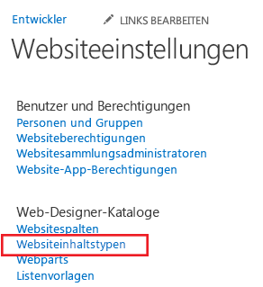
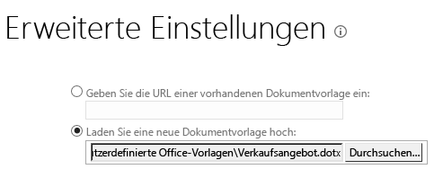
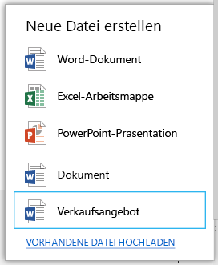

# Angeben einer Vorlage für eine Dokumentbibliothek in einem Cloud-Business-Add-InProvide a template for a document library in a cloud business add-in
Zusätzlich zu den Office-Vorlagen, die beim Hinzufügen eines Dokuments zu einer SharePoint-Dokumentbibliothek verfügbar sind, können Sie auch Ihre eigenen Vorlagen verwenden. Sie haben möglicherweise Ihre eigene Verkaufsangebotsvorlage, die Sie verwenden möchten, wenn neue Aufträge hinzugefügt werden.In addition to the Office templates that are available when you add a document to a SharePoint document library, you can provide your own templates. For example, you might have your own sales quote template that you want to use when new orders are added.
 

 **Hinweis** Der Name „Apps für SharePoint“ wird in „SharePoint-Add-Ins“ geändert. Während des Übergangszeitraums wird in der Dokumentation und der Benutzeroberfläche einiger SharePoint-Produkte und Visual Studio-Tools möglicherweise weiterhin der Begriff „Apps für SharePoint“ verwendet. Weitere Informationen finden Sie unter [Neuer Name für Office- und SharePoint-Apps](new-name-for-apps-for-sharepoint.md#bk_newname).**Note**  The name "apps for SharePoint" is changing to "SharePoint Add-ins". During the transition, the documentation and the UI of some SharePoint products and Visual Studio tools might still use the term "apps for SharePoint". For details, see  [New name for apps for Office and SharePoint](new-name-for-apps-for-sharepoint.md#bk_newname).
 

## 

Wenn Sie dies noch nicht getan haben, ordnen Sie Ihrem Cloud-Business-Add-In eine Dokumentbibliothek hinzu. Weitere Informationen finden Sie unter [Zuordnen einer Dokumentbibliothek zu einer Entität](associate-a-document-library-with-an-entity.md).If you haven't already done so, associate a document library with your cloud business add-in. See  [Associate a document library with an entity](associate-a-document-library-with-an-entity.md).
 

 

### So fügen Sie eine Vorlage hinzuTo add a template

1. Wechseln Sie zu Ihrer SharePoint-Entwicklerwebsite, und klicken Sie anschließend auf der Seite **Entwickler** auf **Websiteinhalte**.Go to your SharePoint developer site and on the  **Developer** page, choose **Site Contents**.
    
 
2. Klicken Sie auf der Seite **Websiteinhalte** auf **Einstellungen**, wie in Abbildung 1 dargestellt.On the  **Site Contents** page, choose **Settings**, as shown in Figure 1.
    
    **Abbildung 1. Der Link „Einstellungen“****Figure 1. The Settings link**

 

  
 

 

 
3. Klicken Sie auf der Seite **Websiteeinstellungen** in der Liste **Web-Designer-Kataloge** auf **Websiteinhaltstypen**, wie in Abbildung 2 dargestellt.On the  **Site Settings** page, in the **Web Designer Galleries** list, choose **Site content types**, as shown in Figure 2.
    
    **Abbildung 2. Der Link „Websiteinhaltstypen“****Figure 2. The Site content types link**

 

  
 

 

 
4. Klicken Sie auf der Seite **Websiteinhaltstypen** auf **Erstellen**, wie in Abbildung 3 dargestellt.On the  **Site Content Types** page, choose **Create**, as shown in Figure 3.
    
    **Abbildung 3. Der Link „Erstellen“****Figure 3. The Create link**

 

  
 

 

 
5. Geben Sie auf der Seite **Neuer Websiteinhaltstyp** einen Namen und eine Beschreibung für Ihre Vorlage ein. Wählen Sie bei **Übergeordneter Inhaltstyp** **Dokumentinhaltstyp** und **Dokument** aus, wie in Abbildung 4 dargestellt.On the  **New Site Content Type** page, enter a name and description for your template. For the **Parent Content Type**, choose  **Document Content Types** and **Document**, as shown in Figure 4.
    
    **Abbilgung 4. Auswahloptionen für „Übergeordneter Inhaltstyp“****Figure 4. Parent content type selections**

 

  
 

 

 
6. Klicken Sie im Abschnitt **Gruppe** in der Liste **Vorhandene Gruppe** auf **Dokumentinhaltstypen**, wie in Abbildung 5 dargestellt, und anschließend auf **OK**.In the  **Group** section, in the **Existing group** list, choose **Document Content Types** as shown in Figure 5, and then choose **OK**.
    
    **Abbildung 5. Gruppeneinstellung****Figure 5. Group setting**

 

  
 

 

 
7. Klicken Sie auf der Seite **Websiteinhaltstyp** auf **Erweiterte Einstellungen**.On the  **Site Content Type** page, choose **Advanced settings**.
    
 
8. Geben Sie auf der Seite **Erweiterte Einstellungen** entweder die URL einer vorhandenen Dokumentvorlage ein oder laden Sie eine neue Dokumentvorlage hoch, wie in Abbildung 6 dargestellt, und klicken Sie anschließend auf **OK**.On the  **Advanced Settings** page, either enter the URL of an existing document template or upload a new document template as shown in Figure 6, and then choose **OK**.
    
    **Abbildung 6. Angeben der Dokumentvorlage****Figure 6. Specify the document template**

 

  
 

 

 
9. Wechseln Sie zur Seite **Websiteinhalte**, klicken Sie auf Ihre Dokumentbibliothek, und wechseln Sie dann auf die Seite **Einstellungen**.Go to the  **Site Contents** page and choose your document library, and then go to the **Settings** page.
    
 
10. Klicken Sie auf der Seite **Einstellungen** auf **Aus vorhandenen Websiteinhaltstypen hinzufügen**.On the  **Settings** page, choose **Add from existing site content types**.
    
 
11. Fügen Sie Ihre Vorlage auf der Seite **Inhaltstypen hinzufügen** wie in Abbildung 7 dargestellt hinzu, und klicken Sie anschließend auf **OK**.On the  **Add Content Types** page, add your template as shown in Figure 7, and then choose **OK**.
    
    **Abbildung 7. Hinzufügen der Vorlage****Figure 7. Adding the template**

 

  
 

 

 
12. Führen Sie Ihr Add-In aus, und fügen Sie ein Dokument hinzu. Ihre Vorlage sollte im Dialogfeld **Neue Datei erstellen** angezeigt werden, wie in Abbildung 8 dargestellt.Run your add-in and add a document. You should see your template in the  **Create a new file** dialog box, as shown in Figure 8.
    
    **Abbildung 8. Das Dialogfeld „Neue Datei erstellen“ mit der neuen Vorlage****Figure 8. The Create a new file dialog box with the new template**

 

  
 

 

 

## Zusätzliche RessourcenAdditional resources

-  [Entwickeln von Cloud-Business-Add-InsDevelop cloud business add-ins](develop-cloud-business-add-ins.md)
    
 
-  [Zuordnen einer Dokumentbibliothek zu einer EntitätAssociate a document library with an entity](associate-a-document-library-with-an-entity.md)
    
 

